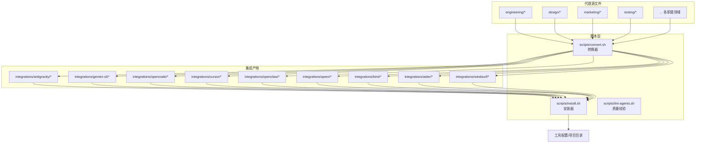
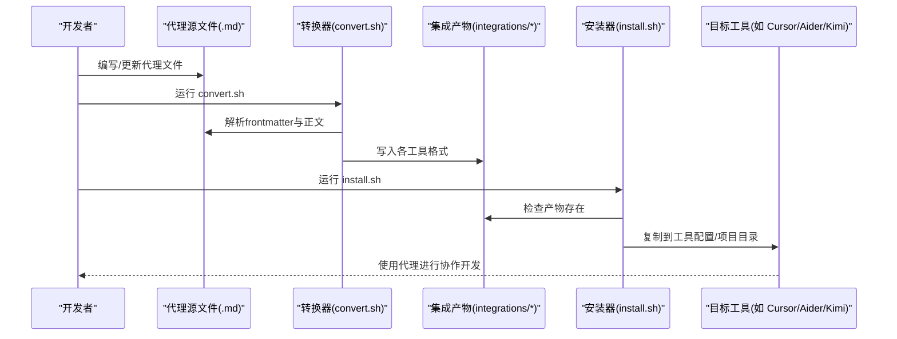
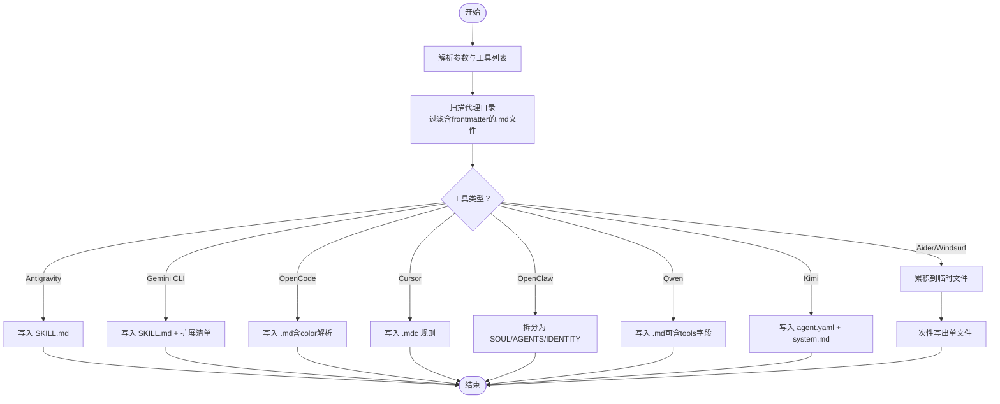
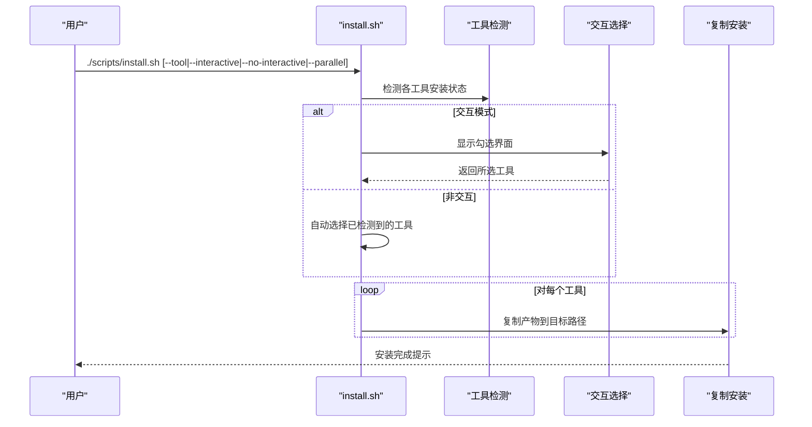
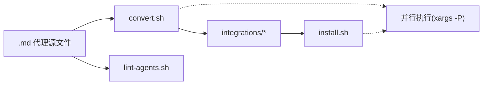

# 系统设计

<cite>
**本文引用的文件**
- [README.md](file://README.md)
- [scripts/convert.sh](file://scripts/convert.sh)
- [scripts/install.sh](file://scripts/install.sh)
- [scripts/lint-agents.sh](file://scripts/lint-agents.sh)
- [CONTRIBUTING.md](file://CONTRIBUTING.md)
- [integrations/README.md](file://integrations/README.md)
- [engineering/engineering-frontend-developer.md](file://engineering/engineering-frontend-developer.md)
- [design/design-ui-designer.md](file://design/design-ui-designer.md)
- [testing/testing-reality-checker.md](file://testing/testing-reality-checker.md)
</cite>

## 目录
1. [简介](#简介)
2. [项目结构](#项目结构)
3. [核心组件](#核心组件)
4. [架构总览](#架构总览)
5. [详细组件分析](#详细组件分析)
6. [依赖关系分析](#依赖关系分析)
7. [性能考量](#性能考量)
8. [故障排查指南](#故障排查指南)
9. [结论](#结论)
10. [附录](#附录)

## 简介
本项目旨在为多款“智能体编码工具”（如 Claude Code、GitHub Copilot、Antigravity、Gemini CLI、OpenCode、Cursor、Aider、Windsurf、OpenClaw、Qwen Code、Kimi Code）提供统一的“代理文件格式标准化与转换系统”。通过一套标准化的 Markdown 代理模板与两套脚本（转换与安装），实现：
- 代理文件格式标准化：统一的 YAML frontmatter 与结构化正文，确保跨工具一致性。
- 转换系统：将标准代理文件批量转换为各工具所需的特定格式。
- 安装系统：自动检测用户环境并把转换后的文件安装到对应工具的配置或项目目录中。
- 质量保证系统：提供 lint 校验与安装前检查，保障生成文件的质量与可用性。

该系统采用模块化与插件式架构：新增工具只需在转换器中增加一个“工具转换器”，并在安装器中增加一个“安装器”，即可无缝接入。

## 项目结构
仓库采用“按职能领域划分”的模块化组织方式，每个领域下包含若干代理文件；同时提供 scripts 目录下的三类脚本用于转换、安装与质量校验；integrations 目录存放转换产物，供工具直接使用。

图表来源
- [scripts/convert.sh:1-639](file://scripts/convert.sh#L1-L639)
- [scripts/install.sh:1-640](file://scripts/install.sh#L1-L640)
- [integrations/README.md:1-209](file://integrations/README.md#L1-L209)

章节来源
- [README.md:508-798](file://README.md#L508-L798)
- [integrations/README.md:1-209](file://integrations/README.md#L1-L209)

## 核心组件
- 代理文件格式标准化
  - 统一的 YAML frontmatter 字段：name、description、color（可选 emoji、vibe、services 等）。
  - 结构化正文：Persona（身份/记忆/沟通风格/规则）与 Operations（使命/交付物/工作流/度量/高级能力）两大块，便于自动拆分与转换。
- 转换系统（convert.sh）
  - 扫描所有代理目录，解析 frontmatter 与正文，按工具规范输出到 integrations/<tool>/。
  - 支持并行转换（--parallel），并为部分工具生成扩展清单（如 Gemini CLI 的 manifest）。
- 安装系统（install.sh）
  - 自动检测已安装工具，交互式或非交互式选择目标工具，将转换产物复制到对应路径。
  - 支持并行安装，避免重复输出与并发冲突。
- 质量保证系统（lint-agents.sh）
  - 校验 frontmatter 存在与完整性、推荐节缺失警告、正文长度等。
  - 作为 CI 前置检查，确保上游代理质量。

章节来源
- [CONTRIBUTING.md:81-240](file://CONTRIBUTING.md#L81-L240)
- [scripts/convert.sh:1-639](file://scripts/convert.sh#L1-L639)
- [scripts/install.sh:1-640](file://scripts/install.sh#L1-L640)
- [scripts/lint-agents.sh:1-117](file://scripts/lint-agents.sh#L1-L117)

## 架构总览
系统采用“源文件 → 转换 → 集成产物 → 安装 → 工具使用”的流水线式架构，强调：
- 分层清晰：源文件层、转换层、产物层、安装层、工具层。
- 插件化：每新增一个工具，只需在转换器与安装器中添加对应适配器。
- 可观测与可扩展：并行执行、进度条、颜色输出、错误提示与回退策略。

图表来源
- [scripts/convert.sh:521-639](file://scripts/convert.sh#L521-L639)
- [scripts/install.sh:515-640](file://scripts/install.sh#L515-L640)

## 详细组件分析

### 组件A：转换系统（convert.sh）
- 设计要点
  - 模块化转换器：针对不同工具（Antigravity、Gemini CLI、OpenCode、Cursor、OpenClaw、Qwen、Kimi、Aider、Windsurf）分别实现转换函数，统一入口 run_conversions 驱动。
  - 前言解析与正文剥离：get_field/get_body 提取 frontmatter 字段与正文，slugify 生成安全文件名。
  - 并行优化：当工具集全量运行时，对独立输出目录的工具（antigravity/gemini-cli/opencode/cursor/openclaw/qwen）并行执行，缓冲输出以保持顺序一致性。
  - 单文件聚合：Aider/Windsurf 采用临时文件累积后一次性写出，减少多次 IO。
- 关键流程
  - 参数解析与工具校验
  - 遍历代理目录，过滤带 frontmatter 的文件
  - 调用对应转换器写入 integrations/<tool>/
  - 对 Gemini CLI 写出扩展清单；对 Aider/Windsurf 写出单文件
- 性能与可靠性
  - 并行作业数默认取 nproc 或 sysctl -n hw.ncpu，可通过 --jobs 调整
  - 使用临时目录与环境变量隔离并行子进程输出
  - 错误处理：未知工具、缺少输出目录、并行缓冲失败等均有明确提示

图表来源
- [scripts/convert.sh:109-408](file://scripts/convert.sh#L109-L408)
- [scripts/convert.sh:482-636](file://scripts/convert.sh#L482-L636)

章节来源
- [scripts/convert.sh:1-639](file://scripts/convert.sh#L1-L639)

### 组件B：安装系统（install.sh）
- 设计要点
  - 工具检测：通过命令是否存在或配置目录是否存在判断工具是否安装。
  - 交互式选择：在终端中提供勾选 UI，支持全选/全不选/仅检测到的快捷键。
  - 并行安装：通过环境变量与子进程隔离，避免输出交错；非并行模式逐个显示进度。
  - 项目级与用户级区分：OpenCode、Cursor、Aider、Windsurf 为项目级，其余多为用户级。
- 关键流程
  - 校验 integrations/ 是否存在
  - 自动检测或交互选择工具
  - 调用对应安装器复制文件
  - 对 OpenClaw 注册工作空间并提示重启网关
- 错误处理
  - 未找到 integrations/ 时提示先运行 convert.sh
  - 已存在目标文件时给出警告（避免覆盖）

图表来源
- [scripts/install.sh:125-162](file://scripts/install.sh#L125-L162)
- [scripts/install.sh:184-293](file://scripts/install.sh#L184-L293)
- [scripts/install.sh:496-510](file://scripts/install.sh#L496-L510)

章节来源
- [scripts/install.sh:1-640](file://scripts/install.sh#L1-L640)

### 组件C：质量保证系统（lint-agents.sh）
- 设计要点
  - 必填 frontmatter 校验：name、description、color
  - 推荐节缺失告警：Identity、Core Mission、Critical Rules
  - 正文长度告警：少于阈值（字数）的文件给出警告
- 适用场景
  - 本地开发阶段快速发现模板遗漏
  - CI 中作为前置检查，阻断低质量代理进入转换/安装流程

章节来源
- [scripts/lint-agents.sh:1-117](file://scripts/lint-agents.sh#L1-L117)
- [CONTRIBUTING.md:81-240](file://CONTRIBUTING.md#L81-L240)

### 组件D：代理文件格式标准化
- 设计要点
  - 统一 frontmatter 字段：name、description、color（可选 emoji、vibe、services）
  - 结构化正文：Persona 与 Operations 两大块，便于 OpenClaw 拆分与其它工具识别
  - 示例参考：前端开发、UI 设计、质量评估等代理文件展示了完整的模板结构与最佳实践
- 价值
  - 降低工具间差异，提升可移植性
  - 为自动化转换与安装提供稳定输入

章节来源
- [CONTRIBUTING.md:81-240](file://CONTRIBUTING.md#L81-L240)
- [engineering/engineering-frontend-developer.md:1-225](file://engineering/engineering-frontend-developer.md#L1-L225)
- [design/design-ui-designer.md:1-383](file://design/design-ui-designer.md#L1-L383)
- [testing/testing-reality-checker.md:1-237](file://testing/testing-reality-checker.md#L1-L237)

## 依赖关系分析
- 转换器依赖
  - 代理源文件：需要标准 frontmatter 与结构化正文
  - Bash 工具链：awk/sed/date/find/xargs 等
  - 并行执行：xargs -P、mktemp、环境变量隔离
- 安装器依赖
  - 转换器产物：integrations/<tool> 下的文件结构
  - 工具检测：命令是否存在、配置目录是否存在
  - 并行执行：xargs -P、环境变量隔离
- 质量保证依赖
  - 代理源文件：frontmatter 与正文格式

图表来源
- [scripts/convert.sh:521-639](file://scripts/convert.sh#L521-L639)
- [scripts/install.sh:515-640](file://scripts/install.sh#L515-L640)
- [scripts/lint-agents.sh:1-117](file://scripts/lint-agents.sh#L1-L117)

章节来源
- [scripts/convert.sh:1-639](file://scripts/convert.sh#L1-L639)
- [scripts/install.sh:1-640](file://scripts/install.sh#L1-L640)
- [scripts/lint-agents.sh:1-117](file://scripts/lint-agents.sh#L1-L117)

## 性能考量
- 并行执行
  - 转换与安装均支持 --parallel 与 --jobs，利用多核 CPU 加速
  - 默认并行度：nproc（Linux）或 sysctl -n hw.ncpu（macOS），若不可用则默认 4
- I/O 优化
  - 转换阶段：对独立输出目录的工具并行写入，减少锁竞争
  - 安装阶段：并行复制，避免重复遍历
- 输出控制
  - 进度条与颜色输出，便于在长任务中观察状态
- 注意事项
  - 并行模式下输出顺序可能变化，但通过缓冲与环境变量隔离避免交错
  - 单文件聚合（Aider/Windsurf）减少多次 IO，提高吞吐

章节来源
- [scripts/convert.sh:75-81](file://scripts/convert.sh#L75-L81)
- [scripts/convert.sh:566-590](file://scripts/convert.sh#L566-L590)
- [scripts/install.sh:114-120](file://scripts/install.sh#L114-L120)
- [scripts/install.sh:606-616](file://scripts/install.sh#L606-L616)

## 故障排查指南
- 问题：运行 install.sh 报错 integrations/ 不存在
  - 原因：未先运行 convert.sh 生成集成产物
  - 处理：先执行 convert.sh，再运行 install.sh
- 问题：安装器提示某工具未检测到，但实际已安装
  - 原因：检测逻辑基于命令或配置目录存在性
  - 处理：使用 --tool 指定工具，或手动确认命令/目录路径
- 问题：并行安装/转换输出交错或顺序异常
  - 原因：并行执行导致输出并发
  - 处理：接受非确定性顺序；必要时关闭并行
- 问题：代理文件缺少必填字段或正文过短
  - 原因：lint 校验失败
  - 处理：根据 lint 输出补充 frontmatter 与正文内容

章节来源
- [scripts/install.sh:125-130](file://scripts/install.sh#L125-L130)
- [scripts/lint-agents.sh:33-79](file://scripts/lint-agents.sh#L33-L79)

## 结论
本系统通过“标准化代理文件 + 转换器 + 安装器 + 质量保证”的组合，实现了从代理源文件到多工具特定格式的高效转换与安装，并具备良好的扩展性与可观测性。其模块化与插件式设计使得新增工具成本极低，只需在转换器与安装器中添加适配器即可。建议在团队内推广使用 convert.sh + install.sh 的流水线，并结合 lint-agents.sh 作为 CI 前置校验，持续提升代理质量与一致性。

## 附录
- 代理文件模板与设计原则参见贡献指南
- 工具支持与安装说明参见 integrations/README.md 与 README.md 的多工具集成章节

章节来源
- [CONTRIBUTING.md:81-240](file://CONTRIBUTING.md#L81-L240)
- [integrations/README.md:1-209](file://integrations/README.md#L1-L209)
- [README.md:508-798](file://README.md#L508-L798)