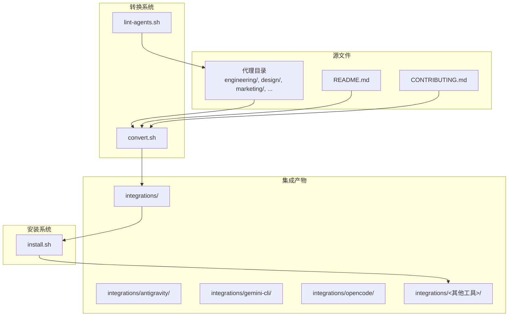
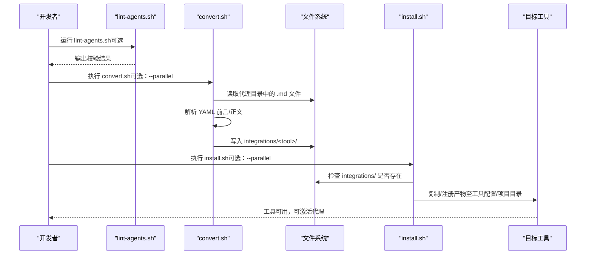
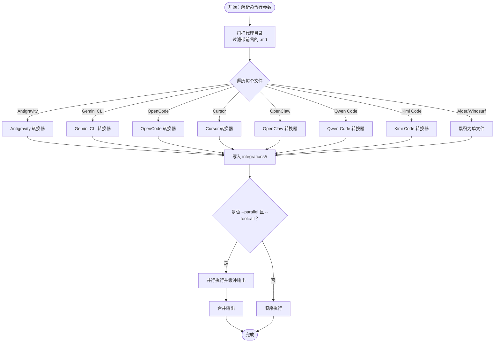
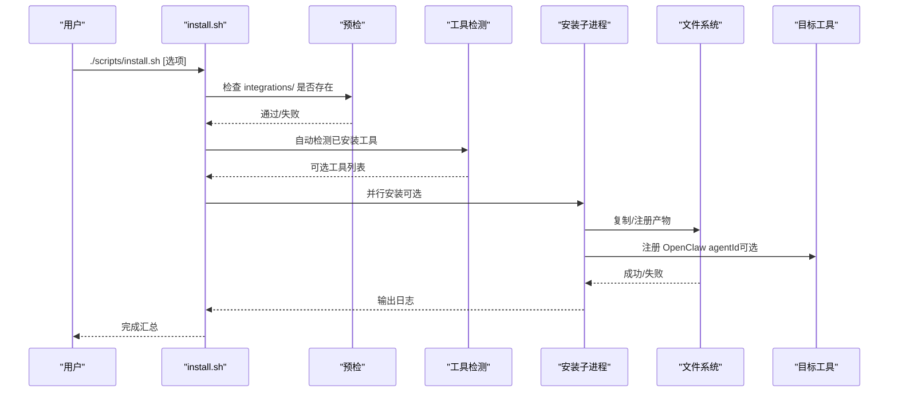
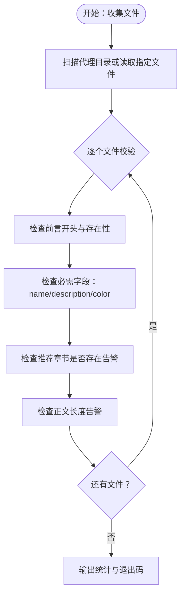
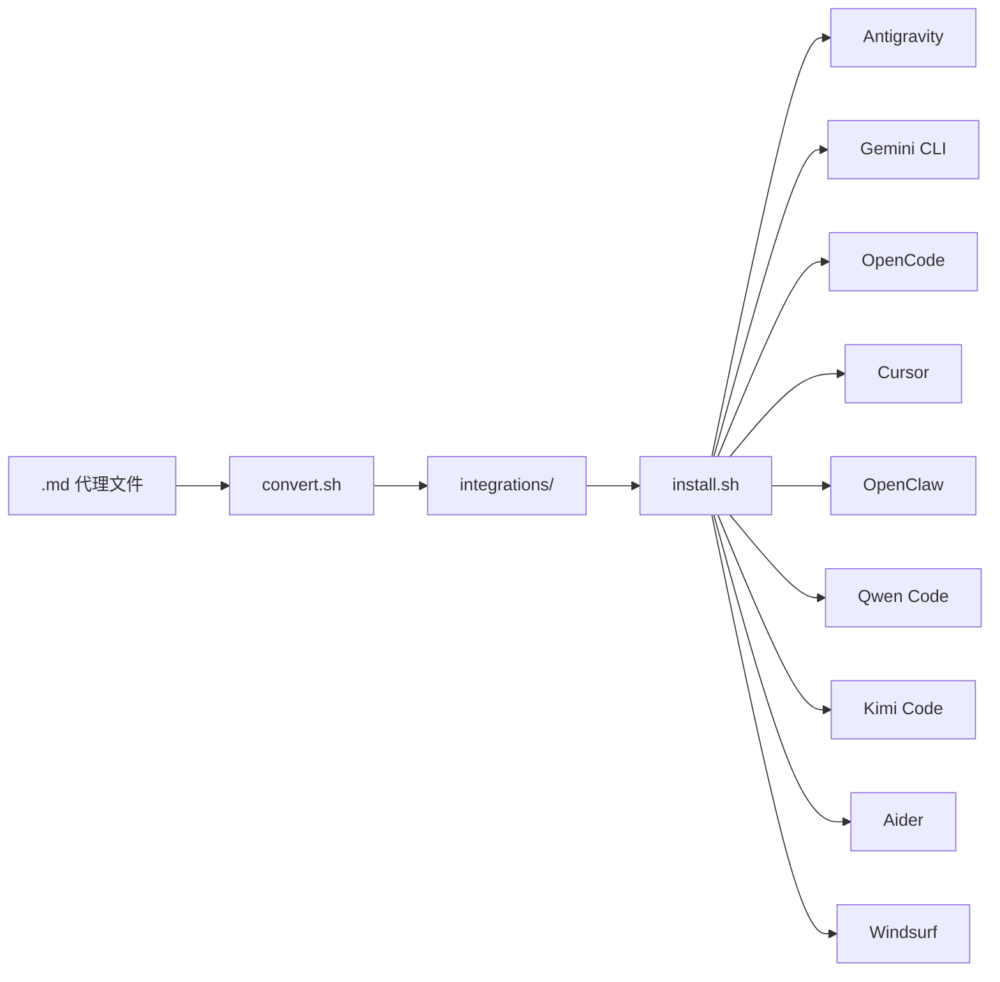

# 组件交互关系

<cite>
**本文引用的文件**
- [convert.sh](file://scripts/convert.sh)
- [install.sh](file://scripts/install.sh)
- [lint-agents.sh](file://scripts/lint-agents.sh)
- [README.md](file://README.md)
- [CONTRIBUTING.md](file://CONTRIBUTING.md)
- [integrations/README.md](file://integrations/README.md)
- [integrations/antigravity/README.md](file://integrations/antigravity/README.md)
- [integrations/gemini-cli/README.md](file://integrations/gemini-cli/README.md)
- [integrations/opencode/README.md](file://integrations/opencode/README.md)
- [engineering-frontend-developer.md](file://engineering/engineering-frontend-developer.md)
- [design-ui-designer.md](file://design/design-ui-designer.md)
- [marketing-reddit-community-builder.md](file://marketing/marketing-reddit-community-builder.md)
</cite>

## 目录
1. [简介](#简介)
2. [项目结构](#项目结构)
3. [核心组件](#核心组件)
4. [架构总览](#架构总览)
5. [详细组件分析](#详细组件分析)
6. [依赖分析](#依赖分析)
7. [性能考量](#性能考量)
8. [故障排查指南](#故障排查指南)
9. [结论](#结论)
10. [附录](#附录)

## 简介
本文件聚焦于 agency-agents 项目中“代理文件”“转换系统”“安装系统”的组件交互关系与数据流控制流。目标是：
- 解释从代理源文件（Markdown，含 YAML 前言）到各工具特定格式的完整转换流程
- 说明文件扫描、格式验证、工具适配、安装部署的步骤与顺序
- 描述组件间依赖关系、调用时序、并行处理机制、并发冲突与状态同步策略
- 提供流程图与时序图，帮助非技术读者理解整体工作流

## 项目结构
项目采用“按职能分类”的目录组织方式，代理文件分布在多个领域目录下；转换与安装脚本位于 scripts 目录；集成产物输出在 integrations 目录；README 提供使用说明与多工具集成指引。

图表来源
- [convert.sh:64-67](file://scripts/convert.sh#L64-L67)
- [install.sh:102-104](file://scripts/install.sh#L102-L104)
- [integrations/README.md:1-20](file://integrations/README.md#L1-L20)

章节来源
- [README.md:508-590](file://README.md#L508-L590)
- [integrations/README.md:1-20](file://integrations/README.md#L1-L20)

## 核心组件
- 代理源文件：标准 Markdown 文件，包含 YAML 前言字段（name、description、color 等），正文为“身份/记忆”“使命/操作”等结构化内容。
- 转换系统：convert.sh 将源文件扫描、解析前言、提取正文、按工具规则生成集成产物，并支持并行转换。
- 安装系统：install.sh 检查集成产物、检测本地工具环境、复制/注册产物到对应工具配置目录或项目根目录。
- 质检脚本：lint-agents.sh 对代理文件进行基础校验（前言完整性、推荐章节存在性、正文长度等）。

章节来源
- [CONTRIBUTING.md:81-151](file://CONTRIBUTING.md#L81-L151)
- [lint-agents.sh:13-28](file://scripts/lint-agents.sh#L13-L28)

## 架构总览
从“源文件”到“工具可用”的端到端流程如下：

图表来源
- [convert.sh:482-517](file://scripts/convert.sh#L482-L517)
- [install.sh:515-637](file://scripts/install.sh#L515-L637)
- [integrations/README.md:40-46](file://integrations/README.md#L40-L46)

## 详细组件分析

### 转换系统（convert.sh）
职责与流程要点：
- 扫描代理目录（如 engineering、design、marketing 等），过滤带 YAML 前言的 .md 文件
- 读取前言字段（name、description、color 等），提取正文体
- 针对每个目标工具执行专用转换器：
  - Antigravity：生成 SKILL.md，前言包含 name、description、risk、source、date_added
  - Gemini CLI：生成 gemini-extension.json 与 skills/<slug>/SKILL.md
  - OpenCode：生成 .opencode/agents/<slug>.md，映射颜色名到十六进制
  - Cursor：生成 .cursor/rules/<slug>.mdc，包含 description、globs、alwaysApply
  - OpenClaw：拆分正文为 SOUL.md（身份/记忆/边界）、AGENTS.md（任务/交付物/流程）、IDENTITY.md（头像/名称/气质）
  - Qwen Code：生成 ~/.qwen/agents/<slug>.md，含 name、description（可选 tools）
  - Kimi Code：生成 ~/.config/kimi/agents/<slug>/agent.yaml 与 system.md
  - Aider/Windsurf：累积为单文件，最后写入 integrations/aider/CONVENTIONS.md 与 integrations/windsurf/.windsurfrules
- 并行模式：当 --tool=all 时，独立工具并行执行，输出缓冲以保持每工具输出顺序稳定
- 并发与状态：
  - 使用 xargs -P 并发执行子进程，通过临时目录缓冲输出
  - 通过环境变量传递脚本路径与输出目录，避免交叉污染
- 错误与健壮性：
  - 严格检查工具参数合法性
  - 对未知工具报错并退出
  - 对缺少 integrations/ 的情况给出明确提示

图表来源
- [convert.sh:521-636](file://scripts/convert.sh#L521-L636)
- [convert.sh:109-408](file://scripts/convert.sh#L109-L408)
- [convert.sh:566-590](file://scripts/convert.sh#L566-L590)

章节来源
- [convert.sh:9-28](file://scripts/convert.sh#L9-L28)
- [convert.sh:482-517](file://scripts/convert.sh#L482-L517)
- [convert.sh:566-590](file://scripts/convert.sh#L566-L590)

### 安装系统（install.sh）
职责与流程要点：
- 预检：确保 integrations/ 存在，否则提示先运行 convert.sh
- 自动检测：扫描本地已安装工具，生成可交互选择列表或非交互自动安装
- 逐工具安装：
  - Claude Code/Copilot：直接复制 .md 到各自 agents 目录
  - Antigravity：复制 SKILL.md 到 ~/.gemini/antigravity/skills/
  - Gemini CLI：复制扩展清单与技能目录到 ~/.gemini/extensions/agency-agents/
  - OpenCode/Cursor/Aider/Windsurf/Qwen/Kimi：复制到项目根或用户级配置目录
  - OpenClaw：复制 SOUL/AGENTS/IDENTITY 并尝试通过 openclaw 命令注册
- 并行模式：通过环境变量 AGENCY_INSTALL_WORKER=1 让子进程仅执行安装逻辑，避免重复输出；父进程收集缓冲输出
- 交互式 UI：在终端环境下显示工具检测状态与安装进度条
- 错误与提示：对缺失文件、已存在目标、项目作用域工具给出明确警告

图表来源
- [install.sh:515-637](file://scripts/install.sh#L515-L637)
- [install.sh:125-130](file://scripts/install.sh#L125-L130)
- [install.sh:147-162](file://scripts/install.sh#L147-L162)
- [install.sh:496-510](file://scripts/install.sh#L496-L510)

章节来源
- [install.sh:9-31](file://scripts/install.sh#L9-L31)
- [install.sh:515-637](file://scripts/install.sh#L515-L637)

### 质检系统（lint-agents.sh）
职责与流程要点：
- 收集待校验文件（可指定文件或扫描代理目录）
- 校验项：
  - 前言开头必须为 "---"
  - 前言块不能为空且必须包含 name、description、color
  - 推荐章节（Identity/Core Mission/Critical Rules）缺失仅告警
  - 正文字数过少（<50词）告警
- 输出统计并根据错误数决定退出码

图表来源
- [lint-agents.sh:33-79](file://scripts/lint-agents.sh#L33-L79)
- [lint-agents.sh:81-117](file://scripts/lint-agents.sh#L81-L117)

章节来源
- [lint-agents.sh:1-117](file://scripts/lint-agents.sh#L1-L117)

### 代理文件结构与工具适配
- 通用结构：YAML 前言 + 主体段落（Identity/Memory、Core Mission、Critical Rules、Technical Deliverables、Workflow、Communication、Learning、Success Metrics、Advanced Capabilities 等）
- OpenClaw 适配：convert.sh 依据标题关键字将正文拆分为 SOUL/AGENTS/IDENTITY 三文件
- Qwen Code 适配：convert.sh 生成 .md，前言仅 name/description（可选 tools），正文支持模板变量
- Cursor 适配：convert.sh 生成 .mdc，包含 description、globs、alwaysApply
- OpenCode 适配：convert.sh 将命名颜色映射为十六进制，添加 mode: subagent
- Gemini CLI 适配：convert.sh 生成 gemini-extension.json 与 skills/<slug>/SKILL.md
- Antigravity 适配：convert.sh 生成 agency-<slug>/SKILL.md，前言包含 risk/source/date_added

章节来源
- [CONTRIBUTING.md:81-174](file://CONTRIBUTING.md#L81-L174)
- [convert.sh:109-408](file://scripts/convert.sh#L109-L408)
- [convert.sh:595-612](file://scripts/convert.sh#L595-L612)

## 依赖分析
- 转换系统依赖：
  - 代理源文件（YAML 前言 + 正文）
  - 工具特定转换器函数（Antigravity/Gemini/OpenCode/Cursor/OpenClaw/Qwen/Kimi/Aider/Windsurf）
  - 并行执行框架（xargs -P）与临时输出缓冲
- 安装系统依赖：
  - 转换系统生成的 integrations/ 目录
  - 本地工具检测（命令是否存在、配置目录是否存在）
  - 各工具的安装目标路径（用户级/项目级）

图表来源
- [convert.sh:64-67](file://scripts/convert.sh#L64-L67)
- [install.sh:102-104](file://scripts/install.sh#L102-L104)

章节来源
- [convert.sh:521-636](file://scripts/convert.sh#L521-L636)
- [install.sh:515-637](file://scripts/install.sh#L515-L637)

## 性能考量
- 并行转换与安装：
  - convert.sh 在 --tool=all 时对独立工具并行执行，使用临时目录缓冲输出，避免交叉干扰
  - install.sh 在 --parallel 时同样使用子进程并行安装，通过环境变量隔离输出
- 并发冲突与状态同步：
  - 通过临时输出目录与环境变量隔离子进程状态
  - 并行模式下不保证跨工具输出顺序，但保证每工具内部顺序
- I/O 优化：
  - 批量 find + sort -z 减少子进程开销
  - 单文件累积（Aider/Windsurf）减少磁盘写入次数
- 建议：
  - 在多核机器上优先使用 --parallel 与 --jobs N
  - CI 环境建议使用 --no-interactive 与 --parallel 以提升吞吐

章节来源
- [convert.sh:566-590](file://scripts/convert.sh#L566-L590)
- [install.sh:600-626](file://scripts/install.sh#L600-L626)

## 故障排查指南
- integrations/ 缺失
  - 现象：install.sh 报错提示需要先运行 convert.sh
  - 处理：先执行 convert.sh 生成集成产物
- 代理文件格式错误
  - 现象：lint-agents.sh 报告缺失前言、字段或正文过短
  - 处理：补齐 YAML 前言字段与正文内容
- 已存在目标文件
  - 现象：install.sh 对 Aider/Windsurf 提示目标已存在
  - 处理：删除已有文件后重试，或改用非交互模式覆盖
- 工具未检测到
  - 现象：install.sh 显示工具未找到
  - 处理：确认工具已安装或配置目录存在；必要时使用 --tool 指定工具
- OpenClaw 注册失败
  - 现象：安装后需重启网关或注册命令返回失败
  - 处理：手动运行 openclaw 命令注册，或参考提示重启网关

章节来源
- [install.sh:125-130](file://scripts/install.sh#L125-L130)
- [install.sh:428-438](file://scripts/install.sh#L428-L438)
- [install.sh:441-451](file://scripts/install.sh#L441-L451)
- [install.sh:496-510](file://scripts/install.sh#L496-L510)

## 结论
- convert.sh 与 install.sh 形成了“转换—安装”的闭环，覆盖多工具生态
- 通过并行执行与输出缓冲，显著提升大规模代理批量处理效率
- 严格的前言与正文规范配合 lint-agents.sh，保障代理质量
- OpenClaw 的拆分策略与 Qwen/Aider/Cursor 等工具的单文件聚合策略体现了“工具适配”的灵活性

## 附录
- 快速开始与多工具集成说明见 README 与 integrations/README
- 代理设计原则与模板见 CONTRIBUTING.md

章节来源
- [README.md:508-590](file://README.md#L508-L590)
- [integrations/README.md:1-20](file://integrations/README.md#L1-L20)
- [CONTRIBUTING.md:81-174](file://CONTRIBUTING.md#L81-L174)