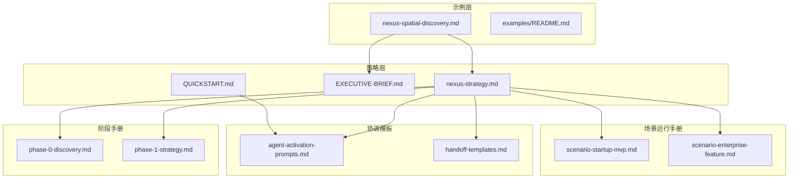
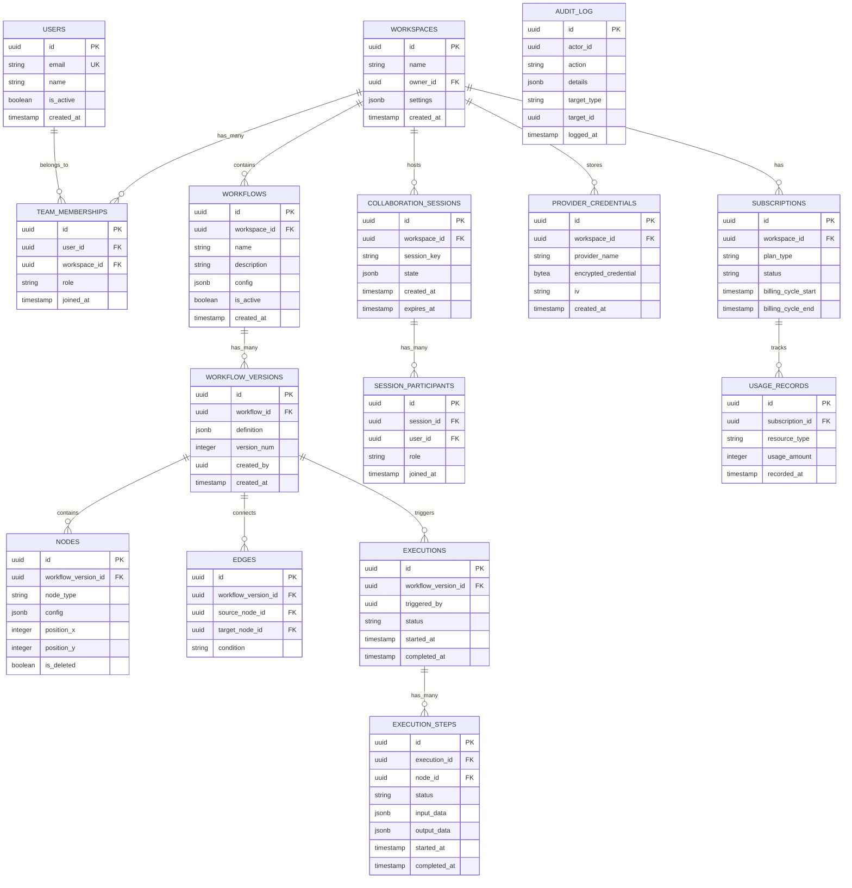
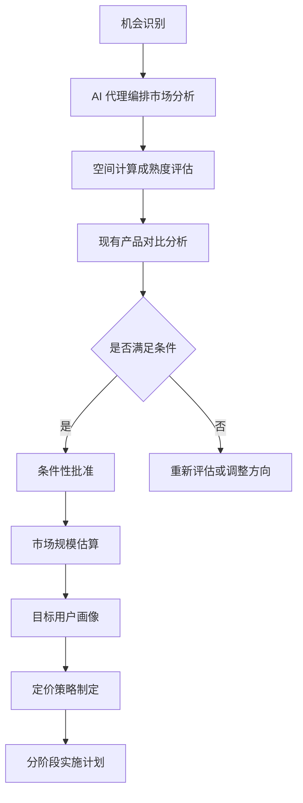
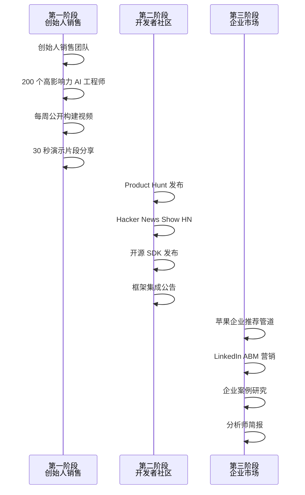
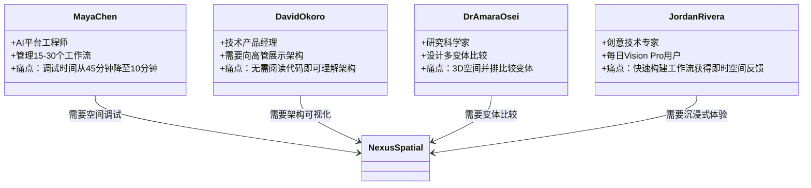
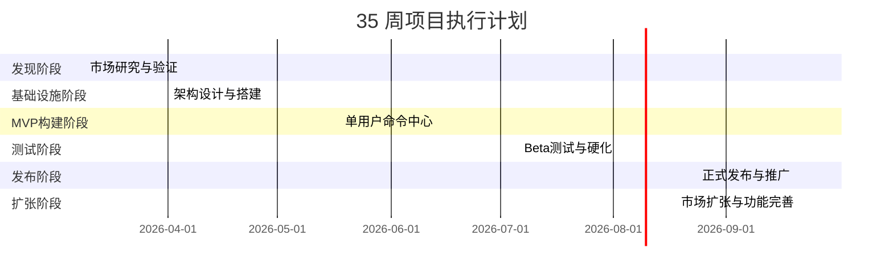
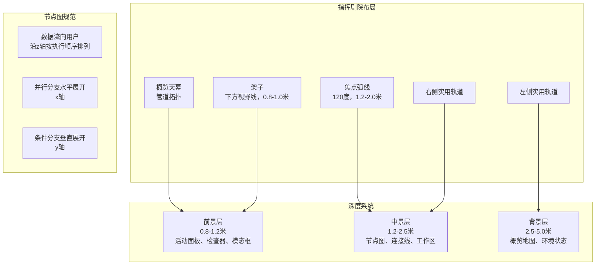
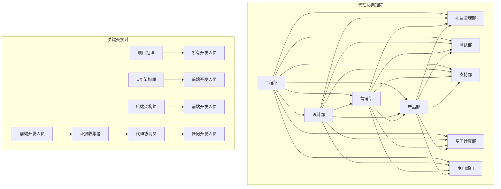
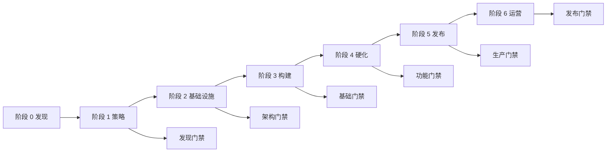
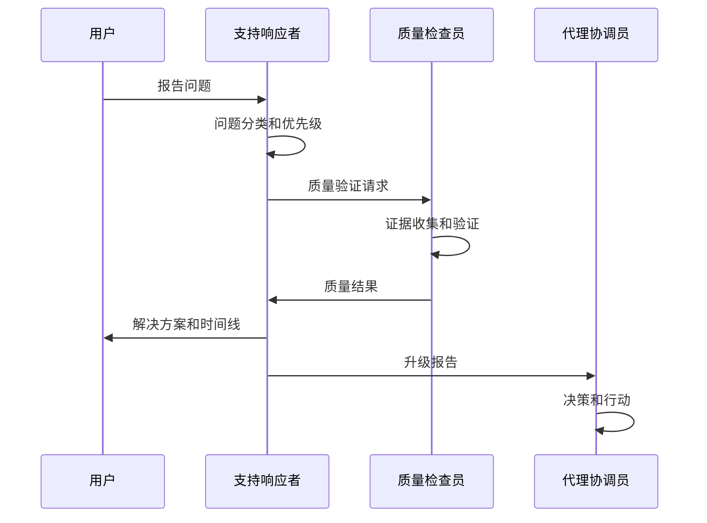

# Nexus 空间发现项目

<cite>
**本文档引用的文件**
- [nexus-spatial-discovery.md](file://examples/nexus-spatial-discovery.md)
- [nexus-strategy.md](file://strategy/nexus-strategy.md)
- [EXECUTIVE-BRIEF.md](file://strategy/EXECUTIVE-BRIEF.md)
- [README.md](file://README.md)
- [examples/README.md](file://examples/README.md)
- [phase-0-discovery.md](file://strategy/playbooks/phase-0-discovery.md)
- [phase-1-strategy.md](file://strategy/playbooks/phase-1-strategy.md)
- [agent-activation-prompts.md](file://strategy/coordination/agent-activation-prompts.md)
- [handoff-templates.md](file://strategy/coordination/handoff-templates.md)
- [scenario-startup-mvp.md](file://strategy/runbooks/scenario-startup-mvp.md)
- [scenario-enterprise-feature.md](file://strategy/runbooks/scenario-enterprise-feature.md)
- [QUICKSTART.md](file://strategy/QUICKSTART.md)
</cite>

## 目录
1. [项目简介](#项目简介)
2. [项目结构](#项目结构)
3. [核心组件](#核心组件)
4. [架构总览](#架构总览)
5. [详细组件分析](#详细组件分析)
6. [依赖关系分析](#依赖关系分析)
7. [性能考量](#性能考量)
8. [故障排除指南](#故障排除指南)
9. [结论](#结论)
10. [附录](#附录)

## 项目简介
本项目是 Nexus 空间发现的完整多代理产品发现练习，展示了 8 个代理并行协作从机会识别到综合规划的全过程。该项目聚焦于 AI 代理编排与空间计算的交汇点，构建一个沉浸式的 3D 命令中心，用于可视化、监控和交互式管理 AI 工作流。通过标准化的 NEXUS 协调机制，8 个代理在 10 分钟内完成从市场验证、技术架构、品牌策略、营销增长、客户支持、用户体验研究到 35 周项目执行计划的统一蓝图。

## 项目结构
Nexus 空间发现项目采用模块化组织方式，包含以下关键层次：
- **示例层**：完整的多代理协作示例输出
- **策略层**：NEXUS 运营手册、阶段手册、协调模板
- **执行层**：具体任务激活提示、手稿模板、场景运行手册
- **工具层**：快速启动指南、集成说明



**图表来源**
- [nexus-spatial-discovery.md:1-853](file://examples/nexus-spatial-discovery.md#L1-L853)
- [nexus-strategy.md:1-1111](file://strategy/nexus-strategy.md#L1-L1111)
- [EXECUTIVE-BRIEF.md:1-96](file://strategy/EXECUTIVE-BRIEF.md#L1-L96)

**章节来源**
- [examples/README.md:1-49](file://examples/README.md#L1-L49)
- [README.md:409-416](file://README.md#L409-L416)

## 核心组件
Nexus 空间发现项目的核心由 8 个专门代理组成，每个代理承担特定职责：

### 市场验证代理
- **产品趋势研究员**：负责市场情报收集、竞争分析、市场规模估算
- 关键产出：市场分析报告、竞争格局、TAM/SAM/SOM 分析

### 技术架构代理
- **后端架构师**：设计 8 服务架构、数据库模式、API 规范
- 关键产出：系统架构规范、数据模型、安全架构

### 品牌策略代理
- **品牌守护者**：定义品牌定位、视觉识别、命名策略
- 关键产出：品牌基础文档、视觉身份系统、品牌指南

### 增长策略代理
- **增长黑客**：制定 GTM 策略、定价方案、营销计划
- 关键产出：增长蓝图、定价策略、营销活动

### 客户支持代理
- **支持响应者**：设计支持层级、服务流程、社区运营
- 关键产出：支持蓝图、服务级别协议、社区运营

### 用户体验代理
- **UX 研究员**：用户画像、旅程地图、设计原则
- 关键产出：研究发现、用户画像、设计指导原则

### 项目管理代理
- **项目牧羊人**：项目执行计划、里程碑管理、风险管理
- 关键产出：项目执行计划、冲刺清单、风险登记册

### 空间界面代理
- **XR 界面架构师**：空间 UI 规范、交互模型、布局设计
- 关键产出：空间界面架构、节点图规范、交互模型

**章节来源**
- [nexus-spatial-discovery.md:26-52](file://examples/nexus-spatial-discovery.md#L26-L52)
- [examples/README.md:28-40](file://examples/README.md#L28-L40)

## 架构总览
Nexus 空间发现项目采用 8 服务架构设计，确保横向扩展和供应商无关的 AI 集成能力。

```mermaid
graph TB
subgraph "客户端层"
A[VisionOS 原生应用<br/>Swift/RealityKit]
B[WebXR 应用<br/>React Three Fiber]
end
subgraph "API 网关层"
C[Kong / AWS API Gateway<br/>限流、认证、WebSocket 升级]
end
subgraph "服务层"
D[认证服务]
E[工作区服务]
F[工作流服务]
G[编排引擎(Rust)]
H[协作服务(Yjs CRDT)]
I[流媒体服务(WebSocket)]
J[插件服务]
K[计费服务]
end
subgraph "数据层"
L[PostgreSQL 16]
M[Redis 7 集群]
N[S3 存储]
O[ClickHouse]
P[NATS]
end
subgraph "AI 供应商层"
Q[OpenAI]
R[Anthropic]
S[Google]
T[本地模型]
U[自定义插件]
end
A --> C
B --> C
C --> D
C --> E
C --> F
C --> G
C --> H
C --> I
C --> J
C --> K
D --> L
E --> L
F --> L
G --> L
H --> L
I --> L
J --> L
K --> L
L --> M
L --> N
L --> O
L --> P
G --> Q
G --> R
G --> S
G --> T
G --> U
```

**图表来源**
- [nexus-spatial-discovery.md:143-173](file://examples/nexus-spatial-discovery.md#L143-L173)

### 核心数据模型
项目涵盖 14 张核心表，覆盖身份访问、工作流、执行、协作、凭证、计费、审计等关键领域：



**图表来源**
- [nexus-spatial-discovery.md:187-196](file://examples/nexus-spatial-discovery.md#L187-L196)

**章节来源**
- [nexus-spatial-discovery.md:139-251](file://examples/nexus-spatial-discovery.md#L139-L251)

## 详细组件分析

### 市场验证与竞争分析
市场验证阶段采用条件性批准策略，重点关注 AI 代理编排工具的 2D 局限性和空间计算的成熟度缺口。



**图表来源**
- [nexus-spatial-discovery.md:54-136](file://examples/nexus-spatial-discovery.md#L54-L136)

市场机会特征：
- AI 代理编排工具市场价值约 135 亿美元，年复合增长率 22.3%
- 空间计算市场约 170-2200 亿美元，年复合增长率 40.95%
- 现有产品主要集中在 2D 平台，缺乏真正的空间计算体验

**章节来源**
- [nexus-spatial-discovery.md:54-136](file://examples/nexus-spatial-discovery.md#L54-L136)

### 技术架构设计
系统采用 8 服务架构，确保可扩展性和供应商无关性：

#### 服务边界设计
- **认证服务**：OAuth2 认证、API 密钥管理、MFA 支持
- **工作区服务**：团队管理、权限控制、配置管理
- **工作流服务**：DAG 工作流定义、版本控制、执行调度
- **编排引擎**：Rust 实现的高性能执行引擎，支持并发执行
- **协作服务**：基于 Yjs 的 CRDT 实现实时协作
- **流媒体服务**：WebSocket 实现实时事件推送
- **插件服务**：插件管理和扩展机制
- **计费服务**：订阅管理、使用量统计、账单生成

#### 数据存储策略
- **主数据库**：PostgreSQL 16，支持 JSONB 和行级安全
- **缓存层**：Redis 7 集群，支持高并发读写
- **消息队列**：NATS JetStream，提供精确一次传递保证
- **分析存储**：ClickHouse，优化大规模数据分析
- **对象存储**：S3，支持大文件和静态资源

**章节来源**
- [nexus-spatial-discovery.md:139-251](file://examples/nexus-spatial-discovery.md#L139-L251)

### 品牌策略与视觉识别
品牌定位为"空间 AI 运维"（SpatialAIOps），强调空间计算在 AI 工作流管理中的革命性作用。

#### 品牌个性
- **权威性**：清晰、直接、技术精确
- **沉着**：简洁设计、适度节奏、留白艺术
- **开创性**：内敛的自豪感、新范式的低调表达
- **精确性**：准确规格、真实指标、诚实要求
- **亲和性**：自然的交互语言、空间隐喻

#### 视觉系统
- **主色调**：深空靛蓝（#1B1F3B）、Nexus 蓝（#4A7BF7）
- **强调色**：信号青（#00D4FF）、命令绿（#00E676）
- **警示色**：告警琥珀（#FFB300）、关键红（#FF3D71）
- **字体系统**：Inter（UI）、JetBrains Mono（代码）、Space Grotesk（标题）

**章节来源**
- [nexus-spatial-discovery.md:253-350](file://examples/nexus-spatial-discovery.md#L253-L350)

### 增长策略与营销计划
采用三阶段增长策略，从创始人销售到开发者社区再到企业市场。



**图表来源**
- [nexus-spatial-discovery.md:352-442](file://examples/nexus-spatial-discovery.md#L352-L442)

#### 定价策略
- **探索者套餐**：免费，3 个管道，WebXR 预览
- **专业套餐**：$39/用户/月，无限管道，VisionOS
- **团队套餐**：$79/用户/月，协作功能，RBAC，SSO
- **企业套餐**：定制价格，专用基础设施，SLA

**章节来源**
- [nexus-spatial-discovery.md:352-442](file://examples/nexus-spatial-discovery.md#L352-L442)

### 客户支持运营蓝图
建立"空间指南"概念，支持代理作为可见节点存在于用户的空间工作区内。

#### 支持层级结构
- **探索者（免费）**：48 小时首响应，5 个工作日解决
- **建造者（专业）**：业务时间 4 小时响应，24 小时解决
- **指挥官（企业）**：30 分钟 P1 响应，2 小时 P2 解决

#### 自愈能力
- **无限循环检测**：CPU/令牌峰值自动终止重启
- **渲染性能监控**：帧率下降自动降低视觉保真度
- **凭据过期处理**：API 401 自动重新认证
- **通信超时恢复**：延迟异常自动重路由

**章节来源**
- [nexus-spatial-discovery.md:444-526](file://examples/nexus-spatial-discovery.md#L444-L526)

### 用户体验研究与设计方向
基于四大核心用户画像，设计空间界面架构。



**图表来源**
- [nexus-spatial-discovery.md:528-610](file://examples/nexus-spatial-discovery.md#L528-L610)

#### 设计原则
1. **空间价值**：如果 2D 更清晰，使用 2D；每个评审都问"这在 3D 中更好吗？"
2. **快速浏览**：关键信息在 2 秒内感知（颜色、大小、运动、位置）
3. **双手自由**：凝视+语音覆盖所有读取/导航操作；双手增加精度但非必需
4. **尊重认知重力**：扩展 2D 心智模型（从左到右流程），不要替换它们
5. **渐进式空间复杂性**：新用户从近似 2D 开始；随着信心增长揭示空间能力
6. **物理隐喻，数字能力**：节点"被拿起"（物理），但也可复制和版本化（数字）
7. **静默是一种特性**：健康系统感觉平静；颜色和运动表示偏离正常状态

**章节来源**
- [nexus-spatial-discovery.md:528-610](file://examples/nexus-spatial-discovery.md#L528-L610)

### 35 周项目执行计划
采用敏捷方法论，分为六个阶段，每个阶段都有明确的质量门禁。



**图表来源**
- [nexus-spatial-discovery.md:612-678](file://examples/nexus-spatial-discovery.md#L612-L678)

#### 关键里程碑
- **第 12 周**：首次端到端工作流执行（用户创建并运行 3 节点代理工作流）
- **第 19 周**：单用户代理命令中心完成
- **第 27 周**：Beta 版本发布，50-100 个测试用户
- **第 31 周**：正式发布 App Store + 网站
- **第 35 周**：插件市场推出，高级功能完善

**章节来源**
- [nexus-spatial-discovery.md:612-678](file://examples/nexus-spatial-discovery.md#L612-L678)

### 空间界面架构
设计"指挥剧院"概念，将工作区组织为围绕用户的弯曲剧院。



**图表来源**
- [nexus-spatial-discovery.md:680-800](file://examples/nexus-spatial-discovery.md#L680-L800)

#### 节点状态系统
- **空闲**：稳定的绿色边缘发光，低亮度；静态磨砂玻璃
- **排队**：1Hz 脉冲琥珀色边缘发光；微弱旋转
- **运行中**：中等蓝色边缘发光；动画闪烁
- **流式传输**：蓝色+输出流；闪烁+文本片段
- **已完成**：白色闪光后绿色；静态
- **错误**：2Hz 脉冲红色边缘发光；红色色调
- **暂停**：稳定的琥珀色边缘发光；冻结帧+暂停图标

**章节来源**
- [nexus-spatial-discovery.md:680-800](file://examples/nexus-spatial-discovery.md#L680-L800)

## 依赖关系分析

### NEXUS 协调矩阵
NEXUS 通过标准化的手稿模板和质量门禁确保代理间的无缝协作。



**图表来源**
- [nexus-strategy.md:554-594](file://strategy/nexus-strategy.md#L554-L594)

### 质量门禁体系
每个阶段都有明确的质量门禁，确保项目按标准推进。



**图表来源**
- [nexus-strategy.md:703-726](file://strategy/nexus-strategy.md#L703-L726)

**章节来源**
- [nexus-strategy.md:554-726](file://strategy/nexus-strategy.md#L554-L726)

## 性能考量
Nexus 空间发现项目在性能方面设定了严格的目标：

### 系统性能指标
- **并发代理执行**：第一年 5,000，第二年 50,000
- **WebSocket 连接**：第一年 10,000，第二年 100,000
- **API 延迟 P95**：第一年 < 150ms，第二年 < 100ms
- **WS 事件延迟 P95**：第一年 < 80ms，第二年 < 50ms

### 技术优化策略
- **编排引擎**：使用 Rust 实现亚毫秒级调度，零 GC 延迟
- **实时协作**：基于 Yjs 的 CRDT 算法，冲突自由的并发编辑
- **消息传递**：NATS JetStream 提供轻量级、精确一次传递的消息队列
- **缓存策略**：Redis 集群支持高并发读写，减少数据库压力
- **空间渲染**：RealityKit + Metal 优化，支持 100+ 节点的实时渲染

**章节来源**
- [nexus-spatial-discovery.md:235-243](file://examples/nexus-spatial-discovery.md#L235-L243)

## 故障排除指南

### 常见问题与解决方案
1. **代理协调失败**
   - 检查手稿模板完整性
   - 确认上下文连续性
   - 验证证据要求

2. **质量门禁不通过**
   - 重新评估证据质量
   - 检查验收标准
   - 进行修复循环

3. **跨代理协作问题**
   - 使用标准手稿模板
   - 确保依赖关系清晰
   - 建立反馈回路

### 应急响应流程


**图表来源**
- [nexus-strategy.md:668-700](file://strategy/nexus-strategy.md#L668-L700)

**章节来源**
- [nexus-strategy.md:668-700](file://strategy/nexus-strategy.md#L668-L700)

## 结论
Nexus 空间发现项目展示了多代理协作系统的强大潜力。通过标准化的协调机制、明确的质量门禁和严格的证据要求，8 个代理能够在 10 分钟内完成从机会识别到综合规划的完整流程。该系统的关键成功因素包括：

1. **标准化协调**：通过手稿模板和质量门禁消除协调成本
2. **证据驱动决策**：每个质量评估都需要证明，避免"幻想批准"
3. **并行执行**：4 条并行工作流压缩 40-60% 的时间
4. **Dev↔QA 循环**：持续质量检查减少后期硬化时间 50%
5. **渐进式交付**：分阶段实施降低风险并加速价值实现

这一模式为其他多代理协作场景提供了可复用的框架，特别是在需要跨职能协作和快速决策的产品开发环境中。

## 附录

### 快速启动指南
NEXUS 提供三种部署模式以适应不同规模的需求：

#### NEXUS-Full（完整模式）
- **适用场景**：完整的 12-24 周产品生命周期
- **代理数量**：全部 144 个代理
- **特点**：端到端覆盖所有阶段

#### NEXUS-Sprint（冲刺模式）
- **适用场景**：功能或 MVP 构建（2-6 周）
- **代理数量**：15-25 个核心代理
- **特点**：专注于快速交付

#### NEXUS-Micro（微模式）
- **适用场景**：特定任务执行（1-5 天）
- **代理数量**：5-10 个专门代理
- **特点**：精准高效

**章节来源**
- [QUICKSTART.md:11-18](file://strategy/QUICKSTART.md#L11-L18)

### 场景运行手册
项目包含多个预定义场景运行手册，适用于不同的业务场景：

1. **初创公司 MVP 构建**：4-6 周快速验证产品市场契合度
2. **企业功能开发**：6-12 周的企业级功能集成
3. **营销活动策划**：多渠道协调的营销活动
4. **应急响应处理**：生产环境问题的快速响应

这些运行手册提供了具体的代理组合、时间安排和成功指标，便于在实际项目中直接应用。

**章节来源**
- [scenario-startup-mvp.md:1-155](file://strategy/runbooks/scenario-startup-mvp.md#L1-L155)
- [scenario-enterprise-feature.md:1-158](file://strategy/runbooks/scenario-enterprise-feature.md#L1-L158)