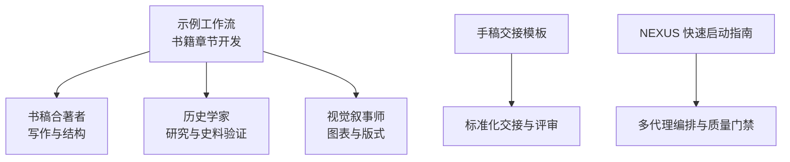
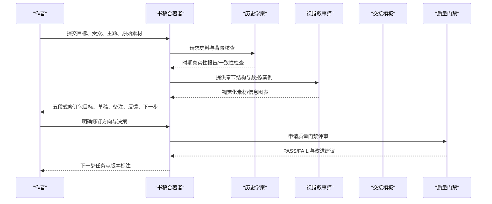
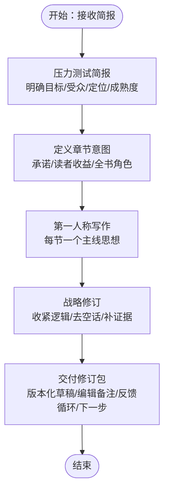
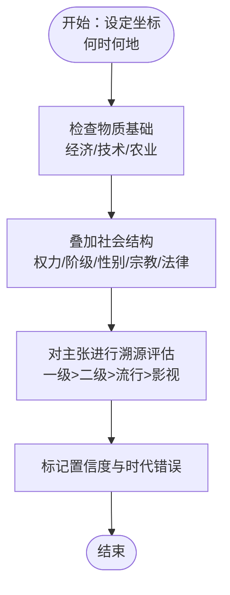
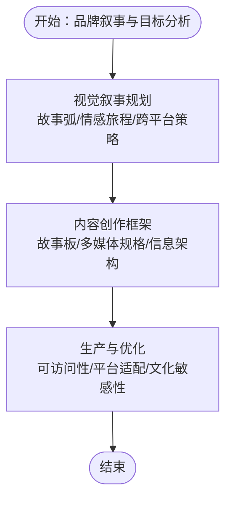
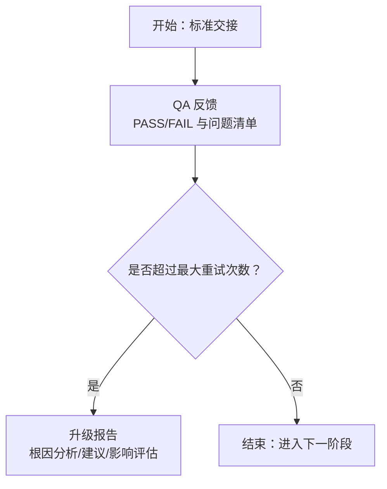
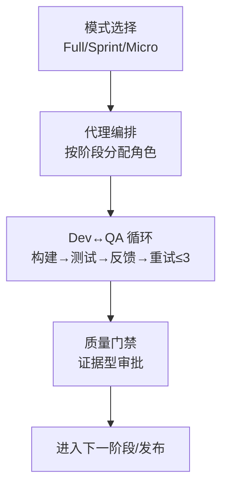
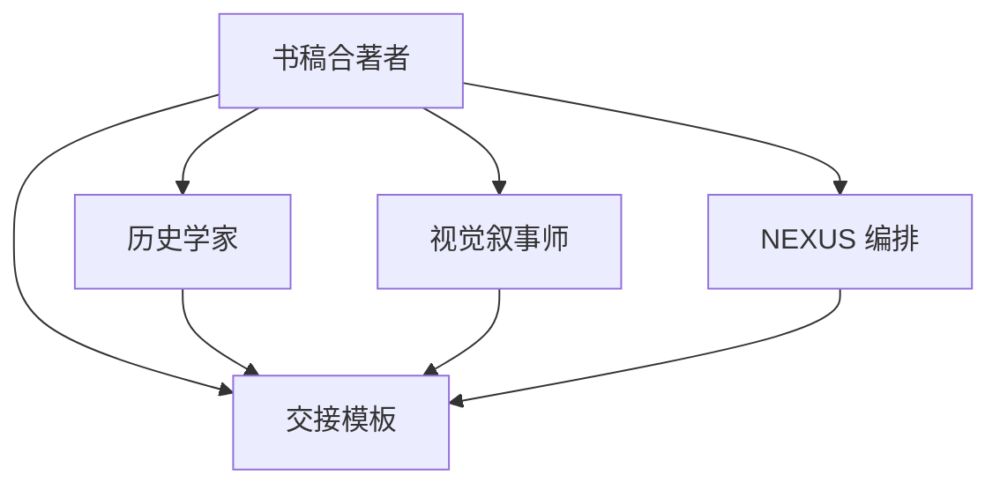

# 书籍章节工作流

<cite>
**本文引用的文件**
- [workflow-book-chapter.md](file://examples/workflow-book-chapter.md)
- [marketing-book-co-author.md](file://marketing/marketing-book-co-author.md)
- [handoff-templates.md](file://strategy/coordination/handoff-templates.md)
- [QUICKSTART.md](file://strategy/QUICKSTART.md)
- [README.md](file://README.md)
- [academic-historian.md](file://academic/academic-historian.md)
- [design-visual-storyteller.md](file://design/design-visual-storyteller.md)
- [nexus-spatial-discovery.md](file://examples/nexus-spatial-discovery.md)
</cite>

## 目录
1. [简介](#简介)
2. [项目结构](#项目结构)
3. [核心组件](#核心组件)
4. [架构总览](#架构总览)
5. [详细组件分析](#详细组件分析)
6. [依赖关系分析](#依赖关系分析)
7. [性能与效率考量](#性能与效率考量)
8. [故障排查指南](#故障排查指南)
9. [结论](#结论)
10. [附录](#附录)

## 简介
本文件面向希望使用 agency-agents 代理团队协作完成“书籍章节创作”的用户，系统化梳理从选题确定、资料收集、大纲制定、初稿撰写到修改完善的完整工作流程。文档明确各代理在章节创作中的职责边界：研究代理负责文献调研与资料整理，写作代理负责内容创作与结构优化，编辑代理负责质量把关与语言润色，设计代理负责图表制作与版式设计；并通过标准化的“修订包”交付方式，确保作者能清晰看到每轮迭代的决策依据与改进方向。同时，结合项目内已有的“书稿合著者”“手稿交接模板”“NEXUS 快速启动指南”等材料，给出可落地的协作模式、沟通机制、时间安排与质量标准，帮助读者快速建立自己的书籍章节创作工作流。

## 项目结构
该仓库采用“按职能分域”的组织方式，将代理分为工程、设计、营销、产品、项目管理、测试、支持、空间计算、专业化等十二个大类，并在每个类别下提供专门的代理定义文件。围绕书籍章节创作，最直接相关的模块包括：
- 示例工作流：书籍章节开发示例
- 营销/写作类：书稿合著者（写作与结构）
- 学术类：历史学家（研究与史料验证）
- 设计类：视觉叙事师（图表与版式）
- 协作与质量：手稿交接模板、NEXUS 快速启动指南

**图示来源**
- [workflow-book-chapter.md:1-56](file://examples/workflow-book-chapter.md#L1-L56)
- [marketing-book-co-author.md:1-111](file://marketing/marketing-book-co-author.md#L1-L111)
- [academic-historian.md:1-124](file://academic/academic-historian.md#L1-L124)
- [design-visual-storyteller.md:1-149](file://design/design-visual-storyteller.md#L1-L149)
- [handoff-templates.md:1-358](file://strategy/coordination/handoff-templates.md#L1-L358)
- [QUICKSTART.md:1-195](file://strategy/QUICKSTART.md#L1-L195)

**章节来源**
- [README.md:1-886](file://README.md#L1-L886)

## 核心组件
- 书稿合著者（写作代理）：负责将作者的口述笔记、片段与定位转化为第一人称的章节草稿，强调“作者声音可见、论点清晰、证据可溯源”，并产出“目标结果、章节草稿、编辑备注、反馈循环、下一步”五段式修订包。
- 历史学家（研究代理）：负责历史背景与史料一致性核查，提供“时期真实性报告”“一致性检查”等交付物，确保章节中的历史细节真实可信。
- 视觉叙事师（设计代理）：负责将复杂信息转化为可视化故事，产出视频脚本、信息图表、数据可视化等多媒体内容，提升章节的可读性与传播力。
- 手稿交接模板（协作机制）：提供标准交接文档、QA 反馈闭环、阶段门禁与事件响应模板，确保跨代理协作时上下文不丢失。
- NEXUS 快速启动指南（编排框架）：提供 NEXUS-Full、NEXUS-Sprint、NEXUS-Micro 三种模式，定义质量门禁、Dev↔QA 循环、代理编排与证据要求，支撑高效稳定的多代理流水线。

**章节来源**
- [marketing-book-co-author.md:1-111](file://marketing/marketing-book-co-author.md#L1-L111)
- [academic-historian.md:1-124](file://academic/academic-historian.md#L1-L124)
- [design-visual-storyteller.md:1-149](file://design/design-visual-storyteller.md#L1-L149)
- [handoff-templates.md:1-358](file://strategy/coordination/handoff-templates.md#L1-L358)
- [QUICKSTART.md:1-195](file://strategy/QUICKSTART.md#L1-L195)

## 架构总览
下图展示了“书籍章节工作流”的端到端架构：由书稿合著者作为中枢，协调研究与设计代理，形成“资料—结构—草稿—评审—修订”的闭环；通过标准化交接模板与质量门禁，确保每次迭代都有明确的交付物与决策依据。

**图示来源**
- [workflow-book-chapter.md:1-56](file://examples/workflow-book-chapter.md#L1-L56)
- [marketing-book-co-author.md:1-111](file://marketing/marketing-book-co-author.md#L1-L111)
- [academic-historian.md:1-124](file://academic/academic-historian.md#L1-L124)
- [design-visual-storyteller.md:1-149](file://design/design-visual-storyteller.md#L1-L149)
- [handoff-templates.md:1-358](file://strategy/coordination/handoff-templates.md#L1-L358)
- [QUICKSTART.md:1-195](file://strategy/QUICKSTART.md#L1-L195)

## 详细组件分析

### 组件一：书稿合著者（写作代理）
- 职责边界
  - 将作者的口述笔记、片段与定位转化为第一人称章节草稿
  - 维持章节间的“红线索”与整体论证连贯性
  - 保护作者声音，避免通用化与空洞化表达
  - 每轮迭代输出“目标结果、章节草稿、编辑备注、反馈循环、下一步”
- 关键规则
  - 作者声音必须可见
  - 不使用空洞的励志语言
  - 所有重大主张需有来源或假设标注
  - 每个段落聚焦一个清晰思路
  - 使用场景、选择、紧张与教训替代泛泛建议
  - 版本化标注（如“章节X - 版本N - 待审阅”）
  - 缺失证据、逻辑薄弱处必须在备注中显性指出
- 工作流步骤
  - 压力测试简报：明确目标、受众、定位与草稿成熟度
  - 定义章节意图：承诺、读者收益与全书战略角色
  - 第一人称写作：每节一个主导思想，用具体场景替代抽象
  - 战略修订：收紧逻辑、增强具体性、去除通用商业书语言
  - 交付修订包：版本化草稿、编辑备注、明确的下一步修订请求
- 成功指标
  - 作者声音保真度高
  - 章节间连贯性强
  - 主要主张具体且经得起推敲
  - 每轮修订结束时有明确决策，而非开放性不确定性
  - 强化作者在细分领域的权威性

**图示来源**
- [marketing-book-co-author.md:83-111](file://marketing/marketing-book-co-author.md#L83-L111)

**章节来源**
- [marketing-book-co-author.md:1-111](file://marketing/marketing-book-co-author.md#L1-L111)

### 组件二：历史学家（研究代理）
- 职责边界
  - 验证历史一致性，识别时代错误与文化误读
  - 提供“时期真实性报告”“一致性检查”等交付物
  - 强调材料文化细节与非西方历史视角
- 关键规则
  - 明确标注来源与置信度
  - 区分已证实事实、学界共识、争议与推测
  - 避免欧洲中心主义，主动纳入非西方历史
  - 材料基础优先：经济、技术、农业决定上层建筑
- 技术交付
  - 时期真实性报告：饮食、服饰、建筑、技术、货币/贸易、社会结构、性别角色、宗教/信仰、法律
  - 一致性检查：声明评估、证据与理由、置信度、虚构/受启发说明
- 成功指标
  - 每条历史主张均含置信度与来源类型
  - 时代错误被及时发现并解释修正方案
  - 材料文化细节基于考古与历史证据
  - 非西方历史被主动纳入，而非事后补充
  - 文明与个人行为之间的因果链清晰可辨

**图示来源**
- [academic-historian.md:47-97](file://academic/academic-historian.md#L47-L97)

**章节来源**
- [academic-historian.md:1-124](file://academic/academic-historian.md#L1-L124)

### 组件三：视觉叙事师（设计代理）
- 职责边界
  - 将复杂信息转化为引人入胜的视觉故事
  - 制作视频脚本、信息图表、数据可视化与多媒体内容
  - 跨平台适配（社交、网站、移动端），确保可访问性与文化敏感性
- 关键能力
  - 视觉叙事结构：开端（设置）、中间（冲突）、结尾（解决）
  - 多媒体内容：视频、动画、摄影指导、交互媒体
  - 数据可视化：图表设计、渐进披露、信息架构
  - 平台适配：Instagram Stories、YouTube、TikTok、LinkedIn、Pinterest、网站
- 成功指标
  - 视觉内容在各平台的参与率提升≥50%
  - 视觉叙事内容的完成率≥80%
  - 品牌认知度提升≥35%
  - 视觉内容表现优于纯文本内容3倍以上
  - 100%视觉内容满足可访问性标准
  - 首轮批准率≥95%

**图示来源**
- [design-visual-storyteller.md:77-107](file://design/design-visual-storyteller.md#L77-L107)

**章节来源**
- [design-visual-storyteller.md:1-149](file://design/design-visual-storyteller.md#L1-L149)

### 组件四：手稿交接模板（协作机制）
- 标准化交接文档：元数据、上下文、交付需求、质量期望
- QA 反馈闭环：PASS/FAIL 模板，问题清单与修复指令
- 阶段门禁：跨阶段评审与风险转移
- 事件响应：严重问题的升级与沟通机制
- 使用指南：不同情境下的模板选择

**图示来源**
- [handoff-templates.md:49-204](file://strategy/coordination/handoff-templates.md#L49-L204)

**章节来源**
- [handoff-templates.md:1-358](file://strategy/coordination/handoff-templates.md#L1-L358)

### 组件五：NEXUS 快速启动指南（编排框架）
- 模式选择：NEXUS-Full（完整项目）、NEXUS-Sprint（功能/MVP）、NEXUS-Micro（专项任务）
- 质量门禁：每阶段必须有证据型审批
- Dev↔QA 循环：构建后测试，PASS 继续，FAIL 重试（最多3次）
- 代理编排：明确谁做什么、何时做、如何验证
- 关键概念：证据优先、现实校验者、代理编排者、标准化交接

**图示来源**
- [QUICKSTART.md:21-67](file://strategy/QUICKSTART.md#L21-L67)

**章节来源**
- [QUICKSTART.md:1-195](file://strategy/QUICKSTART.md#L1-L195)

## 依赖关系分析
- 写作代理依赖研究代理提供的史料与背景核查，以保证章节主张的可溯源与历史合理性。
- 写作代理依赖设计代理提供的可视化素材，以增强章节的传播力与可读性。
- 协作机制（交接模板）贯穿全流程，确保跨代理上下文不丢失。
- 编排框架（NEXUS 快速启动）为多代理协作提供统一的节奏与质量控制。

**图示来源**
- [marketing-book-co-author.md:1-111](file://marketing/marketing-book-co-author.md#L1-L111)
- [academic-historian.md:1-124](file://academic/academic-historian.md#L1-L124)
- [design-visual-storyteller.md:1-149](file://design/design-visual-storyteller.md#L1-L149)
- [handoff-templates.md:1-358](file://strategy/coordination/handoff-templates.md#L1-L358)
- [QUICKSTART.md:1-195](file://strategy/QUICKSTART.md#L1-L195)

**章节来源**
- [README.md:1-886](file://README.md#L1-L886)

## 性能与效率考量
- 迭代节奏：每轮修订应明确“下一步”任务，避免模糊的“再看看”导致无限期拖延。
- 证据驱动：所有主张必须有来源或假设标注，减少反复返工。
- 版本化管理：每次草稿都应标注版本与状态，便于回溯与对比。
- 质量门禁：在关键节点引入现实校验者，确保交付物符合预期。
- 跨代理协作：使用标准化交接模板，减少沟通成本与上下文丢失。

[本节为通用建议，无需特定文件来源]

## 故障排查指南
- 常见问题
  - 草稿缺乏作者声音：回到“压力测试简报”与“章节意图”环节，强化定位与第一人称叙述。
  - 论点空洞或无证据：参考“编辑备注”模板，列出缺失证据、逻辑薄弱处与风险提示。
  - 视觉内容参与度低：对照“视觉叙事师成功指标”，检查平台适配、可访问性与文化敏感性。
  - 协作断点：使用“标准交接模板”补齐上下文、依赖与约束条件。
- 处理流程
  - 发现问题→记录证据→生成反馈闭环→提出明确下一步→进入 QA 循环→门禁评审→进入下一阶段

**章节来源**
- [marketing-book-co-author.md:66-81](file://marketing/marketing-book-co-author.md#L66-L81)
- [design-visual-storyteller.md:115-126](file://design/design-visual-storyteller.md#L115-L126)
- [handoff-templates.md:49-144](file://strategy/coordination/handoff-templates.md#L49-L144)

## 结论
通过将“书稿合著者”“历史学家”“视觉叙事师”与“交接模板”“NEXUS 编排”有机结合，可以构建一套高效、可重复、可审计的书籍章节创作工作流。该工作流以证据为导向、以作者声音为核心、以可视化为增益、以标准化为保障，既适合单章创作，也可扩展至整部书的协同编纂。建议在实践中逐步固化“修订包”格式与“下一步”任务清单，持续优化迭代节奏与质量门禁，最终形成稳定可复制的多代理内容创作体系。

[本节为总结性内容，无需特定文件来源]

## 附录

### 实施步骤与时间安排（示例）
- 第1轮：简报与压力测试（1天）
  - 明确目标、受众、主题与草稿成熟度
- 第2轮：资料收集与结构设计（2-3天）
  - 历史学家提供时期真实性报告
  - 书稿合著者产出章节蓝图与初稿
- 第3轮：草稿修订与可视化（2-3天）
  - 书稿合著者进行战略修订
  - 视觉叙事师提供图表与多媒体素材
- 第4轮：评审与门禁（1天）
  - 质量门禁评审，生成 PASS/FAIL 与改进建议
- 第5轮：最终修订与交付（1天）
  - 明确下一步任务，版本化标注，形成修订包

[本节为通用建议，无需特定文件来源]

### 质量标准
- 作者声音保真度高
- 章节间连贯性强
- 主要主张具体且经得起推敲
- 每轮修订结束时有明确决策
- 强化作者在细分领域的权威性
- 视觉内容在各平台的参与率提升≥50%
- 100%视觉内容满足可访问性标准
- 首轮批准率≥95%

**章节来源**
- [marketing-book-co-author.md:105-111](file://marketing/marketing-book-co-author.md#L105-L111)
- [design-visual-storyteller.md:115-126](file://design/design-visual-storyteller.md#L115-L126)

### 协作模式与沟通机制
- 使用“标准交接模板”进行跨代理工作移交
- 每轮修订以“修订包”形式交付，包含目标、草稿、备注、反馈与下一步
- 通过“QA 反馈闭环”与“质量门禁”控制交付质量
- 在多代理并行场景下，参考“NEXUS 快速启动指南”进行角色与节奏编排

**章节来源**
- [handoff-templates.md:1-358](file://strategy/coordination/handoff-templates.md#L1-L358)
- [QUICKSTART.md:1-195](file://strategy/QUICKSTART.md#L1-L195)
- [nexus-spatial-discovery.md:839-851](file://examples/nexus-spatial-discovery.md#L839-L851)