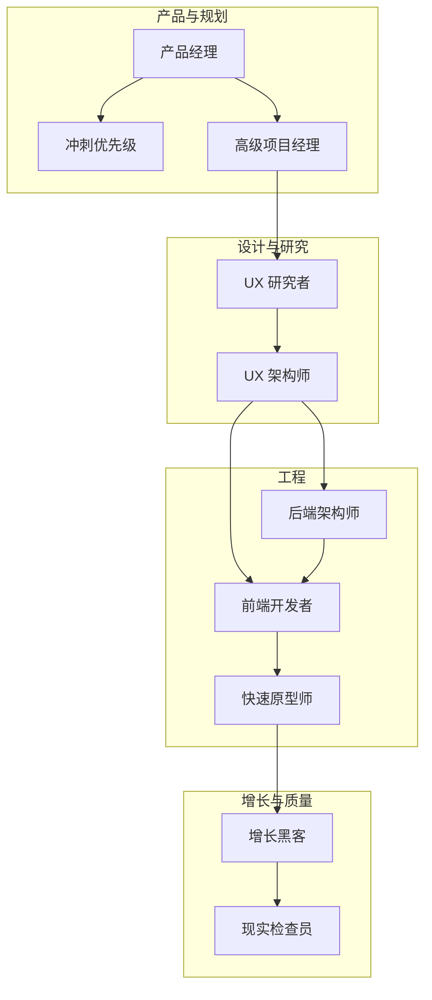
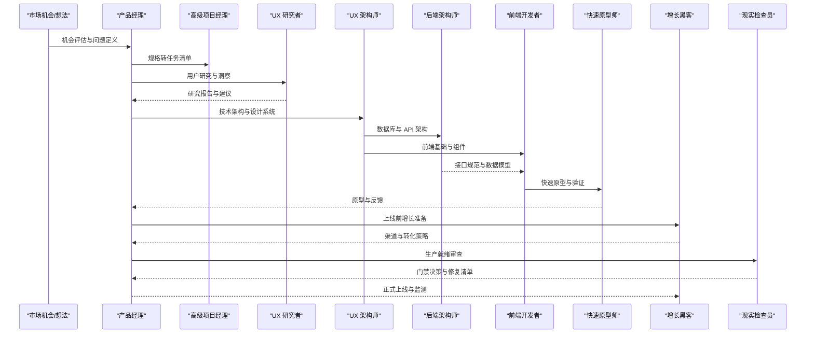
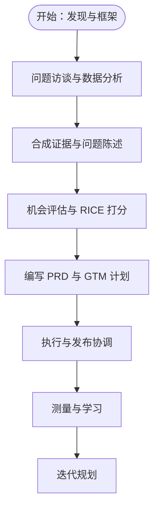
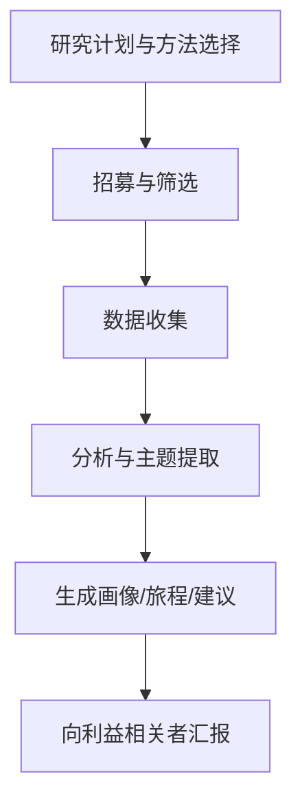
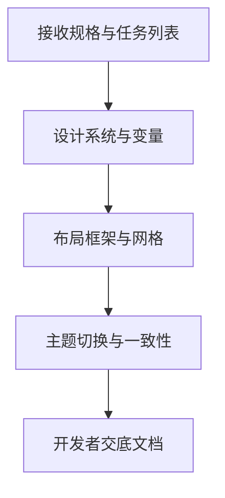
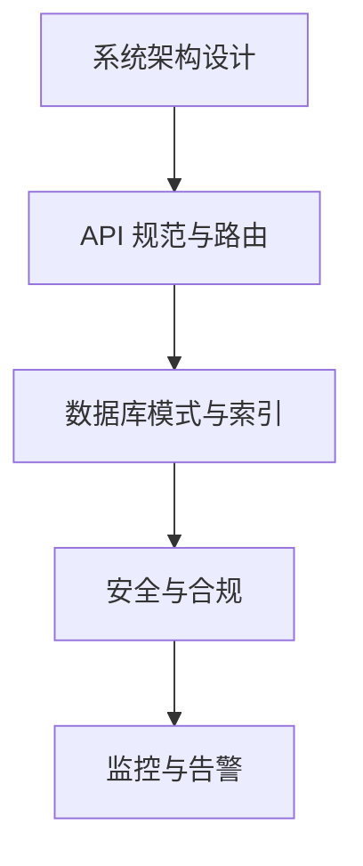
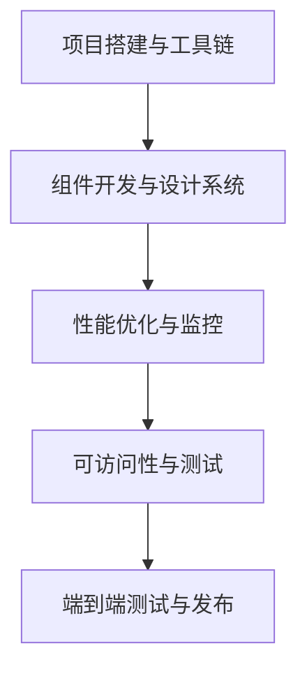
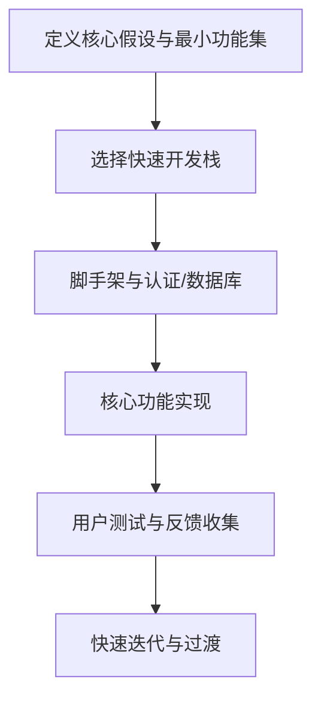
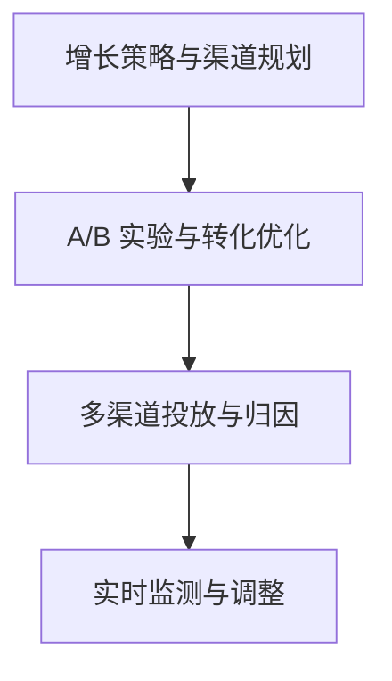
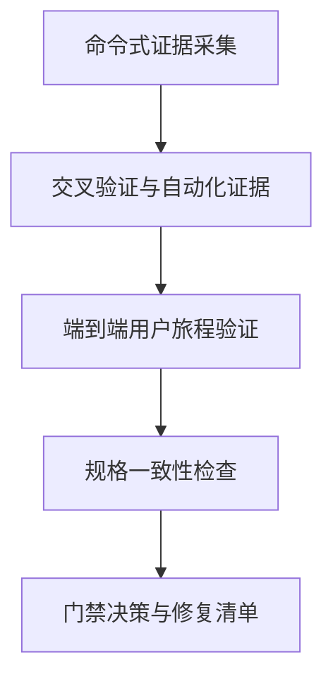

# 初创 MVP 工作流

<cite>
**本文档引用的文件**
- [examples/workflow-startup-mvp.md](file://examples/workflow-startup-mvp.md)
- [strategy/runbooks/scenario-startup-mvp.md](file://strategy/runbooks/scenario-startup-mvp.md)
- [product/product-manager.md](file://product/product-manager.md)
- [product/product-sprint-prioritizer.md](file://product/product-sprint-prioritizer.md)
- [design/design-ux-architect.md](file://design/design-ux-architect.md)
- [design/design-ux-researcher.md](file://design/design-ux-researcher.md)
- [engineering/backend-architect.md](file://engineering/backend-architect.md)
- [engineering/frontend-developer.md](file://engineering/frontend-developer.md)
- [engineering/rapid-prototyper.md](file://engineering/rapid-prototyper.md)
- [marketing/growth-hacker.md](file://marketing/marketing-growth-hacker.md)
- [testing/reality-checker.md](file://testing/testing-reality-checker.md)
- [project-management/senior-project-manager.md](file://project-management/project-manager-senior.md)
- [README.md](file://README.md)
</cite>

## 目录
1. [简介](#简介)
2. [项目结构](#项目结构)
3. [核心组件](#核心组件)
4. [架构总览](#架构总览)
5. [详细组件分析](#详细组件分析)
6. [依赖关系分析](#依赖关系分析)
7. [性能考量](#性能考量)
8. [故障排除指南](#故障排除指南)
9. [结论](#结论)
10. [附录](#附录)

## 简介
本文件面向初创团队，系统化阐述如何基于 agency-agents 代理体系，以“多代理协作”的方式快速完成从市场机会识别到 MVP 上线的全流程。该工作流强调“证据驱动、质量门禁、并行加速、快速试错”，通过产品经理、工程师、设计师、增长专家与质量把关者等角色的明确分工与有序交接，帮助资源有限的创业公司缩短开发周期、降低失败概率、提升成功率。

## 项目结构
本仓库提供了完整的“代理即服务”能力，覆盖工程、设计、产品、营销、测试、项目管理等多个职能域。针对初创 MVP 的场景，可直接复用以下关键模块：
- 启动场景：examples/workflow-startup-mvp.md 提供端到端步骤示例
- 运行手册：strategy/runbooks/scenario-startup-mvp.md 给出周度执行计划与决策点
- 产品与规划：product/* 提供产品负责人、冲刺优先级等能力
- 设计与研究：design/* 提供 UX 架构师、UX 研究者等能力
- 工程能力：engineering/* 提供后端架构师、前端开发者、快速原型师等能力
- 增长与质量：marketing/* 与 testing/* 提供增长黑客与质量门禁

图示来源
- [strategy/runbooks/scenario-startup-mvp.md](file://strategy/runbooks/scenario-startup-mvp.md)
- [product/product-manager.md](file://product/product-manager.md)
- [design/design-ux-architect.md](file://design/design-ux-architect.md)
- [design/design-ux-researcher.md](file://design/design-ux-researcher.md)
- [engineering/backend-architect.md](file://engineering/backend-architect.md)
- [engineering/frontend-developer.md](file://engineering/frontend-developer.md)
- [engineering/rapid-prototyper.md](file://engineering/rapid-prototyper.md)
- [marketing/growth-hacker.md](file://marketing/marketing-growth-hacker.md)
- [testing/reality-checker.md](file://testing/testing-reality-checker.md)

章节来源
- [README.md](file://README.md)
- [examples/workflow-startup-mvp.md](file://examples/workflow-startup-mvp.md)
- [strategy/runbooks/scenario-startup-mvp.md](file://strategy/runbooks/scenario-startup-mvp.md)

## 核心组件
- 产品经理（Product Manager）
  - 负责问题定义、机会评估、PRD 编写、路线图与 GTM 计划制定；强调“以结果为导向、数据驱动、对齐利益相关者”。
- 冲刺优先级（Sprint Prioritizer）
  - 使用 RICE、MoSCoW 等框架进行特性优先级排序，支撑敏捷冲刺规划与容量管理。
- 高级项目经理（Senior Project Manager）
  - 将规格转化为可执行任务清单，确保范围可控、验收标准清晰、技术栈准确。
- UX 架构师（UX Architect）
  - 提供 CSS 设计系统、布局框架、组件架构与主题切换等技术基础，保障开发可实施性与一致性。
- UX 研究者（UX Researcher）
  - 通过定性/定量研究验证假设、提炼用户画像与旅程，输出可落地的洞察与建议。
- 后端架构师（Backend Architect）
  - 设计高可用、可扩展的系统架构、数据库模式与 API，兼顾安全、监控与性能。
- 前端开发者（Frontend Developer）
  - 实现响应式、可访问、高性能的现代 Web 应用，关注 Core Web Vitals 与跨浏览器兼容。
- 快速原型师（Rapid Prototyper）
  - 以极短时间交付可验证的原型，内置反馈收集与分析能力，支持快速迭代。
- 增长黑客（Growth Hacker）
  - 专注于低成本高效率的增长实验、病毒机制与渠道优化，支撑上线后的获客与留存。
- 现实检查员（Reality Checker）
  - 作为最终质量门禁，要求“可视化证据+端到端验证”，默认“需要改进”，防止“幻想式认证”。

章节来源
- [product/product-manager.md](file://product/product-manager.md)
- [product/product-sprint-prioritizer.md](file://product/product-sprint-prioritizer.md)
- [project-management/senior-project-manager.md](file://project-management/project-manager-senior.md)
- [design/design-ux-architect.md](file://design/design-ux-architect.md)
- [design/design-ux-researcher.md](file://design/design-ux-researcher.md)
- [engineering/backend-architect.md](file://engineering/backend-architect.md)
- [engineering/frontend-developer.md](file://engineering/frontend-developer.md)
- [engineering/rapid-prototyper.md](file://engineering/rapid-prototyper.md)
- [marketing/growth-hacker.md](file://marketing/marketing-growth-hacker.md)
- [testing/reality-checker.md](file://testing/testing-reality-checker.md)

## 架构总览
下图展示了从“想法—验证—架构—构建—发布—增长”的闭环路径，以及各代理在关键节点的角色与职责。

图示来源
- [examples/workflow-startup-mvp.md](file://examples/workflow-startup-mvp.md)
- [strategy/runbooks/scenario-startup-mvp.md](file://strategy/runbooks/scenario-startup-mvp.md)
- [product/product-manager.md](file://product/product-manager.md)
- [design/design-ux-researcher.md](file://design/design-ux-researcher.md)
- [design/design-ux-architect.md](file://design/design-ux-architect.md)
- [engineering/backend-architect.md](file://engineering/backend-architect.md)
- [engineering/frontend-developer.md](file://engineering/frontend-developer.md)
- [engineering/rapid-prototyper.md](file://engineering/rapid-prototyper.md)
- [marketing/growth-hacker.md](file://marketing/marketing-growth-hacker.md)
- [testing/reality-checker.md](file://testing/testing-reality-checker.md)

## 详细组件分析

### 产品经理：需求梳理与优先级排序
- 关键职责
  - 发现阶段：结构化问题访谈、行为数据分析、支持工单与竞品信号整合，形成证据驱动的问题陈述。
  - 框架阶段：机会评估（含 RICE 打分）、PRD 编写、PRFAQ 练习、设计启动会、依赖识别与预演。
  - 执行阶段：维护待办、推动冲刺会议、阻塞解决、周报同步、发布协调与复盘。
- 成功指标
  - 交付预测性、路线图可预测性、无未记录范围变更、冲刺完成率、周期时间等。

图示来源
- [product/product-manager.md](file://product/product-manager.md)

章节来源
- [product/product-manager.md](file://product/product-manager.md)

### UX 研究者：用户洞察与验证
- 关键职责
  - 研究设计：明确目标、方法论、样本量、招募与协议。
  - 数据收集：访谈、调查、可用性测试、行为数据。
  - 分析与建议：主题分析、亲和图、洞察提炼、推荐优先级。
- 成功指标
  - 研究建议采纳率、用户满意度改善、避免昂贵的设计返工。

图示来源
- [design/design-ux-researcher.md](file://design/design-ux-researcher.md)

章节来源
- [design/design-ux-researcher.md](file://design/design-ux-researcher.md)

### UX 架构师：技术基础与开发者支撑
- 关键职责
  - CSS 设计系统：变量、排版、间距、容器与网格。
  - 响应式策略：移动端优先、断点与布局模式。
  - 主题系统：明暗/系统主题切换与一致性。
  - 开发交底：组件层次、命名约定、实现优先级与可维护性。
- 成功指标
  - 开发可实施性高、CSS 冲突少、UX 模式一致、专业外观基线达标。

图示来源
- [design/design-ux-architect.md](file://design/design-ux-architect.md)

章节来源
- [design/design-ux-architect.md](file://design/design-ux-architect.md)

### 后端架构师：系统设计与数据模型
- 关键职责
  - 微服务/事件驱动架构设计、API 规范与版本控制、数据库模式与索引策略。
  - 安全（认证授权、加密、防护）、监控告警、弹性与自动伸缩。
- 成功指标
  - 响应时间稳定、可用性达标、零关键漏洞、可承受峰值流量。

图示来源
- [engineering/backend-architect.md](file://engineering/backend-architect.md)

章节来源
- [engineering/backend-architect.md](file://engineering/backend-architect.md)

### 前端开发者：界面实现与性能优化
- 关键职责
  - 现代框架实现、响应式与可访问性、性能优化（Core Web Vitals）、自动化测试与 CI/CD。
- 成功指标
  - 加载速度快、可访问性达标、跨浏览器兼容、零生产控制台错误。

图示来源
- [engineering/frontend-developer.md](file://engineering/frontend-developer.md)

章节来源
- [engineering/frontend-developer.md](file://engineering/frontend-developer.md)

### 快速原型师：高速验证与反馈集成
- 关键职责
  - 3 天内交付可运行原型，内置反馈收集与分析，支持 A/B 测试与迭代。
- 成功指标
  - 原型按时交付、用户反馈及时收集、80% 核心假设被验证或证伪。

图示来源
- [engineering/rapid-prototyper.md](file://engineering/rapid-prototyper.md)

章节来源
- [engineering/rapid-prototyper.md](file://engineering/rapid-prototyper.md)

### 增长黑客：获客与留存策略
- 关键职责
  - 病毒系数优化、转化漏斗分析、多渠道实验、产品驱动增长、客户生命周期价值最大化。
- 成功指标
  - 有机增长、CAC 回款周期、LTV:CAC、激活率、留存率、实验速度与胜率。

图示来源
- [marketing/growth-hacker.md](file://marketing/marketing-growth-hacker.md)

章节来源
- [marketing/growth-hacker.md](file://marketing/marketing-growth-hacker.md)

### 现实检查员：质量门禁与生产就绪
- 关键职责
  - 可视化证据采集（截图、交互序列、性能数据）、端到端用户旅程验证、规格一致性比对、门禁决策。
- 成功指标
  - 系统真实可用、无重大集成问题、修复闭环、生产就绪。

图示来源
- [testing/reality-checker.md](file://testing/testing-reality-checker.md)

章节来源
- [testing/reality-checker.md](file://testing/testing-reality-checker.md)

## 依赖关系分析
- 顺序依赖
  - 产品经理 → 高级项目经理 → UX 研究者 → UX 架构师 → 后端架构师 → 前端开发者 → 快速原型师 → 增长黑客 → 现实检查员。
- 并行依赖
  - 在第一周，UX 研究者与冲刺优先级可并行推进，以缩短发现周期。
- 质量门禁
  - 中点与上线前均设置现实检查员，强制证据与端到端验证，避免“幻想式认证”。

图示来源
- [examples/workflow-startup-mvp.md](file://examples/workflow-startup-mvp.md)
- [strategy/runbooks/scenario-startup-mvp.md](file://strategy/runbooks/scenario-startup-mvp.md)

章节来源
- [examples/workflow-startup-mvp.md](file://examples/workflow-startup-mvp.md)
- [strategy/runbooks/scenario-startup-mvp.md](file://strategy/runbooks/scenario-startup-mvp.md)

## 性能考量
- 开发效率
  - 并行工作：第一周并行推进发现与架构，缩短整体周期。
  - 明确边界：每个代理只做其专长领域，减少上下文切换。
- 质量与稳定性
  - 质量门禁：中点与上线前两次现实检查，确保问题在进入生产前被发现与修复。
  - 可视化证据：截图、交互序列、性能数据三件套，杜绝“仅凭口头描述”的风险。
- 可观测性
  - 监控与告警：后端架构师与基础设施维护者负责监控体系，现实检查员负责上线前验证。
- 用户体验
  - 前端性能：关注 Core Web Vitals、可访问性与跨浏览器兼容。
  - 增长实验：以 A/B 测试与转化分析为依据，避免盲目优化。

## 故障排除指南
- 常见陷阱与缓解
  - 范围蔓延：由冲刺优先级严格约束 MoSCoW，任何变更需正式评估与记录。
  - 过度工程：快速原型思维，先验证再扩展，避免为“未来可能”投入过多。
  - 忽视 QA：每项任务必须有证据收集，不得跳过。
  - 缺乏监控：基础设施维护者在第一周即建立监控，上线前再次确认。
  - 无反馈机制：从第一周起内置反馈收集与分析，确保早期迭代闭环。
- 门禁不通过怎么办
  - 现实检查员会列出具体问题与修复清单，回到相应专家处修正后再复检。
- 何时回退
  - 若上线后出现严重指标恶化，按回退预案执行并通知相关方。

章节来源
- [strategy/runbooks/scenario-startup-mvp.md](file://strategy/runbooks/scenario-startup-mvp.md)
- [testing/reality-checker.md](file://testing/testing-reality-checker.md)

## 结论
通过多代理协作与标准化流程，初创团队可以在资源有限的情况下，以“证据驱动、质量门禁、并行加速、快速试错”的方式高效完成 MVP 交付与上线。产品经理负责方向与优先级，UX 研究与架构为设计与工程提供坚实基础，前后端与快速原型师保证功能实现与验证，增长黑客与现实检查员分别负责上线后的增长与质量把关。该工作流已在多个场景中得到验证，适合希望缩短周期、提高成功率的创业团队。

## 附录
- 实战操作要点
  - 第一周：并行推进发现与架构，产出研究简报与架构包。
  - 第二至三周：核心功能开发与 QA 循环，同时启动增长准备。
  - 第四周：质量冲刺与现实检查，决定是否上线。
  - 第五至六周：正式上线与优化，持续收集反馈与实验。
- 关键提示
  - 严格复制粘贴上一代理出内容，不摘要、不省略。
  - 出现问题立即回退到相关专家修正，直至满足证据要求。
  - 将“现实检查员”作为最终决策者，坚持“需要改进”的默认立场。

章节来源
- [examples/workflow-startup-mvp.md](file://examples/workflow-startup-mvp.md)
- [strategy/runbooks/scenario-startup-mvp.md](file://strategy/runbooks/scenario-startup-mvp.md)
- [testing/reality-checker.md](file://testing/testing-reality-checker.md)