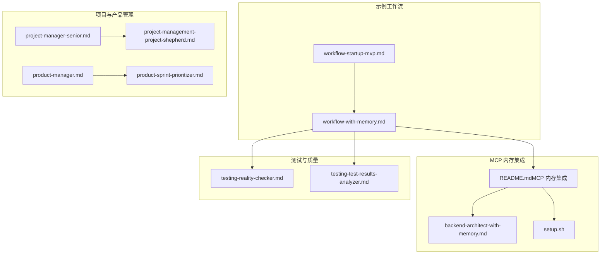
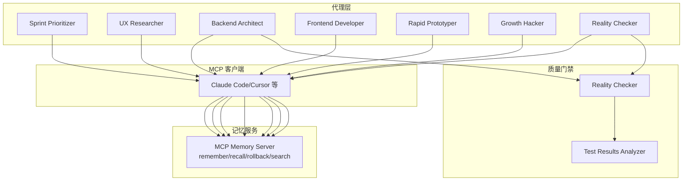
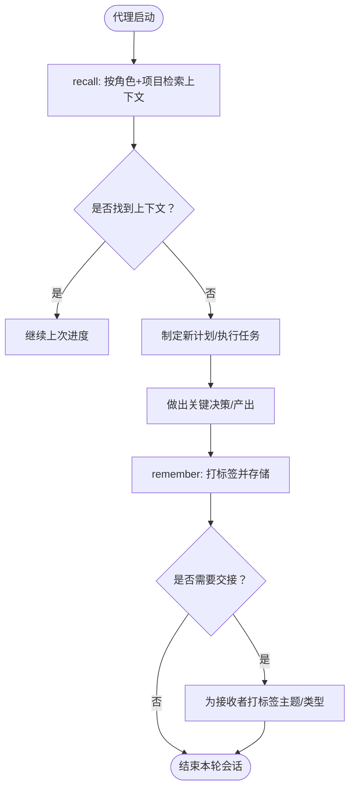
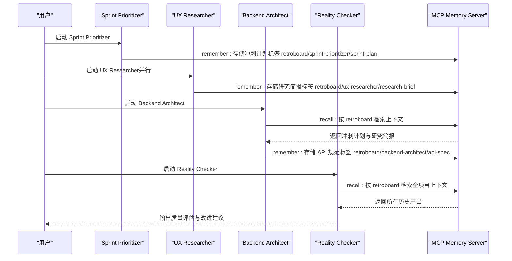
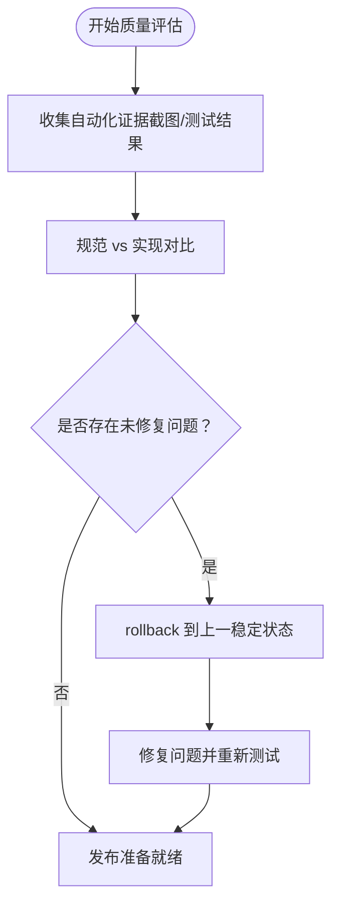
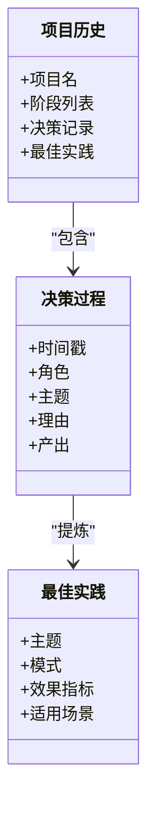
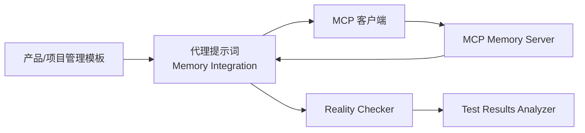

# 带记忆工作流

<cite>
**本文引用的文件**
- [README.md](file://README.md)
- [workflow-with-memory.md](file://examples/workflow-with-memory.md)
- [workflow-startup-mvp.md](file://examples/workflow-startup-mvp.md)
- [README.md（MCP 内存集成）](file://integrations/mcp-memory/README.md)
- [后端架构师（带记忆）示例](file://integrations/mcp-memory/backend-architect-with-memory.md)
- [MCP 内存安装脚本](file://integrations/mcp-memory/setup.sh)
- [测试-现实检查员](file://testing/testing-reality-checker.md)
- [测试-测试结果分析器](file://testing/testing-test-results-analyzer.md)
- [产品-冲刺优先级](file://product/product-sprint-prioritizer.md)
- [项目管理-高级项目经理](file://project-management/project-manager-senior.md)
- [项目管理-项目牧羊人](file://project-management/project-management-project-shepherd.md)
- [产品-产品经理](file://product/product-manager.md)
</cite>

## 目录
1. [简介](#简介)
2. [项目结构](#项目结构)
3. [核心组件](#核心组件)
4. [架构总览](#架构总览)
5. [详细组件分析](#详细组件分析)
6. [依赖关系分析](#依赖关系分析)
7. [性能考量](#性能考量)
8. [故障排查指南](#故障排查指南)
9. [结论](#结论)
10. [附录](#附录)

## 简介
本文件围绕“带记忆工作流”的实现与应用，系统阐述如何通过 MCP 记忆服务器为多代理协作提供跨会话持久化记忆，从而实现长期项目管理与智能协作。内容涵盖：
- 记忆系统架构设计：基于 MCP 的 remember/recall/rollback/search 工具链
- 数据存储与标签策略：以“项目名 + 角色名 + 主题”为核心的标签体系
- 上下文维护与智能检索：自动召回、跨代理可见性与回滚恢复
- 多代理协作中的知识积累与经验传承：项目历史、决策过程追踪、最佳实践总结与个性化推荐
- 实施案例与落地路径：从标准 MVP 流程到带记忆的自动化协作
- 配置方法、数据隐私保护与性能优化建议

## 项目结构
该仓库是一个多代理协作平台，提供工程、设计、营销、销售、产品、项目管理、测试、支持等多领域专家角色。与记忆工作流相关的关键位置如下：
- 示例工作流：examples 下的标准与带记忆版本的 Startup MVP 流程
- MCP 内存集成：integrations/mcp-memory 提供安装脚本、使用说明与示例
- 测试与质量门禁：testing 下的 Reality Checker 与 Test Results Analyzer
- 项目管理与产品管理：project-management 与 product 下的流程与交付物模板
- 平台总览：根目录 README 提供工具集成与使用说明

图表来源
- [workflow-with-memory.md:1-239](file://examples/workflow-with-memory.md#L1-L239)
- [README.md（MCP 内存集成）:1-80](file://integrations/mcp-memory/README.md#L1-L80)
- [后端架构师（带记忆）示例:1-248](file://integrations/mcp-memory/backend-architect-with-memory.md#L1-L248)
- [MCP 内存安装脚本:1-75](file://integrations/mcp-memory/setup.sh#L1-L75)
- [测试-现实检查员:1-237](file://testing/testing-reality-checker.md#L1-L237)
- [测试-测试结果分析器:1-305](file://testing/testing-test-results-analyzer.md#L1-L305)
- [项目管理-高级项目经理:47-51](file://project-management/project-manager-senior.md#L47-L51)
- [项目管理-项目牧羊人:56-145](file://project-management/project-management-project-shepherd.md#L56-L145)
- [产品-产品经理:45-420](file://product/product-manager.md#L45-L420)
- [产品-冲刺优先级:122-148](file://product/product-sprint-prioritizer.md#L122-L148)

章节来源
- [README.md:1-886](file://README.md#L1-L886)

## 核心组件
- 记忆服务器（MCP-Compatible Memory Server）
  - 提供 remember/recall/rollback/search 四大工具，作为所有代理的记忆中枢
  - 安装与配置由 integrations/mcp-memory/setup.sh 引导，客户端需在各自工具的 MCP 配置中注册
- 代理记忆集成（Memory Integration）
  - 在各 agent 的提示词中添加 Memory Integration 段落，指导 LLM 在关键节点调用 MCP 工具
  - 典型模式：启动时召回上下文；完成决策/产出时记忆并打标签；跨代理交接时标注接收者；失败时回滚
- 工作流编排（Examples）
  - workflow-with-memory.md 展示了完整的带记忆 MVP 流程，对比标准流程，显著降低手递手成本、避免上下文丢失、支持跨日/跨会话延续
- 质量门禁与反馈闭环（Testing）
  - Reality Checker 作为证据驱动的质量门禁，要求“压倒性证据”，并生成可追溯的报告
  - Test Results Analyzer 提供统计分析与预测模型，支撑发布决策与持续改进
- 项目与产品管理（Project/Product）
  - 通过 PRD、机会评估、冲刺健康快照等模板沉淀知识，形成可复用的最佳实践

章节来源
- [README.md（MCP 内存集成）:1-80](file://integrations/mcp-memory/README.md#L1-L80)
- [后端架构师（带记忆）示例:233-244](file://integrations/mcp-memory/backend-architect-with-memory.md#L233-L244)
- [MCP 内存安装脚本:1-75](file://integrations/mcp-memory/setup.sh#L1-L75)
- [workflow-with-memory.md:1-239](file://examples/workflow-with-memory.md#L1-L239)
- [测试-现实检查员:1-237](file://testing/testing-reality-checker.md#L1-L237)
- [测试-测试结果分析器:1-305](file://testing/testing-test-results-analyzer.md#L1-L305)

## 架构总览
下图展示了带记忆工作流的整体交互：代理通过 MCP 客户端调用记忆服务，实现跨会话状态共享、自动上下文召回与回滚恢复；质量门禁贯穿关键里程碑，确保交付质量。

图表来源
- [README.md（MCP 内存集成）:1-80](file://integrations/mcp-memory/README.md#L1-L80)
- [workflow-with-memory.md:1-239](file://examples/workflow-with-memory.md#L1-L239)
- [测试-现实检查员:1-237](file://testing/testing-reality-checker.md#L1-L237)
- [测试-测试结果分析器:1-305](file://testing/testing-test-results-analyzer.md#L1-L305)

## 详细组件分析

### 组件一：记忆系统架构与数据模型
- 工具接口
  - remember：以标签与上下文形式存储决策、产出与上下文快照
  - recall：按关键词、标签或语义相似度检索记忆
  - rollback：回到已知良好状态，替代手动撤销
  - search：跨会话、跨代理定位特定记忆
- 数据模型与标签策略
  - 标签三元组：[项目名] + [角色名] + [主题/类型]，如 retroboard/backend-architect/api-spec
  - 项目名用于跨代理可见性；角色名用于“拾取上次会话进度”；主题用于“定向交付物交接”
- 上下文维护
  - 启动即召回：按角色+项目检索最近上下文
  - 决策记忆：记录理由与依据，便于未来复盘与审计
  - 交接记忆：明确已完成/待办与风险约束
  - 回滚恢复：当 Reality Checker 指出问题时，原作者可回溯到上一个已知良好状态

图表来源
- [README.md（MCP 内存集成）:34-54](file://integrations/mcp-memory/README.md#L34-L54)
- [后端架构师（带记忆）示例:233-244](file://integrations/mcp-memory/backend-architect-with-memory.md#L233-L244)

章节来源
- [README.md（MCP 内存集成）:1-80](file://integrations/mcp-memory/README.md#L1-L80)
- [后端架构师（带记忆）示例:233-244](file://integrations/mcp-memory/backend-architect-with-memory.md#L233-L244)

### 组件二：智能检索与跨代理协作
- 检索模式
  - 关键词检索：按项目名、角色名、主题进行精确匹配
  - 语义检索：在相似意图下召回相关上下文
  - 跨代理可见：同一项目名下的记忆对所有相关代理可见
- 协作模式
  - 并行探索：UX Researcher 与 Sprint Prioritizer 可同时进行
  - 自动交接：Backend Architect 直接 recall 前序产物，无需人工粘贴
  - 全景视图：Reality Checker 可 recall 项目全貌，形成统一质量视角

图表来源
- [workflow-with-memory.md:61-214](file://examples/workflow-with-memory.md#L61-L214)
- [README.md（MCP 内存集成）:56-65](file://integrations/mcp-memory/README.md#L56-L65)

章节来源
- [workflow-with-memory.md:1-239](file://examples/workflow-with-memory.md#L1-L239)

### 组件三：质量门禁与反馈闭环
- Reality Checker 的证据驱动评估
  - 默认“需要改进”，要求压倒性证据才判定“可上线”
  - 通过截图、测试结果等自动化证据进行交叉验证
- Test Results Analyzer 的统计洞察
  - 覆盖率、缺陷密度、趋势分析与预测模型
  - 为发布决策提供量化依据与 ROI 分析
- 记忆在 QA 中的作用
  - 回滚到上一次已知良好状态，快速修复问题
  - 记录 QA 失败原因与修复方案，沉淀最佳实践

图表来源
- [测试-现实检查员:122-202](file://testing/testing-reality-checker.md#L122-L202)
- [测试-测试结果分析器:143-162](file://testing/testing-test-results-analyzer.md#L143-L162)

章节来源
- [测试-现实检查员:1-237](file://testing/testing-reality-checker.md#L1-L237)
- [测试-测试结果分析器:1-305](file://testing/testing-test-results-analyzer.md#L1-L305)

### 组件四：项目历史记录与最佳实践总结
- 项目历史记录
  - 以“项目名”为维度，串联各阶段产出与决策
  - 以“角色名”为维度，保留每个角色的个人经验与习惯
- 决策过程追踪
  - 记忆中包含理由与依据，便于复盘与审计
- 最佳实践总结
  - 通过 Test Results Analyzer 的趋势与预测，提炼高价值改进点
  - 通过 PRD、机会评估、冲刺健康快照等模板固化流程

图表来源
- [产品-产品经理:45-420](file://product/product-manager.md#L45-L420)
- [产品-冲刺优先级:122-148](file://product/product-sprint-prioritizer.md#L122-L148)
- [项目管理-高级项目经理:47-51](file://project-management/project-manager-senior.md#L47-L51)
- [项目管理-项目牧羊人:56-145](file://project-management/project-management-project-shepherd.md#L56-L145)

章节来源
- [产品-产品经理:45-420](file://product/product-manager.md#L45-L420)
- [产品-冲刺优先级:122-148](file://product/product-sprint-prioritizer.md#L122-L148)
- [项目管理-高级项目经理:47-51](file://project-management/project-manager-senior.md#L47-L51)
- [项目管理-项目牧羊人:56-145](file://project-management/project-management-project-shepherd.md#L56-L145)

### 组件五：个性化推荐与知识积累
- 推荐触发点
  - 启动时 recall：根据角色与项目名推荐上下文
  - 交接时 remember：为接收者推荐相关主题与类型
- 知识积累路径
  - 记忆标签标准化（项目名/角色名/主题）
  - 质量门禁与统计分析驱动的持续改进
  - 项目模板与流程文档沉淀经验

章节来源
- [README.md（MCP 内存集成）:34-54](file://integrations/mcp-memory/README.md#L34-L54)
- [后端架构师（带记忆）示例:233-244](file://integrations/mcp-memory/backend-architect-with-memory.md#L233-L244)
- [测试-测试结果分析器:265-272](file://testing/testing-test-results-analyzer.md#L265-L272)

## 依赖关系分析
- 代理与 MCP 客户端：通过 MCP 客户端配置连接记忆服务
- 代理与记忆服务：通过 remember/recall/rollback/search 进行交互
- 质量门禁与测试工具：Reality Checker 与 Test Results Analyzer 依赖自动化证据与统计分析
- 项目管理与产品管理：PRD、机会评估、冲刺健康快照等模板为记忆提供结构化输入

图表来源
- [README.md（MCP 内存集成）:56-65](file://integrations/mcp-memory/README.md#L56-L65)
- [测试-现实检查员:1-237](file://testing/testing-reality-checker.md#L1-L237)
- [测试-测试结果分析器:1-305](file://testing/testing-test-results-analyzer.md#L1-L305)
- [产品-产品经理:45-420](file://product/product-manager.md#L45-L420)

章节来源
- [README.md（MCP 内存集成）:1-80](file://integrations/mcp-memory/README.md#L1-L80)
- [测试-现实检查员:1-237](file://testing/testing-reality-checker.md#L1-L237)
- [测试-测试结果分析器:1-305](file://testing/testing-test-results-analyzer.md#L1-L305)
- [产品-产品经理:45-420](file://product/product-manager.md#L45-L420)

## 性能考量
- 记忆检索性能
  - 使用关键词+标签组合检索，减少语义搜索开销
  - 对高频检索建立索引与缓存
- 会话连续性
  - 启动时仅召回必要上下文，避免一次性加载过多历史
- 回滚成本控制
  - 将回滚点设置在关键里程碑，减少回滚范围
- 工具链稳定性
  - MCP 客户端与内存服务的连接池与重试策略
- 数据体积管理
  - 对历史产出进行归档与压缩，保留关键摘要

## 故障排查指南
- 记忆不可用
  - 检查 MCP 客户端配置是否正确指向 memory 服务器
  - 确认 remember/recall/rollback/search 工具可用
- 上下文缺失
  - 确认标签格式一致（项目名/角色名/主题）
  - 检查 recall 查询条件是否包含项目名与角色名
- 回滚失败
  - 确认存在上一稳定状态的记忆
  - 检查回滚目标是否可被当前工具链识别
- 质量门禁不通过
  - 检查自动化证据是否完整（截图/测试结果）
  - 根据 Reality Checker 的具体问题逐项修复并重新评估

章节来源
- [MCP 内存安装脚本:1-75](file://integrations/mcp-memory/setup.sh#L1-L75)
- [测试-现实检查员:122-202](file://testing/testing-reality-checker.md#L122-L202)

## 结论
通过 MCP 记忆服务器与 Memory Integration 的结合，多代理协作实现了跨会话的上下文延续、自动化的交接与回滚恢复，显著降低了手递手成本与上下文丢失风险。配合 Reality Checker 与 Test Results Analyzer 的证据驱动质量门禁与统计洞察，项目能够持续积累经验、沉淀最佳实践，并在长期内实现团队能力的稳步提升。建议从关键角色与高频流程入手，逐步扩展记忆覆盖范围，最终构建智能化的长期协作工作环境。

## 附录

### 实施步骤
- 安装与配置
  - 安装任意 MCP-compatible memory server
  - 在 MCP 客户端配置中注册 memory 服务器
  - 在 agent 提示词中添加 Memory Integration 段落
- 选择试点角色
  - 优先为 Sprint Prioritizer、UX Researcher、Backend Architect、Reality Checker 添加记忆集成
- 验证与迭代
  - 通过 workflow-with-memory.md 的流程验证记忆召回与回滚
  - 基于 Test Results Analyzer 的洞察持续优化流程

章节来源
- [MCP 内存安装脚本:1-75](file://integrations/mcp-memory/setup.sh#L1-L75)
- [README.md（MCP 内存集成）:13-80](file://integrations/mcp-memory/README.md#L13-L80)
- [workflow-with-memory.md:1-239](file://examples/workflow-with-memory.md#L1-L239)