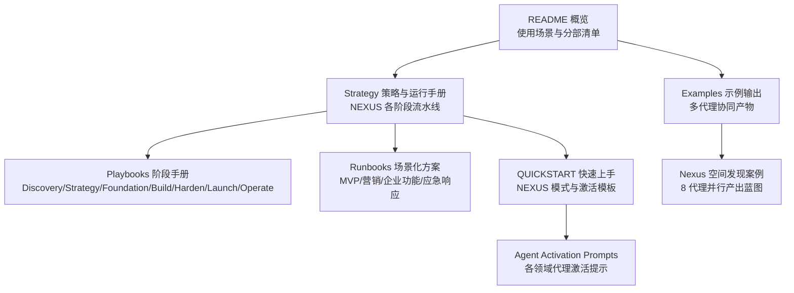
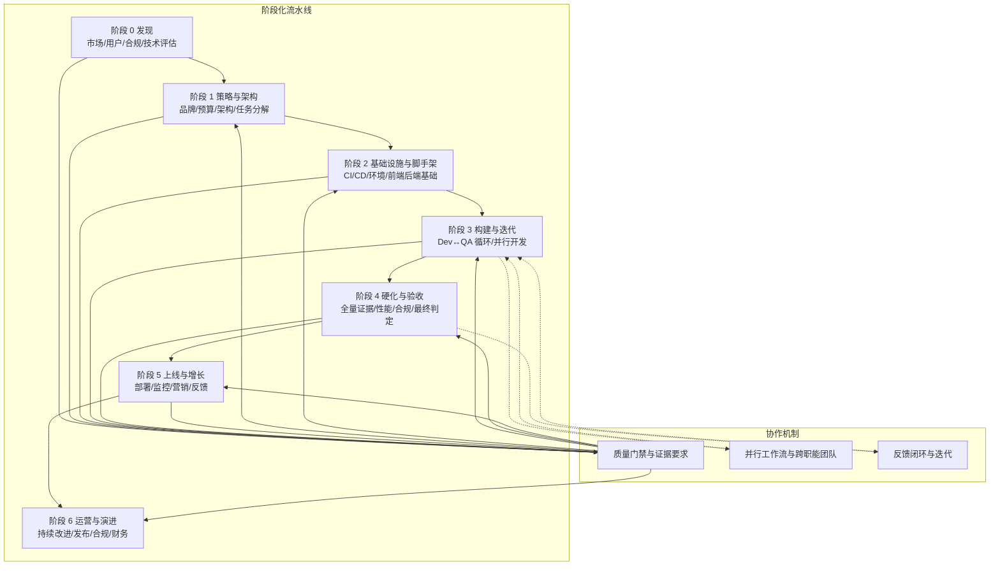
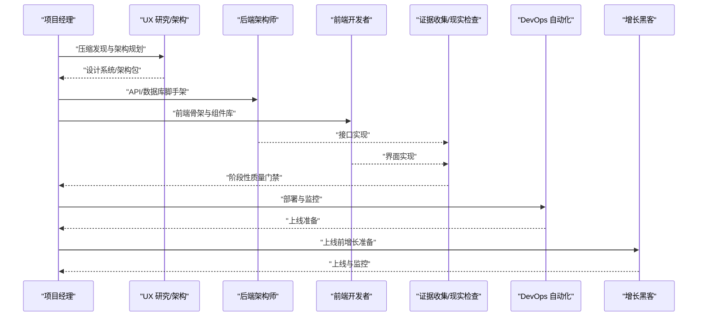
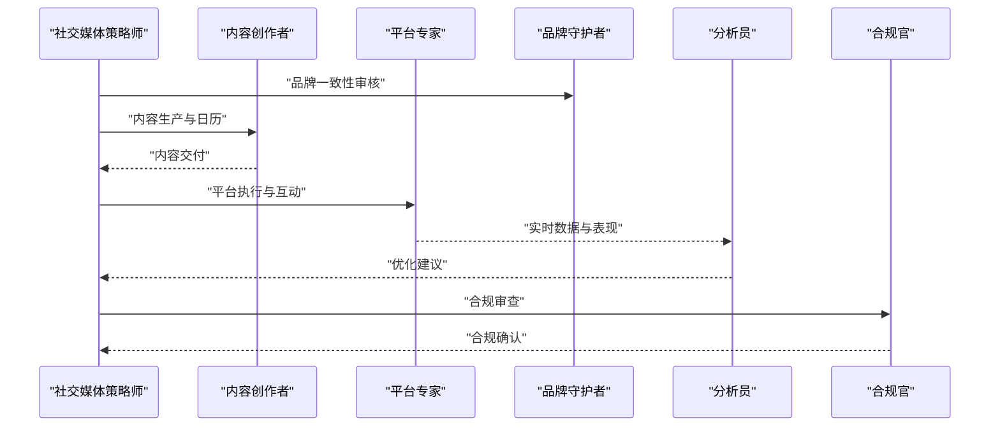
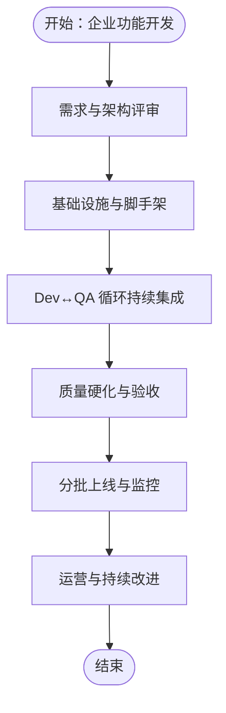
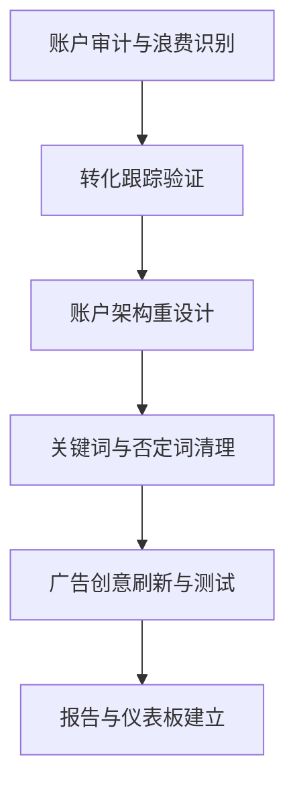
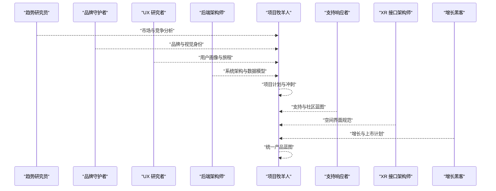
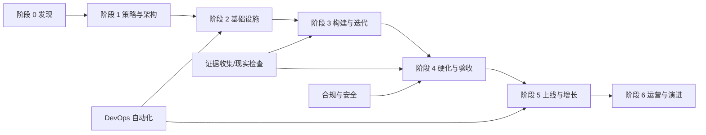
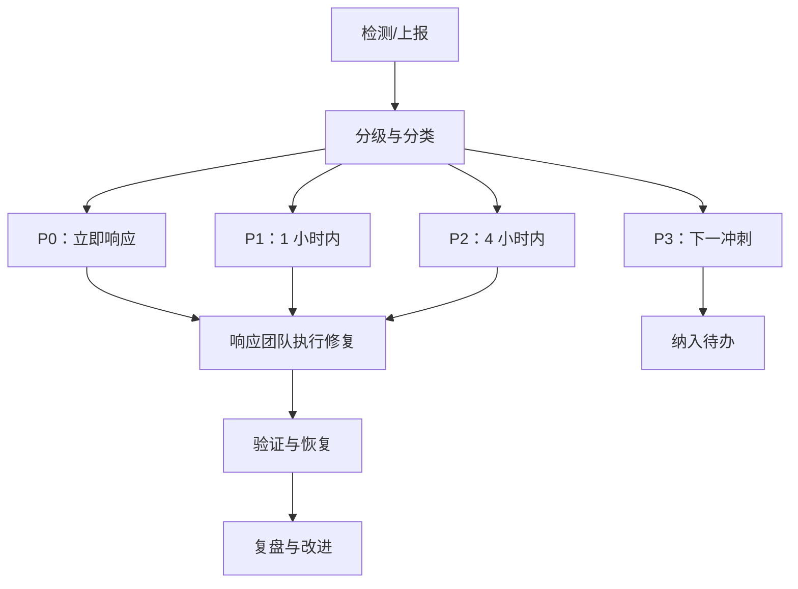

# 示例与用例

<cite>
**本文引用的文件**
- [README.md](file://README.md)
- [examples/README.md](file://examples/README.md)
- [examples/workflow-startup-mvp.md](file://examples/workflow-startup-mvp.md)
- [strategy/QUICKSTART.md](file://strategy/QUICKSTART.md)
- [strategy/runbooks/scenario-startup-mvp.md](file://strategy/runbooks/scenario-startup-mvp.md)
- [strategy/runbooks/scenario-marketing-campaign.md](file://strategy/runbooks/scenario-marketing-campaign.md)
- [strategy/runbooks/scenario-enterprise-feature.md](file://strategy/runbooks/scenario-enterprise-feature.md)
- [strategy/runbooks/scenario-incident-response.md](file://strategy/runbooks/scenario-incident-response.md)
- [strategy/playbooks/phase-0-discovery.md](file://strategy/playbooks/phase-0-discovery.md)
- [strategy/playbooks/phase-1-strategy.md](file://strategy/playbooks/phase-1-strategy.md)
- [strategy/playbooks/phase-2-foundation.md](file://strategy/playbooks/phase-2-foundation.md)
- [strategy/playbooks/phase-3-build.md](file://strategy/playbooks/phase-3-build.md)
- [strategy/playbooks/phase-4-hardening.md](file://strategy/playbooks/phase-4-hardening.md)
- [strategy/playbooks/phase-5-launch.md](file://strategy/playbooks/phase-5-launch.md)
- [strategy/playbooks/phase-6-operate.md](file://strategy/playbooks/phase-6-operate.md)
- [strategy/coordination/agent-activation-prompts.md](file://strategy/coordination/agent-activation-prompts.md)
</cite>

## 目录
1. [简介](#简介)
2. [项目结构](#项目结构)
3. [核心组件](#核心组件)
4. [架构总览](#架构总览)
5. [详细组件分析](#详细组件分析)
6. [依赖分析](#依赖分析)
7. [性能考虑](#性能考虑)
8. [故障排查指南](#故障排查指南)
9. [结论](#结论)
10. [附录](#附录)

## 简介
本文件面向希望在真实世界中落地“agency-agents”多代理协作体系的读者，系统化梳理从概念验证到规模化运营的完整案例与可复用模式。内容覆盖启动 MVP 构建、营销活动策划、企业级功能开发、付费媒体账户接管等典型场景；并以 NEXUS 阶段化流水线为骨架，给出并行工作流、协作模式最佳实践、成功案例拆解、项目进度管理策略与代理组合调整方法。

## 项目结构
仓库采用按职能域划分的模块化组织方式：工程、设计、营销、销售、产品、项目管理、测试、支持、空间计算、游戏开发、学术、专业化等十二个主要部门，每个部门下包含若干专业代理（Agent）。同时提供策略与运行手册（Strategy/Runbooks/Playbooks），以及 Nexus 快速上手指南与激活提示模板，形成“代理定义—策略编排—执行流水线”的完整闭环。

图表来源
- [README.md:352-416](file://README.md#L352-L416)
- [examples/README.md:1-49](file://examples/README.md#L1-L49)
- [strategy/QUICKSTART.md:1-195](file://strategy/QUICKSTART.md#L1-L195)

章节来源
- [README.md:68-416](file://README.md#L68-L416)
- [examples/README.md:1-49](file://examples/README.md#L1-L49)
- [strategy/QUICKSTART.md:1-195](file://strategy/QUICKSTART.md#L1-L195)

## 核心组件
- 多代理协作流水线（NEXUS）：以阶段化流水线串联 Discovery → Strategy → Foundation → Build → Harden → Launch → Operate，每阶段设置质量门禁与证据要求，确保可追溯、可复现、可迭代。
- 代理角色矩阵：工程、设计、营销、销售、产品、项目管理、测试、支持、空间计算、游戏开发、学术、专业化等十二大类，覆盖端到端交付所需能力。
- 场景化运行手册：针对 MVP 建设、营销活动、企业功能开发、应急响应等典型任务，提供团队组成、执行节奏、关键决策点与成功指标。
- 激活提示模板：标准化的代理激活与交接模板，降低沟通成本，保证上下文连续性。

章节来源
- [strategy/playbooks/phase-0-discovery.md:1-179](file://strategy/playbooks/phase-0-discovery.md#L1-L179)
- [strategy/playbooks/phase-1-strategy.md:1-239](file://strategy/playbooks/phase-1-strategy.md#L1-L239)
- [strategy/playbooks/phase-2-foundation.md:1-279](file://strategy/playbooks/phase-2-foundation.md#L1-L279)
- [strategy/playbooks/phase-3-build.md:1-287](file://strategy/playbooks/phase-3-build.md#L1-L287)
- [strategy/playbooks/phase-4-hardening.md:1-333](file://strategy/playbooks/phase-4-hardening.md#L1-L333)
- [strategy/playbooks/phase-5-launch.md:1-278](file://strategy/playbooks/phase-5-launch.md#L1-L278)
- [strategy/playbooks/phase-6-operate.md:1-319](file://strategy/playbooks/phase-6-operate.md#L1-L319)
- [strategy/QUICKSTART.md:1-195](file://strategy/QUICKSTART.md#L1-L195)
- [strategy/coordination/agent-activation-prompts.md:1-402](file://strategy/coordination/agent-activation-prompts.md#L1-L402)

## 架构总览
NEXUS 的多代理协作以“流水线 + 质量门禁 + 并行执行 + 反馈闭环”为核心特征。下图展示从机会识别到产品运营的全生命周期：

图表来源
- [strategy/playbooks/phase-0-discovery.md:1-179](file://strategy/playbooks/phase-0-discovery.md#L1-L179)
- [strategy/playbooks/phase-1-strategy.md:1-239](file://strategy/playbooks/phase-1-strategy.md#L1-L239)
- [strategy/playbooks/phase-2-foundation.md:1-279](file://strategy/playbooks/phase-2-foundation.md#L1-L279)
- [strategy/playbooks/phase-3-build.md:1-287](file://strategy/playbooks/phase-3-build.md#L1-L287)
- [strategy/playbooks/phase-4-hardening.md:1-333](file://strategy/playbooks/phase-4-hardening.md#L1-L333)
- [strategy/playbooks/phase-5-launch.md:1-278](file://strategy/playbooks/phase-5-launch.md#L1-L278)
- [strategy/playbooks/phase-6-operate.md:1-319](file://strategy/playbooks/phase-6-operate.md#L1-L319)

## 详细组件分析

### 场景一：启动 MVP 构建（4-6 周）
- 团队构成：项目经理、研发（前后端）、DevOps、UX 设计、增长、质量门禁（Reality Checker）等。
- 关键路径：压缩发现（快速竞品与用户洞察）→ 架构与任务分解 → 基础设施与脚手架 → Dev↔QA 循环 → 质量硬化 → 上线与增长。
- 成功要素：明确里程碑质量门禁、证据驱动的验收、增长与工程并行准备。

图表来源
- [examples/workflow-startup-mvp.md:1-156](file://examples/workflow-startup-mvp.md#L1-L156)
- [strategy/runbooks/scenario-startup-mvp.md:1-155](file://strategy/runbooks/scenario-startup-mvp.md#L1-L155)
- [strategy/playbooks/phase-1-strategy.md:1-239](file://strategy/playbooks/phase-1-strategy.md#L1-L239)
- [strategy/playbooks/phase-2-foundation.md:1-279](file://strategy/playbooks/phase-2-foundation.md#L1-L279)
- [strategy/playbooks/phase-3-build.md:1-287](file://strategy/playbooks/phase-3-build.md#L1-L287)
- [strategy/playbooks/phase-4-hardening.md:1-333](file://strategy/playbooks/phase-4-hardening.md#L1-L333)
- [strategy/playbooks/phase-5-launch.md:1-278](file://strategy/playbooks/phase-5-launch.md#L1-L278)

章节来源
- [examples/workflow-startup-mvp.md:1-156](file://examples/workflow-startup-mvp.md#L1-L156)
- [strategy/runbooks/scenario-startup-mvp.md:1-155](file://strategy/runbooks/scenario-startup-mvp.md#L1-L155)

### 场景二：营销活动策划（2-4 周）
- 团队构成：社交媒体策略师、内容创作者、平台专家（如 Twitter/Instagram/TikTok）、品牌守护者、分析员、合规官等。
- 执行节奏：策略制定（目标、受众、渠道分配）→ 内容生产（跨平台适配）→ 预热与启动 → 实时优化 → 持续运营与复盘。
- 成功要素：跨平台一致性、数据驱动优化、合规前置审核。

图表来源
- [strategy/runbooks/scenario-marketing-campaign.md:1-188](file://strategy/runbooks/scenario-marketing-campaign.md#L1-L188)

章节来源
- [strategy/runbooks/scenario-marketing-campaign.md:1-188](file://strategy/runbooks/scenario-marketing-campaign.md#L1-L188)

### 场景三：企业功能开发（6-12 周）
- 团队构成：项目协调、跨职能团队、合规与治理、质量保障、性能基准、基础设施等。
- 执行节奏：需求与架构 → 基础设施 → 开发与 QA → 硬化与验收 → 分批上线 → 运营与演进。
- 成功要素：严格的合规与安全基线、端到端质量门禁、可观测性与回滚能力。

图表来源
- [strategy/runbooks/scenario-enterprise-feature.md:1-158](file://strategy/runbooks/scenario-enterprise-feature.md#L1-L158)
- [strategy/playbooks/phase-3-build.md:1-287](file://strategy/playbooks/phase-3-build.md#L1-L287)
- [strategy/playbooks/phase-4-hardening.md:1-333](file://strategy/playbooks/phase-4-hardening.md#L1-L333)
- [strategy/playbooks/phase-5-launch.md:1-278](file://strategy/playbooks/phase-5-launch.md#L1-L278)
- [strategy/playbooks/phase-6-operate.md:1-319](file://strategy/playbooks/phase-6-operate.md#L1-L319)

章节来源
- [strategy/runbooks/scenario-enterprise-feature.md:1-158](file://strategy/runbooks/scenario-enterprise-feature.md#L1-L158)

### 场景四：付费媒体账户接管（30 天内系统化优化）
- 团队构成：付费媒体审计师、追踪与测量专家、PPC 策略师、搜索查询分析师、广告创意策略师、分析员等。
- 执行节奏：账户审计与浪费识别 → 跟踪验证 → 结构优化 → 创意刷新 → 报告与仪表板。
- 成功要素：数据驱动的结构与创意优化、转化跟踪闭环、30 天内可见成效。

图表来源
- [README.md:394-406](file://README.md#L394-L406)

章节来源
- [README.md:394-406](file://README.md#L394-L406)

### 全局案例：Nexus 空间发现（8 代理并行）
- 案例概要：8 个代理并行工作，产出市场验证、技术架构、品牌策略、增长计划、支持蓝图、UX 研究、项目执行计划与空间界面规范。
- 关键点：无需人工协调，代理间通过标准化上下文传递与证据要求自动衔接。

图表来源
- [examples/README.md:13-41](file://examples/README.md#L13-L41)

章节来源
- [examples/README.md:13-41](file://examples/README.md#L13-L41)

## 依赖分析
- 组件耦合与内聚：NEXUS 将“代理角色”与“阶段任务”解耦，通过标准化激活提示与交接模板实现低耦合高内聚的协作。
- 直接与间接依赖：阶段间存在“上游交付物→下游验收”的直接依赖；同时 QA 与合规等质量守卫贯穿全流程，形成间接依赖网络。
- 外部依赖与集成点：工具链（Claude Code、Cursor、Copilot 等）通过转换脚本与安装器对接，实现跨平台一致体验。
- 协作规则与契约：Dev↔QA 循环、证据要求、最大重试次数、质量门禁等规则构成跨代理协作的契约。

图表来源
- [strategy/playbooks/phase-0-discovery.md:1-179](file://strategy/playbooks/phase-0-discovery.md#L1-L179)
- [strategy/playbooks/phase-1-strategy.md:1-239](file://strategy/playbooks/phase-1-strategy.md#L1-L239)
- [strategy/playbooks/phase-2-foundation.md:1-279](file://strategy/playbooks/phase-2-foundation.md#L1-L279)
- [strategy/playbooks/phase-3-build.md:1-287](file://strategy/playbooks/phase-3-build.md#L1-L287)
- [strategy/playbooks/phase-4-hardening.md:1-333](file://strategy/playbooks/phase-4-hardening.md#L1-L333)
- [strategy/playbooks/phase-5-launch.md:1-278](file://strategy/playbooks/phase-5-launch.md#L1-L278)
- [strategy/playbooks/phase-6-operate.md:1-319](file://strategy/playbooks/phase-6-operate.md#L1-L319)

章节来源
- [strategy/QUICKSTART.md:144-152](file://strategy/QUICKSTART.md#L144-L152)
- [strategy/coordination/agent-activation-prompts.md:388-402](file://strategy/coordination/agent-activation-prompts.md#L388-L402)

## 性能考虑
- Dev↔QA 循环效率：通过并行开发与独立 QA 流程，缩短反馈周期；最大重试次数控制避免无限循环。
- 质量门槛与证据驱动：以截图、测试结果、性能数据为依据，减少主观判断带来的返工。
- 基础设施自动化：CI/CD、监控与弹性配置降低运维开销，提升上线频率与稳定性。
- 性能基准与回归：在构建期与硬化期分别进行性能测试，确保端到端性能达标。

## 故障排查指南
- 应急响应（P0-P3 分级）：明确严重级别、响应团队、处置流程与升级矩阵，确保快速收敛。
- 质量门禁不通过：Reality Checker 默认“需要改进”，需提供充分证据并通过 QA 交叉验证。
- 重大架构问题：退回至架构或基础阶段，重新评审与重建。
- 日常运营中的问题：按季度回顾、月度合规检查、周度增长复盘与日度监控，形成闭环。

图表来源
- [strategy/runbooks/scenario-incident-response.md:1-218](file://strategy/runbooks/scenario-incident-response.md#L1-L218)

章节来源
- [strategy/runbooks/scenario-incident-response.md:1-218](file://strategy/runbooks/scenario-incident-response.md#L1-L218)

## 结论
通过 NEXUS 阶段化流水线与标准化协作机制，agency-agents 能够在真实世界中高效落地多种复杂项目。无论是快速 MVP、跨平台营销、企业级功能，还是媒体账户接管与应急响应，均可按“质量门禁 + 证据驱动 + 并行执行 + 持续改进”的范式复用。建议在实践中结合项目规模与约束，动态调整代理组合与协作规则，持续优化 Dev↔QA 循环与运营节奏。

## 附录

### 不同类型项目的典型工作流程
- 敏捷开发：以短迭代（2 周冲刺）推进，每日站会、Sprint 评审与回顾，持续交付可用增量。
- 瀑布模型：严格阶段边界与文档交付，适用于合规与安全要求极高的场景。
- 混合方法：在架构与基础设施阶段采用瀑布，在功能实现阶段采用敏捷，兼顾确定性与灵活性。

章节来源
- [strategy/playbooks/phase-3-build.md:1-287](file://strategy/playbooks/phase-3-build.md#L1-L287)
- [strategy/playbooks/phase-1-strategy.md:1-239](file://strategy/playbooks/phase-1-strategy.md#L1-L239)

### 实施步骤与时间线（以 MVP 为例）
- 第 1 周：压缩发现 + 架构与任务分解
- 第 2-3 周：核心功能构建（Dev↔QA 循环）
- 第 4 周：质量硬化与最终验收
- 第 5-6 周：上线与增长

章节来源
- [examples/workflow-startup-mvp.md:21-156](file://examples/workflow-startup-mvp.md#L21-L156)
- [strategy/runbooks/scenario-startup-mvp.md:43-124](file://strategy/runbooks/scenario-startup-mvp.md#L43-L124)

### 如何根据项目特点调整代理组合与工作流程
- 选择合适的代理：依据任务类型（工程/设计/测试/营销/合规）匹配对应代理；必要时引入平台专家或专项支持代理。
- 设置协作规则：明确质量门禁、证据要求、最大重试次数、交接模板与决策权限。
- 管理项目进度：以阶段边界为节点进行评审与决策，利用执行摘要与状态报告保持透明度。

章节来源
- [strategy/QUICKSTART.md:144-152](file://strategy/QUICKSTART.md#L144-L152)
- [strategy/coordination/agent-activation-prompts.md:1-402](file://strategy/coordination/agent-activation-prompts.md#L1-L402)