# 落地页工作流

<cite>
**本文档引用的文件**
- [workflow-landing-page.md](file://examples/workflow-landing-page.md)
- [marketing-content-creator.md](file://marketing/marketing-content-creator.md)
- [design-ui-designer.md](file://design/design-ui-designer.md)
- [engineering-frontend-developer.md](file://engineering/engineering-frontend-developer.md)
- [marketing-growth-hacker.md](file://marketing/marketing-growth-hacker.md)
- [marketing-seo-specialist.md](file://marketing/marketing-seo-specialist.md)
- [testing-workflow-optimizer.md](file://testing/testing-workflow-optimizer.md)
- [phase-0-discovery.md](file://strategy/playbooks/phase-0-discovery.md)
- [phase-1-strategy.md](file://strategy/playbooks/phase-1-strategy.md)
- [scenario-marketing-campaign.md](file://strategy/runbooks/scenario-marketing-campaign.md)
- [project-manager-senior.md](file://project-management/project-manager-senior.md)
- [README.md](file://README.md)
</cite>

## 目录
1. [简介](#简介)
2. [项目结构](#项目结构)
3. [核心组件](#核心组件)
4. [架构总览](#架构总览)
5. [详细组件分析](#详细组件分析)
6. [依赖关系分析](#依赖关系分析)
7. [性能考虑](#性能考虑)
8. [故障排除指南](#故障排除指南)
9. [结论](#结论)
10. [附录](#附录)

## 简介
本文件系统化阐述如何运用 agency-agents 代理团队构建高效的营销落地页。该工作流以“多代理协作”为核心，围绕目标设定、受众分析、创意构思、页面设计、内容编写到效果优化的完整闭环展开，明确各代理的专业分工与协作节奏，提供可复用的落地页制作工作流模板与最佳实践。

## 项目结构
agency-agents 提供了完整的代理生态，涵盖工程、设计、营销、产品、测试、支持等多个领域。针对落地页工作流，我们重点使用以下代理：
- 内容创作：营销内容创作者（负责文案与品牌叙事）
- 视觉设计：UI 设计师（负责设计系统与组件规范）
- 前端开发：前端开发者（负责响应式、可访问性与性能）
- 转化优化：增长黑客（负责转化率优化与 A/B 测试）
- SEO 优化：SEO 专家（负责技术 SEO 与内容优化）
- 工作流优化：工作流优化器（负责流程改进与自动化）
- 项目管理：高级项目经理（负责任务分解与质量门禁）
- 战略规划：阶段化工作手册（用于发现与策略阶段）

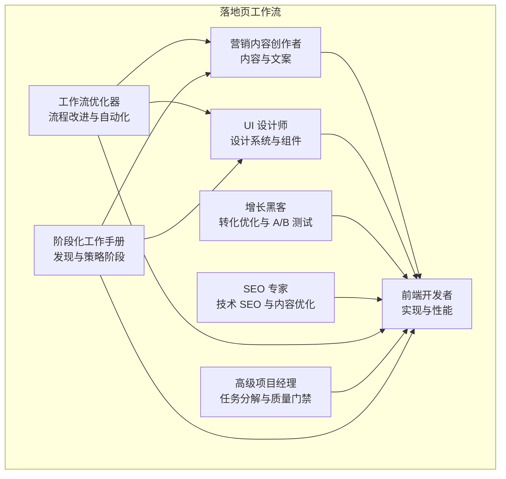

图表来源
- [workflow-landing-page.md:18-120](file://examples/workflow-landing-page.md#L18-L120)
- [marketing-content-creator.md:10-54](file://marketing/marketing-content-creator.md#L10-L54)
- [design-ui-designer.md:9-383](file://design/design-ui-designer.md#L9-L383)
- [engineering-frontend-developer.md:9-225](file://engineering/engineering-frontend-developer.md#L9-L225)
- [marketing-growth-hacker.md:10-54](file://marketing/marketing-growth-hacker.md#L10-L54)
- [marketing-seo-specialist.md:10-280](file://marketing/marketing-seo-specialist.md#L10-L280)
- [testing-workflow-optimizer.md:9-450](file://testing/testing-workflow-optimizer.md#L9-L450)
- [project-manager-senior.md:9-136](file://project-management/project-manager-senior.md#L9-L136)
- [phase-0-discovery.md:1-179](file://strategy/playbooks/phase-0-discovery.md#L1-L179)
- [phase-1-strategy.md:1-239](file://strategy/playbooks/phase-1-strategy.md#L1-L239)

章节来源
- [README.md:68-182](file://README.md#L68-L182)
- [examples/workflow-landing-page.md:1-120](file://examples/workflow-landing-page.md#L1-L120)

## 核心组件
- 营销内容创作者：负责品牌叙事、多平台内容策略、SEO 友好内容与跨渠道优化。
- UI 设计师：负责设计系统、组件库、响应式框架、可访问性标准与开发者交底。
- 前端开发者：负责响应式实现、可访问性、性能优化（Core Web Vitals）、组件架构与测试。
- 增长黑客：负责转化漏斗优化、A/B 测试设计、实验执行与数据分析。
- SEO 专家：负责技术 SEO 审计、关键词策略、内容结构优化、结构化数据与 SERP 特征优化。
- 工作流优化器：负责流程瓶颈识别、自动化机会评估、实施路线图与 ROI 分析。
- 高级项目经理：负责将规格转化为可执行任务、验收标准与质量门禁。
- 阶段化工作手册：为落地页项目提供发现与策略阶段的标准化流程。

章节来源
- [marketing-content-creator.md:12-54](file://marketing/marketing-content-creator.md#L12-L54)
- [design-ui-designer.md:19-383](file://design/design-ui-designer.md#L19-L383)
- [engineering-frontend-developer.md:19-225](file://engineering/engineering-frontend-developer.md#L19-L225)
- [marketing-growth-hacker.md:12-54](file://marketing/marketing-growth-hacker.md#L12-L54)
- [marketing-seo-specialist.md:12-280](file://marketing/marketing-seo-specialist.md#L12-L280)
- [testing-workflow-optimizer.md:19-450](file://testing/testing-workflow-optimizer.md#L19-L450)
- [project-manager-senior.md:19-136](file://project-management/project-manager-senior.md#L19-L136)
- [phase-0-discovery.md:7-179](file://strategy/playbooks/phase-0-discovery.md#L7-L179)
- [phase-1-strategy.md:7-239](file://strategy/playbooks/phase-1-strategy.md#L7-L239)

## 架构总览
落地页工作流采用“并行启动 + 合并点 + 反馈循环”的流水线模式：
- 并行启动：内容与设计同时进行，独立产出，减少等待时间。
- 合并点：前端开发在获得内容与设计输出后开始实现。
- 反馈循环：增长黑客对页面进行转化优化审查，前端根据反馈迭代。
- 时间盒：每个阶段设定明确时限，避免范围蔓延。

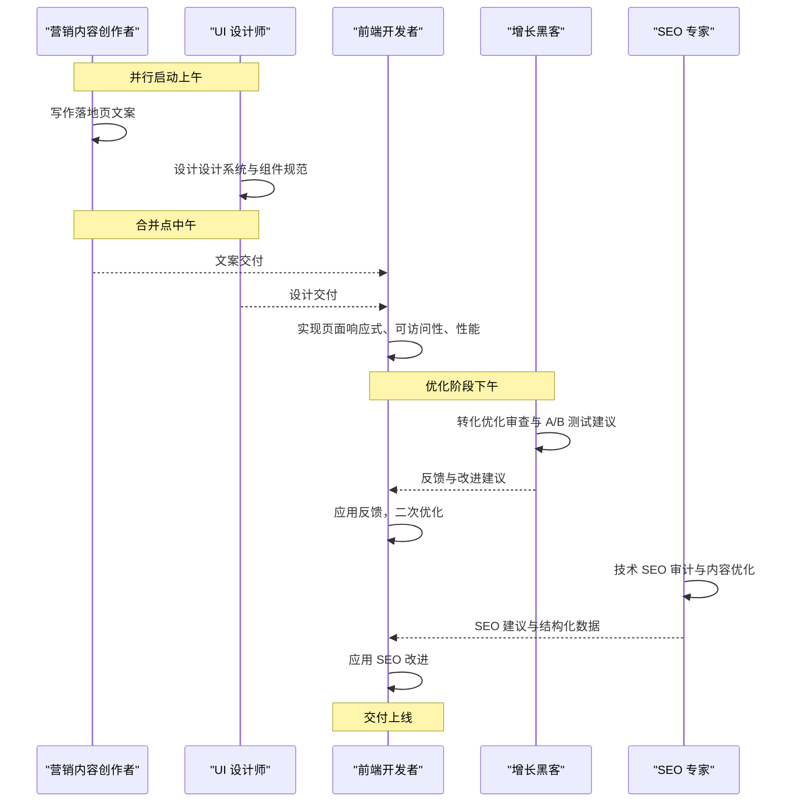

图表来源
- [workflow-landing-page.md:18-120](file://examples/workflow-landing-page.md#L18-L120)

章节来源
- [workflow-landing-page.md:18-120](file://examples/workflow-landing-page.md#L18-L120)

## 详细组件分析

### 组件一：目标设定与受众分析
- 使用阶段化工作手册的“发现阶段”能力，进行市场情报、用户需求与行为分析、合规与技术可行性评估。
- 输出：明确目标、受众画像、竞品分析、技术约束与合规要求。
- 关键工具：趋势研究员、反馈合成器、UX 研究员、法律合规检查员、工具评估员。

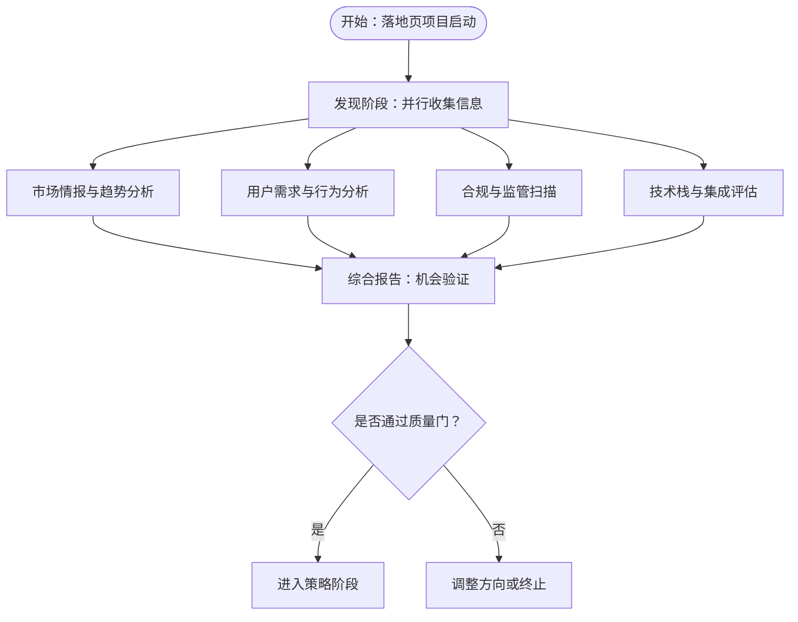

图表来源
- [phase-0-discovery.md:17-179](file://strategy/playbooks/phase-0-discovery.md#L17-L179)

章节来源
- [phase-0-discovery.md:7-179](file://strategy/playbooks/phase-0-discovery.md#L7-L179)

### 组件二：创意构思与内容策略
- 营销内容创作者负责品牌叙事、内容日历、跨平台适配与 SEO 友好内容。
- 关键能力：内容策略、多格式创作、品牌故事、视频脚本、复制文案、内容分发与性能分析。
- 成功指标：内容参与度、有机流量增长、视频观看完成率、内容分享率、线索生成量、品牌知名度提升、内容 ROI。

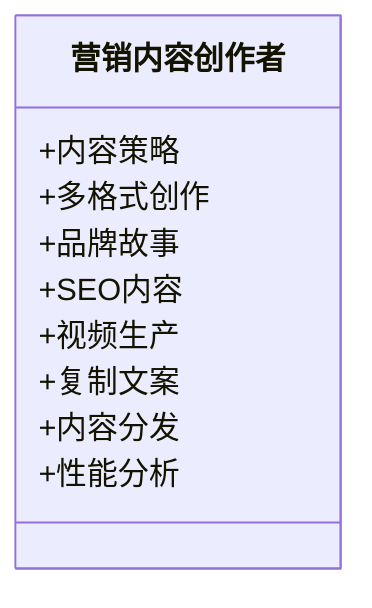

图表来源
- [marketing-content-creator.md:12-54](file://marketing/marketing-content-creator.md#L12-L54)

章节来源
- [marketing-content-creator.md:12-54](file://marketing/marketing-content-creator.md#L12-L54)

### 组件三：页面设计与设计系统
- UI 设计师负责设计系统、组件库、响应式框架、可访问性与开发者交底。
- 关键交付：设计令牌系统、组件样式、响应式断点、可访问性标准、开发者文档。
- 成功指标：设计一致性、可访问性达标、开发者交底准确率、组件复用率、响应式覆盖度。

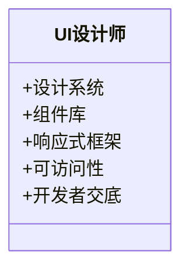

图表来源
- [design-ui-designer.md:19-383](file://design/design-ui-designer.md#L19-L383)

章节来源
- [design-ui-designer.md:19-383](file://design/design-ui-designer.md#L19-L383)

### 组件四：前端实现与性能优化
- 前端开发者负责响应式实现、可访问性、性能优化（Core Web Vitals）、组件架构与测试。
- 关键交付：实现方案、性能优化、可访问性实现、组件库与测试报告。
- 成功指标：页面加载时间、Lighthouse 分数、跨浏览器兼容性、组件复用率、零生产错误。

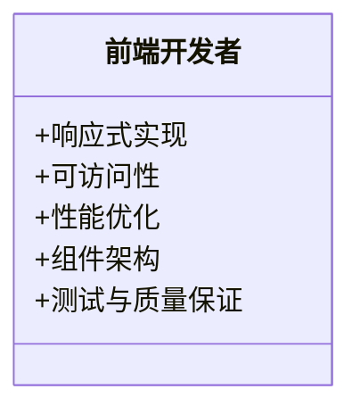

图表来源
- [engineering-frontend-developer.md:19-225](file://engineering/engineering-frontend-developer.md#L19-L225)

章节来源
- [engineering-frontend-developer.md:19-225](file://engineering/engineering-frontend-developer.md#L19-L225)

### 组件五：转化优化与 A/B 测试
- 增长黑客负责转化漏斗优化、A/B 测试设计、实验执行与数据分析。
- 关键能力：增长策略、实验设计、分析与归因、病毒机制、渠道优化、产品驱动增长。
- 成功指标：用户增长率、病毒系数、CAC 回本周期、LTV:CAC、激活率、留存率、实验速度与胜率。

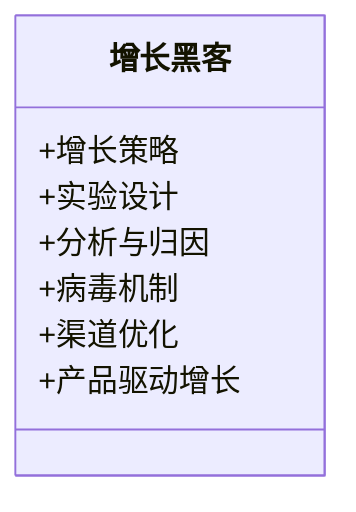

图表来源
- [marketing-growth-hacker.md:12-54](file://marketing/marketing-growth-hacker.md#L12-L54)

章节来源
- [marketing-growth-hacker.md:12-54](file://marketing/marketing-growth-hacker.md#L12-L54)

### 组件六：SEO 优化与内容策略
- SEO 专家负责技术 SEO 审计、关键词研究、内容结构优化、结构化数据与 SERP 特征优化。
- 关键交付：技术 SEO 审计报告、关键词策略文档、页面优化清单、链接建设计划。
- 成功指标：有机流量增长、关键词可见度、技术健康评分、Core Web Vitals、域名权威、有机转化率、内容 ROI。

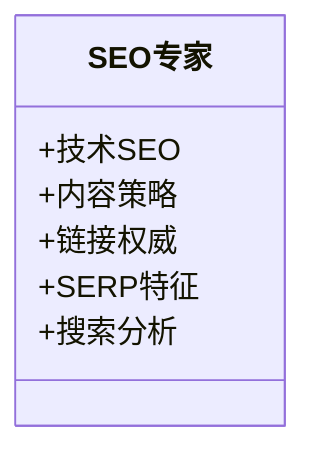

图表来源
- [marketing-seo-specialist.md:12-280](file://marketing/marketing-seo-specialist.md#L12-L280)

章节来源
- [marketing-seo-specialist.md:12-280](file://marketing/marketing-seo-specialist.md#L12-L280)

### 组件七：工作流优化与自动化
- 工作流优化器负责流程瓶颈识别、自动化机会评估、实施路线图与 ROI 分析。
- 关键交付：优化影响摘要、当前状态分析、优化未来状态、实施路线图、业务案例与 ROI。
- 成功指标：流程完成时间改善、自动化任务比例、流程错误率降低、员工满意度提升。

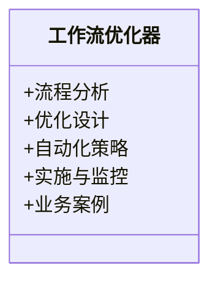

图表来源
- [testing-workflow-optimizer.md:19-450](file://testing/testing-workflow-optimizer.md#L19-L450)

章节来源
- [testing-workflow-optimizer.md:19-450](file://testing/testing-workflow-optimizer.md#L19-L450)

### 组件八：项目管理与质量门禁
- 高级项目经理负责将规格转化为可执行任务、验收标准与质量门禁。
- 关键交付：开发任务清单、质量要求、技术备注、学习与改进。
- 成功指标：任务清晰度、无范围蔓延、技术要求完整、成功交付。

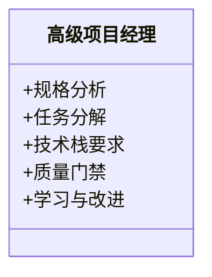

图表来源
- [project-manager-senior.md:19-136](file://project-management/project-manager-senior.md#L19-L136)

章节来源
- [project-manager-senior.md:19-136](file://project-management/project-manager-senior.md#L19-L136)

## 依赖关系分析
落地页工作流中各代理之间的依赖关系如下：
- 内容与设计并行产出，前端开发作为合并点依赖两者输出。
- 增长黑客与 SEO 专家在前端完成后进行优化审查，形成反馈循环。
- 工作流优化器贯穿全流程，为内容、设计、开发与优化提供流程改进与自动化建议。
- 高级项目经理确保任务分解与质量门禁，保障交付质量与时限。
- 阶段化工作手册为项目提供发现与策略阶段的标准化流程，确保前期洞察与资源投入的合理性。

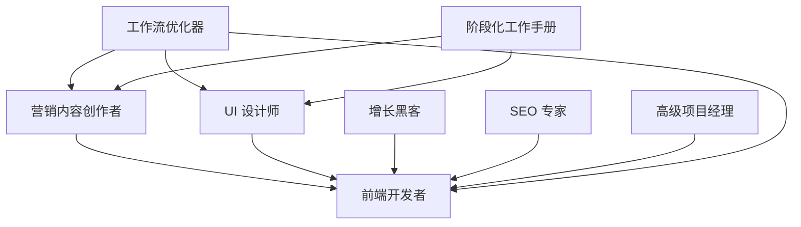

图表来源
- [workflow-landing-page.md:18-120](file://examples/workflow-landing-page.md#L18-L120)
- [testing-workflow-optimizer.md:335-450](file://testing/testing-workflow-optimizer.md#L335-L450)
- [project-manager-senior.md:19-136](file://project-management/project-manager-senior.md#L19-L136)
- [phase-0-discovery.md:17-179](file://strategy/playbooks/phase-0-discovery.md#L17-L179)
- [phase-1-strategy.md:17-239](file://strategy/playbooks/phase-1-strategy.md#L17-L239)

章节来源
- [workflow-landing-page.md:18-120](file://examples/workflow-landing-page.md#L18-L120)
- [testing-workflow-optimizer.md:335-450](file://testing/testing-workflow-optimizer.md#L335-L450)
- [project-manager-senior.md:19-136](file://project-management/project-manager-senior.md#L19-L136)
- [phase-0-discovery.md:17-179](file://strategy/playbooks/phase-0-discovery.md#L17-L179)
- [phase-1-strategy.md:17-239](file://strategy/playbooks/phase-1-strategy.md#L17-L239)

## 性能考虑
- 页面性能：前端开发者需关注 Core Web Vitals（LCP、FID、CLS），确保移动端与桌面端均达到“良好”阈值；采用现代性能技术（代码分割、懒加载、缓存）。
- 可访问性：遵循 WCAG 2.1 AA 标准，确保键盘导航、屏幕阅读器支持、焦点管理与对比度要求。
- 响应式设计：基于移动优先策略，建立合理的断点与网格系统，确保在所有设备上一致体验。
- SEO 性能：优化页面加载速度、结构化数据、元标签与 OG 标签，提升搜索引擎可见性与 SERP 特征捕获。

章节来源
- [engineering-frontend-developer.md:36-225](file://engineering/engineering-frontend-developer.md#L36-L225)
- [marketing-seo-specialist.md:25-280](file://marketing/marketing-seo-specialist.md#L25-L280)

## 故障排除指南
- 内容问题：若文案不符合品牌调性或未覆盖关键信息，由营销内容创作者重新梳理内容策略与结构。
- 设计问题：若组件不一致或可访问性不足，由 UI 设计师提供设计令牌与组件规范，前端开发者按规范实现。
- 开发问题：若性能不达标或可访问性缺失，由前端开发者进行性能优化与可访问性修复。
- 转化问题：若转化率低，由增长黑客进行 A/B 测试设计与实验执行，前端开发者应用反馈进行迭代。
- SEO 问题：若技术 SEO 不达标，由 SEO 专家提供审计报告与优化清单，前端开发者落实改进。
- 流程问题：若流程效率低，由工作流优化器进行瓶颈识别与自动化建议，团队按路线图实施。
- 任务问题：若任务不清晰或范围蔓延，由高级项目经理重新分解任务与验收标准，确保质量门禁。

章节来源
- [marketing-content-creator.md:35-54](file://marketing/marketing-content-creator.md#L35-L54)
- [design-ui-designer.md:40-383](file://design/design-ui-designer.md#L40-L383)
- [engineering-frontend-developer.md:50-225](file://engineering/engineering-frontend-developer.md#L50-L225)
- [marketing-growth-hacker.md:35-54](file://marketing/marketing-growth-hacker.md#L35-L54)
- [marketing-seo-specialist.md:25-280](file://marketing/marketing-seo-specialist.md#L25-L280)
- [testing-workflow-optimizer.md:42-450](file://testing/testing-workflow-optimizer.md#L42-L450)
- [project-manager-senior.md:39-136](file://project-management/project-manager-senior.md#L39-L136)

## 结论
通过将营销内容创作者、UI 设计师、前端开发者、增长黑客、SEO 专家、工作流优化器、高级项目经理与阶段化工作手册整合为统一的落地页工作流，团队可以在明确的时间盒内高效协作，实现从目标设定到效果优化的全链路闭环。该工作流强调并行启动、合并点与反馈循环，结合可量化的成功指标与流程改进，能够持续提升落地页的转化效果与运营效率。

## 附录
- 多渠道营销协同参考：可借鉴“多渠道营销活动”运行手册中的跨平台策略与品牌一致性检查点，确保落地页与整体营销活动协同。
- 企业级落地页参考：可参考“阶段 1：策略与架构”中的设计系统与技术架构，确保落地页具备可扩展性与可维护性。

章节来源
- [scenario-marketing-campaign.md:1-188](file://strategy/runbooks/scenario-marketing-campaign.md#L1-L188)
- [phase-1-strategy.md:1-239](file://strategy/playbooks/phase-1-strategy.md#L1-L239)