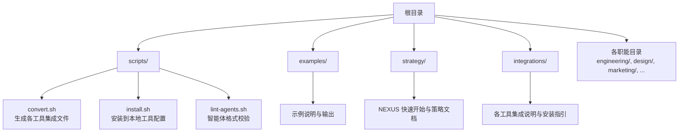
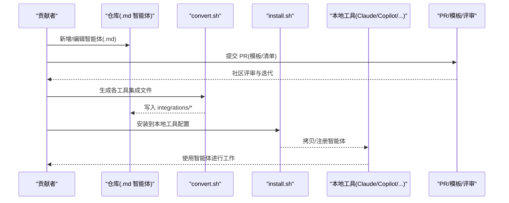
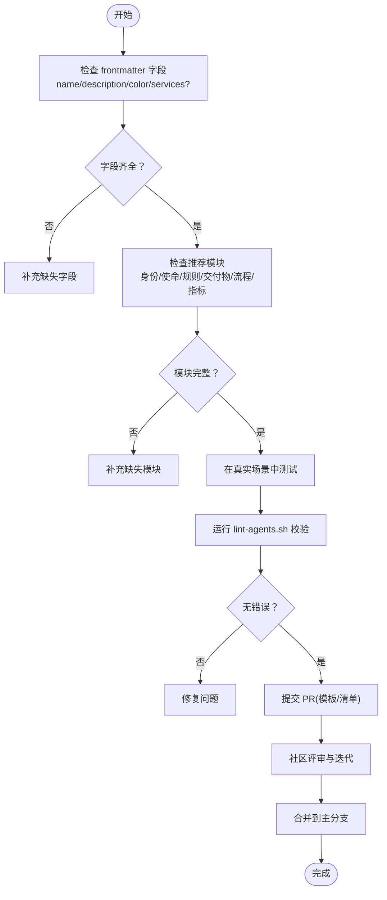
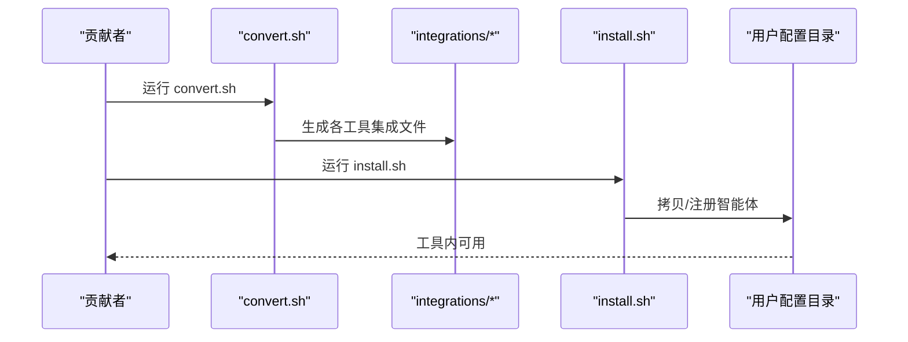
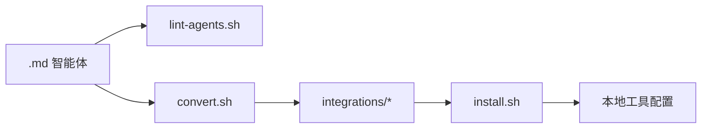

# 贡献指南

<cite>
**本文引用的文件**
- [CONTRIBUTING.md](file://CONTRIBUTING.md)
- [CONTRIBUTING_zh-CN.md](file://CONTRIBUTING_zh-CN.md)
- [README.md](file://README.md)
- [.github/PULL_REQUEST_TEMPLATE.md](file://.github/PULL_REQUEST_TEMPLATE.md)
- [scripts/lint-agents.sh](file://scripts/lint-agents.sh)
- [scripts/convert.sh](file://scripts/convert.sh)
- [scripts/install.sh](file://scripts/install.sh)
- [.gitignore](file://.gitignore)
- [examples/README.md](file://examples/README.md)
- [strategy/QUICKSTART.md](file://strategy/QUICKSTART.md)
- [integrations/README.md](file://integrations/README.md)
- [engineering/engineering-frontend-developer.md](file://engineering/engineering-frontend-developer.md)
- [marketing/marketing-reddit-community-builder.md](file://marketing/marketing-reddit-community-builder.md)
- [design/design-whimsy-injector.md](file://design/design-whimsy-injector.md)
</cite>

## 目录
1. [简介](#简介)
2. [项目结构](#项目结构)
3. [核心组件](#核心组件)
4. [架构总览](#架构总览)
5. [详细组件分析](#详细组件分析)
6. [依赖关系分析](#依赖关系分析)
7. [性能考量](#性能考量)
8. [故障排查指南](#故障排查指南)
9. [结论](#结论)
10. [附录](#附录)

## 简介
本指南面向希望为 agency-agents 项目做出贡献的开发者与内容创作者，涵盖如何新增与改进智能体、如何参与讨论与反馈、代码规范与质量要求、社区治理与国际化贡献路径，以及版本与发布相关注意事项。项目目标是通过标准化的智能体模板与严格的质量流程，构建可复用、可扩展、可跨工具集成的“AI专家团队”。

## 项目结构
项目采用“按职能划分”的目录组织方式，每个职能下包含多个专业化智能体文件。此外，还提供脚本工具用于多工具集成转换与安装，以及示例与策略文档帮助理解如何协同使用这些智能体。

图表来源
- [scripts/convert.sh:1-639](file://scripts/convert.sh#L1-L639)
- [scripts/install.sh:1-640](file://scripts/install.sh#L1-L640)
- [scripts/lint-agents.sh:1-117](file://scripts/lint-agents.sh#L1-L117)
- [examples/README.md:1-49](file://examples/README.md#L1-L49)
- [strategy/QUICKSTART.md:1-195](file://strategy/QUICKSTART.md#L1-L195)
- [integrations/README.md:1-209](file://integrations/README.md#L1-L209)

章节来源
- [README.md: 68-283:68-283](file://README.md#L68-L283)
- [integrations/README.md: 1-209:1-209](file://integrations/README.md#L1-L209)

## 核心组件
- 智能体模板与设计规范：统一的智能体结构、个性与使命、工作流、交付物、成功指标等模块，确保可读性与可操作性。
- 脚本工具链：convert.sh 将 Markdown 智能体转换为各工具所需的格式；install.sh 将转换产物安装到本地工具配置；lint-agents.sh 校验智能体文件的必需字段与推荐结构。
- 示例与策略：examples/ 展示多智能体协同的实际案例；strategy/ 提供 NEXUS 快速启动与阶段化工作流。
- 质量门禁：PR 流程与模板、行为准则、风格指南，确保贡献质量与社区协作效率。

章节来源
- [CONTRIBUTING.md: 81-240:81-240](file://CONTRIBUTING.md#L81-L240)
- [scripts/convert.sh: 107-480:107-480](file://scripts/convert.sh#L107-L480)
- [scripts/install.sh: 296-511:296-511](file://scripts/install.sh#L296-L511)
- [scripts/lint-agents.sh: 13-98:13-98](file://scripts/lint-agents.sh#L13-L98)
- [examples/README.md: 1-49:1-49](file://examples/README.md#L1-L49)
- [strategy/QUICKSTART.md: 1-195:1-195](file://strategy/QUICKSTART.md#L1-L195)

## 架构总览
下图展示了从“新增/改进智能体”到“多工具集成与安装”的端到端流程，以及质量门禁与社区协作机制。

图表来源
- [scripts/convert.sh: 520-636:520-636](file://scripts/convert.sh#L520-L636)
- [scripts/install.sh: 515-637:515-637](file://scripts/install.sh#L515-L637)
- [.github/PULL_REQUEST_TEMPLATE.md: 1-18:1-18](file://.github/PULL_REQUEST_TEMPLATE.md#L1-L18)

章节来源
- [CONTRIBUTING.md: 242-317:242-317](file://CONTRIBUTING.md#L242-L317)
- [integrations/README.md: 19-47:19-47](file://integrations/README.md#L19-L47)

## 详细组件分析

### 新增智能体：模板与最佳实践
- 模板结构：必须包含 YAML frontmatter（name、description、color 等），以及“身份与记忆”“核心使命”“关键规则”“技术交付物”“工作流程”“沟通风格”“学习与记忆”“成功指标”“高级能力”等模块。
- 设计原则：强个性、明确交付物、可衡量的成功指标、经验证的工作流、学习记忆。
- 外部服务：若依赖外部服务，需在 frontmatter 的 services 字段声明，并确保即使剥离 API 调用，智能体仍具备独立价值。
- 工具兼容：针对不同工具（如 Qwen Code SubAgent）提供最小 frontmatter 字段。

图表来源
- [CONTRIBUTING.md: 81-240:81-240](file://CONTRIBUTING.md#L81-L240)
- [scripts/lint-agents.sh: 33-79:33-79](file://scripts/lint-agents.sh#L33-L79)
- [.github/PULL_REQUEST_TEMPLATE.md: 5-17:5-17](file://.github/PULL_REQUEST_TEMPLATE.md#L5-L17)

章节来源
- [CONTRIBUTING.md: 81-240:81-240](file://CONTRIBUTING.md#L81-L240)
- [scripts/lint-agents.sh: 13-98:13-98](file://scripts/lint-agents.sh#L13-L98)
- [.github/PULL_REQUEST_TEMPLATE.md: 1-18:1-18](file://.github/PULL_REQUEST_TEMPLATE.md#L1-L18)

### 改进现有智能体：示例、指标与工作流
- 增加真实世界案例与使用场景，提升可迁移性与可信度。
- 用现代模式完善代码示例，确保可运行与最佳实践。
- 基于最新最佳实践更新工作流，保持与行业趋势同步。
- 添加成功指标与基准，量化成果与质量。
- 修复错别字、提升清晰度、完善文档。

章节来源
- [CONTRIBUTING.md: 51-59:51-59](file://CONTRIBUTING.md#L51-L59)

### 多工具集成：转换与安装
- 转换：convert.sh 将 Markdown 智能体转换为各工具所需的格式（Antigravity、Gemini CLI、OpenCode、Cursor、Aider、Windsurf、OpenClaw、Qwen Code、Kimi Code）。
- 安装：install.sh 将转换产物安装到本地工具配置目录，支持交互式与非交互式两种模式，支持并行加速。
- 生成与缓存：.gitignore 排除生成文件，仅保留转换脚本与集成说明。

图表来源
- [scripts/convert.sh: 520-636:520-636](file://scripts/convert.sh#L520-L636)
- [scripts/install.sh: 515-637:515-637](file://scripts/install.sh#L515-L637)
- [.gitignore: 66-81:66-81](file://.gitignore#L66-L81)

章节来源
- [scripts/convert.sh: 1-L639:1-639](file://scripts/convert.sh#L1-L639)
- [scripts/install.sh: 1-L640:1-640](file://scripts/install.sh#L1-L640)
- [.gitignore: 66-81:66-81](file://.gitignore#L66-L81)

### 示例与策略：多智能体协同
- examples/ 展示多智能体协同解决复杂任务的真实案例，体现智能体组合的实战价值。
- strategy/QUICKSTART.md 提供 NEXUS 快速启动与阶段化工作流，帮助团队以流水线方式协作。

章节来源
- [examples/README.md: 1-49:1-49](file://examples/README.md#L1-L49)
- [strategy/QUICKSTART.md: 1-195:1-195](file://strategy/QUICKSTART.md#L1-L195)

### 代码规范与质量要求
- 写作风格：具体、落地、易记、实用。
- 格式规范：统一 Markdown、章节表情符号、代码块语法高亮、表格对比、强调与术语标注。
- 代码示例：语言标注、注释说明、真实可运行、现代最佳实践。
- 语气：专业而亲和、自信而不傲慢、有助而不包办、个性驱动。

章节来源
- [CONTRIBUTING.md: 321-364:321-364](file://CONTRIBUTING.md#L321-L364)

### 社区参与与治理
- 行为准则：尊重、包容、协作、专业。
- 贡献渠道：新增智能体、改进现有智能体、分享成功故事、反馈问题。
- 讨论与反馈：使用 GitHub Discussions 与 Issues，保持聚焦与高效。

章节来源
- [CONTRIBUTING.md: 16-24:16-24](file://CONTRIBUTING.md#L16-L24)
- [CONTRIBUTING.md: 27-78:27-78](file://CONTRIBUTING.md#L27-L78)

### 国际化贡献
- 文档双语：CONTRIBUTING_zh-CN.md 提供中文贡献指南，便于中文社区参与。
- 翻译与本地化：建议在新增或改进智能体时，同时提供中文版本说明与示例，确保跨语言协作顺畅。

章节来源
- [CONTRIBUTING_zh-CN.md: 1-319:1-319](file://CONTRIBUTING_zh-CN.md#L1-L319)

## 依赖关系分析
- 智能体文件依赖：convert.sh 依赖智能体 Markdown 文件中的 frontmatter 与正文结构；install.sh 依赖 convert.sh 生成的集成文件。
- 质量控制：lint-agents.sh 对智能体文件进行前置校验，减少后续 PR 审核成本。
- 版本与发布：仓库未显式定义版本号与发布流程，建议在 PR 合并后由维护者统一管理版本与发布节奏。

图表来源
- [scripts/lint-agents.sh: 13-98:13-98](file://scripts/lint-agents.sh#L13-L98)
- [scripts/convert.sh: 520-636:520-636](file://scripts/convert.sh#L520-L636)
- [scripts/install.sh: 515-637:515-637](file://scripts/install.sh#L515-L637)

章节来源
- [scripts/lint-agents.sh: 13-98:13-98](file://scripts/lint-agents.sh#L13-L98)
- [scripts/convert.sh: 520-636:520-636](file://scripts/convert.sh#L520-L636)
- [scripts/install.sh: 515-637:515-637](file://scripts/install.sh#L515-L637)

## 性能考量
- 并行处理：convert.sh 与 install.sh 支持并行模式，可通过 --parallel 与 --jobs 参数提升大规模转换与安装效率。
- 输出缓冲：并行模式下对各工具输出进行缓冲，避免交叉输出干扰。
- 生成文件排除：.gitignore 明确排除生成文件，减少仓库体积与 CI 开销。

章节来源
- [scripts/convert.sh: 27-28:27-28](file://scripts/convert.sh#L27-L28)
- [scripts/install.sh: 29-31:29-31](file://scripts/install.sh#L29-L31)
- [.gitignore: 66-81:66-81](file://.gitignore#L66-L81)

## 故障排查指南
- 智能体校验失败
  - 现象：lint-agents.sh 报告缺少 frontmatter 字段或推荐模块。
  - 处理：补齐 frontmatter（name/description/color/services）与推荐模块；确保正文长度合理。
- 集成文件缺失
  - 现象：install.sh 提示 integrations/ 不存在或为空。
  - 处理：先运行 convert.sh 生成集成文件，再执行 install.sh。
- 工具未检测到
  - 现象：install.sh 未检测到本地工具配置。
  - 处理：确认工具已安装并在预期路径存在；或使用 --tool 指定工具。
- 并行安装冲突
  - 现象：并行安装导致输出交错。
  - 处理：使用 --jobs 控制并发数；或关闭并行模式。

章节来源
- [scripts/lint-agents.sh: 33-79:33-79](file://scripts/lint-agents.sh#L33-L79)
- [scripts/install.sh: 125-130:125-130](file://scripts/install.sh#L125-L130)
- [scripts/install.sh: 515-534:515-534](file://scripts/install.sh#L515-L534)

## 结论
通过统一的智能体模板、严格的校验与转换流程、完善的多工具集成与安装机制，以及清晰的社区协作规范，agency-agents 项目能够持续高质量地扩展其“AI专家团队”。贡献者只需遵循模板与流程，即可快速新增或改进智能体，并将其无缝集成到主流开发工具中。

## 附录
- 示例智能体参考
  - 工程师：前端专家（工程职能）
  - 市场营销：Reddit 社区运营者（市场职能）
  - 设计：奇思妙想注入者（设计职能）
- 策略与示例
  - NEXUS 快速启动与阶段化工作流
  - 多智能体协同示例

章节来源
- [engineering/engineering-frontend-developer.md: 1-225:1-225](file://engineering/engineering-frontend-developer.md#L1-L225)
- [marketing/marketing-reddit-community-builder.md: 1-123:1-123](file://marketing/marketing-reddit-community-builder.md#L1-L123)
- [design/design-whimsy-injector.md: 1-438:1-438](file://design/design-whimsy-injector.md#L1-L438)
- [strategy/QUICKSTART.md: 1-195:1-195](file://strategy/QUICKSTART.md#L1-L195)
- [examples/README.md: 1-49:1-49](file://examples/README.md#L1-L49)