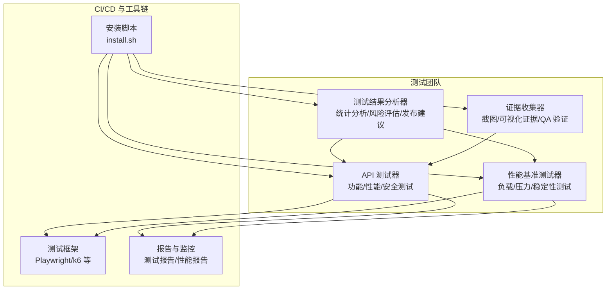
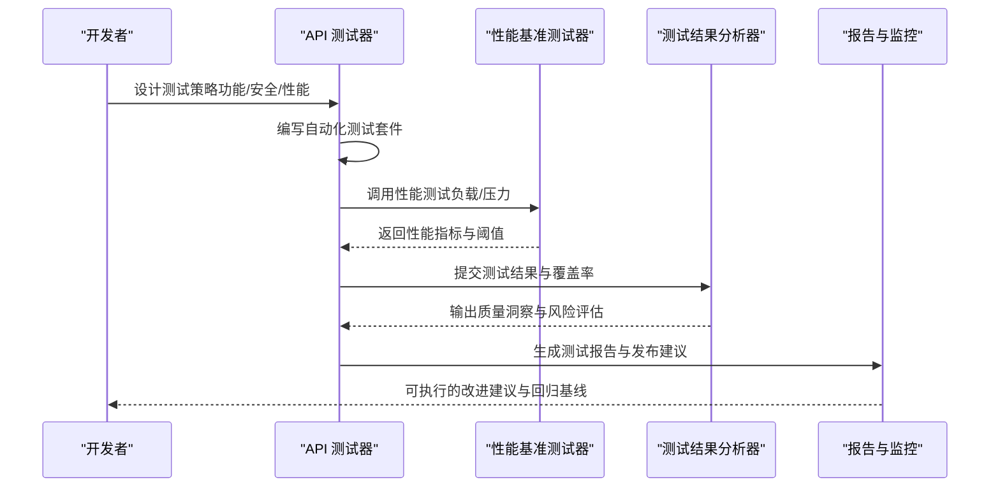
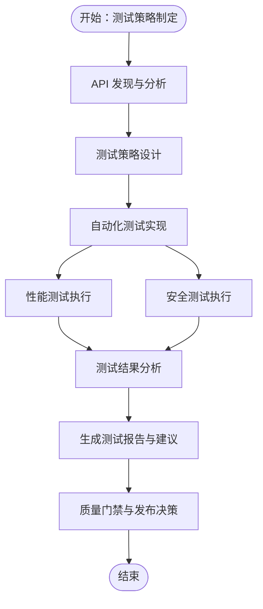
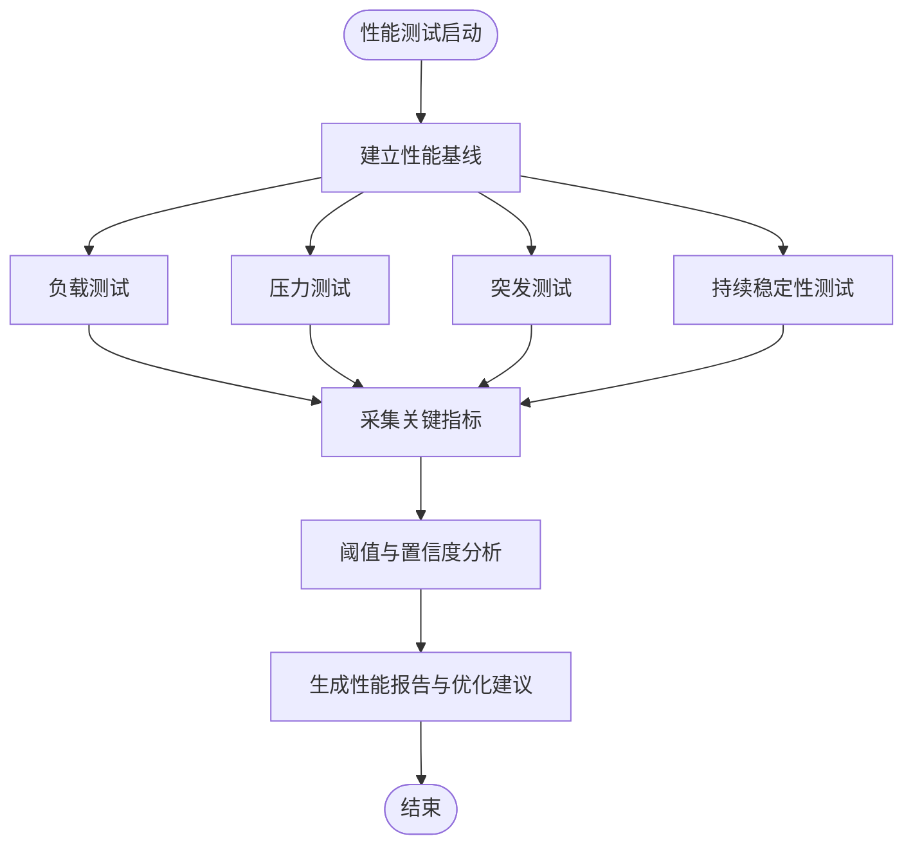
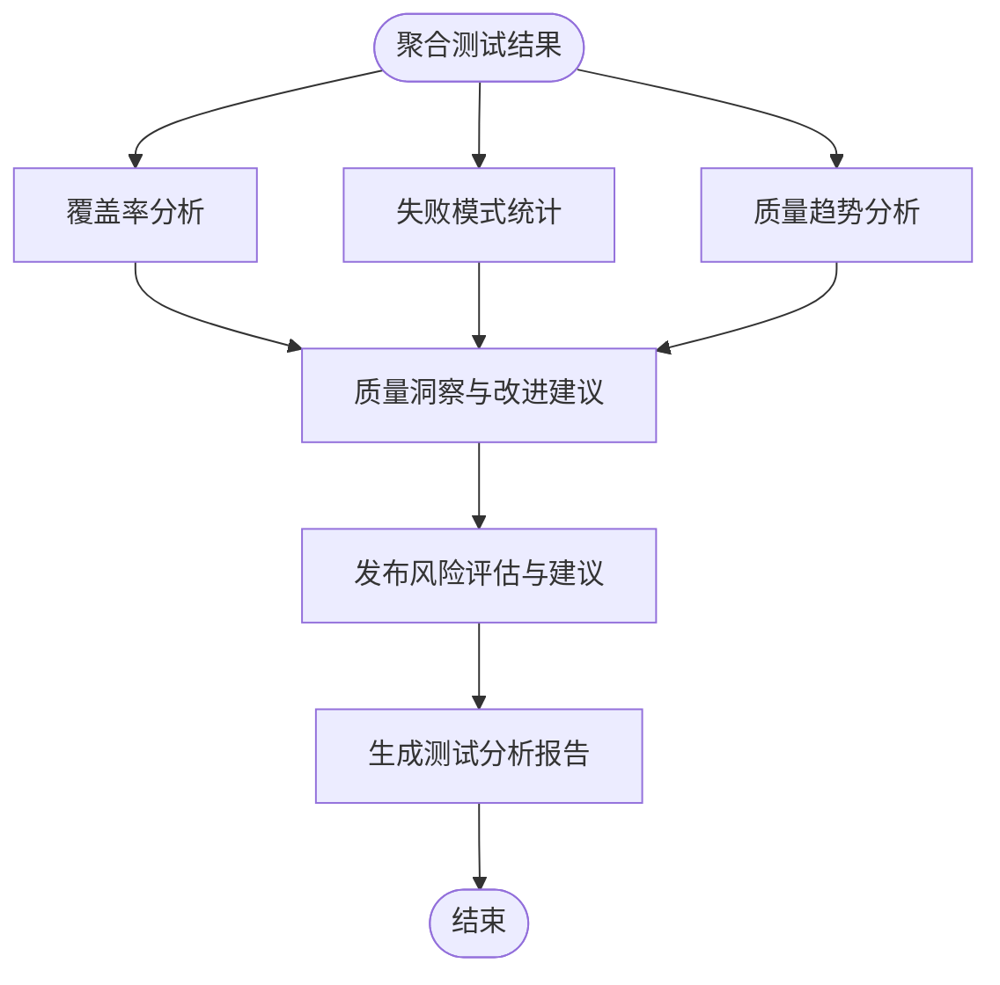
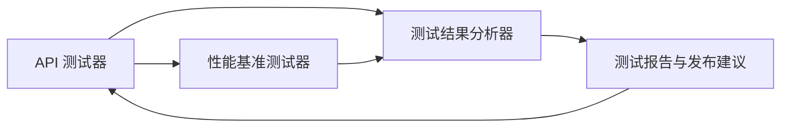

# API 测试器

<cite>
**本文引用的文件**
- [testing-api-tester.md](file://testing/testing-api-tester.md)
- [testing-performance-benchmarker.md](file://testing/testing-performance-benchmarker.md)
- [testing-test-results-analyzer.md](file://testing/testing-test-results-analyzer.md)
- [README.md](file://README.md)
- [install.sh](file://scripts/install.sh)
</cite>

## 目录
1. [简介](#简介)
2. [项目结构](#项目结构)
3. [核心组件](#核心组件)
4. [架构总览](#架构总览)
5. [详细组件分析](#详细组件分析)
6. [依赖关系分析](#依赖关系分析)
7. [性能考量](#性能考量)
8. [故障排查指南](#故障排查指南)
9. [结论](#结论)
10. [附录](#附录)

## 简介
本文件面向“API 测试器”测试代理，系统化阐述其在 API 接口测试、功能验证、性能评估与安全测试方面的职责与方法论，并给出可操作的使用指南与最佳实践。API 测试器以“在用户之前发现缺陷”的理念为核心，构建覆盖功能、性能与安全的测试框架，集成到持续交付流水线中，确保 API 的可靠性、性能与安全性。

## 项目结构
API 测试器位于 testing 分区下，作为测试团队的核心角色之一，与其他测试类代理（如性能基准测试、测试结果分析、证据收集等）协同工作，形成从测试设计、执行、分析到报告的闭环。

图示来源
- [testing-api-tester.md:197-222](file://testing/testing-api-tester.md#L197-L222)
- [testing-performance-benchmarker.md:153-178](file://testing/testing-performance-benchmarker.md#L153-L178)
- [testing-test-results-analyzer.md:190-215](file://testing/testing-test-results-analyzer.md#L190-L215)
- [README.md:208-222](file://README.md#L208-L222)
- [install.sh:104-120](file://scripts/install.sh#L104-L120)

章节来源
- [README.md:208-222](file://README.md#L208-L222)

## 核心组件
- API 测试器：负责端到端 API 测试，涵盖功能、安全与性能三大部分；强调自动化、覆盖率与 SLA 对齐。
- 性能基准测试器：提供负载、压力、持续与突发场景的性能测试，建立性能基线并输出阈值驱动的报告。
- 测试结果分析器：对测试结果进行统计分析、趋势识别与风险预测，生成可执行的质量洞察与发布建议。
- 安装与工具链：通过统一安装脚本将测试代理部署到多平台开发工具中，保障测试环境一致性。

章节来源
- [testing-api-tester.md:19-41](file://testing/testing-api-tester.md#L19-L41)
- [testing-performance-benchmarker.md:19-41](file://testing/testing-performance-benchmarker.md#L19-L41)
- [testing-test-results-analyzer.md:19-41](file://testing/testing-test-results-analyzer.md#L19-L41)
- [install.sh:104-120](file://scripts/install.sh#L104-L120)

## 架构总览
API 测试器的测试体系由“策略—实现—监控—改进”四步循环构成，贯穿开发到生产的全生命周期。

图示来源
- [testing-api-tester.md:197-222](file://testing/testing-api-tester.md#L197-L222)
- [testing-performance-benchmarker.md:153-178](file://testing/testing-performance-benchmarker.md#L153-L178)
- [testing-test-results-analyzer.md:190-215](file://testing/testing-test-results-analyzer.md#L190-L215)

## 详细组件分析

### API 测试器：测试方法与流程
- 测试范围
  - 功能测试：端点覆盖、请求/响应契约验证、错误码与业务规则校验。
  - 安全测试：认证授权、输入验证、常见漏洞（如注入与越权）、速率限制与防护。
  - 性能测试：响应时间、并发吞吐、峰值与持续负载下的稳定性。
- 关键流程
  - API 发现与分析：端点清单、规范与契约梳理、高风险路径识别。
  - 测试策略制定：覆盖维度、数据管理、环境准备、成功标准。
  - 自动化实现：现代框架（如 Playwright、REST Assured、k6）与 CI/CD 质量门禁。
  - 持续改进：生产监控、健康检查、告警与回归优化。
- 报告模板：包含覆盖率、性能结果、安全评估、问题与建议、发布决策等模块。

图示来源
- [testing-api-tester.md:197-222](file://testing/testing-api-tester.md#L197-L222)
- [testing-api-tester.md:223-257](file://testing/testing-api-tester.md#L223-L257)

章节来源
- [testing-api-tester.md:19-41](file://testing/testing-api-tester.md#L19-L41)
- [testing-api-tester.md:197-222](file://testing/testing-api-tester.md#L197-L222)
- [testing-api-tester.md:223-257](file://testing/testing-api-tester.md#L223-L257)

### 性能基准测试器：性能工程与阈值驱动
- 能力范围
  - 负载、压力、持续与突发测试；Web 性能（Core Web Vitals）优化；容量规划与扩展性评估。
  - 基线建立、阈值设定（如 p95 响应时间、错误率）、统计显著性与回归检测。
- 报告内容
  - 性能测试结果、瓶颈分析、数据库/应用/基础设施影响、成本收益与可扩展性评估。

图示来源
- [testing-performance-benchmarker.md:153-178](file://testing/testing-performance-benchmarker.md#L153-L178)
- [testing-performance-benchmarker.md:179-219](file://testing/testing-performance-benchmarker.md#L179-L219)

章节来源
- [testing-performance-benchmarker.md:19-41](file://testing/testing-performance-benchmarker.md#L19-L41)
- [testing-performance-benchmarker.md:153-178](file://testing/testing-performance-benchmarker.md#L153-L178)
- [testing-performance-benchmarker.md:179-219](file://testing/testing-performance-benchmarker.md#L179-L219)

### 测试结果分析器：统计分析与发布建议
- 能力范围
  - 测试覆盖率与缺口分析、失败模式统计、缺陷预测模型、发布风险评估与 Go/No-Go 建议。
  - 质量趋势、缺陷密度、性能 SLA 合规、安全合规与质量投资回报分析。
- 输出形态
  - 执行摘要、覆盖率分析、质量指标趋势、缺陷分析与预测、质量 ROI、报告模板。

图示来源
- [testing-test-results-analyzer.md:190-215](file://testing/testing-test-results-analyzer.md#L190-L215)
- [testing-test-results-analyzer.md:216-256](file://testing/testing-test-results-analyzer.md#L216-L256)

章节来源
- [testing-test-results-analyzer.md:19-41](file://testing/testing-test-results-analyzer.md#L19-L41)
- [testing-test-results-analyzer.md:190-215](file://testing/testing-test-results-analyzer.md#L190-L215)
- [testing-test-results-analyzer.md:216-256](file://testing/testing-test-results-analyzer.md#L216-L256)

### 安装与工具链：测试环境配置
- 工具支持：Claude Code、Copilot、Antigravity、Gemini CLI、OpenCode、Cursor、Aider、Windsurf、OpenClaw、Qwen、Kimi 等。
- 并行安装：支持交互式选择、自动检测、并行作业与进度条输出。
- 作用：将测试代理安装到各开发工具中，统一测试环境与执行入口。

章节来源
- [install.sh:104-120](file://scripts/install.sh#L104-L120)
- [install.sh:514-640](file://scripts/install.sh#L514-L640)

## 依赖关系分析
API 测试器与性能基准测试器、测试结果分析器之间存在紧密协作关系：API 测试器产出测试数据与覆盖率，性能基准测试器提供性能阈值与指标，测试结果分析器进行统计建模与发布建议，最终形成闭环的质量反馈。

图示来源
- [testing-api-tester.md:197-222](file://testing/testing-api-tester.md#L197-L222)
- [testing-performance-benchmarker.md:153-178](file://testing/testing-performance-benchmarker.md#L153-L178)
- [testing-test-results-analyzer.md:190-215](file://testing/testing-test-results-analyzer.md#L190-L215)

章节来源
- [testing-api-tester.md:197-222](file://testing/testing-api-tester.md#L197-L222)
- [testing-performance-benchmarker.md:153-178](file://testing/testing-performance-benchmarker.md#L153-L178)
- [testing-test-results-analyzer.md:190-215](file://testing/testing-test-results-analyzer.md#L190-L215)

## 性能考量
- 响应时间目标：95 分位响应时间需满足 SLA（例如低于 200ms），并发场景下平均响应时间也应受控。
- 负载与扩展：在 10 倍正常负载下保持稳定，错误率低于阈值，数据库查询与缓存策略有效。
- 指标与阈值：采用 k6 等工具设置 p95 响应时间、错误率阈值与自定义趋势指标，结合置信区间进行统计判断。
- 回归与监控：将性能测试纳入 CI/CD，建立性能基线与回归告警，持续跟踪关键指标。

章节来源
- [testing-api-tester.md:51-57](file://testing/testing-api-tester.md#L51-L57)
- [testing-performance-benchmarker.md:71-85](file://testing/testing-performance-benchmarker.md#L71-L85)
- [testing-performance-benchmarker.md:180-219](file://testing/testing-performance-benchmarker.md#L180-L219)

## 故障排查指南
- 安全测试要点
  - 认证与授权：确保未授权访问被拒绝，令牌有效性与会话管理正确。
  - 输入验证：防止 SQL 注入、XSS 等攻击向量，异常输入返回明确错误而非崩溃。
  - 速率限制：在高并发场景下触发限流，避免滥用与资源耗尽。
- 性能问题定位
  - 使用性能测试工具输出的指标（响应时间、吞吐、错误率）定位瓶颈。
  - 结合数据库查询、缓存命中率与服务间调用链路进行根因分析。
- 发布决策
  - 依据测试结果分析器提供的风险评估与发布建议，综合质量得分、缺陷密度与 SLA 合规情况，做出 Go/No-Go 决策。

章节来源
- [testing-api-tester.md:42-57](file://testing/testing-api-tester.md#L42-L57)
- [testing-api-tester.md:130-158](file://testing/testing-api-tester.md#L130-L158)
- [testing-test-results-analyzer.md:143-162](file://testing/testing-test-results-analyzer.md#L143-L162)

## 结论
API 测试器通过系统化的测试策略、自动化实现与持续分析，为 API 的功能、性能与安全提供全面保障。配合性能基准测试器与测试结果分析器，形成从测试到发布的闭环质量体系，确保在快速迭代的同时维持高质量与高可靠性。

## 附录

### 使用指南：如何配置测试环境
- 安装测试代理
  - 使用安装脚本将测试代理批量安装到本地开发工具中，支持交互式选择与并行安装。
- 准备测试环境
  - 配置 API 基础地址、认证凭据与测试数据，确保测试环境与生产特性一致。
- 运行测试
  - 在 CI/CD 中集成 API 测试与性能测试，设置质量门禁与阈值告警。
- 分析结果
  - 使用测试结果分析器生成质量报告，结合发布建议进行决策。

章节来源
- [install.sh:514-640](file://scripts/install.sh#L514-L640)
- [testing-api-tester.md:205-216](file://testing/testing-api-tester.md#L205-L216)
- [testing-test-results-analyzer.md:216-256](file://testing/testing-test-results-analyzer.md#L216-L256)