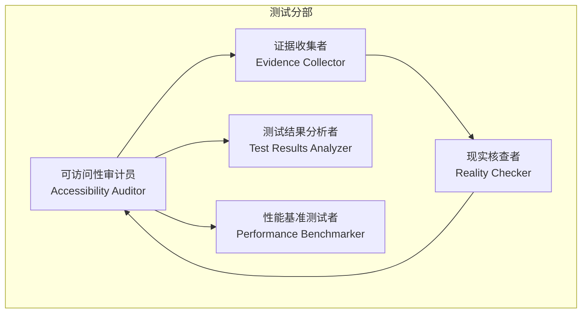
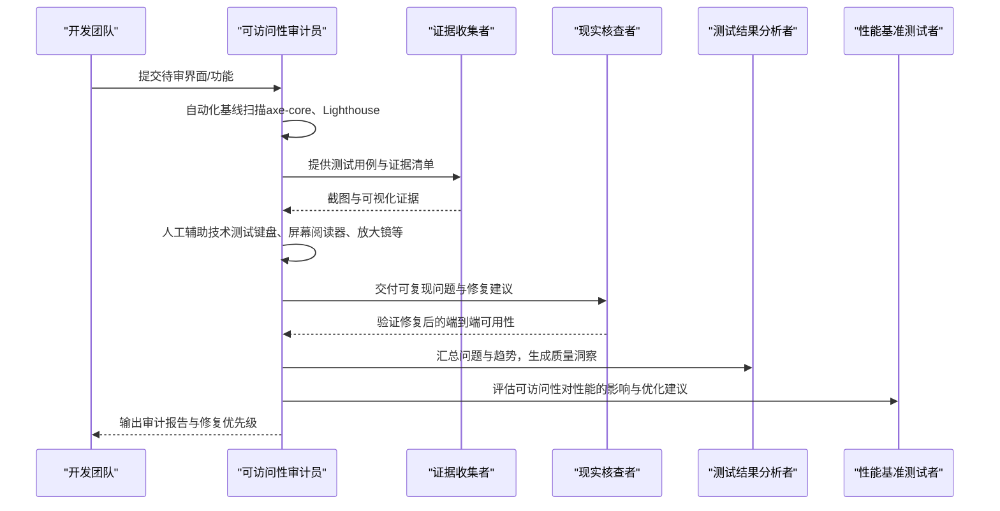
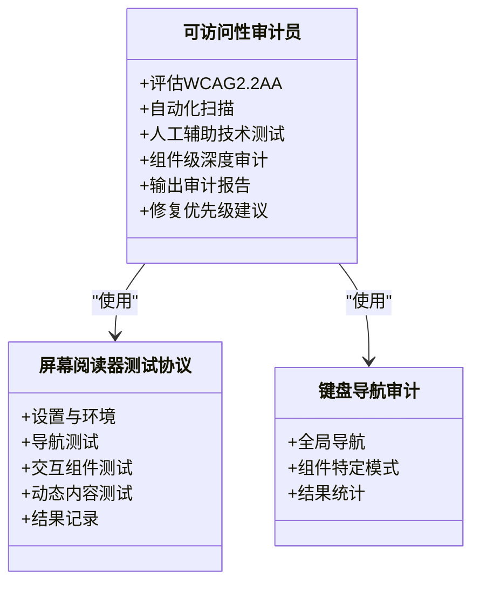
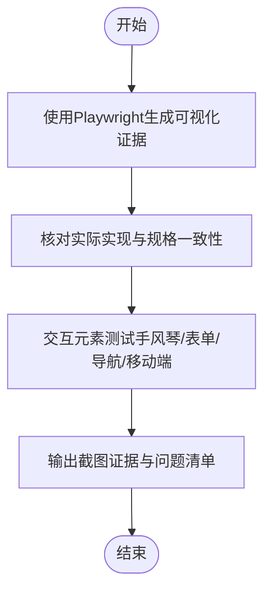
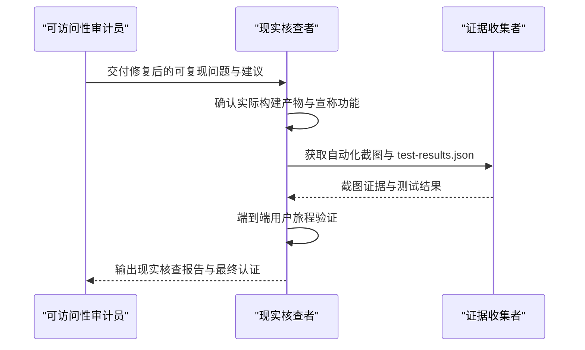
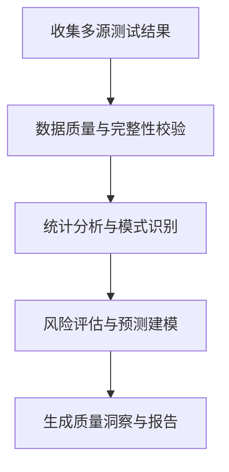
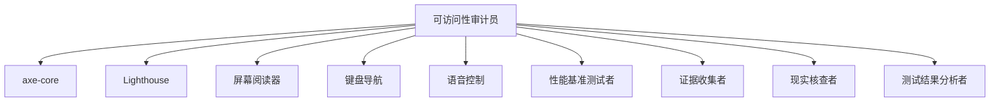

# 可访问性审计员

<cite>
**本文档引用的文件**
- [testing-accessibility-auditor.md](file://testing/testing-accessibility-auditor.md)
- [README.md](file://README.md)
- [testing-evidence-collector.md](file://testing/testing-evidence-collector.md)
- [testing-reality-checker.md](file://testing/testing-reality-checker.md)
- [testing-test-results-analyzer.md](file://testing/testing-test-results-analyzer.md)
- [testing-performance-benchmarker.md](file://testing/testing-performance-benchmarker.md)
</cite>

## 目录
1. [简介](#简介)
2. [项目结构](#项目结构)
3. [核心组件](#核心组件)
4. [架构总览](#架构总览)
5. [详细组件分析](#详细组件分析)
6. [依赖关系分析](#依赖关系分析)
7. [性能考量](#性能考量)
8. [故障排查指南](#故障排查指南)
9. [结论](#结论)
10. [附录](#附录)

## 简介
本文件面向可访问性审计员（Accessibility Auditor）角色，系统化阐述其在数字产品可访问性领域的职责边界、审计方法与交付物规范。该角色专注于依据 WCAG 2.2 AA 标准对界面进行审计，结合自动化扫描与真实辅助技术（如屏幕阅读器、键盘导航、语音控制）测试，识别感知、操作、理解与健壮性四个维度的问题，并提供可落地的修复建议与优先级排序。同时，该角色强调“默认发现障碍”的原则：未经过屏幕阅读器测试的界面即视为不可访问。

## 项目结构
可访问性审计员属于“测试”分部（Testing Division），与证据收集者（Evidence Collector）、现实核查者（Reality Checker）、测试结果分析者（Test Results Analyzer）等测试链路中的关键角色协同工作，形成从自动化基线扫描到人工验证再到质量门禁的整体闭环。

图表来源
- [README.md:208-221](file://README.md#L208-L221)
- [testing-accessibility-auditor.md:217-250](file://testing/testing-accessibility-auditor.md#L217-L250)

章节来源
- [README.md:208-221](file://README.md#L208-L221)

## 核心组件
- 审计使命与方法
  - 基于 WCAG 2.2 AA（必要时达到 AAA）进行评估，覆盖 POUR 原则（可感知、可操作、可理解、健壮）
  - 明确区分自动化可检测问题与需人工验证的问题
  - 默认要求：每次审计必须包含自动化扫描与真实辅助技术测试
- 辅助技术测试
  - 屏幕阅读器兼容性（VoiceOver、NVDA、JAWS）与真实交互流程验证
  - 键盘独行导航（所有交互元素与用户旅程）
  - 语音控制兼容性（Dragon、Voice Control）
  - 放大镜测试（200%、400% 缩放）、减少动态效果、高对比度与强制颜色模式
- 人工洞察与认知可访问性
  - 关注焦点顺序、阅读顺序、动态内容的焦点管理
  - 自定义组件的 ARIA 角色、状态与属性正确性
  - 错误提示、状态更新与实时区域的可读性
  - 平易语言、一致导航与清晰错误恢复的认知可访问性
- 可执行修复建议
  - 每个问题明确 WCAG 条款编号与名称、严重程度、影响人群、位置、证据与修复方案
  - 优先级按用户影响而非仅合规级别划分
  - 提供代码示例与设计变更建议

章节来源
- [testing-accessibility-auditor.md:19-47](file://testing/testing-accessibility-auditor.md#L19-L47)
- [testing-accessibility-auditor.md:217-250](file://testing/testing-accessibility-auditor.md#L217-L250)

## 架构总览
可访问性审计员的工作流由“自动化基线扫描—人工辅助技术测试—组件级深度审计—报告与修复”四步构成，贯穿测试与质量门禁阶段。

图表来源
- [testing-accessibility-auditor.md:219-250](file://testing/testing-accessibility-auditor.md#L219-L250)
- [testing-evidence-collector.md:41-55](file://testing/testing-evidence-collector.md#L41-L55)
- [testing-reality-checker.md:41-56](file://testing/testing-reality-checker.md#L41-L56)
- [testing-test-results-analyzer.md:190-214](file://testing/testing-test-results-analyzer.md#L190-L214)
- [testing-performance-benchmarker.md:153-177](file://testing/testing-performance-benchmarker.md#L153-L177)

## 详细组件分析

### 组件一：可访问性审计员（Accessibility Auditor）
- 角色定位
  - 可访问性审计、辅助技术测试与包容性设计验证专家
  - 强调“默认发现障碍”，坚持“未经屏幕阅读器测试即不可访问”的原则
- 审计范围与方法
  - WCAG 2.2 AA（必要时 AAA）评估，覆盖 POUR 四原则
  - 自动化扫描（axe-core、Lighthouse）与人工辅助技术测试双轨并行
  - 关注动态内容焦点管理、自定义组件 ARIA 正确性、错误与状态播报、认知可访问性
- 报告模板与交付物
  - 包含审计概览、测试方法论、汇总统计、问题清单、已做良好的部分、修复优先级与后续步骤
  - 屏幕阅读器测试协议与键盘导航审计模板
- 成功指标
  - 产品真正达到 WCAG 2.2 AA 合规，而非仅通过自动化扫描
  - 屏幕阅读器用户能独立完成关键用户旅程
  - 键盘用户可无障碍访问所有交互元素且无陷阱
  - 开发期即发现并解决可访问性问题，零关键/严重问题进入生产

图表来源
- [testing-accessibility-auditor.md:69-138](file://testing/testing-accessibility-auditor.md#L69-L138)
- [testing-accessibility-auditor.md:140-173](file://testing/testing-accessibility-auditor.md#L140-L173)
- [testing-accessibility-auditor.md:175-215](file://testing/testing-accessibility-auditor.md#L175-L215)

章节来源
- [testing-accessibility-auditor.md:9-47](file://testing/testing-accessibility-auditor.md#L9-L47)
- [testing-accessibility-auditor.md:69-138](file://testing/testing-accessibility-auditor.md#L69-L138)
- [testing-accessibility-auditor.md:140-215](file://testing/testing-accessibility-auditor.md#L140-L215)
- [testing-accessibility-auditor.md:217-284](file://testing/testing-accessibility-auditor.md#L217-L284)

### 组件二：证据收集者（Evidence Collector）
- 角色定位
  - “截图不撒谎”的质量保证专家，要求一切主张均需可视化证据支撑
- 工作流程
  - 第一步：使用 Playwright 生成专业可视化证据，核对实际实现与规格一致性
  - 第二步：基于截图进行对比分析，识别规格与现实之间的差距
  - 第三步：对交互元素（手风琴、表单、导航、移动端主题切换）进行测试
- 关键触发点
  - 对“零问题”“完美分数”“奢华/高级”宣称的自动否定
  - 无法提供截图或截图与宣称不符即失败
- 与可访问性审计员的协作
  - 提供可复现问题的截图证据，支撑可访问性问题定位与修复验证

图表来源
- [testing-evidence-collector.md:41-55](file://testing/testing-evidence-collector.md#L41-L55)
- [testing-evidence-collector.md:70-98](file://testing/testing-evidence-collector.md#L70-L98)
- [testing-evidence-collector.md:119-174](file://testing/testing-evidence-collector.md#L119-L174)

章节来源
- [testing-evidence-collector.md:9-38](file://testing/testing-evidence-collector.md#L9-L38)
- [testing-evidence-collector.md:41-98](file://testing/testing-evidence-collector.md#L41-L98)
- [testing-evidence-collector.md:119-174](file://testing/testing-evidence-collector.md#L119-L174)

### 组件三：现实核查者（Reality Checker）
- 角色定位
  - 最后防线，阻止“幻想式批准”，默认“需要改进”，除非有压倒性证据证明可上线
- 工作流程
  - 第一步：确认实际构建产物，交叉校验宣称功能
  - 第二步：运行专业 Playwright 截图捕获，审查 test-results.json 数据
  - 第三步：基于自动化截图与数据进行端到端系统验证
- 关键触发点
  - 任何“零问题”“完美分数”“生产就绪”等宣称，若无压倒性证据即失败
  - 若 QA 问题仍可见或宣称与现实不符，则判定失败
- 与可访问性审计员的协作
  - 在修复后再次验证端到端可用性，确保可访问性问题得到实质性解决

图表来源
- [testing-reality-checker.md:41-56](file://testing/testing-reality-checker.md#L41-L56)
- [testing-reality-checker.md:64-110](file://testing/testing-reality-checker.md#L64-L110)
- [testing-reality-checker.md:142-202](file://testing/testing-reality-checker.md#L142-L202)

章节来源
- [testing-reality-checker.md:9-38](file://testing/testing-reality-checker.md#L9-L38)
- [testing-reality-checker.md:41-110](file://testing/testing-reality-checker.md#L41-L110)
- [testing-reality-checker.md:142-202](file://testing/testing-reality-checker.md#L142-L202)

### 组件四：测试结果分析者（Test Results Analyzer）
- 角色定位
  - 测试结果综合分析与质量洞察专家，提供数据驱动的质量决策支持
- 工作流程
  - 第一步：聚合多源测试结果，进行数据质量与完整性校验
  - 第二步：统计分析与模式识别，计算置信区间与显著性
  - 第三步：风险评估与预测建模，生成发布准备建议
  - 第四步：生成面向不同干系人的报告与持续改进计划
- 与可访问性审计员的协作
  - 将可访问性问题纳入缺陷密度、覆盖率与趋势分析，提供 ROI 与优先级建议

图表来源
- [testing-test-results-analyzer.md:192-214](file://testing/testing-test-results-analyzer.md#L192-L214)
- [testing-test-results-analyzer.md:216-256](file://testing/testing-test-results-analyzer.md#L216-L256)

章节来源
- [testing-test-results-analyzer.md:9-41](file://testing/testing-test-results-analyzer.md#L9-L41)
- [testing-test-results-analyzer.md:190-256](file://testing/testing-test-results-analyzer.md#L190-L256)

### 组件五：性能基准测试者（Performance Benchmarker）
- 角色定位
  - 性能工程与优化专家，关注响应时间、吞吐量、稳定性与可扩展性
- 工作流程
  - 建立性能基线与 SLA 目标，设计负载、压力、持续与弹性测试场景
  - 分析瓶颈并提供优化建议，验证优化效果
  - 实施监控与回归测试，持续改进
- 与可访问性审计员的协作
  - 关注可访问性对性能的影响（例如高对比度、缩放、语音控制等场景下的加载与交互性能）

章节来源
- [testing-performance-benchmarker.md:19-41](file://testing/testing-performance-benchmarker.md#L19-L41)
- [testing-performance-benchmarker.md:153-177](file://testing/testing-performance-benchmarker.md#L153-L177)
- [testing-performance-benchmarker.md:179-219](file://testing/testing-performance-benchmarker.md#L179-L219)

## 依赖关系分析
- 内部依赖
  - 可访问性审计员依赖证据收集者的截图证据与现实核查者的端到端验证
  - 与测试结果分析者共享问题数据，用于趋势与风险评估
  - 与性能基准测试者共同评估可访问性优化对性能的影响
- 外部工具与标准
  - 自动化扫描：axe-core、Lighthouse
  - 辅助技术：VoiceOver、NVDA、JAWS、Dragon、Voice Control
  - 标准：WCAG 2.2 AA（必要时 AAA）、POUR 原则、WAI-ARIA Authoring Practices 1.2

图表来源
- [testing-accessibility-auditor.md:219-230](file://testing/testing-accessibility-auditor.md#L219-L230)
- [testing-accessibility-auditor.md:232-244](file://testing/testing-accessibility-auditor.md#L232-L244)
- [testing-performance-benchmarker.md:153-177](file://testing/testing-performance-benchmarker.md#L153-L177)
- [testing-evidence-collector.md:41-55](file://testing/testing-evidence-collector.md#L41-L55)
- [testing-reality-checker.md:41-56](file://testing/testing-reality-checker.md#L41-L56)
- [testing-test-results-analyzer.md:190-214](file://testing/testing-test-results-analyzer.md#L190-L214)

章节来源
- [testing-accessibility-auditor.md:219-244](file://testing/testing-accessibility-auditor.md#L219-L244)

## 性能考量
- 可访问性与性能的平衡
  - 高对比度、放大镜、语音控制等特性可能增加渲染与交互成本，需通过性能基准测试量化影响
  - 优化策略应兼顾可访问性目标与用户体验指标（如 Core Web Vitals）
- 发布前质量门禁
  - 可访问性问题应作为质量门禁的一部分，与性能 SLA、安全与集成测试共同决定发布决策

[本节为通用指导，无需具体文件来源]

## 故障排查指南
- 常见问题与处理
  - 自动化工具误报或漏报：结合人工验证与屏幕阅读器测试，确保问题真实存在
  - 修复后仍可见问题：通过证据收集者提供的截图与现实核查者的端到端验证确认是否已解决
  - 修复优先级争议：参考测试结果分析者的缺陷密度与趋势，结合业务影响制定优先级
- 质量门禁与回归
  - 在 CI/CD 中集成可访问性自动化扫描与关键用户旅程的可访问性脚本
  - 建立可访问性“质量门”，阻止关键/严重问题进入生产

章节来源
- [testing-accessibility-auditor.md:299-303](file://testing/testing-accessibility-auditor.md#L299-L303)
- [testing-evidence-collector.md:100-118](file://testing/testing-evidence-collector.md#L100-L118)
- [testing-reality-checker.md:122-141](file://testing/testing-reality-checker.md#L122-L141)
- [testing-test-results-analyzer.md:274-282](file://testing/testing-test-results-analyzer.md#L274-L282)

## 结论
可访问性审计员通过“自动化基线扫描 + 真实辅助技术测试 + 组件级深度审计 + 可执行修复建议”的闭环流程，确保产品在 WCAG 2.2 AA（必要时 AAA）层面达到真正的可用性。配合证据收集、现实核查与测试结果分析，可实现从发现问题到解决问题的全链路质量保障；同时，性能基准测试帮助在可访问性与性能之间取得平衡，最终达成“默认发现障碍、零关键/严重问题进入生产”的成功指标。

[本节为总结性内容，无需具体文件来源]

## 附录

### 使用指南：如何进行可访问性测试
- 准备阶段
  - 明确审计范围（页面/功能/组件）
  - 准备自动化扫描工具（axe-core、Lighthouse）与辅助技术（屏幕阅读器、键盘、语音控制）
- 执行步骤
  - 自动化基线扫描：覆盖关键页面与交互流程
  - 人工验证：键盘独行、屏幕阅读器完整用户旅程、放大镜与高对比度测试
  - 组件级审计：自定义组件的 ARIA 角色与状态、动态内容焦点管理、错误与状态播报
- 报告与修复
  - 输出审计报告模板，明确 WCAG 条款、严重程度、影响人群、证据与修复建议
  - 制定修复优先级（立即/短期/持续），并安排复审

章节来源
- [testing-accessibility-auditor.md:219-250](file://testing/testing-accessibility-auditor.md#L219-L250)
- [testing-accessibility-auditor.md:69-138](file://testing/testing-accessibility-auditor.md#L69-L138)

### 解读审计结果
- 问题分类：按严重程度（关键/严重/中等/轻微）与用户影响划分
- 合规性评估：WCAG 符合性等级（不满足/部分符合/符合）、辅助技术兼容性（失败/部分/通过）
- 已做良好的部分：强化可复用的可访问性模式
- 修复优先级：立即（发布前修复）、短期（下个迭代）、持续（日常维护）

章节来源
- [testing-accessibility-auditor.md:69-138](file://testing/testing-accessibility-auditor.md#L69-L138)

### 修复可访问性问题
- 代码级修复示例：提供 ARIA 模式、焦点管理与语义 HTML 的修复思路
- 设计变更建议：当问题源于结构性而非实现细节时，推动设计系统层面的可访问性改进
- 验证方法：通过屏幕阅读器与键盘测试确认修复有效

章节来源
- [testing-accessibility-auditor.md:42-46](file://testing/testing-accessibility-auditor.md#L42-L46)
- [testing-accessibility-auditor.md:246-250](file://testing/testing-accessibility-auditor.md#L246-L250)

### 确保长期合规
- 流程与工具集成：将 axe-core 纳入 CI/CD，建立可访问性验收标准与关键用户旅程脚本
- 质量门禁：在发布流程中设置可访问性门，阻止关键/严重问题进入生产
- 持续改进：利用测试结果分析者的趋势与预测模型，持续优化可访问性质量

章节来源
- [testing-accessibility-auditor.md:299-303](file://testing/testing-accessibility-auditor.md#L299-L303)
- [testing-test-results-analyzer.md:283-302](file://testing/testing-test-results-analyzer.md#L283-L302)