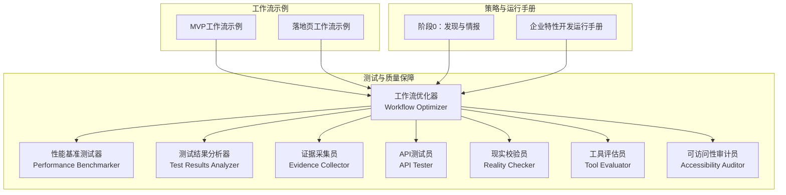
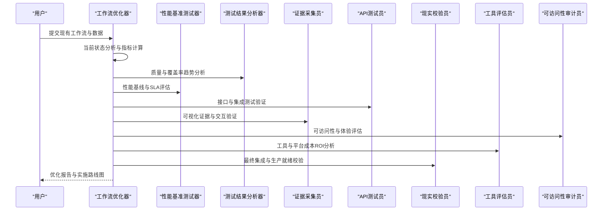
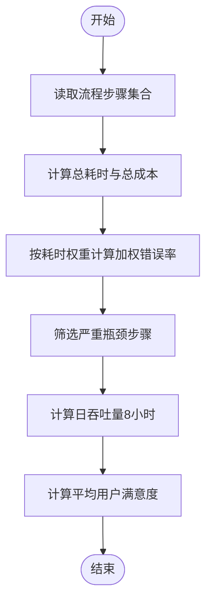
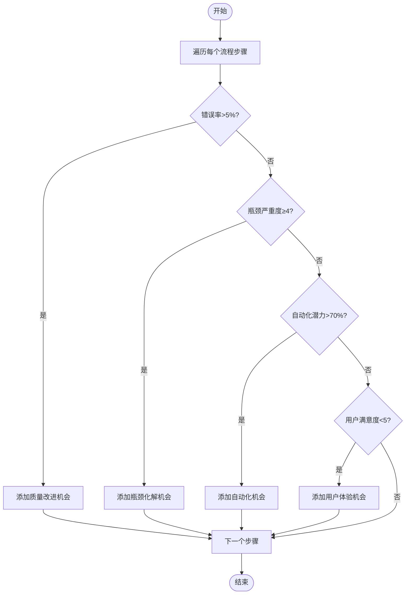
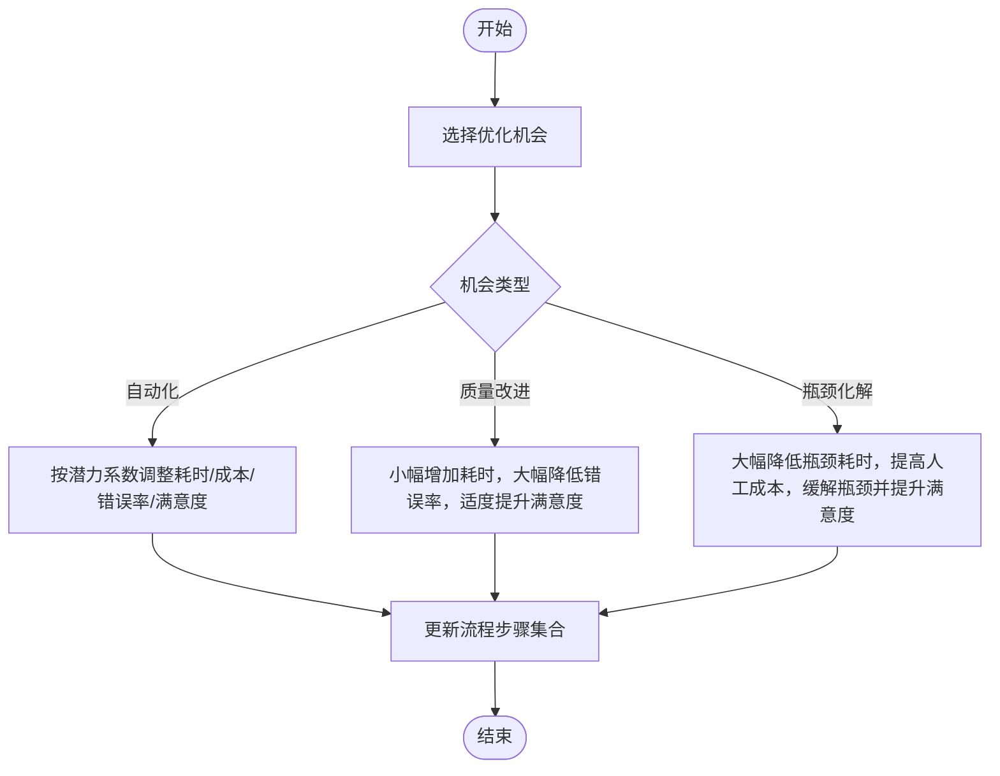
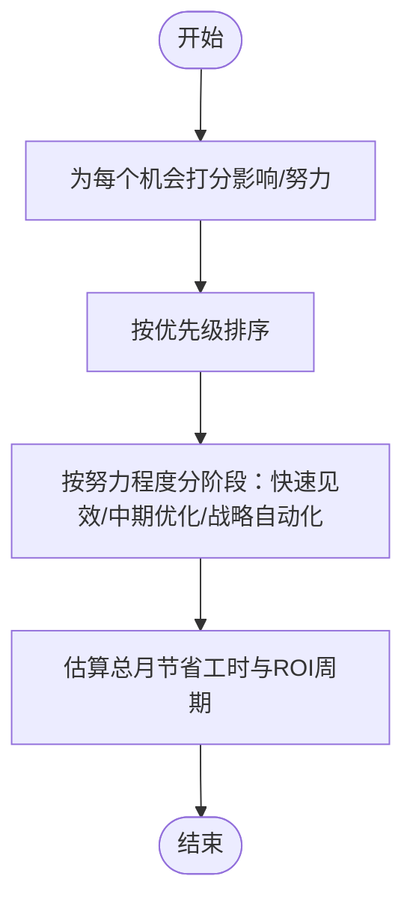
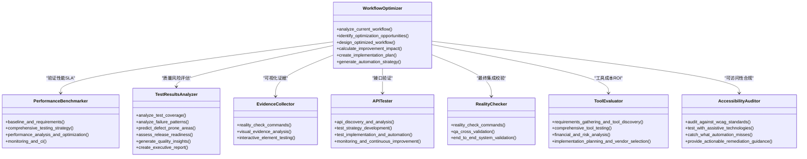
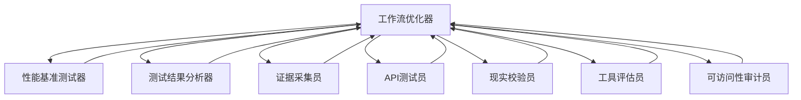

# 工作流优化器

<cite>
**本文引用的文件**
- [testing-workflow-optimizer.md](file://testing/testing-workflow-optimizer.md)
- [testing-performance-benchmarker.md](file://testing/testing-performance-benchmarker.md)
- [testing-test-results-analyzer.md](file://testing/testing-test-results-analyzer.md)
- [testing-evidence-collector.md](file://testing/testing-evidence-collector.md)
- [testing-api-tester.md](file://testing/testing-api-tester.md)
- [testing-reality-checker.md](file://testing/testing-reality-checker.md)
- [testing-tool-evaluator.md](file://testing/testing-tool-evaluator.md)
- [testing-accessibility-auditor.md](file://testing/testing-accessibility-auditor.md)
- [workflow-startup-mvp.md](file://examples/workflow-startup-mvp.md)
- [workflow-landing-page.md](file://examples/workflow-landing-page.md)
- [phase-0-discovery.md](file://strategy/playbooks/phase-0-discovery.md)
- [scenario-enterprise-feature.md](file://strategy/runbooks/scenario-enterprise-feature.md)
</cite>

## 目录
1. [简介](#简介)
2. [项目结构](#项目结构)
3. [核心组件](#核心组件)
4. [架构总览](#架构总览)
5. [详细组件分析](#详细组件分析)
6. [依赖关系分析](#依赖关系分析)
7. [性能考量](#性能考量)
8. [故障排查指南](#故障排查指南)
9. [结论](#结论)
10. [附录](#附录)

## 简介
本文件面向“工作流优化器测试代理”，系统化阐述其功能定位、优化能力与技术实现路径，并结合仓库内测试与工作流相关文件，给出可操作的使用指南与评估标准。工作流优化器测试代理的核心目标是：
- 分析现有工作流程，识别瓶颈与低效环节
- 基于数据驱动的方法论设计优化方案（流程、自动化、跨职能协同）
- 提供可落地的实施计划与监控机制
- 通过量化指标与ROI评估持续改进

## 项目结构
围绕工作流优化器测试代理，仓库中与之直接或间接相关的模块主要分布在以下区域：
- testing：包含工作流优化器、性能基准、测试结果分析、证据采集、API测试、现实校验、工具评估、可访问性审计等测试与质量保障类Agent
- examples：多Agent协作的工作流示例（如MVP、落地页）
- strategy：策略与运行手册，涵盖从发现到运营的全生命周期工作流

下图展示与工作流优化器测试代理相关的Agent与示例之间的关系：

图表来源
- [testing-workflow-optimizer.md](file://testing/testing-workflow-optimizer.md)
- [testing-performance-benchmarker.md](file://testing/testing-performance-benchmarker.md)
- [testing-test-results-analyzer.md](file://testing/testing-test-results-analyzer.md)
- [testing-evidence-collector.md](file://testing/testing-evidence-collector.md)
- [testing-api-tester.md](file://testing/testing-api-tester.md)
- [testing-reality-checker.md](file://testing/testing-reality-checker.md)
- [testing-tool-evaluator.md](file://testing/testing-tool-evaluator.md)
- [testing-accessibility-auditor.md](file://testing/testing-accessibility-auditor.md)
- [workflow-startup-mvp.md](file://examples/workflow-startup-mvp.md)
- [workflow-landing-page.md](file://examples/workflow-landing-page.md)
- [phase-0-discovery.md](file://strategy/playbooks/phase-0-discovery.md)
- [scenario-enterprise-feature.md](file://strategy/runbooks/scenario-enterprise-feature.md)

章节来源
- [testing-workflow-optimizer.md](file://testing/testing-workflow-optimizer.md)
- [testing-performance-benchmarker.md](file://testing/testing-performance-benchmarker.md)
- [testing-test-results-analyzer.md](file://testing/testing-test-results-analyzer.md)
- [testing-evidence-collector.md](file://testing/testing-evidence-collector.md)
- [testing-api-tester.md](file://testing/testing-api-tester.md)
- [testing-reality-checker.md](file://testing/testing-reality-checker.md)
- [testing-tool-evaluator.md](file://testing/testing-tool-evaluator.md)
- [testing-accessibility-auditor.md](file://testing/testing-accessibility-auditor.md)
- [workflow-startup-mvp.md](file://examples/workflow-startup-mvp.md)
- [workflow-landing-page.md](file://examples/workflow-landing-page.md)
- [phase-0-discovery.md](file://strategy/playbooks/phase-0-discovery.md)
- [scenario-enterprise-feature.md](file://strategy/runbooks/scenario-enterprise-feature.md)

## 核心组件
工作流优化器测试代理由以下关键子系统构成：
- 流程分析与度量：对当前状态进行量化分析，识别瓶颈、错误率、等待时间、吞吐量、员工满意度等指标
- 机会识别：基于多框架（Lean、Six Sigma、自动化潜力）系统化识别优化机会
- 未来状态设计：针对识别出的机会，设计优化后的流程步骤，量化成本、耗时、错误率变化
- 改进影响计算：对比优化前后指标，输出绝对值与百分比变化
- 实施路线图：按“快速见效、中期优化、战略自动化”分阶段制定优先级与时间线
- 自动化策略：识别高潜力自动化步骤，估算节省工时与ROI周期

章节来源
- [testing-workflow-optimizer.md](file://testing/testing-workflow-optimizer.md)

## 架构总览
工作流优化器测试代理采用“分析—设计—实施—监控”的闭环架构，贯穿测试与质量保障体系，确保优化建议可验证、可落地、可持续。

图表来源
- [testing-workflow-optimizer.md](file://testing/testing-workflow-optimizer.md)
- [testing-performance-benchmarker.md](file://testing/testing-performance-benchmarker.md)
- [testing-test-results-analyzer.md](file://testing/testing-test-results-analyzer.md)
- [testing-evidence-collector.md](file://testing/testing-evidence-collector.md)
- [testing-api-tester.md](file://testing/testing-api-tester.md)
- [testing-reality-checker.md](file://testing/testing-reality-checker.md)
- [testing-tool-evaluator.md](file://testing/testing-tool-evaluator.md)
- [testing-accessibility-auditor.md](file://testing/testing-accessibility-auditor.md)

## 详细组件分析

### 组件A：工作流分析与度量
- 输入：流程步骤集合（名称、耗时、人工成本、错误率、自动化潜力、瓶颈严重度、用户满意度）
- 输出：总周期时间、活跃工作时间、等待时间、单次执行成本、错误率、日吞吐量、员工满意度
- 方法：加权平均、瓶颈识别阈值、日容量推导（以8小时工作日为基准）

图表来源
- [testing-workflow-optimizer.md](file://testing/testing-workflow-optimizer.md)

章节来源
- [testing-workflow-optimizer.md](file://testing/testing-workflow-optimizer.md)

### 组件B：优化机会识别
- 框架：质量改进、瓶颈化解、自动化、用户体验提升
- 规则：错误率>5%、瓶颈严重度≥4、自动化潜力>70%、用户满意度<5
- 输出：机会清单（类型、步骤、问题、影响、努力、建议）

图表来源
- [testing-workflow-optimizer.md](file://testing/testing-workflow-optimizer.md)

章节来源
- [testing-workflow-optimizer.md](file://testing/testing-workflow-optimizer.md)

### 组件C：未来状态设计与量化影响
- 自动化：降低耗时与成本，显著降低错误率，缓解瓶颈，提升满意度
- 质量改进：小幅增加耗时以换取显著错误率下降，适度提升满意度
- 瓶颈化解：大幅降低瓶颈耗时，提高人工成本，缓解瓶颈，提升满意度
- 输出：优化后的流程步骤集合与量化改进影响（绝对值与百分比）

图表来源
- [testing-workflow-optimizer.md](file://testing/testing-workflow-optimizer.md)

章节来源
- [testing-workflow-optimizer.md](file://testing/testing-workflow-optimizer.md)

### 组件D：实施路线图与自动化策略
- 路线图：按“低/中/高”努力程度分层，计算优先级分数（影响/努力），输出各阶段时间线
- 自动化策略：识别高潜力步骤，估算月节省工时与ROI周期，推荐工具类别

图表来源
- [testing-workflow-optimizer.md](file://testing/testing-workflow-optimizer.md)

章节来源
- [testing-workflow-optimizer.md](file://testing/testing-workflow-optimizer.md)

### 组件E：与测试与质量保障Agent的协同
- 与性能基准测试器：验证优化后性能是否满足SLA
- 与测试结果分析器：基于覆盖率、失败模式、缺陷密度等指标评估质量风险
- 与证据采集员：通过截图与交互验证，确保优化成果可视化、可追溯
- 与API测试员：验证接口稳定性、安全与性能
- 与现实校验员：最终集成验证，确保“生产就绪”
- 与工具评估员：评估优化所需工具的成本与ROI
- 与可访问性审计员：确保优化后流程符合可访问性要求

图表来源
- [testing-workflow-optimizer.md](file://testing/testing-workflow-optimizer.md)
- [testing-performance-benchmarker.md](file://testing/testing-performance-benchmarker.md)
- [testing-test-results-analyzer.md](file://testing/testing-test-results-analyzer.md)
- [testing-evidence-collector.md](file://testing/testing-evidence-collector.md)
- [testing-api-tester.md](file://testing/testing-api-tester.md)
- [testing-reality-checker.md](file://testing/testing-reality-checker.md)
- [testing-tool-evaluator.md](file://testing/testing-tool-evaluator.md)
- [testing-accessibility-auditor.md](file://testing/testing-accessibility-auditor.md)

章节来源
- [testing-workflow-optimizer.md](file://testing/testing-workflow-optimizer.md)
- [testing-performance-benchmarker.md](file://testing/testing-performance-benchmarker.md)
- [testing-test-results-analyzer.md](file://testing/testing-test-results-analyzer.md)
- [testing-evidence-collector.md](file://testing/testing-evidence-collector.md)
- [testing-api-tester.md](file://testing/testing-api-tester.md)
- [testing-reality-checker.md](file://testing/testing-reality-checker.md)
- [testing-tool-evaluator.md](file://testing/testing-tool-evaluator.md)
- [testing-accessibility-auditor.md](file://testing/testing-accessibility-auditor.md)

## 依赖关系分析
- 内部耦合：工作流优化器内部各模块高度内聚，形成“分析—设计—实施—监控”的闭环
- 外部依赖：与测试与质量保障Agent存在明确的输入/输出契约，形成测试流水线
- 风险点：若任一Agent未按约定提供证据或指标，将导致优化建议不可验证；应建立质量门禁与回退机制

图表来源
- [testing-workflow-optimizer.md](file://testing/testing-workflow-optimizer.md)
- [testing-performance-benchmarker.md](file://testing/testing-performance-benchmarker.md)
- [testing-test-results-analyzer.md](file://testing/testing-test-results-analyzer.md)
- [testing-evidence-collector.md](file://testing/testing-evidence-collector.md)
- [testing-api-tester.md](file://testing/testing-api-tester.md)
- [testing-reality-checker.md](file://testing/testing-reality-checker.md)
- [testing-tool-evaluator.md](file://testing/testing-tool-evaluator.md)
- [testing-accessibility-auditor.md](file://testing/testing-accessibility-auditor.md)

章节来源
- [testing-workflow-optimizer.md](file://testing/testing-workflow-optimizer.md)
- [testing-performance-benchmarker.md](file://testing/testing-performance-benchmarker.md)
- [testing-test-results-analyzer.md](file://testing/testing-test-results-analyzer.md)
- [testing-evidence-collector.md](file://testing/testing-evidence-collector.md)
- [testing-api-tester.md](file://testing/testing-api-tester.md)
- [testing-reality-checker.md](file://testing/testing-reality-checker.md)
- [testing-tool-evaluator.md](file://testing/testing-tool-evaluator.md)
- [testing-accessibility-auditor.md](file://testing/testing-accessibility-auditor.md)

## 性能考量
- 数据驱动：所有优化决策均基于量化指标（耗时、成本、错误率、吞吐量、满意度）
- 效果可验证：通过性能基准测试器与测试结果分析器提供统计显著性与回归检测
- 成本可控：工具评估员提供TCO与ROI分析，避免过度投资
- 可扩展性：自动化策略与实施路线图支持阶段性扩展与规模化复制

## 故障排查指南
- 证据不足：若证据采集员无法提供可视化证据，需回溯到QA与交互测试阶段
- 性能不达标：性能基准测试器未满足SLA时，需重新设计瓶颈化解方案或引入缓存/CDN
- 质量风险高：测试结果分析器显示缺陷密度上升或覆盖率不足，需加强测试与代码审查
- 接口不稳定：API测试员发现认证、授权或性能问题，需修复安全与限流配置
- 可访问性缺失：可访问性审计员指出WCAG不合规，需补充ARIA、键盘导航与对比度
- 生产就绪不足：现实校验员默认“需要改进”，需根据证据清单逐项修复并复测

章节来源
- [testing-evidence-collector.md](file://testing/testing-evidence-collector.md)
- [testing-performance-benchmarker.md](file://testing/testing-performance-benchmarker.md)
- [testing-test-results-analyzer.md](file://testing/testing-test-results-analyzer.md)
- [testing-api-tester.md](file://testing/testing-api-tester.md)
- [testing-accessibility-auditor.md](file://testing/testing-accessibility-auditor.md)
- [testing-reality-checker.md](file://testing/testing-reality-checker.md)

## 结论
工作流优化器测试代理通过系统化的流程分析、机会识别、未来状态设计与量化影响评估，构建了从“发现问题—设计优化—实施验证—持续监控”的闭环。结合测试与质量保障Agent，确保优化建议具备可验证性、可落地性与可持续性。建议在实际应用中：
- 明确优化范围（任务分配、资源利用、时间效率、成本控制）
- 制定可量化的评估标准（指标定义、效果衡量、ROI分析、风险评估）
- 建立质量门禁与回退机制，确保每一步优化都经得起验证

## 附录

### 使用指南：如何使用工作流优化器测试代理
- 分析现有工作流
  - 收集流程步骤清单（名称、耗时、人工成本、错误率、自动化潜力、瓶颈严重度、用户满意度）
  - 运行当前状态分析，获取基线指标
- 识别优化机会
  - 使用机会识别模块，筛选质量改进、瓶颈化解、自动化、用户体验提升四类机会
  - 依据影响/努力评分确定优先级
- 设计优化方案
  - 针对高优先级机会设计未来状态流程，量化成本、耗时、错误率与满意度变化
- 制定实施路线图
  - 将机会分为快速见效、中期优化、战略自动化三阶段，设定时间线
- 生成自动化策略
  - 识别高潜力步骤，估算月节省工时与ROI周期，推荐工具类别
- 验证与监控
  - 与性能基准测试器、测试结果分析器、证据采集员、API测试员、现实校验员、工具评估员、可访问性审计员协同，完成验证与监控

章节来源
- [testing-workflow-optimizer.md](file://testing/testing-workflow-optimizer.md)
- [testing-performance-benchmarker.md](file://testing/testing-performance-benchmarker.md)
- [testing-test-results-analyzer.md](file://testing/testing-test-results-analyzer.md)
- [testing-evidence-collector.md](file://testing/testing-evidence-collector.md)
- [testing-api-tester.md](file://testing/testing-api-tester.md)
- [testing-reality-checker.md](file://testing/testing-reality-checker.md)
- [testing-tool-evaluator.md](file://testing/testing-tool-evaluator.md)
- [testing-accessibility-auditor.md](file://testing/testing-accessibility-auditor.md)

### 评估标准与指标
- 指标定义
  - 时间效率：总周期时间、活跃工作时间、等待时间、日吞吐量
  - 成本控制：单次执行成本、月节省工时、ROI周期
  - 质量：错误率、缺陷密度、覆盖率、发布准备度
  - 用户体验：用户满意度、可访问性合规、交互稳定性
- 效果衡量
  - 对比优化前后指标（绝对值与百分比变化）
  - 使用统计显著性与置信区间支撑结论
- ROI分析
  - 计算总拥有成本（TCO）、收益、回报周期
  - 考虑机会成本与替代方案
- 风险评估
  - 技术风险、组织风险、合规风险、性能回归风险
  - 制定缓解策略与应急预案

章节来源
- [testing-workflow-optimizer.md](file://testing/testing-workflow-optimizer.md)
- [testing-tool-evaluator.md](file://testing/testing-tool-evaluator.md)
- [testing-test-results-analyzer.md](file://testing/testing-test-results-analyzer.md)
- [testing-performance-benchmarker.md](file://testing/testing-performance-benchmarker.md)
- [testing-accessibility-auditor.md](file://testing/testing-accessibility-auditor.md)

### 与工作流示例的结合
- MVP工作流示例
  - 在需求、架构、基础、构建、加固、上线各阶段，工作流优化器可作为“过程改进与自动化”角色，推动跨职能协作与质量门禁
- 落地页工作流示例
  - 并行启动内容与设计，前端构建，增长优化，体现“并行+反馈循环”的高效工作流，工作流优化器可在此基础上引入自动化与质量保障Agent

章节来源
- [workflow-startup-mvp.md](file://examples/workflow-startup-mvp.md)
- [workflow-landing-page.md](file://examples/workflow-landing-page.md)

### 策略与运行手册中的工作流优化器定位
- 阶段0：发现与情报
  - 在进入正式开发前，工作流优化器可参与“过程改进与自动化”的可行性评估，辅助决策是否继续推进
- 企业特性开发运行手册
  - 在架构评审、基础验证、构建、加固、上线各阶段，工作流优化器作为质量保障与过程改进的关键角色，贯穿Dev↔QA循环与质量门禁

章节来源
- [phase-0-discovery.md](file://strategy/playbooks/phase-0-discovery.md)
- [scenario-enterprise-feature.md](file://strategy/runbooks/scenario-enterprise-feature.md)