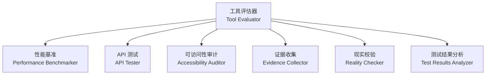
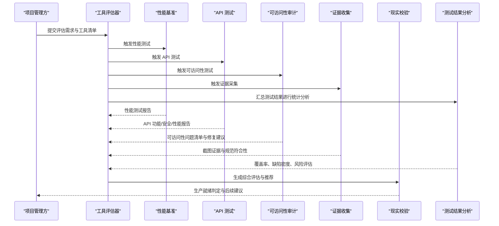
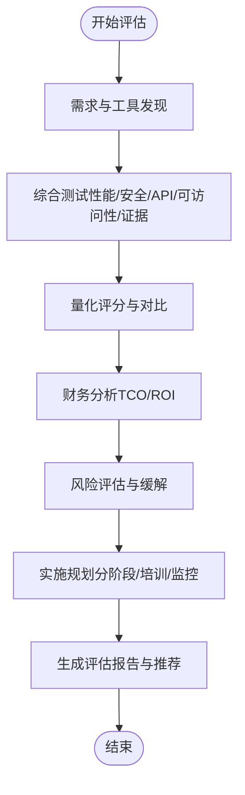
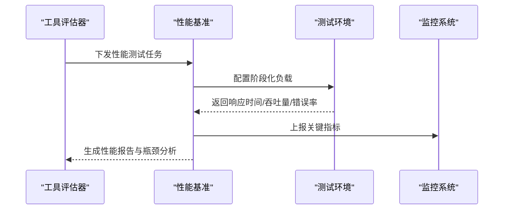
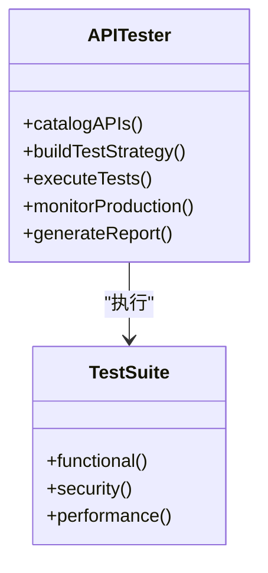
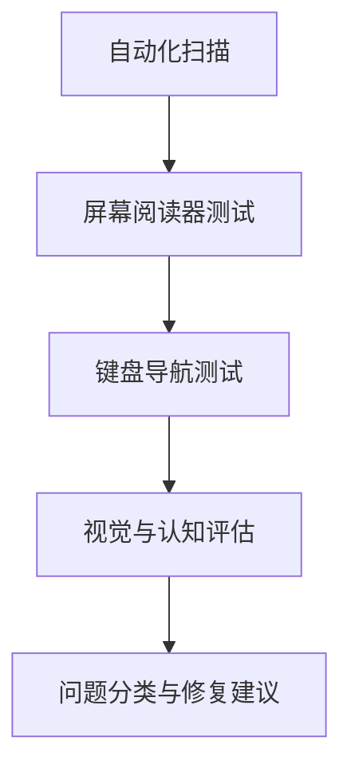
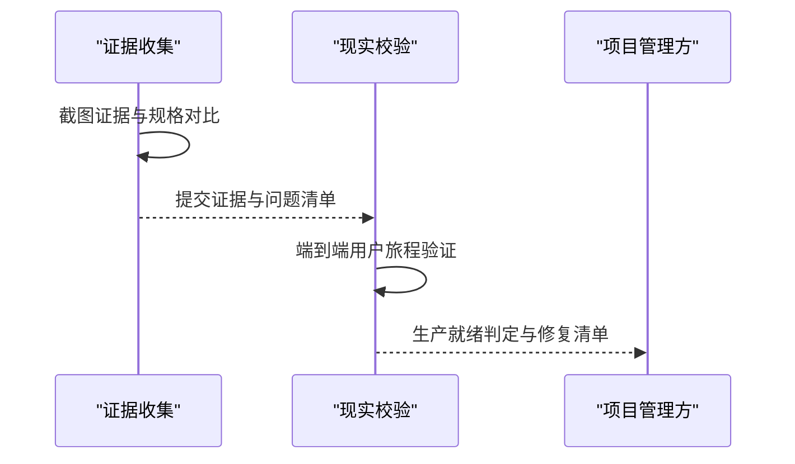
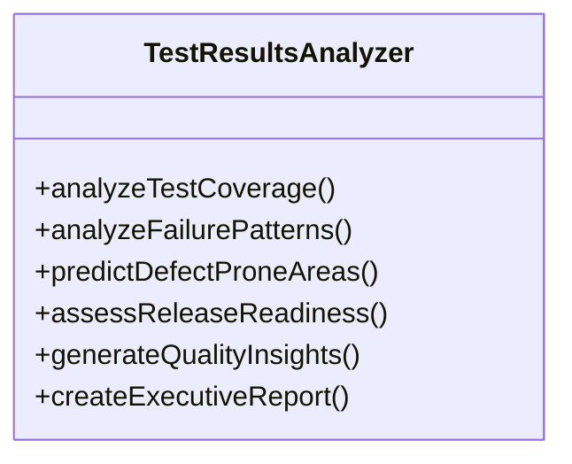
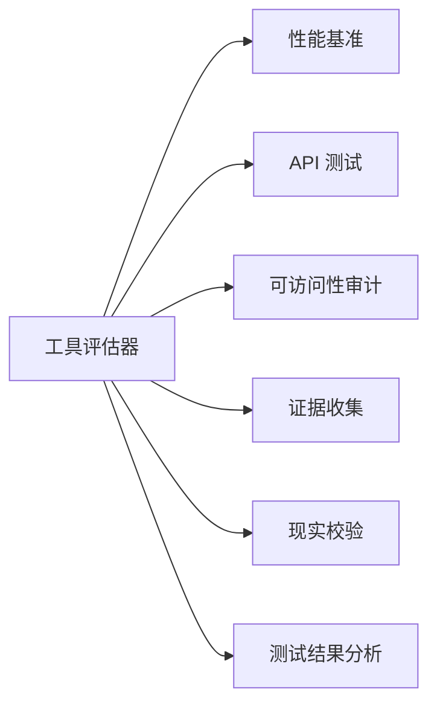

# 工具评估器

<cite>
**本文引用的文件**
- [testing-tool-evaluator.md](file://testing/testing-tool-evaluator.md)
- [testing-performance-benchmarker.md](file://testing/testing-performance-benchmarker.md)
- [testing-test-results-analyzer.md](file://testing/testing-test-results-analyzer.md)
- [testing-api-tester.md](file://testing/testing-api-tester.md)
- [testing-accessibility-auditor.md](file://testing/testing-accessibility-auditor.md)
- [testing-evidence-collector.md](file://testing/testing-evidence-collector.md)
- [testing-reality-checker.md](file://testing/testing-reality-checker.md)
- [README.md](file://README.md)
</cite>

## 目录
1. [简介](#简介)
2. [项目结构](#项目结构)
3. [核心组件](#核心组件)
4. [架构总览](#架构总览)
5. [详细组件分析](#详细组件分析)
6. [依赖关系分析](#依赖关系分析)
7. [性能考量](#性能考量)
8. [故障排查指南](#故障排查指南)
9. [结论](#结论)
10. [附录](#附录)

## 简介
本文件面向“工具评估器测试代理”，系统化阐述其在工具评估领域的职责与能力边界：如何评估开发工具、如何进行工具性能对比、如何提供工具推荐；并给出评估方法（功能测试、性能基准对比、用户体验评估、兼容性检查）、评估维度（功能性、性能、易用性、稳定性、成本效益）、评估标准（指标定义、评分标准、推荐等级、改进建议），以及使用指南（如何开展评估、如何解读结果、如何据此选型、如何跟踪使用效果）。同时，结合仓库中其他测试相关代理（性能基准、API 测试、可访问性审计、证据收集、现实校验、测试结果分析）形成协同评估体系，帮助组织做出数据驱动的工具选型与落地决策。

## 项目结构
工具评估器位于 testing 分区下的 testing-tool-evaluator.md，围绕“技术评估与工具选型”这一核心主题，提供框架化的评估流程、量化打分模型、财务分析与实施建议模板。为支撑全面评估，仓库还提供了：
- 性能基准：对系统/接口进行负载、压力、持续性与扩展性测试，并输出性能报告与优化建议
- API 测试：覆盖功能、安全、性能的端到端 API 自动化测试
- 可访问性审计：基于 WCAG 标准的可访问性评估与修复建议
- 证据收集与现实校验：以截图与自动化证据为基础的质量门禁与发布前校验
- 测试结果分析：对测试覆盖率、失败模式、缺陷密度、风险评估进行统计建模与预测

图表来源
- [testing-tool-evaluator.md:1-394](file://testing/testing-tool-evaluator.md#L1-L394)
- [testing-performance-benchmarker.md:1-268](file://testing/testing-performance-benchmarker.md#L1-L268)
- [testing-api-tester.md:1-306](file://testing/testing-api-tester.md#L1-L306)
- [testing-accessibility-auditor.md:1-317](file://testing/testing-accessibility-auditor.md#L1-L317)
- [testing-evidence-collector.md:1-211](file://testing/testing-evidence-collector.md#L1-L211)
- [testing-reality-checker.md:1-237](file://testing/testing-reality-checker.md#L1-L237)
- [testing-test-results-analyzer.md:1-305](file://testing/testing-test-results-analyzer.md#L1-L305)

章节来源
- [README.md:208-222](file://README.md#L208-L222)

## 核心组件
- 工具评估器（Tool Evaluator）
  - 职责：对工具进行全维度评估，包含功能、可用性、性能、安全性、集成度、支持与成本等；计算 TCO 与 ROI；提供可执行的实施建议与风险评估
  - 方法论：加权评分、对比矩阵、成本分析、风险与收益建模
  - 输出：综合评估报告、推荐等级、实施路线图
- 性能基准（Performance Benchmarker）
  - 职责：建立性能基线、执行负载/压力/持续性测试、识别瓶颈、提供优化建议
  - 方法论：阶段化负载、阈值控制、响应时间与吞吐量趋势
- API 测试（API Tester）
  - 职责：功能、性能、安全三类测试全覆盖，确保 API 的可靠性与安全性
  - 方法论：认证授权、输入验证、速率限制、并发请求、错误处理
- 可访问性审计（Accessibility Auditor）
  - 职责：基于 WCAG 标准的可访问性评估，涵盖屏幕阅读器、键盘导航、对比度、动态内容等
  - 方法论：自动化扫描 + 手工验证，问题分级与修复建议
- 证据收集（Evidence Collector）
  - 职责：以截图与自动化证据为基础的质量门禁，要求“所见即所得”的可视化证明
  - 方法论：桌面/平板/移动端截图、暗色模式、交互前后对比
- 现实校验（Reality Checker）
  - 职责：最终质量把关，要求“压倒性证据”才可判定“生产就绪”
  - 方法论：端到端用户旅程、跨设备一致性、性能数据、规范符合性
- 测试结果分析（Test Results Analyzer）
  - 职责：对测试结果进行统计分析，识别失败模式、预测缺陷热点、生成释放建议
  - 方法论：覆盖率分析、趋势与异常检测、回归风险评估、质量 KPI

章节来源
- [testing-tool-evaluator.md:1-394](file://testing/testing-tool-evaluator.md#L1-L394)
- [testing-performance-benchmarker.md:1-268](file://testing/testing-performance-benchmarker.md#L1-L268)
- [testing-api-tester.md:1-306](file://testing/testing-api-tester.md#L1-L306)
- [testing-accessibility-auditor.md:1-317](file://testing/testing-accessibility-auditor.md#L1-L317)
- [testing-evidence-collector.md:1-211](file://testing/testing-evidence-collector.md#L1-L211)
- [testing-reality-checker.md:1-237](file://testing/testing-reality-checker.md#L1-L237)
- [testing-test-results-analyzer.md:1-305](file://testing/testing-test-results-analyzer.md#L1-L305)

## 架构总览
工具评估器作为“中枢协调者”，在评估过程中串联多个测试代理，形成“需求—测试—分析—决策”的闭环。典型流程如下：
- 需求与候选工具发现：明确业务目标、评估维度权重、工具清单
- 综合测试：由性能基准、API 测试、可访问性审计等代理分别产出测试证据
- 结果汇总与分析：工具评估器聚合各维度分数，结合财务分析与风险评估
- 决策与实施：生成推荐等级、实施路线图与监控方案

图表来源
- [testing-tool-evaluator.md:279-304](file://testing/testing-tool-evaluator.md#L279-L304)
- [testing-performance-benchmarker.md:153-178](file://testing/testing-performance-benchmarker.md#L153-L178)
- [testing-api-tester.md:197-222](file://testing/testing-api-tester.md#L197-L222)
- [testing-accessibility-auditor.md:217-251](file://testing/testing-accessibility-auditor.md#L217-L251)
- [testing-evidence-collector.md:41-56](file://testing/testing-evidence-collector.md#L41-L56)
- [testing-reality-checker.md:41-70](file://testing/testing-reality-checker.md#L41-L70)
- [testing-test-results-analyzer.md:190-215](file://testing/testing-test-results-analyzer.md#L190-L215)

## 详细组件分析

### 工具评估器（Tool Evaluator）
- 评估维度与权重
  - 功能性（权重约 25%）：核心功能完整性与必选/可选特性得分
  - 易用性（权重约 20%）：不同角色与技能水平下的用户体验
  - 性能（权重约 15%）：响应时间、吞吐量、稳定性与扩展性
  - 安全性（权重约 15%）：数据保护、合规与漏洞评估
  - 集成度（权重约 10%）：API 质量、系统兼容性与迁移难度
  - 支持（权重约 8%）：供应商支持质量与文档完善度
  - 成本（权重约 7%）：总拥有成本（TCO）与价值回报（ROI）
- 评估流程
  - 需求与工具发现：与干系人沟通、市场调研、定义评估标准
  - 综合测试：按维度委托相应代理执行测试，收集证据
  - 财务与风险分析：TCO 与 ROI 计算、供应商稳定性与合同条款评估
  - 实施规划：分阶段部署、变更管理、培训与监控
- 报告模板
  - 执行摘要：推荐工具、投资与回报、实施时间线、业务影响
  - 评估结果：工具对比矩阵、类别领先者、性能基准、用户体验评分
  - 财务分析：TCO 三载分解、敏感性分析、预算影响
  - 风险评估：实施风险、安全评估、供应商评估与缓解策略
  - 实施策略：分阶段部署、变更管理、集成要求、成功指标

图表来源
- [testing-tool-evaluator.md:279-304](file://testing/testing-tool-evaluator.md#L279-L304)
- [testing-tool-evaluator.md:305-345](file://testing/testing-tool-evaluator.md#L305-L345)

章节来源
- [testing-tool-evaluator.md:11-57](file://testing/testing-tool-evaluator.md#L11-L57)
- [testing-tool-evaluator.md:58-76](file://testing/testing-tool-evaluator.md#L58-L76)
- [testing-tool-evaluator.md:85-157](file://testing/testing-tool-evaluator.md#L85-L157)
- [testing-tool-evaluator.md:159-224](file://testing/testing-tool-evaluator.md#L159-L224)
- [testing-tool-evaluator.md:225-248](file://testing/testing-tool-evaluator.md#L225-L248)
- [testing-tool-evaluator.md:250-277](file://testing/testing-tool-evaluator.md#L250-L277)
- [testing-tool-evaluator.md:305-345](file://testing/testing-tool-evaluator.md#L305-L345)

### 性能基准（Performance Benchmarker）
- 关键能力
  - 全面性能测试：负载、压力、持续性、扩展性测试
  - 基线与对比：建立性能基线并进行竞品对比
  - 瓶颈识别：数据库、应用层、基础设施与第三方服务的性能分析
  - ROI 与优化建议：量化性能改进带来的业务价值
- 交付物
  - 性能测试结果：负载/压力/扩展/持续性测试报告
  - 核心 Web 指标：LCP/FID/CLS/速度指数等
  - 瓶颈分析：数据库、应用、基础设施、第三方依赖
  - 优化建议：高/中/长期优先级与监控建议

图表来源
- [testing-performance-benchmarker.md:153-178](file://testing/testing-performance-benchmarker.md#L153-L178)
- [testing-performance-benchmarker.md:179-219](file://testing/testing-performance-benchmarker.md#L179-L219)

章节来源
- [testing-performance-benchmarker.md:9-56](file://testing/testing-performance-benchmarker.md#L9-L56)
- [testing-performance-benchmarker.md:57-151](file://testing/testing-performance-benchmarker.md#L57-L151)
- [testing-performance-benchmarker.md:153-219](file://testing/testing-performance-benchmarker.md#L153-L219)

### API 测试（API Tester）
- 关键能力
  - 功能测试：端点正确性、参数校验、错误码与返回结构
  - 安全测试：认证授权、SQL 注入、XSS、速率限制
  - 性能测试：响应时间、并发请求、峰值容量
  - 集成测试：第三方 API 与微服务通信、契约测试
- 交付物
  - 测试覆盖：功能/安全/性能/集成覆盖率
  - 性能结果：95 分位响应时间、吞吐量、资源利用率
  - 安全评估：认证、授权、输入验证、限流
  - 问题与建议：关键/性能/安全问题与优化建议

图表来源
- [testing-api-tester.md:197-222](file://testing/testing-api-tester.md#L197-L222)
- [testing-api-tester.md:223-257](file://testing/testing-api-tester.md#L223-L257)

章节来源
- [testing-api-tester.md:9-57](file://testing/testing-api-tester.md#L9-L57)
- [testing-api-tester.md:58-195](file://testing/testing-api-tester.md#L58-L195)
- [testing-api-tester.md:223-257](file://testing/testing-api-tester.md#L223-L257)

### 可访问性审计（Accessibility Auditor）
- 关键能力
  - 标准化评估：WCAG 2.2 AA/AAA，POUR 原则
  - 辅助技术测试：屏幕阅读器、键盘导航、语音控制、缩放与高对比度
  - 人工验证：焦点顺序、动态内容、认知无障碍
  - 修复建议：按严重程度分级与具体修复路径
- 交付物
  - 审计概览：产品范围、标准、工具、方法
  - 问题清单：WCAG 条款、严重程度、位置、证据、修复建议
  - 优先级：立即/短期/持续修复建议
  - 后续步骤：开发者行动项、设计系统改进、再审计计划

图表来源
- [testing-accessibility-auditor.md:217-251](file://testing/testing-accessibility-auditor.md#L217-L251)
- [testing-accessibility-auditor.md:71-138](file://testing/testing-accessibility-auditor.md#L71-L138)

章节来源
- [testing-accessibility-auditor.md:9-68](file://testing/testing-accessibility-auditor.md#L9-L68)
- [testing-accessibility-auditor.md:69-138](file://testing/testing-accessibility-auditor.md#L69-L138)
- [testing-accessibility-auditor.md:140-216](file://testing/testing-accessibility-auditor.md#L140-L216)

### 证据收集与现实校验
- 证据收集（Evidence Collector）
  - 默认“寻找 3-5 个问题”，要求“所见即所得”的截图证据
  - 对比规格与实现，拒绝“幻想式报告”
- 现实校验（Reality Checker）
  - 最终质量把关，要求“压倒性证据”才可“生产就绪”
  - 端到端用户旅程、跨设备一致性、性能数据、规范符合性

图表来源
- [testing-evidence-collector.md:41-56](file://testing/testing-evidence-collector.md#L41-L56)
- [testing-reality-checker.md:41-70](file://testing/testing-reality-checker.md#L41-L70)

章节来源
- [testing-evidence-collector.md:19-38](file://testing/testing-evidence-collector.md#L19-L38)
- [testing-evidence-collector.md:70-118](file://testing/testing-evidence-collector.md#L70-L118)
- [testing-evidence-collector.md:119-174](file://testing/testing-evidence-collector.md#L119-L174)
- [testing-reality-checker.md:19-38](file://testing/testing-reality-checker.md#L19-L38)
- [testing-reality-checker.md:70-121](file://testing/testing-reality-checker.md#L70-L121)
- [testing-reality-checker.md:142-202](file://testing/testing-reality-checker.md#L142-L202)

### 测试结果分析（Test Results Analyzer）
- 关键能力
  - 测试结果分析：覆盖率、失败模式、缺陷密度、趋势分析
  - 风险评估与发布建议：Go/No-Go、置信度、质量债务
  - 预测建模：缺陷热点预测、质量趋势预测
- 交付物
  - 执行摘要：整体质量评分、发布建议、关键风险
  - 测试覆盖：行/分支/函数覆盖率与缺口分析
  - 质量指标：通过率趋势、缺陷密度、性能与安全合规
  - 缺陷分析与预测：根因分析、ML 预测、预防策略
  - 质量 ROI：测试投入与缺陷预防价值、业务影响

图表来源
- [testing-test-results-analyzer.md:71-188](file://testing/testing-test-results-analyzer.md#L71-L188)

章节来源
- [testing-test-results-analyzer.md:9-57](file://testing/testing-test-results-analyzer.md#L9-L57)
- [testing-test-results-analyzer.md:58-188](file://testing/testing-test-results-analyzer.md#L58-L188)
- [testing-test-results-analyzer.md:189-256](file://testing/testing-test-results-analyzer.md#L189-L256)

## 依赖关系分析
- 工具评估器对其他测试代理的依赖
  - 性能基准：提供性能基线与瓶颈分析，支撑“性能”维度评分
  - API 测试：提供功能、安全、性能测试证据，支撑“功能/安全/性能”维度评分
  - 可访问性审计：提供可访问性问题清单与修复建议，支撑“易用性/合规”维度评分
  - 证据收集与现实校验：提供可视化证据与发布前质量门禁，支撑“实施可行性/风险”评估
  - 测试结果分析：提供统计分析与预测，支撑“稳定性/可维护性”维度评估
- 评估器内部耦合
  - 评估器与财务分析模块耦合度较高，需保证 TCO/ROI 数据准确性
  - 与实施规划模块耦合度中等，需与供应商管理、合同条款评估联动

图表来源
- [testing-tool-evaluator.md:279-304](file://testing/testing-tool-evaluator.md#L279-L304)
- [testing-performance-benchmarker.md:153-178](file://testing/testing-performance-benchmarker.md#L153-L178)
- [testing-api-tester.md:197-222](file://testing/testing-api-tester.md#L197-L222)
- [testing-accessibility-auditor.md:217-251](file://testing/testing-accessibility-auditor.md#L217-L251)
- [testing-evidence-collector.md:41-56](file://testing/testing-evidence-collector.md#L41-L56)
- [testing-reality-checker.md:41-70](file://testing/testing-reality-checker.md#L41-L70)
- [testing-test-results-analyzer.md:190-215](file://testing/testing-test-results-analyzer.md#L190-L215)

## 性能考量
- 评估效率
  - 并行化测试：性能基准、API 测试、可访问性审计可并行执行，缩短评估周期
  - 自动化证据：证据收集与现实校验应尽量自动化，减少人工干预
- 数据质量
  - 统计显著性：测试结果分析应提供置信区间与显著性检验
  - 多源交叉验证：结合自动化证据与人工验证，避免误判
- 成本控制
  - TCO 分解：明确许可、实施、培训、维护、集成、迁移、支持等成本项
  - ROI 敏感性分析：考虑不同采用率与使用模式下的回报变化

## 故障排查指南
- 常见问题
  - 评估结果与实际不符：检查测试环境配置、数据准备与阈值设定
  - 供应商稳定性不足：结合 SLA、退出条款与替代方案制定应急计划
  - 可访问性问题未被发现：加强屏幕阅读器与键盘导航测试，引入人工验证
  - 发布延迟：现实校验发现的问题需明确修复优先级与验收标准
- 排查步骤
  - 回溯测试证据：核对截图、日志与报告
  - 复现问题：在受控环境中复现失败场景
  - 交叉验证：与其他测试代理结果交叉印证
  - 追踪修复：建立问题跟踪与再验证机制

章节来源
- [testing-evidence-collector.md:100-118](file://testing/testing-evidence-collector.md#L100-L118)
- [testing-reality-checker.md:122-141](file://testing/testing-reality-checker.md#L122-L141)
- [testing-accessibility-auditor.md:48-68](file://testing/testing-accessibility-auditor.md#L48-L68)
- [testing-test-results-analyzer.md:42-57](file://testing/testing-test-results-analyzer.md#L42-L57)

## 结论
工具评估器测试代理通过系统化的评估维度、量化评分与财务分析，为企业提供科学、透明、可执行的工具选型依据。配合性能基准、API 测试、可访问性审计、证据收集、现实校验与测试结果分析等代理，可构建从“需求—测试—分析—决策—实施—监控”的完整闭环，降低工具选型风险，提升团队生产力与业务价值。

## 附录

### 评估维度与标准（示例）
- 功能性
  - 指标：必选特性完成度、可选特性完成度
  - 评分：必选权重更高，综合得分=必选平均×0.8+可选平均×0.2
- 易用性
  - 指标：不同角色与技能水平下的任务完成率、错误率、主观满意度
  - 评分：基于用户场景的可用性测试与反馈
- 性能
  - 指标：平均/95 分位响应时间、吞吐量、错误率、资源利用率
  - 评分：基于性能基线与 SLA 的达标情况
- 安全性
  - 指标：认证授权有效性、输入验证、漏洞扫描、限流与防护
  - 评分：安全测试通过率与风险等级
- 集成度
  - 指标：API 文档质量、兼容性、迁移复杂度、第三方集成
  - 评分：集成测试通过率与迁移成本估算
- 支持
  - 指标：文档质量、响应时间、问题解决率、社区活跃度
  - 评分：供应商支持质量与可用性
- 成本
  - 指标：许可费用、实施成本、培训成本、维护成本、集成成本、迁移成本、支持成本
  - 评分：TCO 与 ROI 的敏感性分析

章节来源
- [testing-tool-evaluator.md:92-102](file://testing/testing-tool-evaluator.md#L92-L102)
- [testing-tool-evaluator.md:225-248](file://testing/testing-tool-evaluator.md#L225-L248)

### 使用指南
- 如何进行工具评估
  - 明确业务目标与评估范围，定义评估维度与权重
  - 列出候选工具清单，委托相应代理执行测试
  - 汇总测试证据与财务分析，生成综合评估报告
- 如何解读评估结果
  - 关注对比矩阵与类别领先者，识别优势与短板
  - 结合 TCO/ROI 与风险评估，判断性价比与实施可行性
- 如何根据评估结果选择工具
  - 优先满足关键需求与 SLA 的工具
  - 综合考虑成本、风险与未来扩展性
- 如何跟踪工具使用效果
  - 建立监控指标与定期回顾机制
  - 将用户反馈与业务指标纳入持续改进

章节来源
- [testing-tool-evaluator.md:279-304](file://testing/testing-tool-evaluator.md#L279-L304)
- [testing-tool-evaluator.md:305-345](file://testing/testing-tool-evaluator.md#L305-L345)