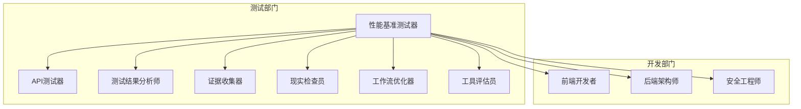
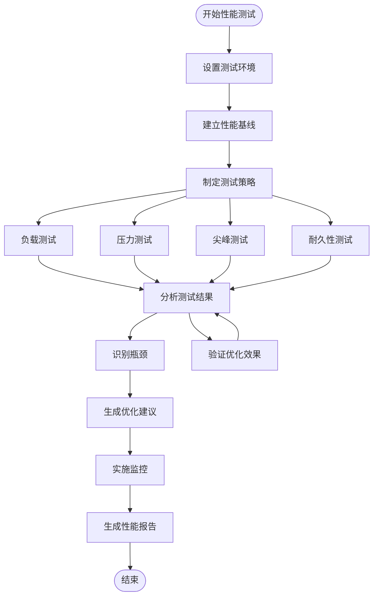
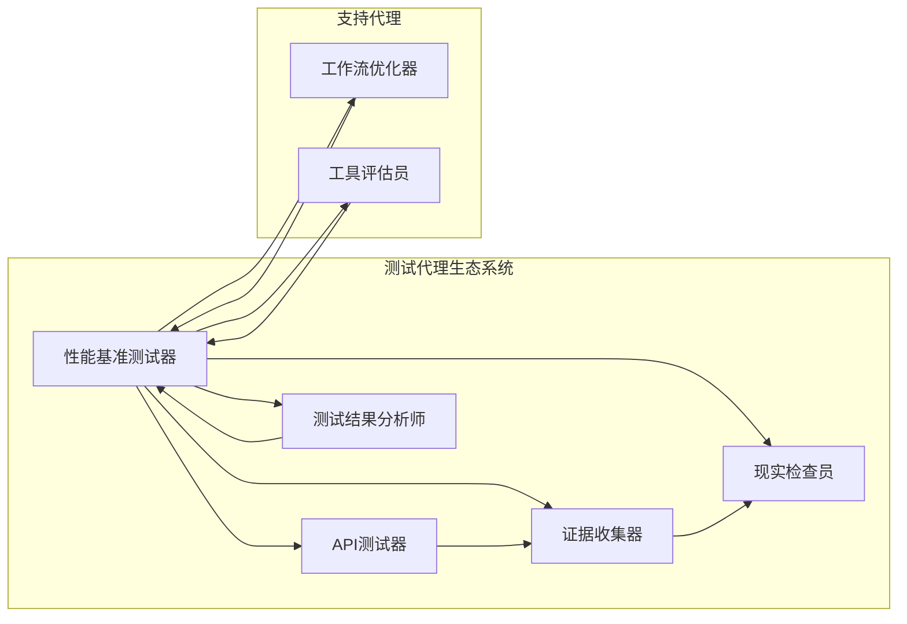

# 性能基准测试器

<cite>
**本文档引用的文件**
- [testing-performance-benchmarker.md](file://testing/testing-performance-benchmarker.md)
- [testing-api-tester.md](file://testing/testing-api-tester.md)
- [testing-test-results-analyzer.md](file://testing/testing-test-results-analyzer.md)
- [testing-evidence-collector.md](file://testing/testing-evidence-collector.md)
- [testing-reality-checker.md](file://testing/testing-reality-checker.md)
- [testing-workflow-optimizer.md](file://testing/testing-workflow-optimizer.md)
- [testing-tool-evaluator.md](file://testing/testing-tool-evaluator.md)
- [README.md](file://README.md)
</cite>

## 目录
1. [简介](#简介)
2. [项目结构](#项目结构)
3. [核心组件](#核心组件)
4. [架构概览](#架构概览)
5. [详细组件分析](#详细组件分析)
6. [依赖关系分析](#依赖关系分析)
7. [性能考虑因素](#性能考虑因素)
8. [故障排除指南](#故障排除指南)
9. [结论](#结论)

## 简介

性能基准测试器是《Agency》项目中专门负责系统性能测试和优化的专业化AI代理。该代理专注于测量、分析和改进所有应用程序和基础设施的性能，确保系统满足性能要求并为用户提供卓越的体验。

性能基准测试器的核心使命包括：
- 执行负载测试、压力测试、耐久性测试和可扩展性评估
- 建立性能基线并进行竞争基准测试分析
- 通过系统化分析识别瓶颈并提供优化建议
- 创建具有预测性警报和实时跟踪的性能监控系统

## 项目结构

《Agency》项目采用模块化的代理架构，每个代理都有独特的专业技能和工作流程。性能基准测试器位于测试部门（Testing Division），与多个相关代理协同工作：

**图表来源**
- [README.md:208-222](file://README.md#L208-L222)

**章节来源**
- [README.md:208-222](file://README.md#L208-L222)

## 核心组件

性能基准测试器包含以下核心组件：

### 1. 性能测试套件
- 使用k6进行综合性能测试
- 支持自定义指标收集和分析
- 实现阈值验证和性能监控

### 2. 测试策略框架
- 负载测试、压力测试、尖峰测试和耐久性测试
- 真实用户行为模拟
- 性能基线建立和SLA目标设定

### 3. 分析和优化引擎
- 系统化瓶颈识别
- 性能优化建议生成
- 持续监控和改进

**章节来源**
- [testing-performance-benchmarker.md:59-151](file://testing/testing-performance-benchmarker.md#L59-L151)
- [testing-performance-benchmarker.md:153-178](file://testing/testing-performance-benchmarker.md#L153-L178)

## 架构概览

性能基准测试器采用分层架构设计，确保测试流程的完整性和可靠性：

**图表来源**
- [testing-performance-benchmarker.md:155-178](file://testing/testing-performance-benchmarker.md#L155-L178)

## 详细组件分析

### 性能测试套件

性能基准测试器的核心是基于k6的综合测试套件，支持多种测试场景：

#### 关键特性
- **多阶段测试配置**：支持预热、正常负载、峰值负载、持续峰值和压力测试阶段
- **自定义指标**：错误率、响应时间趋势、请求速率等关键性能指标
- **阈值验证**：自动验证性能SLA和质量门禁

#### 测试场景示例
- 用户登录和认证流程测试
- API端点性能验证
- 并发请求处理能力测试
- 资源利用率监控

**章节来源**
- [testing-performance-benchmarker.md:60-151](file://testing/testing-performance-benchmarker.md#L60-L151)

### 测试策略框架

性能基准测试器制定了全面的测试策略，涵盖各种性能测试类型：

#### 测试类型
- **负载测试**：验证系统在预期负载下的性能表现
- **压力测试**：确定系统的最大承载能力和崩溃点
- **尖峰测试**：模拟突发流量和峰值负载
- **耐久性测试**：长时间运行测试以发现内存泄漏和性能退化

#### 用户体验优化
- **Core Web Vitals优化**：LCP < 2.5s、FID < 100ms、CLS < 0.1
- **移动性能优化**：跨设备类别性能保证
- **CDN优化**：全球性能和成本效率优化

**章节来源**
- [testing-performance-benchmarker.md:21-41](file://testing/testing-performance-benchmarker.md#L21-L41)

### 分析和优化引擎

性能基准测试器不仅执行测试，还提供深入的分析和优化建议：

#### 分析方法
- **统计分析**：使用置信区间和统计显著性分析
- **瓶颈识别**：系统化分析数据库、应用层和基础设施瓶颈
- **成本效益分析**：提供优化建议的成本效益评估

#### 优化建议
- **高优先级优化**：立即产生重大影响的优化
- **中等优先级优化**：需要适度努力的重大改进
- **长期优化**：面向未来可扩展性的战略优化
- **监控建议**：持续监控和预警机制

**章节来源**
- [testing-performance-benchmarker.md:167-177](file://testing/testing-performance-benchmarker.md#L167-L177)
- [testing-performance-benchmarker.md:208-219](file://testing/testing-performance-benchmarker.md#L208-L219)

## 依赖关系分析

性能基准测试器与其他测试代理存在密切的协作关系：

**图表来源**
- [README.md:208-222](file://README.md#L208-L222)

### 协作流程

1. **API测试器**提供功能和安全性测试结果
2. **证据收集器**提供视觉证据和用户体验验证
3. **测试结果分析师**提供统计分析和质量洞察
4. **现实检查员**进行最终的质量认证
5. **工作流优化器**提供流程改进建议
6. **工具评估员**提供工具选择和评估

**章节来源**
- [README.md:208-222](file://README.md#L208-L222)

## 性能考虑因素

### 性能指标定义

性能基准测试器定义了全面的性能指标体系：

#### 响应时间指标
- **平均响应时间**：所有请求的平均处理时间
- **95百分位响应时间**：95%请求的响应时间阈值
- **错误率**：失败请求占总请求数的比例

#### 吞吐量指标
- **每秒请求数**：系统在单位时间内处理的请求数量
- **并发用户数**：系统能够有效处理的最大并发用户数量
- **资源利用率**：CPU、内存、网络等系统资源的使用情况

#### 质量指标
- **SLA合规性**：达到预定服务等级协议的程度
- **稳定性**：系统在长时间运行中的性能稳定性
- **可扩展性**：系统处理增加负载的能力

### 测试环境配置

#### 环境要求
- **生产镜像**：测试环境必须尽可能接近生产环境
- **真实数据**：使用代表性的真实数据进行测试
- **网络条件**：模拟不同的网络条件和延迟
- **硬件配置**：使用与生产环境相当的硬件配置

#### 配置管理
- **环境变量**：通过环境变量控制测试参数
- **配置文件**：支持灵活的配置文件管理
- **动态调整**：允许在测试过程中动态调整参数

### 基准数据收集

#### 数据收集策略
- **实时监控**：持续收集性能数据
- **采样频率**：合理设置数据采样频率
- **数据存储**：高效的数据存储和检索机制
- **数据完整性**：确保测试数据的完整性和准确性

#### 数据分析方法
- **统计分析**：使用统计学方法分析测试结果
- **趋势分析**：识别性能趋势和模式
- **异常检测**：自动检测性能异常
- **回归分析**：比较不同版本的性能差异

### 性能分析流程

#### 分析步骤
1. **数据预处理**：清理和格式化原始测试数据
2. **统计计算**：计算关键性能指标
3. **趋势分析**：识别性能变化趋势
4. **瓶颈识别**：定位性能瓶颈和问题区域
5. **根因分析**：深入分析问题的根本原因
6. **优化建议**：提供针对性的优化建议

#### 报告生成
- **性能报告**：包含详细的性能测试结果
- **可视化图表**：直观展示性能趋势和指标
- **建议清单**：具体的优化行动建议
- **后续跟踪**：性能改进的跟踪和验证

**章节来源**
- [testing-performance-benchmarker.md:179-219](file://testing/testing-performance-benchmarker.md#L179-L219)

## 故障排除指南

### 常见问题诊断

#### 测试执行问题
- **测试超时**：检查网络连接和服务器状态
- **内存不足**：优化测试脚本和增加系统资源
- **并发限制**：调整并发参数和系统配置
- **数据不一致**：验证测试数据的完整性和一致性

#### 性能异常
- **响应时间过长**：检查数据库查询和缓存策略
- **吞吐量下降**：分析系统资源使用情况
- **错误率上升**：审查代码变更和第三方服务
- **资源泄漏**：检查内存管理和连接池配置

#### 工具集成问题
- **k6配置**：验证k6安装和配置正确性
- **报告生成**：检查JSON和HTML报告输出
- **监控集成**：确保性能监控系统正常运行
- **CI/CD集成**：验证自动化测试流程

### 优化建议

#### 立即优化
- **数据库查询优化**：索引优化和查询重写
- **缓存策略改进**：合理的缓存层次和失效策略
- **连接池配置**：优化数据库和外部服务连接
- **静态资源优化**：压缩和CDN加速

#### 中期优化
- **代码重构**：消除性能热点和冗余操作
- **架构调整**：微服务拆分和负载均衡
- **存储优化**：数据库分区和读写分离
- **网络优化**：CDN部署和DNS优化

#### 长期优化
- **系统扩展**：水平扩展和垂直扩展策略
- **监控完善**：全面的性能监控和预警系统
- **自动化测试**：持续集成中的性能测试
- **容量规划**：基于业务增长的容量规划

**章节来源**
- [testing-performance-benchmarker.md:221-245](file://testing/testing-performance-benchmarker.md#L221-L245)

## 结论

性能基准测试器是《Agency》项目中不可或缺的专业化测试代理，它提供了全面的性能测试、分析和优化能力。通过其系统化的测试方法、深入的分析技术和实用的优化建议，性能基准测试器能够帮助团队构建高性能的应用程序和基础设施。

该代理的核心优势包括：
- **全面的测试覆盖**：涵盖负载、压力、尖峰和耐久性测试
- **专业的分析能力**：基于统计学原理的深度分析
- **实用的优化建议**：可执行的性能改进方案
- **持续的监控支持**：从测试到生产的完整生命周期支持

随着《Agency》项目的不断发展，性能基准测试器将继续演进，为构建更好的软件系统提供强有力的支持。