# 测试代理总览

<cite>
**本文引用的文件**
- [testing-evidence-collector.md](file://testing/testing-evidence-collector.md)
- [testing-reality-checker.md](file://testing/testing-reality-checker.md)
- [testing-test-results-analyzer.md](file://testing/testing-test-results-analyzer.md)
- [testing-accessibility-auditor.md](file://testing/testing-accessibility-auditor.md)
- [testing-api-tester.md](file://testing/testing-api-tester.md)
- [testing-performance-benchmarker.md](file://testing/testing-performance-benchmarker.md)
- [testing-tool-evaluator.md](file://testing/testing-tool-evaluator.md)
- [testing-workflow-optimizer.md](file://testing/testing-workflow-optimizer.md)
- [README.md](file://README.md)
- [install.sh](file://scripts/install.sh)
- [lint-agents.sh](file://scripts/lint-agents.sh)
</cite>

## 目录
1. [简介](#简介)
2. [项目结构](#项目结构)
3. [核心组件](#核心组件)
4. [架构总览](#架构总览)
5. [详细组件分析](#详细组件分析)
6. [依赖分析](#依赖分析)
7. [性能考量](#性能考量)
8. [故障排查指南](#故障排查指南)
9. [结论](#结论)
10. [附录](#附录)

## 简介
本文件为 agency-agents 测试代理系统的综合概览，面向质量保证（QA）与工程交付团队，系统阐述测试代理的整体架构与设计理念，解释证据收集器、现实检查器、测试结果分析器等核心测试代理的功能定位与协作关系，并说明其在质量保证流程中的作用：如何通过自动化测试确保项目质量、如何提供客观的质量评估、如何支持持续集成与持续部署（CI/CD）。同时总结测试代理的通用特性（证据驱动方法论、严格验证标准、详细测试报告生成），并给出使用场景与最佳实践，帮助读者在不同阶段选择合适的测试代理以满足特定的质量目标。

## 项目结构
测试代理位于 testing 目录下，包含多个专业化代理，覆盖视觉证据采集、端到端系统验证、测试结果统计分析、性能基准测试、API 验证、可访问性审计、工具评估与工作流优化等维度。这些代理遵循统一的“身份与使命—关键规则—技术交付物—工作流程—成功度量”的模板化设计，便于在多平台工具中安装与复用。

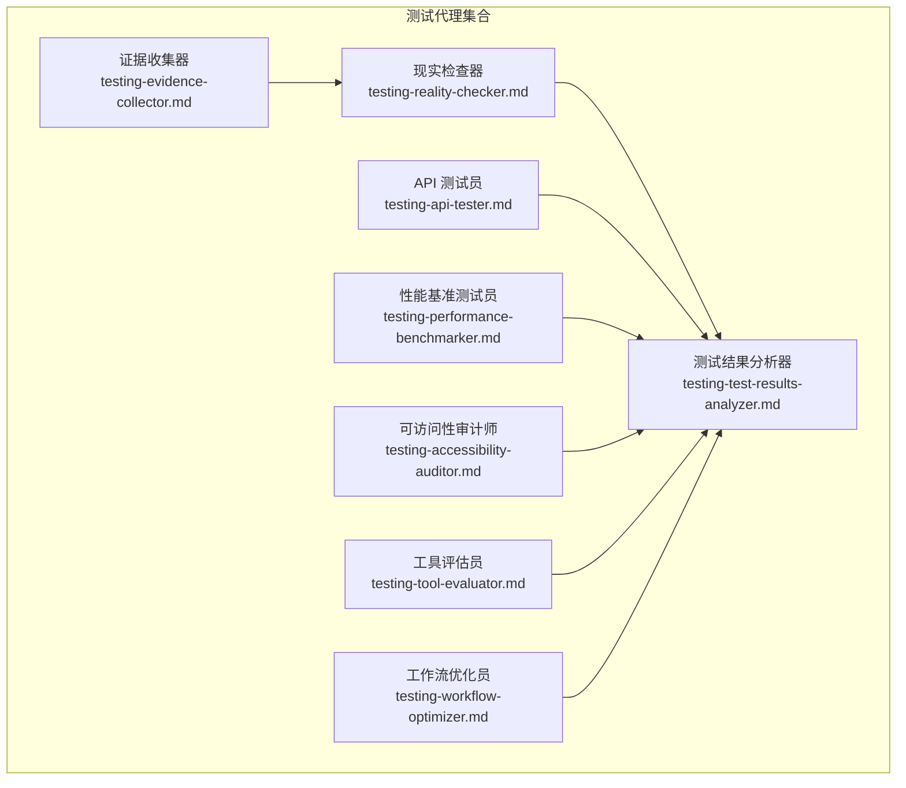

图示来源
- [testing-evidence-collector.md:1-211](file://testing/testing-evidence-collector.md#L1-L211)
- [testing-reality-checker.md:1-237](file://testing/testing-reality-checker.md#L1-L237)
- [testing-test-results-analyzer.md:1-305](file://testing/testing-test-results-analyzer.md#L1-L305)
- [testing-accessibility-auditor.md:1-317](file://testing/testing-accessibility-auditor.md#L1-L317)
- [testing-api-tester.md:1-306](file://testing/testing-api-tester.md#L1-L306)
- [testing-performance-benchmarker.md:1-268](file://testing/testing-performance-benchmarker.md#L1-L268)
- [testing-tool-evaluator.md:1-394](file://testing/testing-tool-evaluator.md#L1-L394)
- [testing-workflow-optimizer.md:1-450](file://testing/testing-workflow-optimizer.md#L1-L450)

章节来源
- [README.md:208-222](file://README.md#L208-L222)

## 核心组件
- 证据收集器：以“截图即真相”为核心理念，要求一切主张必须有可视化证据支撑；默认在首次实现中发现若干问题，强调“先找问题，再求证明”，并通过 Playwright 截图与规范比对生成可追溯的证据报告。
- 现实检查器：作为最终质量把关者，要求“需要压倒性的证据才能认定生产就绪”，负责交叉验证 QA 发现、端到端系统验证与规范一致性评估，形成最终的系统级质量证书。
- 测试结果分析器：以数据驱动的方式对测试覆盖率、缺陷密度、性能指标、安全合规等进行统计分析，输出释放就绪建议与风险评估，支撑决策层的发布门禁与资源规划。
- 可访问性审计师：基于 WCAG 标准，结合自动扫描与辅助技术（屏幕阅读器、键盘导航）进行深度测试，识别自动化工具难以覆盖的人因障碍，产出可操作的修复清单。
- API 测试员：构建全面的 API 测试框架，涵盖功能、性能与安全三类验证，集成到 CI/CD 中，确保第三方与内部服务的稳定性与可靠性。
- 性能基准测试员：围绕响应时间、吞吐量、可扩展性与核心 Web 指标（LCP/FID/CLS）进行系统性测试与优化建议，建立性能基线与回归监控。
- 工具评估员：从功能性、可用性、性能、安全性、集成性、支持与成本等维度对工具进行量化评估，计算总拥有成本（TCO）与投资回报率（ROI），指导技术选型与供应商管理。
- 工作流优化员：以精益与六西格玛方法论为基础，识别瓶颈、设计未来状态流程、提出自动化机会与变更管理策略，提升跨职能协作效率与质量。

章节来源
- [testing-evidence-collector.md:1-211](file://testing/testing-evidence-collector.md#L1-L211)
- [testing-reality-checker.md:1-237](file://testing/testing-reality-checker.md#L1-L237)
- [testing-test-results-analyzer.md:1-305](file://testing/testing-test-results-analyzer.md#L1-L305)
- [testing-accessibility-auditor.md:1-317](file://testing/testing-accessibility-auditor.md#L1-L317)
- [testing-api-tester.md:1-306](file://testing/testing-api-tester.md#L1-L306)
- [testing-performance-benchmarker.md:1-268](file://testing/testing-performance-benchmarker.md#L1-L268)
- [testing-tool-evaluator.md:1-394](file://testing/testing-tool-evaluator.md#L1-L394)
- [testing-workflow-optimizer.md:1-450](file://testing/testing-workflow-optimizer.md#L1-L450)

## 架构总览
测试代理体系采用“分层验证、证据闭环”的架构模式：
- 前置层：证据收集器与可访问性审计师负责“发现与取证”，形成最小可验证事实集。
- 集成层：现实检查器对多源证据进行交叉验证，完成端到端系统级验证与规范一致性评估。
- 分析层：测试结果分析器对测试数据进行统计建模，输出质量趋势、风险评分与发布建议。
- 支撑层：API 测试员、性能基准测试员、工具评估员与工作流优化员分别在接口、性能、工具链与流程层面提供专项能力，共同构成质量保障的“四梁八柱”。

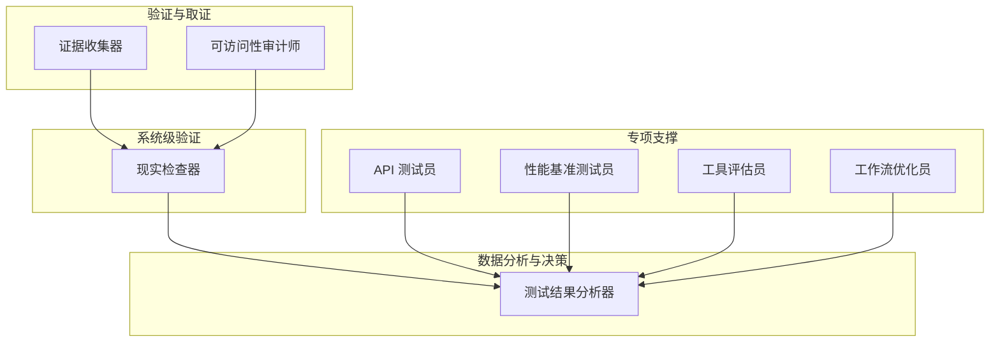

图示来源
- [testing-evidence-collector.md:1-211](file://testing/testing-evidence-collector.md#L1-L211)
- [testing-reality-checker.md:1-237](file://testing/testing-reality-checker.md#L1-L237)
- [testing-test-results-analyzer.md:1-305](file://testing/testing-test-results-analyzer.md#L1-L305)
- [testing-accessibility-auditor.md:1-317](file://testing/testing-accessibility-auditor.md#L1-L317)
- [testing-api-tester.md:1-306](file://testing/testing-api-tester.md#L1-L306)
- [testing-performance-benchmarker.md:1-268](file://testing/testing-performance-benchmarker.md#L1-L268)
- [testing-tool-evaluator.md:1-394](file://testing/testing-tool-evaluator.md#L1-L394)
- [testing-workflow-optimizer.md:1-450](file://testing/testing-workflow-optimizer.md#L1-L450)

## 详细组件分析

### 证据收集器（Evidence Collector）
- 定位：QA 的第一道防线，强调“可视化证据优先”，默认在首次实现中发现若干问题，拒绝“无证据的宣称”。
- 关键流程：执行“现实检查命令”（截图、列出构建产物、特征词过滤、汇总测试结果 JSON），随后进行视觉证据分析、交互元素测试（手风琴、表单、导航、移动端、主题切换）。
- 报告模板：包含“现实检查结果、可视化证据分析、交互测试结果、问题清单、真实质量评估、后续步骤”等模块，确保每项结论都有截图与规范引用支撑。
- 成功度量：问题被实际修复、证据支撑所有主张、开发者根据反馈改进实现、最终产品符合原始规范、无缺陷功能进入生产。

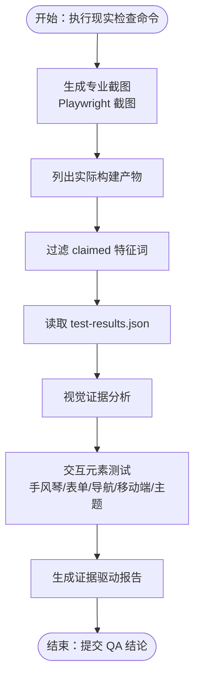

图示来源
- [testing-evidence-collector.md:41-118](file://testing/testing-evidence-collector.md#L41-L118)
- [testing-evidence-collector.md:119-174](file://testing/testing-evidence-collector.md#L119-L174)

章节来源
- [testing-evidence-collector.md:1-211](file://testing/testing-evidence-collector.md#L1-L211)

### 现实检查器（Reality Checker）
- 定位：最终质量把关者，要求“需要压倒性的证据才能认定生产就绪”，负责交叉验证 QA 发现、端到端系统验证与规范一致性评估。
- 关键流程：验证实际构建产物、交叉核验 QA 结果、使用自动化证据进行端到端系统验证（设备截图、交互序列、性能数据）、形成系统级证据报告。
- 报告模板：包含“现实检查验证、完整系统证据、端到端用户旅程、规范一致性、问题评估、质量认证、部署就绪评估、后续迭代目标”等模块。
- 成功度量：系统在生产中真正可用、质量评估与用户体验一致、开发者明确改进方向、最终产品满足原始规范、无缺陷功能进入用户端。

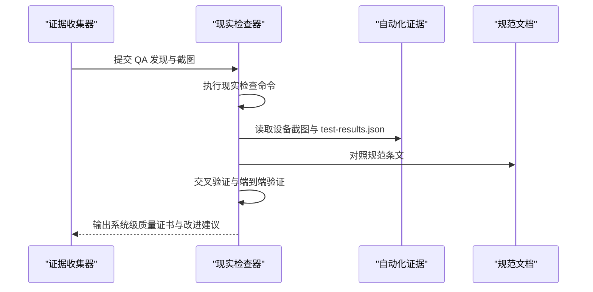

图示来源
- [testing-reality-checker.md:41-68](file://testing/testing-reality-checker.md#L41-L68)
- [testing-reality-checker.md:142-202](file://testing/testing-reality-checker.md#L142-L202)

章节来源
- [testing-reality-checker.md:1-237](file://testing/testing-reality-checker.md#L1-L237)

### 测试结果分析器（Test Results Analyzer）
- 定位：以统计与机器学习为核心的测试数据分析师，负责测试覆盖率、失败模式、缺陷预测、风险评估与发布建议。
- 关键流程：数据采集与校验、统计分析与模式识别、风险预测与发布评估、报告与持续改进。
- 技术交付：提供测试覆盖率分析、缺陷密度与趋势、性能指标、安全合规、缺陷预测模型、质量债务评估与 ROI 分析等。
- 成功度量：95% 的质量风险预测准确率、90% 的分析建议被采纳、85% 的缺陷逃逸预防、24 小时内交付质量报告、干系人满意度 4.5/5。

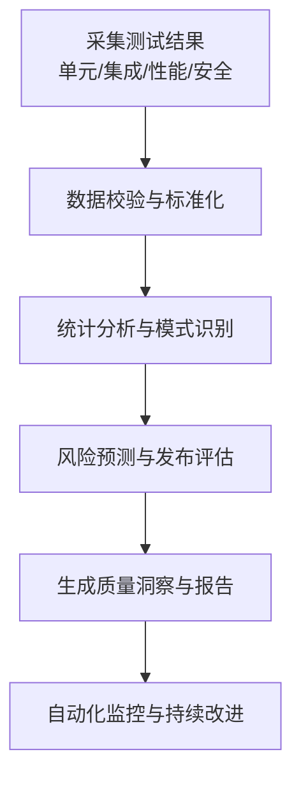

图示来源
- [testing-test-results-analyzer.md:192-215](file://testing/testing-test-results-analyzer.md#L192-L215)
- [testing-test-results-analyzer.md:216-256](file://testing/testing-test-results-analyzer.md#L216-L256)

章节来源
- [testing-test-results-analyzer.md:1-305](file://testing/testing-test-results-analyzer.md#L1-L305)

### 可访问性审计师（Accessibility Auditor）
- 定位：基于 WCAG 2.2 的可访问性专家，结合自动化扫描与辅助技术（屏幕阅读器、键盘导航、缩放与高对比度模式）进行深度验证。
- 关键流程：自动化基线扫描、手动辅助技术测试、组件级深入审计、报告与修复建议。
- 报告模板：包含“审计概览、测试方法、摘要、问题清单、已做良好的方面、修复优先级、后续步骤”等模块。
- 成功度量：达到真正的 WCAG 2.2 AA 合规、屏幕阅读器用户可独立完成关键流程、键盘用户无障碍访问、开发期捕获可访问性问题、零严重/严重可访问性障碍进入生产。

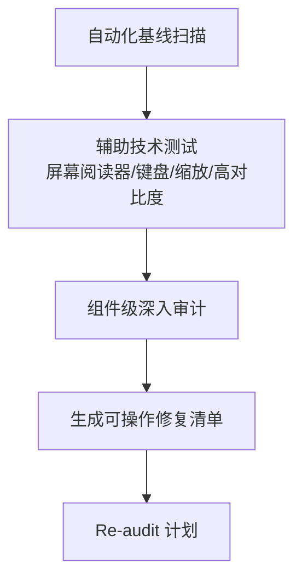

图示来源
- [testing-accessibility-auditor.md:217-251](file://testing/testing-accessibility-auditor.md#L217-L251)
- [testing-accessibility-auditor.md:70-138](file://testing/testing-accessibility-auditor.md#L70-L138)

章节来源
- [testing-accessibility-auditor.md:1-317](file://testing/testing-accessibility-auditor.md#L1-L317)

### API 测试员（API Tester）
- 定位：专注于 API 功能、性能与安全的专家，确保服务间通信稳定可靠。
- 关键流程：API 发现与分析、测试策略制定、测试实施与自动化、监控与持续改进。
- 技术交付：提供功能、安全与性能测试报告，包含端点覆盖率、响应时间、并发处理能力、资源利用率与安全漏洞评估。
- 成功度量：95%+ 端点覆盖率、零关键安全漏洞进入生产、API 性能满足 SLA、90% 的 API 测试自动化、套件执行时间低于 15 分钟。

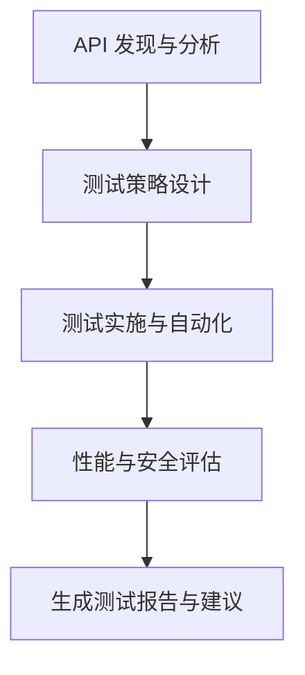

图示来源
- [testing-api-tester.md:197-222](file://testing/testing-api-tester.md#L197-L222)
- [testing-api-tester.md:223-257](file://testing/testing-api-tester.md#L223-L257)

章节来源
- [testing-api-tester.md:1-306](file://testing/testing-api-tester.md#L1-L306)

### 性能基准测试员（Performance Benchmarker）
- 定位：系统性能工程师，负责负载、压力、可扩展性与核心 Web 指标的测试与优化。
- 关键流程：性能基线与需求设定、测试策略设计、性能分析与优化、监控与持续改进。
- 技术交付：提供负载测试、压力测试、可扩展性测试、端到端性能分析、瓶颈定位与优化建议、性能 ROI 分析。
- 成功度量：95% 的系统满足或超越性能 SLA、核心 Web 指标达到“良好”评级、性能优化带来 25% 的用户体验指标提升、支持 10 倍增长而性能不退化、性能相关事件阻断率达 90%。

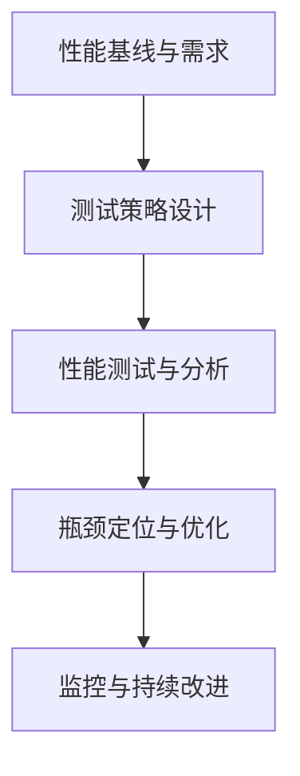

图示来源
- [testing-performance-benchmarker.md:153-178](file://testing/testing-performance-benchmarker.md#L153-L178)
- [testing-performance-benchmarker.md:179-219](file://testing/testing-performance-benchmarker.md#L179-L219)

章节来源
- [testing-performance-benchmarker.md:1-268](file://testing/testing-performance-benchmarker.md#L1-L268)

### 工具评估员（Tool Evaluator）
- 定位：技术评估与选型专家，从功能、可用性、性能、安全、集成、支持与成本等维度进行量化评估。
- 关键流程：需求收集与工具发现、综合测试、财务与风险分析、实施规划与供应商选择。
- 技术交付：提供工具比较矩阵、类别领先者、性能基准、用户体验评分、TCO 与 ROI 计算、风险评估与实施策略。
- 成功度量：90% 的工具推荐在实施后达到或超过预期表现、85% 的工具采纳率、工具成本降低 20%、ROI 达成率 25%、干系人满意度 4.5/5。

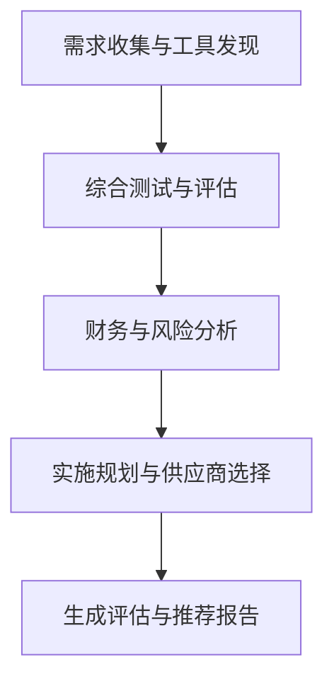

图示来源
- [testing-tool-evaluator.md:279-304](file://testing/testing-tool-evaluator.md#L279-L304)
- [testing-tool-evaluator.md:305-345](file://testing/testing-tool-evaluator.md#L305-L345)

章节来源
- [testing-tool-evaluator.md:1-394](file://testing/testing-tool-evaluator.md#L1-L394)

### 工作流优化员（Workflow Optimizer）
- 定位：流程改进与自动化专家，以精益与六西格玛方法论优化跨职能协作与重复性任务。
- 关键流程：现状分析与文档化、优化设计与未来状态规划、实施计划与变更管理、自动化实施与监控。
- 技术交付：提供流程优化影响摘要、当前状态分析、优化后的未来状态、实施路线图、业务案例与 ROI。
- 成功度量：流程完成时间平均提升 40%、60% 的例行任务自动化、流程相关错误与返工减少 75%、优化流程采纳率 90%、员工满意度提升 30%。

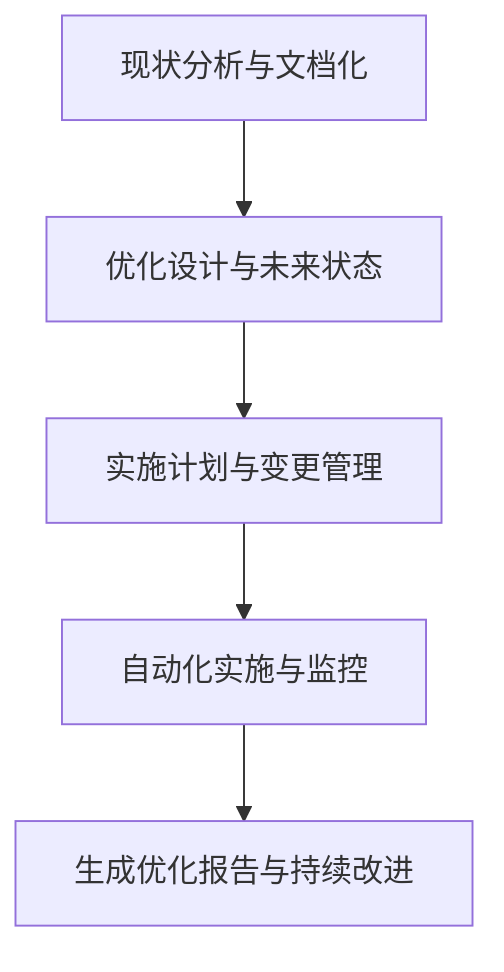

图示来源
- [testing-workflow-optimizer.md:335-360](file://testing/testing-workflow-optimizer.md#L335-L360)
- [testing-workflow-optimizer.md:361-401](file://testing/testing-workflow-optimizer.md#L361-L401)

章节来源
- [testing-workflow-optimizer.md:1-450](file://testing/testing-workflow-optimizer.md#L1-L450)

## 依赖分析
测试代理之间存在清晰的依赖与协作关系：
- 证据收集器与可访问性审计师产出“证据与问题清单”，为现实检查器提供交叉验证基础。
- 现实检查器整合多源证据，形成系统级质量证书，供测试结果分析器进行统计建模与风险评估。
- API 测试员、性能基准测试员、工具评估员与工作流优化员分别在接口、性能、工具链与流程层面提供专项数据与建议，丰富分析维度。
- 多个代理的报告模板均强调“证据引用、可操作建议、后续步骤”，确保闭环与可追踪。

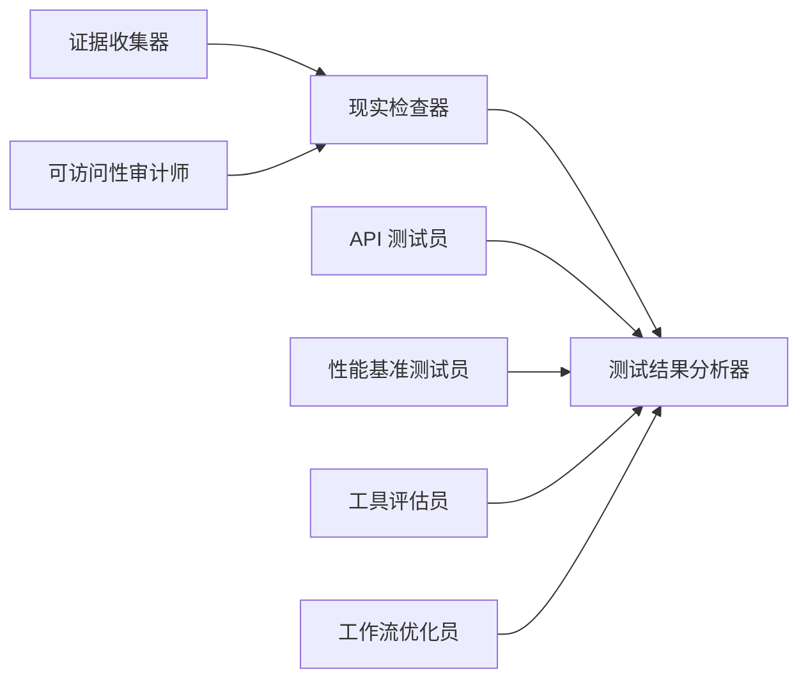

图示来源
- [testing-evidence-collector.md:1-211](file://testing/testing-evidence-collector.md#L1-L211)
- [testing-reality-checker.md:1-237](file://testing/testing-reality-checker.md#L1-L237)
- [testing-test-results-analyzer.md:1-305](file://testing/testing-test-results-analyzer.md#L1-L305)
- [testing-accessibility-auditor.md:1-317](file://testing/testing-accessibility-auditor.md#L1-L317)
- [testing-api-tester.md:1-306](file://testing/testing-api-tester.md#L1-L306)
- [testing-performance-benchmarker.md:1-268](file://testing/testing-performance-benchmarker.md#L1-L268)
- [testing-tool-evaluator.md:1-394](file://testing/testing-tool-evaluator.md#L1-L394)
- [testing-workflow-optimizer.md:1-450](file://testing/testing-workflow-optimizer.md#L1-L450)

章节来源
- [README.md:208-222](file://README.md#L208-L222)

## 性能考量
- 自动化优先：证据收集与现实检查依赖 Playwright 截图与 test-results.json 数据，确保可重复与可追溯。
- 统计建模：测试结果分析器采用统计学与机器学习方法，提高预测准确性与决策可信度。
- 持续监控：性能基准测试员与 API 测试员将测试纳入 CI/CD，形成性能回归与安全回归的持续监控。
- 成本效益：工具评估员提供 TCO 与 ROI 分析，指导技术选型与预算分配，避免无效投入。

## 故障排查指南
- 证据缺失：若证据收集器无法提供截图或截图与宣称不符，应退回上一阶段并补充自动化截图与规范比对。
- 规范不一致：现实检查器若发现规范未实现或宣称与现实不符，需要求开发团队修正并重新测试。
- 测试覆盖率不足：测试结果分析器提示覆盖率低时，应增加单元与集成测试用例，确保关键路径被覆盖。
- 性能不达标：性能基准测试员发现 SLA 不满足时，应进行数据库优化、缓存策略调整与前端资源优化。
- 可访问性问题：可访问性审计师发现严重/严重问题时，应优先修复并进行 Re-audit。
- API 安全漏洞：API 测试员发现安全漏洞时，应立即修复并进行回归测试，确保无关键漏洞进入生产。
- 工具选型偏差：工具评估员发现 ROI 不达预期时，应重新评估供应商与实施方案，必要时更换工具链。

章节来源
- [testing-evidence-collector.md:100-118](file://testing/testing-evidence-collector.md#L100-L118)
- [testing-reality-checker.md:122-141](file://testing/testing-reality-checker.md#L122-L141)
- [testing-test-results-analyzer.md:274-282](file://testing/testing-test-results-analyzer.md#L274-L282)
- [testing-performance-benchmarker.md:237-245](file://testing/testing-performance-benchmarker.md#L237-L245)
- [testing-accessibility-auditor.md:275-283](file://testing/testing-accessibility-auditor.md#L275-L283)
- [testing-api-tester.md:275-283](file://testing/testing-api-tester.md#L275-L283)
- [testing-tool-evaluator.md:363-371](file://testing/testing-tool-evaluator.md#L363-L371)

## 结论
测试代理体系通过“证据驱动、分层验证、数据建模、专项支撑”的架构，实现了从界面到系统、从功能到性能、从质量到流程的全栈质量保障。证据收集器与现实检查器确保“所见即所得”的客观性，测试结果分析器提供数据化的决策依据，API 测试员与性能基准测试员守护系统稳定性与用户体验，可访问性审计师确保包容性，工具评估员与工作流优化员则从技术和流程层面提升组织能力。该体系既适用于传统软件交付，也适用于现代 CI/CD 与多工具链环境，能够有效降低缺陷逃逸率、缩短交付周期并提升用户满意度。

## 附录
- 使用场景与最佳实践
  - 首次实现阶段：优先启用证据收集器与可访问性审计师，快速暴露问题并形成证据闭环。
  - 集成阶段：启用现实检查器进行端到端验证，确保规范一致性与系统级质量。
  - 发布前：由测试结果分析器输出质量趋势与风险评估，结合 API 与性能测试结果决定发布门禁。
  - 技术选型：使用工具评估员进行量化评估与 ROI 分析，指导工具链升级与供应商管理。
  - 流程优化：使用工作流优化员识别瓶颈与自动化机会，提升跨职能协作效率。
- 多平台安装与复用
  - 通过安装脚本将测试代理安装到多款工具中，统一模板与报告格式，便于在不同平台复用。

章节来源
- [README.md:508-590](file://README.md#L508-L590)
- [install.sh:1-640](file://scripts/install.sh#L1-L640)
- [lint-agents.sh:1-117](file://scripts/lint-agents.sh#L1-L117)