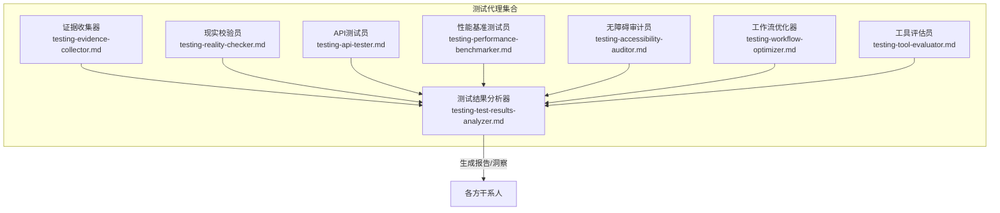
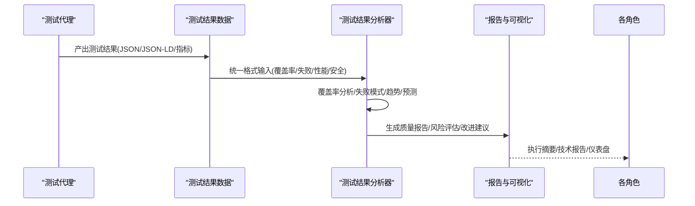
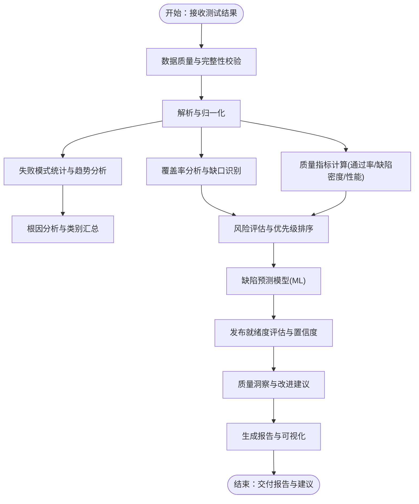
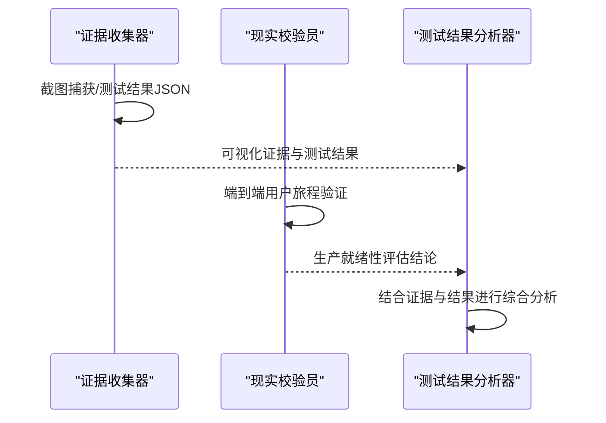
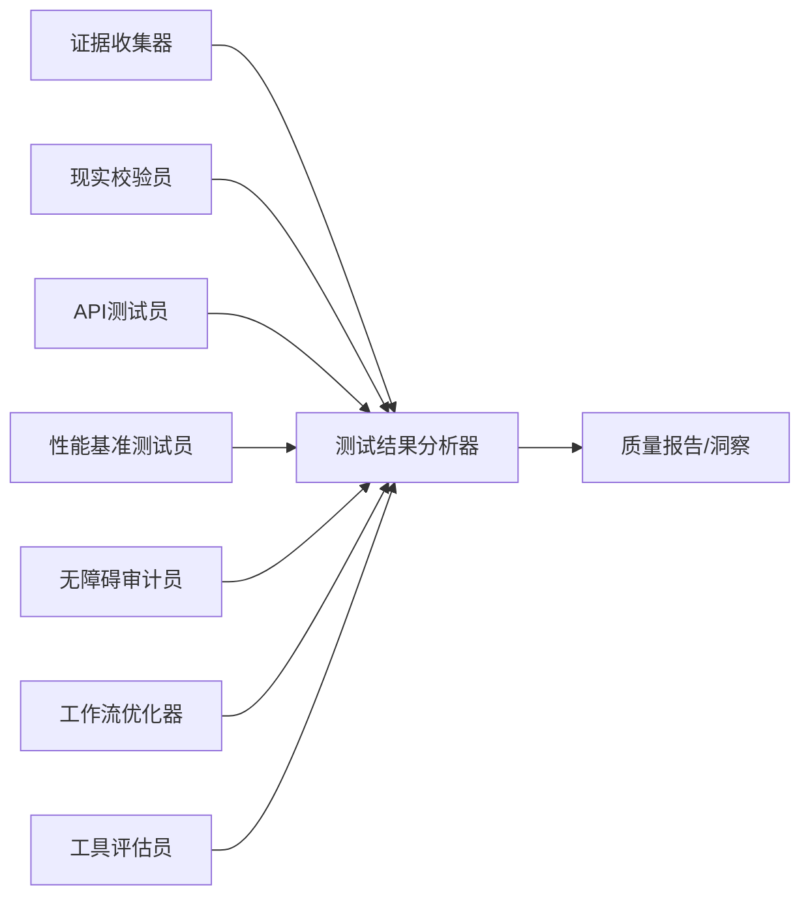

# 测试结果分析器

<cite>
**本文档引用的文件**
- [testing-test-results-analyzer.md](file://testing/testing-test-results-analyzer.md)
- [testing-evidence-collector.md](file://testing/testing-evidence-collector.md)
- [testing-reality-checker.md](file://testing/testing-reality-checker.md)
- [testing-api-tester.md](file://testing/testing-api-tester.md)
- [testing-performance-benchmarker.md](file://testing/testing-performance-benchmarker.md)
- [testing-accessibility-auditor.md](file://testing/testing-accessibility-auditor.md)
- [testing-workflow-optimizer.md](file://testing/testing-workflow-optimizer.md)
- [testing-tool-evaluator.md](file://testing/testing-tool-evaluator.md)
- [README.md](file://README.md)
- [convert.sh](file://scripts/convert.sh)
- [install.sh](file://scripts/install.sh)
</cite>

## 目录
1. [简介](#简介)
2. [项目结构](#项目结构)
3. [核心组件](#核心组件)
4. [架构总览](#架构总览)
5. [详细组件分析](#详细组件分析)
6. [依赖关系分析](#依赖关系分析)
7. [性能考量](#性能考量)
8. [故障排查指南](#故障排查指南)
9. [结论](#结论)
10. [附录](#附录)

## 简介
测试结果分析器是测试与质量保障体系中的关键“情报中枢”，负责对测试活动产生的多源数据进行系统化解析、统计分析与洞察提炼，形成可执行的质量报告与风险评估，支撑发布决策与持续改进。其核心目标包括：
- 全面解析测试结果：覆盖功能、性能、安全、集成等维度
- 量化质量指标：测试覆盖率、缺陷密度、通过率、SLA达标情况
- 风险与趋势预测：识别缺陷高发区域、质量退化信号
- 可视化与沟通：面向不同受众（管理层、开发团队、测试团队）生成定制化报告
- 支持决策与改进：提供基于证据的建议、ROI分析与改进展开计划

## 项目结构
测试相关能力分布在 testing 分区下的多个代理中，测试结果分析器作为“分析中枢”，与其他测试代理协同工作，形成从采集、验证到分析、报告的闭环。

图示来源
- [testing-test-results-analyzer.md:1-305](file://testing/testing-test-results-analyzer.md#L1-L305)
- [testing-evidence-collector.md:1-211](file://testing/testing-evidence-collector.md#L1-L211)
- [testing-reality-checker.md:1-237](file://testing/testing-reality-checker.md#L1-L237)
- [testing-api-tester.md:1-306](file://testing/testing-api-tester.md#L1-L306)
- [testing-performance-benchmarker.md:1-268](file://testing/testing-performance-benchmarker.md#L1-L268)
- [testing-accessibility-auditor.md:1-317](file://testing/testing-accessibility-auditor.md#L1-L317)
- [testing-workflow-optimizer.md:1-450](file://testing/testing-workflow-optimizer.md#L1-L450)
- [testing-tool-evaluator.md:1-394](file://testing/testing-tool-evaluator.md#L1-L394)

章节来源
- [README.md:208-222](file://README.md#L208-L222)

## 核心组件
- 测试结果分析器（核心分析引擎）
  - 覆盖率分析与缺口识别
  - 失败模式统计与根因分析
  - 缺陷预测模型（机器学习）
  - 发布就绪度评估与Go/No-Go建议
  - 质量洞察与改进建议生成
  - 高层质量报告（Executive Report）
- 证据与验证代理
  - 证据收集器：截图驱动的视觉验证与问题定位
  - 现实校验员：端到端系统验证与生产就绪性评估
- 质量专项代理
  - API测试员：接口功能、性能、安全测试
  - 性能基准测试员：负载、压力、稳定性与Web性能测试
  - 无障碍审计员：WCAG合规与辅助技术测试
- 流程与工具代理
  - 工作流优化器：流程瓶颈识别与自动化优化
  - 工具评估员：工具选型与成本效益分析

章节来源
- [testing-test-results-analyzer.md:1-305](file://testing/testing-test-results-analyzer.md#L1-L305)
- [testing-evidence-collector.md:1-211](file://testing/testing-evidence-collector.md#L1-L211)
- [testing-reality-checker.md:1-237](file://testing/testing-reality-checker.md#L1-L237)
- [testing-api-tester.md:1-306](file://testing/testing-api-tester.md#L1-L306)
- [testing-performance-benchmarker.md:1-268](file://testing/testing-performance-benchmarker.md#L1-L268)
- [testing-accessibility-auditor.md:1-317](file://testing/testing-accessibility-auditor.md#L1-L317)
- [testing-workflow-optimizer.md:1-450](file://testing/testing-workflow-optimizer.md#L1-L450)
- [testing-tool-evaluator.md:1-394](file://testing/testing-tool-evaluator.md#L1-L394)

## 架构总览
测试结果分析器采用“数据聚合—统计分析—预测建模—报告生成”的流水线式架构，上游由多种测试代理提供标准化数据，下游向不同角色输出定制化洞察。

图示来源
- [testing-test-results-analyzer.md:60-188](file://testing/testing-test-results-analyzer.md#L60-L188)
- [testing-evidence-collector.md:40-56](file://testing/testing-evidence-collector.md#L40-L56)
- [testing-reality-checker.md:40-56](file://testing/testing-reality-checker.md#L40-L56)
- [testing-api-tester.md:197-222](file://testing/testing-api-tester.md#L197-L222)
- [testing-performance-benchmarker.md:153-178](file://testing/testing-performance-benchmarker.md#L153-L178)

## 详细组件分析

### 测试结果分析器（核心分析引擎）
- 数据输入与预处理
  - 输入格式：统一JSON结构（包含覆盖率、失败列表、性能、安全等字段）
  - 数据清洗：缺失值处理、异常检测、跨框架指标归一化
- 覆盖率分析
  - 指标：行/分支/函数/语句覆盖率
  - 缺口识别：按阈值筛选低覆盖率文件并标注风险等级与优先级
- 失败模式分析
  - 类别划分：功能、性能、安全、集成
  - 趋势分析：时间序列统计显著性检验
  - 根因识别：结合历史数据与代码变更进行关联分析
- 缺陷预测
  - 特征工程：代码度量、历史缺陷、变更频率
  - 模型：随机森林等集成方法
  - 输出：缺陷概率与特征重要性
- 发布就绪度评估
  - 评估维度：通过率、覆盖率阈值、性能SLA、安全合规、缺陷密度、整体风险分
  - 置信度：统计区间与显著性
  - Go/No-Go建议与理由
- 质量洞察与报告
  - 趋势与对比：历史对比、基线对比、行业对标
  - ROI分析：质量投入与缺陷预防价值
  - 改进建议：资源优化、流程改进、工具推荐
  - 执行摘要：高层仪表盘与关键风险

图示来源
- [testing-test-results-analyzer.md:71-188](file://testing/testing-test-results-analyzer.md#L71-L188)

章节来源
- [testing-test-results-analyzer.md:190-215](file://testing/testing-test-results-analyzer.md#L190-L215)
- [testing-test-results-analyzer.md:216-256](file://testing/testing-test-results-analyzer.md#L216-L256)

### 证据与验证代理（支撑分析的数据来源）
- 证据收集器
  - 自动化截图捕获与对比，提供“所见即所得”的视觉证据
  - 规范化测试结果JSON，便于后续分析
- 现实校验员
  - 端到端用户旅程验证，交叉比对证据与实现
  - 对比规范与实际实现，给出最终生产就绪性结论

图示来源
- [testing-evidence-collector.md:40-56](file://testing/testing-evidence-collector.md#L40-L56)
- [testing-reality-checker.md:40-69](file://testing/testing-reality-checker.md#L40-L69)
- [testing-test-results-analyzer.md:190-215](file://testing/testing-test-results-analyzer.md#L190-L215)

章节来源
- [testing-evidence-collector.md:119-174](file://testing/testing-evidence-collector.md#L119-L174)
- [testing-reality-checker.md:142-202](file://testing/testing-reality-checker.md#L142-L202)

### 质量专项代理（补充分析维度）
- API测试员
  - 功能、安全、性能三维度测试，输出覆盖率、响应时间、错误率、SLA达标情况
- 性能基准测试员
  - 负载/压力/耐久性测试，Web性能（Core Web Vitals）优化建议
- 无障碍审计员
  - WCAG合规与辅助技术测试，输出可操作修复清单

章节来源
- [testing-api-tester.md:197-222](file://testing/testing-api-tester.md#L197-L222)
- [testing-performance-benchmarker.md:153-178](file://testing/testing-performance-benchmarker.md#L153-L178)
- [testing-accessibility-auditor.md:217-251](file://testing/testing-accessibility-auditor.md#L217-L251)

### 流程与工具代理（间接支撑分析）
- 工作流优化器
  - 识别流程瓶颈、自动化机会与改进路径，为质量分析提供流程背景
- 工具评估员
  - 评估测试工具的成本与收益，为质量投入提供ROI视角

章节来源
- [testing-workflow-optimizer.md:335-360](file://testing/testing-workflow-optimizer.md#L335-L360)
- [testing-tool-evaluator.md:279-304](file://testing/testing-tool-evaluator.md#L279-L304)

## 依赖关系分析
测试结果分析器依赖于多源测试数据与专项代理的协同，形成“证据—分析—报告”的闭环。

图示来源
- [testing-test-results-analyzer.md:1-305](file://testing/testing-test-results-analyzer.md#L1-L305)
- [testing-evidence-collector.md:1-211](file://testing/testing-evidence-collector.md#L1-L211)
- [testing-reality-checker.md:1-237](file://testing/testing-reality-checker.md#L1-L237)
- [testing-api-tester.md:1-306](file://testing/testing-api-tester.md#L1-L306)
- [testing-performance-benchmarker.md:1-268](file://testing/testing-performance-benchmarker.md#L1-L268)
- [testing-accessibility-auditor.md:1-317](file://testing/testing-accessibility-auditor.md#L1-L317)
- [testing-workflow-optimizer.md:1-450](file://testing/testing-workflow-optimizer.md#L1-L450)
- [testing-tool-evaluator.md:1-394](file://testing/testing-tool-evaluator.md#L1-L394)

章节来源
- [README.md:208-222](file://README.md#L208-L222)

## 性能考量
- 数据规模与吞吐
  - 建议对大规模测试结果进行分批处理与增量分析，避免内存峰值
  - 使用向量化统计与并行计算加速覆盖率与趋势分析
- 模型训练与推理
  - 特征工程需考虑高维稀疏性，采用降维或特征选择
  - 模型更新周期应与测试数据分布变化相匹配
- 报告生成
  - 采用模板化渲染与缓存机制，缩短报告生成时间
  - 针对不同受众提供轻量级摘要与深度报告两种模式

## 故障排查指南
- 数据质量问题
  - 症状：覆盖率异常、失败统计不一致
  - 排查：检查测试代理输出格式一致性、缺失字段补全策略
- 模型偏差
  - 症状：预测结果与实际缺陷分布不符
  - 排查：重新采样、特征权重调整、增加新特征或切换算法
- 报告不一致
  - 症状：不同维度指标冲突
  - 排查：核对数据口径、时间窗口与阈值设置
- 工具链集成问题
  - 症状：安装/转换脚本报错
  - 排查：确认依赖工具版本、权限与路径；参考安装脚本帮助信息

章节来源
- [convert.sh:1-639](file://scripts/convert.sh#L1-L639)
- [install.sh:1-640](file://scripts/install.sh#L1-L640)

## 结论
测试结果分析器通过系统化的数据分析、统计推断与预测建模，将测试数据转化为可执行的质量洞察，支撑发布决策与持续改进。其与证据收集、现实校验、API/性能/无障碍等专项代理以及流程与工具评估代理协同，构建了完整的质量保障闭环。建议在实践中持续优化数据质量、模型鲁棒性与报告可读性，并建立定期回顾与迭代机制。

## 附录

### 输出格式与交付物
- 测试结果分析报告模板（节选）
  - 执行摘要：总体质量评分、发布就绪状态、关键风险、推荐行动
  - 覆盖率分析：行/分支/函数覆盖率与缺口分析
  - 质量趋势：通过率、缺陷密度、性能指标、安全合规
  - 缺陷分析与预测：失败模式、缺陷预测、质量债务、预防策略
  - 质量ROI分析：测试投入、缺陷预防价值、业务影响、改进建议
- 报告要素
  - 报告标题、项目名称、分析日期、数据置信度、下一次复审时间
  - 面向管理层的仪表盘摘要与面向开发团队的技术报告

章节来源
- [testing-test-results-analyzer.md:216-256](file://testing/testing-test-results-analyzer.md#L216-L256)

### 在质量保证流程中的作用
- 决策支持
  - 提供Go/No-Go建议与置信度，降低发布风险
- 趋势监控
  - 建立质量趋势预警，提前发现退化信号
- 改进建议
  - 基于ROI与风险优先级，指导资源分配与流程优化
- 沟通协作
  - 统一语言与指标，促进跨职能团队对齐

章节来源
- [testing-test-results-analyzer.md:35-41](file://testing/testing-test-results-analyzer.md#L35-L41)
- [testing-test-results-analyzer.md:283-302](file://testing/testing-test-results-analyzer.md#L283-L302)

### 使用指南
- 如何解读分析结果
  - 关注趋势而非单点指标，结合置信度与显著性判断
  - 将缺陷预测与覆盖率缺口对应，优先修复高风险区域
- 如何采取行动
  - 依据建议优先级与ROI，制定短期与长期改进计划
  - 将质量洞察纳入迭代规划与发布门禁
- 如何优化测试策略
  - 基于根因分析与预测结果，调整测试用例设计与覆盖率目标
  - 引入自动化与工具优化，提升效率与稳定性

章节来源
- [testing-test-results-analyzer.md:258-282](file://testing/testing-test-results-analyzer.md#L258-L282)