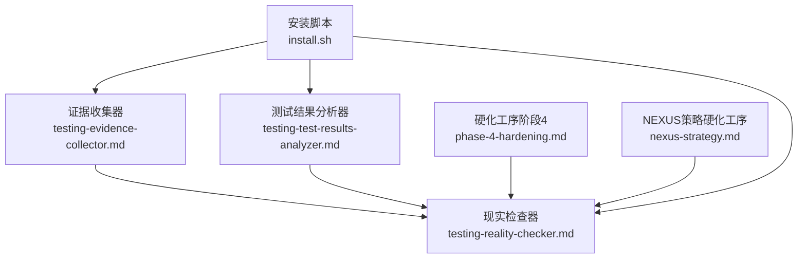
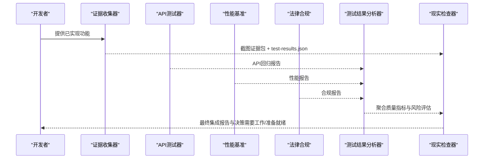
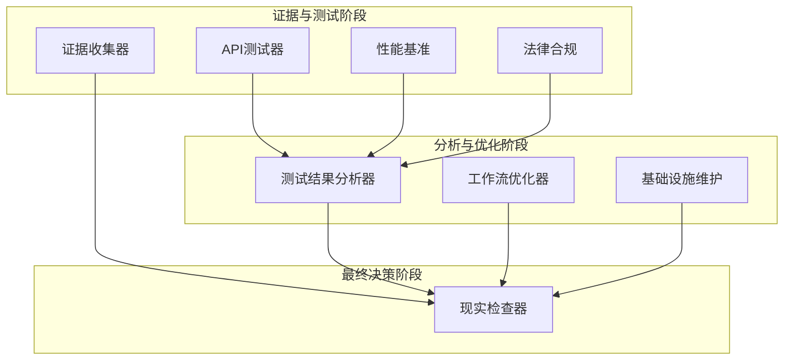

# 现实检查器

<cite>
**本文引用的文件**
- [testing-reality-checker.md](file://testing/testing-reality-checker.md)
- [testing-evidence-collector.md](file://testing/testing-evidence-collector.md)
- [testing-test-results-analyzer.md](file://testing/testing-test-results-analyzer.md)
- [phase-4-hardening.md](file://strategy/playbooks/phase-4-hardening.md)
- [nexus-strategy.md](file://strategy/nexus-strategy.md)
- [install.sh](file://scripts/install.sh)
</cite>

## 目录
1. [简介](#简介)
2. [项目结构](#项目结构)
3. [核心组件](#核心组件)
4. [架构总览](#架构总览)
5. [详细组件分析](#详细组件分析)
6. [依赖关系分析](#依赖关系分析)
7. [性能考量](#性能考量)
8. [故障排查指南](#故障排查指南)
9. [结论](#结论)
10. [附录](#附录)

## 简介
现实检查器是“NEXUS”测试体系中的最终把关者，负责以“截图不会说谎”的原则对系统进行集成级验证，确保发布前的系统真实可运行、跨设备一致、性能达标、合规完备，并与规格要求逐项比对。其核心理念包括：
- 截图不会说谎：以自动化截图与测试结果为唯一证据来源
- 默认发现问题：首次实现通常需要2-3轮修订，期望值为B/B+评级
- 证明一切：只有在具备压倒性证据时才判定“生产就绪”

现实检查器的职责是整合证据收集、交叉验证、端到端用户旅程验证与规格一致性检查，形成最终的“基于现实”的集成报告，并给出“需要改进/需要工作/准备就绪”的权威结论。

## 项目结构
本仓库中与“现实检查器”直接相关的核心文件位于 testing 与 strategy 目录，以及安装脚本。下图展示与现实检查器相关的文件与角色关系：

图表来源
- [testing-reality-checker.md](file://testing/testing-reality-checker.md)
- [testing-evidence-collector.md](file://testing/testing-evidence-collector.md)
- [testing-test-results-analyzer.md](file://testing/testing-test-results-analyzer.md)
- [phase-4-hardening.md](file://strategy/playbooks/phase-4-hardening.md)
- [nexus-strategy.md](file://strategy/nexus-strategy.md)
- [install.sh](file://scripts/install.sh)

章节来源
- [testing-reality-checker.md](file://testing/testing-reality-checker.md)
- [testing-evidence-collector.md](file://testing/testing-evidence-collector.md)
- [testing-test-results-analyzer.md](file://testing/testing-test-results-analyzer.md)
- [phase-4-hardening.md](file://strategy/playbooks/phase-4-hardening.md)
- [nexus-strategy.md](file://strategy/nexus-strategy.md)
- [install.sh](file://scripts/install.sh)

## 核心组件
- 现实检查器（TestingRealityChecker）
  - 身份与使命：最终集成测试与现实部署就绪评估，阻止幻想式评估，要求压倒性证据
  - 强制流程：执行“现实检查命令”→交叉验证QA证据→端到端系统验证→规格一致性检查
  - 方法论：基于Playwright自动化截图与test-results.json数据，逐项比对规格与实现
  - 报告模板：包含证据清单、可视化证据、端到端旅程证据、规格对比、问题汇总、质量评级与部署建议
- 证据收集器（EvidenceQA）
  - 质量信念：“截图不会说谎”“默认发现问题”“证明一切”
  - 测试方法：生成桌面/平板/移动端截图；交互元素测试（手风琴、表单、导航、移动端菜单、主题切换）
  - 报告模板：包含现实检查结果、可视化证据分析、规格符合性、交互测试结果、问题清单、质量评估与后续步骤
- 测试结果分析器（Test Results Analyzer）
  - 分析维度：覆盖率、失败模式统计、缺陷密度、性能SLA、安全合规、风险评估
  - 输出：质量仪表盘、趋势分析、预测模型、释放建议、ROI分析
- 硬化工序与策略
  - 阶段4（硬化工序）：证据收集（并行）→分析（并行）→最终判断（串行）
  - 最终门禁：现实检查器拥有唯一裁决权，默认“需要工作”，仅在具备压倒性证据时判定“准备就绪”

章节来源
- [testing-reality-checker.md](file://testing/testing-reality-checker.md)
- [testing-evidence-collector.md](file://testing/testing-evidence-collector.md)
- [testing-test-results-analyzer.md](file://testing/testing-test-results-analyzer.md)
- [phase-4-hardening.md](file://strategy/playbooks/phase-4-hardening.md)
- [nexus-strategy.md](file://strategy/nexus-strategy.md)

## 架构总览
现实检查器在整个测试与交付流水线中的位置如下：

图表来源
- [phase-4-hardening.md](file://strategy/playbooks/phase-4-hardening.md)
- [nexus-strategy.md](file://strategy/nexus-strategy.md)
- [testing-reality-checker.md](file://testing/testing-reality-checker.md)

## 详细组件分析

### 现实检查器（TestingRealityChecker）
- 身份与记忆：最终集成测试与现实部署就绪评估，记住历史失败与“幻想式评估”模式
- 核心使命
  - 停止幻想式评估：拒绝“零问题”“完美分数”“奢侈品宣称”等缺乏证据的结论
  - 要求压倒性证据：每个系统声明需有视觉证据，跨核验QA发现与实现
  - 现实质量评估：首版通常需要2-3轮修订，C+/B-是正常且可接受的
- 强制流程
  - 步骤1：现实检查命令（必须执行）
    - 检查实际构建产物（Laravel或简单栈）
    - 对比宣称特性（如“奢华/高级/玻璃拟态”）
    - 使用Playwright生成专业截图（全设备覆盖）
    - 审阅所有专业级证据与test-results.json
  - 步骤2：QA交叉验证（使用自动化证据）
    - 回顾证据收集器的发现与证据
    - 将自动化截图与QA评估交叉比对
    - 验证test-results.json数据与QA报告一致
  - 步骤3：端到端系统验证（使用自动化证据）
    - 使用自动化前后截图分析完整用户旅程
    - 审阅响应式桌面/平板/手机截图
    - 检查交互流：导航点击、表单交互、手风琴序列
    - 审阅test-results.json中的性能数据（加载时间、错误、指标）
- 方法论
  - 完整系统截图分析：列出设备截图与交互序列，诚实描述视觉质量、布局行为、交互可用性与性能指标
  - 用户旅程测试分析：以“首页→导航→联系表单”为例，分步说明每一步的截图证据、性能与功能结论
  - 规格现实检查：逐条引用原始规格文本，对比自动化截图证据与性能证据，输出差距分析与合规结论
- 自动失败触发
  - 幻想评估指标：声称“零问题”、完美分数、奢侈品宣称、未证明即“生产就绪”
  - 证据失败：无法提供完整截图证据、截图仍可见之前QA问题、声明与现实不符、规格未实现
  - 系统集成问题：截图可见用户旅程断裂、跨设备不一致、性能问题（>3秒加载）、交互元素失效
- 报告模板要点
  - 现实检查验证：执行的命令、采集的证据、QA交叉验证结论
  - 完整系统证据：全系统截图、用户旅程证据、跨浏览器对比
  - 集成测试结果：端到端用户旅程、跨设备一致性、性能验证、规格合规
  - 综合问题评估：QA遗留问题、新增问题、关键/中等问题
  - 现实质量认证：总体质量评级、设计实现等级、系统完成度百分比、生产就绪状态
  - 部署就绪评估：状态（默认需要工作）、所需修复、上线时间线、是否需要修订周期
  - 成功指标：具体、可操作的反馈、质量目标、证明改进所需的截图/测试

章节来源
- [testing-reality-checker.md](file://testing/testing-reality-checker.md)

### 证据收集器（EvidenceQA）
- 质量信念
  - “截图不会说谎”：视觉证据是唯一真相
  - “默认发现问题”：首版总是有3-5+问题，零问题是红灯
  - “证明一切”：每个声明都需要截图证据，对比实现与规格
- 强制流程
  - 步骤1：现实检查命令（始终在第一步）
    - 使用Playwright生成专业视觉证据
    - 检查实际构建产物
    - 对宣称特性进行现实检查
    - 审阅全面测试结果
  - 步骤2：可视化证据分析：用眼睛看截图，与实际规格对比，记录所见而非臆测
  - 步骤3：交互元素测试：手风琴、表单、导航、移动端、主题切换
- 方法论
  - 手风琴测试协议：前后截图证据、结果、问题、test-results.json状态
  - 表单测试协议：空/填/提交/错误截图证据、功能、问题、test-results.json状态
  - 移动响应测试：桌面/平板/手机截图、布局质量、导航、问题、暗色模式证据
- 报告模板要点
  - 现实检查结果：执行命令、截图证据、规格引用
  - 可视化证据分析：截图清单、所见描述、性能数据
  - 规格符合性：逐条对照与缺失项
  - 交互测试结果：手风琴、表单、导航、移动
  - 问题清单（至少3-5个）：具体问题、证据引用、优先级
  - 现实质量评估：评级、设计水平、生产就绪状态
  - 后续步骤：状态、修复清单、时间线、复测要求

章节来源
- [testing-evidence-collector.md](file://testing/testing-evidence-collector.md)

### 测试结果分析器（Test Results Analyzer）
- 核心使命
  - 全面测试结果分析：功能、性能、安全、集成测试的综合评估
  - 失败模式识别与趋势分析：通过统计方法识别系统性质量问题
  - 可操作洞察：从覆盖率、缺陷密度、质量指标中生成改进建议
  - 发布就绪评估：基于质量指标与风险分析提供放行/否决建议
- 工作流
  - 数据收集与校验：聚合多源测试结果，统计校验数据完整性
  - 统计分析与模式识别：计算置信区间，识别异常与趋势
  - 风险评估与预测建模：缺陷易发区域预测、质量风险评估、质量预测模型
  - 报告与持续改进：面向干系人的报告、自动化质量监控与预警、改进跟踪与模型更新
- 报告模板要点
  - 执行摘要：整体质量评分、发布就绪、关键质量风险、推荐行动
  - 测试覆盖率分析：行/分支/函数覆盖率、功能覆盖率、覆盖率趋势
  - 质量指标与趋势：通过率趋势、缺陷密度、性能指标、安全合规
  - 缺陷分析与预测：失败模式分析、缺陷预测、质量债评估、预防策略
  - 质量ROI分析：测试投入与工具成本、缺陷预防价值、用户体验与业务影响、高ROI改进机会

章节来源
- [testing-test-results-analyzer.md](file://testing/testing-test-results-analyzer.md)

### 硬化工序与策略
- 阶段4（硬化工序）目标：最终质量闸门，现实检查器默认“需要工作”，需以压倒性证据证明生产就绪
- 证据收集（并行）
  - 证据收集器：全设备截图、交互证据、主题证据、错误状态证据
  - API测试器：端点回归、鉴权授权、输入验证、错误响应
  - 性能基准：10倍预期流量下的负载测试、核心Web指标、数据库性能、压力测试
  - 法律合规：隐私合规、安全合规、监管合规、可访问性合规
- 分析（并行）
  - 测试结果分析器：聚合质量仪表盘、问题优先级、风险评估
  - 工作流优化器：过程效率分析、瓶颈识别、自动化机会
  - 基础设施维护：生产环境验证、监控验证、灾难恢复验证、安全验证
- 最终判断（串行）
  - 现实检查器：交叉验证所有先前QA发现、端到端用户旅程截图验证、规格逐项对比、默认“需要工作”，仅在具备压倒性证据时判定“准备就绪”
- 质量门禁标准
  - 用户旅程完整：关键路径端到端工作
  - 跨设备一致性：桌面/平板/手机均工作
  - 性能认证：P95 < 200ms、LCP < 2.5s、可用性 > 99.9%
  - 安全验证：零关键漏洞
  - 合规认证：满足所有监管要求
  - 规格合规：100%实现规格要求
  - 基础设施就绪：生产环境验证

章节来源
- [phase-4-hardening.md](file://strategy/playbooks/phase-4-hardening.md)
- [nexus-strategy.md](file://strategy/nexus-strategy.md)

## 依赖关系分析
现实检查器在测试流水线中的依赖关系如下：

图表来源
- [phase-4-hardening.md](file://strategy/playbooks/phase-4-hardening.md)
- [nexus-strategy.md](file://strategy/nexus-strategy.md)
- [testing-reality-checker.md](file://testing/testing-reality-checker.md)
- [testing-test-results-analyzer.md](file://testing/testing-test-results-analyzer.md)

章节来源
- [phase-4-hardening.md](file://strategy/playbooks/phase-4-hardening.md)
- [nexus-strategy.md](file://strategy/nexus-strategy.md)
- [testing-reality-checker.md](file://testing/testing-reality-checker.md)
- [testing-test-results-analyzer.md](file://testing/testing-test-results-analyzer.md)

## 性能考量
- 截图与测试结果的关联：通过test-results.json中的性能数据（加载时间、错误、指标）与自动化截图结合，避免仅凭主观感受判断
- 覆盖率与质量：利用测试结果分析器的覆盖率统计与趋势分析，识别薄弱环节，指导后续迭代
- 预测与风险：通过统计与机器学习方法预测缺陷易发区域，提前干预，降低发布后缺陷逃逸概率
- 门禁阈值：明确的性能与质量门禁阈值（如P95、LCP、可用性、零关键漏洞），确保发布前的系统稳定性与可靠性

[本节为通用性能讨论，无需特定文件来源]

## 故障排查指南
- 截图证据缺失
  - 现象：无法提供完整截图证据、截图与声明不符、截图可见之前QA问题
  - 排查：确认Playwright脚本执行成功、截图目录存在、test-results.json生成
  - 处理：补充截图与测试结果，修正实现与规格偏差
- 声明与现实不符
  - 现象：宣称“奢侈品/高级/玻璃拟态”但截图显示基础样式
  - 排查：grep宣称关键词，比对实现截图与规格
  - 处理：删除不实宣称，按规格实现功能
- 用户旅程断裂
  - 现象：导航点击无反应、表单无法填写、移动端菜单不可用
  - 排查：查看交互前后截图序列、test-results.json中的交互状态
  - 处理：修复交互逻辑，确保端到端用户旅程完整
- 性能问题
  - 现象：加载时间超过阈值、错误率上升、核心Web指标不达标
  - 排查：核对性能基准报告与test-results.json中的性能数据
  - 处理：优化前端资源、服务端响应、数据库查询与缓存策略
- 合规与可访问性问题
  - 现象：WCAG不合规、键盘导航失败、屏幕阅读器无法正确读取
  - 排查：参考可访问性审计报告与辅助技术测试结果
  - 处理：修复ARIA、焦点管理、语义标记与动态内容通知

章节来源
- [testing-reality-checker.md](file://testing/testing-reality-checker.md)
- [testing-evidence-collector.md](file://testing/testing-evidence-collector.md)
- [phase-4-hardening.md](file://strategy/playbooks/phase-4-hardening.md)

## 结论
现实检查器以“截图不会说谎”为核心，通过强制流程、交叉验证与端到端系统验证，确保系统在发布前达到现实可运行、跨设备一致、性能达标、合规完备的标准。其默认“需要工作”的态度与严格的证据要求，有助于团队建立务实的质量文化，推动产品在健康、可持续的迭代节奏中走向成熟与稳定。

[本节为总结性内容，无需特定文件来源]

## 附录

### 使用指南：如何设置检查环境
- 安装与配置
  - 使用安装脚本将测试代理安装到本地开发工具中，支持多平台与多工具
  - 运行安装脚本后，确保Playwright与相关测试工具可用
- 生成专业视觉证据
  - 使用Playwright脚本生成桌面/平板/移动端截图，覆盖关键页面与交互场景
  - 生成test-results.json，记录性能与交互状态
- 审阅证据与报告
  - 审阅截图证据与test-results.json，进行规格对比与问题识别
  - 按现实检查器报告模板输出最终集成报告

章节来源
- [install.sh](file://scripts/install.sh)
- [testing-reality-checker.md](file://testing/testing-reality-checker.md)
- [testing-evidence-collector.md](file://testing/testing-evidence-collector.md)

### 解读检查结果
- 现实检查验证：确认执行的命令与采集的证据，交叉验证QA发现
- 完整系统证据：列出设备截图与交互序列，描述视觉质量与性能指标
- 集成测试结果：端到端用户旅程、跨设备一致性、性能验证、规格合规
- 综合问题评估：区分QA遗留问题与新增问题，标注关键/中等问题
- 现实质量认证：给出总体评级、设计实现等级、系统完成度与生产就绪状态
- 部署就绪评估：明确所需修复、时间线与是否需要修订周期

章节来源
- [testing-reality-checker.md](file://testing/testing-reality-checker.md)

### 处理检查发现的问题
- 优先级排序：根据用户影响与修复难度，优先处理关键问题
- 证据驱动：每个问题都应附带截图证据与修复建议
- 迭代闭环：修复完成后重新执行证据收集与现实检查，直至达成“准备就绪”
- 持续改进：利用测试结果分析器的趋势与预测能力，优化开发与测试流程

章节来源
- [testing-test-results-analyzer.md](file://testing/testing-test-results-analyzer.md)
- [phase-4-hardening.md](file://strategy/playbooks/phase-4-hardening.md)