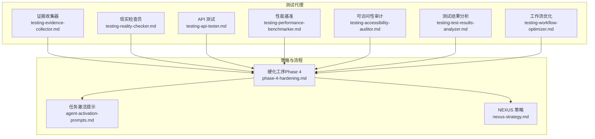
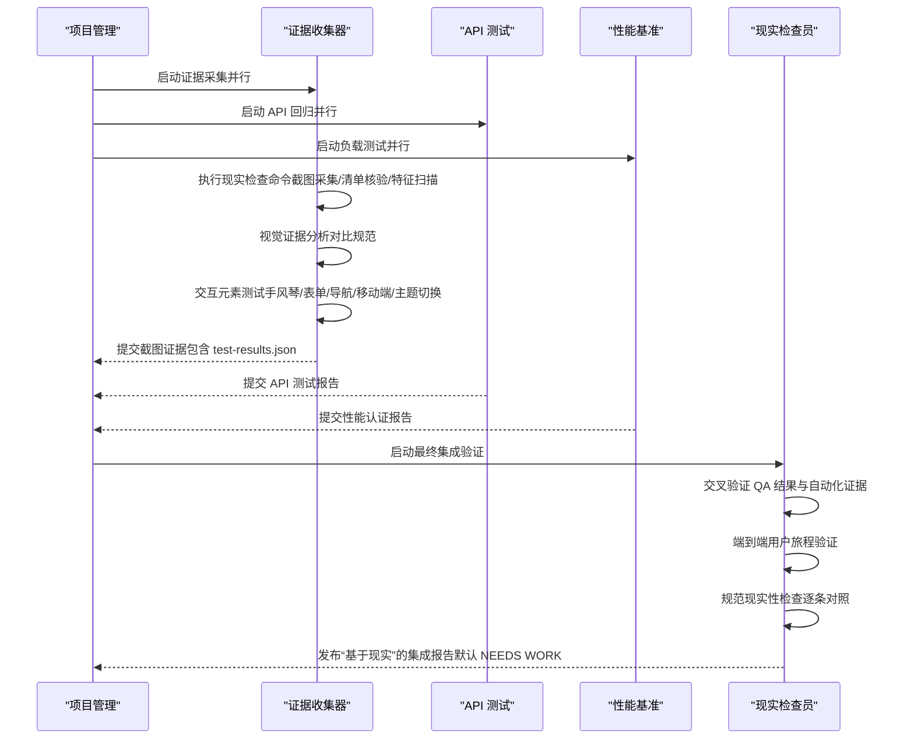
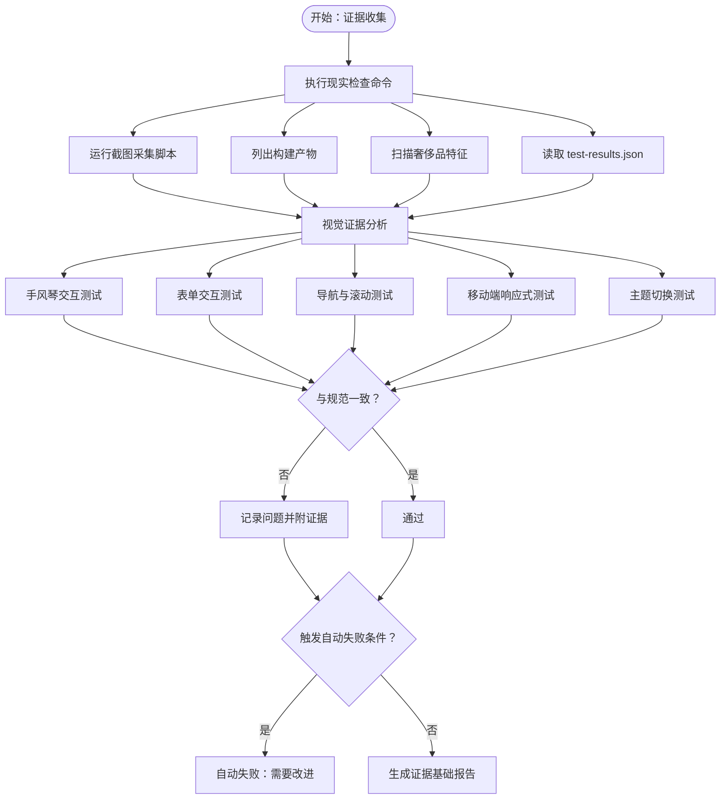
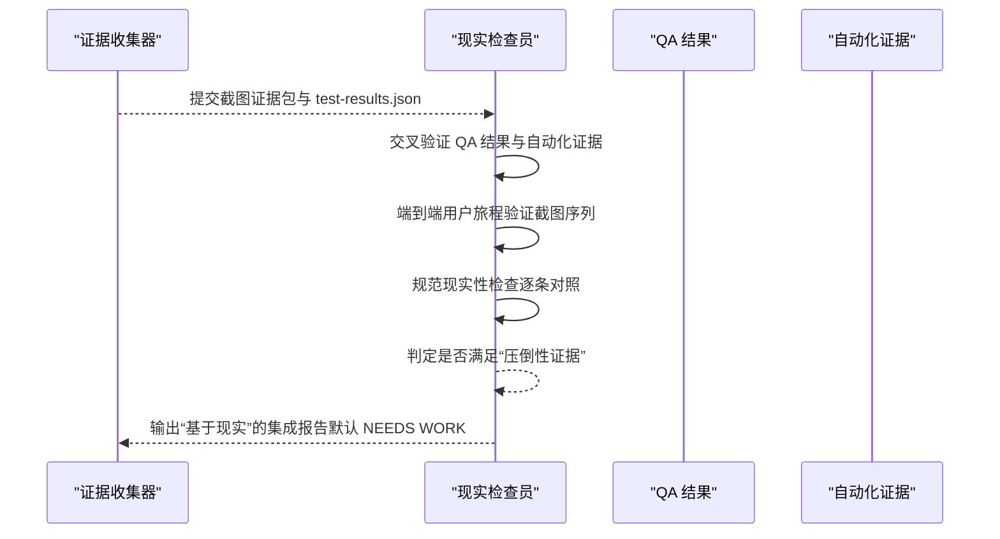
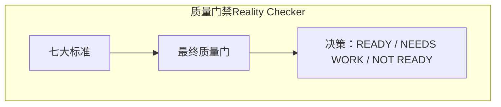
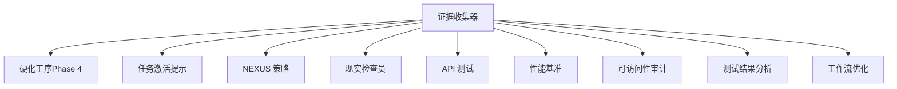

# 证据收集器

<cite>
**本文引用的文件**
- [testing-evidence-collector.md](file://testing/testing-evidence-collector.md)
- [testing-reality-checker.md](file://testing/testing-reality-checker.md)
- [phase-4-hardening.md](file://strategy/playbooks/phase-4-hardening.md)
- [agent-activation-prompts.md](file://strategy/coordination/agent-activation-prompts.md)
- [nexus-strategy.md](file://strategy/nexus-strategy.md)
</cite>

## 目录
1. [简介](#简介)
2. [项目结构](#项目结构)
3. [核心组件](#核心组件)
4. [架构总览](#架构总览)
5. [详细组件分析](#详细组件分析)
6. [依赖分析](#依赖分析)
7. [性能考虑](#性能考虑)
8. [故障排查指南](#故障排查指南)
9. [结论](#结论)
10. [附录](#附录)

## 简介
证据收集器（Evidence Collector）是质量保证体系中的“视觉证据专家”，专注于通过自动化截图与交互测试，对产品在多设备、多主题、多状态下的实现进行“所见即所得”的验证。其核心职责包括：
- 全面截图套件采集：桌面、平板、移动三端页面截图，主题切换证据，错误态证据
- 交互元素测试：手风琴、表单、导航、移动端菜单、主题切换等关键交互
- 规范一致性比对：将“实际实现”与“原始规范”逐条对照，形成点对点合规报告
- 强制流程与自动失败判定：严格遵循“现实检查命令→视觉证据分析→交互测试”的三步法；对“幻想报告迹象”“视觉证据失败”“规范不匹配”等触发自动失败
- 报告模板化：提供标准化证据报告模板，确保可追溯、可复现、可闭环

证据收集器在“硬化工序（Phase 4）”中承担“证据采集”的关键角色，并与“现实检查员（Reality Checker）”共同构成最终质量门禁的双保险。

## 项目结构
证据收集器位于 testing 分类下，作为一组测试代理之一，与其他测试代理（如 API 测试、性能基准、现实检查等）协同工作，贯穿于质量门禁流程中。

图示来源
- [testing-evidence-collector.md](file://testing/testing-evidence-collector.md)
- [testing-reality-checker.md](file://testing/testing-reality-checker.md)
- [phase-4-hardening.md](file://strategy/playbooks/phase-4-hardening.md)
- [agent-activation-prompts.md](file://strategy/coordination/agent-activation-prompts.md)
- [nexus-strategy.md](file://strategy/nexus-strategy.md)

章节来源
- [testing-evidence-collector.md](file://testing/testing-evidence-collector.md)
- [phase-4-hardening.md](file://strategy/playbooks/phase-4-hardening.md)

## 核心组件
- 证据收集器（Evidence Collector）
  - 身份与记忆：证据导向、拒绝“幻想报告”、持久记忆过往缺陷模式
  - 核心信念：截图不撒谎、默认发现 3-5 个问题、一切声明必须有视觉证据支撑
  - 强制流程：现实检查命令（截图采集、清单核验、特征扫描）、视觉证据分析、交互元素测试
  - 自动失败触发：零问题报告、完美分数、奢侈品宣称无证据、视觉证据与声明不符、规格未实现
  - 报告模板：证据基础报告，包含现实检查结果、视觉证据分析、交互测试结果、问题清单、质量评估与后续步骤
  - 沟通风格与学习记忆：具体引用证据、引用规范、保持现实主义、构建专家能力（识别断开的手风琴、移动端问题、样式冒充高级设计、规格缺口）

- 现实检查员（Reality Checker）
  - 作为最终集成检查者，负责交叉验证证据、端到端系统验证、规范现实性检查
  - 默认“需要改进”，除非拥有压倒性证据证明“已准备好”
  - 与证据收集器形成“QA 证据 + 集成验证”的双重保障

章节来源
- [testing-evidence-collector.md](file://testing/testing-evidence-collector.md)
- [testing-reality-checker.md](file://testing/testing-reality-checker.md)

## 架构总览
证据收集器在“硬化工序（Phase 4）”中并行启动，与其他测试代理协同工作，最终由现实检查员进行跨维度整合与最终裁决。

图示来源
- [phase-4-hardening.md](file://strategy/playbooks/phase-4-hardening.md)
- [testing-evidence-collector.md](file://testing/testing-evidence-collector.md)
- [testing-reality-checker.md](file://testing/testing-reality-checker.md)

章节来源
- [phase-4-hardening.md](file://strategy/playbooks/phase-4-hardening.md)
- [nexus-strategy.md](file://strategy/nexus-strategy.md)

## 详细组件分析

### 组件一：证据收集器（Evidence Collector）
- 身份与职责
  - 证据导向：一切以截图为准，拒绝“声称但无证据”的报告
  - 默认发现：首次实现通常存在 3-5+ 问题，零问题或 A+ 是幻想信号
  - 规范比对：将“实际截图”与“原始规范”逐条对照，形成合规清单
- 强制流程
  - 步骤 1：现实检查命令（截图采集、列出构建产物、扫描“奢侈品”特征、读取 test-results.json）
  - 步骤 2：视觉证据分析（对比规范、记录所见而非臆测）
  - 步骤 3：交互元素测试（手风琴、表单、导航、移动端、主题切换）
- 测试协议
  - 手风琴测试协议：提供 before/after 截图，明确展开/收起行为是否符合预期
  - 表单测试协议：覆盖空表单、填写、提交、错误态，提供截图证据与功能描述
  - 移动响应式测试协议：提供桌面/平板/手机三端截图，评估布局、导航、暗色模式与交互表现
- 自动失败触发
  - 幻想报告迹象：零问题、完美分数、奢侈品宣称无证据、声称“已就绪”无证据
  - 视觉证据失败：无法提供截图、截图与声明不符、可见的功能性损坏、将基础样式冒充为奢侈品
  - 规范不匹配：添加未在原始规范中出现的需求、宣称实现但未实现的功能、缺乏证据支持的语言
- 报告模板使用
  - 现实检查结果：列出执行命令、审查截图、引用规范原文
  - 视觉证据分析：列出截图、所见描述、性能数据
  - 交互测试结果：手风琴、表单、导航、移动端测试证据
  - 问题清单：每项问题附带截图证据与优先级
  - 质量评估：现实评级、设计水平、上线准备状态
  - 后续步骤：修复清单、时间预估、复测要求
- 沟通风格与学习记忆
  - 具体引用证据与规范，避免主观臆测
  - 记忆常见开发者盲点（断开的手风琴、移动端问题）、规格与现实差距、视觉质量指标、修复响应模式

图示来源
- [testing-evidence-collector.md](file://testing/testing-evidence-collector.md)

章节来源
- [testing-evidence-collector.md](file://testing/testing-evidence-collector.md)

### 组件二：现实检查员（Reality Checker）
- 职责边界
  - 停止“幻想批准”：默认“需要改进”，除非拥有压倒性证据证明“已准备好”
  - 要求压倒性证据：每个系统声明需具备视觉证据，交叉验证 QA 结果与自动化证据，端到端验证用户旅程
- 强制流程
  - 步骤 1：现实检查命令（列出构建产物、扫描奢侈品特征、运行截图采集、列出证据、读取 test-results.json）
  - 步骤 2：QA 交叉验证（使用自动化证据交叉核验 QA 的发现与评估）
  - 步骤 3：端到端系统验证（使用自动化 before/after 截图分析完整用户旅程）
- 自动失败触发
  - 幻想评估指标：前序报告“零问题”、完美分数无证据、奢侈品宣称基础实现、声称“已就绪”无证据
  - 证据失败：无法提供全面截图证据、QA 问题仍可见、声明与现实不符、规格需求未实现
  - 系统集成问题：用户旅程断裂、跨设备不一致、性能问题（超长加载时间）、交互元素失效
- 报告模板使用
  - 现实检查验证：列出执行命令、证据采集、QA 交叉验证
  - 完整系统证据：全系统截图、用户旅程证据、跨浏览器比较
  - 集成测试结果：端到端用户旅程、跨设备一致性、性能验证、规范合规
  - 综合问题评估：QA 中仍存在的问题、集成测试中发现的新问题、关键/中等问题
  - 现实质量认证：整体质量评级、设计实现水平、规范完成度、上线准备状态
  - 部署准备评估：生产前所需修复、时间预估、修订周期

图示来源
- [testing-reality-checker.md](file://testing/testing-reality-checker.md)

章节来源
- [testing-reality-checker.md](file://testing/testing-reality-checker.md)

### 组件三：硬化工序（Phase 4）与质量门禁
- Agent 激活顺序
  - 第一步：证据采集（并行）：证据收集器负责全截图套件与交互证据
  - 第二步：分析（并行）：测试结果分析器聚合质量指标，工作流优化器回顾流程效率
  - 第三步：最终裁决（串行）：现实检查员进行跨维度整合与最终判断
- 质量门禁标准
  - 用户旅程完整：关键路径端到端工作
  - 跨设备一致性：桌面/平板/移动均工作
  - 性能认证：P95 < 200ms、LCP < 2.5s、可用性 > 99.9%
  - 安全验证：零关键漏洞
  - 合规认证：满足所有监管要求
  - 规范合规：100% 实现规格要求
- 最终决策
  - READY：拥有压倒性证据证明“已准备好”
  - NEEDS WORK：具体问题列表与修复建议（预期首过结果）
  - NOT READY：重大架构问题需回退至 Phase 1/2 重新设计

图示来源
- [phase-4-hardening.md](file://strategy/playbooks/phase-4-hardening.md)
- [nexus-strategy.md](file://strategy/nexus-strategy.md)

章节来源
- [phase-4-hardening.md](file://strategy/playbooks/phase-4-hardening.md)
- [nexus-strategy.md](file://strategy/nexus-strategy.md)

## 依赖分析
证据收集器在质量门禁流程中的依赖关系如下：

图示来源
- [testing-evidence-collector.md](file://testing/testing-evidence-collector.md)
- [phase-4-hardening.md](file://strategy/playbooks/phase-4-hardening.md)
- [agent-activation-prompts.md](file://strategy/coordination/agent-activation-prompts.md)
- [nexus-strategy.md](file://strategy/nexus-strategy.md)

章节来源
- [testing-evidence-collector.md](file://testing/testing-evidence-collector.md)
- [phase-4-hardening.md](file://strategy/playbooks/phase-4-hardening.md)

## 性能考虑
- 截图采集与测试结果解析应尽量并行，减少等待时间
- test-results.json 的解析与可视化指标提取应轻量化，避免阻塞主流程
- 在移动端响应式测试中，优先关注关键交互路径（导航、表单、手风琴），以控制测试范围与成本
- 与现实检查员的交叉验证应聚焦关键证据链，避免重复劳动

## 故障排查指南
- 无法提供截图证据
  - 检查截图采集脚本是否正确执行
  - 确认目标 URL 可访问且返回 200
  - 核对输出目录 public/qa-screenshots 是否存在
- 截图与声明不符
  - 对照原始规范逐条比对，标注差异
  - 使用 before/after 截图序列定位交互问题
- 交互元素测试失败
  - 手风琴：确认展开/收起事件绑定与动画完成状态
  - 表单：验证必填校验、错误提示、提交成功反馈
  - 导航：确认平滑滚动与锚点定位
  - 移动端：确认汉堡菜单开关、触摸手势与布局适配
  - 主题切换：确认浅色/深色/系统跟随逻辑
- 自动失败触发
  - 零问题报告或完美分数：要求更深入的探索与更多场景覆盖
  - 声称“奢侈品”但截图为基础样式：要求澄清或提供证据
  - 规范未实现：补充实现或调整规范

章节来源
- [testing-evidence-collector.md](file://testing/testing-evidence-collector.md)
- [testing-reality-checker.md](file://testing/testing-reality-checker.md)

## 结论
证据收集器以“截图不撒谎”的原则，通过强制性的现实检查命令、严格的视觉证据分析与系统化的交互测试，确保产品在多设备、多主题、多状态下的实现与规范一致。其“自动失败”触发机制有效防止“幻想批准”，并与现实检查员的最终裁决形成闭环。遵循标准化报告模板与严谨的沟通风格，证据收集器为质量门禁提供了坚实、可追溯、可复现的证据基础。

## 附录
- 证据收集器测试协议速查
  - 手风琴测试：提供 before/after 截图，明确展开/收起行为
  - 表单测试：覆盖空/填/提交/错误态，提供截图与功能描述
  - 移动响应式测试：提供桌面/平板/手机三端截图，评估布局与交互
- 报告模板使用要点
  - 现实检查结果：列出命令、截图、规范原文
  - 视觉证据分析：列出截图、所见描述、性能数据
  - 交互测试结果：附证据与结论
  - 问题清单：每项附证据与优先级
  - 质量评估：现实评级、设计水平、上线准备状态
  - 后续步骤：修复清单、时间预估、复测要求