# 质量保证

<cite>
**本文引用的文件**
- [testing-evidence-collector.md](file://testing/testing-evidence-collector.md)
- [testing-reality-checker.md](file://testing/testing-reality-checker.md)
- [testing-performance-benchmarker.md](file://testing/testing-performance-benchmarker.md)
- [testing-api-tester.md](file://testing/testing-api-tester.md)
- [testing-tool-evaluator.md](file://testing/testing-tool-evaluator.md)
- [testing-workflow-optimizer.md](file://testing/testing-workflow-optimizer.md)
- [testing-accessibility-auditor.md](file://testing/testing-accessibility-auditor.md)
- [testing-test-results-analyzer.md](file://testing/testing-test-results-analyzer.md)
- [nexus-strategy.md](file://strategy/nexus-strategy.md)
- [phase-4-hardening.md](file://strategy/playbooks/phase-4-hardening.md)
- [README.md](file://README.md)
- [convert.sh](file://scripts/convert.sh)
- [install.sh](file://scripts/install.sh)
</cite>

## 目录
1. [简介](#简介)
2. [项目结构](#项目结构)
3. [核心组件](#核心组件)
4. [架构总览](#架构总览)
5. [详细组件分析](#详细组件分析)
6. [依赖关系分析](#依赖关系分析)
7. [性能考量](#性能考量)
8. [故障排查指南](#故障排查指南)
9. [结论](#结论)
10. [附录](#附录)

## 简介
本文件面向 agency-agents 的质量保证体系，系统化梳理测试代理（Evidence Collector、Reality Checker、Test Results Analyzer、Performance Benchmarker、API Tester、Tool Evaluator、Workflow Optimizer、Accessibility Auditor）的功能职责、验证流程与质量标准，并结合 NEXUS 运营模型中的质量门禁机制，给出可操作的质量策略、最佳实践与定制化建议。目标是帮助团队在不同阶段设置质量检查点、高效处理质量问题、确保交付成果符合预期。

## 项目结构
测试代理位于 testing 分类目录下，每个代理以独立的 Markdown 文件呈现其身份、使命、方法论、报告模板与成功指标。配合 NEXUS 操作手册，形成从发现、架构、基建、构建迭代到硬化的完整质量门禁链路。

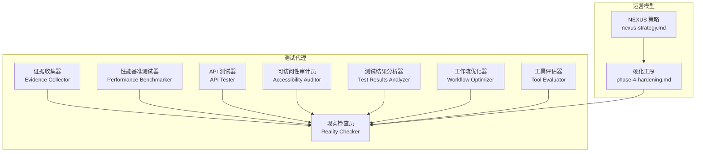

图示来源
- [testing-evidence-collector.md:1-211](file://testing/testing-evidence-collector.md#L1-L211)
- [testing-reality-checker.md:1-237](file://testing/testing-reality-checker.md#L1-L237)
- [testing-test-results-analyzer.md:1-305](file://testing/testing-test-results-analyzer.md#L1-L305)
- [testing-performance-benchmarker.md:1-268](file://testing/testing-performance-benchmarker.md#L1-L268)
- [testing-api-tester.md:1-306](file://testing/testing-api-tester.md#L1-L306)
- [testing-tool-evaluator.md:1-394](file://testing/testing-tool-evaluator.md#L1-L394)
- [testing-workflow-optimizer.md:1-450](file://testing/testing-workflow-optimizer.md#L1-L450)
- [testing-accessibility-auditor.md:1-317](file://testing/testing-accessibility-auditor.md#L1-L317)
- [nexus-strategy.md:378-436](file://strategy/nexus-strategy.md#L378-L436)
- [phase-4-hardening.md:1-293](file://strategy/playbooks/phase-4-hardening.md#L1-L293)

章节来源
- [README.md:208-222](file://README.md#L208-L222)

## 核心组件
- 证据收集器：以截图驱动的视觉验证，要求一切主张必须有图证；默认先找问题，要求对规范逐条比对。
- 现实检查员：最终集成测试与生产就绪评估，要求“需要改进”为默认状态，需有压倒性证据才可批准上线。
- 性能基准测试器：端到端性能测试与优化，建立性能基线、进行负载/压力/耐久性/扩展性评估，关注用户体验与 SLA。
- API 测试器：全量 API 功能、性能与安全测试，覆盖端点回归、错误处理、并发场景与安全控制。
- 工具评估器：技术选型与工具评估，量化功能、可用性、性能、安全、集成、支持与成本，提供 ROI 与 TCO 分析。
- 工作流优化器：流程映射、瓶颈识别与自动化改造，提供分阶段实施路线与量化收益。
- 可访问性审计员：WCAG 标准审计与辅助技术测试，键盘导航、屏幕阅读器、缩放与对比度等，强调手动验证。
- 测试结果分析器：聚合测试数据，统计分析失败模式与趋势，生成质量仪表盘与释放建议，支持预测建模。

章节来源
- [testing-evidence-collector.md:1-211](file://testing/testing-evidence-collector.md#L1-L211)
- [testing-reality-checker.md:1-237](file://testing/testing-reality-checker.md#L1-L237)
- [testing-performance-benchmarker.md:1-268](file://testing/testing-performance-benchmarker.md#L1-L268)
- [testing-api-tester.md:1-306](file://testing/testing-api-tester.md#L1-L306)
- [testing-tool-evaluator.md:1-394](file://testing/testing-tool-evaluator.md#L1-L394)
- [testing-workflow-optimizer.md:1-450](file://testing/testing-workflow-optimizer.md#L1-L450)
- [testing-accessibility-auditor.md:1-317](file://testing/testing-accessibility-auditor.md#L1-L317)
- [testing-test-results-analyzer.md:1-305](file://testing/testing-test-results-analyzer.md#L1-L305)

## 架构总览
质量保证在 NEXUS 中贯穿各阶段，形成“证据驱动”的质量门禁闭环。Phase 3 的特征门与 Phase 4 的最终门由 Reality Checker 统一把关，前置由多代理并行采集证据，后置由分析器汇总与优化器补强。

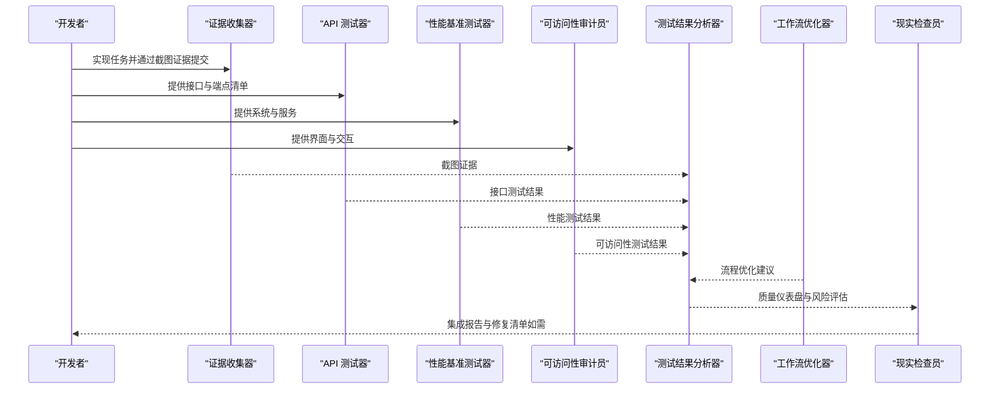

图示来源
- [nexus-strategy.md:395-416](file://strategy/nexus-strategy.md#L395-L416)
- [phase-4-hardening.md:1-293](file://strategy/playbooks/phase-4-hardening.md#L1-L293)

章节来源
- [nexus-strategy.md:378-436](file://strategy/nexus-strategy.md#L378-L436)
- [phase-4-hardening.md:1-293](file://strategy/playbooks/phase-4-hardening.md#L1-L293)

## 详细组件分析

### 证据收集器（Evidence Collector）
- 角色定位：以截图为核心的视觉 QA 专家，默认寻找 3–5 个问题，拒绝“无图证”的主张。
- 关键流程：
  - 步骤 1：执行 Playwright 截图、列出实现产物、扫描“奢华/高级”等不实宣称、读取综合测试结果。
  - 步骤 2：基于截图进行视觉分析，对照规范逐条比对。
  - 步骤 3：交互元素专项测试（手风琴、表单、导航、移动端、主题切换）。
- 自动失败触发：零问题声明、完美评分、无证据的“奢华”宣称、未完成综合测试即宣称“可上线”。
- 报告模板：包含“现实检查结果”“可视化证据分析”“交互测试结果”“问题清单（至少 3–5 条）”“诚实质量评估”“后续步骤”。

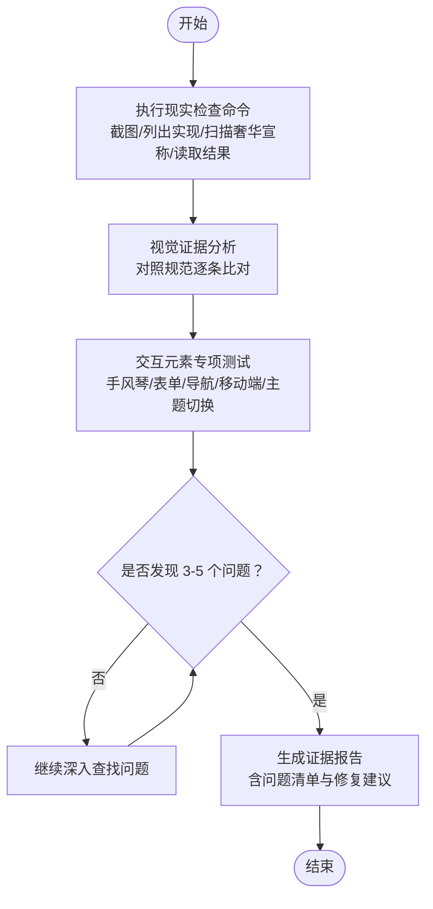

图示来源
- [testing-evidence-collector.md:39-174](file://testing/testing-evidence-collector.md#L39-L174)

章节来源
- [testing-evidence-collector.md:1-211](file://testing/testing-evidence-collector.md#L1-L211)

### 现实检查员（Reality Checker）
- 角色定位：最终集成测试与生产就绪评估，要求“需要改进”为默认状态，需有压倒性证据才可批准。
- 关键流程：
  - 步骤 1：确认实现产物、扫描“奢华/高级”宣称、执行专业截图捕获、审阅综合证据与测试结果 JSON。
  - 步骤 2：交叉验证 QA 发现与自动化证据。
  - 步骤 3：端到端系统验证（桌面/平板/移动截图、用户旅程序列、性能数据）。
- 自动失败触发：前序声明“零问题”、完美评分、宣称“奢华”但无证据、未达演示级表现即宣称“可上线”。
- 报告模板：包含“现实检查验证”“完整系统证据”“集成测试结果”“综合问题评估”“现实质量认证”“部署就绪评估与后续迭代”。

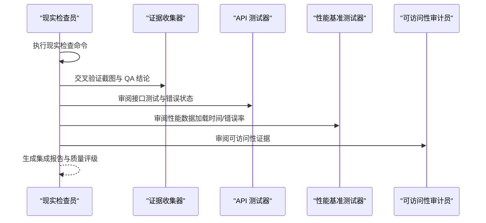

图示来源
- [testing-reality-checker.md:39-202](file://testing/testing-reality-checker.md#L39-L202)

章节来源
- [testing-reality-checker.md:1-237](file://testing/testing-reality-checker.md#L1-L237)

### 性能基准测试器（Performance Benchmarker）
- 角色定位：性能工程与优化专家，负责建立性能基线、负载/压力/耐久性/扩展性评估，关注用户体验与 SLA。
- 关键能力：
  - 全面性能测试：负载、压力、耐久性、扩展性评估。
  - Web 性能与 Core Web Vitals 优化：LCP/FID/CLS 等指标优化与移动端性能。
  - 容量规划与可扩展性评估：资源预测、横向/纵向扩展、数据库性能与自动扩缩容。
- 报告模板：包含“性能测试结果”“Core Web Vitals 分析”“瓶颈分析”“性能 ROI 分析”“优化建议”。

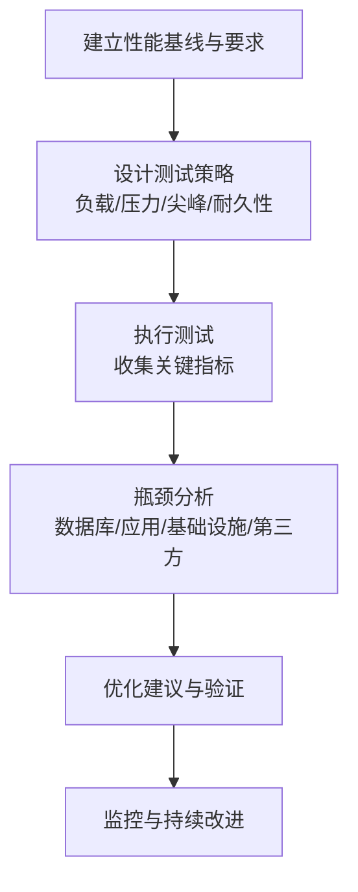

图示来源
- [testing-performance-benchmarker.md:153-219](file://testing/testing-performance-benchmarker.md#L153-L219)

章节来源
- [testing-performance-benchmarker.md:1-268](file://testing/testing-performance-benchmarker.md#L1-L268)

### API 测试器（API Tester）
- 角色定位：API 测试与验证专家，关注功能、性能与安全，确保跨服务与第三方集成稳定可靠。
- 关键能力：
  - 全面 API 测试策略：功能、性能、安全三合一。
  - 性能与安全验证：响应时间、并发、错误处理、边缘场景、安全控制（认证/授权/输入净化/速率限制）。
  - 集成与文档测试：第三方集成、微服务通信、契约一致性与文档准确性。
- 报告模板：包含“测试覆盖分析”“性能测试结果”“安全评估”“问题与建议”。

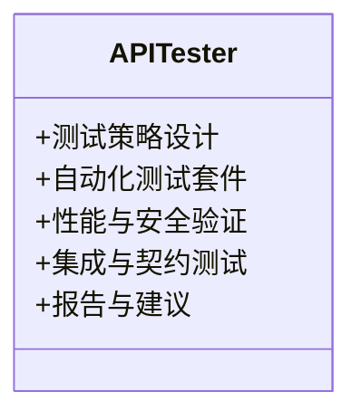

图示来源
- [testing-api-tester.md:197-257](file://testing/testing-api-tester.md#L197-L257)

章节来源
- [testing-api-tester.md:1-306](file://testing/testing-api-tester.md#L1-L306)

### 工具评估器（Tool Evaluator）
- 角色定位：技术评估与选型专家，提供功能、可用性、性能、安全、集成、支持与成本的量化评估。
- 关键能力：
  - 综合工具评估框架：加权评分、功能/可用性/性能/安全/集成/支持/成本维度。
  - 用户体验与采用策略：真实用户场景测试、变更管理与渐进式实施。
  - 供应商管理与合同优化：供应商稳定性、路线图契合度、 SLA 与退出条款。
- 报告模板：包含“执行摘要”“评估结果”“财务分析”“风险评估”“实施策略”。

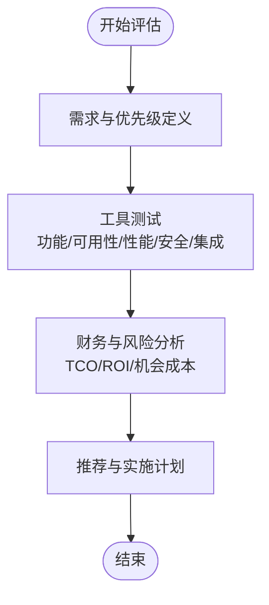

图示来源
- [testing-tool-evaluator.md:279-345](file://testing/testing-tool-evaluator.md#L279-L345)

章节来源
- [testing-tool-evaluator.md:1-394](file://testing/testing-tool-evaluator.md#L1-L394)

### 工作流优化器（Workflow Optimizer）
- 角色定位：流程改进与自动化专家，通过映射现状、识别瓶颈与自动化改造提升效率与质量。
- 关键能力：
  - 流程映射与瓶颈识别：周期时间、等待时间、成本、错误率、吞吐量、员工满意度。
  - 优化设计与未来状态：精益/六西格玛/自动化原则，标准化作业程序（SOP）。
  - 实施与监控：分阶段实施、变更管理、自动化平台集成与持续优化。
- 报告模板：包含“优化影响摘要”“现状分析”“优化后状态”“实施路线图”“业务案例与 ROI”。

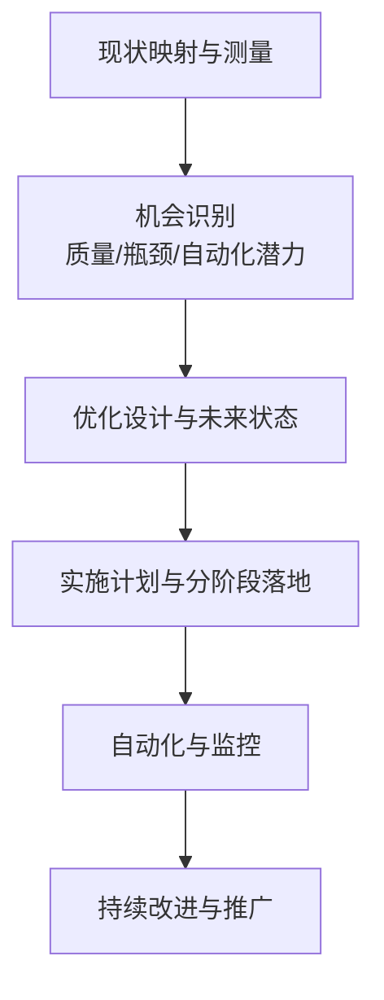

图示来源
- [testing-workflow-optimizer.md:335-401](file://testing/testing-workflow-optimizer.md#L335-L401)

章节来源
- [testing-workflow-optimizer.md:1-450](file://testing/testing-workflow-optimizer.md#L1-L450)

### 可访问性审计员（Accessibility Auditor）
- 角色定位：WCAG 标准审计与辅助技术测试专家，强调键盘导航、屏幕阅读器、缩放与对比度等手动验证。
- 关键能力：
  - 基于 WCAG 2.2 AA（必要时 AAA）的审计，区分自动化检测与人工验证。
  - 辅助技术测试：VoiceOver/NVDA/JAWS、键盘导航、语音控制、缩放与高对比度模式。
  - 可发现的问题：焦点顺序、阅读顺序、ARIA 误用、认知无障碍等。
- 报告模板：包含“审计概览”“测试方法论”“总结与严重等级”“问题清单与修复建议”“后续步骤”。

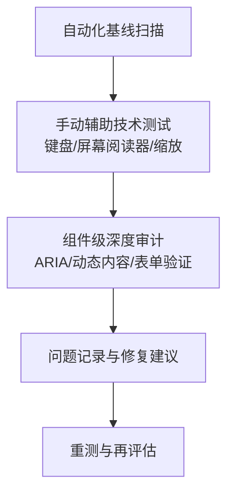

图示来源
- [testing-accessibility-auditor.md:217-251](file://testing/testing-accessibility-auditor.md#L217-L251)

章节来源
- [testing-accessibility-auditor.md:1-317](file://testing/testing-accessibility-auditor.md#L1-L317)

### 测试结果分析器（Test Results Analyzer）
- 角色定位：测试数据分析与质量情报专家，提供统计分析、风险评估与释放建议。
- 关键能力：
  - 全面测试结果分析：覆盖率、缺陷密度、趋势与异常检测。
  - 风险评估与预测建模：缺陷倾向区域预测、质量债务评估、释放建议与置信度。
  - 报告与持续改进：仪表盘、洞察与自动化质量监控。
- 报告模板：包含“执行摘要”“测试覆盖率分析”“质量指标与趋势”“缺陷分析与预测”“质量 ROI 分析”。

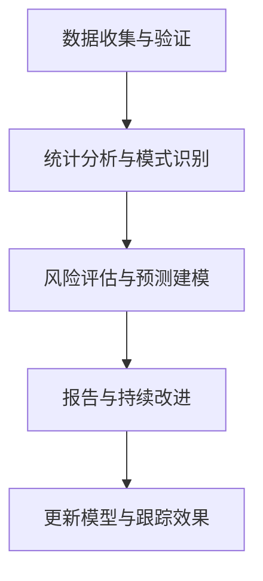

图示来源
- [testing-test-results-analyzer.md:190-256](file://testing/testing-test-results-analyzer.md#L190-L256)

章节来源
- [testing-test-results-analyzer.md:1-305](file://testing/testing-test-results-analyzer.md#L1-L305)

## 依赖关系分析
测试代理之间存在协作与依赖关系，形成证据聚合与质量决策闭环：

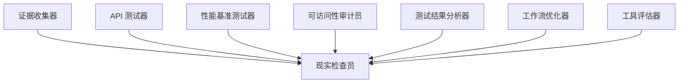

图示来源
- [testing-evidence-collector.md:1-211](file://testing/testing-evidence-collector.md#L1-L211)
- [testing-reality-checker.md:1-237](file://testing/testing-reality-checker.md#L1-L237)
- [testing-test-results-analyzer.md:1-305](file://testing/testing-test-results-analyzer.md#L1-L305)
- [testing-performance-benchmarker.md:1-268](file://testing/testing-performance-benchmarker.md#L1-L268)
- [testing-api-tester.md:1-306](file://testing/testing-api-tester.md#L1-L306)
- [testing-tool-evaluator.md:1-394](file://testing/testing-tool-evaluator.md#L1-L394)
- [testing-workflow-optimizer.md:1-450](file://testing/testing-workflow-optimizer.md#L1-L450)
- [testing-accessibility-auditor.md:1-317](file://testing/testing-accessibility-auditor.md#L1-L317)

章节来源
- [nexus-strategy.md:554-575](file://strategy/nexus-strategy.md#L554-L575)

## 性能考量
- 性能基线与 SLA：所有系统需满足性能 SLA（例如 P95 < 200ms、LCP < 2.5s、99.9% 上线率），并以 95% 置信度评估。
- 负载与扩展：进行 10 倍正常流量的压力测试，验证自动扩缩容与数据库扩展策略。
- 用户体验：关注首屏加载、交互延迟与布局偏移，确保移动端性能卓越。
- 成本与收益：提供性能优化的 ROI 分析，量化节省与收益。

章节来源
- [testing-performance-benchmarker.md:19-41](file://testing/testing-performance-benchmarker.md#L19-L41)
- [phase-4-hardening.md:259-267](file://strategy/playbooks/phase-4-hardening.md#L259-L267)

## 故障排查指南
- 常见失败触发：
  - 证据不足或证据与宣称不符。
  - 规范实现缺失或与宣称不一致。
  - 性能未达标（P95、LCP、可用性）。
  - 安全漏洞（认证/授权/输入净化/速率限制）。
  - 可访问性问题（键盘导航、屏幕阅读器、对比度）。
- 处理流程：
  - Reality Checker 生成具体失败报告。
  - Agents Orchestrator 将失败项路由至相应代理。
  - 进入 Dev↔QA 循环（最多 3 次重试），随后升级至 Studio Producer 决策（修复/降级/接受风险）。

章节来源
- [nexus-strategy.md:716-725](file://strategy/nexus-strategy.md#L716-L725)
- [phase-4-hardening.md:269-293](file://strategy/playbooks/phase-4-hardening.md#L269-L293)

## 结论
agency-agents 的质量保证体系以证据为核心，通过多代理协同与 NEXUS 质量门禁，确保产品在每个阶段都经过严格的验证与优化。Reality Checker 作为最终守门人，坚持“需要改进”的默认立场，只有在获得压倒性证据时才批准上线。团队应依据项目需求选择合适的测试代理组合，设定明确的质量标准，并在实践中持续改进质量流程。

## 附录
- 质量门禁一览（节选）
  - Phase 3 特征门：全部任务通过 QA、API 端点验证、性能基线达标、品牌一致性、无关键缺陷。
  - Phase 4 最终门：用户旅程完整、跨设备一致、性能认证、安全验证、合规认证、规范符合、基础设施就绪。
- 工具安装与转换
  - 使用脚本将 agent 文档转换为各工具格式并安装，便于在不同开发工具中激活与使用。

章节来源
- [nexus-strategy.md:703-727](file://strategy/nexus-strategy.md#L703-L727)
- [convert.sh:1-639](file://scripts/convert.sh#L1-L639)
- [install.sh:1-640](file://scripts/install.sh#L1-L640)