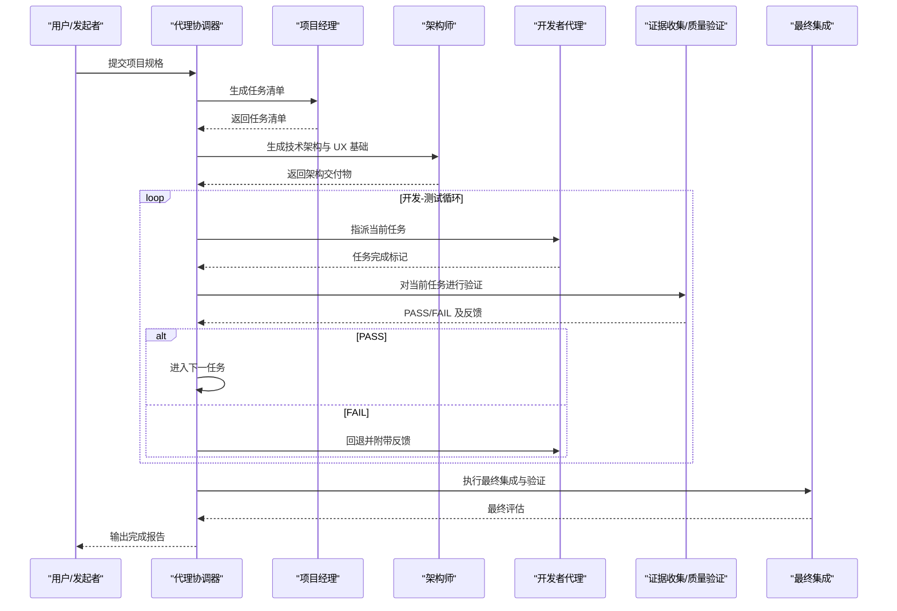
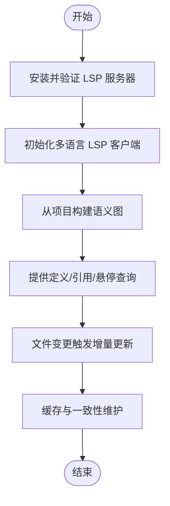
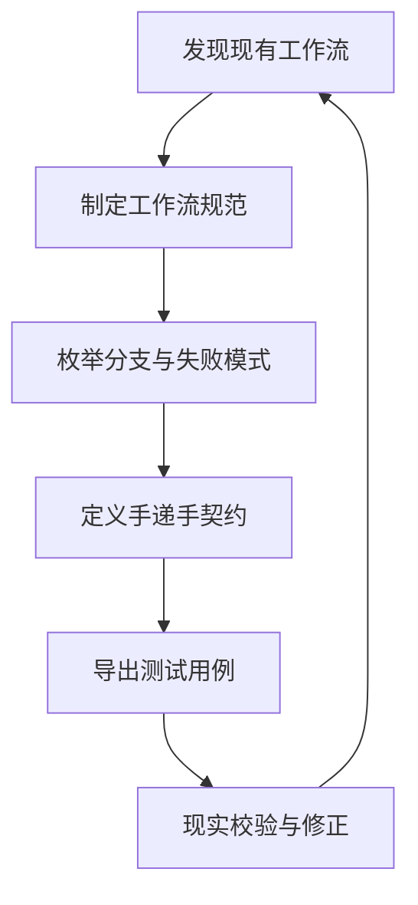
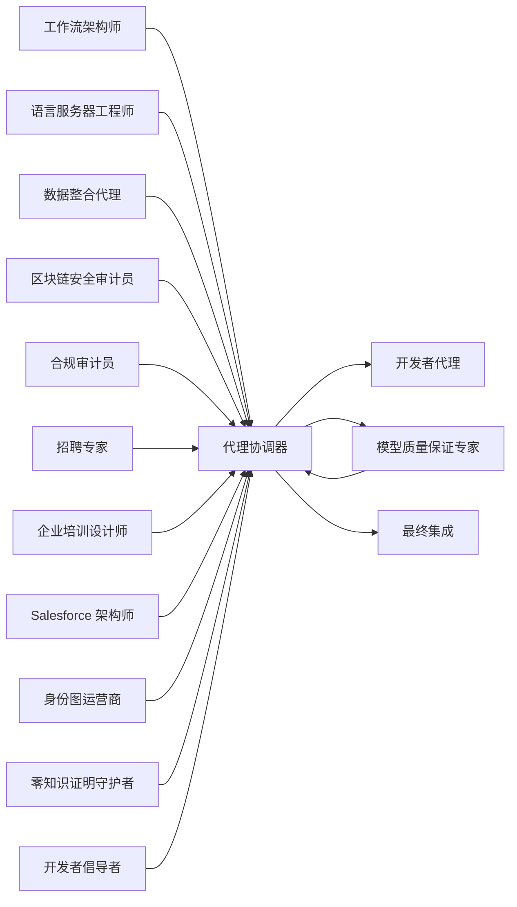

# 专业代理

<cite>
**本文引用的文件**
- [README.md](file://README.md)
- [agents-orchestrator.md](file://specialized/agents-orchestrator.md)
- [lsp-index-engineer.md](file://specialized/lsp-index-engineer.md)
- [data-consolidation-agent.md](file://specialized/data-consolidation-agent.md)
- [specialized-workflow-architect.md](file://specialized/specialized-workflow-architect.md)
- [specialized-model-qa.md](file://specialized/specialized-model-qa.md)
- [blockchain-security-auditor.md](file://specialized/blockchain-security-auditor.md)
- [compliance-auditor.md](file://specialized/compliance-auditor.md)
- [recruitment-specialist.md](file://specialized/recruitment-specialist.md)
- [corporate-training-designer.md](file://specialized/corporate-training-designer.md)
- [specialized-document-generator.md](file://specialized/specialized-document-generator.md)
- [specialized-salesforce-architect.md](file://specialized/specialized-salesforce-architect.md)
- [identity-graph-operator.md](file://specialized/identity-graph-operator.md)
- [zk-steward.md](file://specialized/zk-steward.md)
- [specialized-developer-advocate.md](file://specialized/specialized-developer-advocate.md)
</cite>

## 目录
1. [简介](#简介)
2. [项目结构](#项目结构)
3. [核心组件](#核心组件)
4. [架构总览](#架构总览)
5. [详细组件分析](#详细组件分析)
6. [依赖关系分析](#依赖关系分析)
7. [性能考量](#性能考量)
8. [故障排查指南](#故障排查指南)
9. [结论](#结论)
10. [附录](#附录)

## 简介
本文件系统性梳理“专业代理”子项目，聚焦于多代理协作与工作流编排、语言服务器协议工程师、数据整合代理、工作流架构师、模型质量保证专家、区块链安全审计员、合规审计员、招聘专家、企业培训设计师、文档生成专家、Salesforce 架构师、身份图运营商、代理身份信任机制、零知识证明守护者、土木工程师、开发者倡导者、法国咨询市场专家、韩国商务导航员、文化情报战略家、留学顾问、供应链战略家、政府数字化预销售顾问、医疗营销合规专家等专业代理的能力边界、应用场景、技术实现与最佳实践。文档以“可执行、可验证、可复用”的方式呈现，既适合非技术读者快速理解，也便于技术读者深入掌握实现细节。

## 项目结构
该项目采用“按职能划分”的组织方式，将不同专业领域的代理按“工程、设计、营销、产品、项目管理、测试、支持、空间计算、专业化”等维度分门别类，形成完整的“AI专家团队”。每个代理文件包含身份设定、使命目标、关键规则、技术交付物、工作流程、成功度量与沟通风格等要素，确保“可复制、可协作、可落地”。

```mermaid
graph TB
A["README 概览"] --> B["工程部"]
A --> C["设计部"]
A --> D["营销部"]
A --> E["产品部"]
A --> F["项目管理部"]
A --> G["测试部"]
A --> H["支持部"]
A --> I["空间计算部"]
A --> J["专业化代理"]
J --> J1["代理协调器"]
J --> J2["语言服务器工程师"]
J --> J3["数据整合代理"]
J --> J4["工作流架构师"]
J --> J5["模型质量保证专家"]
J --> J6["区块链安全审计员"]
J --> J7["合规审计员"]
J --> J8["招聘专家"]
J --> J9["企业培训设计师"]
J --> J10["文档生成专家"]
J --> J11["Salesforce 架构师"]
J --> J12["身份图运营商"]
J --> J13["零知识证明守护者"]
J --> J14["土木工程师"]
J --> J15["开发者倡导者"]
J --> J16["法国咨询市场专家"]
J --> J17["韩国商务导航员"]
J --> J18["文化情报战略家"]
J --> J19["留学顾问"]
J --> J20["供应链战略家"]
J --> J21["政府数字化预销售顾问"]
J --> J22["医疗营销合规专家"]
```

图表来源
- [README.md:68-283](file://README.md#L68-L283)

章节来源
- [README.md:12-80](file://README.md#L12-L80)
- [README.md:68-283](file://README.md#L68-L283)

## 核心组件
本节从“多代理协作”“代码智能服务”“数据处理与分析”“业务流程设计”“质量评估与优化”“安全评估与漏洞检测”“法规遵循与风险控制”“人才筛选与面试优化”“培训课程设计”“自动化文档创建”“企业级 CRM 解决方案”“身份管理”“零知识证明”“工程与咨询”等维度，提炼各专业代理的核心能力与典型应用。

- 多代理协作与工作流编排：代理协调器负责端到端流水线的规划、执行与质量门禁，确保任务在开发-测试闭环中稳定推进。
- 代码智能服务：语言服务器工程师构建统一的 LSP 客户端编排与语义索引，提供跨语言定义/引用/悬停查询与实时增量更新。
- 数据处理与分析：数据整合代理聚合销售指标，输出区域/代表/管道快照与趋势分析，支撑实时仪表盘。
- 业务流程设计：工作流架构师在实现前绘制完整工作流树，覆盖所有分支、失败模式、恢复路径与可观测状态。
- 质量评估与优化：模型质量保证专家对机器学习模型进行全生命周期审计，涵盖文档治理、数据重建、特征分析、校准测试、解释性与公平性评估。
- 安全评估与漏洞检测：区块链安全审计员系统性识别漏洞类别，结合静态分析、符号执行与属性测试，输出可复现的攻击示例与修复建议。
- 法规遵循与风险控制：合规审计员从准备评估、差距识别到证据收集与认证支持，提供框架化的合规落地方法论。
- 人才筛选与面试优化：招聘专家覆盖中国主流招聘渠道、JD 优化、简历筛选与评估、面试流程设计、校园招聘与猎头管理、劳动法合规与雇主品牌建设。
- 培训课程设计：企业培训设计师基于 ADDIE/SAM 模型设计系统化课程，结合混合式学习、内部讲师发展与评估体系。
- 自动化文档创建：文档生成专家以编程方式批量产出 PDF/PPTX/DOCX/XLSX，强调格式一致性、可访问性与可复用模板。
- 企业级 CRM 解决方案：Salesforce 架构师面向多云平台设计企业级 CRM 架构，关注集成模式、数据建模、部署策略与 Governor 限额约束。
- 身份管理：身份图运营商为多代理系统提供共享身份解析，确保实体解析的一致性、确定性与可审计。
- 零知识证明：零知识证明守护者围绕 ZK 技术的存储、链接与验证流程，保障知识网络的原子性、连通性与持续对话。
- 工程与咨询：涵盖土木工程师（结构分析）、开发者倡导者（社区与 DX）、法国/韩国市场专家（本地化策略）、文化情报战略家（全球 UX）、留学顾问（跨教育路径）、供应链战略家（运营优化）、政府数字化预销售顾问（ToG 方案）、医疗营销合规专家（监管落地）等。

章节来源
- [agents-orchestrator.md:19-38](file://specialized/agents-orchestrator.md#L19-L38)
- [lsp-index-engineer.md:19-41](file://specialized/lsp-index-engineer.md#L19-L41)
- [data-consolidation-agent.md:21-24](file://specialized/data-consolidation-agent.md#L21-L24)
- [specialized-workflow-architect.md:22-38](file://specialized/specialized-workflow-architect.md#L22-L38)
- [specialized-model-qa.md:20-85](file://specialized/specialized-model-qa.md#L20-L85)
- [blockchain-security-auditor.md:20-41](file://specialized/blockchain-security-auditor.md#L20-L41)
- [compliance-auditor.md:19-40](file://specialized/compliance-auditor.md#L19-L40)
- [recruitment-specialist.md:20-32](file://specialized/recruitment-specialist.md#L20-L32)
- [corporate-training-designer.md:20-37](file://specialized/corporate-training-designer.md#L20-L37)
- [specialized-document-generator.md:19-42](file://specialized/specialized-document-generator.md#L19-L42)
- [specialized-salesforce-architect.md:39-51](file://specialized/specialized-salesforce-architect.md#L39-L51)
- [identity-graph-operator.md:19-38](file://specialized/identity-graph-operator.md#L19-L38)
- [zk-steward.md:18-34](file://specialized/zk-steward.md#L18-L34)

## 架构总览
下图展示“专业化代理生态”的整体交互：代理协调器作为流水线总控，驱动工作流架构师产出规范，语言服务器工程师提供代码智能基础设施，数据整合代理提供业务洞察，模型质量保证专家与区块链安全审计员分别承担 ML 与链上安全的“质量门禁”，合规审计员贯穿全链路风控，招聘与培训代理保障组织能力建设，文档生成专家与 Salesforce 架构师提供交付与平台能力，身份图运营商与零知识证明守护者提供跨系统一致性的知识与身份基础，开发者倡导者连接内外部开发者社区，其他专业代理（法国/韩国/文化/留学/供应链/政府数字化/医疗营销合规等）按需接入。

```mermaid
graph TB
subgraph "编排与工作流"
ORCH["代理协调器"]
WF["工作流架构师"]
end
subgraph "代码智能与数据"
LSP["语言服务器工程师"]
DATA["数据整合代理"]
DOC["文档生成专家"]
end
subgraph "质量与安全"
QA["模型质量保证专家"]
SEC["区块链安全审计员"]
COM["合规审计员"]
end
subgraph "组织与平台"
REC["招聘专家"]
TRAIN["企业培训设计师"]
SF["Salesforce 架构师"]
ID["身份图运营商"]
ZK["零知识证明守护者"]
DA["开发者倡导者"]
end
subgraph "专项咨询"
FR["法国咨询市场专家"]
KR["韩国商务导航员"]
CULT["文化情报战略家"]
STUDY["留学顾问"]
SUP["供应链战略家"]
PRES["政府数字化预销售顾问"]
HC["医疗营销合规专家"]
end
ORCH --> WF
ORCH --> LSP
ORCH --> DATA
ORCH --> QA
ORCH --> SEC
ORCH --> COM
ORCH --> REC
ORCH --> TRAIN
ORCH --> SF
ORCH --> ID
ORCH --> ZK
ORCH --> DA
ORCH --> FR
ORCH --> KR
ORCH --> CULT
ORCH --> STUDY
ORCH --> SUP
ORCH --> PRES
ORCH --> HC
```

图表来源
- [agents-orchestrator.md:295-360](file://specialized/agents-orchestrator.md#L295-L360)
- [specialized-workflow-architect.md:438-464](file://specialized/specialized-workflow-architect.md#L438-L464)
- [lsp-index-engineer.md:63-115](file://specialized/lsp-index-engineer.md#L63-L115)
- [data-consolidation-agent.md:33-61](file://specialized/data-consolidation-agent.md#L33-L61)
- [specialized-model-qa.md:103-192](file://specialized/specialized-model-qa.md#L103-L192)
- [blockchain-security-auditor.md:63-121](file://specialized/blockchain-security-auditor.md#L63-L121)
- [compliance-auditor.md:60-100](file://specialized/compliance-auditor.md#L60-L100)
- [recruitment-specialist.md:428-454](file://specialized/recruitment-specialist.md#L428-L454)
- [corporate-training-designer.md:144-177](file://specialized/corporate-training-designer.md#L144-L177)
- [specialized-document-generator.md:19-56](file://specialized/specialized-document-generator.md#L19-L56)
- [specialized-salesforce-architect.md:52-143](file://specialized/specialized-salesforce-architect.md#L52-L143)
- [identity-graph-operator.md:55-107](file://specialized/identity-graph-operator.md#L55-L107)
- [zk-steward.md:57-86](file://specialized/zk-steward.md#L57-L86)
- [specialized-developer-advocate.md:240-267](file://specialized/specialized-developer-advocate.md#L240-L267)

## 详细组件分析

### 代理协调器（Agents Orchestrator）
- 角色定位：端到端流水线的领导者，负责项目分析、技术架构、开发-测试闭环与最终集成验证。
- 关键能力：
  - 流水线阶段化：需求分析→架构→开发-测试循环→最终集成
  - 质量门禁：任务级验证、自动重试、失败处理与状态追踪
  - 协作编排：按任务类型自动选择合适开发者代理，传递上下文与指令
- 应用场景：MVP 快速交付、端到端质量保障、跨职能团队协同
- 最佳实践：
  - 明确质量门禁与重试上限，避免“跳过 QA”
  - 严格的状态记录与进度报告，便于回溯与复盘
  - 将复杂任务拆解为可验证的单步任务，降低耦合

图表来源
- [agents-orchestrator.md:53-147](file://specialized/agents-orchestrator.md#L53-L147)

章节来源
- [agents-orchestrator.md:19-38](file://specialized/agents-orchestrator.md#L19-L38)
- [agents-orchestrator.md:170-245](file://specialized/agents-orchestrator.md#L170-L245)
- [agents-orchestrator.md:269-277](file://specialized/agents-orchestrator.md#L269-L277)

### 语言服务器工程师（LSP/Index Engineer）
- 角色定位：统一多语言 LSP 客户端编排与语义索引构建者，提供跨语言定义/引用/悬停查询与增量更新。
- 关键能力：
  - 多语言 LSP 并行初始化与能力协商
  - 图结构构建（节点：文件/符号；边：包含/导入/调用/引用）
  - 实时增量更新与缓存策略，保障低延迟响应
- 应用场景：IDE/编辑器增强、代码检索与导航、跨语言知识图谱
- 最佳实践：
  - 严格遵循 LSP 规范，避免假设能力
  - 使用增量更新与缓存，平衡内存与速度
  - 通过 WebSocket 推送图差异，保持客户端一致

图表来源
- [lsp-index-engineer.md:227-259](file://specialized/lsp-index-engineer.md#L227-L259)
- [lsp-index-engineer.md:63-115](file://specialized/lsp-index-engineer.md#L63-L115)

章节来源
- [lsp-index-engineer.md:19-41](file://specialized/lsp-index-engineer.md#L19-L41)
- [lsp-index-engineer.md:282-291](file://specialized/lsp-index-engineer.md#L282-L291)

### 数据整合代理（Data Consolidation Agent）
- 角色定位：将分散的销售数据整合为实时仪表盘与报告，提供区域/代表/管道快照与趋势分析。
- 关键能力：
  - 多维并行查询与聚合计算
  - 达成率、趋势与前五表现者等关键指标
  - 自动刷新与一致性校验
- 应用场景：销售看板、区域汇报、管理层决策
- 最佳实践：
  - 使用最新数据日期确保时效性
  - 保持明细与汇总一致性，避免数据漂移

章节来源
- [data-consolidation-agent.md:21-61](file://specialized/data-consolidation-agent.md#L21-L61)

### 工作流架构师（Workflow Architect）
- 角色定位：在实现前绘制完整工作流树，覆盖所有分支、失败模式、恢复路径与可观测状态。
- 关键能力：
  - 发现现有工作流与缺失规范
  - 维护四视图工作流注册表（按工作流/组件/用户旅程/状态）
  - 明确系统边界与手递手契约
- 应用场景：系统设计评审、测试用例生成、运维可观测性
- 最佳实践：
  - 以“发现-规范-验证”闭环迭代
  - 以现实校验(spec vs. reality)推动修正

图表来源
- [specialized-workflow-architect.md:438-507](file://specialized/specialized-workflow-architect.md#L438-L507)

章节来源
- [specialized-workflow-architect.md:22-38](file://specialized/specialized-workflow-architect.md#L22-L38)
- [specialized-workflow-architect.md:176-225](file://specialized/specialized-workflow-architect.md#L176-L225)

### 模型质量保证专家（Model QA Specialist）
- 角色定位：对机器学习模型进行全生命周期审计，从文档治理到解释性与公平性评估。
- 关键能力：
  - 文档与治理审查、数据重建与质量评估
  - 特征稳定性（PSI）、校准测试（Hosmer-Lemeshow）、性能监控
  - 全局/局部解释性（SHAP、PDP）、公平性审计
- 应用场景：模型上线前审计、生产回归监控、合规报告
- 最佳实践：
  - 以证据驱动的严重性分级
  - 严格的可复现性与参数对比

章节来源
- [specialized-model-qa.md:20-85](file://specialized/specialized-model-qa.md#L20-L85)
- [specialized-model-qa.md:353-387](file://specialized/specialized-model-qa.md#L353-L387)

### 区块链安全审计员（Blockchain Security Auditor）
- 角色定位：智能合约安全审计专家，系统性识别漏洞类别并输出可复现的攻击示例。
- 关键能力：
  - 静态分析（Slither/Mythril）、属性测试（Echidna/Foundry）
  - 访问控制审计清单、经济攻击建模
  - 严重性分级与修复建议
- 应用场景：DeFi 协议审计、升级前安全门禁、应急响应
- 最佳实践：
  - 不跳过手动复核
  - 以可复现 PoC 作为修复依据

章节来源
- [blockchain-security-auditor.md:20-41](file://specialized/blockchain-security-auditor.md#L20-L41)
- [blockchain-security-auditor.md:366-401](file://specialized/blockchain-security-auditor.md#L366-L401)

### 合规审计员（Compliance Auditor）
- 角色定位：SOC 2/ISO 27001/HIPAA/PCI-DSS 等合规审计的技术实施者。
- 关键能力：
  - 合规差距评估与优先级整改
  - 控制设计与证据收集自动化
  - 审计执行支持与持续合规
- 应用场景：首次认证准备、年度审计支持、合规健康度监控
- 最佳实践：
  - 以“实质重于形式”为原则
  - 将控制测试自动化，减少手工证据脆弱性

章节来源
- [compliance-auditor.md:19-40](file://specialized/compliance-auditor.md#L19-L40)
- [compliance-auditor.md:131-159](file://specialized/compliance-auditor.md#L131-L159)

### 招聘专家（Recruitment Specialist）
- 角色定位：中国招聘生态的全周期运营专家，覆盖渠道、JD、筛选、面试、校园招聘、猎头与合规。
- 关键能力：
  - 渠道 ROI 分析与预算优化
  - JD 优化与胜任力模型
  - 面试流程设计与评估中心
  - 校园招聘日历与内推/猎头管理
  - 劳动法合规与雇主品牌建设
- 应用场景：招聘效率提升、成本优化、候选人体验改善
- 最佳实践：
  - 数据驱动的决策与持续优化
  - 遵守劳动法与隐私保护要求

章节来源
- [recruitment-specialist.md:20-32](file://specialized/recruitment-specialist.md#L20-L32)
- [recruitment-specialist.md:428-454](file://specialized/recruitment-specialist.md#L428-L454)

### 企业培训设计师（Corporate Training Designer）
- 角色定位：企业学习体系的设计者，从需求诊断到评估优化的全流程。
- 关键能力：
  - ADDIE/SAM 方法论应用
  - 混合式学习与沉浸式场景训练
  - 内训师发展与领导力培养
  - 培训评估（Kirkpatrick 四级）与数据驱动优化
- 应用场景：新员工入职、专业技能提升、领导力发展、合规培训
- 最佳实践：
  - 以业务结果为导向
  - 以数据说话，持续改进

章节来源
- [corporate-training-designer.md:20-37](file://specialized/corporate-training-designer.md#L20-L37)
- [corporate-training-designer.md:144-177](file://specialized/corporate-training-designer.md#L144-L177)

### 文档生成专家（Document Generator）
- 角色定位：以编程方式批量生成 PDF/PPTX/DOCX/XLSX，强调格式一致性、可访问性与可复用模板。
- 关键能力：
  - 多语言工具链（Python/Node.js）
  - 模板化与样式化
  - 数据驱动与图表可视化
- 应用场景：报告/演示/合同/报表自动化
- 最佳实践：
  - 使用样式而非硬编码字体/字号
  - 提供脚本与输出文件，并解释格式选择

章节来源
- [specialized-document-generator.md:19-56](file://specialized/specialized-document-generator.md#L19-L56)

### Salesforce 架构师（Salesforce Architect）
- 角色定位：多云平台的企业级 CRM 架构师，关注集成模式、数据建模、部署策略与 Governor 限额。
- 关键能力：
  - 多云架构与集成模式（REST/平台事件/CDC）
  - 数据模型设计与治理
  - 部署策略与 CI/CD
  - Governor 限额预算与优化
- 应用场景：企业 CRM 上云、数据迁移、集成治理、性能优化
- 最佳实践：
  - 限额意识贯穿设计
  - 声明式优先，必要时再编码

章节来源
- [specialized-salesforce-architect.md:39-51](file://specialized/specialized-salesforce-architect.md#L39-L51)
- [specialized-salesforce-architect.md:117-143](file://specialized/specialized-salesforce-architect.md#L117-L143)

### 身份图运营商（Identity Graph Operator）
- 角色定位：多代理系统的共享身份解析层，确保同一实体在不同来源与时间点得到一致解析。
- 关键能力：
  - 字段归一化与阻断匹配
  - 候选评分与置信度
  - 合并/拆分提案与冲突仲裁
- 应用场景：客户去重、跨系统实体一致性、审计与回滚
- 最佳实践：
  - 确定性解析与证据说明
  - 租户隔离与默认脱敏

章节来源
- [identity-graph-operator.md:19-38](file://specialized/identity-graph-operator.md#L19-L38)
- [identity-graph-operator.md:158-188](file://specialized/identity-graph-operator.md#L158-L188)

### 零知识证明守护者（ZK Steward）
- 角色定位：基于 Luhmann Zettelkasten 的知识网络守护者，强调原子笔记、连通性与验证闭环。
- 关键能力：
  - Luhmann 四原则检查（原子性/连通性/有机增长/持续对话）
  - 文件命名与索引设计
  - 日常日志与开放环路管理
- 应用场景：个人知识库建设、跨域决策支持、结构化阅读与学习
- 最佳实践：
  - 每条回复声明专家视角
  - 新笔记至少两条链接与可分享性判断

章节来源
- [zk-steward.md:18-34](file://specialized/zk-steward.md#L18-L34)
- [zk-steward.md:125-147](file://specialized/zk-steward.md#L125-L147)

### 开发者倡导者（Developer Advocate）
- 角色定位：连接产品/工程与外部开发者社区的桥梁，专注开发者体验（DX）与真实反馈闭环。
- 关键能力：
  - DX 审计与首调时长优化
  - 技术内容创作与社区互动
  - 问题响应与路线图沟通
- 应用场景：开发者教程、会议演讲、社区活动、SDK 改进
- 最佳实践：
  - 真实性与准确性优先
  - 以证据驱动产品需求

章节来源
- [specialized-developer-advocate.md:19-44](file://specialized/specialized-developer-advocate.md#L19-L44)
- [specialized-developer-advocate.md:240-267](file://specialized/specialized-developer-advocate.md#L240-L267)

### 其他专项代理（按需接入）
- 土木工程师：结构分析、地基设计、多标准规范（Eurocode/ACI/AISC）
- 法国咨询市场专家：ESN/SI 生态、挂靠机制、报价定位
- 韩国商务导航员：韩企文化、품의流程、关系力学
- 文化情报战略家：全球 UX、代表性与文化排斥
- 留学顾问：美国/英国/加拿大/澳洲留学路径规划
- 供应链战略家：采购与运营优化
- 政府数字化预销售顾问：ToG 方案与投标
- 医疗营销合规专家：中国医疗广告合规

章节来源
- [README.md:273-283](file://README.md#L273-L283)

## 依赖关系分析
- 编排依赖：代理协调器依赖工作流架构师的规范、语言服务器工程师的代码智能基础设施、数据整合代理的业务洞察、模型质量保证专家与区块链安全审计员的质量/安全门禁、合规审计员的风险控制、招聘与培训代理的组织能力建设、文档生成专家与 Salesforce 架构师的交付与平台能力、身份图运营商与零知识证明守护者的跨系统一致性与知识基础、开发者倡导者连接内外部开发者社区。
- 信息流：工作流架构师→代理协调器→开发者代理→证据收集/质量验证→最终集成；数据整合代理→业务看板/报告；模型质量保证专家→ML 部署；区块链安全审计员→链上部署；合规审计员→全链路风控；招聘/培训→组织能力；文档生成→交付材料；Salesforce 架构师→企业平台；身份图运营商/ZK→跨系统一致性；开发者倡导者→社区反馈。

图表来源
- [agents-orchestrator.md:295-360](file://specialized/agents-orchestrator.md#L295-L360)
- [specialized-workflow-architect.md:438-464](file://specialized/specialized-workflow-architect.md#L438-L464)

章节来源
- [agents-orchestrator.md:295-360](file://specialized/agents-orchestrator.md#L295-L360)

## 性能考量
- 代理协调器：通过任务级质量门禁与重试上限控制，避免无效循环；状态追踪与进度报告有助于缩短瓶颈定位时间。
- 语言服务器工程师：并行 LSP 请求、增量更新与缓存策略，保障亚 100ms 的关键响应时间。
- 数据整合代理：并行查询与优化的聚合逻辑，确保仪表盘秒级加载与自动刷新。
- 工作流架构师：以“发现-规范-验证”闭环迭代，减少实现偏差导致的返工。
- 模型质量保证专家：严格的可复现性与参数对比，降低回归风险。
- 区块链安全审计员：自动化静态分析与属性测试，结合可复现 PoC，提高审计效率。
- 合规审计员：自动化证据采集与控制测试，降低手工证据脆弱性。
- 招聘专家：渠道 ROI 分析与流程自动化，缩短招聘周期与提升转化。
- 企业培训设计师：Kirkpatrick 四级评估与数据驱动优化，量化培训价值。
- 文档生成专家：模板化与样式化，减少重复劳动与格式不一致。
- Salesforce 架构师：限额预算与批量优化，避免 Governor 限制引发的运行时异常。
- 身份图运营商：阻断匹配与评分引擎，确保解析延迟低于 100ms 的 p99。
- 零知识证明守护者：原子笔记与连通性检查，保障知识网络的可扩展性与可维护性。
- 开发者倡导者：DX 审计与错误消息优化，显著降低开发者调试时间。

## 故障排查指南
- 代理协调器
  - 现象：任务多次失败且无法推进
  - 排查：检查重试次数与失败反馈；确认质量门禁是否被触发；核对任务上下文传递
  - 处理：根据反馈调整指令或切换开发者代理；必要时人工介入并记录
- 语言服务器工程师
  - 现象：查询响应慢或不一致
  - 排查：确认 LSP 能力协商、增量更新与缓存一致性
  - 处理：启用并行请求、优化缓存策略、检查 WebSocket 事件流
- 数据整合代理
  - 现象：仪表盘数据陈旧或不一致
  - 排查：核对最新数据日期、聚合逻辑与明细/汇总一致性
  - 处理：调整刷新频率与查询策略，确保数据完整性
- 工作流架构师
  - 现象：实现与规范不符或存在未覆盖分支
  - 排查：使用现实校验（spec vs. reality）查找缺口
  - 处理：补充缺失规范与测试用例，迭代闭环
- 模型质量保证专家
  - 现象：模型上线后出现偏差或不公平
  - 排查：检查 PSI、校准测试与解释性分析
  - 处理：按严重性分级修复并重新评估
- 区块链安全审计员
  - 现象：部署后出现漏洞或攻击
  - 排查：复核 Slither/Mythril 结果与属性测试
  - 处理：以可复现 PoC 驱动修复与回归测试
- 合规审计员
  - 现象：审计发现问题未闭环
  - 排查：核对证据包与整改计划
  - 处理：建立跟踪与再验证机制
- 招聘专家
  - 现象：招聘漏斗瓶颈或候选人体验差
  - 排查：分析渠道 ROI 与流程耗时
  - 处理：优化渠道组合与流程自动化
- 企业培训设计师
  - 现象：培训效果不佳或学员流失
  - 排查：Kirkpatrick 评估与学习数据分析
  - 处理：调整课程内容与交付方式
- 文档生成专家
  - 现象：格式不一致或可访问性不足
  - 排查：样式与模板一致性、可访问性标签
  - 处理：标准化模板与自动化检查
- Salesforce 架构师
  - 现象：运行时 Governor 限制异常
  - 排查：限额预算与批量优化
  - 处理：重构触发器与异步化
- 身份图运营商
  - 现象：实体重复或解析冲突
  - 排查：合并/拆分提案与证据
  - 处理：仲裁冲突并回滚错误操作
- 零知识证明守护者
  - 现象：知识网络断裂或链接不足
  - 排查：原子性与连通性检查
  - 处理：补充链接与索引，保持有机增长
- 开发者倡导者
  - 现象：开发者反馈未转化为产品改进
  - 排查：社区声音与问题响应
  - 处理：建立反馈闭环与透明沟通

章节来源
- [agents-orchestrator.md:149-168](file://specialized/agents-orchestrator.md#L149-L168)
- [lsp-index-engineer.md:57-62](file://specialized/lsp-index-engineer.md#L57-L62)
- [data-consolidation-agent.md:55-61](file://specialized/data-consolidation-agent.md#L55-L61)
- [specialized-workflow-architect.md:504-507](file://specialized/specialized-workflow-architect.md#L504-L507)
- [specialized-model-qa.md:447-456](file://specialized/specialized-model-qa.md#L447-L456)
- [blockchain-security-auditor.md:423-432](file://specialized/blockchain-security-auditor.md#L423-L432)
- [compliance-auditor.md:148-153](file://specialized/compliance-auditor.md#L148-L153)
- [recruitment-specialist.md:428-454](file://specialized/recruitment-specialist.md#L428-L454)
- [corporate-training-designer.md:171-177](file://specialized/corporate-training-designer.md#L171-L177)
- [specialized-document-generator.md:43-56](file://specialized/specialized-document-generator.md#L43-L56)
- [specialized-salesforce-architect.md:138-143](file://specialized/specialized-salesforce-architect.md#L138-L143)
- [identity-graph-operator.md:181-188](file://specialized/identity-graph-operator.md#L181-L188)
- [zk-steward.md:161-168](file://specialized/zk-steward.md#L161-L168)
- [specialized-developer-advocate.md:263-267](file://specialized/specialized-developer-advocate.md#L263-L267)

## 结论
“专业代理”通过“可执行的工作流、可验证的质量门禁、可复用的技术交付物”构建了“多代理协作+专业化分工”的智能体生态。代理协调器作为总控，将工作流架构师的规范、语言服务器工程师的代码智能、数据整合代理的业务洞察、模型质量保证专家与区块链安全审计员的质量/安全门禁、合规审计员的风险控制、招聘与培训代理的组织能力建设、文档生成专家与 Salesforce 架构师的交付与平台能力、身份图运营商与零知识证明守护者的跨系统一致性与知识基础、开发者倡导者连接内外部开发者社区，形成闭环。该体系既适用于初创团队的快速迭代，也可支撑大型企业的规模化交付与治理。

## 附录
- 快速参考
  - 代理协调器：流水线阶段化、质量门禁、状态追踪
  - 语言服务器工程师：多语言 LSP 并行、增量更新、缓存策略
  - 数据整合代理：并行查询、聚合计算、自动刷新
  - 工作流架构师：四视图注册表、手递手契约、测试用例导出
  - 模型质量保证专家：可复现性、PSI、校准测试、解释性与公平性
  - 区块链安全审计员：自动化分析、属性测试、PoC 驱动修复
  - 合规审计员：差距评估、证据自动化、持续合规
  - 招聘专家：渠道 ROI、JD 优化、面试流程、劳动法合规
  - 企业培训设计师：ADDIE/SAM、混合式学习、Kirkpatrick 评估
  - 文档生成专家：模板化、样式化、可访问性
  - Salesforce 架构师：多云集成、数据建模、部署策略、限额预算
  - 身份图运营商：阻断匹配、评分引擎、合并/拆分提案
  - 零知识证明守护者：原子笔记、连通性检查、验证闭环
  - 开发者倡导者：DX 审计、内容创作、社区互动、反馈闭环