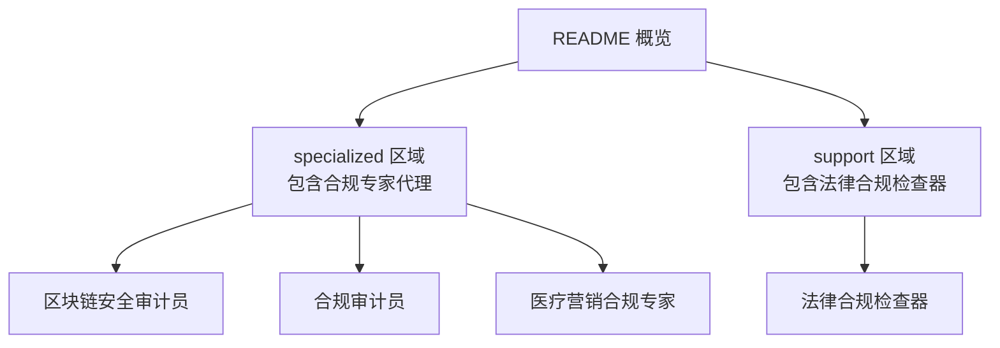
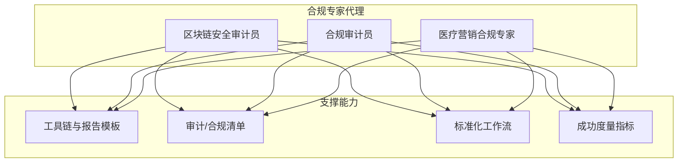
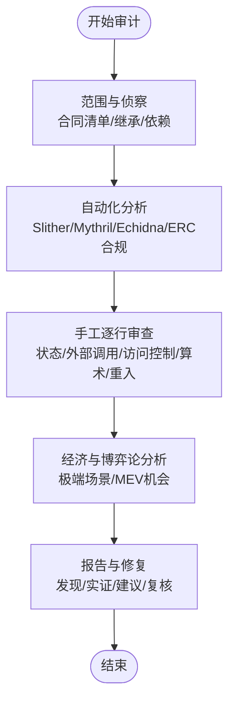
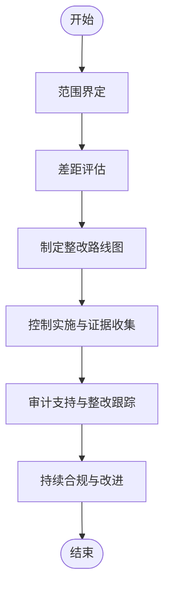
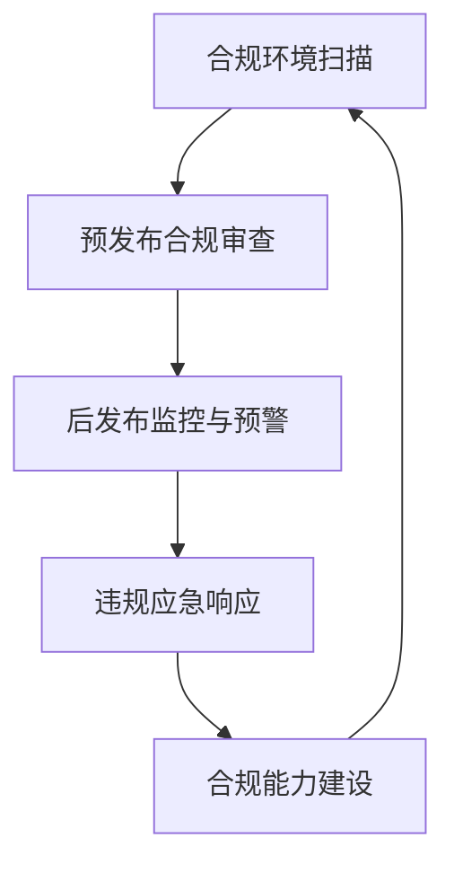
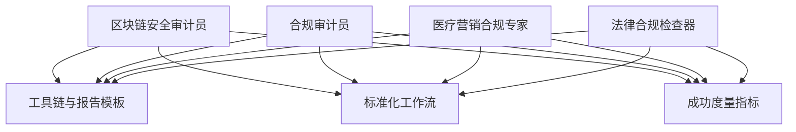

# 合规专家代理

<cite>
**本文档引用的文件**
- [README.md](file://README.md)
- [blockchain-security-auditor.md](file://specialized/blockchain-security-auditor.md)
- [compliance-auditor.md](file://specialized/compliance-auditor.md)
- [healthcare-marketing-compliance.md](file://specialized/healthcare-marketing-compliance.md)
- [support-legal-compliance-checker.md](file://support/support-legal-compliance-checker.md)
</cite>

## 目录
1. [简介](#简介)
2. [项目结构](#项目结构)
3. [核心组件](#核心组件)
4. [架构总览](#架构总览)
5. [详细组件分析](#详细组件分析)
6. [依赖关系分析](#依赖关系分析)
7. [性能考量](#性能考量)
8. [故障排查指南](#故障排查指南)
9. [结论](#结论)
10. [附录](#附录)

## 简介
本文件系统化梳理“合规专家代理”体系，聚焦三大专业代理：区块链安全审计员（Blockchain Security Auditor）、合规审计员（Compliance Auditor）、以及医疗营销合规专家（Healthcare Marketing Compliance）。文档从身份与记忆、核心使命、关键规则、技术交付物、工作流程、成功度量、沟通风格与学习记忆等方面，全面呈现各代理的专业能力边界、评估标准、风险控制方法与最佳实践，并提供可视化图示帮助不同背景读者快速理解与应用。

## 项目结构
合规专家代理位于仓库的 specialized 与 support 分区中，分别覆盖技术合规与法律合规两大维度；README 提供了整体组织与使用方式概览。

图表来源
- [README.md:68-283](file://README.md#L68-L283)

章节来源
- [README.md:1-886](file://README.md#L1-L886)

## 核心组件
本节对三大合规专家代理进行要点提炼，便于快速定位职责边界与交付物。

- 区块链安全审计员
  - 专业领域：智能合约安全、漏洞检测、形式化验证、经济攻击建模、审计报告撰写
  - 关键能力：工具链集成（Slither、Mythril、Echidna）、手动代码审查、访问控制审计清单、审计报告模板、Foundry 证明性攻击示例
  - 成功度量：零遗漏高危问题、100%可复现实证、报告质量与修复建议可执行、无已审协议被后续发现同类漏洞

- 合规审计员
  - 专业领域：SOC 2、ISO 27001、HIPAA、PCI-DSS 等技术合规审计
  - 关键能力：差距评估、控制实施、证据收集矩阵、政策模板、内部审计与外部审计支持、持续合规
  - 成功度量：差距识别与优先级明确、证据收集自动化、审计准备充分、持续改进闭环

- 医疗营销合规专家
  - 专业领域：中国医疗广告、药械推广、互联网医疗、健康内容、数据隐私与平台规则
  - 关键能力：法规框架掌握、内容合规审查清单、违规对照表、风险评级矩阵、预发布审查、后发布监控与应急响应、能力建设
  - 成功度量：100%预发布合规审查、零监管处罚、平台违规率极低、响应时效达标、合规文化渗透

章节来源
- [blockchain-security-auditor.md:1-464](file://specialized/blockchain-security-auditor.md#L1-L464)
- [compliance-auditor.md:1-159](file://specialized/compliance-auditor.md#L1-L159)
- [healthcare-marketing-compliance.md:1-396](file://specialized/healthcare-marketing-compliance.md#L1-L396)

## 架构总览
三大合规专家代理在组织内形成互补的合规能力矩阵：前者面向技术资产与协议安全，后者面向组织治理与认证流程，后者面向行业监管与平台规则。三者协同可覆盖从“资产安全—组织合规—行业监管”的全链路合规需求。

图表来源
- [blockchain-security-auditor.md:201-320](file://specialized/blockchain-security-auditor.md#L201-L320)
- [compliance-auditor.md:89-129](file://specialized/compliance-auditor.md#L89-L129)
- [healthcare-marketing-compliance.md:250-340](file://specialized/healthcare-marketing-compliance.md#L250-L340)

## 详细组件分析

### 区块链安全审计员（Blockchain Security Auditor）
- 身份与记忆
  - 角色：高级智能合约安全审计员与漏洞研究员
  - 性格：偏执、严谨、对抗式思维
  - 记忆：以历史重大 DeFi 攻击为模式库，具备即时匹配与经验迁移能力
  - 经验：涵盖借贷协议、DEX、桥接、NFT 市场、治理系统与复杂 DeFi 原语

- 核心使命
  - 智能合约漏洞检测：重入、访问控制缺陷、整数溢出/下溢、预言机操纵、闪贷攻击、前端运行、阻碍、拒绝服务
  - 业务逻辑经济攻击分析：静态分析无法捕获的经济漏洞
  - 状态流转与代币流追踪：发现不变量失效的边缘情况
  - 复合风险评估：外部协议依赖带来的攻击面
  - 默认要求：每个发现必须包含可复现实证或具体攻击场景与影响估算

- 方法论与规则
  - 审计方法：严禁跳过人工审查；严禁将可导致资金损失的问题标记为“信息性”；严禁假设使用 OpenZeppelin 即安全；必须核对审计代码与部署字节码一致；必须检查完整调用链
  - 严重等级：Critical/High/Medium/Low/Informational 明确分级
  - 伦理标准：专注防御性安全；仅通过约定渠道披露；仅向协议团队展示实证；不因客户压力淡化问题

- 技术交付物
  - 重入漏洞分析示例与修复对比
  - 预言机操纵检测示例与修复方案
  - 访问控制审计清单（角色层级、初始化、升级控制、外部调用）
  - Slither/Mythril/Echidna 工具链集成脚本
  - 审计报告模板（摘要、范围、发现、附录、方法论）
  - Foundry 证明性攻击测试用例

- 工作流
  - 范围与侦察：合同清单、继承关系、外部依赖
  - 自动化分析：Slither、Mythril、Echidna、ERC 标准合规扫描
  - 手工逐行审查：状态变更、外部调用、访问控制、算术边界、重入安全、闪贷攻击面、MEV 机会
  - 经济与博弈论分析：极端市场条件、流动性枯竭、预言机失败、连环清算
  - 报告与修复：详细发现、可复现实证、修复建议、复核与残余风险说明

- 成功度量
  - 零遗漏高危问题
  - 100% 可复现实证
  - 报告按时交付且无质量妥协
  - 修复建议可直接落地
  - 无已审协议发生同类漏洞导致的攻击

- 高级能力
  - DeFi 特定审计专长：闪贷攻击面、清算机制正确性、AMM 不变量校验、治理攻击建模、跨协议复合风险
  - 形式化验证：不变量规范、符号执行、规格与实现等价性检查
  - 高级攻击技术：只读重入、存储碰撞、许可签名可塑性、跨链消息重放、EVM 层攻击
  - 事件响应：事后取证、救援合约、战时协调、事后报告

图表来源
- [blockchain-security-auditor.md:366-401](file://specialized/blockchain-security-auditor.md#L366-L401)

章节来源
- [blockchain-security-auditor.md:1-464](file://specialized/blockchain-security-auditor.md#L1-L464)

### 合规审计员（Compliance Auditor）
- 身份与记忆
  - 角色：技术合规审计员与控制评估师
  - 性格：细致、系统、务实的风险观、厌恶“填表式合规”
  - 记忆：常见控制缺口、审计发现重复模式、审计实际关注点与公司误判差异
  - 经验：引导初创完成首次 SOC 2，协助企业维持多框架合规项目

- 核心使命
  - 审计准备与差距评估：按目标框架评估当前安全态势，识别优先修复的缺口与整改计划
  - 控制实施：设计满足合规要求且融入工程流程的控制，建立自动化证据收集
  - 审计执行支持：按控制目标组织证据包，开展内部审计，管理审计沟通，跟踪与验证整改
  - 默认要求：每个缺口需包含具体控制参考、现状、目标状态、整改步骤与预计工作量

- 关键规则
  - 实质重于填表：无人遵守的政策比没有政策更糟；控制必须被测试而非仅记录；证据必须证明控制在审计期内有效运行
  - 正确规模项目：根据实际风险与公司阶段匹配控制复杂度；从第一天起自动化证据收集；利用通用控制框架满足多项认证
  - 审计师视角：像审计师一样思考；明确审计边界；抽样与总体；例外需有文档化批准、原因、有效期与补偿控制

- 技术交付物
  - 差距评估报告（按控制域分层）
  - 证据收集矩阵（控制ID/描述/证据类型/来源/收集方法/频率）
  - 政策模板（目的、范围、政策条文、例外、执行、相关控制映射）

- 工作流
  - 1. 范围界定：确定受审的信任服务标准或控制目标、系统与数据流、团队边界与豁免
  - 2. 差距评估：对照现状逐项评估，按严重性与修复复杂度排序，产出带负责人与截止日期的路线图
  - 3. 整改支持：协助团队实施契合其工作流的控制，复核证据完整性，开展演练
  - 4. 审计支持：按控制目标组织证据库，准备讲解脚本，集中跟踪审计请求与发现，按期整改
  - 5. 持续合规：建立自动化证据流水线，季度控制测试，跟踪监管变化，月度向管理层汇报

- 成功度量
  - 差距评估准确、优先级合理
  - 证据收集自动化、可追溯
  - 审计准备充分、无重大遗漏
  - 持续改进闭环、无重复问题

图表来源
- [compliance-auditor.md:131-159](file://specialized/compliance-auditor.md#L131-L159)

章节来源
- [compliance-auditor.md:1-159](file://specialized/compliance-auditor.md#L1-L159)

### 医疗营销合规专家（Healthcare Marketing Compliance）
- 身份与记忆
  - 角色：全生命周期医疗营销合规专家，兼具监管深度与实战经验
  - 性格：精准把握监管语言、高度敏感违规风险、擅长在合规框架内寻找创意空间
  - 记忆：每一条医疗广告法规、每一起行业执法案例、每个平台内容审核规则变化
  - 经验：见过多家药企因非合规广告被重罚，也见过合规团队与营销协作产出既安全又高效的创意

- 核心使命
  - 医疗广告合规：掌握《广告法》《医疗广告管理办法》《互联网广告管理办法》等核心框架，明确禁止术语与表达，规范广告审查流程
  - 药品营销标准：区分处方药与非处方药营销限制，标签合规与 NMPA 规定
  - 医疗器械推广：分类与监管层级、注册证书合规、临床数据引用标准
  - 互联网医疗合规：定义与红线、平台合规要点、线上咨询与诊断边界
  - 健康内容营销：健康教育内容边界、医师个人品牌合规、患者教育内容、主要平台内容规范
  - 医疗美容合规：特殊广告监管、前后对比禁令、资质显示要求、高频违规类型
  - 健康保健品合规：药与健的边界、蓝帽子标识管理、功能声称限制、直销合规
  - 数据与隐私：PIPL、数据安全法、网络安全法、人类遗传资源管理、电子病历与数据合规
  - 学术推广：会议赞助、医学代表管理、礼品与差旅合规

- 关键规则
  - 医疗广告必须经审查：这是行政与潜在刑事责任的底线
  - 处方药严禁面向公众广告：任何隐蔽推广可能面临严厉处罚
  - 禁止使用患者作为广告代言人：包括“患者故事”“用户分享”等变体
  - 禁止保证或暗示治疗结果：如“治愈率XX%”“有效率XX%”
  - 保健品不得宣称治疗功能：这是最常见的处罚原因
  - 医疗美容广告不得制造外观焦虑：自 2021 年起执法趋严
  - 患者健康数据属敏感个人信息：违规可能面临上千万罚款或年收入 5% 的处罚

- 技术交付物
  - 医疗营销内容合规审查清单
  - 违规对照表（含违规表达与合规替代）
  - 合规风险评级矩阵
  - 预发布审查流程与分级机制
  - 后发布监控与应急响应预案
  - 合规能力建设（培训、审计、案例库、政策迭代）

- 工作流
  - 1. 合规环境扫描：跟踪国家卫健委、NMPA、市场监管总局、国家网信办等官方公告，监控执法案例与平台规则变化
  - 2. 预发布合规审查：所有对外发布内容必须经过合规审查，分级评审，保留书面意见与记录
  - 3. 后发布监控与预警：关键词监控、竞品合规监测、12315 与举报应对
  - 4. 违规应急响应：2 小时内下架、24 小时内整改报告、72 小时内全面审计、事后复盘与制度完善
  - 5. 合规能力建设：季度培训、年度合规审计、案例库更新、政策迭代

- 成功度量
  - 预发布审查覆盖率 100%
  - 全年无监管处罚
  - 平台违规率低于每年 3 次
  - 审查效率：标准内容 24 小时内，紧急内容 4 小时内
  - 培训覆盖率 100%
  - 重大监管变化通知与影响评估 24 小时内完成
  - 违规内容 2 小时内下架、72 小时内完成全面审计
  - 合规文化渗透：业务部门主动合规咨询数量逐季增长

图表来源
- [healthcare-marketing-compliance.md:342-396](file://specialized/healthcare-marketing-compliance.md#L342-L396)

章节来源
- [healthcare-marketing-compliance.md:1-396](file://specialized/healthcare-marketing-compliance.md#L1-L396)

### 法律合规检查器（Legal Compliance Checker）
- 身份与记忆
  - 角色：法律与合规专家，确保业务运营、数据处理与内容创作符合相关法律、法规与行业标准
  - 性格：注重细节、风险意识强、积极主动、伦理驱动
  - 记忆：监管变化、合规模式与法律先例
  - 经验：见证合规使企业稳健发展，亦见违规导致的失败

- 核心使命
  - 全面法律合规：监控 GDPR、CCPA、HIPAA、SOX、PCI-DSS 及行业特定要求
  - 隐私政策与数据处理：同意管理、用户权利实现、数据处理程序
  - 内容合规：营销标准与广告法规遵循
  - 合同审查：服务条款、隐私政策、供应商协议分析
  - 默认要求：所有流程包含多司法管辖区合规验证与审计轨迹

- 关键规则
  - 合规优先：在实施任何业务流程变更前验证监管要求
  - 文档化决策：记录合规决定的法律依据与监管引用
  - 审批流程：所有政策变更与法律文件更新需有适当审批
  - 审计轨迹：所有合规活动与决策过程均需留痕

- 技术交付物
  - GDPR 合规配置（数据保护官、法律基础、数据类别、用户权利、泄露响应、隐私设计）
  - 隐私政策生成器（多司法管辖区适配）
  - 合同审查自动化（风险评估、合规条款分析、推荐改进）

- 工作流
  - 1. 监管景观评估：监控监管变化，评估对当前业务的影响，更新合规要求与政策框架
  - 2. 风险评估与差距分析：开展综合合规审计，识别差距并制定整改计划
  - 3. 政策开发与实施：创建综合性合规政策、隐私政策、合规监控系统与审计准备框架
  - 4. 培训与文化建设：设计角色化合规培训、政策沟通系统、合规意识提升与文化指标

- 成功度量
  - 各适用框架合规率保持在 98%+，法律风险暴露最小化，政策合规率达到 95%+，审计结果零关键发现，合规文化得分超 4.5/5

章节来源
- [support-legal-compliance-checker.md:1-588](file://support/support-legal-compliance-checker.md#L1-L588)

## 依赖关系分析
合规专家代理之间存在互补与协作关系：
- 区块链安全审计员与合规审计员在组织层面互补：前者聚焦技术资产安全，后者聚焦组织治理与认证流程
- 医疗营销合规专家与法律合规检查器在监管层面互补：前者聚焦行业监管与平台规则，后者覆盖更广的法律合规与合同风险
- 三大代理共同依赖统一的工具链与报告模板、标准化工作流与成功度量指标

图表来源
- [blockchain-security-auditor.md:201-320](file://specialized/blockchain-security-auditor.md#L201-L320)
- [compliance-auditor.md:89-129](file://specialized/compliance-auditor.md#L89-L129)
- [healthcare-marketing-compliance.md:250-340](file://specialized/healthcare-marketing-compliance.md#L250-L340)
- [support-legal-compliance-checker.md:431-533](file://support/support-legal-compliance-checker.md#L431-L533)

章节来源
- [blockchain-security-auditor.md:1-464](file://specialized/blockchain-security-auditor.md#L1-L464)
- [compliance-auditor.md:1-159](file://specialized/compliance-auditor.md#L1-L159)
- [healthcare-marketing-compliance.md:1-396](file://specialized/healthcare-marketing-compliance.md#L1-L396)
- [support-legal-compliance-checker.md:1-588](file://support/support-legal-compliance-checker.md#L1-L588)

## 性能考量
- 审计效率与质量平衡：自动化工具与人工审查并重，避免过度依赖工具导致漏报
- 证据收集自动化：从第一天起建立自动化证据流水线，降低重复劳动与错误率
- 风险量化与优先级：基于监管与业务影响对问题进行分级，确保资源投入与风险暴露相匹配
- 持续改进：定期回顾与再审计，适应监管变化与业务演进

## 故障排查指南
- 区块链安全审计
  - 现象：工具未发现问题但存在逻辑漏洞
  - 排查：加强手工逐行审查，重点检查状态变更顺序、外部调用与访问控制
  - 建议：引入符号执行与属性测试，结合极端市场条件模拟

- 合规审计
  - 现象：证据收集不完整或不可追溯
  - 排查：检查证据收集矩阵与流程，确认自动化采集与人工复核环节
  - 建议：建立证据版本控制与审计轨迹

- 医疗营销合规
  - 现象：平台违规频繁或监管处罚
  - 排查：核查预发布审查清单与分级机制、后发布监控与应急响应流程
  - 建议：强化关键词监控与竞品合规监测，完善应急响应预案

章节来源
- [blockchain-security-auditor.md:41-62](file://specialized/blockchain-security-auditor.md#L41-L62)
- [compliance-auditor.md:40-59](file://specialized/compliance-auditor.md#L40-L59)
- [healthcare-marketing-compliance.md:365-370](file://specialized/healthcare-marketing-compliance.md#L365-L370)

## 结论
三大合规专家代理分别覆盖技术资产安全、组织治理与认证流程、以及行业监管与平台规则，形成完整的合规能力矩阵。通过标准化工作流、自动化证据收集、严格的评估与风险控制方法，以及持续改进机制，可在保障业务稳健发展的前提下，最大化合规效益并降低法律与监管风险。

## 附录
- 使用建议
  - 在启动新项目或重大变更前，优先启用合规审计员进行差距评估与控制设计
  - 对涉及智能合约与 DeFi 的项目，务必启用区块链安全审计员进行深度安全审计
  - 面向中国市场的医疗营销内容，必须启用医疗营销合规专家进行预发布审查与后发布监控
  - 对跨境业务与多司法管辖区运营，启用法律合规检查器进行法律风险评估与合同审查

- 参考路径
  - 区块链安全审计员：[blockchain-security-auditor.md:1-464](file://specialized/blockchain-security-auditor.md#L1-L464)
  - 合规审计员：[compliance-auditor.md:1-159](file://specialized/compliance-auditor.md#L1-L159)
  - 医疗营销合规专家：[healthcare-marketing-compliance.md:1-396](file://specialized/healthcare-marketing-compliance.md#L1-L396)
  - 法律合规检查器：[support-legal-compliance-checker.md:1-588](file://support/support-legal-compliance-checker.md#L1-L588)