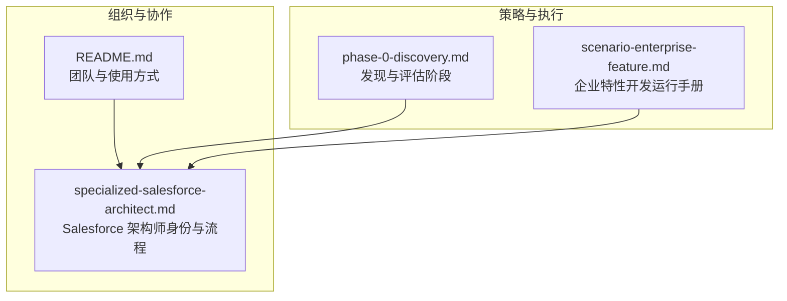
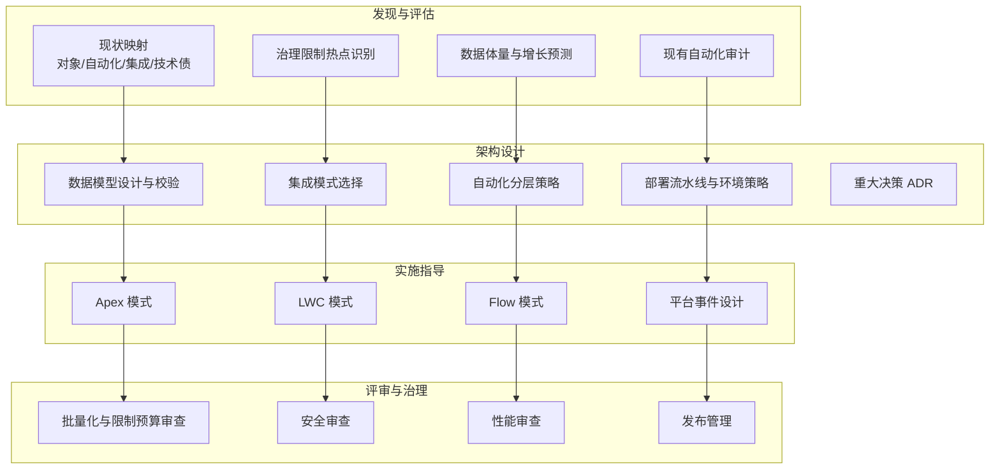
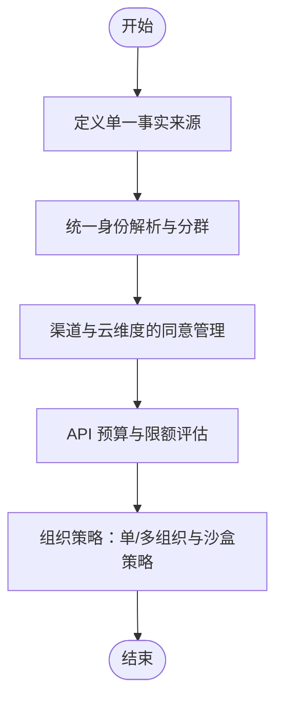
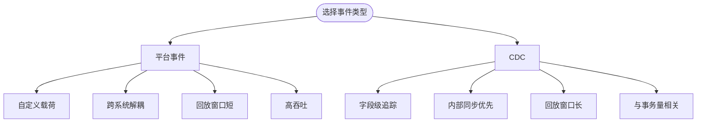
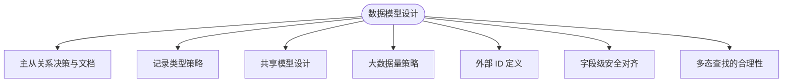
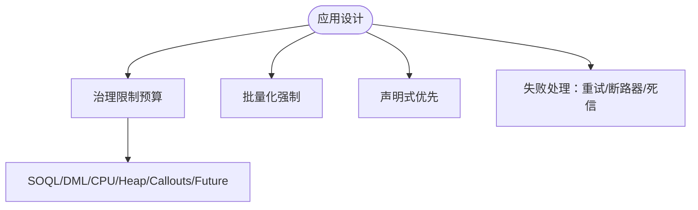
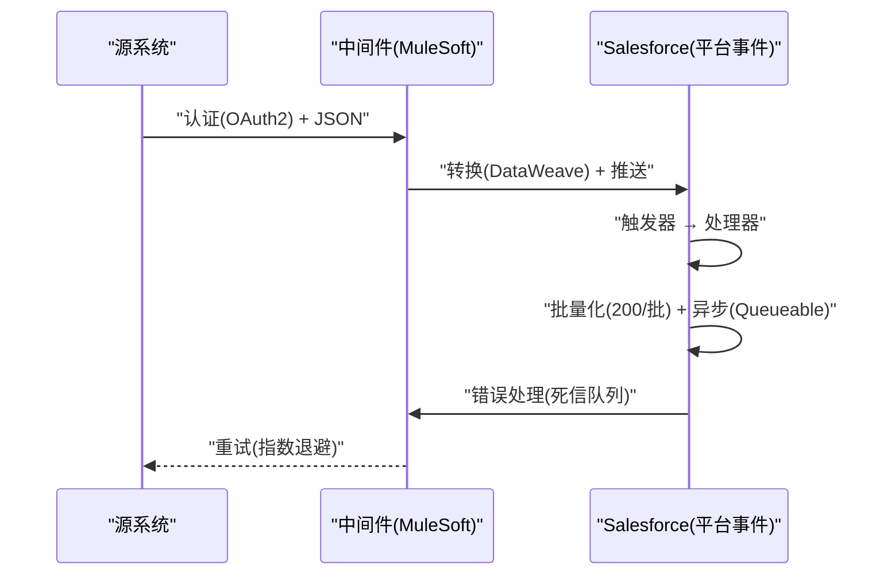
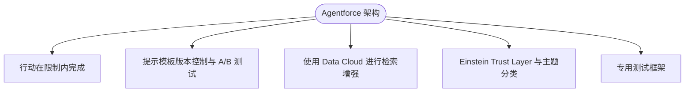
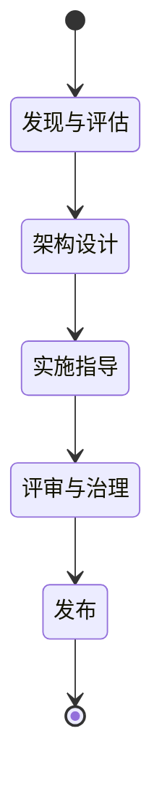
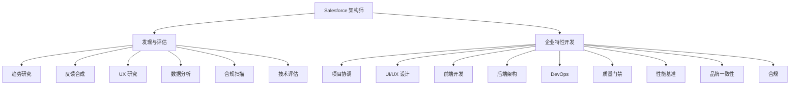

# Salesforce 架构师

<cite>
**本文引用的文件**
- [specialized-salesforce-architect.md](file://specialized/specialized-salesforce-architect.md)
- [README.md](file://README.md)
- [phase-0-discovery.md](file://strategy/playbooks/phase-0-discovery.md)
- [scenario-enterprise-feature.md](file://strategy/runbooks/scenario-enterprise-feature.md)
</cite>

## 目录
1. [简介](#简介)
2. [项目结构](#项目结构)
3. [核心组件](#核心组件)
4. [架构总览](#架构总览)
5. [详细组件分析](#详细组件分析)
6. [依赖分析](#依赖分析)
7. [性能考量](#性能考量)
8. [故障排查指南](#故障排查指南)
9. [结论](#结论)
10. [附录](#附录)

## 简介
本文件面向企业级 CRM 解决方案架构师，围绕 Salesforce 平台的系统设计、数据架构、集成架构与业务流程优化进行深入阐述。目标是帮助读者理解如何为企业构建可扩展的 CRM 架构，覆盖对象关系设计、页面布局优化、工作流自动化、报告与仪表板设计、移动应用集成等关键领域，并结合最佳实践、性能优化策略、安全与合规、以及迁移规划，形成一套可落地的工程化方法论。

Salesforce 架构师代理以“多云架构、集成模式、治理限制、部署策略、数据模型治理”为核心能力域，强调从试点到企业规模的平滑演进，确保技术债可控、性能与安全达标、交付稳定可靠。

## 项目结构
该仓库是一个多职能 Agent 集合，Salesforce 架构师作为“专业化 Agent”，与其他工程、设计、营销、产品、项目管理、测试、支持等领域的 Agent 协同工作，形成端到端的组织级解决方案交付体系。Salesforce 架构师在其中承担“系统设计—评审—治理”的关键角色，贯穿 Discovery、Foundation、Build、Hardening、Launch 等阶段。

图表来源
- [README.md:1-886](file://README.md#L1-L886)
- [specialized-salesforce-architect.md:1-181](file://specialized/specialized-salesforce-architect.md#L1-L181)
- [phase-0-discovery.md:1-179](file://strategy/playbooks/phase-0-discovery.md#L1-L179)
- [scenario-enterprise-feature.md:1-158](file://strategy/runbooks/scenario-enterprise-feature.md#L1-L158)

章节来源
- [README.md:1-886](file://README.md#L1-L886)
- [specialized-salesforce-architect.md:1-181](file://specialized/specialized-salesforce-architect.md#L1-L181)

## 核心组件
- 多云架构：Sales Cloud、Service Cloud、Marketing Cloud、Commerce Cloud、Data Cloud、Agentforce 的协同与边界划分，明确“单一事实来源”、统一身份解析、渠道同意管理与 API 预算差异。
- 企业集成模式：REST、平台事件、变更数据捕获（CDC）、MuleSoft 与中间件的组合，强调失败处理（重试、断路器、死信队列）。
- 数据模型设计与治理：主从关系决策、记录类型策略、共享模型、大表策略、外部 ID、字段级安全、多态查找的权衡。
- 部署策略与 CI/CD：Salesforce DX、Scratch Org、DevOps Center，环境策略与发布管理。
- 治理限制感知的应用设计：严格遵守 SOQL、DML、CPU、堆内存、调用次数、未来调用等限制，强制批量化、触发器无业务逻辑、声明式优先。
- 组织策略：单组织 vs 多组织、沙盒策略、AppExchange ISV 架构。
- 高级能力：平台事件与 CDC 的取舍、Agentforce 架构中的提示模板、检索增强生成（RAG）、信任层与测试框架。

章节来源
- [specialized-salesforce-architect.md:39-181](file://specialized/specialized-salesforce-architect.md#L39-L181)

## 架构总览
下图展示了企业级 CRM 架构的关键抽象：从“发现与评估”到“架构设计—实施—评审—治理—发布”的闭环，Salesforce 架构师负责在每个环节提供架构决策、技术交付物与成功度量。

图表来源
- [specialized-salesforce-architect.md:117-143](file://specialized/specialized-salesforce-architect.md#L117-L143)

章节来源
- [specialized-salesforce-architect.md:117-143](file://specialized/specialized-salesforce-architect.md#L117-L143)

## 详细组件分析

### 1) 多云数据架构与组织策略
- 单一事实来源：明确各云的数据域归属，避免重复与冲突。
- 统一身份：Data Cloud 提供统一画像，Marketing Cloud 负责分群与触达。
- 同意管理：按渠道与云维度跟踪用户同意状态。
- API 预算：不同云的 API 限额需分别评估与预留。
- 组织策略：单组织与多组织的选择取决于合规、隔离与成本；沙盒策略需覆盖开发、测试、预生产与生产。

图表来源
- [specialized-salesforce-architect.md:166-172](file://specialized/specialized-salesforce-architect.md#L166-L172)

章节来源
- [specialized-salesforce-architect.md:166-172](file://specialized/specialized-salesforce-architect.md#L166-L172)

### 2) 平台事件与 CDC 的取舍
- 自定义载荷：平台事件支持自定义 Schema；CDC 不支持。
- 跨系统集成：平台事件更利于解耦；CDC 更适合 Salesforce 内部同步。
- 字段级追踪：CDC 可捕获具体字段变化；平台事件不可。
- 回放窗口：平台事件 72 小时；CDC 3 天。
- 体积与场景：平台事件高吞吐标准可达 10 万/日；CDC 与对象事务量相关；前者用于“发生了什么”，后者用于“哪里变了”。

图表来源
- [specialized-salesforce-architect.md:155-164](file://specialized/specialized-salesforce-architect.md#L155-L164)

章节来源
- [specialized-salesforce-architect.md:155-164](file://specialized/specialized-salesforce-architect.md#L155-L164)

### 3) 数据模型设计与治理清单
- 主从 vs 查找：必须有明确理由与文档。
- 记录类型：避免过度使用，保持简洁。
- 共享模型：含 OWD、共享规则、手动分享。
- 大数据量策略：瘦表、索引、归档计划。
- 外部 ID：为集成对象定义外部 ID。
- 字段级安全：与配置文件/权限集对齐。
- 多态查找：复杂化报表，需充分论证。

图表来源
- [specialized-salesforce-architect.md:95-104](file://specialized/specialized-salesforce-architect.md#L95-L104)

章节来源
- [specialized-salesforce-architect.md:95-104](file://specialized/specialized-salesforce-architect.md#L95-L104)

### 4) 治理限制预算与应用设计
- 同步事务预算：SOQL 查询、DML 语句、CPU 时间、堆大小、调用次数、未来调用数。
- 强制批量化：禁止逐条处理；触发器无业务逻辑。
- 声明式优先：在满足批量化与复杂度的前提下，优先使用 Flows、公式与验证规则。
- 失败处理：所有对外调用必须具备重试、断路器与死信队列。

图表来源
- [specialized-salesforce-architect.md:29-37](file://specialized/specialized-salesforce-architect.md#L29-L37)

章节来源
- [specialized-salesforce-architect.md:29-37](file://specialized/specialized-salesforce-architect.md#L29-L37)

### 5) 集成模式模板与失败处理
- 源系统 → 中间件（MuleSoft）→ Salesforce（平台事件）
- 认证：OAuth2；格式：JSON；速率：每分钟 100 次；重试：指数退避 3 次；死信：错误对象；异步：Queueable；批量：200 条/批。

图表来源
- [specialized-salesforce-architect.md:81-93](file://specialized/specialized-salesforce-architect.md#L81-L93)

章节来源
- [specialized-salesforce-architect.md:81-93](file://specialized/specialized-salesforce-architect.md#L81-L93)

### 6) Agentforce 架构要点
- 行动需在治理限制内完成；提示模板版本控制与 A/B 测试；检索增强生成（RAG）使用 Data Cloud；信任层与路由守卫；测试采用专用框架。

图表来源
- [specialized-salesforce-architect.md:174-180](file://specialized/specialized-salesforce-architect.md#L174-L180)

章节来源
- [specialized-salesforce-architect.md:174-180](file://specialized/specialized-salesforce-architect.md#L174-L180)

### 7) 工作流过程与成功度量
- 发现与评估：现状映射、限制热点、体量与增长、自动化审计。
- 架构设计：数据模型、集成模式、自动化分层、部署流水线、ADR。
- 实施指导：Apex/LWC/Flow/平台事件模式。
- 评审与治理：批量化与限制预算审查、安全审查、性能审查、发布管理。
- 成功度量：零治理限制异常、数据模型支持 10 倍扩容、集成失败优雅处理、新开发者一周上手、每日发布、技术债量化与修复计划。

图表来源
- [specialized-salesforce-architect.md:117-151](file://specialized/specialized-salesforce-architect.md#L117-L151)

章节来源
- [specialized-salesforce-architect.md:117-151](file://specialized/specialized-salesforce-architect.md#L117-L151)

## 依赖分析
Salesforce 架构师在组织内的依赖关系体现在与多领域 Agent 的协作中：
- 与“发现与评估”阶段的协作：趋势研究、反馈合成、UX 研究、数据分析、合规扫描、技术评估。
- 与“企业特性开发”阶段的协作：项目协调、需求转化、UI/UX 设计、前端/后端实现、DevOps、质量门禁、性能基准、合规与品牌一致性。

图表来源
- [phase-0-discovery.md:1-179](file://strategy/playbooks/phase-0-discovery.md#L1-L179)
- [scenario-enterprise-feature.md:1-158](file://strategy/runbooks/scenario-enterprise-feature.md#L1-L158)

章节来源
- [phase-0-discovery.md:1-179](file://strategy/playbooks/phase-0-discovery.md#L1-L179)
- [scenario-enterprise-feature.md:1-158](file://strategy/runbooks/scenario-enterprise-feature.md#L1-L158)

## 性能考量
- 查询计划与选择性过滤：避免全表扫描，合理使用索引与选择性条件。
- 批量化与异步卸载：将 CPU 密集型与 IO 密集型操作异步化，减少同步事务压力。
- 平台事件与 CDC 的容量与回放窗口：根据业务事件频率与数据同步需求选择合适机制。
- API 限额与速率控制：为不同云的 API 限额预留缓冲，实施速率限制与重试策略。
- 移动应用集成：关注离线与同步策略、缓存与增量更新、网络异常处理。

## 故障排查指南
- 治理限制异常：通过 Limits 类定位热点，核对 SOQL/DML/CPU/Heap/调用次数/Future 调用配额。
- 集成失败：检查重试策略、断路器阈值、死信队列处理；确认认证与格式。
- 数据模型问题：复核主从关系、记录类型、共享模型、索引与归档策略。
- 自动化迁移：从 Workflows → Flows 的迁移风险与回滚策略。
- 发布与回滚：Changeset 与 DX 的破坏性变更处理、回滚预案与演练。

章节来源
- [specialized-salesforce-architect.md:117-143](file://specialized/specialized-salesforce-architect.md#L117-L143)

## 结论
Salesforce 架构师代理以“治理限制不可谈判、批量化强制、声明式优先、失败处理完备”为基本原则，围绕多云数据架构、集成模式、数据模型治理与部署流水线，提供从发现到发布的系统化方法论。通过 ADR、集成模板、数据模型检查清单与治理预算，确保企业级 CRM 架构在性能、安全、合规与可维护性方面达到工程化标准，并支撑从试点到大规模生产的演进路径。

## 附录
- 使用建议：在实际项目中，将“发现与评估”阶段的输出作为“架构设计”的输入；在“企业特性开发”阶段，将“架构设计—实施—评审—治理”作为固定流程，确保每次迭代都有可追溯的决策与度量。