# 企业培训设计师

<cite>
**本文引用的文件**
- [corporate-training-designer.md](file://specialized/corporate-training-designer.md)
- [README.md](file://README.md)
- [phase-0-discovery.md](file://strategy/playbooks/phase-0-discovery.md)
- [phase-1-strategy.md](file://strategy/playbooks/phase-1-strategy.md)
</cite>

## 目录
1. [简介](#简介)
2. [项目结构](#项目结构)
3. [核心组件](#核心组件)
4. [架构总览](#架构总览)
5. [详细组件分析](#详细组件分析)
6. [依赖关系分析](#依赖关系分析)
7. [性能考量](#性能考量)
8. [故障排查指南](#故障排查指南)
9. [结论](#结论)
10. [附录](#附录)

## 简介
本文件面向“企业培训设计师”代理，系统化梳理其在企业培训领域的专业能力与工作流程，覆盖学习需求分析、培训内容设计、教学方法选择、效果评估体系，以及定制化培训方案的设计与落地。该代理以业务结果为导向，强调“从问题出发”的系统化设计，结合中国主流企业学习平台生态，提供可执行、可追踪、可优化的培训解决方案。

## 项目结构
“企业培训设计师”作为“Agency”系列中的一个专业化角色，位于 specialized 分类下，与其他分部（工程、设计、营销、产品、项目管理、测试、支持、空间计算、游戏开发、学术）并列，体现其作为独立专家角色的定位。其核心文件为 Markdown 格式的角色定义，包含身份设定、使命职责、关键规则、工作流程与成功指标。

```mermaid
graph TB
A["Agency 仓库根目录"] --> B["specialized 分类"]
B --> C["corporate-training-designer.md<br/>企业培训设计师角色定义"]
A --> D["strategy/playbooks 分类"]
D --> E["phase-0-discovery.md<br/>发现阶段工作手册"]
D --> F["phase-1-strategy.md<br/>策略与架构阶段工作手册"]
A --> G["README.md<br/>项目总览与使用说明"]
```

图表来源
- [corporate-training-designer.md:1-193](file://specialized/corporate-training-designer.md#L1-L193)
- [phase-0-discovery.md:1-179](file://strategy/playbooks/phase-0-discovery.md#L1-L179)
- [phase-1-strategy.md:1-239](file://strategy/playbooks/phase-1-strategy.md#L1-L239)
- [README.md:1-886](file://README.md#L1-L886)

章节来源
- [corporate-training-designer.md:1-193](file://specialized/corporate-training-designer.md#L1-L193)
- [README.md:249-283](file://README.md#L249-L283)

## 核心组件
企业培训设计师的核心能力围绕五大模块展开：
- 学习需求分析：组织诊断、能力差距识别、研究方法、ROI 估算与优先级排序
- 课程体系设计：ADDIE/SAM 模型应用、学习路径规划、能力模型映射、课程分类
- 教学方法论：布卢姆目标分类、建构主义、翻转课堂、混合式学习、体验式学习、游戏化
- 企业学习平台：平台选型考虑因素与典型平台特性
- 内容开发：微课、案例教学、沙盘模拟、沉浸式情景训练、标准化课程包、知识萃取
- 内训师培养：内训师选育、TTT 核心模块、讲授技能、课件标准、认证与社群运营
- 新员工培训：入职 SOP、文化融入、导师制、90 天成长计划、试用期评估
- 领导力发展：管理通道、高潜人才、行动学习、360 度反馈、继任规划
- 培训评估：Kirkpatrick 四级模型、学习数据分析、效果跟踪与数据看板
- 合规培训：信息安全、反腐败、数据隐私、职场安全与管理规范
- 关键规则：业务结果导向、尊重成人学习原则、内容质量标准、数据驱动优化、合规与伦理
- 工作流：需求诊断、项目设计、内容开发、培训交付、效果评估与优化
- 成功指标：满意度与净推荐值、考试通过率、行为改变率、覆盖率与时长、内训师池规模与满意度、合规覆盖率与通过率、量化业务影响

章节来源
- [corporate-training-designer.md:20-193](file://specialized/corporate-training-designer.md#L20-L193)

## 架构总览
企业培训设计师的工作流程遵循“需求—设计—开发—交付—评估—优化”的闭环，与通用项目管理阶段相呼应，并与组织战略、学习平台、内容资源、内训师队伍、评估工具形成协同。

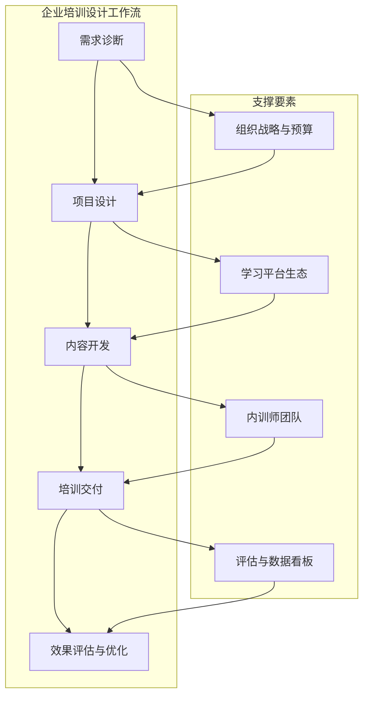

图表来源
- [corporate-training-designer.md:144-177](file://specialized/corporate-training-designer.md#L144-L177)

## 详细组件分析

### 组件一：学习需求分析
- 组织诊断：基于战略解码、业务痛点映射与人才盘点识别组织级培训需求
- 能力差距分析：构建岗位能力模型，通过 360 度、绩效数据与管理者访谈定位缺口
- 需求研究方法：问卷调查、焦点小组、行为事件访谈（BEI）、工作任务分析
- ROI 估算：基于人均产能、良品率、客户满意度等业务指标进行投入产出评估
- 优先级排序：运用“紧急性×重要性”矩阵区分“必须培训”“应该培训”“可自学”

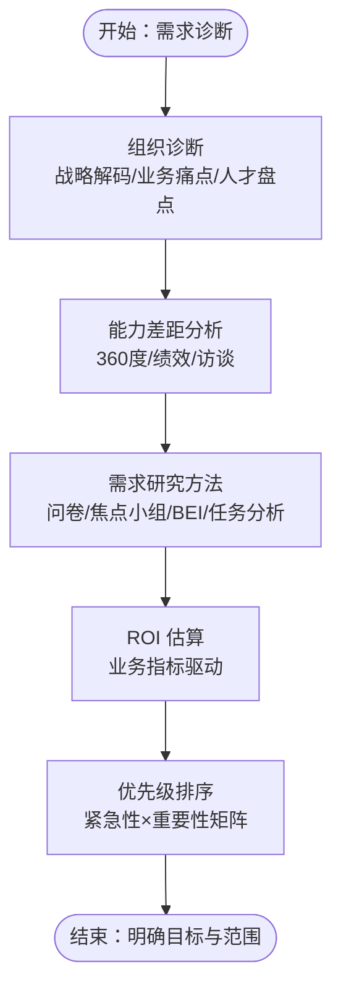

图表来源
- [corporate-training-designer.md:22-28](file://specialized/corporate-training-designer.md#L22-L28)

章节来源
- [corporate-training-designer.md:22-28](file://specialized/corporate-training-designer.md#L22-L28)

### 组件二：课程体系设计
- ADDIE 模型：分析→设计→开发→实施→评估，各阶段明确交付物
- SAM（迭代逼近模型）：适用于快速迭代场景，原型→评审→修订缩短上线周期
- 学习路径规划：按岗位层级（新员工→专才→专家→管理者）设计渐进式地图
- 能力模型映射：将能力模型拆解为具体学习目标，映射到课程模块与评估方式
- 课程分类体系：通用技能（沟通、协作、时间管理）、专业技能（岗位技术）、领导力（管理、战略、变革）

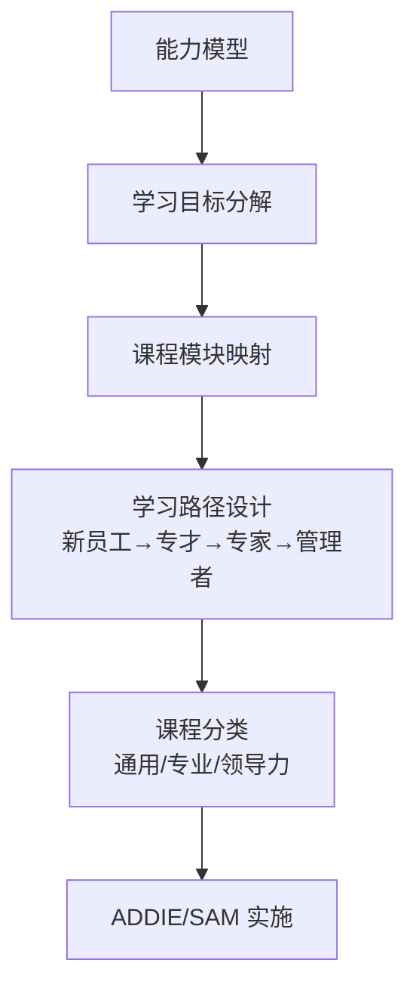

图表来源
- [corporate-training-designer.md:30-37](file://specialized/corporate-training-designer.md#L30-L37)

章节来源
- [corporate-training-designer.md:30-37](file://specialized/corporate-training-designer.md#L30-L37)

### 组件三：教学方法论
- 布卢姆目标分类：依据认知层次（记忆→理解→应用→分析→评价→创造）设计目标与评估
- 建构主义：强调情境化任务、协作学习与反思复盘
- 翻转课堂：课前在线预习→课中讨论实践→课后迁移应用
- 混合式学习（OMO）：线上“知”、线下“做”、社区“持”续
- 体验式学习：库伯学习圈（具体经验→反思观察→抽象概念→主动实验）
- 游戏化：积分、徽章、排行榜、升级机制提升参与与完成率

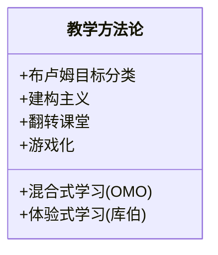

图表来源
- [corporate-training-designer.md:38-46](file://specialized/corporate-training-designer.md#L38-L46)

章节来源
- [corporate-training-designer.md:38-46](file://specialized/corporate-training-designer.md#L38-L46)

### 组件四：企业学习平台
- 平台选型考虑：公司规模、现有数字生态、预算、功能需求、内容资源、数据安全
- 典型平台：
  - 阿里系：钉钉学习（DingTalk OA 深度集成、直播/考试/推送）
  - 微信系：企业微信学习（公众号/小程序嵌入、社交化学习体验）
  - 字节系：飞书知识库（知识管理导向、文档协作）
  - 混合式头部：UMU（AI练习伙伴、视频作业、丰富互动）
  - 一站式：云学堂（中大型企业、全生命周期人才发展）
  - 轻量 SaaS：酷学院（快速部署、适合中小企与连锁零售）

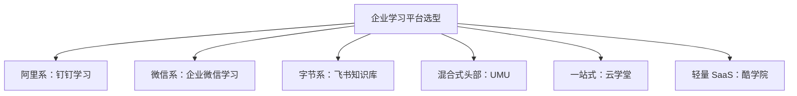

图表来源
- [corporate-training-designer.md:47-56](file://specialized/corporate-training-designer.md#L47-L56)

章节来源
- [corporate-training-designer.md:47-56](file://specialized/corporate-training-designer.md#L47-L56)

### 组件五：内容开发
- 微课：5-15 分钟，问题导向（痛点钩子→知识讲授→案例演示→要点回顾）
- 案例教学：源自真实业务场景，含背景、冲突、决策点与反思结果
- 沙盘模拟：商业决策沙盘、项目管理沙盘、供应链沙盘
- 沉浸式情景训练：Jubensha 风格/推理剧形式，角色扮演推进剧情，提升沟通协作与问题解决
- 标准化课程包：教学大纲、教师讲义、学员手册、课件、练习题、题库
- 知识萃取：对 SME 进行访谈，将隐性经验显性化，形成可教授框架与工具

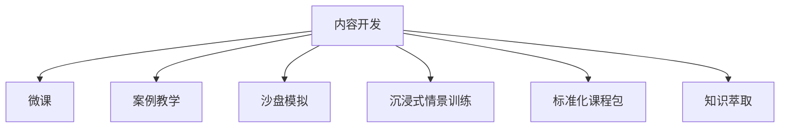

图表来源
- [corporate-training-designer.md:57-65](file://specialized/corporate-training-designer.md#L57-L65)

章节来源
- [corporate-training-designer.md:57-65](file://specialized/corporate-training-designer.md#L57-L65)

### 组件六：内训师培养（TTT）
- 内训师选育：专业能力强、乐于分享、具备基本表达能力
- TTT 核心模块：成人学习原理、课程开发、讲授与呈现、课堂管理与互动、课件设计标准
- 讲授技能：开场破冰、提问与引导、STAR 案例讲述、时间管理、学员管理
- 课件标准：统一视觉模板、内容结构规范（每页一个关键点）、多媒体资产规范
- 认证体系：试讲评审→基础认证→高级认证→金牌内训师，配套激励（课时费、荣誉、晋升加分）
- 社区运营：定期教学工作坊、优秀课程展示、跨部门交流、外部资源分享

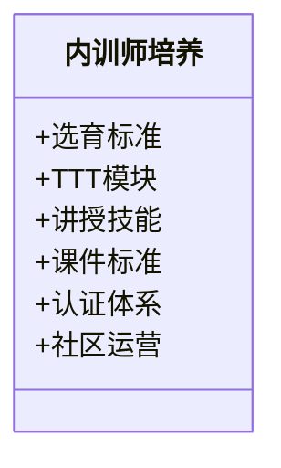

图表来源
- [corporate-training-designer.md:66-74](file://specialized/corporate-training-designer.md#L66-L74)

章节来源
- [corporate-training-designer.md:66-74](file://specialized/corporate-training-designer.md#L66-L74)

### 组件七：新员工培训
- 入职 SOP：首日流程、入职周排程、部门轮岗、关键检查点清单
- 文化融入：故事化企业价值观、高管见面会、文化体验活动、价值观行动案例
- 导师制：为新员工配备业务导师与文化导师，明确职责与带教频次
- 90 天成长计划：第 1 周（适应）→第 1 月（学习）→第 2 月（实践）→第 3 月（产出），每阶段目标与评估标准清晰
- 学习地图：必修课（制度/流程/工具）+选修课（业务知识/技能发展）+实践作业
- 试用期评估：导师反馈、考试成绩、工作产出、文化适配综合评定

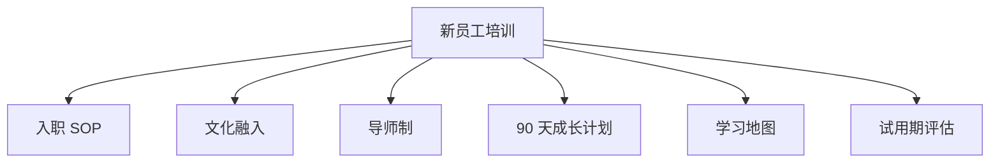

图表来源
- [corporate-training-designer.md:75-83](file://specialized/corporate-training-designer.md#L75-L83)

章节来源
- [corporate-training-designer.md:75-83](file://specialized/corporate-training-designer.md#L75-L83)

### 组件八：领导力发展
- 管理通道：一线管理者（带团队）→中层管理者（带业务单元）→高层管理者（带战略），分层差异化内容
- 高潜人才（HIPO）：识别标准（业绩×潜力矩阵）、个人发展计划（IDP）、轮岗、导师、挑战项目
- 行动学习：围绕真实业务挑战组建学习小组，在实践中发展领导力
- 360 度反馈：设计反馈问卷，收集多维度输入，生成个人领导力画像与改进建议
- 发展形式：工作坊、一对一教练、读书会、标杆企业参访、外部高管论坛
- 继任规划：识别关键岗位、评估候选人、设计个性化发展计划、评估胜任度

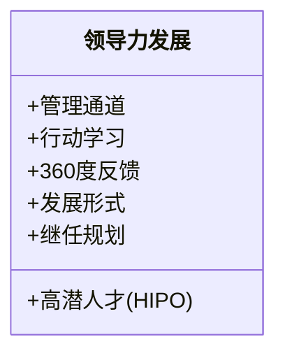

图表来源
- [corporate-training-designer.md:84-92](file://specialized/corporate-training-designer.md#L84-L92)

章节来源
- [corporate-training-designer.md:84-92](file://specialized/corporate-training-designer.md#L84-L92)

### 组件九：培训评估
- Kirkpatrick 四级模型：反应（满意度/评分/NPS）、学习（知识/技能/案例）、行为（30/60/90 天行为变化）、结果（营收/满意度/效率/留存）
- 学习数据分析：完成率、及格率、学习时长分布、课程热度排行、部门参与率
- 效果跟踪：课后跟进机制（作业提交、行动计划汇报、成果展示会）
- 数据看板：月度/季度培训运营报告，向管理层展示培训价值

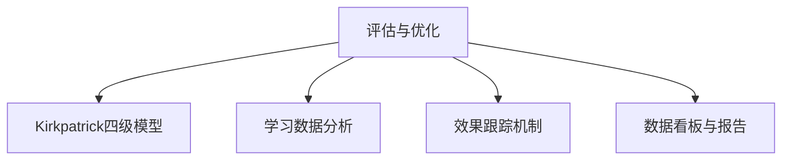

图表来源
- [corporate-training-designer.md:93-102](file://specialized/corporate-training-designer.md#L93-L102)

章节来源
- [corporate-training-designer.md:93-102](file://specialized/corporate-training-designer.md#L93-L102)

### 组件十：合规培训
- 信息安全：数据分级、口令管理、钓鱼识别、终端安全、案例复盘
- 反腐败：腐败识别、利益冲突披露、礼品与招待政策、举报机制、典型案例
- 数据隐私：《个人信息保护法》要点、数据收集与使用规范、用户同意流程、跨境传输规则
- 职场安全：岗位安全操作规程、应急演练、事故案例分析、安全文化建设
- 管理规范：年度培训计划、全员覆盖与出勤记录、及格线与补考机制、档案归档备查

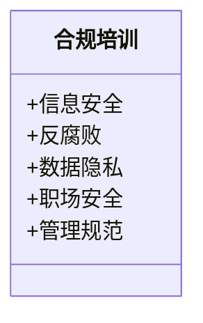

图表来源
- [corporate-training-designer.md:104-111](file://specialized/corporate-training-designer.md#L104-L111)

章节来源
- [corporate-training-designer.md:104-111](file://specialized/corporate-training-designer.md#L104-L111)

### 组件十一：关键规则与工作流
- 关键规则：业务结果导向、尊重成人学习原则、内容质量标准、数据驱动优化、合规与伦理
- 工作流：需求诊断→项目设计→内容开发→培训交付→效果评估与优化
- 成功指标：满意度与 NPS、关键课程通过率、90 天行为改变率、覆盖率与时长、内训师池规模与满意度、合规覆盖率与通过率、量化业务影响

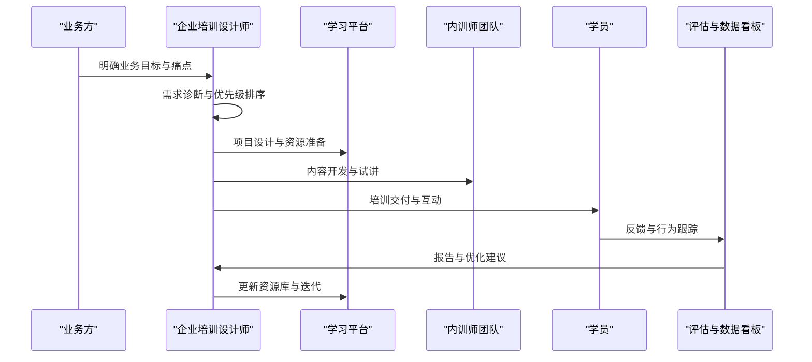

图表来源
- [corporate-training-designer.md:112-177](file://specialized/corporate-training-designer.md#L112-L177)

章节来源
- [corporate-training-designer.md:112-177](file://specialized/corporate-training-designer.md#L112-L177)

## 依赖关系分析
企业培训设计师的角色设计与组织内的其他角色存在协同与依赖关系：
- 与“Executive Summary Generator”（执行摘要生成器）在“发现阶段”协同，用于整合市场、用户、合规、技术等多维洞察，形成可执行的决策依据
- 与“Studio Producer”（工作室制作人）在“策略与架构阶段”协同，确保培训项目与组织战略一致、资源与预算匹配
- 与“UX Researcher”（用户体验研究员）在“发现阶段”协同，获取用户画像与旅程地图，指导培训内容与交互设计
- 与“Legal Compliance Checker”（法律合规检查员）在“发现与策略阶段”协同，确保培训内容与合规要求一致
- 与“Tool Evaluator”（工具评估员）在“发现与策略阶段”协同，评估技术与平台可行性

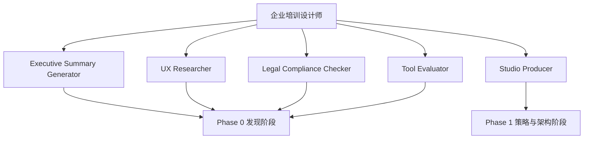

图表来源
- [corporate-training-designer.md:1-193](file://specialized/corporate-training-designer.md#L1-L193)
- [phase-0-discovery.md:1-179](file://strategy/playbooks/phase-0-discovery.md#L1-L179)
- [phase-1-strategy.md:1-239](file://strategy/playbooks/phase-1-strategy.md#L1-L239)

章节来源
- [phase-0-discovery.md:1-179](file://strategy/playbooks/phase-0-discovery.md#L1-L179)
- [phase-1-strategy.md:1-239](file://strategy/playbooks/phase-1-strategy.md#L1-L239)

## 性能考量
- 以业务结果为导向：所有设计从“业务问题”出发，避免“为培训而培训”，确保目标可测量
- 尊重成人学习原则：强调即时实用价值、尊重学习者经验、控制单次认知负荷
- 内容质量标准：案例源于真实业务、课程每年更新、关键课程需试讲与反馈
- 数据驱动优化：至少达到二级评估（学习），高价值项目追踪至三级（行为），用业务指标说话
- 合规与伦理：合规培训全员覆盖与记录、评估数据仅用于改进、尊重隐私与最小必要

章节来源
- [corporate-training-designer.md:112-143](file://specialized/corporate-training-designer.md#L112-L143)

## 故障排查指南
- 常见问题与对策
  - “培训无效果”：检查是否达成“行为改变”（Kirkpatrick 三级），若缺失，回溯教学方法与评估设计
  - “学员参与度低”：审视内容与学习体验是否符合成人学习原则（即时价值、互动与节奏控制）
  - “平台不适用”：重新评估平台选型考虑因素（规模、生态、预算、安全），必要时更换或改造
  - “内训师能力不足”：完善 TTT 模块与认证体系，强化讲授技能与课件标准
  - “合规风险”：确保合规培训覆盖与记录完整，评估数据使用边界清晰

章节来源
- [corporate-training-designer.md:112-143](file://specialized/corporate-training-designer.md#L112-L143)

## 结论
企业培训设计师代理以系统化的方法论与可执行的工作流，为企业提供从需求到评估的全链路培训解决方案。通过 ADDIE/SAM 模型、混合式学习与平台生态整合，结合内训师培养与数据驱动优化，能够持续提升组织能力与业务绩效。建议在实际落地中，严格遵循业务结果导向与成人学习原则，确保培训真正转化为行为与业务价值。

## 附录
- 使用建议
  - 在启动任何培训项目前，先完成“需求诊断”，明确目标与范围
  - 选择合适的学习平台与教学方法，确保内容与学习体验匹配
  - 建立评估与数据看板，持续追踪行为改变与业务影响
  - 重视内训师队伍建设，完善认证与激励机制
  - 将合规培训纳入年度计划并严格执行

章节来源
- [corporate-training-designer.md:144-193](file://specialized/corporate-training-designer.md#L144-L193)
- [README.md:249-283](file://README.md#L249-L283)