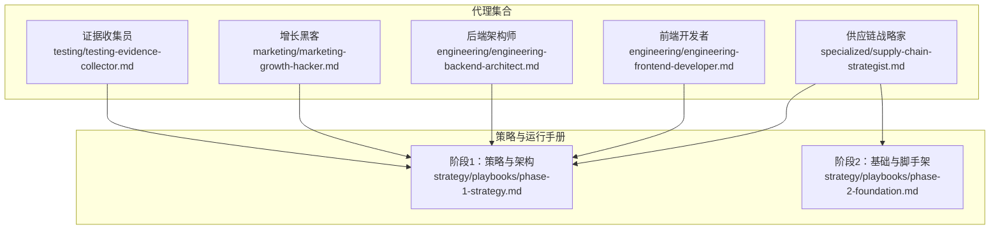
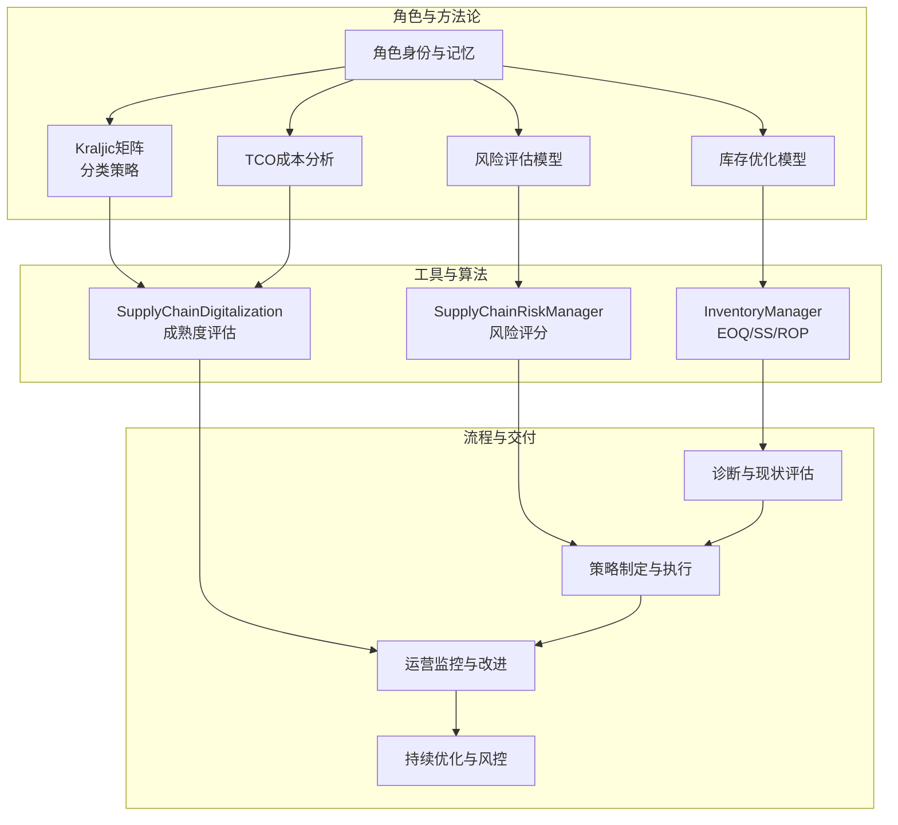
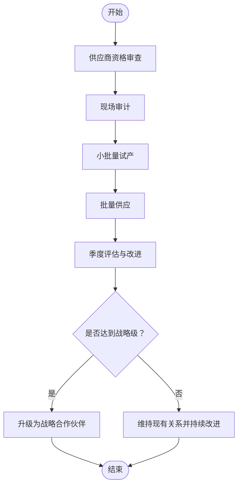
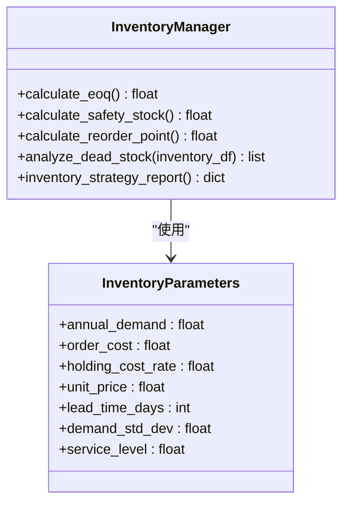
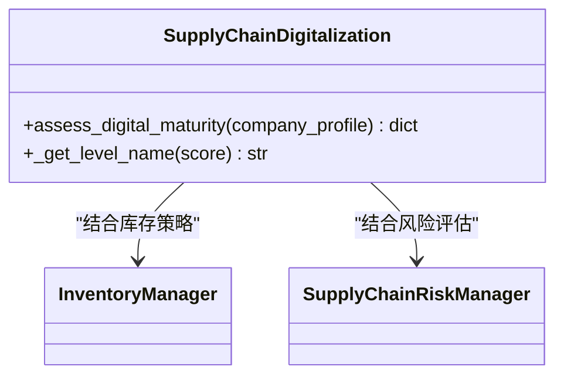
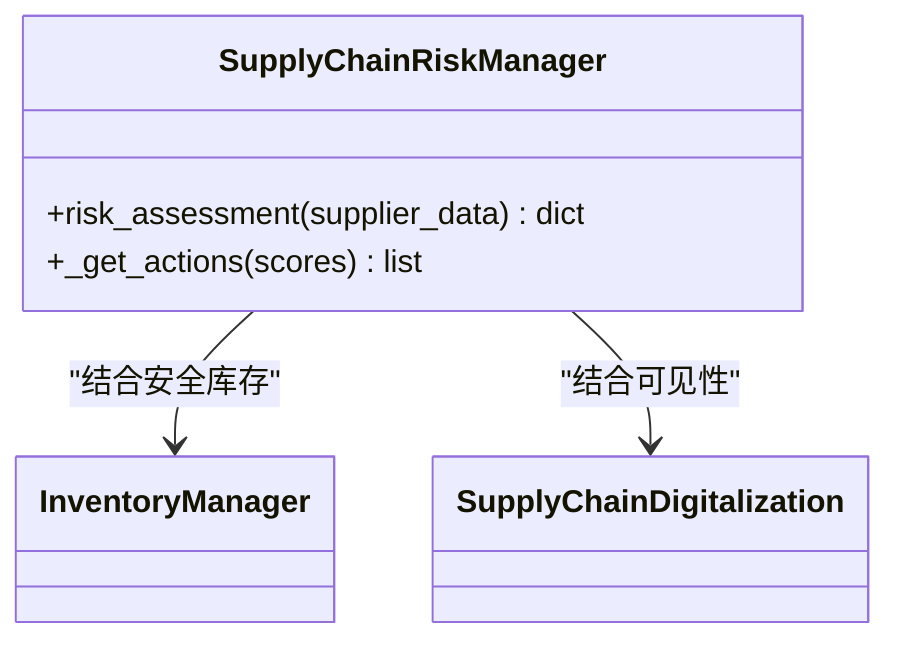
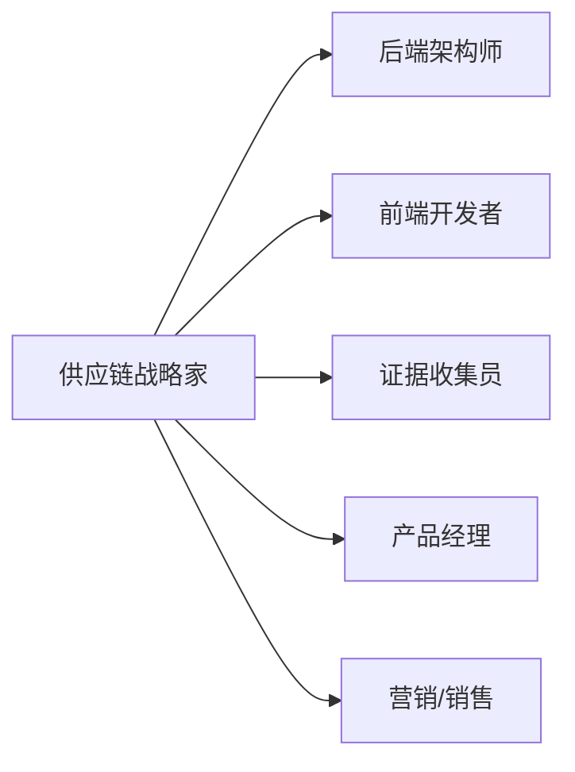

# 供应链战略家

<cite>
**本文档引用的文件**
- [supply-chain-strategist.md](file://specialized/supply-chain-strategist.md)
- [README.md](file://README.md)
- [phase-1-strategy.md](file://strategy/playbooks/phase-1-strategy.md)
- [phase-2-foundation.md](file://strategy/playbooks/phase-2-foundation.md)
</cite>

## 目录
1. [简介](#简介)
2. [项目结构](#项目结构)
3. [核心组件](#核心组件)
4. [架构总览](#架构总览)
5. [详细组件分析](#详细组件分析)
6. [依赖分析](#依赖分析)
7. [性能考虑](#性能考虑)
8. [故障排除指南](#故障排除指南)
9. [结论](#结论)
10. [附录](#附录)

## 简介
供应链战略家代理是专为制造业与贸易企业打造的供应链管理专家，聚焦于供应商关系管理、采购策略制定、库存优化、物流与仓储管理、数字化转型、成本控制与风险管理等关键领域。该代理以中国制造业生态为背景，提供从供应商开发到风险防控的全链路解决方案，并通过数据驱动与系统化方法提升供应链效率、韧性与可持续性。

## 项目结构
供应链战略家代理位于“specialized”分部，作为一组专业化AI代理之一，与其他工程、营销、产品、项目管理等领域的代理协同工作，形成“智能代理团队”。其核心文件为供应链战略家的代理定义，包含角色身份、使命目标、工作流程、技术交付物与成功指标。

图表来源
- [supply-chain-strategist.md:1-583](file://specialized/supply-chain-strategist.md#L1-L583)
- [phase-1-strategy.md:1-239](file://strategy/playbooks/phase-1-strategy.md#L1-L239)
- [phase-2-foundation.md:1-279](file://strategy/playbooks/phase-2-foundation.md#L1-L279)

章节来源
- [supply-chain-strategist.md:1-583](file://specialized/supply-chain-strategist.md#L1-L583)
- [README.md:1-886](file://README.md#L1-L886)

## 核心组件
供应链战略家代理的核心能力围绕以下六大模块展开：
- 供应商关系与开发：建立供应商分级、评估与改进闭环，推动从交易型向战略型合作转变
- 采购策略与流程：基于Kraljic矩阵的分类策略、框架协议与集中采购、合同条款设计
- 质量与交付控制：IQC/IPQC/OQC质量体系、AQL抽样标准、第三方检验与问题闭环
- 库存优化与死滞处理：EOQ/安全库存/再订货点模型、死滞品处置建议、库存健康报告
- 物流与仓储：国内物流渠道、冷链/危化品运输、WMS系统与仓库KPI
- 数字化与智能化：ERP/SRM系统对比、数字成熟度评估、AI预测与可视化

章节来源
- [supply-chain-strategist.md:20-486](file://specialized/supply-chain-strategist.md#L20-L486)

## 架构总览
供应链战略家代理采用“角色驱动 + 流程化工作流”的架构模式：
- 角色层：明确身份、个性、记忆与经验，确保在复杂供应链场景中保持一致的决策风格
- 方法论层：提供系统化的工具箱（如Kraljic矩阵、TCO分析、风险评估模型、库存模型）
- 工具层：内置Python类与函数，支持库存策略报告生成、风险评分与缓解建议、数字成熟度评估
- 流程层：将上述能力串联为诊断—策略—执行—优化的闭环工作流，配合定期复盘与持续改进

图表来源
- [supply-chain-strategist.md:62-175](file://specialized/supply-chain-strategist.md#L62-L175)
- [supply-chain-strategist.md:319-407](file://specialized/supply-chain-strategist.md#L319-L407)
- [supply-chain-strategist.md:201-285](file://specialized/supply-chain-strategist.md#L201-L285)

## 详细组件分析

### 1) 供应商关系与开发
- 供应商分级与差异化策略：ABC分类法，针对不同类别采取不同的管理与激励策略
- 绩效评估体系：QCD（质量/成本/交付）季度评分与年度淘汰机制
- 关系升级路径：从交易型转向战略型合作伙伴，强化长期协作
- 资质与记录：所有供应商必须具备完整资质档案与持续的绩效跟踪

图表来源
- [supply-chain-strategist.md:22-28](file://specialized/supply-chain-strategist.md#L22-L28)

章节来源
- [supply-chain-strategist.md:20-44](file://specialized/supply-chain-strategist.md#L20-L44)

### 2) 采购策略与流程
- 分类策略：基于Kraljic矩阵对物料进行定位，制定差异化采购策略
- 流程标准化：从需求发起、询价/比价/谈判、供应商选择到合同执行
- 渠道组合：1688/阿里巴巴、Made-in-China.com、Global Sources、JD工业品、ZhenYun、Yonyou Procurement Cloud、SAP Ariba等
- 合同管理：价格条款、质量条款、交期条款、违约条款与知识产权保护

章节来源
- [supply-chain-strategist.md:30-61](file://specialized/supply-chain-strategist.md#L30-L61)

### 3) 质量与交付控制
- 全过程质量控制：IQC/IPQC/OQC/FQC，覆盖来料、制程与出厂
- 抽样标准：AQL（GB/T 2828.1/ISO 2859-1），设定检验水平与可接受质量限
- 第三方检验：对接SGS、TÜV、BV、Intertek等机构，开展工厂审核与认证
- 问题闭环：8D报告、CAPA计划、供应商质量改进项目

章节来源
- [supply-chain-strategist.md:38-44](file://specialized/supply-chain-strategist.md#L38-L44)

### 4) 库存优化与死滞处理
- 模型选择：JIT/VMI/寄售/安全库存+ROP，依据需求稳定性与供应商距离选择
- 库存模型：EOQ、安全库存、再订货点计算；死滞品识别与处置建议
- 报告输出：年度总成本、平均库存、周转率等关键指标

图表来源
- [supply-chain-strategist.md:71-175](file://specialized/supply-chain-strategist.md#L71-L175)

章节来源
- [supply-chain-strategist.md:62-175](file://specialized/supply-chain-strategist.md#L62-L175)

### 5) 物流与仓储管理
- 国内物流：快递（顺丰/京东/通达）、零担/整车（德邦/安能/壹米滴答）、冷链/危化品运输
- 仓储管理：WMS系统（富勒/唯智/巨沃/SAP EWM/Oracle WMS）、ABC分类存储、FIFO、拣选路径优化、KPI监控

章节来源
- [supply-chain-strategist.md:184-200](file://specialized/supply-chain-strategist.md#L184-L200)

### 6) 供应链数字化与智能化
- ERP/SRM系统对比：SAP、用友U8+/YonBIP、金蝶Cloud Galaxy/Cosmic、ZhenYun、SAP Ariba
- 数字成熟度评估：维度包括采购数字化、库存可见性、供应商协作、物流追踪、数据分析，给出分层与路线图
- 高阶能力：智能需求预测、供应链可视化、区块链溯源、数字孪生仿真

图表来源
- [supply-chain-strategist.md:205-285](file://specialized/supply-chain-strategist.md#L205-L285)

章节来源
- [supply-chain-strategist.md:201-285](file://specialized/supply-chain-strategist.md#L201-L285)

### 7) 成本控制与TCO分析
- 成本构成：直接成本（单价/模具/包装/运费）、间接成本（检验/缺陷损失/库存持有/行政）、隐藏成本（切换/质量风险/延迟/协调）
- 降本框架：短期（商业谈判/集中采购/付款条件）、中期（VA/VE/材料替代/工艺优化/供应商整合）、长期（垂直整合/网络重构/联合开发/电子采购）

章节来源
- [supply-chain-strategist.md:287-317](file://specialized/supply-chain-strategist.md#L287-L317)

### 8) 风险管理与应急预案
- 风险类别：供应中断、质量、价格波动、地缘政治、物流
- 评估模型：集中度、单一来源、财务健康等指标打分，形成总体风险等级与行动建议
- 多源策略：关键材料至少2家合格供应商，战略材料至少3家；动态调整配额；国产替代

图表来源
- [supply-chain-strategist.md:323-407](file://specialized/supply-chain-strategist.md#L323-L407)

章节来源
- [supply-chain-strategist.md:319-414](file://specialized/supply-chain-strategist.md#L319-L414)

### 9) 可持续发展与合规
- 社责审计：SA8000、RBA行为准则；碳排放核算（范围1/2/3）、冲突矿物尽职调查、环境管理体系（ISO 14001）、绿色采购
- 合规要点：采购合同法、进出口合规（HS编码、许可证、原产地证书）、税务合规（增值税专票、进项税抵扣、关税）、数据安全（《数据安全法》《个人信息保护法》）

章节来源
- [supply-chain-strategist.md:416-433](file://specialized/supply-chain-strategist.md#L416-L433)

### 10) 工作流与交付物
- 诊断：供应商清单与采购支出分析、瓶颈识别、库存健康与死滞评估
- 策略：基于Kraljic矩阵的分类策略、新供应商开发、合同与框架协议
- 执行：日常采购执行、供应商绩效月报、季度改进会议
- 优化：定期风险扫描、数字化推进、库存策略优化、市场趋势跟踪

章节来源
- [supply-chain-strategist.md:457-526](file://specialized/supply-chain-strategist.md#L457-L526)

## 依赖分析
供应链战略家代理在组织内的协同关系如下：
- 与工程团队协作：在数字化阶段与后端架构师、前端开发者共同完成ERP/SRM集成与可视化建设
- 与测试团队协作：在上线前由证据收集员进行端到端验证，确保系统可用性与数据准确性
- 与营销/销售团队协作：在跨境/多渠道采购场景下，结合市场洞察与客户反馈优化供应链

图表来源
- [phase-1-strategy.md:1-239](file://strategy/playbooks/phase-1-strategy.md#L1-L239)
- [phase-2-foundation.md:1-279](file://strategy/playbooks/phase-2-foundation.md#L1-L279)

章节来源
- [phase-1-strategy.md:1-239](file://strategy/playbooks/phase-1-strategy.md#L1-L239)
- [phase-2-foundation.md:1-279](file://strategy/playbooks/phase-2-foundation.md#L1-L279)

## 性能考虑
- 数据驱动决策：通过TCO、风险评分、库存模型等量化指标减少主观判断偏差
- 自动化与标准化：集中采购、框架协议、SRM系统集成降低交易成本与管理复杂度
- 可视化与监控：供应链仪表板与KPI监控提升响应速度与透明度
- 持续改进：季度评估与年度淘汰机制推动供应商与流程的螺旋式优化

## 故障排除指南
- 供应商交付异常：优先检查集中度与单一来源风险，启动替代供应商开发与安全库存补充
- 质量波动：加强IQC与第三方检验，推动供应商质量改进计划与追溯体系建设
- 库存积压：启用死滞品处置建议，调整安全库存参数与再订货点，优化品类结构
- 数字化落地困难：从ERP基础模块起步，逐步推进SRM集成与供应商门户，避免一次性大跃进

章节来源
- [supply-chain-strategist.md:434-456](file://specialized/supply-chain-strategist.md#L434-L456)
- [supply-chain-strategist.md:319-407](file://specialized/supply-chain-strategist.md#L319-L407)

## 结论
供应链战略家代理以系统化方法论与数据工具为核心，为企业构建高效、韧性与可持续的供应链体系提供端到端支撑。通过供应商关系升级、采购流程优化、库存与物流精细化、风险管控与数字化转型，代理能够帮助企业在复杂多变的市场环境中稳定供应、降低成本、提升竞争力。

## 附录
- 成功指标参考：年采购成本下降5%-8%、供应商准时交付率≥95%、入库合格率≥99%、库存周转天数持续改善、重大断供事件响应时间<24小时、供应商评估覆盖率100%并形成季度改进闭环
- 沟通风格：以数据说话、直面风险并提出解决方案、综合考虑总成本、坦诚汇报进展与缺口

章节来源
- [supply-chain-strategist.md:551-559](file://specialized/supply-chain-strategist.md#L551-L559)
- [supply-chain-strategist.md:528-534](file://specialized/supply-chain-strategist.md#L528-L534)