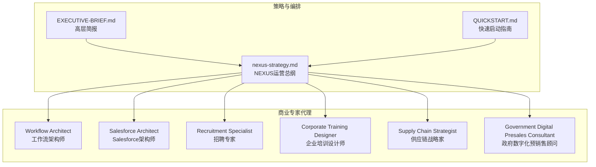
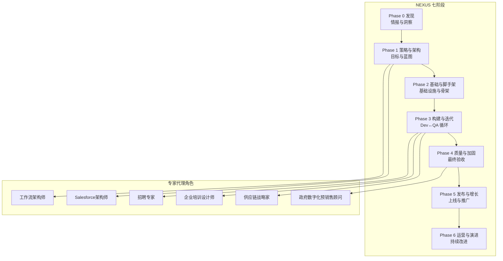
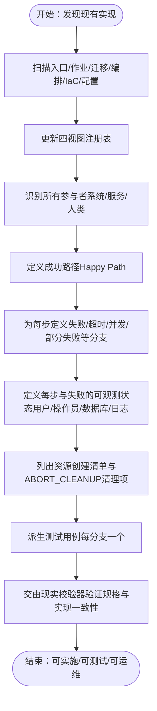
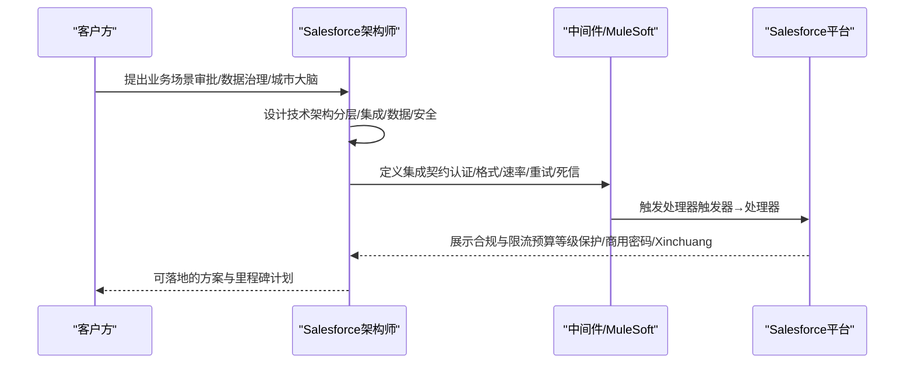
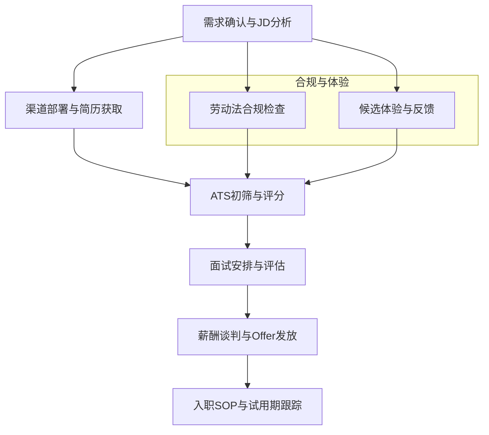
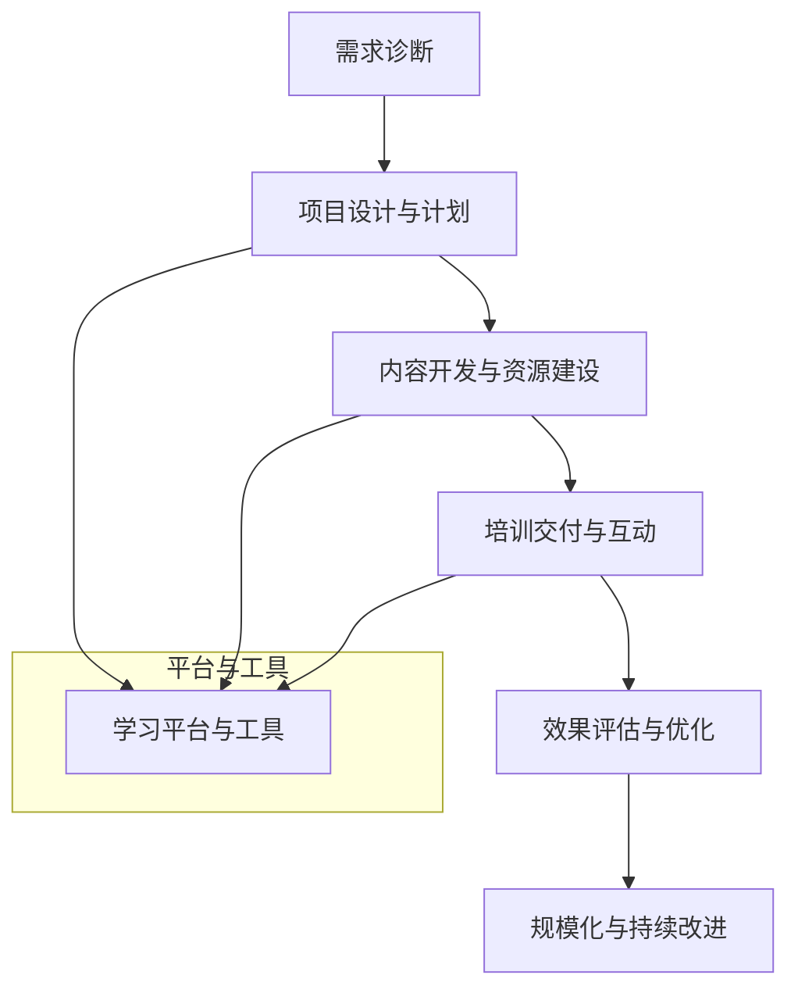
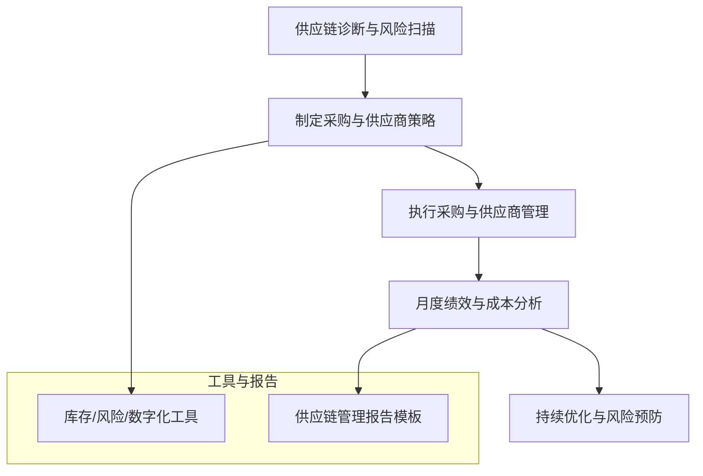
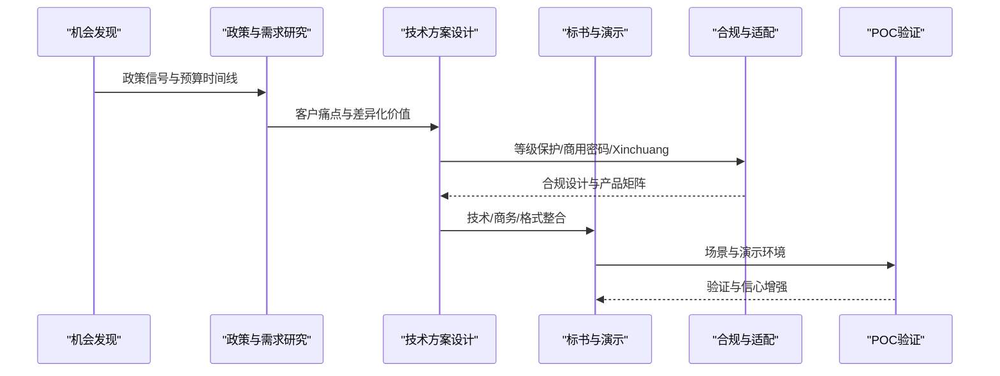
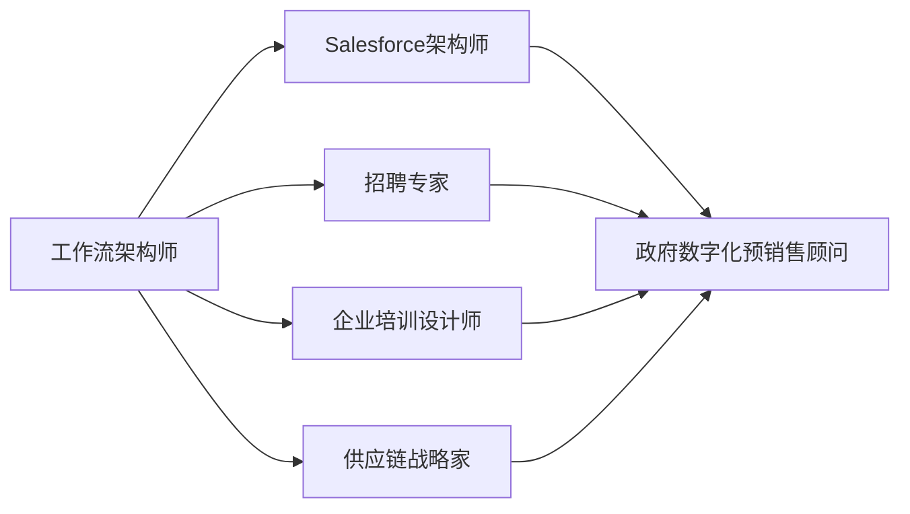

# 商业专家代理

<cite>
**本文引用的文件**
- [README.md](file://README.md)
- [specialized-workflow-architect.md](file://specialized/specialized-workflow-architect.md)
- [specialized-salesforce-architect.md](file://specialized/specialized-salesforce-architect.md)
- [recruitment-specialist.md](file://specialized/recruitment-specialist.md)
- [corporate-training-designer.md](file://specialized/corporate-training-designer.md)
- [supply-chain-strategist.md](file://specialized/supply-chain-strategist.md)
- [government-digital-presales-consultant.md](file://specialized/government-digital-presales-consultant.md)
- [EXECUTIVE-BRIEF.md](file://strategy/EXECUTIVE-BRIEF.md)
- [QUICKSTART.md](file://strategy/QUICKSTART.md)
- [nexus-strategy.md](file://strategy/nexus-strategy.md)
- [workflow-landing-page.md](file://examples/workflow-landing-page.md)
- [workflow-startup-mvp.md](file://examples/workflow-startup-mvp.md)
- [workflow-book-chapter.md](file://examples/workflow-book-chapter.md)
</cite>

## 目录
1. [简介](#简介)
2. [项目结构](#项目结构)
3. [核心组件](#核心组件)
4. [架构总览](#架构总览)
5. [详细组件分析](#详细组件分析)
6. [依赖分析](#依赖分析)
7. [性能考虑](#性能考虑)
8. [故障排查指南](#故障排查指南)
9. [结论](#结论)
10. [附录](#附录)

## 简介
本文件系统化梳理“商业专家代理”系列，围绕以下六大专业角色展开：工作流架构师（Workflow Architect）、Salesforce 架构师（Specialized Salesforce Architect）、招聘专家（Recruitment Specialist）、企业培训设计师（Corporate Training Designer）、供应链战略家（Supply Chain Strategist）、政府数字化预销售顾问（Government Digital Presales Consultant）。文档从架构设计、流程规范、交付物标准、协作机制、质量门禁、风险控制、成功度量等维度，给出可操作、可复用、可验证的实践方法论，并结合 NEXUS 多代理编排体系，帮助组织在流程优化、客户关系管理、人才招聘、员工培训、供应链管理、政府数字化等领域实现规模化、高质量交付。

## 项目结构
该仓库以“专业化代理”为核心，覆盖工程、设计、营销、产品、项目管理、测试、支持、空间计算、特殊化运营等九个主要部门，每个代理均具备明确身份、使命、规则、技术交付物、工作流与成功指标。商业专家代理位于“Specialized Division”，并与 NEXUS 战略文档协同，形成从发现到运营的全生命周期编排。

图表来源
- [EXECUTIVE-BRIEF.md:1-96](file://strategy/EXECUTIVE-BRIEF.md#L1-L96)
- [QUICKSTART.md:1-195](file://strategy/QUICKSTART.md#L1-L195)
- [nexus-strategy.md:1-800](file://strategy/nexus-strategy.md#L1-L800)
- [specialized-workflow-architect.md:1-598](file://specialized/specialized-workflow-architect.md#L1-L598)
- [specialized-salesforce-architect.md:1-181](file://specialized/specialized-salesforce-architect.md#L1-L181)
- [recruitment-specialist.md:1-510](file://specialized/recruitment-specialist.md#L1-L510)
- [corporate-training-designer.md:1-193](file://specialized/corporate-training-designer.md#L1-L193)
- [supply-chain-strategist.md:1-583](file://specialized/supply-chain-strategist.md#L1-L583)
- [government-digital-presales-consultant.md:1-364](file://specialized/government-digital-presales-consultant.md#L1-L364)

章节来源
- [README.md:250-283](file://README.md#L250-L283)

## 核心组件
- 工作流架构师：以“路径即规范”的理念，构建系统级工作流树，覆盖所有分支、失败模式、可观测状态与系统边界契约，确保实现与测试双可追溯。
- Salesforce 架构师：面向企业级多云平台的解决方案架构，强调治理、限流、集成、部署与数据模型治理，提供 ADR、集成模式与预算模板。
- 招聘专家：覆盖中国主流招聘渠道、JD优化、ATS筛选、面试流程设计、校园招聘、猎头管理、劳动法合规、雇主品牌建设、入职与试用期管理及招聘数据分析。
- 企业培训设计师：以业务结果为导向，基于 ADDIE/SAM 的学习设计方法，结合混合式学习、知识萃取、内部讲师培养、领导力发展与合规培训，建立可评估的培训闭环。
- 供应链战略家：聚焦供应商开发、战略采购、质量与交付控制、库存策略、物流与仓储、数字化与智能化、成本与风险管控，提供可落地的报告模板与工具。
- 政府数字化预销售顾问：面向 ToG 数字化市场，覆盖政策解读、机会识别、方案设计、标书准备、合规（等级保护/商用密码/Xinchuang）、POC 验证与干系人管理。

章节来源
- [specialized-workflow-architect.md:1-598](file://specialized/specialized-workflow-architect.md#L1-L598)
- [specialized-salesforce-architect.md:1-181](file://specialized/specialized-salesforce-architect.md#L1-L181)
- [recruitment-specialist.md:1-510](file://specialized/recruitment-specialist.md#L1-L510)
- [corporate-training-designer.md:1-193](file://specialized/corporate-training-designer.md#L1-L193)
- [supply-chain-strategist.md:1-583](file://specialized/supply-chain-strategist.md#L1-L583)
- [government-digital-presales-consultant.md:1-364](file://specialized/government-digital-presales-consultant.md#L1-L364)

## 架构总览
商业专家代理遵循 NEXUS 编排体系，通过“发现—策略—基础—构建—加固—发布—运营”的七阶段流水线，实现跨职能、并行化、证据驱动的质量门禁与反馈闭环。六大专家代理在不同阶段承担关键职责，形成稳定的“专家—编排—质量”的协作闭环。

图表来源
- [nexus-strategy.md:75-117](file://strategy/nexus-strategy.md#L75-L117)
- [EXECUTIVE-BRIEF.md:7-28](file://strategy/EXECUTIVE-BRIEF.md#L7-L28)
- [QUICKSTART.md:21-67](file://strategy/QUICKSTART.md#L21-L67)

## 详细组件分析

### 工作流架构师（Workflow Architect）
- 业务定位：在产品意图与实现之间，负责系统级工作流的发现、映射与规格化，确保“每条路径都可被实现、可被测试、可被运维理解”。
- 关键能力
  - 发现与登记：路由、作业、迁移、编排、IaC、配置等入口的全量扫描与登记。
  - 四视图注册表：按工作流、组件、用户旅程、状态映射交叉索引，统一权威视图。
  - 分支与契约：对每个步骤定义超时、输入输出、可观测状态、失败恢复与系统边界契约。
  - 测试用例派生：从工作流树直接生成测试用例，覆盖所有分支。
- 协作机制：与现实校验器（Reality Checker）进行“规格—实现”一致性验证；与后端架构师、安全工程师、DevOps 自动化工程师协同。
- 成功指标：零“缺失”工作流、测试用例覆盖率高、故障预测与清理路径完备、可观测性一致。

图表来源
- [specialized-workflow-architect.md:438-507](file://specialized/specialized-workflow-architect.md#L438-L507)

章节来源
- [specialized-workflow-architect.md:22-538](file://specialized/specialized-workflow-architect.md#L22-L538)

### Salesforce 架构师（Specialized Salesforce Architect）
- 业务定位：面向企业级多云（Sales/Service/Marketing/Commerce/Data Cloud/Agentforce）的平台化解决方案架构，兼顾业务影响与技术约束。
- 关键能力
  - 架构决策记录（ADR）：量化影响（如 SOQL/DML/CPU/Heap/调用量），明确权衡与再评审时间点。
  - 集成模式：REST/平台事件/变更数据捕捉/中间件，含重试、熔断、死信队列。
  - 数据模型治理：主从关系、记录类型、共享模型、大表策略、外部 ID、字段级安全、多态查找。
  - 合规与限流：等级保护（Dengbao）、商用密码（Miping）、Xinchuang 适配与测试矩阵。
- 成功指标：生产零 governor 限制异常、数据模型支撑10倍增长、集成失败可恢复、文档可让新开发者一周上手。

图表来源
- [specialized-salesforce-architect.md:54-143](file://specialized/specialized-salesforce-architect.md#L54-L143)

章节来源
- [specialized-salesforce-architect.md:29-152](file://specialized/specialized-salesforce-architect.md#L29-L152)

### 招聘专家（Recruitment Specialist）
- 业务定位：在中国本土化招聘生态中，构建从渠道运营、JD优化、简历筛选、面试设计到入职与试用期管理的全链路系统。
- 关键能力
  - 渠道运营：Boss直聘、拉勾、猎聘、智联、前程无忧、脉脉、LinkedIn中国等平台的算法与曝光优化。
  - JD 优化：基于业务与团队现状构建岗位画像，竞争性薪酬分析，A/B 测试标题与描述。
  - 简历筛选与评估：ATS 系统与评分卡、胜任力模型（专业技能/通用能力/文化契合）、人才池管理。
  - 面试设计：结构化面试、行为面试（STAR）、技术面试（在线测评）、群面与领导力评估。
  - 校园招聘：寒暑假节奏规划、宣讲会与直播、管培生轮岗与导师制、实习转正机制。
  - 猎头管理：供应商分级、费用谈判、定向执行与保证期管理。
  - 劳动法合规：合同、试用期、五险一金、竞业限制、经济补偿、合规风险与应对。
  - 雇主品牌：短视频/内容营销、员工口碑管理、奖项与荣誉展示。
  - 入职与试用期：Offer 模板与谈判、背调与合规、入职SOP、试用期评估与预警。
  - 招聘数据分析：漏斗转化、平均到岗周期、渠道ROI、留存与留任分析。
- 成功指标：关键岗位平均到岗周期<30天、Offer 接受率≥85%、试用期留任率≥90%、渠道ROI季度提升、零合规事故。

图表来源
- [recruitment-specialist.md:428-454](file://specialized/recruitment-specialist.md#L428-L454)

章节来源
- [recruitment-specialist.md:20-486](file://specialized/recruitment-specialist.md#L20-L486)

### 企业培训设计师（Corporate Training Designer）
- 业务定位：以业务结果为导向的系统化培训设计，覆盖需求分析、课程体系、教学设计、平台选择、内容开发、内训师培养、新员工培训、领导力发展与合规培训。
- 关键能力
  - 需求分析：组织诊断、能力差距、需求优先级（紧急×重要矩阵）。
  - 课程体系：ADDIE/SAM 方法、学习路径（新员工→专家→管理者）、模块与评估映射。
  - 教学设计：布鲁姆分类、建构主义、翻转课堂、混合式学习（OMO）、体验式学习、游戏化。
  - 平台与工具：钉钉学习、企业微信、飞书知识库、UMU、云学堂、KoolSchool。
  - 内训师体系：选育用留（认证、讲稿、课件、复盘、激励）。
  - 新员工培训：入职SOP、文化融入、导师制、90天成长计划、试用期评估。
  - 领导力发展：管理梯队、高潜计划、行动学习、360度反馈、继任规划。
  - 培训评估：Kirkpatrick 四级模型、学习数据分析、效果追踪与报告。
- 成功指标：满意度≥4.5/5.0、关键课程通过率≥90%、90天行为改变率≥60%、内训师规模满足业务、合规培训100%覆盖。

图表来源
- [corporate-training-designer.md:144-177](file://specialized/corporate-training-designer.md#L144-L177)

章节来源
- [corporate-training-designer.md:20-193](file://specialized/corporate-training-designer.md#L20-L193)

### 供应链战略家（Supply Chain Strategist）
- 业务定位：构建高效、韧性与可持续的供应链，覆盖供应商管理、战略采购、质量与交付控制、库存与物流、数字化与智能化、合规与ESG。
- 关键能力
  - 供应商管理：分级分类、资格审核、绩效评估（QCD）、关系升级、文件与记录。
  - 采购策略：品类定位（Kraljic矩阵）、流程标准化、工具（框架协议/集中采购/招标）、渠道组合（1688/阿里巴巴/全球资源/广交会/直采）。
  - 质量与交付：IQC/IPQC/OQC/FQC、AQL抽样、第三方检验、8D/CAPA、问题闭环。
  - 库存与物流：EOQ/安全库存/补货点、JIT/VMI/寄售、国内快递/整车/冷链/危化品、WMS与KPI。
  - 数字化与智能：ERP/SRM对比、数字成熟度评估、SRM路线图、AI预测与自动化。
  - 成本与风险：TCO分析、降本矩阵（短期/中期/长期）、风险评估与缓解（供应中断/质量/价格/地缘/物流）。
  - 合规与ESG：SA8000/RBA、碳足迹、冲突矿物、数据安全、进出口合规。
- 成功指标：采购成本年降5-8%且质量不降、准时到货率≥95%、库存周转天数下降、断供响应时间<24小时、供应商评估覆盖率100%。

图表来源
- [supply-chain-strategist.md:457-487](file://specialized/supply-chain-strategist.md#L457-L487)

章节来源
- [supply-chain-strategist.md:20-559](file://specialized/supply-chain-strategist.md#L20-L559)

### 政府数字化预销售顾问（Government Digital Presales Consultant）
- 业务定位：面向中国政府信息化（ToG）市场，提供从机会发现、政策解读、方案设计、标书准备、合规（等级保护/商用密码/Xinchuang）、POC 验证到干系人管理的全生命周期预销售服务。
- 关键能力
  - 机会发现：国家/省/市政策信号提取、项目机会矩阵、竞争格局与优劣势。
  - 方案设计：以客户痛点与业务价值为中心，突出顶层设计、标杆案例与政治正确性。
  - 标书准备：标书条款解析、技术/商务/格式审查、演示与问答准备。
  - 合规与适配：等级保护（Dengbao 2.0）、商用密码（Miping）、Xinchuang 适配与测试矩阵、数据安全与隐私保护。
  - POC 验证：场景选择、范围控制、成功标准、演示环境与离线版本。
  - 干系人管理：决策者（政策/政绩/风控）、业务层（痛点/减负）、技术层（可行/运维/扩展）、采购层（流程/预算）。
- 成功指标：中标率>40%、零因文件问题废标、机会转化率>30%、技术评分Top3、支付周期<60天、项目复盘与知识沉淀。

图表来源
- [government-digital-presales-consultant.md:309-344](file://specialized/government-digital-presales-consultant.md#L309-L344)

章节来源
- [government-digital-presales-consultant.md:20-364](file://specialized/government-digital-presales-consultant.md#L20-L364)

## 依赖分析
六大专家代理在 NEXUS 流水线中的依赖关系如下：

图表来源
- [nexus-strategy.md:554-575](file://strategy/nexus-strategy.md#L554-L575)

章节来源
- [nexus-strategy.md:554-594](file://strategy/nexus-strategy.md#L554-L594)

## 性能考虑
- 工作流架构师：通过“规格—实现”一致性验证与可观测状态定义，降低回归与故障成本，缩短修复路径。
- Salesforce 架构师：以 governor 限制预算与集成失败处理为抓手，避免性能与合规风险。
- 招聘专家：以数据驱动的渠道ROI与漏斗分析指导资源分配，减少无效投入。
- 企业培训设计师：以Kirkpatrick四级评估与学习数据分析，持续优化课程与交付方式。
- 供应链战略家：以库存模型与风险评估工具，平衡成本与供应保障。
- 政府数字化预销售顾问：以合规前置与POC验证，降低废标与返工风险。

## 故障排查指南
- 工作流架构师：若出现“缺失工作流”或“分支未覆盖”，应回溯注册表与现实校验器反馈，补充规格与测试用例。
- Salesforce 架构师：若出现 governor 限制异常，需重新审视查询/事务/调用次数预算与批量处理策略。
- 招聘专家：若渠道ROI下降，应复盘JD优化、投递策略与候选人体验，调整预算与分配。
- 企业培训设计师：若学习评估不达标，应回归教学设计与内容质量，强化实践环节与反馈闭环。
- 供应链战略家：若库存积压或断供，应重新校准需求预测、安全库存参数与供应商分级。
- 政府数字化预销售顾问：若标书被拒或评分低，应回检合规矩阵、技术方案契合度与POC演示。

章节来源
- [specialized-workflow-architect.md:540-598](file://specialized/specialized-workflow-architect.md#L540-L598)
- [specialized-salesforce-architect.md:117-152](file://specialized/specialized-salesforce-architect.md#L117-L152)
- [recruitment-specialist.md:428-486](file://specialized/recruitment-specialist.md#L428-L486)
- [corporate-training-designer.md:184-193](file://specialized/corporate-training-designer.md#L184-L193)
- [supply-chain-strategist.md:551-583](file://specialized/supply-chain-strategist.md#L551-L583)
- [government-digital-presales-consultant.md:354-364](file://specialized/government-digital-presales-consultant.md#L354-L364)

## 结论
六大商业专家代理以“专家—编排—质量”为主线，结合 NEXUS 的七阶段流水线与证据驱动的质量门禁，形成可复制、可扩展、可验证的专业服务能力。通过系统化的工作流设计、合规与限流治理、数据驱动的招聘与培训、全链路供应链优化与政府数字化预销售，组织可在复杂业务环境中稳定交付高质量成果，并持续迭代优化。

## 附录
- 示例参考：多代理协同的落地范式（如落地页冲刺、MVP 构建、书籍章节开发）展示了并行工作流、质量门禁与上下文传递的最佳实践，可作为专家代理协作的参考模板。

章节来源
- [workflow-landing-page.md:1-120](file://examples/workflow-landing-page.md#L1-L120)
- [workflow-startup-mvp.md:1-156](file://examples/workflow-startup-mvp.md#L1-L156)
- [workflow-book-chapter.md:1-56](file://examples/workflow-book-chapter.md#L1-L56)