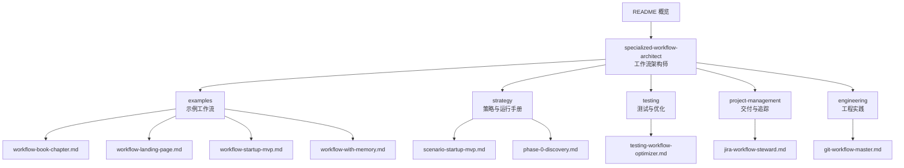
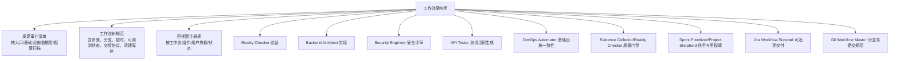
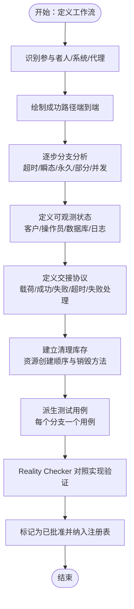
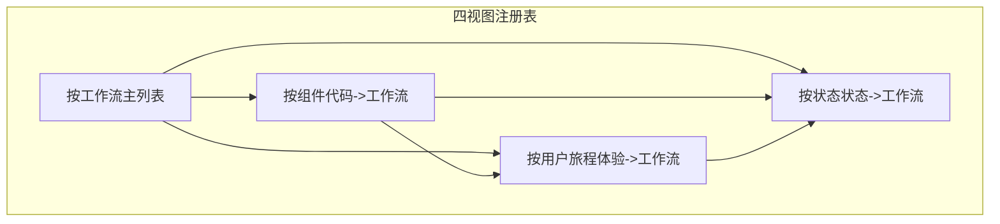
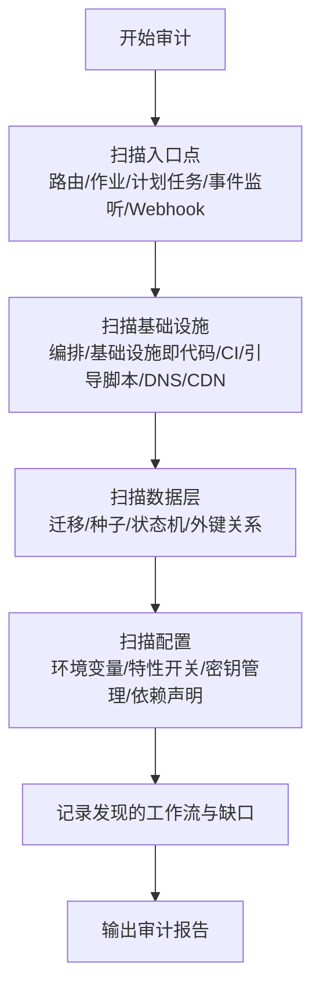
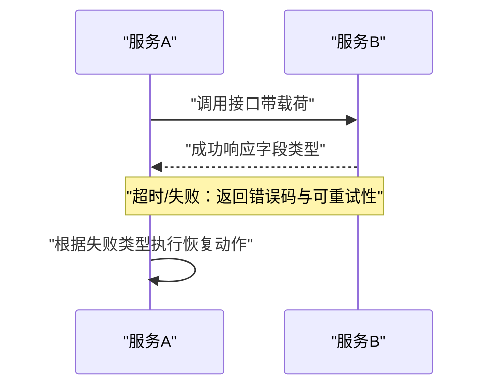
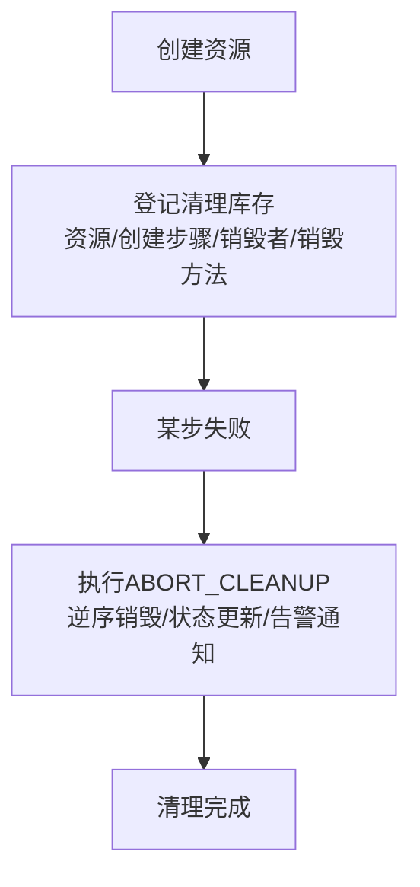
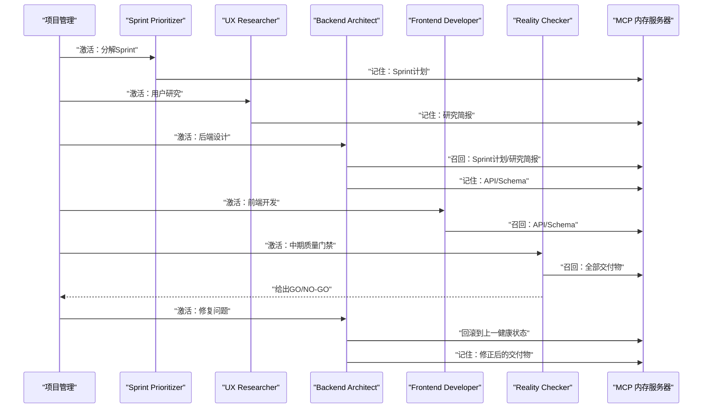
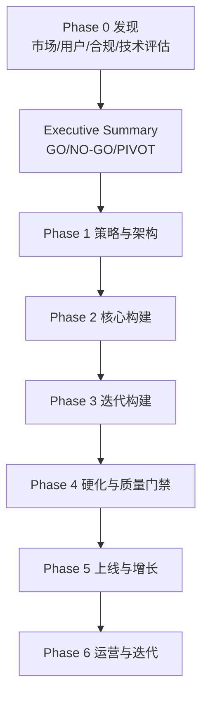
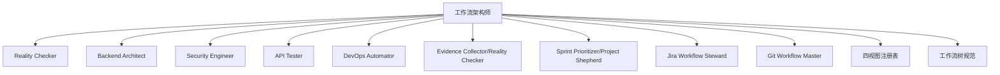

# 工作流架构师

<cite>
**本文引用的文件**
- [README.md](file://README.md)
- [specialized-workflow-architect.md](file://specialized/specialized-workflow-architect.md)
- [workflow-book-chapter.md](file://examples/workflow-book-chapter.md)
- [workflow-landing-page.md](file://examples/workflow-landing-page.md)
- [workflow-startup-mvp.md](file://examples/workflow-startup-mvp.md)
- [workflow-with-memory.md](file://examples/workflow-with-memory.md)
- [scenario-startup-mvp.md](file://strategy/runbooks/scenario-startup-mvp.md)
- [phase-0-discovery.md](file://strategy/playbooks/phase-0-discovery.md)
- [testing-workflow-optimizer.md](file://testing/testing-workflow-optimizer.md)
- [jira-workflow-steward.md](file://project-management/project-management-jira-workflow-steward.md)
- [git-workflow-master.md](file://engineering/engineering-git-workflow-master.md)
</cite>

## 目录
1. [简介](#简介)
2. [项目结构](#项目结构)
3. [核心组件](#核心组件)
4. [架构总览](#架构总览)
5. [详细组件分析](#详细组件分析)
6. [依赖关系分析](#依赖关系分析)
7. [性能考量](#性能考量)
8. [故障排查指南](#故障排查指南)
9. [结论](#结论)
10. [附录](#附录)

## 简介
本文件面向“工作流架构师”角色，系统化阐述如何在复杂系统中发现、建模与治理工作流，构建覆盖成功路径、分支条件、故障模式、恢复路径、交接协议与可观测状态的完整工作流树，并以“四个交叉引用视图”（按工作流、按组件、按用户旅程、按状态）维护权威参考。同时，结合多代理协作范式，提供发现审计清单、工作流树规范格式、手交接协议定义、清理库存管理等核心技术能力，帮助团队在交付前把每一条可能的路径都“说清楚、写明白、测得透”。

## 项目结构
该仓库是一个“AI专家代理集合”，每个代理文件包含身份、使命、技术交付物、工作流过程与成功度量。工作流架构师作为“特殊化”代理之一，专注于系统级工作流设计与治理，是连接产品意图与实现细节的桥梁。

图表来源
- [README.md:1-886](file://README.md#L1-L886)
- [specialized-workflow-architect.md:1-598](file://specialized/specialized-workflow-architect.md#L1-L598)
- [workflow-book-chapter.md:1-56](file://examples/workflow-book-chapter.md#L1-L56)
- [workflow-landing-page.md:1-120](file://examples/workflow-landing-page.md#L1-L120)
- [workflow-startup-mvp.md:1-156](file://examples/workflow-startup-mvp.md#L1-L156)
- [workflow-with-memory.md:1-239](file://examples/workflow-with-memory.md#L1-L239)
- [scenario-startup-mvp.md:1-155](file://strategy/runbooks/scenario-startup-mvp.md#L1-L155)
- [phase-0-discovery.md:1-179](file://strategy/playbooks/phase-0-discovery.md#L1-L179)
- [testing-workflow-optimizer.md:1-450](file://testing/testing-workflow-optimizer.md#L1-L450)
- [jira-workflow-steward.md:1-231](file://project-management/project-management-jira-workflow-steward.md#L1-L231)
- [git-workflow-master.md:1-85](file://engineering/engineering-git-workflow-master.md#L1-L85)

章节来源
- [README.md:1-886](file://README.md#L1-L886)

## 核心组件
- 工作流架构师：负责发现系统中“没人告诉你的工作流”，产出可实施、可测试、可观测的工作流树规范；维护四视图注册表；定义交接协议与清理库存；推动跨域协作。
- 示例工作流：展示单代理与多代理协作场景下的工作流落地方式，体现“先树后码”的设计哲学。
- 策略与运行手册：提供从发现到上线的端到端执行框架，强调质量门禁与决策点。
- 测试与优化：提供流程优化与自动化思路，支撑工作流的持续改进。
- 交付与追踪：确保工作流与版本控制、任务追踪的可追溯性。
- 工程实践：提供分支策略、提交规范等工程基线，保障工作流实现的一致性与可回溯性。

章节来源
- [specialized-workflow-architect.md:1-598](file://specialized/specialized-workflow-architect.md#L1-L598)
- [workflow-book-chapter.md:1-56](file://examples/workflow-book-chapter.md#L1-L56)
- [workflow-landing-page.md:1-120](file://examples/workflow-landing-page.md#L1-L120)
- [workflow-startup-mvp.md:1-156](file://examples/workflow-startup-mvp.md#L1-L156)
- [scenario-startup-mvp.md:1-155](file://strategy/runbooks/scenario-startup-mvp.md#L1-L155)
- [phase-0-discovery.md:1-179](file://strategy/playbooks/phase-0-discovery.md#L1-L179)
- [testing-workflow-optimizer.md:1-450](file://testing/testing-workflow-optimizer.md#L1-L450)
- [jira-workflow-steward.md:1-231](file://project-management/project-management-jira-workflow-steward.md#L1-L231)
- [git-workflow-master.md:1-85](file://engineering/engineering-git-workflow-master.md#L1-L85)

## 架构总览
工作流架构师通过“发现—建模—验证—治理”的闭环，将系统中的隐性工作流显性化，并以四视图注册表进行统一治理。下图展示了工作流架构师与周边代理的协作关系与数据流。

图表来源
- [specialized-workflow-architect.md:438-598](file://specialized/specialized-workflow-architect.md#L438-L598)
- [scenario-startup-mvp.md:1-155](file://strategy/runbooks/scenario-startup-mvp.md#L1-L155)
- [jira-workflow-steward.md:1-231](file://project-management/project-management-jira-workflow-steward.md#L1-L231)
- [git-workflow-master.md:1-85](file://engineering/engineering-git-workflow-master.md#L1-L85)

## 详细组件分析

### 组件A：工作流树规范格式
工作流树规范是工作流架构师的核心交付物，要求覆盖“成功路径、输入校验失败、超时失败、瞬态失败、永久失败、部分失败、并发冲突”七类分支，并明确可观测状态与恢复动作。

图表来源
- [specialized-workflow-architect.md:226-396](file://specialized/specialized-workflow-architect.md#L226-L396)

章节来源
- [specialized-workflow-architect.md:226-396](file://specialized/specialized-workflow-architect.md#L226-L396)

### 组件B：四视图注册表
工作流架构师维护的权威参考由四个交叉视图构成，确保从不同角度都能快速定位所需信息。

图表来源
- [specialized-workflow-architect.md:43-132](file://specialized/specialized-workflow-architect.md#L43-L132)

章节来源
- [specialized-workflow-architect.md:43-132](file://specialized/specialized-workflow-architect.md#L43-L132)

### 组件C：发现审计清单
工作流架构师在接手新项目或审计既有系统时，使用标准化清单扫描入口点、基础设施、数据层与配置，确保不遗漏任何潜在工作流。

图表来源
- [specialized-workflow-architect.md:397-437](file://specialized/specialized-workflow-architect.md#L397-L437)

章节来源
- [specialized-workflow-architect.md:397-437](file://specialized/specialized-workflow-architect.md#L397-L437)

### 组件D：交接协议定义
工作流中系统边界之间的交接必须有明确契约，包括载荷、成功/失败响应、超时与失败处理。

图表来源
- [specialized-workflow-architect.md:155-205](file://specialized/specialized-workflow-architect.md#L155-L205)

章节来源
- [specialized-workflow-architect.md:155-205](file://specialized/specialized-workflow-architect.md#L155-L205)

### 组件E：清理库存管理
工作流中创建的资源必须在失败时被完整清理，清理顺序需与创建顺序相反，且应记录在清理库存表中。

图表来源
- [specialized-workflow-architect.md:297-355](file://specialized/specialized-workflow-architect.md#L297-L355)

章节来源
- [specialized-workflow-architect.md:297-355](file://specialized/specialized-workflow-architect.md#L297-L355)

### 组件F：示例工作流对比（标准 vs 带记忆）
通过“带记忆”的工作流，消除手动交接带来的上下文丢失与回滚困难，提升跨代理协作的稳定性与可追溯性。

图表来源
- [workflow-with-memory.md:61-215](file://examples/workflow-with-memory.md#L61-L215)
- [workflow-startup-mvp.md:21-156](file://examples/workflow-startup-mvp.md#L21-L156)

章节来源
- [workflow-with-memory.md:61-215](file://examples/workflow-with-memory.md#L61-L215)
- [workflow-startup-mvp.md:21-156](file://examples/workflow-startup-mvp.md#L21-L156)

### 组件G：端到端执行框架（从发现到上线）
工作流架构师不仅设计工作流，还参与端到端执行框架的设计与质量门禁，确保从发现到上线的可控性与可复用性。

图表来源
- [phase-0-discovery.md:1-179](file://strategy/playbooks/phase-0-discovery.md#L1-L179)
- [scenario-startup-mvp.md:43-125](file://strategy/runbooks/scenario-startup-mvp.md#L43-L125)

章节来源
- [phase-0-discovery.md:1-179](file://strategy/playbooks/phase-0-discovery.md#L1-L179)
- [scenario-startup-mvp.md:43-125](file://strategy/runbooks/scenario-startup-mvp.md#L43-L125)

## 依赖关系分析
工作流架构师在系统中的耦合与协作关系如下：

图表来源
- [specialized-workflow-architect.md:541-567](file://specialized/specialized-workflow-architect.md#L541-L567)
- [jira-workflow-steward.md:1-231](file://project-management/project-management-jira-workflow-steward.md#L1-L231)
- [git-workflow-master.md:1-85](file://engineering/engineering-git-workflow-master.md#L1-L85)

章节来源
- [specialized-workflow-architect.md:541-567](file://specialized/specialized-workflow-architect.md#L541-L567)
- [jira-workflow-steward.md:1-231](file://project-management/project-management-jira-workflow-steward.md#L1-L231)
- [git-workflow-master.md:1-85](file://engineering/engineering-git-workflow-master.md#L1-L85)

## 性能考量
- 通过“先树后码”的工作流设计，减少实现阶段的返工与调试成本，提高交付效率。
- 使用四视图注册表降低沟通成本，避免重复设计与遗漏分支。
- 通过交接协议与清理库存，降低故障恢复时间与资源泄漏风险。
- 在大规模系统中，建议将工作流规范集中存放于专用目录，便于检索与版本管理。

## 故障排查指南
- 若发现“缺失”状态的工作流，优先将其纳入注册表并标注为红灯，立即安排设计与验证。
- 当Reality Checker指出与实现不符时，依据“Spec vs Reality 审计日志”更新规范或修正实现。
- 对于超时/瞬态/并发等分支，优先补充测试用例并纳入回归矩阵。
- 若出现清理缺口，立即补全清理库存并验证回滚路径。

章节来源
- [specialized-workflow-architect.md:125-143](file://specialized/specialized-workflow-architect.md#L125-L143)
- [specialized-workflow-architect.md:390-396](file://specialized/specialized-workflow-architect.md#L390-L396)

## 结论
工作流架构师的核心价值在于“把隐性工作流显性化、把分支穷尽化、把交接契约化、把可观测状态可视化”。通过四视图注册表与标准化工作流树规范，配合Reality Checker与测试用例生成，工作流架构师能够为工程、测试、运营与产品提供权威参考，显著降低系统复杂度与故障率，提升交付质量与速度。

## 附录

### 附录A：工作流树规范模板要点
- 概述：目标、触发器、主要参与者
- 步骤：每个步骤的执行者、动作、超时、输入/输出、可观测状态
- 分支：超时、瞬态、永久、部分、并发等失败模式与恢复
- 交接协议：明确载荷、成功/失败响应、超时与失败处理
- 清理库存：资源创建顺序与销毁方法
- 测试用例：每个分支对应一个测试用例
- 假设与开放问题：未验证假设与待决策项
- 审计日志：每次变更的记录

章节来源
- [specialized-workflow-architect.md:226-396](file://specialized/specialized-workflow-architect.md#L226-L396)

### 附录B：示例工作流参考
- 单代理：书籍章节开发工作流
- 多代理：落地页冲刺、Startup MVP、带记忆的MVP

章节来源
- [workflow-book-chapter.md:1-56](file://examples/workflow-book-chapter.md#L1-L56)
- [workflow-landing-page.md:1-120](file://examples/workflow-landing-page.md#L1-L120)
- [workflow-startup-mvp.md:1-156](file://examples/workflow-startup-mvp.md#L1-L156)
- [workflow-with-memory.md:1-239](file://examples/workflow-with-memory.md#L1-L239)