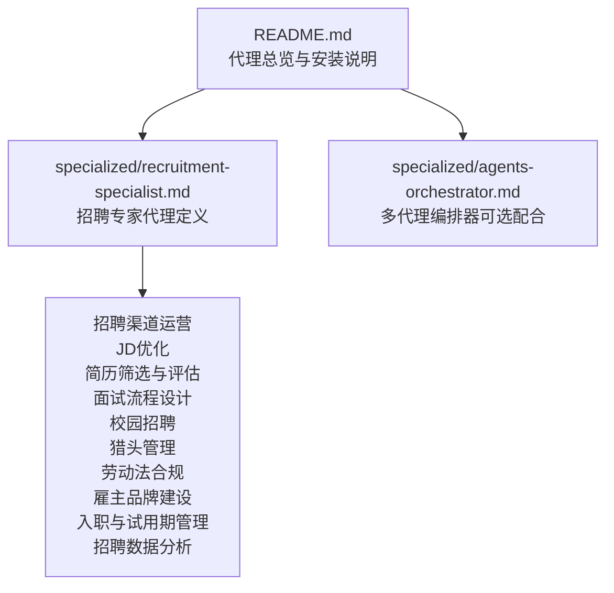
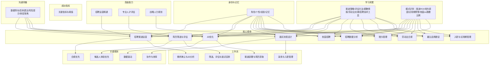
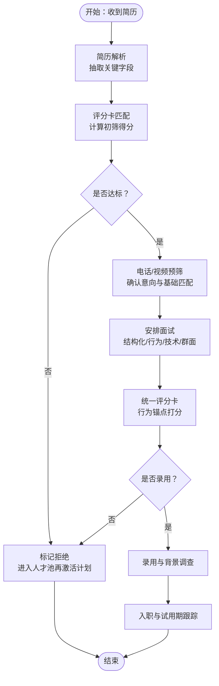
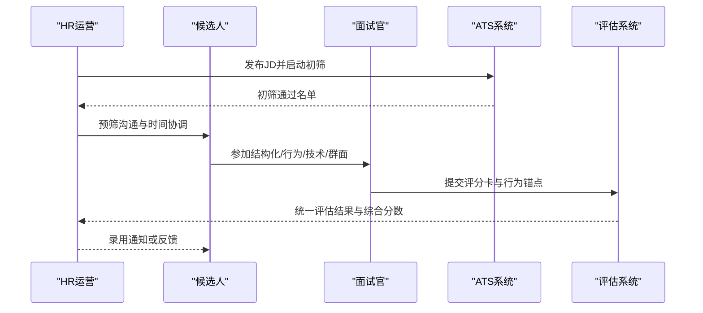
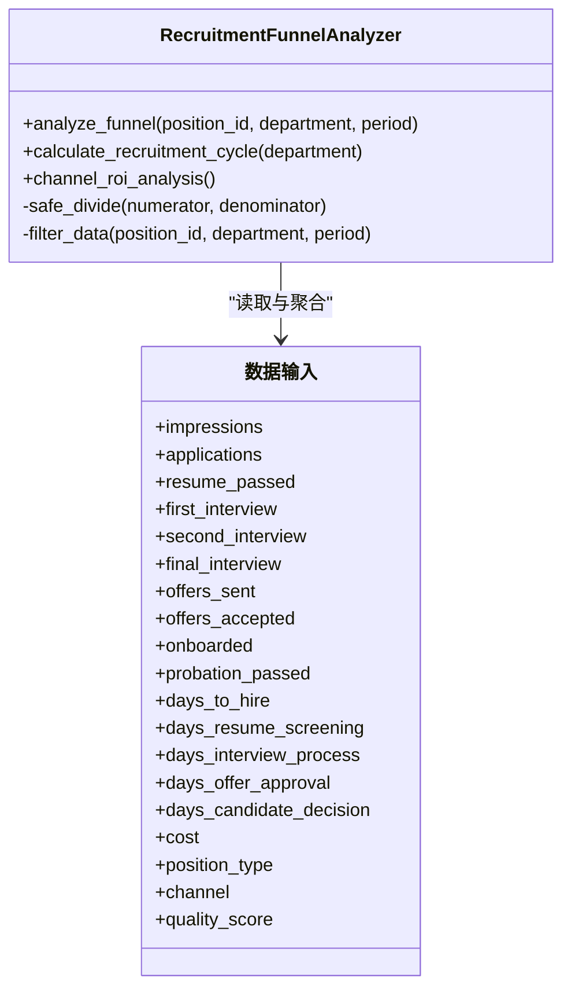
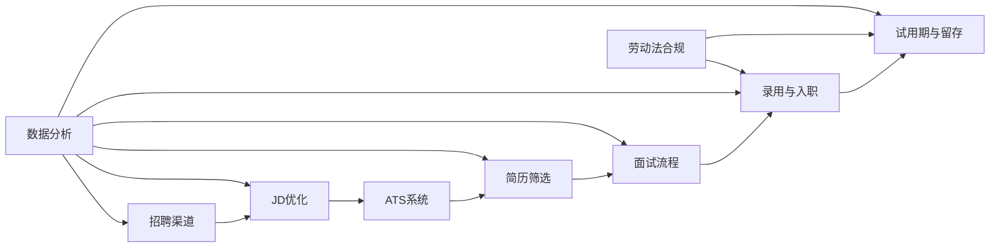

# 招聘专家

<cite>
**本文引用的文件**
- [specialized/recruitment-specialist.md](file://specialized/recruitment-specialist.md)
- [README.md](file://README.md)
- [specialized/agents-orchestrator.md](file://specialized/agents-orchestrator.md)
</cite>

## 目录
1. [简介](#简介)
2. [项目结构](#项目结构)
3. [核心组件](#核心组件)
4. [架构总览](#架构总览)
5. [详细组件分析](#详细组件分析)
6. [依赖关系分析](#依赖关系分析)
7. [性能考量](#性能考量)
8. [故障排查指南](#故障排查指南)
9. [结论](#结论)
10. [附录](#附录)

## 简介
本文件面向“招聘专家”代理，系统化阐述其在人才筛选与面试优化方面的专业能力，覆盖简历解析、候选人评估、面试流程设计与团队匹配度分析，并结合中国本土招聘生态（Boss直聘、拉勾、猎聘、智联、前程无忧、脉脉、LinkedIn等）与劳动法规合规，提供端到端的招聘运营方法论。同时，文档强调如何利用 AI 技术优化招聘流程，包括智能简历筛选算法、候选人画像构建、技能匹配分析、面试问题生成与评估标准制定，以及招聘渠道管理、候选人体验优化、团队文化匹配与招聘数据分析等核心功能。

## 项目结构
该仓库为多代理集合，招聘专家代理位于“specialized”分组中，作为独立的专家型代理文件存在；README 提供了整体代理目录与使用方式概览。下图展示与招聘专家相关的核心文件及其角色定位。

图表来源
- [README.md:1-886](file://README.md#L1-L886)
- [specialized/recruitment-specialist.md:1-510](file://specialized/recruitment-specialist.md#L1-L510)
- [specialized/agents-orchestrator.md:1-367](file://specialized/agents-orchestrator.md#L1-L367)

章节来源
- [README.md:68-283](file://README.md#L68-L283)
- [specialized/recruitment-specialist.md:1-510](file://specialized/recruitment-specialist.md#L1-L510)

## 核心组件
- 招聘渠道运营：覆盖 BOSS直聘、拉勾、猎聘、智联、前程无忧、脉脉、LinkedIn 等平台，包含公司页优化、职位卡片、直接沟通技巧、推荐与定向邀请、曝光与简历转化率分析，以及 ROI 分析与预算分配优化。
- JD 优化：构建岗位画像、明确硬性与软性要求、薪酬竞争力分析、从候选人视角撰写、进行 A/B 测试以提升申请量。
- 简历筛选与人才评估：熟练 ATS（北森、Moka、飞书招聘），建立简历解析规则与评分卡，构建胜任力模型（专业技能、通用能力、文化契合），维护人才池并周期性再激活。
- 面试流程设计：标准化评分卡与行为锚点、问题库分类、结构化/行为面试（STAR）、技术面试（笔试、编程题、案例分析、作品集）、群面/无领导小组讨论。
- 校园招聘：秋招/春招节奏、目标高校选择（985/211）、宣讲会策划、管培生轮岗与导师制、实习转正机制。
- 猎头管理：供应商分级管理、按岗位类型与级别采用不同付费模式（保留制/按成）、费用谈判策略、高管寻访策略。
- 劳动法合规：劳动合同、试用期、五险一金、竞业限制、N+1 解除补偿、大规模裁员程序。
- 雇主品牌建设：短视频与内容营销（抖音、视频号、B站、小红书、知乎、脉脉）、员工口碑管理、最佳雇主奖项参与。
- 入职与试用期管理：录用通知书模板与审批流程、背景调查、入职 SOP、试用期评估与预警。
- 招聘数据分析：漏斗分析、平均到岗周期、渠道 ROI、健康仪表盘与月报模板。

章节来源
- [specialized/recruitment-specialist.md:22-179](file://specialized/recruitment-specialist.md#L22-L179)
- [specialized/recruitment-specialist.md:180-394](file://specialized/recruitment-specialist.md#L180-L394)
- [specialized/recruitment-specialist.md:233-394](file://specialized/recruitment-specialist.md#L233-L394)

## 架构总览
招聘专家代理的运行架构由“身份与记忆”“核心使命”“关键规则”“工作流”“沟通风格”“学习积累”“成功指标”“高级能力”等模块构成，形成闭环的招聘运营体系。下图给出概念性架构示意。

## 详细组件分析

### 组件A：简历解析与智能筛选
- 能力要点
  - 熟练 ATS 系统（北森、Moka、飞书招聘），建立简历解析规则与评分卡，实现自动化初筛。
  - 基于胜任力模型（专业技能、通用能力、文化契合）构建候选人画像，迭代筛选标准以提高留用表现预测性。
  - 维护人才池并周期性再激活高质量未录用候选人，提升长期 ROI。
- 关键流程
  - 解析简历字段 → 匹配评分卡 → 初筛 → 电话/视频预筛 → 安排正式面试 → 收集反馈驱动决策。
- AI 优化方向
  - 智能简历解析：抽取教育背景、工作经历、技能标签、项目经验等结构化信息。
  - 候选人画像：基于历史留用数据训练特征权重，输出候选匹配度与稳定性评分。
  - 技能匹配分析：语义相似度与关键词权重结合，支持多维技能维度评分。
  - 面试问题生成：根据岗位职责与胜任力模型自动生成结构化/行为类问题与追问清单。
  - 评估标准制定：统一评分卡与行为锚点，确保面试官一致性与可比性。

图表来源
- [specialized/recruitment-specialist.md:41-47](file://specialized/recruitment-specialist.md#L41-L47)
- [specialized/recruitment-specialist.md:49-73](file://specialized/recruitment-specialist.md#L49-L73)

章节来源
- [specialized/recruitment-specialist.md:41-73](file://specialized/recruitment-specialist.md#L41-L73)

### 组件B：面试流程设计与评估
- 结构化面试：统一评分卡与行为锚点，按岗位与层级分类构建问题库，确保面试官一致性与校准。
- 行为面试（STAR）：围绕情境、任务、行动、结果设计问题，准备追问清单，聚焦候选人的具体行为而非假设答案。
- 技术面试：协同招聘经理设计笔试、编程题、案例分析、作品集展示，建立知识、解题、设计、质量等维度评价。
- 群面/无领导小组讨论：设计主题评估领导力、协作与表达能力，配套观察评分表。
- AI 辅助：视频面试情感分析、语义理解与稳定性评估，辅助初筛与复盘。

图表来源
- [specialized/recruitment-specialist.md:49-73](file://specialized/recruitment-specialist.md#L49-L73)
- [specialized/recruitment-specialist.md:495-500](file://specialized/recruitment-specialist.md#L495-L500)

章节来源
- [specialized/recruitment-specialist.md:49-73](file://specialized/recruitment-specialist.md#L49-L73)
- [specialized/recruitment-specialist.md:495-500](file://specialized/recruitment-specialist.md#L495-L500)

### 组件C：招聘渠道管理与数据分析
- 渠道矩阵：BOSS直聘、拉勾、猎聘、智联、前程无忧、脉脉、LinkedIn，每类渠道设定 ROI 分析、效果复盘与预算优化。
- JD A/B 测试：标题与描述风格对申请量的影响，持续优化。
- 招聘漏斗分析：曝光→申请→简历通过→初面→二面→终面→发 offer→接受→入职→试用期通过。
- 平均到岗周期分解：简历筛选耗时、面试流程耗时、offer 审批耗时、候选人决策耗时。
- 渠道 ROI：成本/简历、成本/录用、成本/有效录用、质量评分与留存率综合评估。

图表来源
- [specialized/recruitment-specialist.md:233-356](file://specialized/recruitment-specialist.md#L233-L356)

章节来源
- [specialized/recruitment-specialist.md:233-356](file://specialized/recruitment-specialist.md#L233-L356)

### 组件D：校园招聘与实习转正
- 秋/春招节奏：锁定 985/211 高校，提前锁定优质毕业生；春招补缺未上岸或公务员/研究生考试未通过者。
- 宣讲会与直播：与就业中心联动，设计内容（公司介绍、岗位概览、校友分享、互动问答）。
- 管培生轮岗与导师制：明确轮岗部门、评估节点与成长轨迹。
- 实习转正：明确评估维度与转换条件，预留返聘名额、提供有竞争力的实习薪酬与有意义的项目参与。

章节来源
- [specialized/recruitment-specialist.md:75-99](file://specialized/recruitment-specialist.md#L75-L99)

### 组件E：劳动法合规与入职管理
- 合同与试用期：30 天内书面合同、固定/无固定/项目合同类型、试用期上限与工资标准、仅一次试用期。
- 五险一金：五险（养老、医疗、失业、工伤、生育）与住房公积金，注册与缴费时限、城市差异与补充福利。
- 竞业限制：期限不超过 2 年、补偿标准、违约处理。
- N+1 解除：经济补偿、违法解除双倍补偿、上限与大规模裁员程序。
- 入职与试用期：录用通知书模板与审批流程、背景调查、入职 SOP、试用期评估与早期预警、合规终止流程。

章节来源
- [specialized/recruitment-specialist.md:121-232](file://specialized/recruitment-specialist.md#L121-L232)

### 组件F：雇主品牌建设与候选人体验
- 短视频与内容营销：抖音/视频号/B站/小红书/知乎/脉脉，打造办公日常、员工故事、面试技巧等。
- 员工口碑管理：监测与回应差评、鼓励满意员工分享、内部满意度调查与改进。
- 最佳雇主奖项：参与评选与展示，提升 JD 与宣讲吸引力。

章节来源
- [specialized/recruitment-specialist.md:160-179](file://specialized/recruitment-specialist.md#L160-L179)

## 依赖关系分析
- 内部依赖
  - 渠道运营依赖 JD 优化与薪酬竞争力分析，以提升曝光与申请质量。
  - 简历筛选依赖胜任力模型与 ATS 系统，支撑自动化初筛与评分卡。
  - 面试流程依赖统一评分卡与行为锚点，保障一致性与可比性。
  - 数据分析贯穿全流程，驱动渠道 ROI 与流程优化。
- 外部依赖
  - 中国主流招聘平台（BOSS直聘、拉勾、猎聘、智联、前程无忧、脉脉、LinkedIn）。
  - 薪酬与雇主评价平台（脉脉薪资、看准网、职友集、薪智）。
  - 在线测评与编程平台（牛客网、LeetCode）。
  - 劳动法与数据保护法规（《劳动合同法》《就业促进法》《个人信息保护法》）。

图表来源
- [specialized/recruitment-specialist.md:22-179](file://specialized/recruitment-specialist.md#L22-L179)
- [specialized/recruitment-specialist.md:233-394](file://specialized/recruitment-specialist.md#L233-L394)

章节来源
- [specialized/recruitment-specialist.md:22-179](file://specialized/recruitment-specialist.md#L22-L179)
- [specialized/recruitment-specialist.md:233-394](file://specialized/recruitment-specialist.md#L233-L394)

## 性能考量
- 渠道 ROI 与预算优化：定期复盘各渠道成本/简历、成本/录用、成本/有效录用与质量评分，动态调整流量分配与预算。
- 漏斗转化优化：针对高流失阶段（如初筛、面试、决策）进行专项优化，缩短平均到岗周期。
- 候选人体验：承诺 48 小时内反馈、尊重时间、透明沟通、尊重落选者，降低负面口碑与二次竞争成本。
- 自动化与一致性：通过 ATS 工作流、自动邮件/SMS 触发、智能调度减少重复劳动，提升面试官评分一致性。
- 数据驱动：以历史数据预测招聘周期与资源需求，建立人才市场情报机制，持续跟踪薪酬与人才流动趋势。

## 故障排查指南
- 常见问题
  - 渠道曝光不足：检查关键词优化、公司页质量、定向策略与预算分配。
  - 应用转化低：审视 JD 描述、薪酬竞争力与岗位吸引力，进行 A/B 测试。
  - 简历筛选误判：回溯评分卡权重与特征工程，结合留用数据迭代模型。
  - 面试官评分不一致：加强培训与校准，统一评分卡与行为锚点。
  - 合规风险：严格遵守劳动法与数据保护法，背景调查需事先授权，竞业限制前置筛查。
- 快速定位
  - 使用漏斗分析定位瓶颈阶段，结合平均到岗周期分解找出耗时最长环节。
  - 对照渠道 ROI 排名，识别低效渠道与异常波动。
  - 回顾候选人体验指标（NPS）与反馈，识别服务短板。

章节来源
- [specialized/recruitment-specialist.md:396-427](file://specialized/recruitment-specialist.md#L396-L427)
- [specialized/recruitment-specialist.md:233-356](file://specialized/recruitment-specialist.md#L233-L356)

## 结论
招聘专家代理以“数据驱动、合规优先、候选人体验至上”的理念，构建覆盖全链路的招聘运营体系。通过渠道矩阵、JD 优化、智能筛选与评估、结构化面试、校园招聘、猎头管理、劳动法合规、雇主品牌与入职管理，以及系统化的数据分析，实现高效、可衡量、可持续的人才获取与留存。AI 技术的融入进一步提升了简历解析、画像构建、技能匹配、问题生成与评估一致性，为组织打造更具竞争力的招聘能力。

## 附录
- 多代理编排（可选）
  - 若需要跨代理协作（如产品、工程、测试、营销等），可配合“Agents Orchestrator”进行端到端编排，确保招聘流程与其他职能协同推进。
- 使用方式
  - 参考 README 的安装与集成说明，将招聘专家代理文件复制至对应工具的 agents 目录后即可激活使用。

章节来源
- [README.md:25-65](file://README.md#L25-L65)
- [specialized/agents-orchestrator.md:362-367](file://specialized/agents-orchestrator.md#L362-L367)