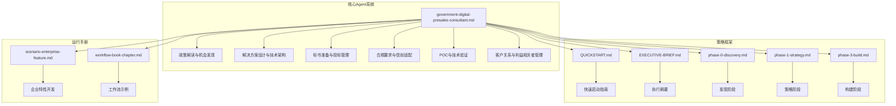
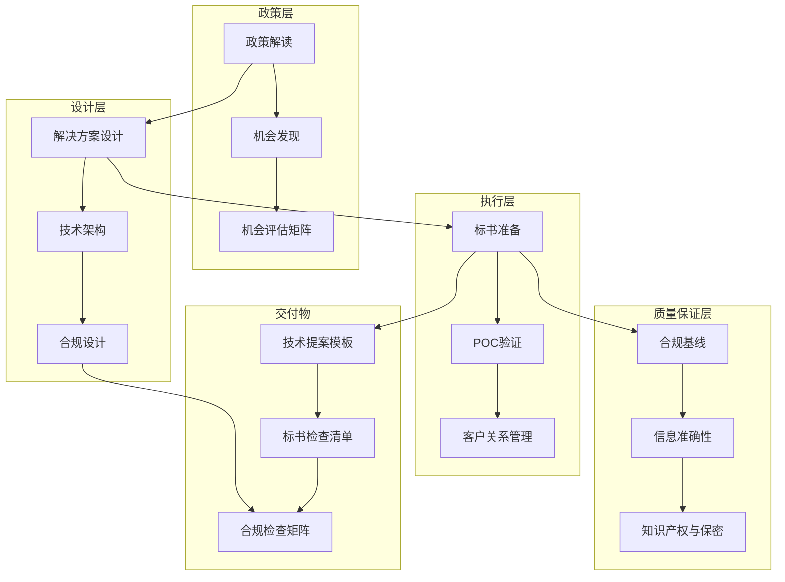
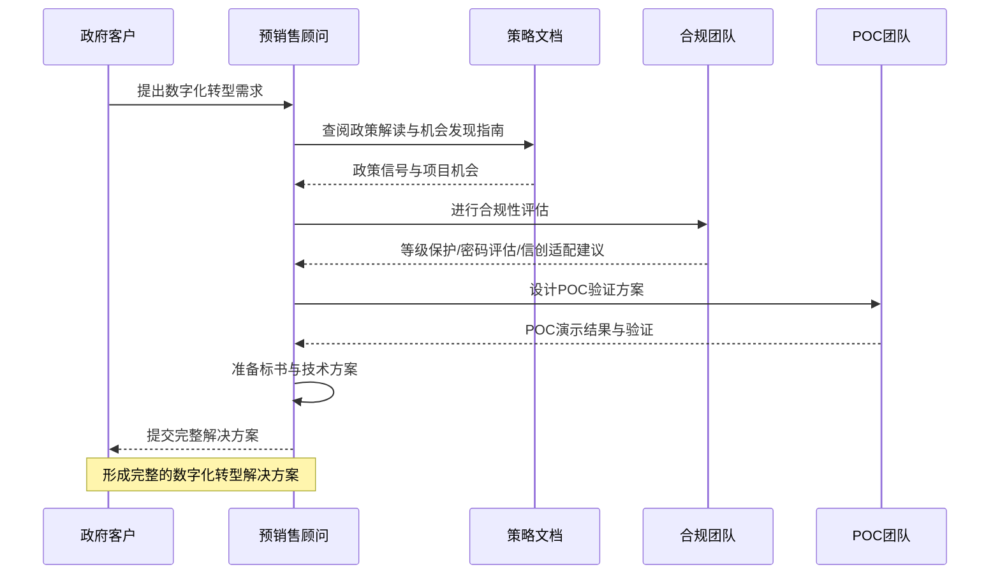

# 政府数字化预销售顾问

<cite>
**本文档引用的文件**
- [government-digital-presales-consultant.md](file://specialized/government-digital-presales-consultant.md)
- [README.md](file://README.md)
- [QUICKSTART.md](file://strategy/QUICKSTART.md)
- [EXECUTIVE-BRIEF.md](file://strategy/EXECUTIVE-BRIEF.md)
- [phase-0-discovery.md](file://strategy/playbooks/phase-0-discovery.md)
- [phase-1-strategy.md](file://strategy/playbooks/phase-1-strategy.md)
- [phase-3-build.md](file://strategy/playbooks/phase-3-build.md)
- [scenario-enterprise-feature.md](file://strategy/runbooks/scenario-enterprise-feature.md)
- [workflow-book-chapter.md](file://examples/workflow-book-chapter.md)
</cite>

## 目录
1. [简介](#简介)
2. [项目结构](#项目结构)
3. [核心组件](#核心组件)
4. [架构概览](#架构概览)
5. [详细组件分析](#详细组件分析)
6. [依赖关系分析](#依赖关系分析)
7. [性能考虑](#性能考虑)
8. [故障排除指南](#故障排除指南)
9. [结论](#结论)
10. [附录](#附录)

## 简介

政府数字化预销售顾问是一个专门针对中国地方政府数字化转型市场的专业预销售专家角色。该顾问精通政策解读、解决方案设计、标书准备、POC验证、合规要求（等级保护/商用密码应用安全性评估/信创国产化）以及利益相关者管理，帮助技术团队高效赢得政府IT项目。

该角色专注于从中央到地方各级政府的数字化转型需求，熟练掌握数字政府、智慧城市、一网通办（一体化在线政务服务平台）、城市大脑等主流方向的解决方案设计和投标策略，帮助团队在从机会发现到合同签署的整个项目生命周期中做出最优决策。

## 项目结构

该项目采用模块化的Agent架构设计，每个Agent都是一个专业化的人工智能专家，具有独特的个性、流程和可衡量的产出。整体项目结构如下：

**图表来源**
- [government-digital-presales-consultant.md:1-364](file://specialized/government-digital-presales-consultant.md#L1-L364)
- [QUICKSTART.md:1-195](file://strategy/QUICKSTART.md#L1-L195)
- [EXECUTIVE-BRIEF.md:1-96](file://strategy/EXECUTIVE-BRIEF.md#L1-L96)

**章节来源**
- [README.md:1-886](file://README.md#L1-L886)
- [government-digital-presales-consultant.md:1-364](file://specialized/government-digital-presales-consultant.md#L1-L364)

## 核心组件

### 政策解读与机会发现

政府数字化预销售顾问的核心使命之一是跟踪国家和地方各级政府的数字化政策，识别项目机会。这包括：

- **国家级政策跟踪**：数字中国发展规划纲要、国家数据局政策、数字政府建设指南
- **省级/市级政策跟踪**：省市级数字政府/智慧城市发展规划、年度IT项目预算公告
- **行业标准跟踪**：政府云平台技术要求、政府数据共享交换标准、电子政务网络技术规范

政策信号提取的关键要素：
- 投资增加的领域（项目机会信号）
- 语言从"鼓励探索"转向"全面实施"的领域（市场成熟度信号）
- 必须遵守的硬性要求——等级保护、商用密码应用安全性评估、信创国产化替代

### 解决方案设计与技术架构

解决方案设计以客户需求为中心，避免"为技术而技术"：

**数字政府方向**：
- 集成化政府服务平台
- 一网通办（统一网络政务服务）/一网统管（统一网络管理）
- 12345热线智能化升级
- 政府数据中间平台

**智慧城市方向**：
- 城市大脑/城市运行中心（IOC）
- 智能交通
- 智慧社区
- 城市信息模型（CIM）

**数据要素方向**：
- 公共数据开放平台
- 数据资产化运营
- 政府数据治理平台

**基础设施方向**：
- 政府云平台建设/迁移
- 电子政务网络升级
- 信创（国产化）适配与改造

**章节来源**
- [government-digital-presales-consultant.md:22-46](file://specialized/government-digital-presales-consultant.md#L22-L46)

## 架构概览

政府数字化预销售顾问采用分层架构设计，确保在不同层面提供专业的数字化转型解决方案：

**图表来源**
- [government-digital-presales-consultant.md:106-130](file://specialized/government-digital-presales-consultant.md#L106-L130)

## 详细组件分析

### 合规要求与信创适配

政府项目对合规性的要求极其严格，特别是以下三个方面：

#### 等级保护（Dengbao 2.0）
- **安全级别**：政府系统通常需要三级等级保护；核心系统可能需要四级
- **安全架构设计要求**：网络分段、身份认证、数据加密、日志审计、入侵检测
- **关键里程碑**：系统上线前完成等级保护评估——预留2-3个月整改时间

#### 商用密码应用安全性评估（Miping）
- **适用范围**：涉及身份认证、数据传输和数据存储的政府系统必须使用国密算法（SM2/SM3/SM4）
- **证书要求**：电子印章和CA证书必须使用国密证书
- **验收前提**：Miping报告是系统验收的先决条件

#### 信创（Xinchuang）适配
- **核心元素**：国产CPU（鲲鹏/飞腾/海光/龙芯）、国产操作系统（统信UOS/麒麟）、国产数据库（达梦/金仓/高斯DB）、国产中间件（通达/宝兰德）
- **适配策略**：优先选择信创目录中的主流产品；建立兼容性测试矩阵
- **务实态度**：信创替代不是每个组件都需要立即替换；分阶段替代是可以接受的

**章节来源**
- [government-digital-presales-consultant.md:59-77](file://specialized/government-digital-presales-consultant.md#L59-L77)

### POC与技术验证

POC（概念验证）是政府项目中标的重要环节，需要精心策划：

#### POC策略制定
- **场景选择**：选择最能展示差异化优势的场景作为POC内容
- **范围控制**：POC验证核心能力，而不是免费交付项目
- **成功标准**：设定明确的成功标准，防止客户无限扩大范围

#### 典型POC场景
- **智能审批**：上传文档 -> OCR识别 -> 自动填表 -> 智能预审，端到端演示
- **数据治理**：连接真实数据源 -> 数据清洗 -> 质量报告 -> 数据目录生成
- **城市大脑**：多源数据接入 -> 实时监控仪表板 -> 警报联动 -> 处理闭环

#### 演示环境管理
- **独立环境**：准备独立于外网和第三方服务的演示环境
- **数据匿名化**：演示数据应类似于真实场景但完全匿名化
- **离线版本**：准备离线版本——政府数据中心网络条件不可预测

**章节来源**
- [government-digital-presales-consultant.md:78-92](file://specialized/government-digital-presales-consultant.md#L78-L92)

### 客户关系与利益相关者管理

政府项目涉及多个层级的利益相关者，需要不同的沟通策略：

#### 利益相关者地图
- **决策者**（局/部门负责人）：关注政策合规、政治成就、风险控制
- **业务层**（处/科长）：关注解决业务痛点、减少工作量
- **技术层**（信息中心/数据管理局技术人员）：关注技术可行性、运维便利性、未来扩展性
- **采购层**（政府采购中心/财政局）：关注程序合规、预算控制

#### 分层沟通策略
- **决策者**：谈政策一致性、基准效果、可量化结果——控制在15分钟内
- **业务层**：谈场景、用户体验、"系统如何让您的工作更轻松"
- **技术层**：谈架构、API、运维、信创兼容性——深入技术细节
- **采购层**：谈合规性、程序、资质——确保程序完整性

**章节来源**
- [government-digital-presales-consultant.md:93-105](file://specialized/government-digital-presales-consultant.md#L93-L105)

## 依赖关系分析

政府数字化预销售顾问的工作流程与其他策略文档存在紧密的依赖关系：

**图表来源**
- [phase-0-discovery.md:1-179](file://strategy/playbooks/phase-0-discovery.md#L1-L179)
- [phase-1-strategy.md:1-239](file://strategy/playbooks/phase-1-strategy.md#L1-L239)
- [phase-3-build.md:1-287](file://strategy/playbooks/phase-3-build.md#L1-L287)

**章节来源**
- [QUICKSTART.md:1-195](file://strategy/QUICKSTART.md#L1-L195)
- [EXECUTIVE-BRIEF.md:1-96](file://strategy/EXECUTIVE-BRIEF.md#L1-L96)

## 性能考虑

政府数字化预销售顾问在实际应用中需要考虑以下性能因素：

### 时间效率优化
- **机会发现**：通过系统化的政策跟踪，将机会发现时间从传统方法的数周缩短至数天
- **标书准备**：标准化的标书模板和检查清单，确保标书质量的同时提高准备效率
- **合规评估**：建立标准化的合规检查矩阵，避免重复劳动

### 成本效益分析
- **投资回报率**：通过机会评估模板，量化项目的真实价值和预期回报
- **资源配置**：基于竞争分析，合理分配预销售资源
- **风险控制**：通过风险标志识别，避免不合适的项目参与

### 质量保证机制
- **零容忍错误**：标书格式错误、资格缺失等可能导致直接淘汰
- **证据驱动**：所有主张都必须有相应的证据支持
- **持续改进**：通过项目复盘，不断优化工作流程

## 故障排除指南

### 常见问题及解决方案

#### 标书被拒问题
**问题表现**：标书在形式审查阶段被拒绝
**原因分析**：缺少必要资质、格式错误、响应偏离
**解决方案**：
- 使用标书检查清单进行逐项核对
- 确保所有必需的资质文件齐全
- 严格按照招标文件要求格式准备

#### 合规性问题
**问题表现**：技术方案无法满足等级保护或信创要求
**原因分析**：对政策理解不足或技术方案设计缺陷
**解决方案**：
- 建立合规检查矩阵，提前识别风险点
- 与合规专家密切合作
- 在方案设计阶段就考虑合规要求

#### 客户沟通障碍
**问题表现**：与不同层级的利益相关者沟通困难
**原因分析**：沟通策略不当或对各层级关注点理解不足
**解决方案**：
- 建立利益相关者地图
- 制定分层沟通策略
- 准备针对性的演示材料

**章节来源**
- [government-digital-presales-consultant.md:106-130](file://specialized/government-digital-presales-consultant.md#L106-L130)

## 结论

政府数字化预销售顾问代表了数字化转型咨询领域的专业化发展方向。通过系统化的政策解读、标准化的解决方案设计、严格的合规管理以及高效的客户关系维护，该角色能够显著提升政府IT项目中标成功率。

其核心价值体现在：
1. **专业化能力**：深度理解中国政府数字化转型的政策环境和技术要求
2. **系统化方法**：从机会发现到项目交付的完整流程管理
3. **质量保证**：通过标准化检查清单和合规矩阵确保交付质量
4. **风险控制**：通过全面的风险识别和应对策略降低项目风险

对于希望在政府数字化转型市场取得成功的组织而言，政府数字化预销售顾问提供了可复制、可推广的专业化解决方案。

## 附录

### 关键技术交付物

政府数字化预销售顾问提供以下关键的技术交付物：

#### 技术提案模板
- 项目概述
- 总体设计
- 详细设计
- 安全保障计划
- 项目实施计划
- 运维保障计划
- 参考案例

#### 标书检查清单
- 资质文件核对
- 技术方案审查
- 商务条款确认
- 格式规范检查

#### 合规检查矩阵
- 等级保护关键控制点
- 信创适配检查表
- 数据安全与隐私保护

### 成功指标体系

- **中标率**：主动跟踪项目中标率>40%
- **废标率**：因文件问题导致的废标率为零
- **机会转化率**：从机会发现到最终投标提交的转化率>30%
- **客户满意度**：预销售阶段专业性和响应速度的满意度≥"满意"
- **知识积累**：每个项目产生可复用的解决方案模块、案例材料和经验教训