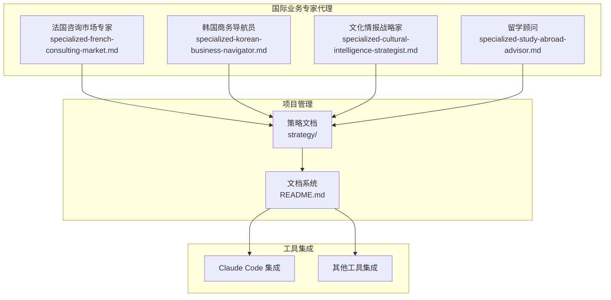
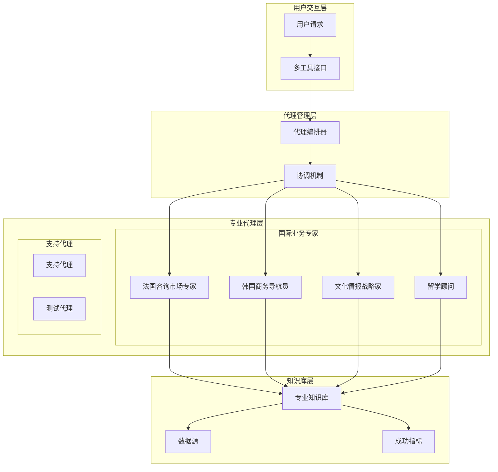
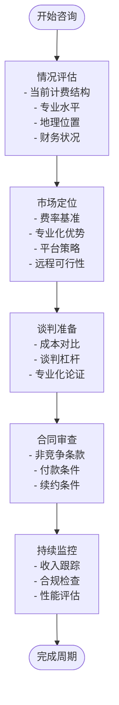
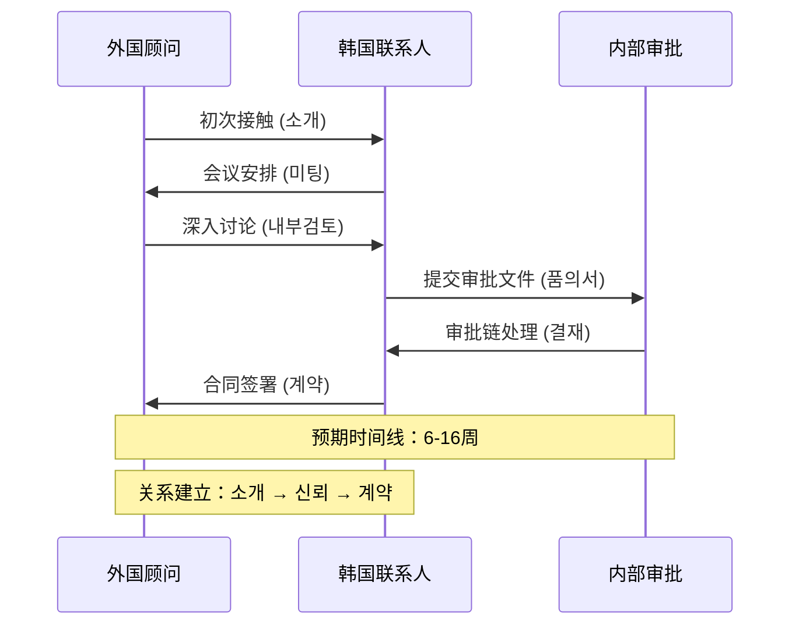
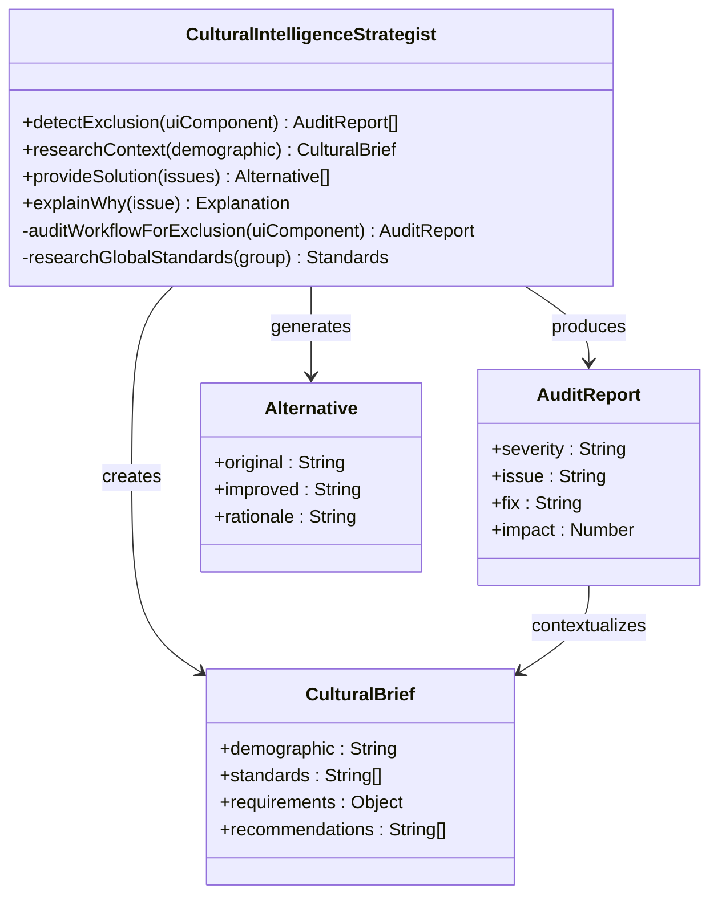
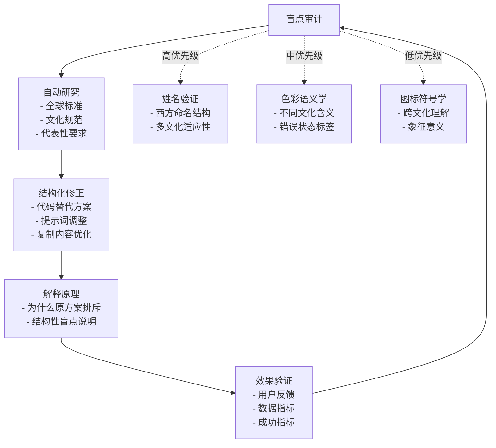
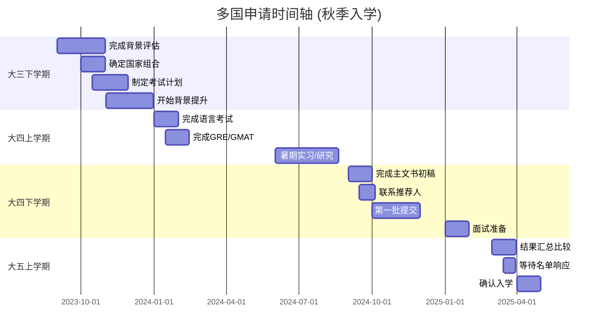
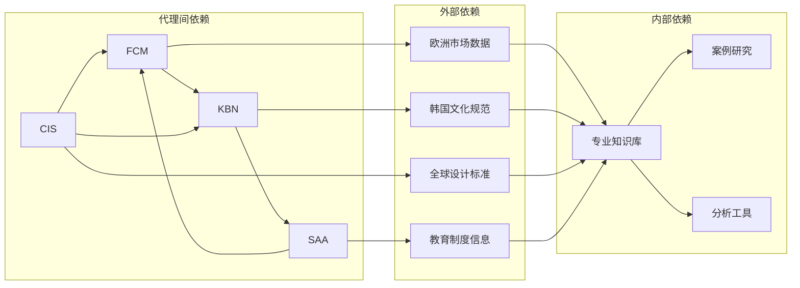

# 国际业务专家代理

<cite>
**本文档引用的文件**
- [specialized-french-consulting-market.md](file://specialized/specialized-french-consulting-market.md)
- [specialized-korean-business-navigator.md](file://specialized/specialized-korean-business-navigator.md)
- [specialized-cultural-intelligence-strategist.md](file://specialized/specialized-cultural-intelligence-strategist.md)
- [study-abroad-advisor.md](file://specialized/study-abroad-advisor.md)
- [README.md](file://README.md)
- [QUICKSTART.md](file://strategy/QUICKSTART.md)
- [EXECUTIVE-BRIEF.md](file://strategy/EXECUTIVE-BRIEF.md)
</cite>

## 目录
1. [简介](#简介)
2. [项目结构](#项目结构)
3. [核心组件](#核心组件)
4. [架构概览](#架构概览)
5. [详细组件分析](#详细组件分析)
6. [依赖关系分析](#依赖关系分析)
7. [性能考虑](#性能考虑)
8. [故障排除指南](#故障排除指南)
9. [结论](#结论)

## 简介

国际业务专家代理是《Agency Agents》项目中的专业化AI代理集合，专注于为跨国业务提供深度专业服务。本文档深入介绍了四个核心国际业务专家代理：法国咨询市场专家、韩国商务导航员、文化情报战略家和留学顾问，详细阐述它们在跨文化沟通、国际市场进入、教育服务等领域的专业能力和国际化应用。

这些代理代表了现代AI助手从通用模板向专业化、个性化、可执行的专业服务代理的演进，每个代理都具备独特的身份认同、专业知识体系、工作流程和可衡量的成功指标。

## 项目结构

《Agency Agents》项目采用模块化组织结构，专门针对不同业务领域提供专业化的AI代理解决方案：

**图表来源**
- [README.md:280-282](file://README.md#L280-L282)
- [README.md:265-276](file://README.md#L265-L276)

项目结构体现了以下特点：
- **专业化分工**：每个代理专注于特定的国际业务领域
- **标准化格式**：统一的代理模板和文档结构
- **可扩展性**：支持多种AI工具平台集成
- **质量保证**：完整的策略文档和执行框架

**章节来源**
- [README.md:249-283](file://README.md#L249-L283)

## 核心组件

国际业务专家代理系统包含四个核心专业代理，每个都具备完整的专业知识体系和执行能力：

### 法国咨询市场专家（French Consulting Market Navigator）

专精于法国IT咨询市场的E-SN/SI生态系统，提供从费率谈判到合同管理的全方位专业服务。

### 韩国商务导航员（Korean Business Navigator）

精通韩国商务文化，帮助外国专业人士理解并适应韩国独特的商业决策机制和人际关系动态。

### 文化情报战略家（Cultural Intelligence Strategist）

专注于全球文化适应性，确保软件产品在不同文化背景下的包容性和准确性。

### 留学顾问（Study Abroad Advisor）

提供覆盖美国、英国、加拿大、澳大利亚、欧洲、香港和新加坡的完整留学规划服务。

**章节来源**
- [specialized-french-consulting-market.md:1-193](file://specialized/specialized-french-consulting-market.md#L1-L193)
- [specialized-korean-business-navigator.md:1-217](file://specialized/specialized-korean-business-navigator.md#L1-L217)
- [specialized-cultural-intelligence-strategist.md:1-89](file://specialized/specialized-cultural-intelligence-strategist.md#L1-L89)
- [study-abroad-advisor.md:1-283](file://specialized/study-abroad-advisor.md#L1-L283)

## 架构概览

国际业务专家代理系统采用分层架构设计，确保专业能力的有效组织和交付：

**图表来源**
- [QUICKSTART.md:13-42](file://strategy/QUICKSTART.md#L13-L42)
- [EXECUTIVE-BRIEF.md:29-39](file://strategy/EXECUTIVE-BRIEF.md#L29-L39)

该架构的核心特征包括：

1. **分层专业化**：每个代理负责特定的业务领域
2. **统一协调**：通过编排器实现代理间的协作
3. **知识共享**：建立可复用的专业知识库
4. **质量控制**：通过多重验证确保服务质量

## 详细组件分析

### 法国咨询市场专家分析

#### 专业能力矩阵

| 专业领域 | 核心技能 | 实施方法 |
|---------|---------|---------|
| ESN/SI生态系统 | 边际模型分析、平台机制理解 | 市场数据分析、费率对比研究 |
| 自由职业计费 | 端口薪资、微型企业、SASU结构 | 成本效益分析、税务优化建议 |
| 平台定位 | Malt、collective.work、Comet | 平台比较矩阵、策略选择指导 |
| 费率谈判 | TJM计算、谈判杠杆、专业化溢价 | 框架化谈判流程、案例研究分析 |

#### 工作流程图

**图表来源**
- [specialized-french-consulting-market.md:135-161](file://specialized/specialized-french-consulting-market.md#L135-L161)

#### 关键成功指标

- 有效日费率（扣除所有费用后的净收入）6个月内增长
- 按合同时限收到款项（延迟超过15天标记处理）
- 客户组合多样化（单一客户收入占比不超过60%）
- 平台评分维持在4.5/5以上
- 计费结构与当前生活阶段和财务状况匹配
- 零意外费用（ESN边际或隐藏费用）

**章节来源**
- [specialized-french-consulting-market.md:162-170](file://specialized/specialized-french-consulting-market.md#L162-L170)

### 韩国商务导航员分析

#### 文化机制解码

| 文化要素 | 理论理解 | 实践应用 |
|---------|---------|---------|
| 품의 (审批流程) | 多层级共识决策 | 6-16周的现实时间线管理 |
| 눈치 (情境感知) | 非语言沟通解读 | 3-7天沉默期的正确解读 |
| 카카오톡商务礼仪 | 多语言沟通策略 | 韩语群聊的尊重表达 |
| 层级系统 | 权力距离认知 | 正确的称谓和沟通方式 |
| 会食文化 | 社交网络建设 | 酒桌礼仪和社交技巧 |

#### 韩国商务决策流程

**图表来源**
- [specialized-korean-business-navigator.md:53-65](file://specialized/specialized-korean-business-navigator.md#L53-L65)

#### 沟通策略框架

| 关系阶段 | 沟通要点 | 时间管理 | 礼仪规范 |
|---------|---------|---------|---------|
| 初次接触 | 通过介绍人联系 | 3-5个工作日跟进 | 韩语群聊使用 |
| 关系建立 | 倾听为主，了解挑战 | 每周一次适度跟进 | 称谓和敬语使用 |
| 信任建立 | 提供内部材料 | 双周一次更新 | 酒桌礼仪遵循 |
| 合同阶段 | 法律审查和执行 | 无需频繁跟进 | 社交活动参与 |

**章节来源**
- [specialized-korean-business-navigator.md:144-170](file://specialized/specialized-korean-business-navigator.md#L144-L170)

### 文化情报战略家分析

#### 排斥检测架构

**图表来源**
- [specialized-cultural-intelligence-strategist.md:36-62](file://specialized-cultural-intelligence-strategist.md#L36-L62)

#### 排斥检测流程

**图表来源**
- [specialized-cultural-intelligence-strategist.md:64-69](file://specialized-cultural-intelligence-strategist.md#L64-L69)

#### 成功指标体系

- **全球采用率**：移除隐形摩擦后非核心群体的产品参与度提升
- **品牌信任度**：消除营销或UX失误前的品牌信誉保护
- **赋权效果**：确保每个AI生成资产都让终端用户感到被认可、被看见和被尊重

**章节来源**
- [specialized-cultural-intelligence-strategist.md:81-85](file://specialized-cultural-intelligence-strategist.md#L81-L85)

### 留学顾问分析

#### 多国申请策略矩阵

| 目的地 | 申请系统特点 | 学制时长 | 特色优势 |
|--------|-------------|---------|---------|
| 美国 | 高度灵活，重视综合背景 | 本科3-4年 硕士1-2年 博士全奖常见 | 全球认可度高，研究机会丰富 |
| 英国 | 重视学术背景，效率高 | 本科4年 硕士1年 | 1年制硕士高效，UCAS系统 |
| 加拿大 | 移民友好，成本适中 | 本科3-4年 硕士1-2年 | 省略工作许可优势 |
| 澳大利亚 | 入学门槛相对较低 | 本科3-4年 硕士1.5-2年 | 生活成本适中，移民政策友好 |
| 欧洲大陆 | 公立大学学费低 | 本科3-4年 硕士1-2年 | 德国/荷兰/北欧免费或低成本 |
| 香港 | 接近家乡，认可度高 | 硕士1年 | IANG签证，留港工作机会 |
| 新加坡 | 亚洲顶级大学 | 硕士1.5年 | 新加坡国立/南洋理工大学 |

#### 申请时间轴管理

**图表来源**
- [study-abroad-advisor.md:138-183](file://specialized/study-abroad-advisor.md#L138-L183)

#### 个人陈述诊断框架

| 诊断维度 | 检查要点 | 评估标准 | 改进建议 |
|---------|---------|---------|---------|
| 核心叙事 | 是否有清晰主线 | 能否一句话概括 | 明确个人成长轨迹 |
| 内容质量 | 经验描述是否具体 | 有数据、细节和反思 | 避免简历式罗列 |
| 技术质量 | 语言表达是否自然 | 语法、词汇、过渡 | 符合目标学校要求 |
| 国别特色 | 是否针对性定制 | 体现学校了解程度 | 展现独特价值 |

**章节来源**
- [study-abroad-advisor.md:185-216](file://specialized/study-abroad-advisor.md#L185-L216)

## 依赖关系分析

国际业务专家代理系统展现了复杂的相互依赖关系：

**图表来源**
- [README.md:280-282](file://README.md#L280-L282)

### 关键依赖特征

1. **知识依赖**：各代理共享统一的知识基础
2. **工具依赖**：依赖标准化的分析和验证工具
3. **数据依赖**：需要准确的市场和文化数据支持
4. **经验依赖**：基于历史案例研究的智能决策

**章节来源**
- [QUICKSTART.md:144-152](file://strategy/QUICKSTART.md#L144-L152)

## 性能考虑

国际业务专家代理系统在性能方面具有以下特点：

### 时间效率优化

- **并行处理**：支持多个代理同时处理不同领域的专业任务
- **快速启动**：5分钟内激活完整管道的能力
- **迭代优化**：通过Dev↔QA循环实现持续改进

### 质量保证机制

- **证据驱动**：所有决策都有数据支撑和可视化证明
- **多重验证**：通过Reality Checker确保最终质量
- **标准化流程**：7个阶段的标准化执行流程

### 扩展性设计

- **模块化架构**：每个代理都是独立的功能模块
- **可插拔设计**：支持根据需求添加或替换代理
- **工具集成**：支持多种AI工具平台的无缝集成

## 故障排除指南

### 常见问题及解决方案

#### 代理激活问题

**问题**：代理无法正常激活或响应
**解决方案**：
1. 检查工具平台的集成配置
2. 验证代理文件的完整性
3. 确认权限设置正确

#### 专业能力不足

**问题**：代理提供的信息不够准确或完整
**解决方案**：
1. 更新专业知识库
2. 增加案例研究数据
3. 优化算法参数

#### 协调失效

**问题**：多个代理间协作出现问题
**解决方案**：
1. 检查手柄模板的标准化
2. 验证上下文传递的完整性
3. 重新配置协调机制

**章节来源**
- [EXECUTIVE-BRIEF.md:13-19](file://strategy/EXECUTIVE-BRIEF.md#L13-L19)

## 结论

国际业务专家代理系统代表了AI专业服务代理的发展方向，通过四个核心代理的专业化设计，实现了对复杂国际业务场景的深度理解和有效解决。

### 主要成就

1. **专业化深度**：每个代理都具备深厚的行业专业知识
2. **执行能力**：提供可操作的解决方案和明确的成功指标
3. **协作效率**：通过标准化流程实现多代理协同工作
4. **质量保证**：建立完善的验证和监控机制

### 发展前景

随着全球化进程的深入和跨文化业务需求的增长，国际业务专家代理系统将继续扩展其专业领域和服务范围，为更多跨国业务场景提供专业的AI代理解决方案。

这一系统不仅展示了AI技术在专业服务领域的应用潜力，更为未来的人工智能专业化发展提供了重要的参考模式。