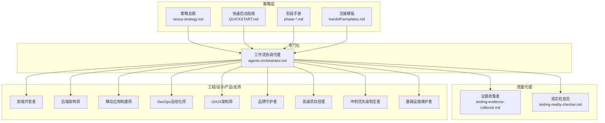
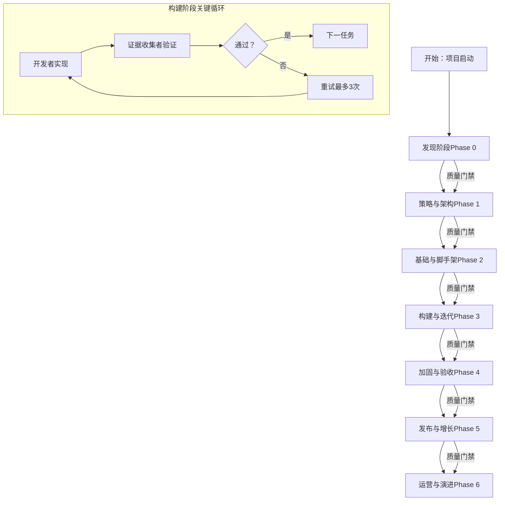
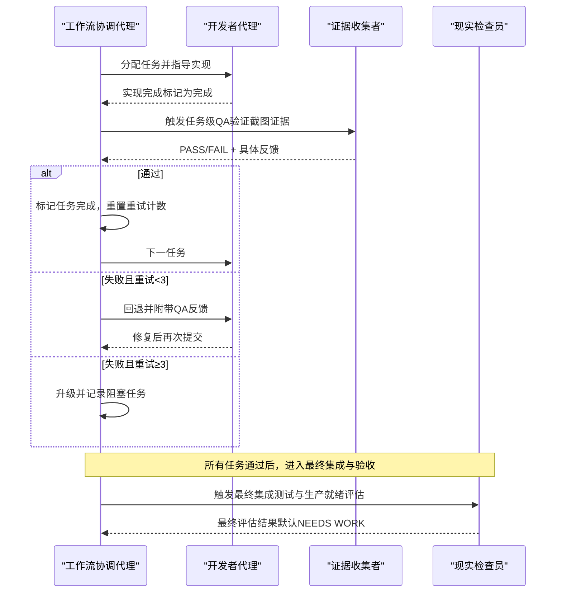
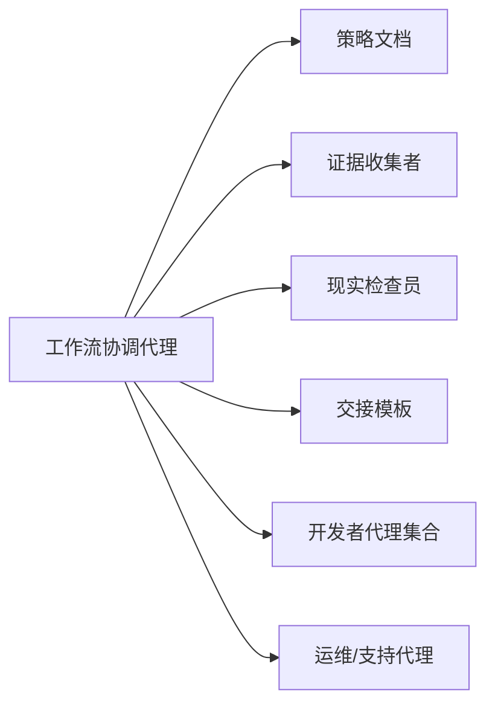

# 工作流协调代理

<cite>
**本文引用的文件**
- [agents-orchestrator.md](file://specialized/agents-orchestrator.md)
- [QUICKSTART.md](file://strategy/QUICKSTART.md)
- [README.md](file://README.md)
- [phase-0-discovery.md](file://strategy/playbooks/phase-0-discovery.md)
- [phase-1-strategy.md](file://strategy/playbooks/phase-1-strategy.md)
- [phase-2-foundation.md](file://strategy/playbooks/phase-2-foundation.md)
- [phase-3-build.md](file://strategy/playbooks/phase-3-build.md)
- [phase-4-hardening.md](file://strategy/playbooks/phase-4-hardening.md)
- [nexus-strategy.md](file://strategy/nexus-strategy.md)
- [scenario-startup-mvp.md](file://strategy/runbooks/scenario-startup-mvp.md)
- [agent-activation-prompts.md](file://strategy/coordination/agent-activation-prompts.md)
- [handoff-templates.md](file://strategy/coordination/handoff-templates.md)
- [testing-evidence-collector.md](file://testing/testing-evidence-collector.md)
- [testing-reality-checker.md](file://testing/testing-reality-checker.md)
</cite>

## 目录
1. [简介](#简介)
2. [项目结构](#项目结构)
3. [核心组件](#核心组件)
4. [架构总览](#架构总览)
5. [详细组件分析](#详细组件分析)
6. [依赖关系分析](#依赖关系分析)
7. [性能考量](#性能考量)
8. [故障排查指南](#故障排查指南)
9. [结论](#结论)
10. [附录](#附录)

## 简介
本文件系统化阐述“工作流协调代理”（Agents Orchestrator）作为自主管道管理器的职责与能力，覆盖从项目分析到最终集成的完整流程：项目规划阶段、技术架构阶段、开发-质量验证循环阶段、最终集成阶段。重点包括：
- 多代理协作机制与标准化交接模板
- 持续质量循环（Dev↔QA）与自动重试逻辑
- 质量门禁与失败处理策略
- 管道状态管理与进度追踪
- 使用示例、错误处理机制、状态报告模板与完成总结报告模板

## 项目结构
该仓库以“分部-职能-代理”的组织方式呈现，工作流协调代理位于“specialized”分部，配合“strategy”中的NEXUS方法论文档、“testing”中的质量代理以及各工程/设计/产品/支持分部的专家代理共同构成端到端的自动化流水线。

图表来源
- [nexus-strategy.md](file://strategy/nexus-strategy.md)
- [agents-orchestrator.md](file://specialized/agents-orchestrator.md)
- [phase-0-discovery.md](file://strategy/playbooks/phase-0-discovery.md)
- [phase-1-strategy.md](file://strategy/playbooks/phase-1-strategy.md)
- [phase-2-foundation.md](file://strategy/playbooks/phase-2-foundation.md)
- [phase-3-build.md](file://strategy/playbooks/phase-3-build.md)
- [phase-4-hardening.md](file://strategy/playbooks/phase-4-hardening.md)
- [handoff-templates.md](file://strategy/coordination/handoff-templates.md)
- [testing-evidence-collector.md](file://testing/testing-evidence-collector.md)
- [testing-reality-checker.md](file://testing/testing-reality-checker.md)

章节来源
- [README.md](file://README.md)
- [QUICKSTART.md](file://strategy/QUICKSTART.md)

## 核心组件
- 工作流协调代理（Agents Orchestrator）
  - 自主运行完整开发流水线，负责跨阶段推进、任务级验证、自动重试与质量门禁执行。
  - 维护管道状态、进度追踪、决策日志与报告输出。
- 质量代理
  - Evidence Collector：强制要求可视化证据，对交互、响应式、主题切换等进行系统性验证。
  - Reality Checker：最终集成测试与生产就绪评估，坚持“默认NEEDS WORK”，需要压倒性证据才批准。
- 标准化交接模板
  - 规范化的上下文传递，确保代理间无损交接，避免“上下文丢失”导致的返工与阻塞。

章节来源
- [agents-orchestrator.md](file://specialized/agents-orchestrator.md)
- [testing-evidence-collector.md](file://testing/testing-evidence-collector.md)
- [testing-reality-checker.md](file://testing/testing-reality-checker.md)
- [handoff-templates.md](file://strategy/coordination/handoff-templates.md)

## 架构总览
NEXUS方法论定义了从发现到运营的七阶段流水线，工作流协调代理贯穿其中，作为“管道控制器”管理每个阶段的产出与门禁，并在构建阶段推动Dev↔QA循环。

图表来源
- [nexus-strategy.md](file://strategy/nexus-strategy.md)
- [phase-3-build.md](file://strategy/playbooks/phase-3-build.md)
- [phase-4-hardening.md](file://strategy/playbooks/phase-4-hardening.md)

## 详细组件分析

### 工作流协调代理（Agents Orchestrator）
- 角色定位
  - 自主管道管理器与质量协调者，确保每阶段产出经由证据驱动的质量门禁后方可推进。
- 核心使命
  - 完整开发流水线编排：PM → ArchitectUX → [Dev ↔ QA 循环] → 集成
  - 任务级验证：每个实现任务必须通过QA后才能进入下一任务
  - 自动重试：失败任务回退至开发并附带具体反馈，最多3次
  - 质量门禁：任何阶段不得跳过证据与审批
- 决策逻辑
  - 任务级Dev↔QA循环：开发者实现 → Evidence Collector验证 → 判定通过/失败 → 通过则推进，失败则重试或升级
  - 错误处理：代理启动失败最多重试2次；任务实现失败最多3次；QA失败时重试或请求人工证据
- 状态管理
  - 记录当前阶段、任务进度、尝试次数、QA反馈、质量指标与下一步行动
- 报告与总结
  - 提供“管道进度报告”与“完成总结报告”模板，用于透明化沟通与复盘

图表来源
- [agents-orchestrator.md](file://specialized/agents-orchestrator.md)
- [testing-evidence-collector.md](file://testing/testing-evidence-collector.md)
- [testing-reality-checker.md](file://testing/testing-reality-checker.md)

章节来源
- [agents-orchestrator.md](file://specialized/agents-orchestrator.md)

### 阶段划分与质量门禁

#### 发现阶段（Phase 0：情报与发现）
- 目标：在投入资源前验证机会点，明确问题、市场与合规风险。
- 关键产出：市场分析、用户洞察、可用性研究、数据基线、合规矩阵、技术栈评估与执行摘要（GO/NO-GO/PIVOT）。
- 质量门禁：Executive Summary Generator产出的执行摘要决定是否进入下一阶段。

章节来源
- [phase-0-discovery.md](file://strategy/playbooks/phase-0-discovery.md)

#### 策略与架构阶段（Phase 1：策略与架构）
- 目标：定义要构建的内容、结构与成功标准，文档化所有架构决策与特性优先级。
- 关键产出：战略组合计划、品牌体系、财务计划、CSS设计系统与UX架构、系统架构规范、ML架构（如适用）、任务清单与优先级计划。
- 质量门禁：双签（Studio Producer + Reality Checker），确认架构覆盖100%需求、品牌体系完整、预算与安全合规已整合。

章节来源
- [phase-1-strategy.md](file://strategy/playbooks/phase-1-strategy.md)

#### 基础与脚手架阶段（Phase 2：基础与脚手架）
- 目标：搭建可工作的技术与运营基础，使后续开发具备可部署环境与设计系统。
- 关键产出：CI/CD流水线、基础设施与监控、Git工作流、应用骨架、数据库与API脚手架、设计系统实现。
- 质量门禁：DevOps Automator + Evidence Collector联合验证，确认流水线、健康检查、主题切换、组件库、监控与数据库状态均通过。

章节来源
- [phase-2-foundation.md](file://strategy/playbooks/phase-2-foundation.md)

#### 构建与迭代阶段（Phase 3：构建与迭代）
- 目标：通过连续的Dev↔QA循环实现特性，每个任务在进入下一任务前必须通过QA。
- 关键机制：Evidence Collector对每个任务进行可视化验证（桌面/平板/移动端截图、交互测试、品牌一致性），最多3次重试；失败则回退开发并附带反馈；超过3次则升级处理。
- 质量门禁：Agents Orchestrator汇总QA结果，确认所有任务通过、API端点验证、性能基线达标、无关键缺陷后进入下一阶段。

章节来源
- [phase-3-build.md](file://strategy/playbooks/phase-3-build.md)
- [agents-orchestrator.md](file://specialized/agents-orchestrator.md)

#### 加固与验收阶段（Phase 4：质量与硬化工）
- 目标：最终质量闸门，Reality Checker默认“NEEDS WORK”，需压倒性证据证明生产就绪。
- 关键产出：端到端用户旅程验证、跨设备一致性、性能认证、安全与合规认证、规格符合性验证。
- 质量门禁：Reality Checker作为唯一权威，综合Evidence Collector、API Tester、Performance Benchmarker、Legal Compliance Checker等的证据，给出最终评估。

章节来源
- [phase-4-hardening.md](file://strategy/playbooks/phase-4-hardening.md)
- [testing-reality-checker.md](file://testing/testing-reality-checker.md)

#### 发布与增长阶段（Phase 5：发布与增长）
- 目标：零停机部署、系统稳定、增长渠道激活、反馈闭环与高层汇报。
- 质量门禁：部署成功、系统稳定（首48小时无P0/P1）、用户获取活跃、反馈收集有效、干系人知情。

章节来源
- [nexus-strategy.md](file://strategy/nexus-strategy.md)

#### 运营与演进阶段（Phase 6：运营与演进）
- 目标：持续运营与改进，保持系统健康与业务增长。
- 关键活动：数据分析、基础设施维护、客户支持、流程优化与持续迭代。

章节来源
- [nexus-strategy.md](file://strategy/nexus-strategy.md)

### 多代理协作与交接模板
- 标准化交接模板确保上下文不丢失，涵盖元数据、背景、交付物请求、质量期望与后续交接对象。
- 关键交接对包括：PM→开发者（任务清单）、UX架构师→前端开发者（设计系统与布局）、后端架构师→前端开发者（API规范）、前端开发者→Evidence Collector（实现成果）、Evidence Collector→Agents Orchestrator（QA结果）、Reality Checker→Agents Orchestrator（集成评估）等。

章节来源
- [handoff-templates.md](file://strategy/coordination/handoff-templates.md)
- [nexus-strategy.md](file://strategy/nexus-strategy.md)

### 使用示例
- 启动完整流水线（单命令）
  - 在项目规格文件存在的情况下，直接触发Agents Orchestrator执行完整流水线：PM → ArchitectUX → [开发者 ↔ Evidence Collector 任务级循环] → Reality Checker。
- 快速启动模式
  - NEXUS-Full：全周期项目（12-24周）
  - NEXUS-Sprint：MVP/特性（2-6周）
  - NEXUS-Micro：专项任务（Bug修复、营销活动、合规审计、性能诊断、市场研究、UX改进）

章节来源
- [agents-orchestrator.md](file://specialized/agents-orchestrator.md)
- [QUICKSTART.md](file://strategy/QUICKSTART.md)

### 状态报告与完成总结报告模板
- 管道进度报告模板
  - 包含：当前阶段、项目名称、开始时间、任务完成状态、Dev-QA循环状态、质量指标、下一步行动与状态（在轨/延迟/阻塞）。
- 完成总结报告模板
  - 包含：项目名称、总耗时、最终状态（完成/需要改进/阻塞）、任务实施结果、QA循环次数、截图证据数量、关键问题解决情况、最终集成状态、代理表现、生产就绪状态与剩余工作、质量信心等级。

章节来源
- [agents-orchestrator.md](file://specialized/agents-orchestrator.md)

## 依赖关系分析
- 协调代理对以下组件具有强依赖：
  - 策略文档（nexus-strategy.md、phase-*.md）：定义阶段边界、质量门禁与角色职责
  - 质量代理（Evidence Collector、Reality Checker）：提供可视化证据与最终评估
  - 交接模板（handoff-templates.md）：保障上下文传递与协作稳定性
  - 各工程/设计/产品/支持代理：按阶段提供可交付成果
- 协调代理与被协调代理之间的耦合度通过标准化交接模板与质量门禁降低，避免“孤岛式工作”。

图表来源
- [agents-orchestrator.md](file://specialized/agents-orchestrator.md)
- [nexus-strategy.md](file://strategy/nexus-strategy.md)
- [phase-3-build.md](file://strategy/playbooks/phase-3-build.md)
- [phase-4-hardening.md](file://strategy/playbooks/phase-4-hardening.md)
- [handoff-templates.md](file://strategy/coordination/handoff-templates.md)

## 性能考量
- 流水线效率
  - 通过任务级QA与自动重试减少大规模返工，提升整体交付速度与质量稳定性。
  - 标准化交接模板降低沟通成本，缩短代理间等待时间。
- 质量与速度平衡
  - Reality Checker默认“NEEDS WORK”，确保在早期即建立高质量门槛，避免后期昂贵的修复成本。
- 可观测性
  - Evidence Collector与Performance Benchmarker提供可视化证据与性能数据，便于快速定位问题与优化方向。

## 故障排查指南
- 代理启动失败
  - 最多重试2次；若持续失败，记录并升级，采用手动回退程序继续推进。
- 任务实现失败
  - 最多3次重试；每次重试附带具体QA反馈；第3次仍失败则标记为阻塞任务，继续流水线并在最终集成中统一收敛。
- QA验证失败
  - 若QA代理失败，重试启动；若截图捕获失败，请求人工证据；若证据不充分，默认FAIL以保证安全。
- 门禁未通过
  - 质量门禁失败时，由门禁负责人出具失败报告，协调代理将失败项重新纳入Dev↔QA循环，最多3次再尝试，超限则由高层决策（如Studio Producer）决定修复、降级或接受风险。

章节来源
- [agents-orchestrator.md](file://specialized/agents-orchestrator.md)
- [phase-4-hardening.md](file://strategy/playbooks/phase-4-hardening.md)

## 结论
工作流协调代理通过系统化的阶段编排、任务级Dev↔QA循环、自动重试与质量门禁，将多代理协作从“各自为战”转变为“协同有序”。结合标准化交接模板与证据驱动的质量评估，能够显著提升交付质量与效率，适用于从MVP到全周期项目的多种场景。

## 附录
- 快速启动模式参考
  - NEXUS-Full、NEXUS-Sprint、NEXUS-Micro 的团队组成与执行要点
- MVP构建运行手册
  - 4-6周从概念到上线的周度执行与关键决策点
- 启动提示与激活指令
  - 针对不同工具的安装与激活步骤

章节来源
- [QUICKSTART.md](file://strategy/QUICKSTART.md)
- [scenario-startup-mvp.md](file://strategy/runbooks/scenario-startup-mvp.md)
- [agent-activation-prompts.md](file://strategy/coordination/agent-activation-prompts.md)