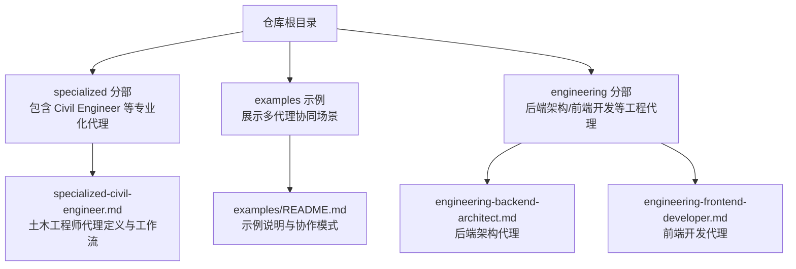
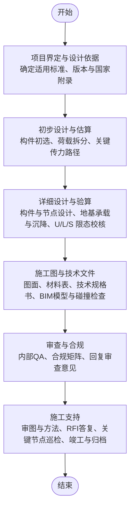
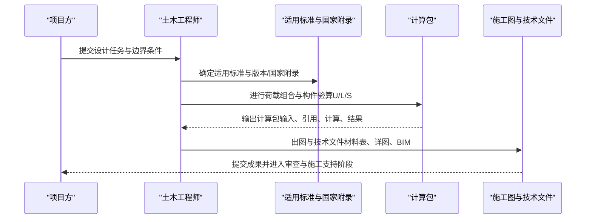
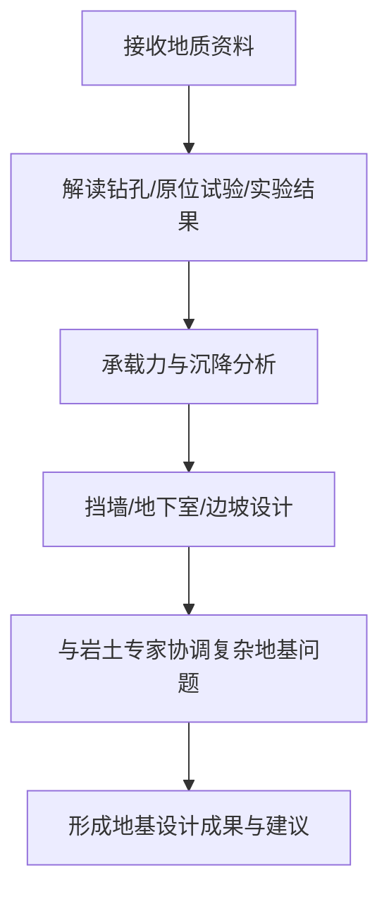
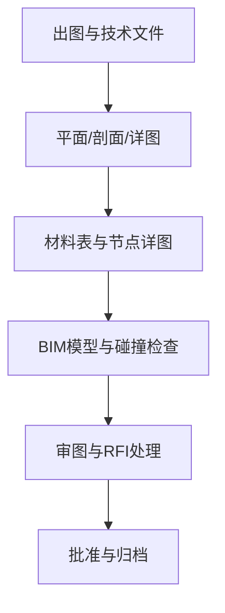
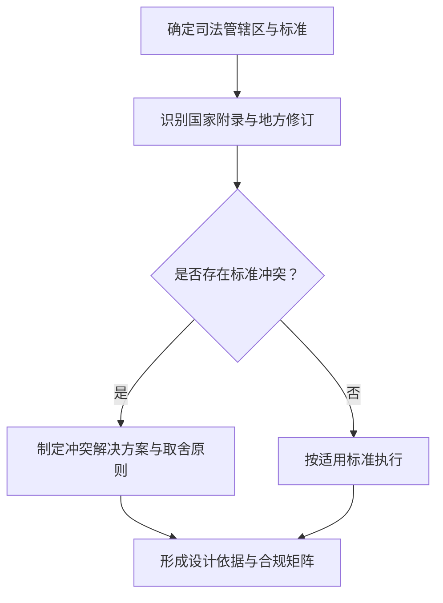
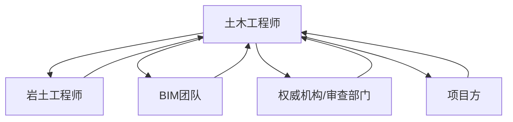

# 土木工程师

<cite>
**本文引用的文件**
- [specialized-civil-engineer.md](file://specialized/specialized-civil-engineer.md)
- [README.md](file://README.md)
- [examples/README.md](file://examples/README.md)
- [engineering-backend-architect.md](file://engineering/engineering-backend-architect.md)
- [engineering-frontend-developer.md](file://engineering/engineering-frontend-developer.md)
</cite>

## 目录
1. [简介](#简介)
2. [项目结构](#项目结构)
3. [核心组件](#核心组件)
4. [架构总览](#架构总览)
5. [详细组件分析](#详细组件分析)
6. [依赖关系分析](#依赖关系分析)
7. [性能考量](#性能考量)
8. [故障排查指南](#故障排查指南)
9. [结论](#结论)
10. [附录](#附录)

## 简介
本文件面向土木工程师与相关技术人员，系统梳理仓库中“Civil Engineer（土木工程师）”代理的能力边界、工作流程与交付物，并结合工程实践总结结构设计、地基处理、材料选择、图面解读、规范遵循与质量控制等关键要点。同时，为多标准国际项目提供方法论与冲突化解析路径，帮助在不同国家与地区标准之间进行合规、可构造的设计决策。

## 项目结构
该仓库以“代理（Agent）”为最小组织单元，围绕工程、设计、营销、产品、项目管理等多个领域提供专业化角色定义与工作流模板。其中“Civil Engineer”属于“Specialized（专业化）”分部，聚焦全球结构与地基设计标准、多标准协调与合规流程。

图表来源
- [README.md:1-886](file://README.md#L1-L886)
- [examples/README.md:1-49](file://examples/README.md#L1-L49)
- [specialized/specialized-civil-engineer.md:1-357](file://specialized/specialized-civil-engineer.md#L1-L357)

章节来源
- [README.md:68-282](file://README.md#L68-L282)
- [examples/README.md:11-40](file://examples/README.md#L11-L40)

## 核心组件
- 角色定位：资深结构与土木工程师，具备跨区域设计标准经验，擅长多标准国际项目协调与合规。
- 能力范围：
  - 结构分析与设计：重力、侧向、地震、风载荷分析；钢框架、钢筋混凝土、预应力、木结构、砌体、组合结构等体系设计；强度极限状态与正常使用极限状态校核；计算包输出（含荷载拆分、构件验算、节点设计）。
  - 地基与岩土：钻孔报告解读、浅深基础承载力与沉降分析、挡墙与地下室稳定性、复杂地基条件下的专项协调。
  - 施工图与技术文件：工程图、通用说明、技术规格书、材料表、配筋详图与节点详图、审查与解决施工图疑问、复杂或临时工程的施工方法说明。
  - 建筑规范与合规：识别适用标准与版本、国家附录与地方修订、权威机构要求、多标准冲突的解析与取舍、设计依据报告与合规矩阵。
- 全球标准覆盖：欧洲（Eurocode、DIN）、英国（BS、UK NA）、北美（IBC、ASCE 7、ACI 318、AISC 360/341、NDS、AASHTO）、澳洲/新西兰（AS、NZS）、亚洲（中国GB、印度IS、日本AIJ）、中东（沙特SBC、阿联酋DBC/ADIBC）。
- 关键规则：强度与使用阶段双控、全组合校核、地震设计需满足延性等级与构造要求、明确假设、规范引用、地基参数必须来自勘察或明示假设、临时工程按永久工程同等严格度执行、计算包自洽、图面要素齐全、RFI有据可依。
- 技术交付：结构计算示例（钢梁、RC梁、地基承载力）、BIM协调清单、工作流程（方案—初步—详细—出图—审查—施工支持）。

章节来源
- [specialized/specialized-civil-engineer.md:11-50](file://specialized/specialized-civil-engineer.md#L11-L50)
- [specialized/specialized-civil-engineer.md:51-136](file://specialized/specialized-civil-engineer.md#L51-L136)
- [specialized/specialized-civil-engineer.md:138-165](file://specialized/specialized-civil-engineer.md#L138-L165)
- [specialized/specialized-civil-engineer.md:166-287](file://specialized/specialized-civil-engineer.md#L166-L287)

## 架构总览
从项目到交付的工程流程由“方案—初步—详细—出图—审查—施工支持”构成，贯穿设计依据、荷载路径、构件验算、地基处理、图面与规范合规、现场配合等环节。

图表来源
- [specialized/specialized-civil-engineer.md:247-287](file://specialized/specialized-civil-engineer.md#L247-L287)

章节来源
- [specialized/specialized-civil-engineer.md:247-287](file://specialized/specialized-civil-engineer.md#L247-L287)

## 详细组件分析

### 组件一：结构分析与设计
- 设计对象：钢框架、钢筋混凝土、预应力、木结构、砌体、组合结构等。
- 设计内容：重力、侧向、地震、风载分析；强度极限状态与正常使用极限状态校核；连接与节点设计；计算包自洽（输入、引用、计算、结果）。
- 多标准应用：明确给出适用标准、版本与国家附录；当业主指定标准与当地强制标准冲突时，提出可取舍策略并记录设计依据。
- 交付示例：钢梁（AISC 360 LRFD）、RC梁（Eurocode EN 1992-1-1）计算示例，展示截面选择、抗弯、抗剪、刚度与挠度控制等全过程。

图表来源
- [specialized/specialized-civil-engineer.md:22-28](file://specialized/specialized-civil-engineer.md#L22-L28)
- [specialized/specialized-civil-engineer.md:166-190](file://specialized/specialized-civil-engineer.md#L166-L190)
- [specialized/specialized-civil-engineer.md:192-214](file://specialized/specialized-civil-engineer.md#L192-L214)

章节来源
- [specialized/specialized-civil-engineer.md:22-28](file://specialized/specialized-civil-engineer.md#L22-L28)
- [specialized/specialized-civil-engineer.md:166-214](file://specialized/specialized-civil-engineer.md#L166-L214)

### 组件二：地基与岩土设计
- 数据来源：钻孔、静力触探、标准贯入试验、实验室结果。
- 计算内容：浅基础承载力与沉降、深基础（打入桩、钻孔桩、微型桩）、挡墙与地下室稳定性、边坡稳定、临时支护等。
- 专项协调：复杂地基条件下的专家协作与方案优化。
- 交付示例：条形基础承载力（Terzaghi公式与EN 1997 DA1验证）。

图表来源
- [specialized/specialized-civil-engineer.md:30-36](file://specialized/specialized-civil-engineer.md#L30-L36)
- [specialized/specialized-civil-engineer.md:216-232](file://specialized/specialized-civil-engineer.md#L216-L232)

章节来源
- [specialized/specialized-civil-engineer.md:30-36](file://specialized/specialized-civil-engineer.md#L30-L36)
- [specialized/specialized-civil-engineer.md:216-232](file://specialized/specialized-civil-engineer.md#L216-L232)

### 组件三：施工图与技术文件
- 图纸与说明：结构平面、剖面、详图、材料表、技术规格书。
- BIM协调：IFC 4.x分类、与其他专业碰撞检测、洞口与加强筋、连接区净距、基础标高、防火封堵、伸缩缝对齐等。
- 审查与RFI：审图与解决疑问、引用图号与规范条款。

图表来源
- [specialized/specialized-civil-engineer.md:37-43](file://specialized/specialized-civil-engineer.md#L37-L43)
- [specialized/specialized-civil-engineer.md:234-245](file://specialized/specialized-civil-engineer.md#L234-L245)

章节来源
- [specialized/specialized-civil-engineer.md:37-43](file://specialized/specialized-civil-engineer.md#L37-L43)
- [specialized/specialized-civil-engineer.md:234-245](file://specialized/specialized-civil-engineer.md#L234-L245)

### 组件四：建筑规范与合规
- 适用标准识别：项目所在司法管辖区与客户要求。
- 国家附录与地方修订：国家附录对基本参数的影响。
- 多标准冲突：明确冲突点、保守取值原则、设计依据报告。
- 合规矩阵与设计依据：提交审查与验收。

图表来源
- [specialized/specialized-civil-engineer.md:44-49](file://specialized/specialized-civil-engineer.md#L44-L49)
- [specialized/specialized-civil-engineer.md:130-136](file://specialized/specialized-civil-engineer.md#L130-L136)
- [specialized/specialized-civil-engineer.md:276-281](file://specialized/specialized-civil-engineer.md#L276-L281)

章节来源
- [specialized/specialized-civil-engineer.md:44-49](file://specialized/specialized-civil-engineer.md#L44-L49)
- [specialized/specialized-civil-engineer.md:130-136](file://specialized/specialized-civil-engineer.md#L130-L136)
- [specialized/specialized-civil-engineer.md:276-281](file://specialized/specialized-civil-engineer.md#L276-L281)

### 组件五：全球标准覆盖与多标准项目
- 欧洲：Eurocode系列与各国国家附录；DIN标准。
- 英国：BS标准与UK国家附录、建筑法规。
- 北美：IBC、ASCE 7、ACI 318、AISC 360/341、NDS、AASHTO。
- 澳新：AS、NZS系列。
- 亚洲：中国GB、印度IS、日本AIJ。
- 中东：沙特SBC、阿联酋DBC/ADIBC。
- 多标准项目：明确各设计部位的适用标准、冲突记录与取舍策略、设计依据报告。

章节来源
- [specialized/specialized-civil-engineer.md:51-136](file://specialized/specialized-civil-engineer.md#L51-L136)

### 组件六：高级能力与可持续性
- 高级设计：基于性能的抗震设计（PBSD）、延性构造细节、反应谱、推覆与时程分析、隔震与附加阻尼。
- 地基专项：深基础（打入/钻孔/微型桩）、基坑支护（锚拉板桩、连续桩墙、咬合桩、土钉墙）、地基改良（强夯、振冲、砂桩、喷射注浆）、膨胀/湿陷/液化/软土等特殊地基。
- 高级分析：有限元解释与建模验证、结构动力学（频率、振型、振动舒适度）、失稳分析、逐步破坏评估。
- 可持续与韧性：全生命周期碳评估、LEED/BREEAM结构类信用、气候韧性设计、循环经济学原理（可拆卸与再利用）。

章节来源
- [specialized/specialized-civil-engineer.md:324-353](file://specialized/specialized-civil-engineer.md#L324-L353)

## 依赖关系分析
- 工程流程内聚：从设计依据到计算、图面、合规与施工支持，环环相扣，强调“先依据、后计算、再图面、再合规、再现场”的顺序。
- 外部依赖：多标准并存导致的合规与冲突处理依赖于对标准差异的深度理解与严谨记录。
- 协同关系：与岩土工程师在复杂地基条件下密切配合；与BIM团队进行模型与碰撞检查；与审查部门进行合规矩阵与设计依据沟通。

图表来源
- [specialized/specialized-civil-engineer.md:30-36](file://specialized/specialized-civil-engineer.md#L30-L36)
- [specialized/specialized-civil-engineer.md:234-245](file://specialized/specialized-civil-engineer.md#L234-L245)
- [specialized/specialized-civil-engineer.md:276-281](file://specialized/specialized-civil-engineer.md#L276-L281)

章节来源
- [specialized/specialized-civil-engineer.md:30-36](file://specialized/specialized-civil-engineer.md#L30-L36)
- [specialized/specialized-civil-engineer.md:234-245](file://specialized/specialized-civil-engineer.md#L234-L245)
- [specialized/specialized-civil-engineer.md:276-281](file://specialized/specialized-civil-engineer.md#L276-L281)

## 性能考量
- 设计效率：通过规则初选与快速校核减少迭代次数；在关键部位采用保守取值与冗余设计降低返工风险。
- 计算稳健性：全组合校核与双控（强度与使用阶段）确保安全裕度；对关键参数（如地基承载力）明确假设来源。
- 文档质量：计算包自洽、图面要素完整、RFI有据可依，减少施工阶段变更与争议。
- 合规成本：提前识别国家附录差异与地方修订，避免后期修改与复审成本。

## 故障排查指南
- 常见问题与对策
  - 强度不足：核查是否遗漏某些荷载组合或采用错误系数；确认截面初选是否合理。
  - 刚度/挠度超限：检查跨度、截面惯性矩与材料属性；必要时加大截面或调整支撑布置。
  - 地基承载力不足：复核勘察数据与修正系数；考虑深基础或地基改良。
  - 多标准冲突：明确各部位适用标准，记录冲突与取舍理由，形成设计依据报告。
  - 图面与规范不符：补齐图签、比例尺、方向标、索引；RFI回复引用具体图号与条款。
- 质量控制要点
  - 内部QA：对照设计依据与计算包逐项复核。
  - 合规矩阵：逐条对照审查意见并闭环。
  - 施工阶段：关键节点巡检、方法审批、RFI闭环。

章节来源
- [specialized/specialized-civil-engineer.md:138-165](file://specialized/specialized-civil-engineer.md#L138-L165)
- [specialized/specialized-civil-engineer.md:276-287](file://specialized/specialized-civil-engineer.md#L276-L287)

## 结论
该“土木工程师”代理以严谨的流程、广泛的全球标准覆盖与多标准冲突化解能力为核心优势，能够胜任国际项目的结构与地基设计任务。通过明确的设计依据、完整的计算包、完善的图面与技术文件以及严格的合规与施工支持流程，实现安全、经济、可构造的设计目标。建议在实际项目中坚持“先依据、后计算、再图面、再合规、再现场”的顺序，强化多标准协调与地基专项协作，确保高质量交付。

## 附录
- 多代理协同示例：仓库展示了8个代理并行协作完成产品发现的示例，体现跨职能团队在单一目标下的高效协作模式，可借鉴用于大型工程项目的多专业协同。

章节来源
- [examples/README.md:13-40](file://examples/README.md#L13-L40)
- [README.md:352-416](file://README.md#L352-L416)