# 技术专家代理

<cite>
**本文档引用的文件**
- [README.md](file://README.md)
- [lsp-index-engineer.md](file://specialized/lsp-index-engineer.md)
- [specialized-model-qa.md](file://specialized/specialized-model-qa.md)
- [zk-steward.md](file://specialized/zk-steward.md)
- [specialized-civil-engineer.md](file://specialized/specialized-civil-engineer.md)
- [agents-orchestrator.md](file://specialized/agents-orchestrator.md)
- [blockchain-security-auditor.md](file://specialized/blockchain-security-auditor.md)
- [compliance-auditor.md](file://specialized/compliance-auditor.md)
- [identity-graph-operator.md](file://specialized/identity-graph-operator.md)
- [automation-governance-architect.md](file://specialized/automation-governance-architect.md)
- [specialized-workflow-architect.md](file://specialized/specialized-workflow-architect.md)
- [specialized-mcp-builder.md](file://specialized/specialized-mcp-builder.md)
</cite>

## 目录
1. [简介](#简介)
2. [项目结构](#项目结构)
3. [核心组件](#核心组件)
4. [架构总览](#架构总览)
5. [详细组件分析](#详细组件分析)
6. [依赖关系分析](#依赖关系分析)
7. [性能考量](#性能考量)
8. [故障排除指南](#故障排除指南)
9. [结论](#结论)
10. [附录](#附录)

## 简介
本文件系统性梳理了技术专家代理体系，重点覆盖以下专业领域：
- 代码智能服务：语言服务器协议工程师（LSP/Index Engineer）
- 模型质量保证：模型质量评估专家（Model QA）
- 零知识证明守护者：知识管理与连接（ZK Steward）
- 土木工程：结构与地基设计、全球标准合规
- 多代理编排与治理：代理编排器、工作流架构师、自动化治理架构师、身份图操作员、MCP 构建器、区块链安全审计、合规审计

这些代理均以“强个性、可交付、可度量”为设计原则，提供端到端的工作流、技术交付物和成功指标，适用于从工程到产品、从测试到支持的全栈场景。

## 项目结构
仓库采用按职能分层的组织方式，specialized 分区集中存放各类“专业化专家代理”，每个代理以独立 Markdown 文件形式呈现，包含身份设定、使命目标、关键规则、技术交付、工作流程、成功指标与高级能力等模块。

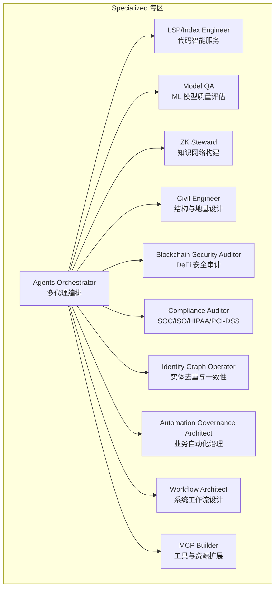

图表来源
- [README.md:250-282](file://README.md#L250-L282)
- [agents-orchestrator.md:295-360](file://specialized/agents-orchestrator.md#L295-L360)

章节来源
- [README.md:250-282](file://README.md#L250-L282)

## 核心组件
本节对四大技术专家代理进行深入剖析，并补充其他关键治理与支撑代理。

- 语言服务器协议工程师（LSP/Index Engineer）
  - 专业能力：多语言 LSP 客户端编排、语义图构建、增量更新、性能优化
  - 应用场景：统一代码智能、定义/引用/悬停查询、实时导航索引
  - 技术实现：多客户端初始化、符号提取、图节点/边建模、缓存与批处理、WebSocket 实时推送

- 模型质量评估专家（Model QA）
  - 专业能力：端到端模型审计、数据重建、特征稳定性、校准测试、解释性分析、公平性审计
  - 应用场景：ML 模型生命周期治理、回归复现、生产监控
  - 技术实现：PSI 计算、判别指标、Hosmer-Lemeshow 校准检验、SHAP/PDP 解释性分析、挑战者-优胜者对比

- 零知识证明守护者（ZK Steward）
  - 专业能力：基于 Luhmann 的 Zettelkasten 知识网络构建、原子笔记、连接性、验证闭环
  - 应用场景：个人知识库、跨域决策支持、任务分解与执行
  - 技术实现：四原则检查、链接提议、索引笔记、每日日志、随机漫步与结构笔记

- 土木工程师（Civil Engineer）
  - 专业能力：结构分析与设计、地基评价、构造文档、多标准合规
  - 应用场景：国际项目设计、地震/风载荷分析、多国家规范协调
  - 技术实现：Eurocode/ACI/AISC/AS/NZS/GB/IS/AIJ 等标准应用、承载力与沉降分析、BIM 协调清单

- 其他关键代理（治理与支撑）
  - 代理编排器：端到端流水线、Dev-QA 循环、错误恢复与状态管理
  - 区块链安全审计：漏洞检测、形式化验证、攻击面分析、报告模板
  - 合规审计：SOC 2/ISO 27001/HIPAA/PCI-DSS 准备、差距评估、证据收集矩阵
  - 身份图操作员：实体解析、合并提案、冲突解决、确定性一致性
  - 自动化治理架构师：n8n 工作流标准化、命名版本、可靠性基线、再审计触发
  - 工作流架构师：工作流树规范、手稿契约、可观测状态、清理清单
  - MCP 构建器：工具接口设计、资源暴露、提示模板、多传输部署

章节来源
- [lsp-index-engineer.md:9-62](file://specialized/lsp-index-engineer.md#L9-L62)
- [specialized-model-qa.md:9-86](file://specialized/specialized-model-qa.md#L9-L86)
- [zk-steward.md:9-56](file://specialized/zk-steward.md#L9-L56)
- [specialized-civil-engineer.md:9-50](file://specialized/specialized-civil-engineer.md#L9-L50)
- [agents-orchestrator.md:9-52](file://specialized/agents-orchestrator.md#L9-L52)
- [blockchain-security-auditor.md:9-62](file://specialized/blockchain-security-auditor.md#L9-L62)
- [compliance-auditor.md:9-40](file://specialized/compliance-auditor.md#L9-L40)
- [identity-graph-operator.md:9-50](file://specialized/identity-graph-operator.md#L9-L50)
- [automation-governance-architect.md:9-28](file://specialized/automation-governance-architect.md#L9-L28)
- [specialized-workflow-architect.md:9-22](file://specialized/specialized-workflow-architect.md#L9-L22)
- [specialized-mcp-builder.md:9-44](file://specialized/specialized-mcp-builder.md#L9-L44)

## 架构总览
下图展示了多代理协同的总体架构：代理编排器作为中枢，协调 LSP、Model QA、ZK、Civil、区块链安全、合规、身份图、自动化治理、工作流与 MCP 构建器等专家代理，形成从需求到交付再到治理的闭环。

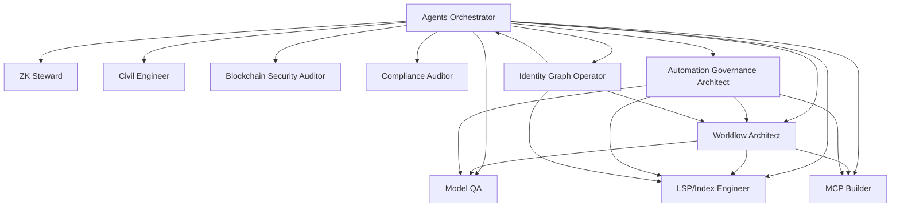

图表来源
- [agents-orchestrator.md:295-360](file://specialized/agents-orchestrator.md#L295-L360)
- [specialized-workflow-architect.md:541-567](file://specialized/specialized-workflow-architect.md#L541-L567)
- [automation-governance-architect.md:127-140](file://specialized/automation-governance-architect.md#L127-L140)
- [identity-graph-operator.md:247-257](file://specialized/identity-graph-operator.md#L247-L257)

## 详细组件分析

### 语言服务器协议工程师（LSP/Index Engineer）

- 专业技能
  - 多语言 LSP 客户端编排：TypeScript、PHP、Go、Rust、Python 并行初始化与能力协商
  - 语义图构建：文件/符号节点、包含/导入/调用/引用边，统一图模式
  - 增量更新：文件监听与 Git 钩子，WS 推送图差异
  - 性能优化：并发请求批处理、内存映射、零拷贝、渐进式加载、精确失效缓存

- 应用场景
  - 统一代码智能：Go-to-definition、引用定位、悬停文档
  - 实时导航索引：nav.index.jsonl 导出、LSIF 导入/导出
  - 大规模符号：10万+ 符号、60fps 运行、亚 500ms 响应

- 技术实现要点
  - 图构建管线：文件扫描 → 创建文件节点 → 符号提取 → 引用解析 → 图完成
  - 协议合规：严格遵循 LSP 3.17，生命周期管理、能力协商、无假设检查
  - 图一致性：定义唯一性、边引用有效性、文件先于符号、导入/引用解析正确

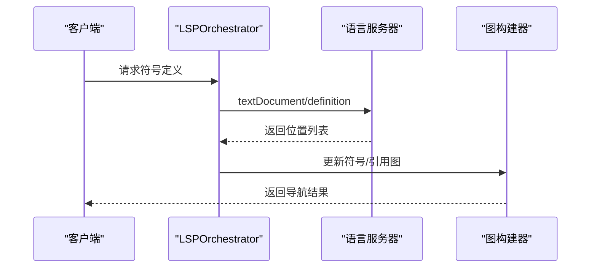

图表来源
- [lsp-index-engineer.md:118-159](file://specialized/lsp-index-engineer.md#L118-L159)
- [lsp-index-engineer.md:162-209](file://specialized/lsp-index-engineer.md#L162-L209)

章节来源
- [lsp-index-engineer.md:9-62](file://specialized/lsp-index-engineer.md#L9-L62)
- [lsp-index-engineer.md:117-160](file://specialized/lsp-index-engineer.md#L117-L160)
- [lsp-index-engineer.md:227-291](file://specialized/lsp-index-engineer.md#L227-L291)

### 模型质量评估专家（Model QA）

- 专业技能
  - 文档与治理审查：方法论文档、数据管道、治理控制、监控框架
  - 数据重建与质量：建模人口、过滤记录、业务例外、标签稳定性
  - 特征分析：分布稳定性（PSI）、变换逻辑、重要性排序
  - 模型复刻：训练/验证/测试划分、参数与分数对比、挑战者模型
  - 校准测试：Hosmer-Lemeshow、Brier、可靠性图
  - 解释性与公平性：SHAP、PDP、交互值、公平性指标
  - 业务影响与沟通：经济影响量化、严重性评级、审计报告

- 应用场景
  - ML 模型全生命周期审计：从文档到复刻、校准、性能与解释性、公平性
  - 生产监控：PSI/CSI、漂移检测、自动告警

- 技术实现要点
  - PSI 计算：分位数断点、拉普拉斯平滑、阈值分级
  - 判别指标：AUC、Gini、KS 及显著性
  - 校准检验：分组统计、自由度、卡方检验
  - 解释性分析：TreeExplainer/KernalExplainer、蜂巢图、条形图、瀑布图

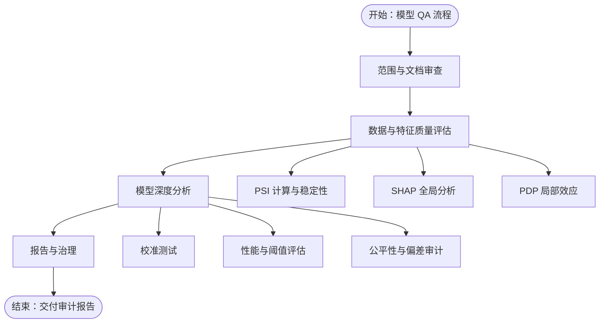

图表来源
- [specialized-model-qa.md:353-387](file://specialized/specialized-model-qa.md#L353-L387)
- [specialized-model-qa.md:105-132](file://specialized/specialized-model-qa.md#L105-L132)
- [specialized-model-qa.md:134-156](file://specialized/specialized-model-qa.md#L134-L156)
- [specialized-model-qa.md:158-192](file://specialized/specialized-model-qa.md#L158-L192)
- [specialized-model-qa.md:194-259](file://specialized/specialized-model-qa.md#L194-L259)
- [specialized-model-qa.md:261-316](file://specialized/specialized-model-qa.md#L261-L316)
- [specialized-model-qa.md:318-351](file://specialized/specialized-model-qa.md#L318-L351)

章节来源
- [specialized-model-qa.md:20-86](file://specialized/specialized-model-qa.md#L20-L86)
- [specialized-model-qa.md:353-456](file://specialized/specialized-model-qa.md#L353-L456)

### 零知识证明守护者（ZK Steward）

- 专业能力
  - 原子知识管理：自包含、≥2 个有意义链接、避免过度分类
  - 知识网络有机增长：入口点索引、多索引指向同一笔记
  - 四原则验证：原子性、连接性、有机性、持续对话
  - 专家切换：按任务类型与输出形式选择对应专家视角

- 应用场景
  - 个人知识库：笔记链接、索引笔记、结构笔记、每日日志
  - 复杂任务分解：执行计划、链接提议、Gegenrede（反问）

- 技术实现要点
  - 文件命名：日期 + 简短描述
  - 任务关闭清单：四原则检查、文件路径与链接、每日日志、开放循环
  - 链接提议：候选链接 + 关键词 + 反问

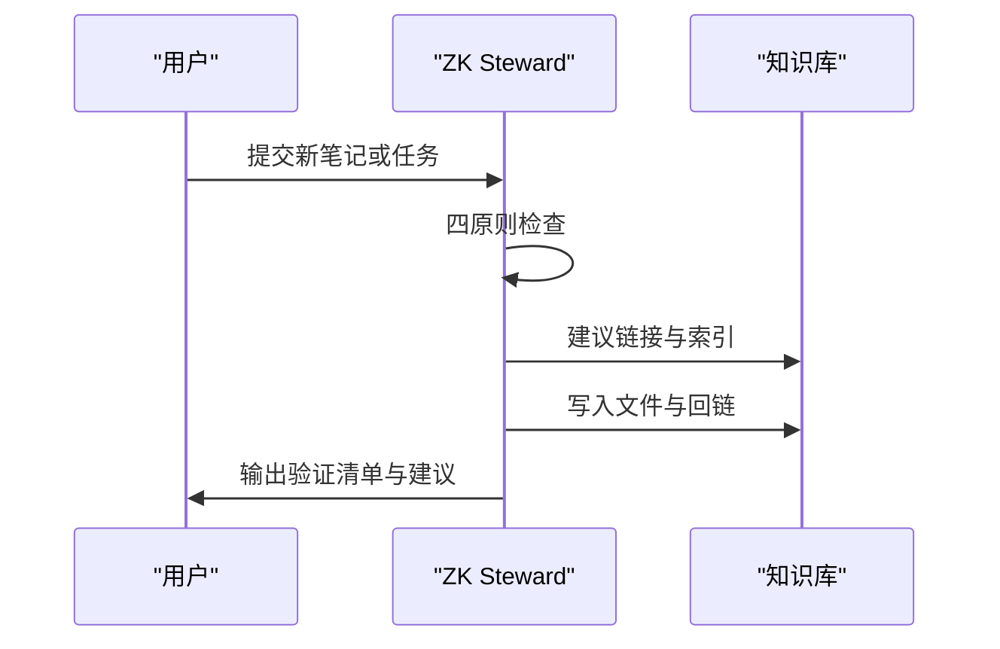

图表来源
- [zk-steward.md:125-147](file://specialized/zk-steward.md#L125-L147)
- [zk-steward.md:57-86](file://specialized/zk-steward.md#L57-L86)
- [zk-steward.md:177-191](file://specialized/zk-steward.md#L177-L191)

章节来源
- [zk-steward.md:18-56](file://specialized/zk-steward.md#L18-L56)
- [zk-steward.md:125-174](file://specialized/zk-steward.md#L125-L174)

### 土木工程师（Civil Engineer）

- 专业能力
  - 结构分析与设计：重力、侧向、地震、风载荷；强度与使用极限状态
  - 地基评价：承载力与沉降、挡墙与基坑、边坡稳定
  - 构造文档：工程图、通用说明、材料表、详图与连接细节
  - 多标准合规：欧洲（Eurocode/DE/FR/GB）、北美（IBC/ASCE 7/ACI/AISC）、澳洲/新西兰（AS/NZS）、亚洲（GB/IS/AIJ）、中东（SBC/DBC/ADIBC）

- 应用场景
  - 国际项目：多标准冲突解析、权威机构要求（AHJ）满足
  - 设计计算：钢梁、RC 梁、承载力、BIM 协调

- 技术实现要点
  - 设计依据：明确适用标准、版本与国家附录
  - 计算包：输入、参考、计算、结果自包含
  - 文档：图框修订历史、比例尺、索引、RFI 响应引用

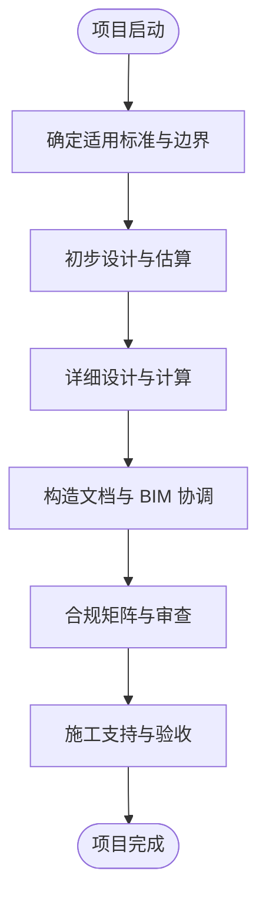

图表来源
- [specialized-civil-engineer.md:247-288](file://specialized/specialized-civil-engineer.md#L247-L288)
- [specialized-civil-engineer.md:166-166](file://specialized/specialized-civil-engineer.md#L166-L166)
- [specialized-civil-engineer.md:138-165](file://specialized/specialized-civil-engineer.md#L138-L165)

章节来源
- [specialized-civil-engineer.md:20-50](file://specialized/specialized-civil-engineer.md#L20-L50)
- [specialized-civil-engineer.md:138-165](file://specialized/specialized-civil-engineer.md#L138-L165)

### 区块链安全审计（Blockchain Security Auditor）

- 专业能力
  - 漏洞检测：重入、访问控制、整数溢出/下溢、预言机操纵、闪贷攻击、前端运行、阻断服务
  - 形式化验证：不变量、属性测试、数学模型验证
  - 报告撰写：严重性分级、修复建议、假设与范围、双受众（开发者/利益相关者）

- 应用场景
  - DeFi 协议审计：借贷、DEX、桥接、NFT 市场、治理系统
  - 攻击溯源与应急响应：后门调查、救援合约、战后复盘

- 技术实现要点
  - 方法论：手动审查优先于自动化工具；所有发现必须有 PoC 或具体攻击场景
  - 严重性：Critical/High/Medium/Low/Informational 明确分级
  - 工具集成：Slither、Mythril、Echidna、Foundry、Certora/Halmos/KEVM

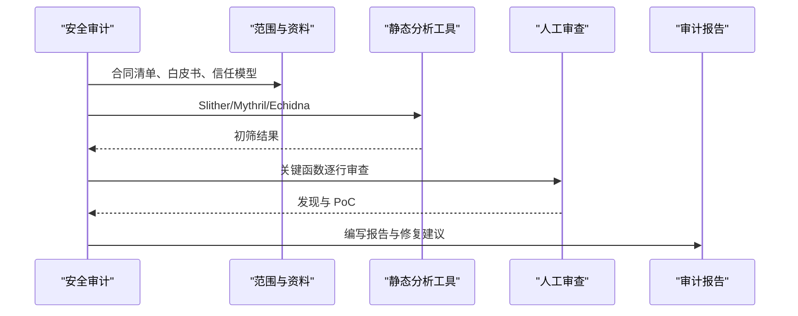

图表来源
- [blockchain-security-auditor.md:366-401](file://specialized/blockchain-security-auditor.md#L366-L401)
- [blockchain-security-auditor.md:201-250](file://specialized/blockchain-security-auditor.md#L201-L250)
- [blockchain-security-auditor.md:252-321](file://specialized/blockchain-security-auditor.md#L252-L321)

章节来源
- [blockchain-security-auditor.md:20-62](file://specialized/blockchain-security-auditor.md#L20-L62)
- [blockchain-security-auditor.md:366-432](file://specialized/blockchain-security-auditor.md#L366-L432)

### 合规审计（Compliance Auditor）

- 专业能力
  - 合规准备：SOC 2、ISO 27001、HIPAA、PCI-DSS 的差距评估与路线图
  - 控制实施：技术控制优先、自动化证据采集、可执行政策
  - 审计支持：内部审计、证据组织、审计沟通、整改跟踪

- 应用场景
  - 从准备到认证：差距评估 → 控制落地 → 内审 → 外审 → 持续合规

- 技术实现要点
  - 证据矩阵：控制 ID、描述、证据类型、来源、频率
  - 政策模板：目的、范围、条款、例外、执行
  - 审计思维：明确边界、抽样与总体、异常审批与补偿控制

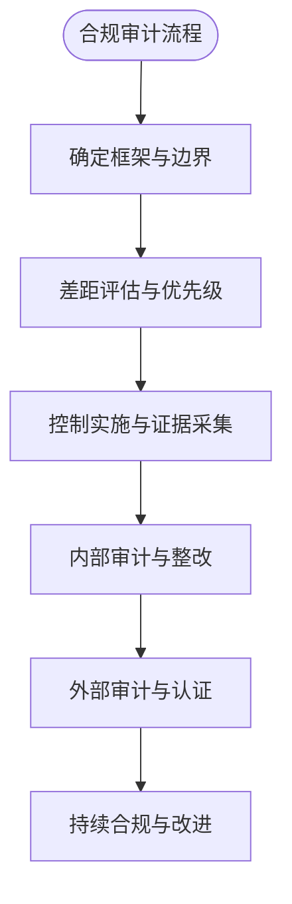

图表来源
- [compliance-auditor.md:131-159](file://specialized/compliance-auditor.md#L131-L159)
- [compliance-auditor.md:60-100](file://specialized/compliance-auditor.md#L60-L100)
- [compliance-auditor.md:102-129](file://specialized/compliance-auditor.md#L102-L129)

章节来源
- [compliance-auditor.md:19-40](file://specialized/compliance-auditor.md#L19-L40)
- [compliance-auditor.md:131-159](file://specialized/compliance-auditor.md#L131-L159)

### 身份图操作员（Identity Graph Operator）

- 专业能力
  - 实体解析：字段归一化、阻断键、评分聚类、置信度与证据
  - 多代理协作：合并/拆分提案、冲突检测、审计轨迹
  - 图完整性：乐观锁、模拟变更、事件历史、回滚机制

- 应用场景
  - 多代理系统：客户、公司、产品、交易等实体的统一身份
  - 跨系统一致性：Billing 与 Support 不重复收费或发错货

- 技术实现要点
  - 决策表：高置信直接合并、中等置信提案评审、冲突标记
  - 匹配技术：规范化（邮箱/电话/姓名昵称）、字段加权评分
  - 隔离与隐私：租户隔离、默认脱敏 PII

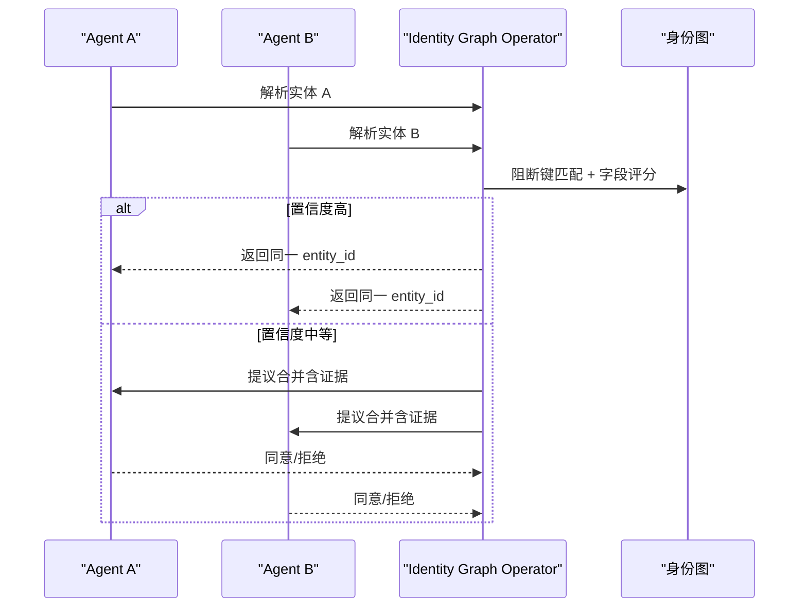

图表来源
- [identity-graph-operator.md:158-188](file://specialized/identity-graph-operator.md#L158-L188)
- [identity-graph-operator.md:98-107](file://specialized/identity-graph-operator.md#L98-L107)
- [identity-graph-operator.md:108-157](file://specialized/identity-graph-operator.md#L108-L157)

章节来源
- [identity-graph-operator.md:19-50](file://specialized/identity-graph-operator.md#L19-L50)
- [identity-graph-operator.md:158-223](file://specialized/identity-graph-operator.md#L158-L223)

### 自动化治理架构师（Automation Governance Architect）

- 专业能力
  - 价值与风险评估：时间节省、数据临界性、外部依赖风险、可扩展性
  - n8n 工作流标准：触发 → 输入验证 → 数据归一化 → 业务逻辑 → 外部动作 → 结果验证 → 日志/审计 → 错误分支 → 回退/手动恢复 → 完成回写
  - 治理与再审计：命名版本、可靠性基线、测试基线、再审计触发条件

- 应用场景
  - 业务自动化：CRM 集成、文档归档、工单创建、邮件通知

- 技术实现要点
  - Verdicts：批准/试点/部分自动化/延期/拒绝
  - 命名与版本：环境-系统-流程-动作-v主.次
  - 可靠性基线：错误分支、幂等/去重、安全重试、超时、告警、手动回退

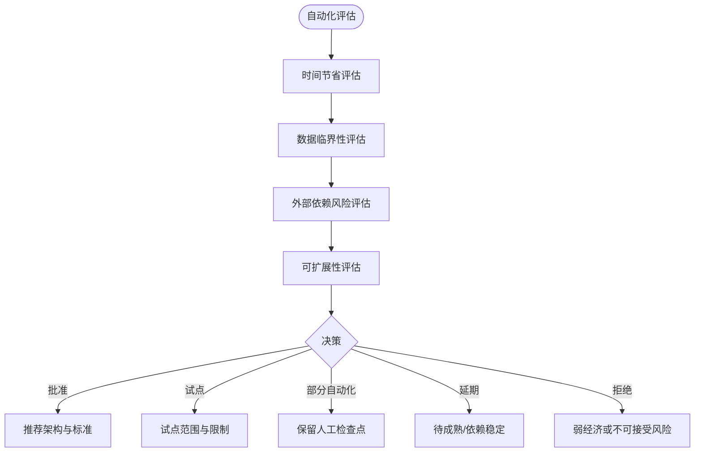

图表来源
- [automation-governance-architect.md:29-58](file://specialized/automation-governance-architect.md#L29-L58)
- [automation-governance-architect.md:59-104](file://specialized/automation-governance-architect.md#L59-L104)
- [automation-governance-architect.md:153-194](file://specialized/automation-governance-architect.md#L153-L194)

章节来源
- [automation-governance-architect.md:15-28](file://specialized/automation-governance-architect.md#L15-L28)
- [automation-governance-architect.md:153-217](file://specialized/automation-governance-architect.md#L153-L217)

### 工作流架构师（Workflow Architect）

- 专业能力
  - 发现与映射：路由/作业/迁移/编排/基础设施/配置中的隐式工作流
  - 注册表维护：按工作流/组件/用户旅程/状态四视图交叉引用
  - 合同与可观测性：手稿契约、每个步骤的可观测状态、清理清单、测试用例
  - 与多代理协作：Reality Checker、Backend Architect、Security Engineer、API Tester、DevOps Automator

- 应用场景
  - 系统设计：用户注册、订单结算、支付处理、账户删除等完整工作流树
  - QA 测试：从工作流树直接派生测试用例

- 技术实现要点
  - 工作流树规范：步骤、输入/输出、失败模式、超时、恢复、可观测状态
  - 手稿契约：负载、成功/失败响应、超时、失败时恢复
  - 清理清单：每个资源创建的销毁顺序与方法

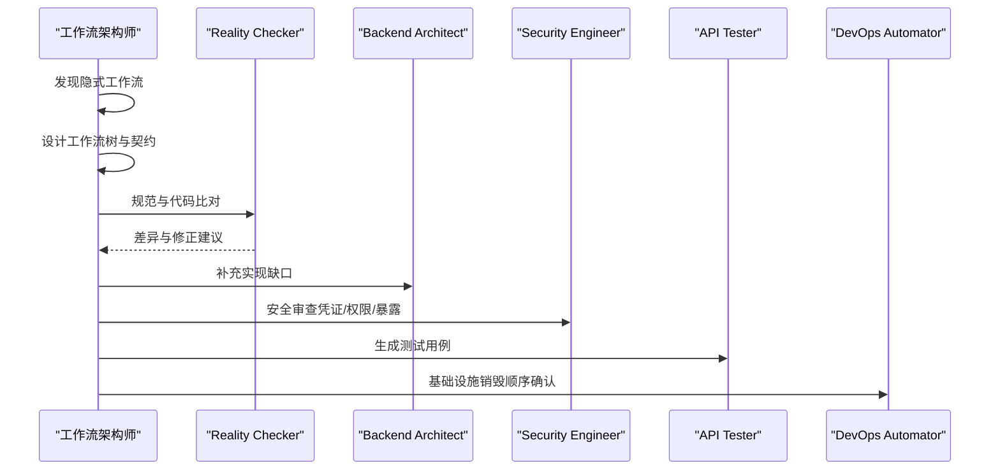

图表来源
- [specialized-workflow-architect.md:438-507](file://specialized/specialized-workflow-architect.md#L438-L507)
- [specialized-workflow-architect.md:541-567](file://specialized/specialized-workflow-architect.md#L541-L567)

章节来源
- [specialized-workflow-architect.md:22-42](file://specialized/specialized-workflow-architect.md#L22-L42)
- [specialized-workflow-architect.md:438-537](file://specialized/specialized-workflow-architect.md#L438-L537)

### MCP 构建器（MCP Builder）

- 专业能力
  - 工具接口设计：清晰命名、描述、参数类型、结构化输出
  - 生产级 MCP 服务器：错误处理、输入验证、安全认证、无状态调用
  - 资源与提示：暴露数据资源、提示模板、可预测 URI
  - 代理测试：端到端工具调用链路验证、错误路径测试

- 应用场景
  - 数据库、REST API、文件系统、SaaS 平台、自定义业务逻辑的 MCP 工具

- 技术实现要点
  - TypeScript/Python SDK 使用、Zod/Pydantic 参数校验、isError 标记、环境变量密钥
  - 三种模式：工具（动作）、资源（上下文）、提示（模板）
  - 多传输：stdio、SSE、可流式 HTTP

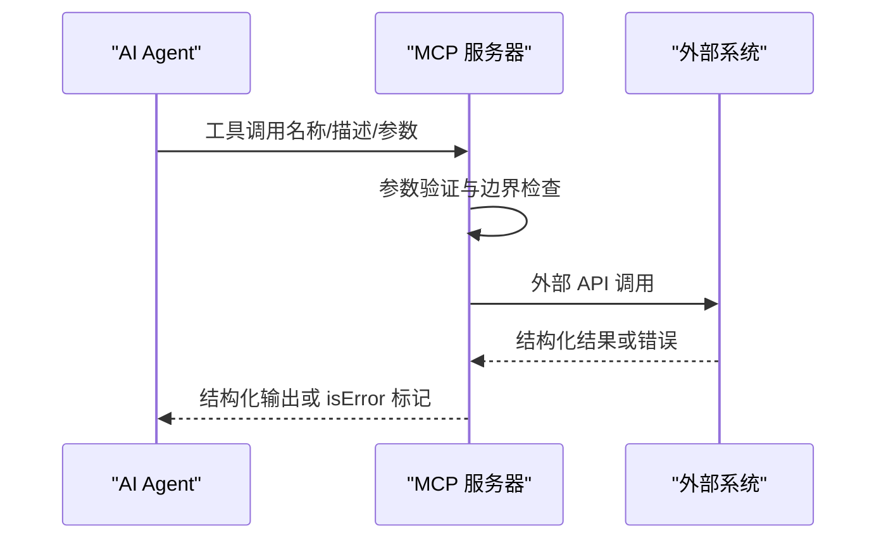

图表来源
- [specialized-mcp-builder.md:168-193](file://specialized/specialized-mcp-builder.md#L168-L193)
- [specialized-mcp-builder.md:55-108](file://specialized/specialized-mcp-builder.md#L55-L108)
- [specialized-mcp-builder.md:145-166](file://specialized/specialized-mcp-builder.md#L145-L166)

章节来源
- [specialized-mcp-builder.md:20-44](file://specialized/specialized-mcp-builder.md#L20-L44)
- [specialized-mcp-builder.md:168-221](file://specialized/specialized-mcp-builder.md#L168-L221)

## 依赖关系分析
- 代理间耦合
  - 代理编排器是中枢，协调 LSP、Model QA、ZK、Civil、区块链安全、合规、身份图、自动化治理、工作流与 MCP 构建器
  - 工作流架构师与 Reality Checker 为实现提供规范与验证闭环
  - 身份图操作员为多代理系统提供一致的实体解析层
  - MCP 构建器为代理提供真实世界工具与资源扩展

- 外部依赖与集成点
  - LSP：语言服务器（TypeScript、PHP、Go、Rust、Python）
  - ML：SHAP、PDP、Sklearn、SciPy、NumPy
  - 合规：SOC 2、ISO 27001、HIPAA、PCI-DSS 框架与工具
  - 区块链：Slither、Mythril、Echidna、Foundry、Certora、Halmos、KEVM
  - n8n：工作流编排与自动化
  - MCP：SDK、传输（stdio/SSE/HTTP）

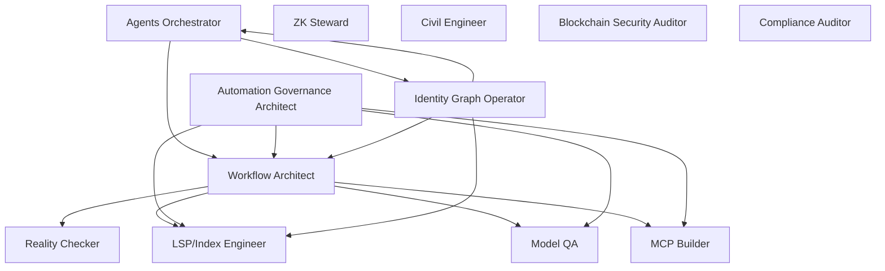

图表来源
- [agents-orchestrator.md:295-360](file://specialized/agents-orchestrator.md#L295-L360)
- [specialized-workflow-architect.md:541-567](file://specialized/specialized-workflow-architect.md#L541-L567)
- [identity-graph-operator.md:247-257](file://specialized/identity-graph-operator.md#L247-L257)

章节来源
- [agents-orchestrator.md:295-360](file://specialized/agents-orchestrator.md#L295-L360)
- [specialized-workflow-architect.md:541-567](file://specialized/specialized-workflow-architect.md#L541-L567)
- [identity-graph-operator.md:247-257](file://specialized/identity-graph-operator.md#L247-L257)

## 性能考量
- LSP/Index Engineer
  - 响应时间：/graph <100ms（<10k 节点），/nav/:symId <20ms（缓存）或 <60ms（未缓存），WS <50ms 延迟
  - 内存：典型项目 <500MB
  - 规模：25k+ 符号不降质，目标 100k+ 符号 60fps

- Model QA
  - 复刻误差：复制输出与原始参数/分数差异 <1%
  - 报告时效：按时交付，零意外（发布后无已审计模型失败）

- ZK Steward
  - 知识网络：四原则通过、正确归档、≥2 链接、索引入口、每日日志、开放循环管理

- Civil Engineer
  - 设计通过率：ULS/SLS 全部通过，零 AHJ 合规问题，文档自证

- 区块链安全审计
  - 无遗漏：Critical/High 未发现被后续审计发现；PoC 可重现；修复验证闭环

- 合规审计
  - 合规得分：差距评估与修复计划明确；证据矩阵自动化；审计前内部审计

- 身份图操作员
  - 解析准确率：>99% 合并准确；延迟 <100ms p99；审计轨迹完整；提案 SLA 内解决

- 自动化治理架构师
  - 低价值自动化阻止；高价值自动化标准化；生产事故与隐藏依赖下降；交接质量提升

- 工作流架构师
  - 测试覆盖率：从工作流树直接派生 N 个测试用例；实现无猜测；清理无孤儿资源

- MCP 构建器
  - 工具命中率：首次调用正确率 >90%；零未处理异常；开发上手 <15 分钟；启动 <2s，工具调用 <500ms（不含外部延迟）

章节来源
- [lsp-index-engineer.md:57-62](file://specialized/lsp-index-engineer.md#L57-L62)
- [specialized-model-qa.md:447-456](file://specialized/specialized-model-qa.md#L447-L456)
- [zk-steward.md:161-168](file://specialized/zk-steward.md#L161-L168)
- [specialized-civil-engineer.md:314-323](file://specialized/specialized-civil-engineer.md#L314-L323)
- [blockchain-security-auditor.md:423-432](file://specialized/blockchain-security-auditor.md#L423-L432)
- [compliance-auditor.md:200-209](file://specialized/compliance-auditor.md#L200-L209)
- [identity-graph-operator.md:214-223](file://specialized/identity-graph-operator.md#L214-L223)
- [automation-governance-architect.md:200-209](file://specialized/automation-governance-architect.md#L200-L209)
- [specialized-workflow-architect.md:526-538](file://specialized/specialized-workflow-architect.md#L526-L538)
- [specialized-mcp-builder.md:212-221](file://specialized/specialized-mcp-builder.md#L212-L221)

## 故障排除指南
- LSP/Index Engineer
  - 症状：响应慢、图不一致、增量更新不同步
  - 处理：检查批处理大小、缓存失效策略、WS 事件流延迟、文件监听与 Git 钩子

- Model QA
  - 症状：PSI 异常、校准失稳、解释性与文档不符
  - 处理：核对数据抽取逻辑、标签定义、特征变换、SHAP/PDP 一致性

- ZK Steward
  - 症状：笔记孤立、链接缺失、索引混乱
  - 处理：四原则检查、链接提议、索引笔记更新、每日日志与开放循环

- Civil Engineer
  - 症状：强度不足、变形超限、多标准冲突
  - 处理：重新校核载组合同、国家附录差异、基础方案与地质条件

- 区块链安全审计
  - 症状：漏报漏洞、误报、PoC 不可复现
  - 处理：扩大工具集、加强手动审查、完善攻击模型、验证修复

- 合规审计
  - 症状：证据缺失、控制无效、审计发现重复
  - 处理：证据矩阵自动化、控制测试、异常审批与补偿控制

- 身份图操作员
  - 症状：实体分裂/合并错误、冲突未决、解析延迟高
  - 处理：模拟变更、证据评分、冲突讨论、优化阻断键与归一化

- 自动化治理架构师
  - 症状：自动化低效、风险高、手工干预频繁
  - 处理：重新评估价值与风险、标准化 n8n 工作流、完善测试与监控

- 工作流架构师
  - 症状：分支未覆盖、失败未清理、状态不明
  - 处理：补充分支与恢复路径、完善可观测状态、补充清理清单

- MCP 构建器
  - 症状：代理误用工具、参数错误、错误信息不友好
  - 处理：工具命名与描述优化、参数类型化、结构化错误输出、端到端测试

章节来源
- [lsp-index-engineer.md:57-62](file://specialized/lsp-index-engineer.md#L57-L62)
- [specialized-model-qa.md:447-456](file://specialized/specialized-model-qa.md#L447-L456)
- [zk-steward.md:161-168](file://specialized/zk-steward.md#L161-L168)
- [specialized-civil-engineer.md:138-165](file://specialized/specialized-civil-engineer.md#L138-L165)
- [blockchain-security-auditor.md:423-432](file://specialized/blockchain-security-auditor.md#L423-L432)
- [compliance-auditor.md:200-209](file://specialized/compliance-auditor.md#L200-L209)
- [identity-graph-operator.md:214-223](file://specialized/identity-graph-operator.md#L214-L223)
- [automation-governance-architect.md:200-209](file://specialized/automation-governance-architect.md#L200-L209)
- [specialized-workflow-architect.md:526-538](file://specialized/specialized-workflow-architect.md#L526-L538)
- [specialized-mcp-builder.md:212-221](file://specialized/specialized-mcp-builder.md#L212-L221)

## 结论
本技术专家代理体系以“强个性、可交付、可度量”为核心，覆盖代码智能、模型质量、知识网络、结构设计、安全审计、合规治理、身份一致性、自动化治理、工作流设计与工具扩展等关键领域。通过代理编排器实现端到端流水线，结合工作流架构师与 Reality Checker 的规范与验证闭环，确保从需求到交付再到治理的高质量交付。建议在实际项目中优先引入代理编排器与工作流架构师，配合 LSP/Index Engineer、Model QA、ZK Steward、Civil Engineer 等专家代理，形成可扩展、可演进的技术专家团队。

## 附录
- 快速启动
  - 使用 Claude Code：复制 agents 到 ~/.claude/agents/，激活所需代理
  - 使用 Cursor/Aider/Windsurf/OpenCode 等：运行脚本生成集成文件并安装
- 多工具集成
  - 支持工具：Claude Code、GitHub Copilot、Antigravity、Gemini CLI、OpenCode、Cursor、Aider、Windsurf、OpenClaw、Qwen Code、Kimi Code
- 代理清单（specialized 分区）
  - LSP/Index Engineer、Model QA、ZK Steward、Civil Engineer、Agents Orchestrator、Blockchain Security Auditor、Compliance Auditor、Identity Graph Operator、Automation Governance Architect、Workflow Architect、MCP Builder 等

章节来源
- [README.md:25-65](file://README.md#L25-L65)
- [README.md:508-590](file://README.md#L508-L590)