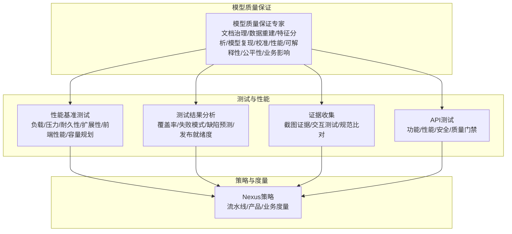
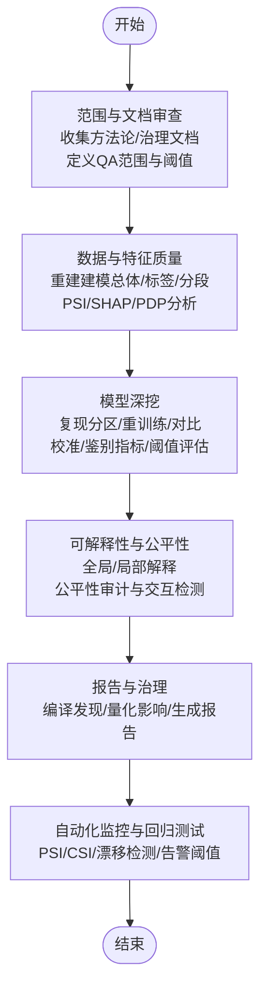
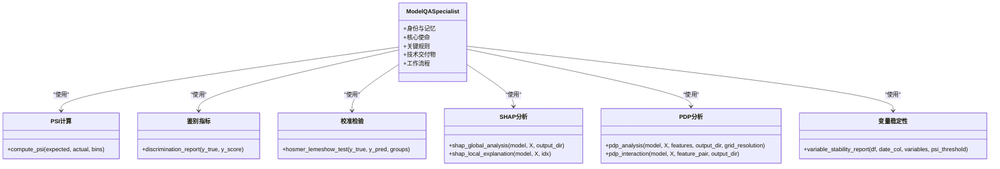
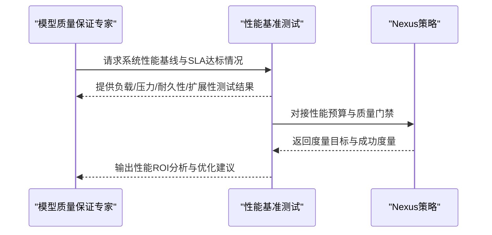
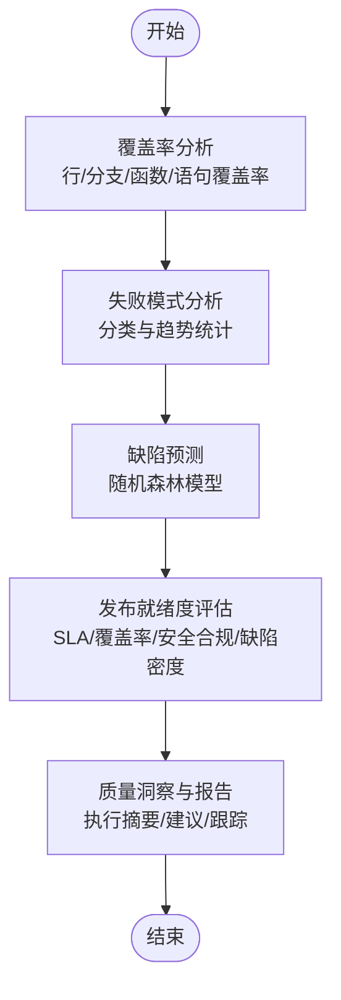
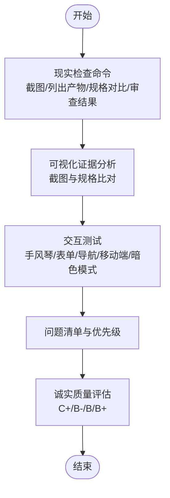
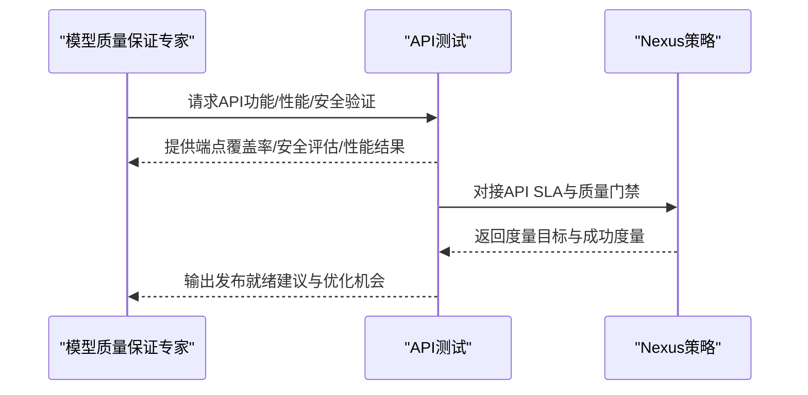
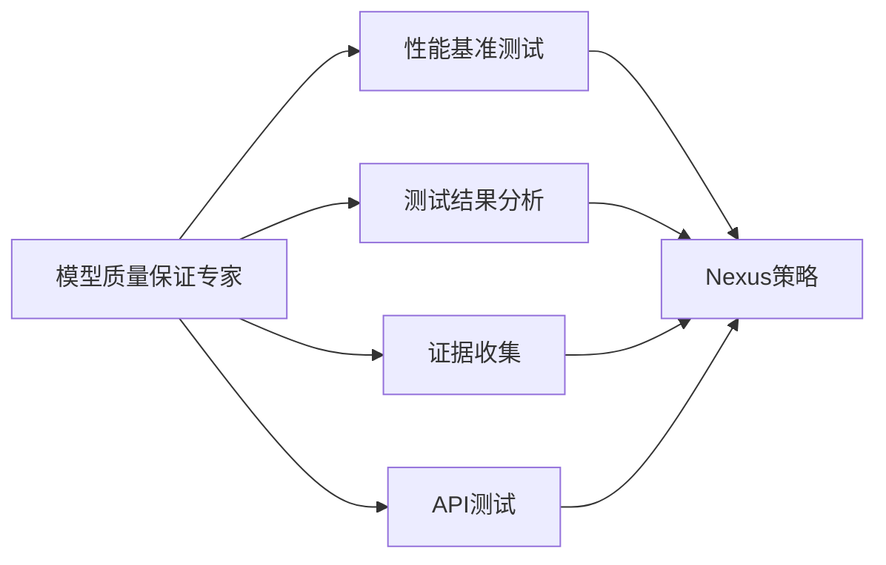

# 模型质量保证专家

<cite>
**本文引用的文件**
- [specialized-model-qa.md](file://specialized/specialized-model-qa.md)
- [testing-performance-benchmarker.md](file://testing/testing-performance-benchmarker.md)
- [testing-test-results-analyzer.md](file://testing/testing-test-results-analyzer.md)
- [testing-evidence-collector.md](file://testing/testing-evidence-collector.md)
- [testing-api-tester.md](file://testing/testing-api-tester.md)
- [nexus-strategy.md](file://strategy/nexus-strategy.md)
</cite>

## 目录
1. [简介](#简介)
2. [项目结构](#项目结构)
3. [核心组件](#核心组件)
4. [架构总览](#架构总览)
5. [详细组件分析](#详细组件分析)
6. [依赖关系分析](#依赖关系分析)
7. [性能考量](#性能考量)
8. [故障排查指南](#故障排查指南)
9. [结论](#结论)
10. [附录](#附录)

## 简介
本文件面向“模型质量保证专家”角色，系统化阐述AI模型的质量评估体系、性能基准测试、准确性验证与回归测试机制，并给出可落地的评估指标、测试用例设计与质量改进建议。文档结合仓库中已有的模型QA方法论、性能基准测试、测试结果分析与证据收集等能力，构建从数据到部署的全生命周期质量保障闭环。

## 项目结构
该仓库以“代理角色”为组织单元，围绕“模型质量保证专家”形成如下关键模块：
- 模型质量保证专家：端到端审计ML/统计模型，覆盖文档治理、数据重建、目标标签、分段与队列、特征工程、模型复现、校准测试、性能与监控、可解释性与公平性、业务影响与沟通。
- 性能基准测试：系统级性能测试与优化，包含负载、压力、耐久性、扩展性测试，Web性能与Core Web Vitals优化，容量规划与可扩展性评估。
- 测试结果分析：基于统计与机器学习的方法对测试结果进行覆盖率、失败模式、缺陷预测、发布就绪度等分析。
- 证据收集：以截图与可视化证据为核心的QA流程，强调“所见即所得”的真实性与可追溯性。
- API测试：面向API的功能、性能与安全测试，集成到CI/CD的质量门禁。
- Nexus策略：将质量指标与成功度量纳入整体流水线与产品度量，确保跨团队协同与持续改进。

图表来源
- [specialized-model-qa.md:20-102](file://specialized/specialized-model-qa.md#L20-L102)
- [testing-performance-benchmarker.md:19-41](file://testing/testing-performance-benchmarker.md#L19-L41)
- [testing-test-results-analyzer.md:19-41](file://testing/testing-test-results-analyzer.md#L19-L41)
- [testing-evidence-collector.md:19-38](file://testing/testing-evidence-collector.md#L19-L38)
- [testing-api-tester.md:19-41](file://testing/testing-api-tester.md#L19-L41)
- [nexus-strategy.md:757-789](file://strategy/nexus-strategy.md#L757-L789)

章节来源
- [specialized-model-qa.md:1-102](file://specialized/specialized-model-qa.md#L1-L102)
- [testing-performance-benchmarker.md:1-56](file://testing/testing-performance-benchmarker.md#L1-L56)
- [testing-test-results-analyzer.md:1-41](file://testing/testing-test-results-analyzer.md#L1-L41)
- [testing-evidence-collector.md:1-38](file://testing/testing-evidence-collector.md#L1-L38)
- [testing-api-tester.md:1-41](file://testing/testing-api-tester.md#L1-L41)
- [nexus-strategy.md:757-789](file://strategy/nexus-strategy.md#L757-L789)

## 核心组件
- 文档与治理审查：验证方法论文档完整性、数据管道一致性、审批变更控制、监控框架存在性与充分性、模型清单与生命周期跟踪。
- 数据重建与质量：重构建模总体、过滤/排除记录稳定性、业务异常与覆盖、数据抽取与转换逻辑验证。
- 目标/标签分析：标签分布与定义组件、时间窗口与队列稳定性、监督模型标注质量（噪声、泄漏、一致性）、观测与结果窗口验证。
- 分段与队列评估：子群体材料度与异质性、组合模型跨子人群一致性、分段边界随时间稳定性。
- 特征分析与工程：复现特征选择与变换、分布与月度稳定性、缺失值模式、PSI计算、二元与多元选择分析、特征变换/编码/分箱验证、SHAP/PDP深度可解释性分析。
- 模型复现与构建：复现训练/验证/测试样本选择与分区逻辑、从文档复现训练管线、复制输出与原始对比（参数差异、分数分布）、提出挑战者模型作为独立基准、默认要求：可复现实验脚本与与原版的对比报告。
- 校准测试：概率校准统计检验（Hosmer-Lemeshow、Brier、可靠性图）、子群体与时间窗口稳定性、分布漂移与压力场景下的校准评估。
- 性能与监控：跨子群体与业务驱动因素的模型表现、鉴别指标（Gini、KS、AUC、F1、RMSE等按需）在所有数据切分上的跟踪、模型简洁性、特征重要性稳定性与粒度、对保留集与生产集的持续监控、与现有生产模型的基准对比、决策阈值评估（精确率、召回率、特异性与下游影响）。
- 可解释性与公平性：全局可解释性（SHAP汇总图、PDP、特征重要性排序）、局部可解释性（SHAP瀑布/力图）、公平性审计（受保护特征的群体公平、等化奇数）、交互检测（SHAP交互值）。
- 业务影响与沟通：所有使用场景的文档化与变更影响报告、量化模型变更的经济影响、产出分级严重性的审计报告、向利益相关方与治理机构沟通证据的验证。

章节来源
- [specialized-model-qa.md:20-102](file://specialized/specialized-model-qa.md#L20-L102)
- [specialized-model-qa.md:103-132](file://specialized/specialized-model-qa.md#L103-L132)
- [specialized-model-qa.md:134-156](file://specialized/specialized-model-qa.md#L134-L156)
- [specialized-model-qa.md:158-192](file://specialized/specialized-model-qa.md#L158-L192)
- [specialized-model-qa.md:194-316](file://specialized/specialized-model-qa.md#L194-L316)
- [specialized-model-qa.md:318-351](file://specialized/specialized-model-qa.md#L318-L351)
- [specialized-model-qa.md:353-387](file://specialized/specialized-model-qa.md#L353-L387)
- [specialized-model-qa.md:388-428](file://specialized/specialized-model-qa.md#L388-L428)

## 架构总览
模型质量保证专家的执行流程由“范围与文档审查—数据与特征质量—模型深挖—报告与治理”四个阶段组成，贯穿可解释性与公平性分析、校准测试、性能监控与基准对比，并通过自动化监控与回归测试机制持续保障。

图表来源
- [specialized-model-qa.md:353-387](file://specialized/specialized-model-qa.md#L353-L387)
- [specialized-model-qa.md:480-485](file://specialized/specialized-model-qa.md#L480-L485)

章节来源
- [specialized-model-qa.md:353-387](file://specialized/specialized-model-qa.md#L353-L387)

## 详细组件分析

### 组件A：模型质量保证专家（角色）
- 身份与记忆：独立模型审计员，不参与被审计模型的构建；记住常见失败模式（静默数据漂移、过拟合冠军、校准偏差、不稳定特征贡献、公平性违规）。
- 核心使命：覆盖文档治理、数据重建、目标标签、分段与队列、特征分析、模型复现、校准测试、性能与监控、可解释性与公平性、业务影响与沟通十个领域。
- 关键规则：独立性原则、可复现标准、基于证据的发现与严重性分级。
- 技术交付物：PSI计算、鉴别指标（Gini/KS/AUC）、Hosmer-Lemeshow校准检验、SHAP全局/局部分析、PDP/PDP交互分析、变量稳定性报告模板。

图表来源
- [specialized-model-qa.md:105-132](file://specialized/specialized-model-qa.md#L105-L132)
- [specialized-model-qa.md:134-156](file://specialized/specialized-model-qa.md#L134-L156)
- [specialized-model-qa.md:158-192](file://specialized/specialized-model-qa.md#L158-L192)
- [specialized-model-qa.md:194-259](file://specialized/specialized-model-qa.md#L194-L259)
- [specialized-model-qa.md:261-316](file://specialized/specialized-model-qa.md#L261-L316)
- [specialized-model-qa.md:318-351](file://specialized/specialized-model-qa.md#L318-L351)

章节来源
- [specialized-model-qa.md:1-102](file://specialized/specialized-model-qa.md#L1-L102)
- [specialized-model-qa.md:103-351](file://specialized/specialized-model-qa.md#L103-L351)

### 组件B：性能基准测试（角色）
- 核心使命：执行负载、压力、耐久性、扩展性测试；建立性能基线与竞争性基准分析；识别瓶颈并提供优化建议；建立具备预测预警与实时追踪的性能监控系统。
- 关键能力：Web性能与Core Web Vitals优化（LCP/FID/CLS/SI），容量规划与可扩展性评估，性能预算与CI/CD质量门禁。
- 成功度量：95%系统满足或超越SLA；Core Web Vitals达到“良好”评分；性能优化带来关键用户体验指标25%提升；支持10倍当前负载的可扩展性；性能监控预防90%性能相关事件。

图表来源
- [testing-performance-benchmarker.md:19-41](file://testing/testing-performance-benchmarker.md#L19-L41)
- [testing-performance-benchmarker.md:237-245](file://testing/testing-performance-benchmarker.md#L237-L245)
- [nexus-strategy.md:757-789](file://strategy/nexus-strategy.md#L757-L789)

章节来源
- [testing-performance-benchmarker.md:1-56](file://testing/testing-performance-benchmarker.md#L1-L56)
- [testing-performance-benchmarker.md:153-178](file://testing/testing-performance-benchmarker.md#L153-L178)
- [testing-performance-benchmarker.md:179-219](file://testing/testing-performance-benchmarker.md#L179-L219)
- [testing-performance-benchmarker.md:237-245](file://testing/testing-performance-benchmarker.md#L237-L245)
- [nexus-strategy.md:757-789](file://strategy/nexus-strategy.md#L757-L789)

### 组件C：测试结果分析（角色）
- 核心使命：综合测试结果评估、质量指标分析、从测试活动中生成可操作洞察；基于统计分析识别失败模式、趋势与系统性质量问题；生成缺陷预测模型与质量风险评估。
- 关键能力：覆盖率分析与缺口识别、失败模式统计分析、缺陷预测（随机森林）、发布就绪度评估、质量洞察与报告生成。
- 成功度量：质量风险预测准确率95%；分析建议实施率90%；缺陷逃逸预防提升85%；测试完成后24小时内交付报告。

图表来源
- [testing-test-results-analyzer.md:58-188](file://testing/testing-test-results-analyzer.md#L58-L188)
- [testing-test-results-analyzer.md:190-215](file://testing/testing-test-results-analyzer.md#L190-L215)
- [testing-test-results-analyzer.md:216-256](file://testing/testing-test-results-analyzer.md#L216-L256)
- [testing-test-results-analyzer.md:274-282](file://testing/testing-test-results-analyzer.md#L274-L282)

章节来源
- [testing-test-results-analyzer.md:1-41](file://testing/testing-test-results-analyzer.md#L1-L41)
- [testing-test-results-analyzer.md:58-188](file://testing/testing-test-results-analyzer.md#L58-L188)
- [testing-test-results-analyzer.md:190-256](file://testing/testing-test-results-analyzer.md#L190-L256)
- [testing-test-results-analyzer.md:274-305](file://testing/testing-test-results-analyzer.md#L274-L305)

### 组件D：证据收集（角色）
- 核心理念：“截图不撒谎”，要求一切主张必须有视觉证据；默认先找3-5个问题；不要添加超出原始规格的要求。
- 关键流程：现实检查命令（Playwright截图、列出实际构建产物、规格对比、审查测试结果JSON）；可视化证据分析；交互元素测试（手风琴、表单、导航、移动端主题切换）。
- 自动失败触发：声称“零问题”、首次实现完美分数、无证据的“奢华”宣称、未全面测试即宣称“生产就绪”。

图表来源
- [testing-evidence-collector.md:39-69](file://testing/testing-evidence-collector.md#L39-L69)
- [testing-evidence-collector.md:70-99](file://testing/testing-evidence-collector.md#L70-L99)
- [testing-evidence-collector.md:119-174](file://testing/testing-evidence-collector.md#L119-L174)
- [testing-evidence-collector.md:197-211](file://testing/testing-evidence-collector.md#L197-L211)

章节来源
- [testing-evidence-collector.md:1-38](file://testing/testing-evidence-collector.md#L1-L38)
- [testing-evidence-collector.md:39-99](file://testing/testing-evidence-collector.md#L39-L99)
- [testing-evidence-collector.md:119-174](file://testing/testing-evidence-collector.md#L119-L174)
- [testing-evidence-collector.md:197-211](file://testing/testing-evidence-collector.md#L197-L211)

### 组件E：API测试（角色）
- 核心使命：开发并实施涵盖功能、性能与安全的API测试框架；创建自动化测试套件；构建契约测试；将API测试集成到CI/CD。
- 关键能力：功能测试（有效/无效输入）、安全测试（认证/授权/SQL注入/速率限制）、性能测试（响应时间/并发请求/资源利用率）、第三方集成与文档测试。
- 成功度量：95%+端点覆盖；零关键安全漏洞进入生产；API性能稳定满足SLA；90%以上API测试自动化并集成到CI/CD；完整套件测试时间低于15分钟。

图表来源
- [testing-api-tester.md:19-41](file://testing/testing-api-tester.md#L19-L41)
- [testing-api-tester.md:275-283](file://testing/testing-api-tester.md#L275-L283)
- [nexus-strategy.md:757-789](file://strategy/nexus-strategy.md#L757-L789)

章节来源
- [testing-api-tester.md:1-41](file://testing/testing-api-tester.md#L1-L41)
- [testing-api-tester.md:197-222](file://testing/testing-api-tester.md#L197-L222)
- [testing-api-tester.md:223-257](file://testing/testing-api-tester.md#L223-L257)
- [testing-api-tester.md:275-306](file://testing/testing-api-tester.md#L275-L306)
- [nexus-strategy.md:757-789](file://strategy/nexus-strategy.md#L757-L789)

## 依赖关系分析
- 模型质量保证专家依赖于性能基准测试提供的系统级性能基线与SLA达标情况，用于模型部署后的性能回归与容量评估。
- 测试结果分析为模型质量保证专家提供统计与预测视角，辅助识别模型训练过程中的失败模式与缺陷倾向。
- 证据收集确保模型质量保证专家的结论具备可追溯的可视化证据，避免“幻想式报告”。
- API测试为模型服务接口提供功能、性能与安全验证，保障模型上线后的运行质量与稳定性。
- Nexus策略将上述质量度量纳入整体流水线与产品度量，确保跨团队协作与持续改进。

图表来源
- [specialized-model-qa.md:353-387](file://specialized/specialized-model-qa.md#L353-L387)
- [testing-performance-benchmarker.md:19-41](file://testing/testing-performance-benchmarker.md#L19-L41)
- [testing-test-results-analyzer.md:19-41](file://testing/testing-test-results-analyzer.md#L19-L41)
- [testing-evidence-collector.md:19-38](file://testing/testing-evidence-collector.md#L19-L38)
- [testing-api-tester.md:19-41](file://testing/testing-api-tester.md#L19-L41)
- [nexus-strategy.md:757-789](file://strategy/nexus-strategy.md#L757-L789)

章节来源
- [specialized-model-qa.md:353-387](file://specialized/specialized-model-qa.md#L353-L387)
- [nexus-strategy.md:757-789](file://strategy/nexus-strategy.md#L757-L789)

## 性能考量
- 基线建立与回归：在模型部署前后建立性能基线，使用性能基准测试工具进行回归检测，确保响应时间、吞吐量与资源利用率符合SLA。
- 可扩展性与容量规划：通过压力与扩展性测试评估系统在峰值负载下的表现，结合容量规划模型预测未来增长需求。
- Web性能与Core Web Vitals：关注LCP/FID/CLS/SI等指标，优化前端性能与移动端体验，提升用户转化与留存。
- 监控与预警：建立自动化的性能监控与告警机制，及时发现性能退化并触发修复流程。

## 故障排查指南
- 文档与治理问题：若方法论文档缺失或与数据管道不一致，应要求补充并重新评审；审批变更控制与治理要求不满足时，暂停模型上线。
- 数据漂移与特征不稳定：使用PSI与变量稳定性报告识别显著漂移，定位数据抽取/转换逻辑偏差并修正。
- 标签质量与时间窗口：检查标签定义、稳定性与噪声水平，确认观测与结果窗口设置合理。
- 校准问题：通过Hosmer-Lemeshow与Brier检验评估校准状态，针对子群体与时间窗口的稳定性进行压力测试与调整。
- 可解释性与公平性：利用SHAP/PDP/PDP交互分析识别异常特征贡献与交互效应，开展公平性审计并提出缓解措施。
- 性能回归：结合性能基准测试与API测试结果，定位瓶颈并制定优化方案；通过测试结果分析识别缺陷倾向并改进训练与验证流程。

章节来源
- [specialized-model-qa.md:61-102](file://specialized/specialized-model-qa.md#L61-L102)
- [specialized-model-qa.md:105-192](file://specialized/specialized-model-qa.md#L105-L192)
- [specialized-model-qa.md:194-351](file://specialized/specialized-model-qa.md#L194-L351)
- [testing-performance-benchmarker.md:28-41](file://testing/testing-performance-benchmarker.md#L28-L41)
- [testing-api-tester.md:28-41](file://testing/testing-api-tester.md#L28-L41)
- [testing-test-results-analyzer.md:28-41](file://testing/testing-test-results-analyzer.md#L28-L41)

## 结论
模型质量保证专家通过系统化的文档治理、数据重建、特征分析、模型复现与校准测试，结合可解释性与公平性分析，构建了从训练到部署再到持续监控的全生命周期质量保障体系。配合性能基准测试、测试结果分析、证据收集与API测试，以及Nexus策略的成功度量，能够有效降低模型上线风险，提升模型稳健性与业务价值。

## 附录
- 评估指标与测试用例设计建议
  - PSI：用于特征分布稳定性监测，建议设定阈值并定期生成稳定性报告。
  - 鉴别指标：AUC/Gini/KS用于二分类模型的判别能力评估，建议在训练/验证/测试/保留集/生产集分别计算并对比。
  - 校准检验：Hosmer-Lemeshow/Brier/可靠性图用于概率校准评估，建议在子群体与时间窗口上进行稳定性测试。
  - 可解释性：SHAP全局/局部分析与PDP/PDP交互分析用于特征行为与交互效应验证。
  - 公平性：群体公平与等化奇数测试，建议在受保护特征上进行多组比较。
  - 性能：响应时间、吞吐量、资源利用率、Core Web Vitals等，建议纳入回归测试与监控。
- 回归测试机制
  - 将PSI/CSI计算、漂移检测（Wasserstein距离/Jensen-Shannon散度）、性能指标跟踪与告警阈值配置纳入自动化流水线，确保每次模型更新后自动执行回归测试并生成报告。
- 质量改进建议
  - 强化数据治理与文档管理，确保方法论与数据管道的一致性。
  - 建立跨团队协作机制，将质量度量纳入Nexus策略，推动持续改进。
  - 加强证据驱动的报告与沟通，量化影响并明确修复优先级与截止日期。