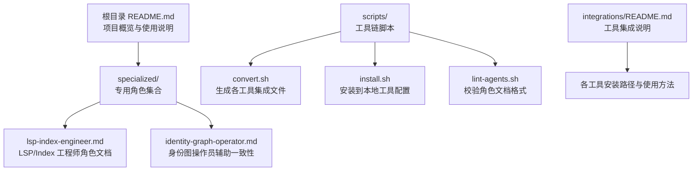
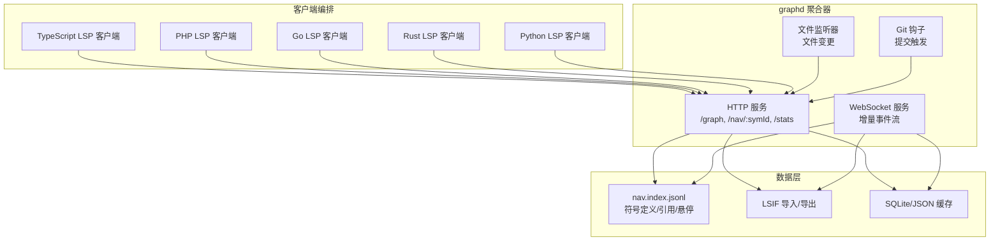
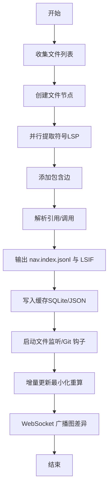
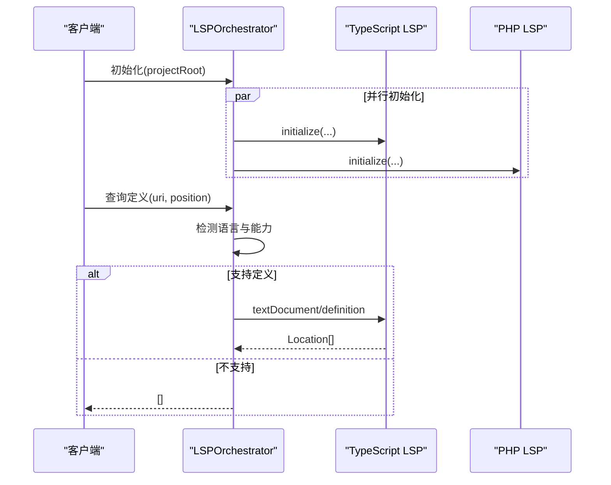
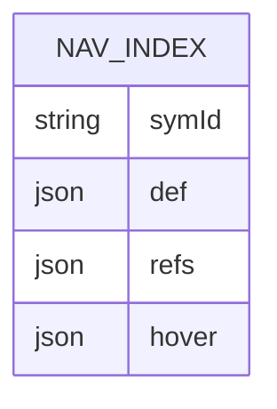
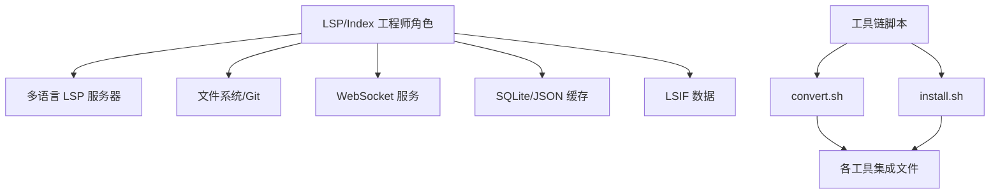

# 语言服务器协议工程师

<cite>
**本文引用的文件**
- [README.md](file://README.md)
- [lsp-index-engineer.md](file://specialized/lsp-index-engineer.md)
- [identity-graph-operator.md](file://specialized/identity-graph-operator.md)
- [convert.sh](file://scripts/convert.sh)
- [install.sh](file://scripts/install.sh)
- [lint-agents.sh](file://scripts/lint-agents.sh)
- [integrations/README.md](file://integrations/README.md)
</cite>

## 目录
1. [简介](#简介)
2. [项目结构](#项目结构)
3. [核心组件](#核心组件)
4. [架构总览](#架构总览)
5. [详细组件分析](#详细组件分析)
6. [依赖分析](#依赖分析)
7. [性能考量](#性能考量)
8. [故障排除指南](#故障排除指南)
9. [结论](#结论)
10. [附录](#附录)

## 简介
本文件面向“语言服务器协议工程师（LSP/Index Engineer）”角色，系统化阐述在该仓库中的职责边界、技术交付物与工作流程。该角色专注于：
- 多语言服务器（TypeScript、PHP、Go、Rust、Python 等）的 LSP 客户端编排与能力协商
- 统一语义图（graphd）的构建与维护，节点覆盖文件与符号，边覆盖包含、导入、调用、引用等关系
- 实时增量更新：基于文件监听与 Git 钩子的变更传播
- 导航索引（nav.index.jsonl）与 LSIF 的导入导出
- WebSocket 事件流与原子化更新保障
- 性能与可扩展性：目标在 100k+ 符号下保持 60fps，关键查询在亚 100ms 内返回

同时，本文件也结合仓库中现有的工具链脚本与集成说明，给出可落地的安装与转换流程，帮助工程师快速将该角色的能力部署到多种开发工具生态中。

## 项目结构
该仓库采用“按职能分组”的目录组织方式，其中与 LSP/Index 工程师直接相关的内容集中在 specialized 分区，并通过 scripts 提供跨工具的转换与安装能力；integrations 文档说明了各工具的集成方式。

图表来源
- [README.md](file://README.md)
- [lsp-index-engineer.md](file://specialized/lsp-index-engineer.md)
- [identity-graph-operator.md](file://specialized/identity-graph-operator.md)
- [convert.sh](file://scripts/convert.sh)
- [install.sh](file://scripts/install.sh)
- [lint-agents.sh](file://scripts/lint-agents.sh)
- [integrations/README.md](file://integrations/README.md)

章节来源
- [README.md](file://README.md)
- [integrations/README.md](file://integrations/README.md)

## 核心组件
- graphd LSP 聚合器
  - 统一管理多语言 LSP 客户端，负责初始化、能力协商与生命周期管理
  - 将 LSP 响应映射为统一图结构（节点：文件/模块/类/函数/变量/类型；边：包含/导入/继承/实现/调用/引用）
  - 提供 HTTP 接口（/graph、/nav/:symId、/stats）与 WebSocket 事件流，支持增量更新
- 导航索引（nav.index.jsonl）
  - 记录符号定义、引用列表与悬停文档，便于快速检索与展示
- 语义索引基础设施
  - 支持 LSIF 导入/导出，SQLite/JSON 缓存层以提升启动速度与持久化
- 增量更新与一致性
  - 文件监听与 Git 钩子驱动的实时更新
  - 图一致性约束：每个符号仅有一个定义节点；所有边引用有效节点；文件节点先于其包含的符号节点存在；导入/引用边指向合法节点

章节来源
- [lsp-index-engineer.md](file://specialized/lsp-index-engineer.md)

## 架构总览
下图展示了 LSP/Index 工程师视角下的系统架构：多语言 LSP 客户端编排、语义图构建、导航索引与增量更新、HTTP/WebSocket 接口，以及与外部工具的集成。

图表来源
- [lsp-index-engineer.md](file://specialized/lsp-index-engineer.md)

## 详细组件分析

### 组件A：graphd 聚合器与图构建管线
- 统一图模型
  - 节点：文件、模块、类、函数、变量、类型；携带文件路径、范围、详情等元信息
  - 边：包含、导入、继承、实现、调用、引用；权重可选用于重要性排序
- 构建流程
  - 阶段一：扫描项目文件，创建文件节点
  - 阶段二：并行提取符号并通过 LSP 获取符号节点与包含关系
  - 阶段三：解析引用与调用，建立引用/调用边
  - 阶段四：输出 nav.index.jsonl 与 LSIF，写入缓存
- 增量更新
  - 文件监听器与 Git 钩子触发局部重建，最小化重算范围
  - WebSocket 广播图差异，确保客户端实时同步

图表来源
- [lsp-index-engineer.md](file://specialized/lsp-index-engineer.md)

章节来源
- [lsp-index-engineer.md](file://specialized/lsp-index-engineer.md)

### 组件B：LSP 客户端编排与协议合规
- 多语言客户端并行初始化，严格遵循 LSP 3.17 生命周期：initialize → initialized → shutdown → exit
- 能力协商：不假设能力，始终检查服务器 capabilities
- 请求路由：根据 URI 扩展名选择对应语言服务器；对不支持的请求返回空结果或错误
- 关键性能点：批量请求减少往返开销，缓存命中优先

图表来源
- [lsp-index-engineer.md](file://specialized/lsp-index-engineer.md)

章节来源
- [lsp-index-engineer.md](file://specialized/lsp-index-engineer.md)

### 组件C：导航索引与 LSIF 集成
- nav.index.jsonl 结构要点
  - 每个符号一条记录，包含定义位置、引用列表、悬停文档
  - 引用列表为数组，每项含 URI 与行列坐标
- LSIF 导入/导出
  - 支持离线预计算的语义数据导入
  - 导出用于备份与迁移
- 缓存层
  - SQLite/JSON 缓存加速启动与查询

图表来源
- [lsp-index-engineer.md](file://specialized/lsp-index-engineer.md)

章节来源
- [lsp-index-engineer.md](file://specialized/lsp-index-engineer.md)

### 组件D：工具链与多工具集成
- convert.sh
  - 将 Markdown 角色文件转换为各工具所需的格式（如 Antigravity 技能、Gemini CLI 扩展、Cursor 规则、OpenClaw 工作区、Qwen 子代理、Kimi CLI 规范等）
  - 支持并行转换，提高大规模角色转换效率
- install.sh
  - 自动检测已安装工具，交互式或非交互式安装角色文件至对应配置目录
  - 支持并行安装，避免重复输出
- lint-agents.sh
  - 校验角色文档的 YAML frontmatter 与推荐结构，保证质量

图表来源
- [convert.sh](file://scripts/convert.sh)
- [install.sh](file://scripts/install.sh)
- [lint-agents.sh](file://scripts/lint-agents.sh)
- [integrations/README.md](file://integrations/README.md)

章节来源
- [convert.sh](file://scripts/convert.sh)
- [install.sh](file://scripts/install.sh)
- [lint-agents.sh](file://scripts/lint-agents.sh)
- [integrations/README.md](file://integrations/README.md)

## 依赖分析
- 角色内聚性
  - LSP/Index 工程师角色文档高度聚焦于 LSP 协议、图构建与增量更新，职责清晰
- 外部依赖
  - 多语言 LSP 服务器（TypeScript、PHP、Go、Rust、Python）
  - 文件系统与 Git 工具（文件监听、钩子）
  - WebSocket 服务（事件流）
  - SQLite/JSON（缓存）
  - LSIF（离线语义数据）
- 工具链耦合
  - convert.sh 与 install.sh 形成“转换—安装”的闭环，确保角色在不同工具间的一致可用

图表来源
- [lsp-index-engineer.md](file://specialized/lsp-index-engineer.md)
- [convert.sh](file://scripts/convert.sh)
- [install.sh](file://scripts/install.sh)

章节来源
- [lsp-index-engineer.md](file://specialized/lsp-index-engineer.md)
- [convert.sh](file://scripts/convert.sh)
- [install.sh](file://scripts/install.sh)

## 性能考量
- 响应时间目标
  - /graph：10k 节点以下 <100ms
  - /nav/:symId：缓存命中 <20ms，未命中 <60ms
  - WebSocket 事件延迟 <50ms
  - 典型项目内存占用 <500MB
- 可扩展性目标
  - 支持 25k+ 符号无退化，目标 100k+ 符号 60fps
- 优化策略
  - 并行化：并行初始化与查询 LSP 客户端
  - 批量化：批量发送 LSP 请求，降低往返开销
  - 懒加载与渐进式加载：仅在需要时加载符号细节
  - 精准缓存与失效：高命中率，精确失效策略
  - 增量图更新：最小化重算范围
  - 并发安全：锁自由数据结构、原子更新

章节来源
- [lsp-index-engineer.md](file://specialized/lsp-index-engineer.md)

## 故障排除指南
- LSP 协议相关
  - 现象：某些请求无响应或返回空
  - 排查：确认服务器 capabilities 中是否声明对应能力；检查 initialize/initialized 生命周期是否完整
  - 参考：严格遵循 LSP 3.17 规范，不假设能力
- 图一致性问题
  - 现象：符号定义缺失、边指向无效节点、文件与符号顺序异常
  - 排查：核对节点创建顺序（文件节点先于符号节点）、边的目标节点必须存在、导入/引用边需指向合法节点
- 性能退化
  - 现象：构建时间增长、查询延迟上升、内存占用升高
  - 排查：检查是否启用并行与批量化；确认缓存命中率；评估增量更新范围是否过大
- 工具链问题
  - 现象：角色未出现在目标工具中
  - 排查：运行 convert.sh 生成集成文件后，再执行 install.sh；必要时使用 --tool 指定工具；检查工具是否被自动检测到

章节来源
- [lsp-index-engineer.md](file://specialized/lsp-index-engineer.md)
- [convert.sh](file://scripts/convert.sh)
- [install.sh](file://scripts/install.sh)

## 结论
LSP/Index 工程师角色在该仓库中提供了从多语言 LSP 客户端编排、统一语义图构建、导航索引与 LSIF 集成，到实时增量更新与高性能查询的完整能力谱系。配合 convert.sh/install.sh 等工具链，可将该角色无缝集成到多种开发工具生态中，支撑大规模代码库的统一语义理解与可视化。

## 附录
- 快速开始（LSP 服务器安装与验证）
  - 安装命令与验证步骤见角色文档中的“设置 LSP 基础设施”步骤
- 工具链使用
  - 生成集成文件：./scripts/convert.sh
  - 安装到本地工具：./scripts/install.sh
  - 校验角色文档：./scripts/lint-agents.sh

章节来源
- [lsp-index-engineer.md](file://specialized/lsp-index-engineer.md)
- [convert.sh](file://scripts/convert.sh)
- [install.sh](file://scripts/install.sh)
- [lint-agents.sh](file://scripts/lint-agents.sh)
- [integrations/README.md](file://integrations/README.md)