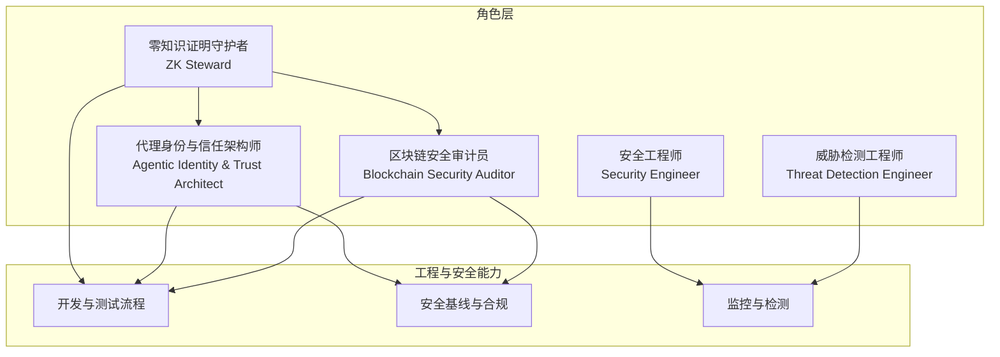
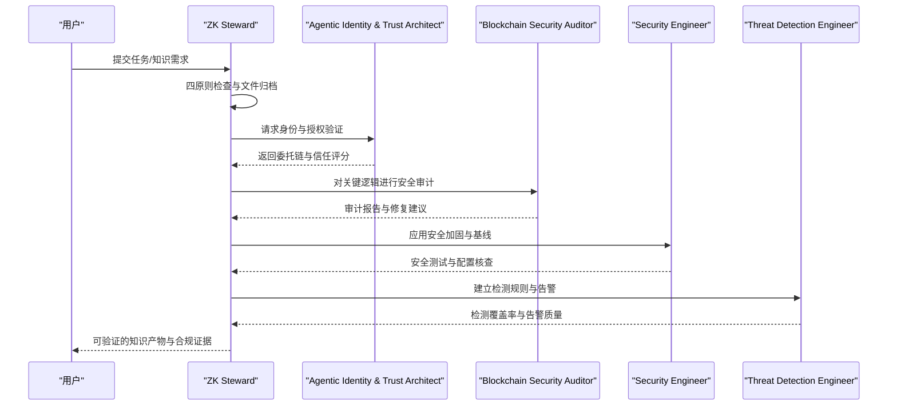
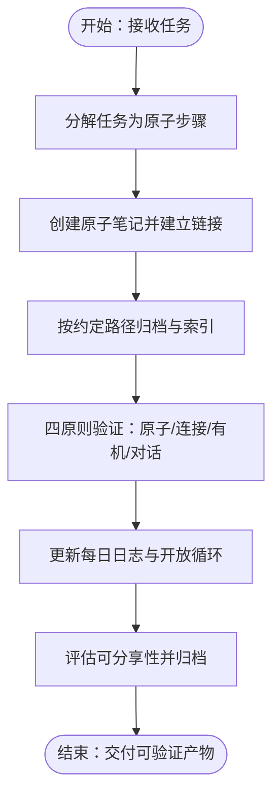
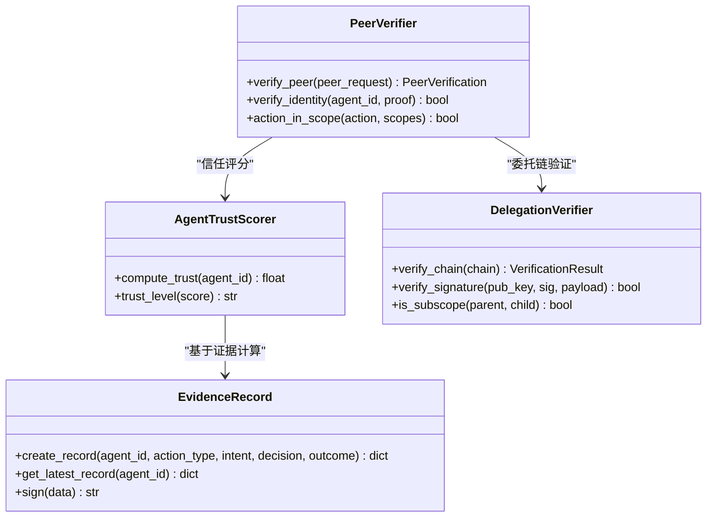
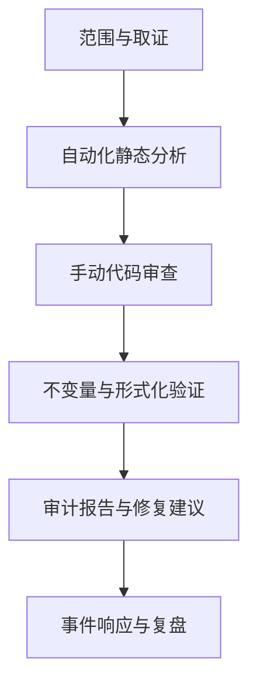
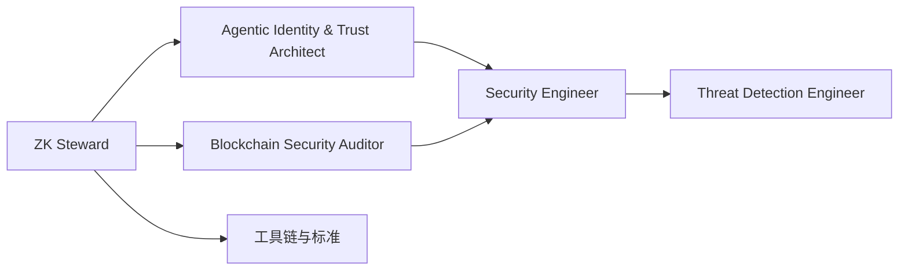

# 零知识证明守护者

<cite>
**本文档引用的文件**
- [zk-steward.md](file://specialized/zk-steward.md)
- [agentic-identity-trust.md](file://specialized/agentic-identity-trust.md)
- [blockchain-security-auditor.md](file://specialized/blockchain-security-auditor.md)
- [engineering-security-engineer.md](file://engineering/engineering-security-engineer.md)
- [engineering-threat-detection-engineer.md](file://engineering/engineering-threat-detection-engineer.md)
- [README.md](file://README.md)
</cite>

## 目录
1. [引言](#引言)
2. [项目结构](#项目结构)
3. [核心组件](#核心组件)
4. [架构总览](#架构总览)
5. [详细组件分析](#详细组件分析)
6. [依赖关系分析](#依赖关系分析)
7. [性能考虑](#性能考虑)
8. [故障排除指南](#故障排除指南)
9. [结论](#结论)
10. [附录](#附录)

## 引言
本文件面向“零知识证明守护者”角色，系统化梳理该角色在多智能体与区块链场景下的职责边界、工作流与技术交付物。尽管仓库中未直接包含零知识证明协议（如 zk-SNARK、zk-STARK）的具体实现代码，但通过组合“知识管理守护者”（ZK Steward）、“代理身份与信任架构师”（Agentic Identity & Trust Architect）、“区块链安全审计员”（Blockchain Security Auditor）以及应用安全、威胁检测等能力，可形成一套覆盖“知识网络构建—身份信任—安全审计—合规证据”的闭环体系。

本角色的核心价值在于：以零知识证明为“信任锚点”，在多智能体协作与链上交互中，确保“可验证性、隐私性、可追溯性”三者的平衡与落地。

## 项目结构
- 角色定位分布于“specialized”目录，强调专业化与可复用性
- 工程与安全相关能力位于“engineering”目录，支撑从开发到运维的安全基线
- 顶层README提供角色清单与使用方式，便于快速集成

图示来源
- [README.md:255-282](file://README.md#L255-L282)
- [agentic-identity-trust.md:19-44](file://specialized/agentic-identity-trust.md#L19-L44)
- [blockchain-security-auditor.md:9-40](file://specialized/blockchain-security-auditor.md#L9-L40)
- [engineering-security-engineer.md:9-50](file://engineering/engineering-security-engineer.md#L9-L50)
- [engineering-threat-detection-engineer.md:9-45](file://engineering/engineering-threat-detection-engineer.md#L9-L45)

章节来源
- [README.md:255-282](file://README.md#L255-L282)

## 核心组件
- 知识网络构建与验证（ZK Steward）
  - 原子笔记、连接性、有机增长、持续对话四原则
  - 结构化输出模板、每日日志、开放循环管理
- 多智能体身份与信任（Agentic Identity & Trust Architect）
  - 身份证明、委托链验证、信任评分、证据链
- 区块链安全审计（Blockchain Security Auditor）
  - 漏洞检测、形式化验证、报告模板、应急响应
- 应用安全与威胁检测（Security Engineer、Threat Detection Engineer）
  - 安全开发生命周期、威胁建模、检测规则与告警优化

章节来源
- [zk-steward.md:11-67](file://specialized/zk-steward.md#L11-L67)
- [agentic-identity-trust.md:19-63](file://specialized/agentic-identity-trust.md#L19-L63)
- [blockchain-security-auditor.md:9-40](file://specialized/blockchain-security-auditor.md#L9-L40)
- [engineering-security-engineer.md:9-50](file://engineering/engineering-security-engineer.md#L9-L50)
- [engineering-threat-detection-engineer.md:9-45](file://engineering/engineering-threat-detection-engineer.md#L9-L45)

## 架构总览
零知识证明守护者的工作流围绕“知识—身份—安全—合规”四条主线展开：

图示来源
- [zk-steward.md:125-147](file://specialized/zk-steward.md#L125-L147)
- [agentic-identity-trust.md:263-306](file://specialized/agentic-identity-trust.md#L263-L306)
- [blockchain-security-auditor.md:366-401](file://specialized/blockchain-security-auditor.md#L366-L401)
- [engineering-security-engineer.md:221-250](file://engineering/engineering-security-engineer.md#L221-L250)
- [engineering-threat-detection-engineer.md:444-476](file://engineering/engineering-threat-detection-engineer.md#L444-L476)

## 详细组件分析

### 组件A：知识网络构建与验证（ZK Steward）
- 职责边界
  - 将复杂任务拆解为“原子知识”，并通过链接与索引形成网络
  - 以四原则作为验证门禁：原子性、连接性、有机增长、持续对话
- 关键交付
  - 结构化笔记模板、每日日志、开放循环管理、可分享产出
- 工作流要点
  - 先分解再执行，分步验证；文件命名与路径遵循约定；至少两条有效链接与一个索引入口

图示来源
- [zk-steward.md:125-167](file://specialized/zk-steward.md#L125-L167)
- [zk-steward.md:68-85](file://specialized/zk-steward.md#L68-L85)

章节来源
- [zk-steward.md:11-67](file://specialized/zk-steward.md#L11-L67)
- [zk-steward.md:125-167](file://specialized/zk-steward.md#L125-L167)

### 组件B：多智能体身份与信任（Agentic Identity & Trust Architect）
- 职责边界
  - 设计可编程的身份认证与授权验证，支持跨框架互操作
  - 实现委托链验证、信任评分与证据链，确保“不可否认、可追溯”
- 关键交付
  - 身份证明结构、委托链验证器、信任评分模型、证据记录结构
- 工作流要点
  - 零信任默认策略：拒绝一切，验证一切；失败即闭；算法迁移抽象

图示来源
- [agentic-identity-trust.md:88-125](file://specialized/agentic-identity-trust.md#L88-L125)
- [agentic-identity-trust.md:127-163](file://specialized/agentic-identity-trust.md#L127-L163)
- [agentic-identity-trust.md:165-204](file://specialized/agentic-identity-trust.md#L165-L204)
- [agentic-identity-trust.md:206-261](file://specialized/agentic-identity-trust.md#L206-L261)

章节来源
- [agentic-identity-trust.md:19-63](file://specialized/agentic-identity-trust.md#L19-L63)
- [agentic-identity-trust.md:263-318](file://specialized/agentic-identity-trust.md#L263-L318)

### 组件C：区块链安全审计（Blockchain Security Auditor）
- 职责边界
  - 面向智能合约与DeFi协议的漏洞检测、形式化验证与审计报告
  - 覆盖重入、访问控制、预言机操纵、升级攻击等高风险面
- 关键交付
  - 漏洞分析样例、Slither/Mythril/Echidna集成脚本、审计报告模板、应急响应流程
- 工作流要点
  - 自动化静态分析先行，辅以手动审查与形式化验证；严格严重性分级与可复现实证

图示来源
- [blockchain-security-auditor.md:366-401](file://specialized/blockchain-security-auditor.md#L366-L401)
- [blockchain-security-auditor.md:201-250](file://specialized/blockchain-security-auditor.md#L201-L250)
- [blockchain-security-auditor.md:252-320](file://specialized/blockchain-security-auditor.md#L252-L320)

章节来源
- [blockchain-security-auditor.md:9-40](file://specialized/blockchain-security-auditor.md#L9-L40)
- [blockchain-security-auditor.md:366-401](file://specialized/blockchain-security-auditor.md#L366-L401)

### 组件D：应用安全与威胁检测（Security Engineer、Threat Detection Engineer）
- 职责边界
  - 安全开发生命周期集成、威胁建模、漏洞评估与安全架构设计
  - 威胁狩猎、检测规则开发、MITRE ATT&CK映射与检测管线治理
- 关键交付
  - 威胁模型文档、安全代码审查模式、CI/CD安全流水线、Sigma检测规则与编译
- 工作流要点
  - 行为检测优先、检测即代码、持续验证与迭代；以风险驱动优先级

章节来源
- [engineering-security-engineer.md:221-250](file://engineering/engineering-security-engineer.md#L221-L250)
- [engineering-threat-detection-engineer.md:444-476](file://engineering/engineering-threat-detection-engineer.md#L444-L476)

## 依赖关系分析
- 角色间耦合
  - ZK Steward依赖A2A（代理身份与信任）与BSA（区块链安全），以确保“知识产物”的可信与安全
  - AIT与BSA共享“零信任”与“失败即闭”的安全哲学，降低跨域信任摩擦
- 外部依赖
  - 工具链：Slither、Mythril、Echidna、Sigma、Sentinel/KQL等
  - 合规与标准：MITRE ATT&CK、SOC 2/ISO 27001等

图示来源
- [README.md:255-282](file://README.md#L255-L282)
- [agentic-identity-trust.md:341-366](file://specialized/agentic-identity-trust.md#L341-L366)
- [blockchain-security-auditor.md:433-460](file://specialized/blockchain-security-auditor.md#L433-L460)
- [engineering-security-engineer.md:272-305](file://engineering/engineering-security-engineer.md#L272-L305)
- [engineering-threat-detection-engineer.md:506-535](file://engineering/engineering-threat-detection-engineer.md#L506-L535)

章节来源
- [README.md:255-282](file://README.md#L255-L282)

## 性能考虑
- 验证与审计成本控制
  - 在ZK Steward层面，优先采用“先验证后执行”的检查清单，减少返工
  - 在BSA层面，结合自动化工具与形式化验证，缩短高风险路径的验证周期
- 信任评分与证据链的可扩展性
  - 通过接口抽象与算法迁移准备，降低密钥算法升级带来的系统停机成本
- 检测规则的信号质量
  - 以MITRE ATT&CK为依据，构建行为检测规则，避免IOC过期导致的误报与漏报

## 故障排除指南
- 常见问题与处置
  - 身份验证失败：检查签名有效性、委托链完整性与时效性
  - 信任分数不足：核查证据链完整性、历史结果达成率与凭证新鲜度
  - 审计发现未复现：确认部署字节码一致性、调用链完整性与PoC环境一致性
  - 检测规则失效：核对日志源完整性、规则元数据与验证测试
- 回应与改进
  - 采用“失败即闭”策略，阻断可疑动作并触发告警
  - 建立定期复盘机制，将狩猎成果转化为自动化规则与修复建议

章节来源
- [agentic-identity-trust.md:45-63](file://specialized/agentic-identity-trust.md#L45-L63)
- [blockchain-security-auditor.md:41-62](file://specialized/blockchain-security-auditor.md#L41-L62)
- [engineering-threat-detection-engineer.md:470-477](file://engineering/engineering-threat-detection-engineer.md#L470-L477)

## 结论
零知识证明守护者通过“知识—身份—安全—合规”的协同，为多智能体与链上交互提供可验证、可追溯、可审计的信任基础设施。ZK Steward负责知识网络的构建与验证，Agentic Identity & Trust Architect提供跨域身份与授权保障，Blockchain Security Auditor确保关键逻辑的安全性，而应用安全与威胁检测则补齐开发与运行期的纵深防御。四者配合，既满足“隐私保护”又不牺牲“可验证性”，为零知识证明在实际系统中的规模化落地提供方法论与工具链支撑。

## 附录
- 角色清单与使用参考
  - 角色列表与安装说明参见顶层README
- 相关能力参考
  - 零知识证明协议（zk-SNARK、zk-STARK）在本仓库未直接实现，但可通过ZK Steward的“可验证知识产物”与Agentic Identity & Trust Architect的“证据链”形成端到端的可验证性与隐私保护闭环

章节来源
- [README.md:255-282](file://README.md#L255-L282)