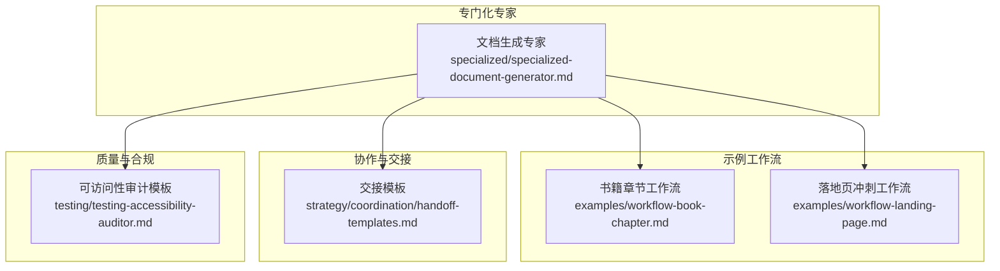
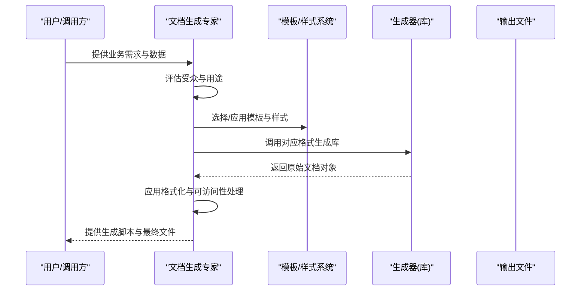
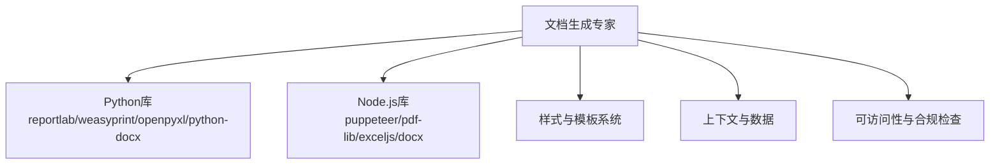

# 文档生成专家代理

<cite>
**本文引用的文件**
- [specialized-document-generator.md](file://specialized/specialized-document-generator.md)
- [README.md](file://README.md)
- [workflow-book-chapter.md](file://examples/workflow-book-chapter.md)
- [workflow-landing-page.md](file://examples/workflow-landing-page.md)
- [handoff-templates.md](file://strategy/coordination/handoff-templates.md)
- [testing-accessibility-auditor.md](file://testing/testing-accessibility-auditor.md)
</cite>

## 目录
1. [简介](#简介)
2. [项目结构](#项目结构)
3. [核心组件](#核心组件)
4. [架构总览](#架构总览)
5. [详细组件分析](#详细组件分析)
6. [依赖关系分析](#依赖关系分析)
7. [性能考虑](#性能考虑)
8. [故障排除指南](#故障排除指南)
9. [结论](#结论)
10. [附录](#附录)

## 简介
本文件系统性阐述“专门化文档生成专家”（Specialized Document Generator）的自动化文档创建能力与工作方式，覆盖文档模板设计、内容生成策略、格式标准化、可访问性保障以及多格式输出等关键维度。该专家代理专注于以编程方式生成专业级文档，包括 PDF、PPTX、DOCX 和 XLSX，并在生成过程中强调样式体系、品牌一致性、数据驱动、可访问性与可复用模板等原则。文档同时结合仓库中的工作流示例与协作模板，帮助读者理解如何在不同业务场景下（如报告、提案、合同、说明书等）实现高质量、可重复、可定制的文档自动化流水线。

## 项目结构
该仓库采用按职能划分的目录结构，文档生成专家位于 specialized 分类下，作为专门化 Agent 的一部分；同时，examples 中的工作流示例展示了如何将文档生成与其他 Agent 协作，形成端到端的交付流程；strategy/coordination 提供了跨 Agent 的交接模板，确保上下文传递与质量标准一致。

图表来源
- [specialized-document-generator.md:1-56](file://specialized/specialized-document-generator.md#L1-L56)
- [workflow-book-chapter.md:1-56](file://examples/workflow-book-chapter.md#L1-L56)
- [workflow-landing-page.md:1-120](file://examples/workflow-landing-page.md#L1-L120)
- [handoff-templates.md:1-48](file://strategy/coordination/handoff-templates.md#L1-L48)
- [testing-accessibility-auditor.md:69-138](file://testing/testing-accessibility-auditor.md#L69-L138)

章节来源
- [README.md:1-200](file://README.md#L1-L200)
- [specialized-document-generator.md:1-56](file://specialized/specialized-document-generator.md#L1-L56)

## 核心组件
- 文档生成专家身份与使命：明确角色定位为“程序化文档创建专家”，具备对多种格式（PDF、PPTX、DOCX、XLSX）的生成能力与工具链知识，强调风格体系、品牌一致性、数据驱动、可访问性与可复用模板。
- 工具与方法论：
  - PDF：支持 HTML+CSS→PDF（复杂布局）与直接生成（数据报表）两种路径。
  - PPTX：基于模板的结构化幻灯片生成，强调品牌一致性与数据驱动。
  - XLSX：结构化数据、格式化、公式、图表与可透视布局。
  - DOCX：基于模板的样式、页眉、目录与一致格式。
- 关键规则：使用样式而非硬编码字体/字号；保持品牌一致性；数据驱动输入输出；可访问性优先；构建可复用模板函数。
- 沟通风格：在生成前询问目标受众与目的；提供生成脚本与输出文件；解释格式选择与定制建议；针对用例推荐最佳格式。

章节来源
- [specialized-document-generator.md:9-56](file://specialized/specialized-document-generator.md#L9-L56)

## 架构总览
文档生成专家的自动化架构围绕“输入数据→模板引擎/工具链→格式化→输出文件”的主线展开，同时通过工作流与交接模板确保跨 Agent 的上下文完整与质量可控。

图表来源
- [specialized-document-generator.md:43-56](file://specialized/specialized-document-generator.md#L43-L56)
- [specialized-document-generator.md:21-42](file://specialized/specialized-document-generator.md#L21-L42)

## 详细组件分析

### 组件一：模板设计与风格体系
- 模板设计原则
  - 使用样式与主题，避免硬编码字体/字号，确保跨格式一致性。
  - 品牌一致性：颜色、字体与 Logo 符合品牌规范。
  - 可复用模板函数：构建可复用的模板函数，而非一次性脚本。
- 风格体系要点
  - 标题层级、段落样式、列表样式、表格样式、图表样式等统一管理。
  - 颜色体系与对比度满足可访问性要求。
- 实施建议
  - 为每种格式建立基础样式表或主题文件，集中维护。
  - 在模板中预留占位符，便于后续数据注入与二次编辑。

章节来源
- [specialized-document-generator.md:45-49](file://specialized/specialized-document-generator.md#L45-L49)

### 组件二：内容生成策略
- 数据驱动
  - 输入为结构化数据，输出为对应格式的文档，减少手工拼接。
  - 对于复杂布局（如 PDF），优先采用 HTML+CSS 渲染后导出。
  - 对于数据密集型文档（如报表），采用直接生成方式提升效率。
- 内容组织
  - 报告类：摘要、背景、方法、结果、结论、附录。
  - 提案类：目标、范围、方案、时间线、预算、验收标准。
  - 合同类：条款、条件、附件、签署页、合规性声明。
  - 说明书类：功能清单、安装步骤、操作指南、故障排查。
- 生成脚本与输出
  - 生成脚本与最终文件一并提供，便于复现与调试。
  - 针对用例推荐最佳格式，例如数据报表倾向 PDF 或 XLSX，演示文稿倾向 PPTX。

章节来源
- [specialized-document-generator.md:47](file://specialized/specialized-document-generator.md#L47)
- [specialized-document-generator.md:52-55](file://specialized/specialized-document-generator.md#L52-L55)

### 组件三：格式标准化与可访问性
- 格式标准化
  - 统一标题层级、段落间距、对齐方式、边距与分栏。
  - 表格与图表遵循统一的样式与标注规范。
- 可访问性
  - 添加替代文本、正确的标题层级、PDF 标签结构（若可用）。
  - 遵循 WCAG 2.2 AA 标准，确保屏幕阅读器与键盘导航可用。
- 合规与审计
  - 合同类文档可参考可访问性审计模板中的问题分类与修复建议，确保法律与合规层面的可审查性。

章节来源
- [specialized-document-generator.md:48](file://specialized/specialized-document-generator.md#L48)
- [testing-accessibility-auditor.md:28-47](file://testing/testing-accessibility-auditor.md#L28-L47)
- [testing-accessibility-auditor.md:69-138](file://testing/testing-accessibility-auditor.md#L69-L138)

### 组件四：多格式输出与工具链
- PDF：支持 HTML+CSS 渲染后导出（适合复杂布局）与直接生成（适合数据报表）。
- PPTX：基于模板的结构化幻灯片，强调品牌一致性与数据驱动。
- XLSX：结构化数据、格式化、公式、图表与可透视布局。
- DOCX：基于模板的样式、页眉、目录与一致格式。
- 工具链选择
  - Python：reportlab、weasyprint、fpdf2（PDF）；python-pptx、openpyxl、xlsxwriter、python-docx（PPTX、XLSX、DOCX）。
  - Node.js：puppeteer（HTML→PDF）、pdf-lib、pdfkit（PDF）；pptxgenjs（PPTX）；exceljs、xlsx（XLSX）；docx（DOCX）。

章节来源
- [specialized-document-generator.md:23-42](file://specialized/specialized-document-generator.md#L23-L42)

### 组件五：工作流与协作集成
- 书籍章节工作流
  - 将文档生成专家与“书籍联合作者”等 Agent 协作，形成从素材到初稿再到修订反馈的闭环。
  - 输出包含目标、草稿、编辑注释、反馈循环与下一步行动，确保可追踪与可迭代。
- 落地页冲刺工作流
  - 多 Agent 并行产出（文案、UI 设计、前端开发、增长优化），文档生成专家可参与生成营销材料、技术说明或产品文档。
- 交接模板
  - 标准化的 Agent 间交接模板，确保上下文不丢失，质量标准一致，证据与验收标准明确。

章节来源
- [workflow-book-chapter.md:1-56](file://examples/workflow-book-chapter.md#L1-L56)
- [workflow-landing-page.md:1-120](file://examples/workflow-landing-page.md#L1-L120)
- [handoff-templates.md:1-48](file://strategy/coordination/handoff-templates.md#L1-L48)

## 依赖关系分析
文档生成专家在实际应用中依赖以下外部因素与内部模块：
- 外部工具与库：各语言生态下的文档生成库（见上节“多格式输出与工具链”）。
- 内部模板与样式：集中管理的样式表与模板函数，确保跨 Agent 一致性。
- 上下文与数据：来自其他 Agent 的中间产物（如文案、设计规范、数据集）。
- 质量与合规：可访问性与合规性检查模板，用于生成可审查、可审计的文档。

图表来源
- [specialized-document-generator.md:23-42](file://specialized/specialized-document-generator.md#L23-L42)
- [testing-accessibility-auditor.md:28-47](file://testing/testing-accessibility-auditor.md#L28-L47)

## 性能考虑
- 生成路径选择
  - 复杂布局优先使用 HTML+CSS 渲染后导出，以获得更稳定的跨平台表现。
  - 数据密集型报表优先采用直接生成，减少中间转换开销。
- 模板复用
  - 构建可复用模板函数，避免重复计算与重复渲染，提高批量生成效率。
- 批处理与并发
  - 对多个文档进行批处理时，合理安排并发度，避免内存与 CPU 过载。
- 缓存与增量更新
  - 对静态元素（如 Logo、页眉页脚）进行缓存，仅更新动态数据部分。
- 文件大小与加载速度
  - 控制图表与图片尺寸，压缩资源，确保输出文件体积适中且加载快速。

## 故障排除指南
- 样式不一致
  - 检查是否使用了集中样式表或主题，避免硬编码字体/字号。
  - 确认品牌颜色与对比度符合可访问性要求。
- 图表与表格显示异常
  - 确认数据结构与列定义一致，检查公式与格式设置。
  - 对于 PDF，确认 HTML+CSS 渲染环境与浏览器兼容性。
- 可访问性问题
  - 为图片添加替代文本，确保标题层级正确，必要时为 PDF 添加标签结构。
  - 参考可访问性审计模板中的问题分类与修复建议，逐项排查。
- 交接与协作问题
  - 使用标准化交接模板，明确交付物、验收标准与证据要求，避免上下文丢失。
- 输出格式错误
  - 明确目标受众与用途，针对用例推荐最佳格式（如数据报表倾向 PDF 或 XLSX）。

章节来源
- [specialized-document-generator.md:45-49](file://specialized/specialized-document-generator.md#L45-L49)
- [handoff-templates.md:1-48](file://strategy/coordination/handoff-templates.md#L1-L48)
- [testing-accessibility-auditor.md:69-138](file://testing/testing-accessibility-auditor.md#L69-L138)

## 结论
文档生成专家通过“数据驱动 + 模板化 + 工具链 + 可访问性 + 质量标准”的综合体系，实现了从报告、提案、合同到说明书等多种类型文档的自动化生成。其核心价值在于：以统一的风格与品牌一致性贯穿所有格式；以可复用模板降低重复劳动；以可访问性与合规性保障输出质量；并通过工作流与交接模板确保跨 Agent 的高效协作与可追溯交付。对于需要规模化、高质量、可定制文档生产的团队而言，文档生成专家是值得优先引入的关键能力。

## 附录
- 快速参考
  - PDF：HTML+CSS 渲染或直接生成
  - PPTX：模板驱动 + 品牌一致性
  - XLSX：结构化数据 + 公式 + 图表
  - DOCX：模板驱动 + 样式 + 目录
- 推荐实践
  - 在生成前明确受众与用途，选择最佳格式
  - 使用样式表与模板函数，避免硬编码
  - 提供生成脚本与最终文件，便于复现与调试
  - 引入可访问性与合规性检查，确保输出可审查