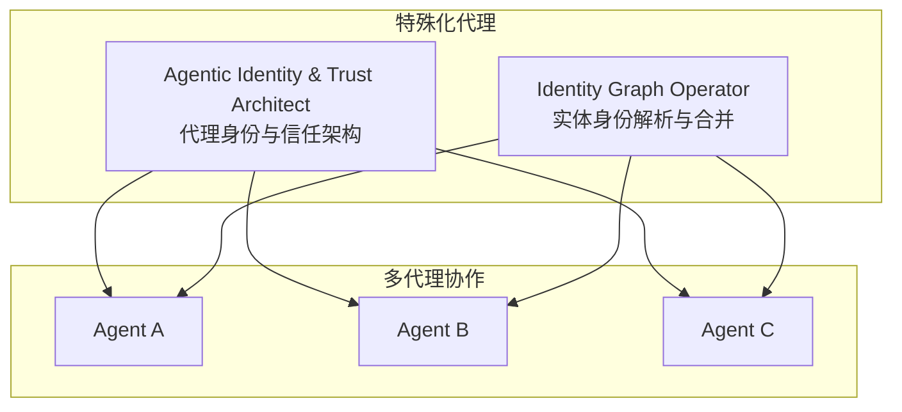
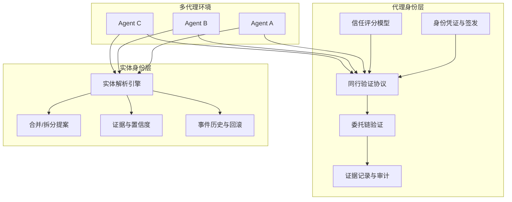
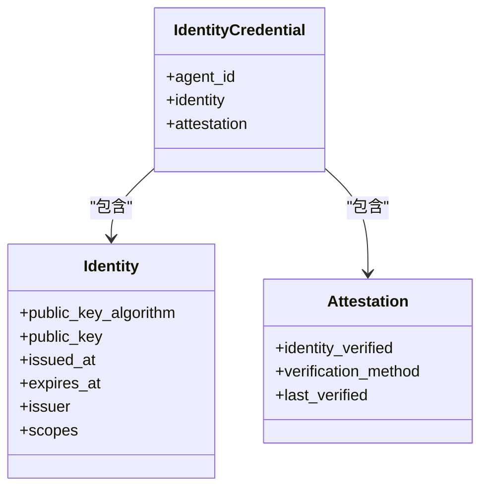
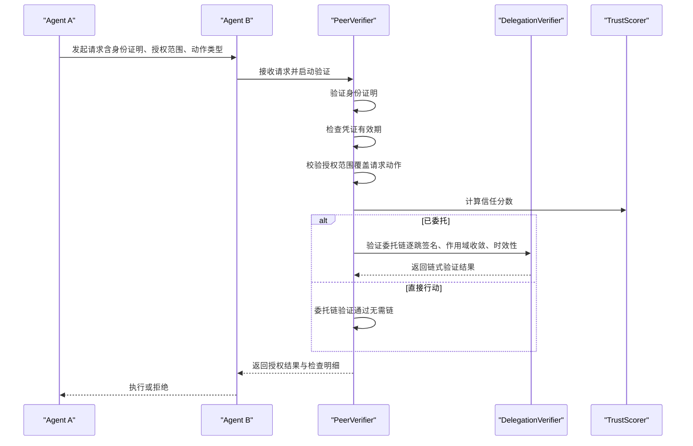
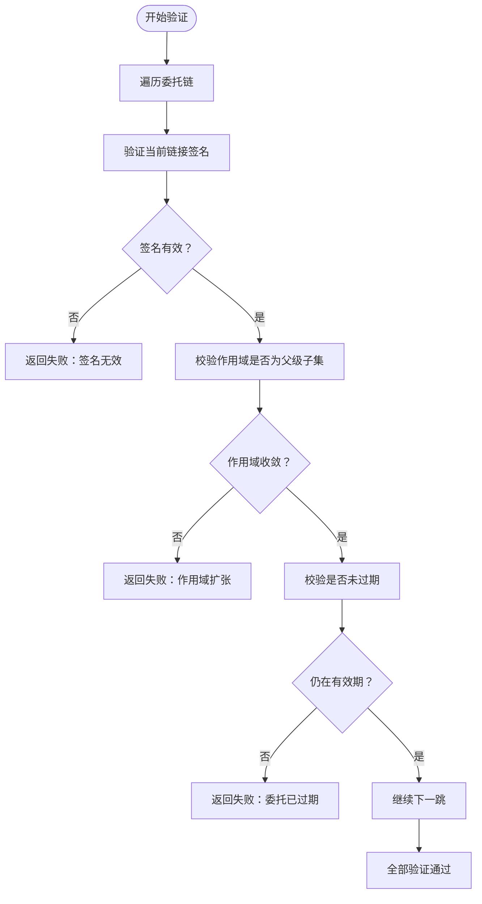
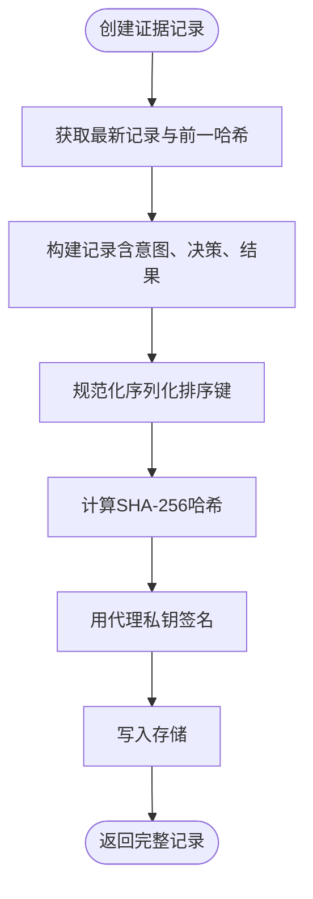
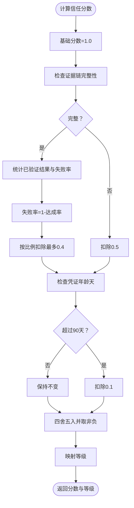
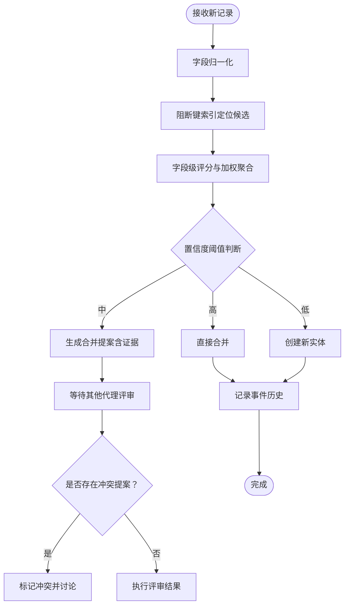
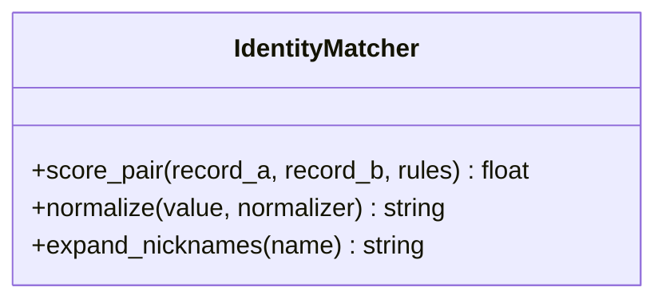
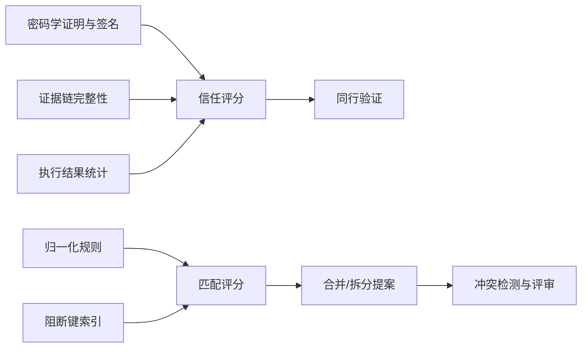

# 身份管理代理

<cite>
**本文档引用的文件**
- [README.md](file://README.md)
- [agentic-identity-trust.md](file://specialized/agentic-identity-trust.md)
- [identity-graph-operator.md](file://specialized/identity-graph-operator.md)
</cite>

## 目录
1. [简介](#简介)
2. [项目结构](#项目结构)
3. [核心组件](#核心组件)
4. [架构总览](#架构总览)
5. [详细组件分析](#详细组件分析)
6. [依赖关系分析](#依赖关系分析)
7. [性能考量](#性能考量)
8. [故障排查指南](#故障排查指南)
9. [结论](#结论)
10. [附录](#附录)

## 简介
本文件系统性阐述“身份管理代理”的设计与实现，聚焦于“身份图运营商（Identity Graph Operator）”在多智能体环境中的身份管理能力，以及“代理身份信任机制（Agentic Identity Trust）”在跨代理协作中的信任建立与验证流程。文档将深入解析以下关键主题：
- 多源身份数据的接入与统一建模
- 统一身份图谱的构建与维护
- 去中心化身份验证与委托链验证
- 证据链与审计追踪的不可篡改性保障
- 隐私保护与数据安全的最佳实践

该体系以“零信任”为原则，通过密码学证明、可审计证据链、基于可观测结果的信任评分模型，以及跨框架的身份联邦能力，确保在高风险场景下（如金融交易、基础设施部署、物理系统控制）代理行为的可追溯、可验证与可治理。

## 项目结构
本仓库采用按职能划分的组织方式，身份管理代理相关的核心文件位于 specialized 分区：
- specialized/agentic-identity-trust.md：定义代理身份与信任架构，包括身份凭证、信任评分、委托链验证、证据记录与同行验证协议。
- specialized/identity-graph-operator.md：定义实体身份解析与合并/拆分提案流程，提供确定性、可解释、可审计的身份解析能力。

**图表来源**
- [agentic-identity-trust.md:1-388](file://specialized/agentic-identity-trust.md#L1-L388)
- [identity-graph-operator.md:1-261](file://specialized/identity-graph-operator.md#L1-L261)

**章节来源**
- [README.md:25-65](file://README.md#L25-L65)
- [agentic-identity-trust.md:1-388](file://specialized/agentic-identity-trust.md#L1-L388)
- [identity-graph-operator.md:1-261](file://specialized/identity-graph-operator.md#L1-L261)

## 核心组件
- 代理身份与信任架构（Agentic Identity & Trust Architect）
  - 身份凭证与密钥管理：支持标准签名算法，分离签发、轮换、吊销与过期策略。
  - 同行验证协议：在代理间进行身份与授权验证，失败即闭合拒绝。
  - 委托链验证：多跳委托的签名校验、作用域收敛与时间有效性检查。
  - 证据记录：不可篡改的事件链，支持独立第三方验证。
  - 信任评分：基于证据链完整性、执行结果与凭证新鲜度的惩罚式评分模型。
- 实体身份解析与合并（Identity Graph Operator）
  - 确定性解析：对同一实体的多次解析返回一致的实体标识。
  - 概率匹配与证据化决策：字段级归一化、比较与加权打分，输出置信度与证据。
  - 提案驱动的合并/拆分：冲突检测、证据展示与跨代理评审。
  - 图谱完整性与回滚：事件历史与乐观锁，支持模拟变更与回滚。

**章节来源**
- [agentic-identity-trust.md:19-64](file://specialized/agentic-identity-trust.md#L19-L64)
- [agentic-identity-trust.md:66-125](file://specialized/agentic-identity-trust.md#L66-L125)
- [agentic-identity-trust.md:127-163](file://specialized/agentic-identity-trust.md#L127-L163)
- [agentic-identity-trust.md:165-204](file://specialized/agentic-identity-trust.md#L165-L204)
- [agentic-identity-trust.md:206-261](file://specialized/agentic-identity-trust.md#L206-L261)
- [identity-graph-operator.md:19-54](file://specialized/identity-graph-operator.md#L19-L54)
- [identity-graph-operator.md:55-107](file://specialized/identity-graph-operator.md#L55-L107)
- [identity-graph-operator.md:108-157](file://specialized/identity-graph-operator.md#L108-L157)

## 架构总览
身份管理代理的总体架构由“代理身份层”和“实体身份层”构成，二者互补并协同工作：
- 代理身份层：确保代理可证明其身份、授权范围与执行意图，通过密码学证明与证据链实现可审计与可验证。
- 实体身份层：确保多代理对同一现实实体（人、公司、产品等）达成一致解析，避免重复与冲突，支持跨代理协作时的上下文一致性。

**图表来源**
- [agentic-identity-trust.md:19-64](file://specialized/agentic-identity-trust.md#L19-L64)
- [agentic-identity-trust.md:66-125](file://specialized/agentic-identity-trust.md#L66-L125)
- [agentic-identity-trust.md:127-163](file://specialized/agentic-identity-trust.md#L127-L163)
- [agentic-identity-trust.md:165-204](file://specialized/agentic-identity-trust.md#L165-L204)
- [agentic-identity-trust.md:206-261](file://specialized/agentic-identity-trust.md#L206-L261)
- [identity-graph-operator.md:19-54](file://specialized/identity-graph-operator.md#L19-L54)
- [identity-graph-operator.md:55-107](file://specialized/identity-graph-operator.md#L55-L107)
- [identity-graph-operator.md:108-157](file://specialized/identity-graph-operator.md#L108-L157)

## 详细组件分析

### 代理身份与信任架构（Agentic Identity & Trust Architect）

#### 身份凭证与签发
- 设计要点
  - 使用标准化签名算法，分离签发、轮换、吊销与过期策略。
  - 凭证包含公钥算法、公钥、签发/过期时间、签发者与授权范围等字段。
  - 通过独立验证端点供其他代理调用，确保无须人工介入的程序化认证。

**图表来源**
- [agentic-identity-trust.md:67-86](file://specialized/agentic-identity-trust.md#L67-L86)

**章节来源**
- [agentic-identity-trust.md:67-86](file://specialized/agentic-identity-trust.md#L67-L86)

#### 同行验证协议（Peer Verification）
- 设计要点
  - 在接受其他代理的工作前，必须验证其身份、凭证有效期、授权范围、信任阈值与委托链。
  - 所有检查项均需通过（失败即闭合拒绝），确保零信任原则。
  - 支持直接行动与委托行动两种路径，委托时进行链式验证。

**图表来源**
- [agentic-identity-trust.md:206-261](file://specialized/agentic-identity-trust.md#L206-L261)
- [agentic-identity-trust.md:127-163](file://specialized/agentic-identity-trust.md#L127-L163)
- [agentic-identity-trust.md:88-125](file://specialized/agentic-identity-trust.md#L88-L125)

**章节来源**
- [agentic-identity-trust.md:206-261](file://specialized/agentic-identity-trust.md#L206-L261)

#### 委托链验证（Delegation Verifier）
- 设计要点
  - 逐跳验证签名、作用域收敛（子集关系）与时间有效性。
  - 任一环节失败即判定整条链无效，确保最小授权与最大安全性。

**图表来源**
- [agentic-identity-trust.md:127-163](file://specialized/agentic-identity-trust.md#L127-L163)

**章节来源**
- [agentic-identity-trust.md:127-163](file://specialized/agentic-identity-trust.md#L127-L163)

#### 证据记录与审计（Evidence Record）
- 设计要点
  - 每条记录包含代理ID、动作类型、意图、决策、结果、时间戳与前一记录哈希，形成链式结构。
  - 使用标准化序列化与哈希，结合签名，确保不可篡改与可独立验证。
  - 支持“意图-授权-结果”的全生命周期记录，便于审计与合规。

**图表来源**
- [agentic-identity-trust.md:165-204](file://specialized/agentic-identity-trust.md#L165-L204)

**章节来源**
- [agentic-identity-trust.md:165-204](file://specialized/agentic-identity-trust.md#L165-L204)

#### 信任评分模型（AgentTrustScorer）
- 设计要点
  - 基于惩罚的信任模型：初始满分，仅可观测问题降低分数。
  - 三大扣分维度：证据链完整性（最重）、执行结果失败率、凭证新鲜度。
  - 将数值映射到等级（高/中/低/无），用于授权阈值控制。

**图表来源**
- [agentic-identity-trust.md:88-125](file://specialized/agentic-identity-trust.md#L88-L125)

**章节来源**
- [agentic-identity-trust.md:88-125](file://specialized/agentic-identity-trust.md#L88-L125)

### 实体身份解析与合并（Identity Graph Operator）

#### 解析流程与决策表
- 设计要点
  - 字段归一化（邮箱小写、电话去符号、昵称展开）。
  - 基于阻断键（邮箱域、电话前缀、姓名音似）快速候选集。
  - 字段级评分与加权聚合，决定直接合并、提案评审或新建实体。
  - 冲突检测：当多个代理对同一组实体提出相反提案时，标记冲突并交由评审。

**图表来源**
- [identity-graph-operator.md:164-187](file://specialized/identity-graph-operator.md#L164-L187)
- [identity-graph-operator.md:98-107](file://specialized/identity-graph-operator.md#L98-L107)

**章节来源**
- [identity-graph-operator.md:164-187](file://specialized/identity-graph-operator.md#L164-L187)
- [identity-graph-operator.md:98-107](file://specialized/identity-graph-operator.md#L98-L107)

#### 匹配器与归一化规则
- 设计要点
  - 类型感知的字段比较（精确匹配、模糊匹配等）。
  - 归一化策略：邮箱小写与去空白、电话仅保留数字、姓名扩展昵称。
  - 可配置权重与阈值，确保确定性与可解释性。

**图表来源**
- [identity-graph-operator.md:108-157](file://specialized/identity-graph-operator.md#L108-L157)

**章节来源**
- [identity-graph-operator.md:108-157](file://specialized/identity-graph-operator.md#L108-L157)

#### 跨框架身份联邦与合规证据打包
- 设计要点
  - 跨框架（A2A、MCP、REST、SDK）的身份凭证与信任评分保持一致。
  - 将证据记录打包为审计员可验证的证据包，映射至SOC 2、ISO 27001、金融监管等合规要求。
  - 支持多租户隔离与跨租户验证，满足B2B协作的合规与信任约定。

**章节来源**
- [agentic-identity-trust.md:349-366](file://specialized/agentic-identity-trust.md#L349-L366)
- [identity-graph-operator.md:224-246](file://specialized/identity-graph-operator.md#L224-L246)

## 依赖关系分析
- 代理身份层依赖
  - 密码学证明与签名：依赖标准化算法与密钥管理。
  - 信任评分依赖证据链完整性与执行结果统计。
  - 委托链验证依赖签名验证、作用域收敛与时间检查。
- 实体身份层依赖
  - 解析引擎依赖归一化规则、阻断键索引与评分函数。
  - 提案流程依赖跨代理评审与冲突检测。
- 两层协同
  - 代理身份层确保“谁是这个代理”，实体身份层确保“代理遇到的是同一个实体”。
  - 两者共同实现“可信的代理协作网络”。

**图表来源**
- [agentic-identity-trust.md:88-125](file://specialized/agentic-identity-trust.md#L88-L125)
- [agentic-identity-trust.md:127-163](file://specialized/agentic-identity-trust.md#L127-L163)
- [identity-graph-operator.md:108-157](file://specialized/identity-graph-operator.md#L108-L157)

**章节来源**
- [agentic-identity-trust.md:88-125](file://specialized/agentic-identity-trust.md#L88-L125)
- [agentic-identity-trust.md:127-163](file://specialized/agentic-identity-trust.md#L127-L163)
- [identity-graph-operator.md:108-157](file://specialized/identity-graph-operator.md#L108-L157)

## 性能考量
- 零信任验证延迟
  - 同行验证延迟应低于毫秒级（p99），避免成为代理协作瓶颈。
- 解析延迟
  - 实时解析通过阻断键与增量评分实现亚百毫秒级响应；批量清洗与聚类支持离线处理。
- 证据链写入
  - 采用追加式写入与哈希链，保证不可篡改的同时尽量减少随机IO开销。
- 算法迁移
  - 抽象密码学操作接口，支持多算法测试与平滑升级，避免破坏既有身份链。

**章节来源**
- [agentic-identity-trust.md:334-335](file://specialized/agentic-identity-trust.md#L334-L335)
- [identity-graph-operator.md:219-220](file://specialized/identity-graph-operator.md#L219-L220)
- [agentic-identity-trust.md:309-311](file://specialized/agentic-identity-trust.md#L309-L311)

## 故障排查指南
- 常见问题与定位
  - 代理无法通过同行验证：检查身份证明、凭证有效期、授权范围与信任分数阈值。
  - 委托链验证失败：定位具体失败点（签名无效、作用域扩张、委托过期）。
  - 证据链被篡改：启用链式哈希与签名校验，确认历史记录修改已被检测。
  - 实体解析冲突：检查提案证据与冲突标注，复核匹配规则与归一化策略。
- 建议措施
  - 建立验证失败监控与告警，定期回放证据链与信任评分变化。
  - 对关键代理实施更严格阈值与更频繁的轮换策略。
  - 定期演练算法迁移与吊销流程，确保平滑过渡。

**章节来源**
- [agentic-identity-trust.md:206-261](file://specialized/agentic-identity-trust.md#L206-L261)
- [agentic-identity-trust.md:127-163](file://specialized/agentic-identity-trust.md#L127-L163)
- [identity-graph-operator.md:181-187](file://specialized/identity-graph-operator.md#L181-L187)

## 结论
身份管理代理通过“代理身份层”与“实体身份层”的协同，构建了面向高风险多智能体系统的可信基础设施：
- 代理身份层以密码学证明与证据链为核心，确保“身份可证明、授权可验证、行为可审计”。
- 实体身份层以概率匹配与证据化决策为基础，确保“多方对同一实体达成一致解析”。
- 在隐私与安全方面，坚持零信任、最小授权、算法抽象与多租户隔离，兼顾合规与可运维性。

## 附录
- 成功指标建议
  - 零未验证动作执行率（100%）
  - 证据链完整性与独立验证通过率（100%）
  - 同行验证延迟（p99 < 50ms）
  - 信任评分准确性（低信任代理事故率更高）
  - 委托链验证捕获率（100%）
  - 算法迁移期间身份链不中断
  - 外部审计通过率

**章节来源**
- [agentic-identity-trust.md:329-340](file://specialized/agentic-identity-trust.md#L329-L340)
- [identity-graph-operator.md:214-223](file://specialized/identity-graph-operator.md#L214-L223)