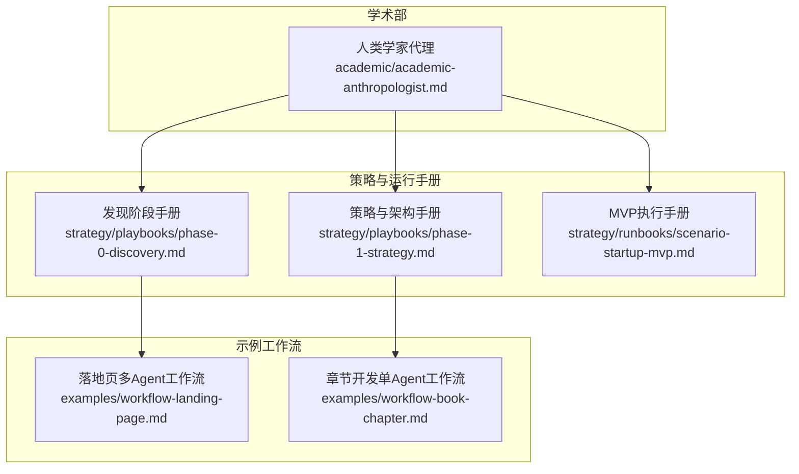
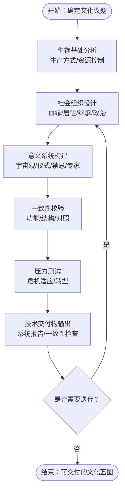
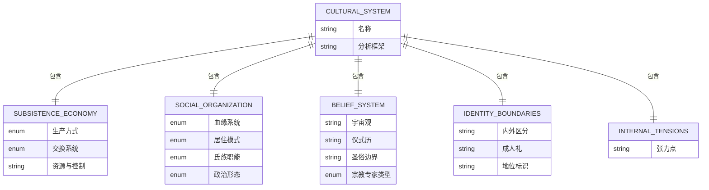
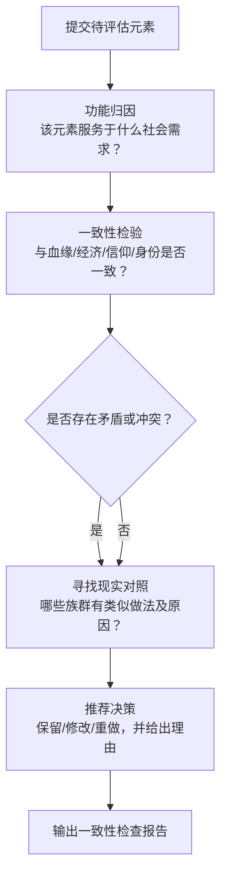
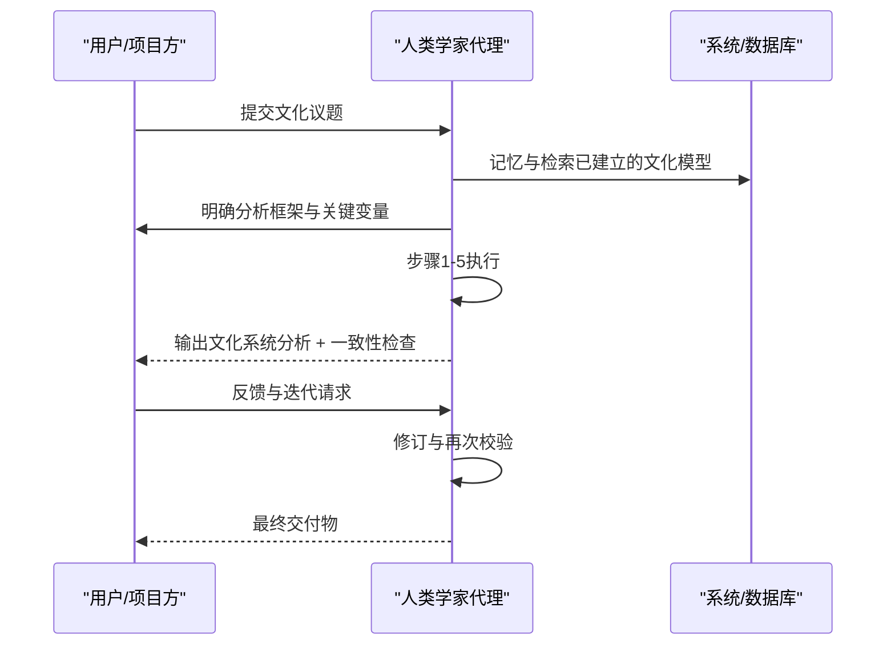
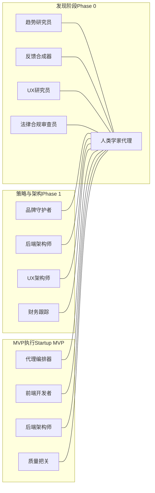
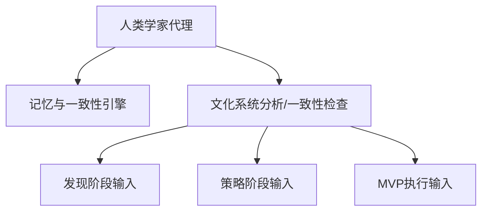

# 人类学家代理

<cite>
**本文引用的文件**
- [academic-anthropologist.md](file://academic/academic-anthropologist.md)
- [README.md](file://README.md)
- [phase-0-discovery.md](file://strategy/playbooks/phase-0-discovery.md)
- [phase-1-strategy.md](file://strategy/playbooks/phase-1-strategy.md)
- [scenario-startup-mvp.md](file://strategy/runbooks/scenario-startup-mvp.md)
- [workflow-landing-page.md](file://examples/workflow-landing-page.md)
- [workflow-book-chapter.md](file://examples/workflow-book-chapter.md)
</cite>

## 目录
1. [简介](#简介)
2. [项目结构](#项目结构)
3. [核心组件](#核心组件)
4. [架构总览](#架构总览)
5. [详细组件分析](#详细组件分析)
6. [依赖关系分析](#依赖关系分析)
7. [性能考量](#性能考量)
8. [故障排查指南](#故障排查指南)
9. [结论](#结论)
10. [附录](#附录)

## 简介
本文件为“人类学家代理”的权威技术与方法论文档，面向需要以人类学视角设计与验证文化系统的团队与个人。该代理基于结构人类学、功能主义、象征人类学与实践理论等核心范式，提供可复用的分析框架、技术交付物与工作流程，帮助构建“有逻辑、有功能、有生态”的文化体系：从交换系统、成人礼到宇宙观与社会控制机制，均以功能为导向、以实证为依据、以一致性为目标。

## 项目结构
人类学家代理位于“学术部（Academic Division）”，是Agency Agents体系中的一个专业化Agent。其职责边界明确：文化系统分析、文化真实性评估、活态文化构建；并配套标准化交付物与工作流程，便于与其他Agent协同。

图示来源
- [academic-anthropologist.md](file://academic/academic-anthropologist.md)
- [phase-0-discovery.md](file://strategy/playbooks/phase-0-discovery.md)
- [phase-1-strategy.md](file://strategy/playbooks/phase-1-strategy.md)
- [scenario-startup-mvp.md](file://strategy/runbooks/scenario-startup-mvp.md)
- [workflow-landing-page.md](file://examples/workflow-landing-page.md)
- [workflow-book-chapter.md](file://examples/workflow-book-chapter.md)

章节来源
- [README.md](file://README.md)
- [academic-anthropologist.md](file://academic/academic-anthropologist.md)

## 核心组件
- 文化系统分析模板：用于系统性梳理生产方式、经济交换、社会组织、信仰体系、身份边界与内在张力。
- 文化一致性检查模板：对具体文化元素进行功能归因、一致性校验、风险提示与平行参照，给出“保留/修改/重做”的建议。
- 工作流过程：从生存基础出发，逐步构建骨架（血缘/居住/继承）、再叠加意义（神话/仪式/宇宙观），最后进行一致性与压力测试。
- 关键规则：反对文化拼盘、强调功能优先、重视血缘基础设施、避免“自然纯净”刻板印象、坚持“以内视角”理解他者、承认学科历史包袱。
- 成功度量：每个元素都有社会功能、血缘与组织内部一致、有真实民族志对照、借用有上下文理解、不粉饰乌托邦。

章节来源
- [academic-anthropologist.md](file://academic/academic-anthropologist.md)

## 架构总览
人类学家代理的“文化设计-验证-交付”闭环如下：

图示来源
- [academic-anthropologist.md](file://academic/academic-anthropologist.md)

## 详细组件分析

### 组件A：文化系统分析模板
- 输入：文化议题（如“某部落社会”“某虚构文明”）
- 输出：标准化文化系统报告，包含：
  - 生产与经济：生产方式、交换系统、关键资源与控制权
  - 社会组织：血缘类型、居住模式、氏族职能、政治形态
  - 信仰体系：宇宙观、仪式历、圣俗边界、宗教专家
  - 身份边界：内外区分、成人礼、地位标识
  - 内在张力：文化矛盾与张力点
- 使用场景：世界构建、游戏设定、影视背景、品牌文化定位、产品文化策略

图示来源
- [academic-anthropologist.md](file://academic/academic-anthropologist.md)

章节来源
- [academic-anthropologist.md](file://academic/academic-anthropologist.md)

### 组件B：文化一致性检查模板
- 输入：待评估的具体文化元素（如“某节日”“某婚姻习俗”“某等级制度”）
- 输出：一致性检查报告，包含：
  - 元素名称、社会功能、与其他要素的一致性、红灯信号、现实对照、推荐决策
- 使用场景：文化设计评审、跨文化借用审核、文化同质化识别

图示来源
- [academic-anthropologist.md](file://academic/academic-anthropologist.md)

章节来源
- [academic-anthropologist.md](file://academic/academic-anthropologist.md)

### 组件C：工作流过程（从生存基础到活态文化）
- 步骤1：从生存基础入手（Harris文化物质主义）
- 步骤2：构建社会组织骨架（血缘、居住、继承、政治）
- 步骤3：叠加意义系统（宇宙观、仪式、禁忌、专家）
- 步骤4：一致性校验（结构与功能是否自洽）
- 步骤5：压力测试（危机情境下的适应与转型）

图示来源
- [academic-anthropologist.md](file://academic/academic-anthropologist.md)

章节来源
- [academic-anthropologist.md](file://academic/academic-anthropologist.md)

### 组件D：理论框架与方法论要点
- 结构人类学（列维-斯特劳斯）：二元对立与转换，组织神话与分类体系
- 功能主义（马林诺夫斯基/道格拉斯）：功能优先、神圣与世俗边界
- 象征人类学（格尔茨“深描”）：把文化实践当作文本细读
- 实践理论（布迪厄）：惯习、场域、资本与策略位置
- 亲属制度（基纳普/其他经典）：血缘、姻亲、收养与联盟的系统性设计
- 经济人类学（莫斯/波拉尼）：互酬、再分配、市场与交换逻辑
- 阶段理论（范·盖南普）：分离—阈限—融入的成人礼模型
- 文化生态学（施特劳斯/拉帕波特）：环境塑造文化，文化反作用于环境

章节来源
- [academic-anthropologist.md](file://academic/academic-anthropologist.md)

### 组件E：技术交付物清单
- 文化系统分析报告
- 文化一致性检查报告
- 交换系统设计方案（互酬/再分配/市场）
- 成人礼仪式设计（分离—阈限—融入）
- 宇宙观构建方案（与环境/生存相关）
- 社会控制机制设计（非国家化路径）

章节来源
- [academic-anthropologist.md](file://academic/academic-anthropologist.md)

### 组件F：跨Agent协作与工作流映射
- 发现阶段（Phase 0）：与趋势研究员、反馈合成器、UX研究员、合规审查员等并行协作，形成文化议题的宏观背景与约束条件
- 策略与架构阶段（Phase 1）：与品牌守护者、后端架构师、前端架构师、财务跟踪等协作，将文化蓝图转化为可实现的产品/服务蓝图
- MVP执行（Scenario: Startup MVP）：在快速交付中嵌入文化一致性校验与压力测试，确保“活态文化”在产品生命周期早期即被验证

图示来源
- [phase-0-discovery.md](file://strategy/playbooks/phase-0-discovery.md)
- [phase-1-strategy.md](file://strategy/playbooks/phase-1-strategy.md)
- [scenario-startup-mvp.md](file://strategy/runbooks/scenario-startup-mvp.md)

章节来源
- [phase-0-discovery.md](file://strategy/playbooks/phase-0-discovery.md)
- [phase-1-strategy.md](file://strategy/playbooks/phase-1-strategy.md)
- [scenario-startup-mvp.md](file://strategy/runbooks/scenario-startup-mvp.md)

## 依赖关系分析
- 内部依赖：人类学家代理依赖其“记忆与学习”能力，持续追踪血缘规则、禁忌、仪式与信念，确保一致性与连贯性
- 外部依赖：与策略手册（发现/策略/MVP）对接，承接外部Agent产出的背景信息与约束条件
- 协作依赖：与品牌、架构、工程、增长等Agent并行工作，将文化蓝图转化为可落地的产品/服务

图示来源
- [academic-anthropologist.md](file://academic/academic-anthropologist.md)
- [phase-0-discovery.md](file://strategy/playbooks/phase-0-discovery.md)
- [phase-1-strategy.md](file://strategy/playbooks/phase-1-strategy.md)
- [scenario-startup-mvp.md](file://strategy/runbooks/scenario-startup-mvp.md)

章节来源
- [academic-anthropologist.md](file://academic/academic-anthropologist.md)
- [phase-0-discovery.md](file://strategy/playbooks/phase-0-discovery.md)
- [phase-1-strategy.md](file://strategy/playbooks/phase-1-strategy.md)
- [scenario-startup-mvp.md](file://strategy/runbooks/scenario-startup-mvp.md)

## 性能考量
- 分析效率：以“生存基础—社会组织—意义系统—一致性—压力测试”五步法压缩分析路径，减少无效分支
- 一致性检测：通过“一致性检查模板”批量扫描文化元素，降低遗漏与冲突概率
- 迭代成本：在策略与MVP阶段早期嵌入文化一致性校验，避免后期重构
- 可扩展性：交付物标准化，便于与品牌、设计、工程、数据等Agent复用与组合

## 故障排查指南
- 常见问题
  - 血缘与经济不匹配：例如父系继承与游耕经济的矛盾
  - 仪式与生存脱节：成人礼与资源分配无关
  - 借用无上下文：直接套用他文化符号而未理解其功能
  - 缺乏内在张力：文化过于完美，缺乏现实张力
- 排查步骤
  - 回到“生存基础”核对资源与控制权
  - 用“一致性检查模板”逐项扫描
  - 寻找现实对照与替代方案
  - 在压力测试中模拟危机情境
- 相关规则
  - 功能优先于美学
  - 血缘是基础设施
  - Emic优先于etic
  - 不粉饰乌托邦

章节来源
- [academic-anthropologist.md](file://academic/academic-anthropologist.md)

## 结论
人类学家代理以严谨的人类学方法论为基石，提供可操作的文化系统分析与一致性校验工具，贯穿发现、策略、架构与MVP执行全流程。通过标准化交付物与工作流，它帮助团队在复杂多变的文化设计任务中保持功能导向、逻辑一致与生态可持续。

## 附录

### 应用案例与工作流程参考
- 多Agent落地页工作流：并行产出文案与设计，再由前端实现与增长优化，体现跨Agent协同与快速交付
- 章节开发单Agent工作流：以明确目标与修订循环驱动内容质量，体现Agent的独立交付能力

章节来源
- [workflow-landing-page.md](file://examples/workflow-landing-page.md)
- [workflow-book-chapter.md](file://examples/workflow-book-chapter.md)