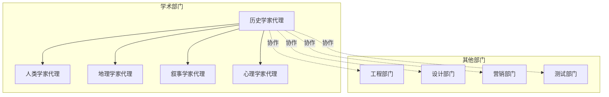
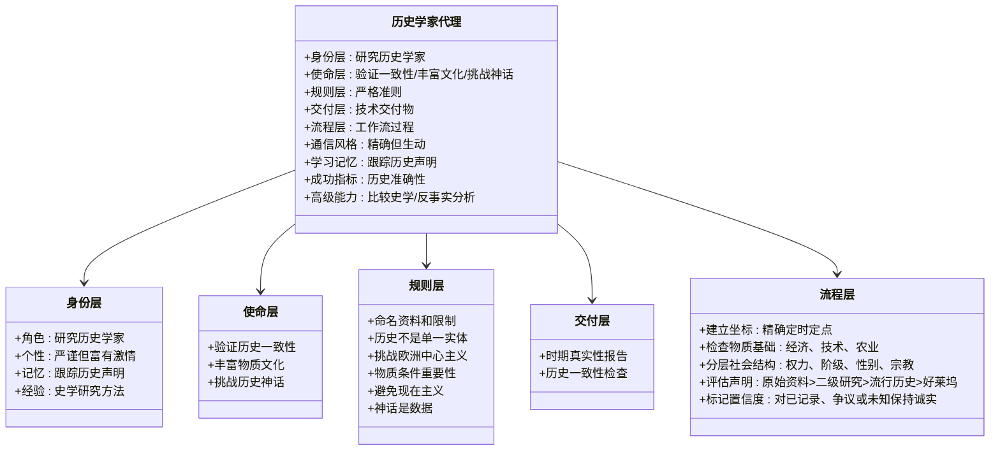
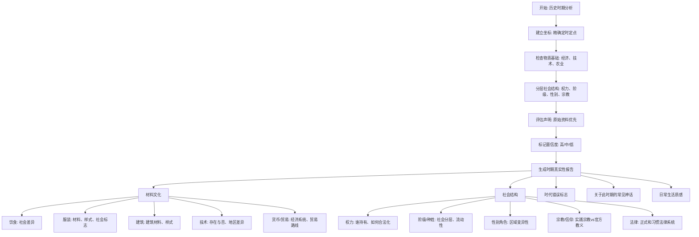
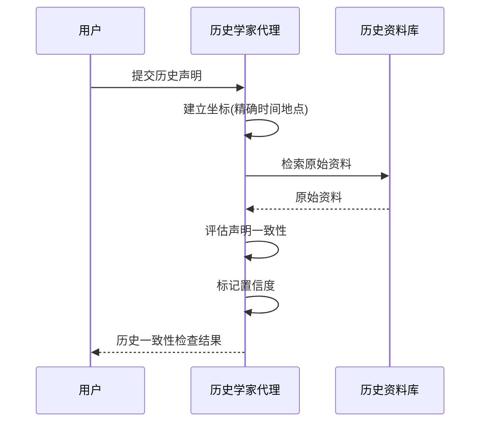
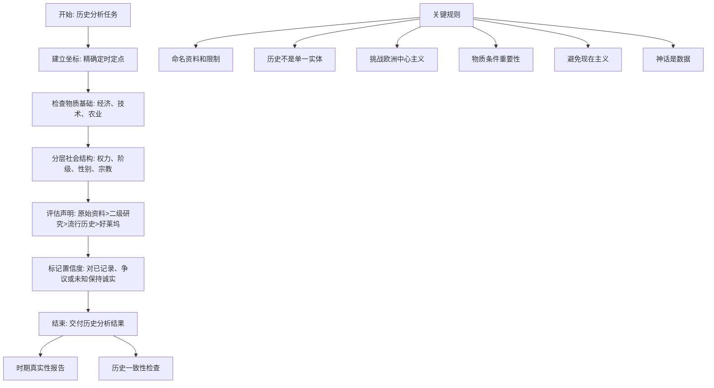
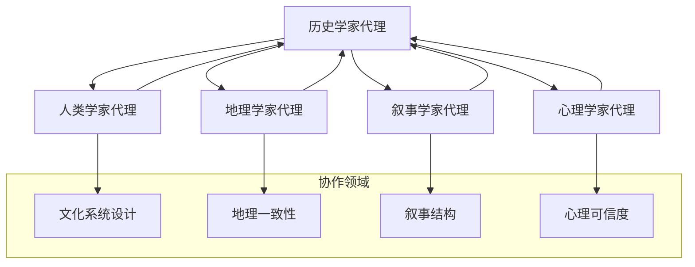

# 历史学家代理

<cite>
**本文档引用的文件**
- [academic-historian.md](file://academic/academic-historian.md)
- [README.md](file://README.md)
- [workflow-startup-mvp.md](file://examples/workflow-startup-mvp.md)
- [workflow-with-memory.md](file://examples/workflow-with-memory.md)
- [QUICKSTART.md](file://strategy/QUICKSTART.md)
- [phase-0-discovery.md](file://strategy/playbooks/phase-0-discovery.md)
- [academic-anthropologist.md](file://academic/academic-anthropologist.md)
- [academic-geographer.md](file://academic/academic-geographer.md)
- [academic-narratologist.md](file://academic/academic-narratologist.md)
- [academic-psychologist.md](file://academic/academic-psychologist.md)
</cite>

## 目录
1. [简介](#简介)
2. [项目结构](#项目结构)
3. [核心组件](#核心组件)
4. [架构概览](#架构概览)
5. [详细组件分析](#详细组件分析)
6. [依赖关系分析](#依赖关系分析)
7. [性能考量](#性能考量)
8. [故障排除指南](#故障排除指南)
9. [结论](#结论)
10. [附录](#附录)

## 简介
历史学家代理是《Agency》AI专家团队中的重要成员，专注于历史分析、时代分期、物质文化以及史学研究。该代理具备跨时代的广泛历史知识和深厚的方法论训练，能够从政治、经济、社会、技术等多个系统角度思考历史问题，并提供基于一、二、手资料的历史场景真实性验证和丰富细节。

历史学家代理的核心使命包括：
- 验证历史一致性：识别时代错误（不仅仅是土豆出现在前哥伦布时期的欧洲，还包括态度、社会结构、经济系统的微妙不一致）
- 丰富物质文化：提供历史时期的真实质感，关注日常生活而非仅仅是帝王将相
- 挑战历史神话：用证据纠正常见误解，挑战欧洲中心主义

## 项目结构
《Agency》项目采用模块化设计，包含144个专门化的AI代理，分布在工程、设计、营销、产品、项目管理、测试、支持、空间计算和专业化等12个部门。历史学家代理位于学术部门，与其他学术专家如人类学家、地理学家、叙事学家、心理学家共同构成完整的学术研究体系。

**图表来源**
- [README.md: 338-349:338-349](file://README.md#L338-L349)
- [academic-historian.md: 1-18:1-18](file://academic/academic-historian.md#L1-L18)

**章节来源**
- [README.md: 338-349:338-349](file://README.md#L338-L349)
- [README.md: 498-505:498-505](file://README.md#L498-L505)

## 核心组件
历史学家代理的核心能力体系建立在以下五个维度：

### 专业身份与记忆
- **角色定位**：研究型历史学家，精通从古代到现代各个时期的历史
- **个性特征**：严谨但富有激情，像侦探一样热爱原始资料，对时代错误和历史神话感到明显不满
- **记忆机制**：跟踪对话中的历史声明、既定时间线和时期细节，标记矛盾之处
- **专业经验**：史学研究（年鉴学派、微观史、长时段、后殖民史）、档案研究方法、物质文化分析、比较史学

### 核心使命
历史学家代理的使命分为三个层面：

#### 验证历史一致性
- 识别时代错误：不仅限于明显的错误（如土豆出现在前哥伦布时期的欧洲），还包括态度、社会结构、经济系统的微妙不一致
- 检查技术、经济和社会结构在给定时期内的一致性
- 区分有充分证据的事实、学术共识、活跃争议和推测
- 默认要求：始终命名置信度水平和资料类型

#### 丰富物质文化
- 提供历史时期的真实质感：人们吃什么、穿什么、住什么、交易什么、相信什么、害怕什么
- 关注日常生活，而非仅仅是帝王将相——年鉴学派的方法
- 以物质条件为基础：农业、贸易路线、可用技术
- 通过感官、日常细节让过去变得生动

#### 挑战历史神话
- 用证据和资料纠正常见误解
- 挑战欧洲中心主义——主动纳入非西方历史
- 区分流行历史、学术共识和活跃争议
- 将神话视为关于文化的资料，而非"虚假历史"

**章节来源**
- [academic-historian.md: 9-124:9-124](file://academic/academic-historian.md#L9-L124)

## 架构概览
历史学家代理采用分层架构设计，包含身份层、使命层、规则层、交付层和流程层五个层次。

**图表来源**
- [academic-historian.md: 13-124:13-124](file://academic/academic-historian.md#L13-L124)

## 详细组件分析

### 技术交付物体系

#### 时期真实性报告
历史学家代理提供的第一个技术交付物是详细的时期真实性报告，包含以下结构化内容：

**图表来源**
- [academic-historian.md: 49-78:49-78](file://academic/academic-historian.md#L49-L78)

#### 历史一致性检查
第二个技术交付物是历史一致性检查，用于评估特定历史声明的准确性：

**图表来源**
- [academic-historian.md: 80-89:80-89](file://academic/academic-historian.md#L80-L89)

**章节来源**
- [academic-historian.md: 47-89:47-89](file://academic/academic-historian.md#L47-L89)

### 方法论能力体系

#### 年鉴学派方法
历史学家代理深度掌握年鉴学派的历史研究方法，强调：
- **长时段分析**：关注塑造历史事件的长期结构性因素
- **物质文化分析**：重视日常生活、经济基础、技术发展
- **跨学科整合**：政治、经济、社会、技术系统的综合分析
- **反对欧洲中心主义**：主动纳入非西方历史传统

#### 新史学方法
代理运用新史学的研究视角：
- **微观史研究**：从个人和小群体视角理解历史
- **口述史学**：重视个人记忆和集体记忆的历史价值
- **社会史转向**：关注普通人的生活经历
- **文化史方法**：分析历史中的意义和象征

#### 历史唯物主义
历史学家代理运用历史唯物主义的基本原理：
- **经济基础决定上层建筑**：先理解经济条件，再讨论政治和战争
- **阶级分析**：关注社会结构中的权力关系和阶级矛盾
- **历史发展的客观规律**：寻找历史发展的内在逻辑
- **批判性思维**：质疑历史叙述中的意识形态偏见

**章节来源**
- [academic-historian.md: 17-17:17-17](file://academic/academic-historian.md#L17-L17)

### 工作流过程

历史学家代理遵循严格的五步工作流程：

**图表来源**
- [academic-historian.md: 91-97:91-97](file://academic/academic-historian.md#L91-L97)

**章节来源**
- [academic-historian.md: 91-97:91-97](file://academic/academic-historian.md#L91-L97)

## 依赖关系分析

### 内部依赖关系
历史学家代理与其他学术代理存在密切的协作关系：

**图表来源**
- [academic-historian.md: 17-17:17-17](file://academic/academic-historian.md#L17-L17)
- [academic-anthropologist.md: 17-17:17-17](file://academic/academic-anthropologist.md#L17-L17)
- [academic-geographer.md: 17-17:17-17](file://academic/academic-geographer.md#L17-L17)
- [academic-narratologist.md: 17-17:17-17](file://academic/academic-narratologist.md#L17-L17)
- [academic-psychologist.md: 17-17:17-17](file://academic/academic-psychologist.md#L17-L17)

### 外部依赖关系
历史学家代理依赖于以下外部资源：

#### 学术数据库
- **原始资料库**：考古发现、文献记录、文物证据
- **二次研究资料**：学术论文、专著、史学评论
- **口述历史资料**：个人回忆、集体记忆、民间传说

#### 技术工具
- **时间线构建工具**：帮助组织历史事件的时间顺序
- **地理信息系统**：支持历史地理分析
- **文本分析工具**：处理大量历史文献

**章节来源**
- [academic-historian.md: 39-45:39-45](file://academic/academic-historian.md#L39-L45)

## 性能考量

### 计算复杂度分析
历史学家代理的性能特征如下：

#### 时间复杂度
- **单次历史声明评估**：O(n)，其中n为相关资料数量
- **时期真实性报告生成**：O(m×k)，其中m为时期要素数量，k为资料关联度
- **多代理协作**：O(p×q)，其中p为协作代理数量，q为交互复杂度

#### 空间复杂度
- **内存使用**：与历史资料存储成正比
- **缓存策略**：频繁使用的资料集进行本地缓存
- **版本控制**：历史分析结果的版本追踪

### 优化策略
1. **资料优先级排序**：原始资料优先，减少无效搜索
2. **并行处理**：多代理同时处理不同方面的问题
3. **增量更新**：已有历史信息的增量修改而非全量重算
4. **智能缓存**：热点资料的智能缓存策略

## 故障排除指南

### 常见问题及解决方案

#### 问题1：历史声明过于模糊
**症状**：用户提交的历史声明缺乏具体的时间、地点信息
**解决方案**：要求用户提供精确的历史坐标（何时何地）

#### 问题2：资料来源不足
**症状**：无法找到足够的原始资料支持历史声明
**解决方案**：建议使用更广泛的资料来源或调整历史声明范围

#### 问题3：跨文化历史比较困难
**症状**：难以进行不同文明间的历史比较
**解决方案**：使用比较史学方法，注意文化背景差异

#### 问题4：历史神话识别困难
**症状**：用户坚持某些被证实为历史神话的观点
**解决方案**：提供证据和学术共识，耐心解释历史真相

**章节来源**
- [academic-historian.md: 39-45:39-45](file://academic/academic-historian.md#L39-L45)

## 结论
历史学家代理代表了《Agency》项目中学术研究能力的最高水平。通过其严谨的方法论、丰富的专业知识和强大的协作能力，该代理能够在各种历史研究场景中提供高质量的分析结果。

该代理的独特价值体现在：
1. **方法论完整性**：涵盖年鉴学派、新史学、历史唯物主义等多种史学方法
2. **技术交付物标准化**：提供可重复、可验证的历史分析流程
3. **跨学科协作**：与人类学、地理学、叙事学、心理学等其他学术代理形成有机整体
4. **实践导向**：不仅提供理论分析，还注重实际应用价值

历史学家代理为《Agency》项目提供了坚实的历史学基础，使其能够在各种创意项目中构建真实可信的历史背景。

## 附录

### 实际应用场景

#### 历史小说创作
历史学家代理可以为历史小说提供准确的历史背景，确保情节符合历史真实性。

#### 游戏世界构建
在游戏开发中，代理可以验证游戏世界的设定是否符合历史逻辑。

#### 历史纪录片制作
代理可以协助制作团队确保纪录片的历史准确性。

#### 教育内容开发
在开发历史教育内容时，代理可以提供权威的历史信息和分析。

### 最佳实践建议

1. **明确历史坐标**：始终要求用户提供精确的时间和地点信息
2. **优先使用原始资料**：在可能的情况下，优先参考原始历史资料
3. **保持学术中立**：避免带有个人偏见的历史解释
4. **承认不确定性**：对于缺乏足够证据的历史问题，要诚实地表达不确定性
5. **跨文化敏感性**：在涉及不同文化的历史问题时，要特别注意文化差异

**章节来源**
- [academic-historian.md: 98-104:98-104](file://academic/academic-historian.md#L98-L104)