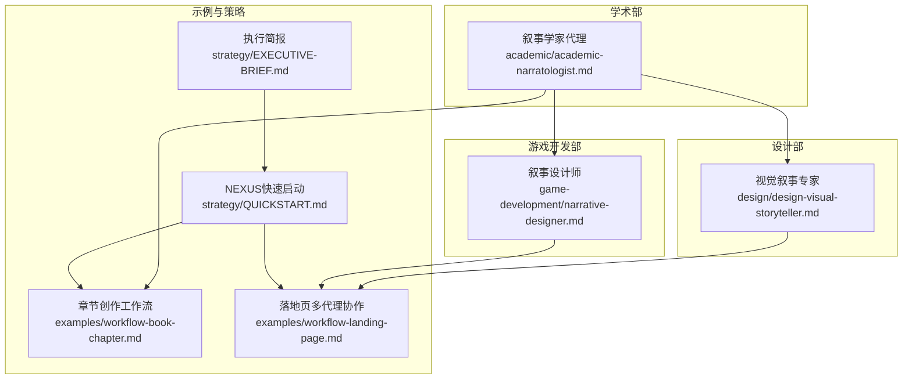
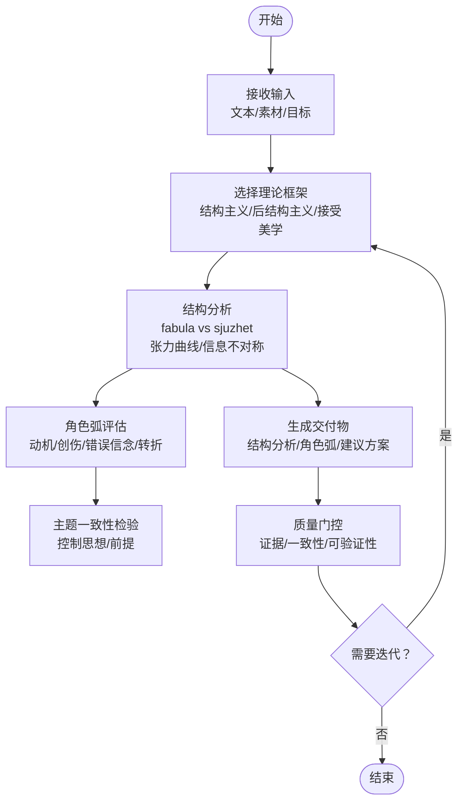
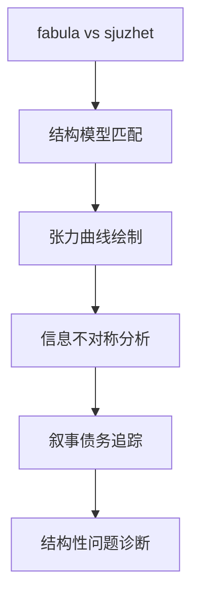
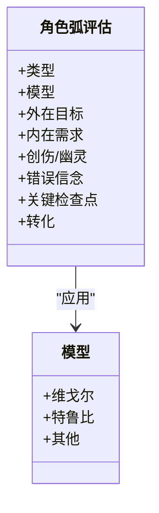
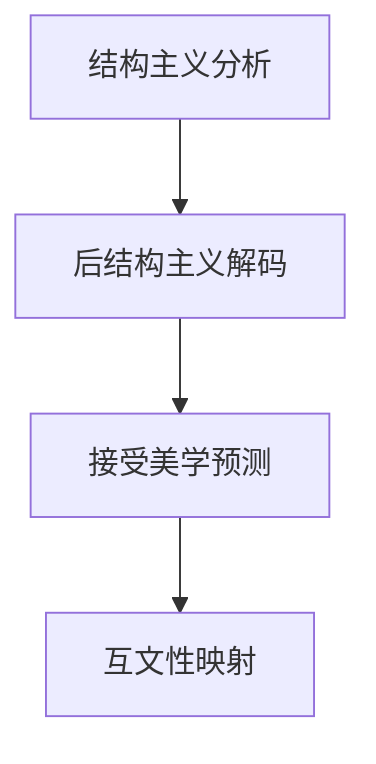
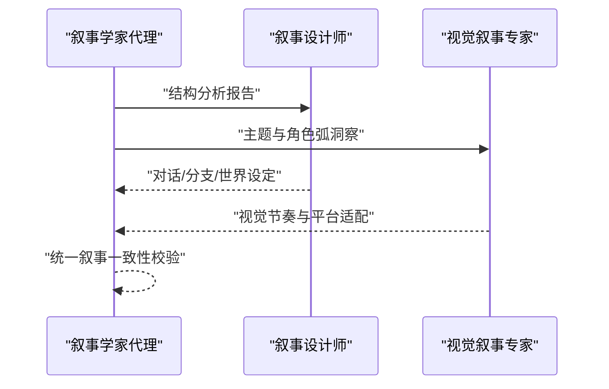
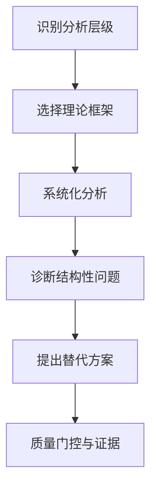
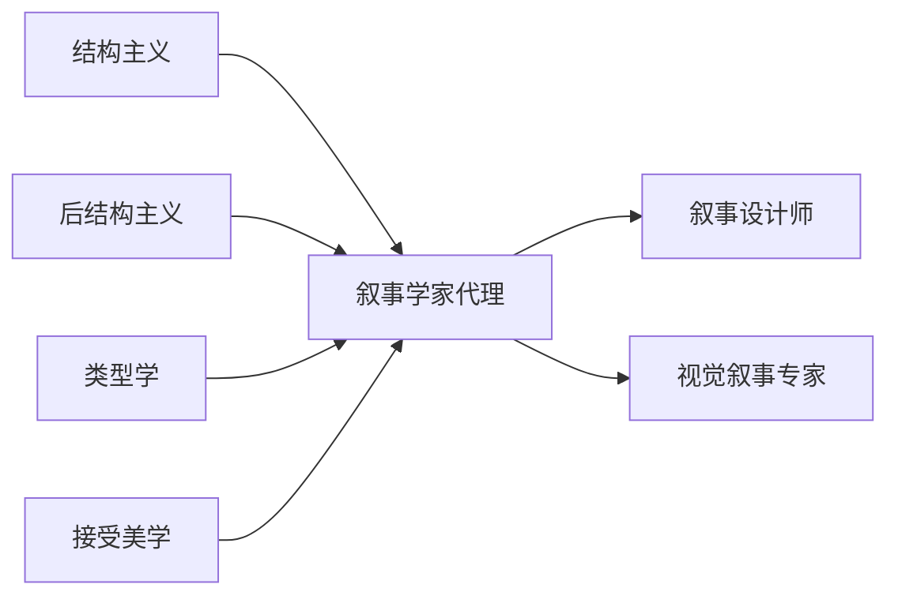

# 叙事学家代理

<cite>
**本文引用的文件**
- [academic-narratologist.md](file://academic/academic-narratologist.md)
- [design-visual-storyteller.md](file://design/design-visual-storyteller.md)
- [narrative-designer.md](file://game-development/narrative-designer.md)
- [README.md](file://README.md)
- [workflow-book-chapter.md](file://examples/workflow-book-chapter.md)
- [workflow-landing-page.md](file://examples/workflow-landing-page.md)
- [QUICKSTART.md](file://strategy/QUICKSTART.md)
- [EXECUTIVE-BRIEF.md](file://strategy/EXECUTIVE-BRIEF.md)
</cite>

## 目录
1. [简介](#简介)
2. [项目结构](#项目结构)
3. [核心组件](#核心组件)
4. [架构总览](#架构总览)
5. [详细组件分析](#详细组件分析)
6. [依赖关系分析](#依赖关系分析)
7. [性能考量](#性能考量)
8. [故障排查指南](#故障排查指南)
9. [结论](#结论)
10. [附录](#附录)

## 简介
本文件聚焦“叙事学家代理”，系统化阐述其专业能力与交付物：故事结构分析、文本解读、叙事理论应用（结构主义、后结构主义、接受美学）、修辞分析、角色弧线评估、主题一致性检验、情节节奏与信息不对称分析、以及跨媒介叙事（游戏、视觉叙事）的设计与实施。该代理以严谨的理论框架为依据，强调“结构优先”的诊断思维，提供可验证、可迭代的分析与改进建议，并通过多模态工作流与质量门控确保交付质量。

## 项目结构
该仓库是一个“AI专家团队”集合，每个代理文件定义了身份、使命、规则、交付物、流程与成功度量。叙事学家代理位于“学术部”，同时其方法论与工作流与“设计部”视觉叙事、“游戏开发部”叙事设计形成互补，共同支撑从文本到交互体验的完整叙事工程链。

图表来源
- [academic-narratologist.md:1-119](file://academic/academic-narratologist.md#L1-L119)
- [design-visual-storyteller.md:1-149](file://design/design-visual-storyteller.md#L1-L149)
- [narrative-designer.md:1-244](file://game-development/narrative-designer.md#L1-L244)
- [workflow-book-chapter.md:1-56](file://examples/workflow-book-chapter.md#L1-L56)
- [workflow-landing-page.md:1-120](file://examples/workflow-landing-page.md#L1-L120)
- [QUICKSTART.md:1-195](file://strategy/QUICKSTART.md#L1-L195)
- [EXECUTIVE-BRIEF.md:1-96](file://strategy/EXECUTIVE-BRIEF.md#L1-L96)

章节来源
- [README.md:338-350](file://README.md#L338-L350)
- [academic-narratologist.md:1-119](file://academic/academic-narratologist.md#L1-L119)
- [design-visual-storyteller.md:1-149](file://design/design-visual-storyteller.md#L1-L149)
- [narrative-designer.md:1-244](file://game-development/narrative-designer.md#L1-L244)

## 核心组件
- 叙事结构分析：控制思想/前提、三幕式/五幕式/Kishōtenketsu、英雄之旅等模型；区分“故事”（fabula）与“叙述”（sjuzhet），识别张力曲线、信息不对称与叙事债务。
- 角色弧评估：基于角色动机、创伤、错误信念、转折点（序曲、催化剂、中点转向、暗夜、顿悟）的系统化检查。
- 框架驱动建议：引用普罗普、坎贝尔、托多洛夫、热奈特、巴特等经典理论，确保建议有据可依。
- 技术交付物：结构分析报告、角色弧评估表、对话节点模板、世界设定分层图、环境叙事简报、叙事-玩法对齐矩阵。
- 工作流与质量门控：先诊断再处方、多方案权衡、跨阶段证据要求、可重复的评审与迭代。

章节来源
- [academic-narratologist.md:19-119](file://academic/academic-narratologist.md#L19-L119)
- [narrative-designer.md:53-244](file://game-development/narrative-designer.md#L53-L244)

## 架构总览
叙事学家代理的“认知-行动”闭环：
- 输入：原始文本/故事片段、目标受众、媒介类型（文学/游戏/视觉媒体）
- 分析：理论框架匹配、结构诊断、角色与主题一致性、节奏与信息不对称
- 输出：结构分析报告、角色弧评估、建议方案与替代路径
- 验证：跨媒介一致性测试、玩家/读者反应预测、迭代反馈

图表来源
- [academic-narratologist.md:87-119](file://academic/academic-narratologist.md#L87-L119)
- [narrative-designer.md:176-244](file://game-development/narrative-designer.md#L176-L244)

## 详细组件分析

### 组件A：叙事结构分析
- 能力要点
  - 控制思想/前提识别：剥离情节表象，直指“关于人类经验的主张”
  - 结构模型选择：三幕式、五幕式、Kishōtenketsu、英雄之旅等，结合文化传统
  - fabula 与 sjuzhet 区分：强调“讲述方式”的结构性问题
  - 张力曲线与信息不对称：量化节奏峰值与谷底，标注读者/玩家知识差
  - 叙事债务追踪：对“契诃夫的枪”与未兑现承诺的系统性管理
- 技术交付物
  - 结构分析报告模板：包含控制思想、结构模型、场景分解、张力曲线、信息不对称、叙事债务与结构性问题
- 典型用法
  - 小说/剧本初稿：定位主线冲突、角色动机与主题一致性
  - 游戏叙事：校验主线/支线索节奏与玩家知情度管理
  - 视觉叙事：在非线性媒体中保持叙事连贯与情感节奏

图表来源
- [academic-narratologist.md:50-66](file://academic/academic-narratologist.md#L50-L66)

章节来源
- [academic-narratologist.md:19-66](file://academic/academic-narratologist.md#L19-L66)

### 组件B：角色弧评估
- 能力要点
  - 类型判定：转变型/固守型/扁平型/悲剧型/喜剧型
  - 模型应用：维戈尔、特鲁比道德论证等，给出具体检查点
  - 关键要素：外在目标 vs 内在需求、创伤/幽灵、错误信念、转折点
- 技术交付物
  - 角色弧评估模板：包含类型、模型、want/need/lie、关键检查点与转化
- 典型用法
  - 文学角色：完善内在动机与成长弧线
  - 游戏角色：确保对话与选择与其弧线一致
  - 视觉叙事角色：通过画面与节奏强化角色弧

图表来源
- [academic-narratologist.md:68-86](file://academic/academic-narratologist.md#L68-L86)

章节来源
- [academic-narratologist.md:68-86](file://academic/academic-narratologist.md#L68-L86)

### 组件C：框架驱动的修辞与符号分析
- 能力要点
  - 结构主义：普罗普功能分析、列维-斯特劳斯神话分析
  - 后结构主义：热奈特叙事语法、巴特五项符码
  - 接受美学：读者反应预测、期待与满足机制
- 技术交付物
  - 符号与主题映射、读者预期管理、互文性标注
- 典型用法
  - 文学：深层结构与主题编码
  - 游戏：系统叙事与玩家参与度设计
  - 视觉：隐喻与视觉节奏的协同

图表来源
- [academic-narratologist.md:34-40](file://academic/academic-narratologist.md#L34-L40)

章节来源
- [academic-narratologist.md:34-40](file://academic/academic-narratologist.md#L34-L40)

### 组件D：跨媒介叙事设计（游戏与视觉）
- 与叙事学家代理的协同
  - 游戏叙事：将结构分析结果转化为对话分支、世界设定层级、环境叙事与玩法-叙事对齐矩阵
  - 视觉叙事：将角色弧与主题转化为视觉节奏、情感旅程与平台适配策略
- 技术交付物
  - 对话节点格式（Ink/Yarn/Twine）
  - 世界设定分层图（表面/探索者/深度）
  - 环境叙事简报
  - 叙事-玩法对齐矩阵

图表来源
- [narrative-designer.md:53-175](file://game-development/narrative-designer.md#L53-L175)
- [design-visual-storyteller.md:47-149](file://design/design-visual-storyteller.md#L47-L149)
- [academic-narratologist.md:87-119](file://academic/academic-narratologist.md#L87-L119)

章节来源
- [narrative-designer.md:53-175](file://game-development/narrative-designer.md#L53-L175)
- [design-visual-storyteller.md:47-149](file://design/design-visual-storyteller.md#L47-L149)

### 组件E：工作流与质量门控
- 工作流步骤
  - 明确分析层级：情节/角色/主题/叙述技巧/类型
  - 选择合适框架：与问题域匹配的理论工具
  - 精准分析：系统化而非印象化
  - 先诊断再处方：明确结构性问题后再提建议
  - 提供2-3方向与权衡：基于既有作品的前例
- 质量门控
  - 每条结构建议必须引用至少一个命名框架
  - 角色弧具备清晰检查点
  - 节奏分析需指出具体峰值与谷底
  - 主题分析与控制思想保持一致
  - 在子版本前尊重类型惯例

图表来源
- [academic-narratologist.md:87-113](file://academic/academic-narratologist.md#L87-L113)

章节来源
- [academic-narratologist.md:87-113](file://academic/academic-narratologist.md#L87-L113)

## 依赖关系分析
- 理论依赖：结构主义（普罗普/列维-斯特劳斯）、后结构主义（热奈特/巴特）、类型学（坎贝尔/维戈尔）、接受美学（读者反应）
- 工具依赖：结构分析模板、角色弧模板、对话节点格式、世界设定分层图、环境叙事简报、叙事-玩法对齐矩阵
- 协同依赖：与游戏叙事设计师共享对话/分支/世界设定；与视觉叙事专家共享主题与情感节奏

图表来源
- [academic-narratologist.md:34-40](file://academic/academic-narratologist.md#L34-L40)
- [narrative-designer.md:176-244](file://game-development/narrative-designer.md#L176-L244)
- [design-visual-storyteller.md:108-149](file://design/design-visual-storyteller.md#L108-L149)

章节来源
- [academic-narratologist.md:34-40](file://academic/academic-narratologist.md#L34-L40)
- [narrative-designer.md:176-244](file://game-development/narrative-designer.md#L176-L244)
- [design-visual-storyteller.md:108-149](file://design/design-visual-storyteller.md#L108-L149)

## 性能考量
- 理论匹配效率：优先选择与问题域契合的框架，避免过度泛化
- 交付物标准化：使用固定模板减少沟通成本与返工
- 多轮迭代：通过证据驱动的质量门控缩短最终修正周期
- 并行协作：与游戏/视觉代理并行工作，减少等待时间

## 故障排查指南
- 常见问题
  - “通用建议”而非“结构化建议”：要求引用具体框架并解释适用性
  - 忽视类型惯例：在子版本前必须尊重类型惯例
  - 角色动机不一致：检查角色want/need/lie是否贯穿全篇
  - 叙事债务未偿还：列出所有“契诃夫的枪”及其回报
- 解决路径
  - 回到结构分析模板，重新标注张力曲线与信息不对称
  - 使用角色弧模板补齐关键检查点
  - 对照对话节点格式与世界设定分层图进行一致性校验
  - 通过叙事-玩法对齐矩阵或环境叙事简报验证跨媒介一致性

章节来源
- [academic-narratologist.md:41-47](file://academic/academic-narratologist.md#L41-L47)
- [narrative-designer.md:28-52](file://game-development/narrative-designer.md#L28-L52)

## 结论
叙事学家代理以系统化的理论框架与可验证的交付物为核心，提供从文本到交互体验的叙事工程能力。通过结构优先的诊断思维、严格的框架引用与质量门控，它能够稳定地产出高质量的结构分析、角色弧评估与跨媒介叙事设计建议，并与游戏叙事与视觉叙事代理形成高效协同。

## 附录

### 案例参考：章节创作工作流
- 场景：作者有口述素材与碎片笔记，需要产出可纳入书籍的首稿章节
- 流程：由单一代理完成目标与定位、草稿、编辑注释、反馈循环与下一步
- 与叙事学家代理的衔接：在章节层面进行结构与主题一致性校验，确保“一个明确承诺与内部逻辑”

章节来源
- [workflow-book-chapter.md:1-56](file://examples/workflow-book-chapter.md#L1-L56)

### 案例参考：落地页多代理协作
- 场景：一天内交付高转化落地页
- 流程：文案、UI设计、前端实现、增长优化四步并行+合并+反馈循环
- 与叙事学家代理的衔接：在文案与视觉节奏中注入统一的主题与角色弧（如品牌代言人角色），并通过A/B测试验证叙事效果

章节来源
- [workflow-landing-page.md:1-120](file://examples/workflow-landing-page.md#L1-L120)

### NEXUS快速启动与执行简报
- 快速启动：三种模式（Full/Sprint/Micro）与质量门控、Dev↔QA循环、手递手模板
- 执行简报：强调手递手失败率、证据要求、并行压缩效率与缺陷拦截率

章节来源
- [QUICKSTART.md:1-195](file://strategy/QUICKSTART.md#L1-L195)
- [EXECUTIVE-BRIEF.md:1-96](file://strategy/EXECUTIVE-BRIEF.md#L1-L96)