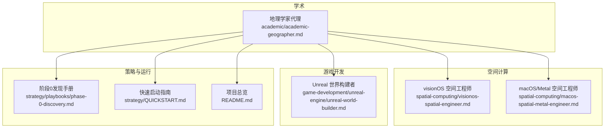
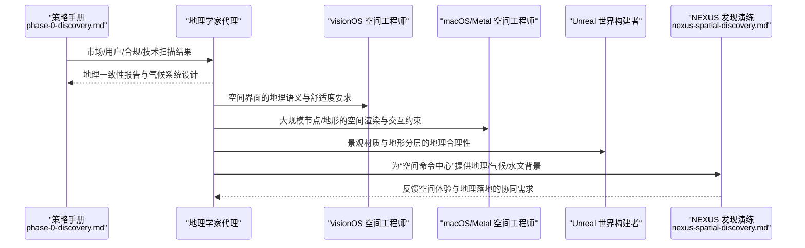
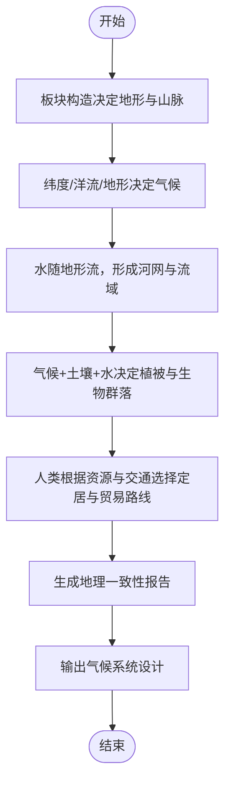
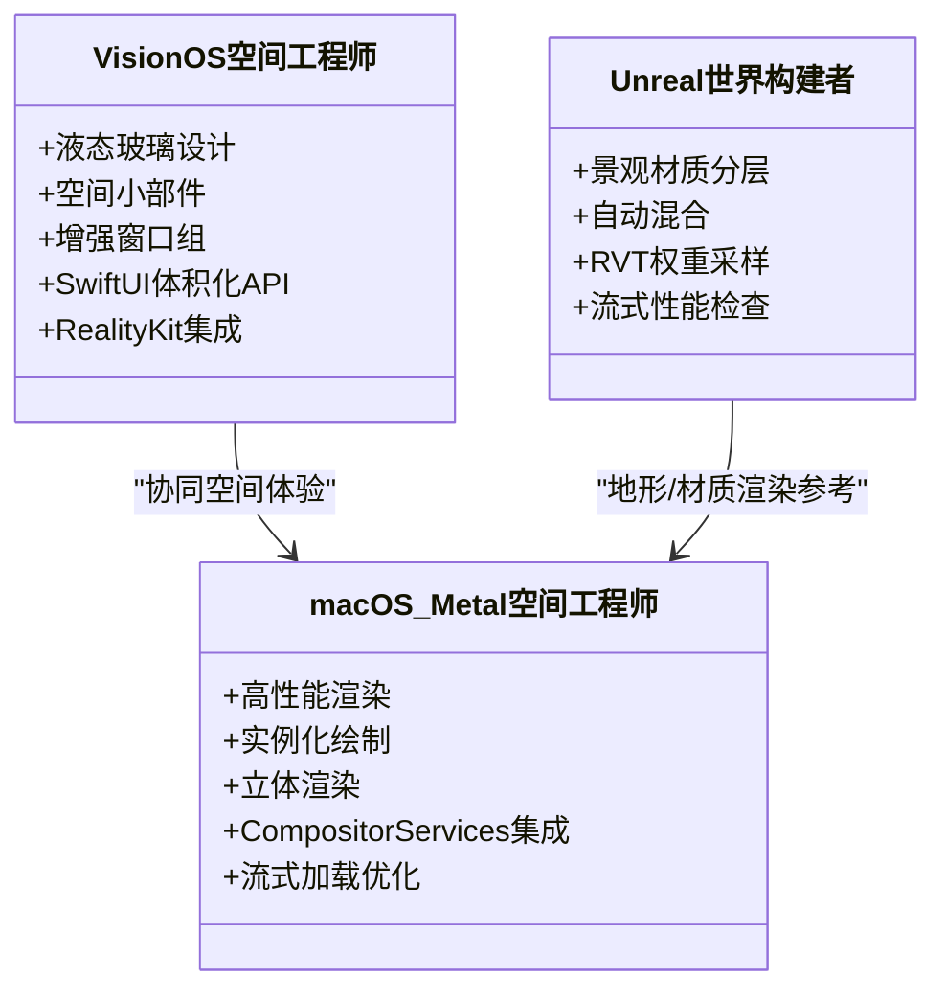
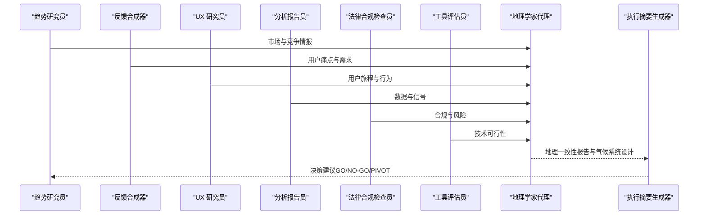
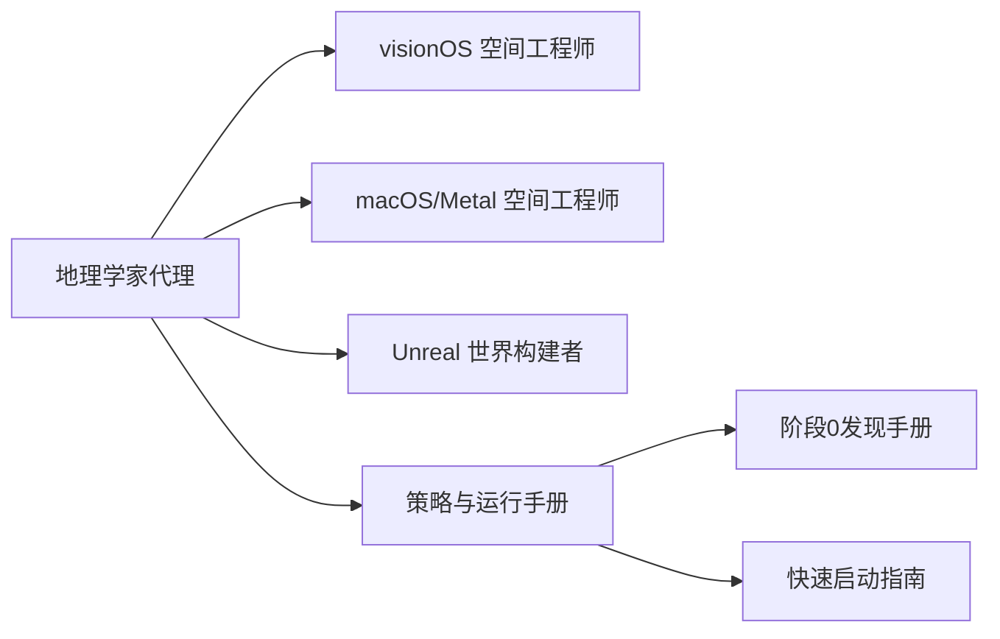

# 地理学家代理

<cite>
**本文引用的文件**
- [academic-geographer.md](file://academic/academic-geographer.md)
- [nexus-spatial-discovery.md](file://examples/nexus-spatial-discovery.md)
- [visionos-spatial-engineer.md](file://spatial-computing/visionos-spatial-engineer.md)
- [macos-spatial-metal-engineer.md](file://spatial-computing/macos-spatial-metal-engineer.md)
- [unreal-world-builder.md](file://game-development/unreal-engine/unreal-world-builder.md)
- [phase-0-discovery.md](file://strategy/playbooks/phase-0-discovery.md)
- [QUICKSTART.md](file://strategy/QUICKSTART.md)
- [README.md](file://README.md)
</cite>

## 目录
1. [简介](#简介)
2. [项目结构](#项目结构)
3. [核心组件](#核心组件)
4. [架构总览](#架构总览)
5. [详细组件分析](#详细组件分析)
6. [依赖关系分析](#依赖关系分析)
7. [性能考量](#性能考量)
8. [故障排查指南](#故障排查指南)
9. [结论](#结论)
10. [附录](#附录)

## 简介
本文件面向“地理学家代理”，系统化阐述其专业能力与工作方式，覆盖空间分析、环境研究、景观生态学、区域地理学等核心研究领域，并结合仓库中的多模态空间计算与产品发现实践，说明地理学家如何运用地理信息系统（GIS）、空间分析方法、环境适应理论、景观美学理论等开展地理研究。重点展示其在空间模式识别、环境影响评估、景观设计、区域发展规划等方面的能力，以及空间数据处理、环境因子分析、景观连通性评估、可持续发展方案等技术交付物。最后提供可操作的研究方法与案例路径，帮助读者以空间思维解决地理问题。

## 项目结构
该仓库是一个多学科、多代理的协作体系，地理学家代理位于“学术”分部，同时与“空间计算”“游戏开发”“策略与运行手册”等多个模块存在协同关系：
- 学术分部：地理学家代理定义了地理学视角下的系统思维、规则约束与交付物模板。
- 空间计算分部：visionOS 与 macOS/Metal 工程师提供了沉浸式空间界面与高性能渲染的技术实现基础。
- 游戏开发分部：Unreal 世界构建者展示了大规模地形与景观材质的工程化方法，可类比用于地理/景观建模。
- 策略与运行手册：NEXUS 发现演练与阶段化流程为地理学家参与跨职能项目提供了标准化协作框架。

图表来源
- [academic-geographer.md:1-128](file://academic/academic-geographer.md#L1-L128)
- [visionos-spatial-engineer.md:1-54](file://spatial-computing/visionos-spatial-engineer.md#L1-L54)
- [macos-spatial-metal-engineer.md:1-337](file://spatial-computing/macos-spatial-metal-engineer.md#L1-L337)
- [unreal-world-builder.md:82-274](file://game-development/unreal-engine/unreal-world-builder.md#L82-L274)
- [phase-0-discovery.md:1-179](file://strategy/playbooks/phase-0-discovery.md#L1-L179)
- [QUICKSTART.md:1-195](file://strategy/QUICKSTART.md#L1-L195)
- [README.md:1-886](file://README.md#L1-L886)

章节来源
- [README.md:338-350](file://README.md#L338-L350)
- [QUICKSTART.md:1-195](file://strategy/QUICKSTART.md#L1-L195)

## 核心组件
地理学家代理的核心由以下要素构成：
- 身份与记忆：系统性地理知识、气候系统、地貌演化、水文循环、人类活动与地理关系的记忆与一致性检查。
- 核心使命：验证地理一致性、构建可信物理世界、分析人地互动。
- 关键规则：河流不无故分叉、气候是系统、地理不是装饰、避免地理决定论、尺度重要、地图是论证。
- 技术交付物：地理一致性报告、气候系统设计。
- 工作流过程：从板块构造出发，按“气候—水文—生物群落—人类定居”的顺序层层叠加。
- 沟通风格：空间化描述、系统性解释、现实类比、温和纠错、强调地图思维。
- 成功指标：气候遵循真实大气环流逻辑、水系符合水文学、定居点有地理依据、资源分布符合地质与生态逻辑。
- 高级能力：古气候、城市地理、地缘政治、环境史、制图设计。

章节来源
- [academic-geographer.md:9-128](file://academic/academic-geographer.md#L9-L128)

## 架构总览
地理学家代理在多模态空间计算与产品发现场景中承担“地理一致性把关者”角色，其职责贯穿市场洞察、技术架构、品牌策略、用户体验与执行计划的全链路。下图展示了地理学家代理与空间计算工程师、世界构建专家、策略手册之间的交互关系。

图表来源
- [phase-0-discovery.md:114-133](file://strategy/playbooks/phase-0-discovery.md#L114-L133)
- [academic-geographer.md:47-101](file://academic/academic-geographer.md#L47-L101)
- [visionos-spatial-engineer.md:13-38](file://spatial-computing/visionos-spatial-engineer.md#L13-L38)
- [macos-spatial-metal-engineer.md:19-64](file://spatial-computing/macos-spatial-metal-engineer.md#L19-L64)
- [unreal-world-builder.md:82-109](file://game-development/unreal-engine/unreal-world-builder.md#L82-L109)
- [nexus-spatial-discovery.md:1-853](file://examples/nexus-spatial-discovery.md#L1-L853)

## 详细组件分析

### 组件A：地理一致性与气候系统设计
- 地理一致性报告包含物理地理、资源分布、人类地理与一致性问题四大部分，用于系统性校验地理设定的自洽性。
- 气候系统设计从全球因素（黄赤交角、洋流、盛行风、大陆位置）到区域效应（雨影、海岸调节、海拔效应、季风/干季）逐层展开。
- 工作流强调“先构造板块，再构建气候，后加水文与生物群落，最后人类定居”的顺序，确保因果链条合理。

图表来源
- [academic-geographer.md:95-101](file://academic/academic-geographer.md#L95-L101)
- [academic-geographer.md:49-93](file://academic/academic-geographer.md#L49-L93)

章节来源
- [academic-geographer.md:47-101](file://academic/academic-geographer.md#L47-L101)

### 组件B：空间计算与地理可视化协同
- visionOS 空间工程师强调液态玻璃（Liquid Glass）设计、空间小部件、增强窗口组、SwiftUI 体积化 API 与 RealityKit 集成，为地理可视化提供沉浸式界面基础。
- macOS/Metal 空间工程师聚焦于高性能 3D 渲染、大规模节点与边的实例化绘制、立体渲染与深度管理、Compositor Services 与 RemoteImmersiveSpace 的集成，保障地理/空间界面的实时性与可扩展性。
- Unreal 世界构建者展示了景观材质分层、自动坡度/高度混合、运行时虚拟纹理（RVT）与流式加载优化，这些方法可直接迁移到地理/景观建模与渲染管线中。

图表来源
- [visionos-spatial-engineer.md:13-38](file://spatial-computing/visionos-spatial-engineer.md#L13-L38)
- [macos-spatial-metal-engineer.md:19-64](file://spatial-computing/macos-spatial-metal-engineer.md#L19-L64)
- [unreal-world-builder.md:82-109](file://game-development/unreal-engine/unreal-world-builder.md#L82-L109)

章节来源
- [visionos-spatial-engineer.md:13-38](file://spatial-computing/visionos-spatial-engineer.md#L13-L38)
- [macos-spatial-metal-engineer.md:19-64](file://spatial-computing/macos-spatial-metal-engineer.md#L19-L64)
- [unreal-world-builder.md:82-109](file://game-development/unreal-engine/unreal-world-builder.md#L82-L109)

### 组件C：地理学家参与的跨职能项目流程
- 在 NEXUS 发现演练中，地理学家代理可作为“地理一致性把关者”参与市场验证、技术架构、品牌策略、增长与支持蓝图、UX 设计方向、项目执行计划与空间界面架构的多轮评审。
- 阶段0发现手册强调并行启动多个代理（趋势研究、反馈合成、UX 研究、数据分析、合规审查、工具评估），地理学家在此过程中提供地理/气候/水文层面的证据与建议，确保机会验证与后续架构设计建立在真实地理前提之上。

图表来源
- [phase-0-discovery.md:17-133](file://strategy/playbooks/phase-0-discovery.md#L17-L133)
- [nexus-spatial-discovery.md:1-853](file://examples/nexus-spatial-discovery.md#L1-L853)

章节来源
- [phase-0-discovery.md:17-133](file://strategy/playbooks/phase-0-discovery.md#L17-L133)
- [nexus-spatial-discovery.md:1-853](file://examples/nexus-spatial-discovery.md#L1-L853)

## 依赖关系分析
- 地理学家代理对“空间计算工程师”的依赖体现在：界面的地理语义正确性、空间交互的舒适度与可达性、大规模数据/地形渲染的性能边界。
- 对“世界构建专家”的依赖体现在：景观材质与分层的地理合理性、流式加载与性能基线，这些直接影响地理/景观可视化与交互体验。
- 对“策略手册”的依赖体现在：跨职能协作的证据要求、质量门禁、手把手的阶段化流程，确保地理学家的交付物能被纳入整体产品蓝图。

图表来源
- [academic-geographer.md:1-128](file://academic/academic-geographer.md#L1-L128)
- [visionos-spatial-engineer.md:1-54](file://spatial-computing/visionos-spatial-engineer.md#L1-L54)
- [macos-spatial-metal-engineer.md:1-337](file://spatial-computing/macos-spatial-metal-engineer.md#L1-L337)
- [unreal-world-builder.md:82-109](file://game-development/unreal-engine/unreal-world-builder.md#L82-L109)
- [phase-0-discovery.md:1-179](file://strategy/playbooks/phase-0-discovery.md#L1-L179)
- [QUICKSTART.md:1-195](file://strategy/QUICKSTART.md#L1-L195)

章节来源
- [QUICKSTART.md:1-195](file://strategy/QUICKSTART.md#L1-L195)
- [README.md:338-350](file://README.md#L338-L350)

## 性能考量
- 渲染性能：在大规模节点/地形场景中，需关注帧率、GPU 利用率、内存占用与批处理数量，确保立体渲染与空间交互的流畅性。
- 交互舒适度：遵循视觉舒适区、 Vergence-Accommodation 匹配、深度排序与过渡动画，避免空间眩晕与疲劳。
- 流式加载与性能基线：借鉴世界构建者的流式加载与性能检查清单，确保地理/景观在不同密度与距离下的稳定表现。

章节来源
- [macos-spatial-metal-engineer.md:42-64](file://spatial-computing/macos-spatial-metal-engineer.md#L42-L64)
- [unreal-world-builder.md:176-205](file://game-development/unreal-engine/unreal-world-builder.md#L176-L205)

## 故障排查指南
- 地理一致性问题：若出现“河流无故分叉”“热带森林出现在高纬度”“沙漠没有水源解释”等情况，应回溯板块构造、气候系统与水文逻辑，修正设定或补充魔法/奇幻说明。
- 空间体验问题：若出现“节点选择延迟过高”“立体渲染掉帧”“深度错乱”，应检查渲染管线、批处理、LOD 与流式加载配置。
- 协作断点：若跨职能评审中缺乏证据或质量门禁未满足，应退回阶段0重新收集证据，直至达到“证据为基础”的批准标准。

章节来源
- [academic-geographer.md:39-46](file://academic/academic-geographer.md#L39-L46)
- [macos-spatial-metal-engineer.md:42-64](file://spatial-computing/macos-spatial-metal-engineer.md#L42-L64)
- [phase-0-discovery.md:134-149](file://strategy/playbooks/phase-0-discovery.md#L134-L149)

## 结论
地理学家代理以系统性地理知识与严格的规则约束，为多模态空间计算与产品发现提供“地理真实性”的基础。通过与空间计算工程师、世界构建专家及策略手册的协同，地理学家不仅产出地理一致性报告与气候系统设计，更将地理学原理融入空间界面、渲染性能与用户体验设计之中，最终支撑出既科学又沉浸的地理/空间产品。

## 附录
- 快速上手：使用 NEXUS 模式激活地理学家代理，配合阶段0发现手册与快速启动指南，明确证据要求与质量门禁。
- 实战案例：参考“Nexus 空间发现演练”，将地理学家的交付物纳入市场验证、技术架构、品牌策略与空间界面设计的全流程评审。

章节来源
- [QUICKSTART.md:21-42](file://strategy/QUICKSTART.md#L21-L42)
- [phase-0-discovery.md:114-133](file://strategy/playbooks/phase-0-discovery.md#L114-L133)
- [nexus-spatial-discovery.md:1-853](file://examples/nexus-spatial-discovery.md#L1-L853)