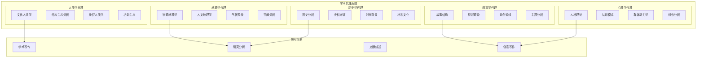
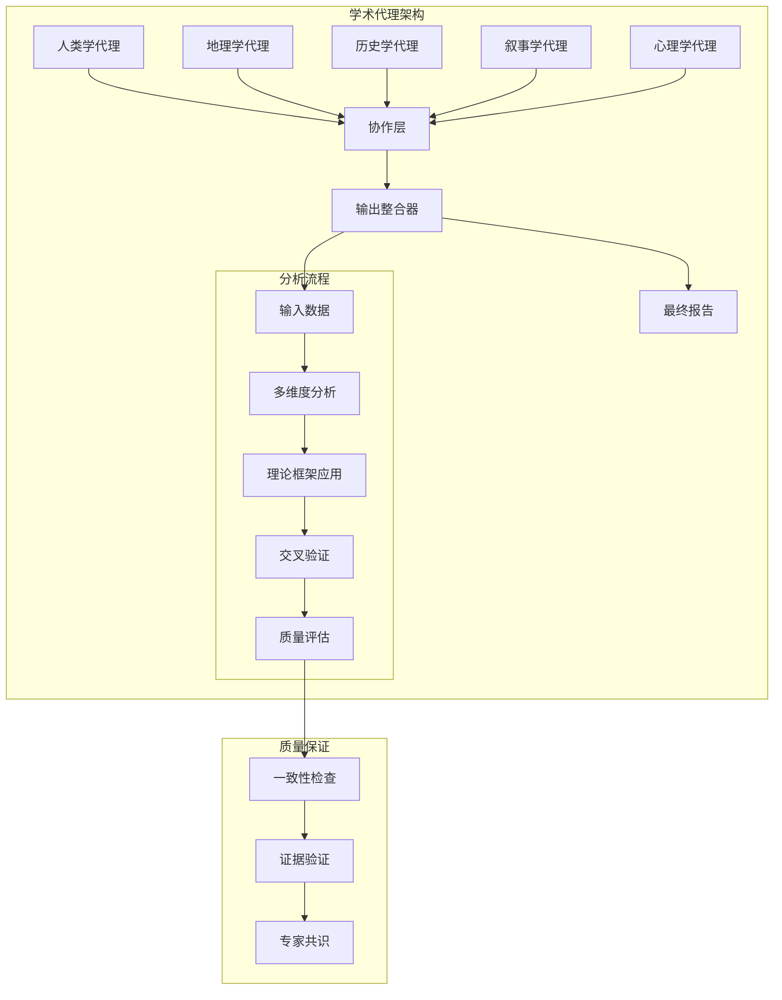
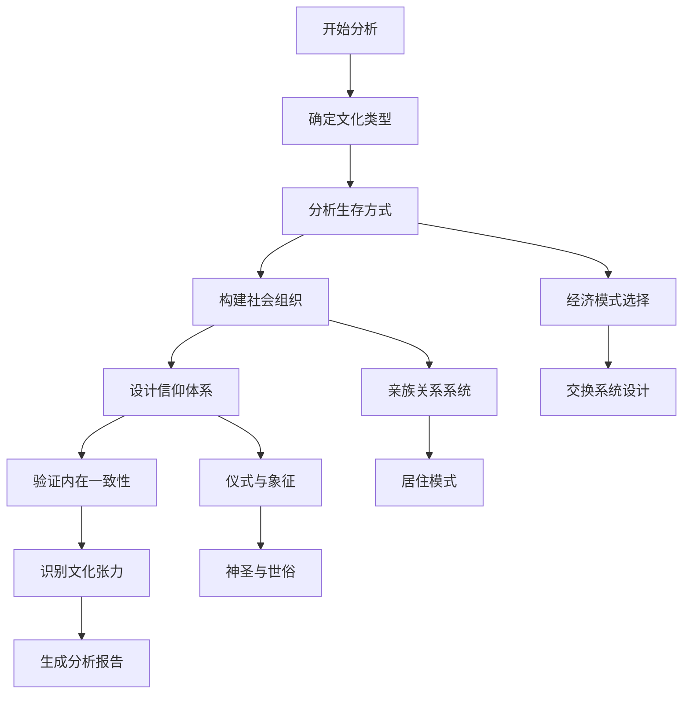
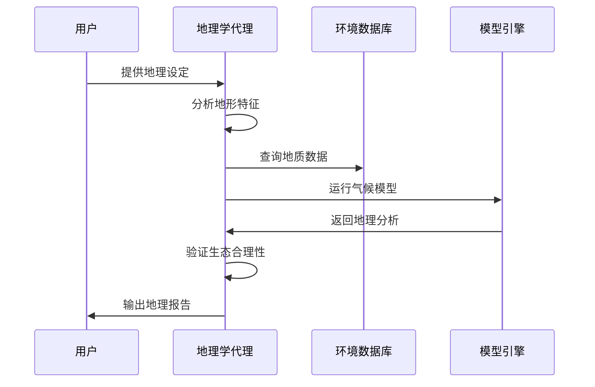
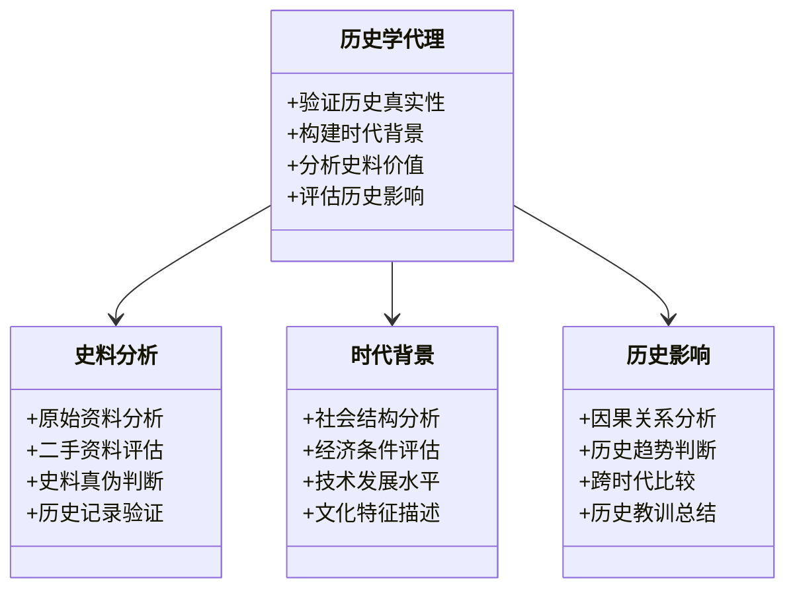
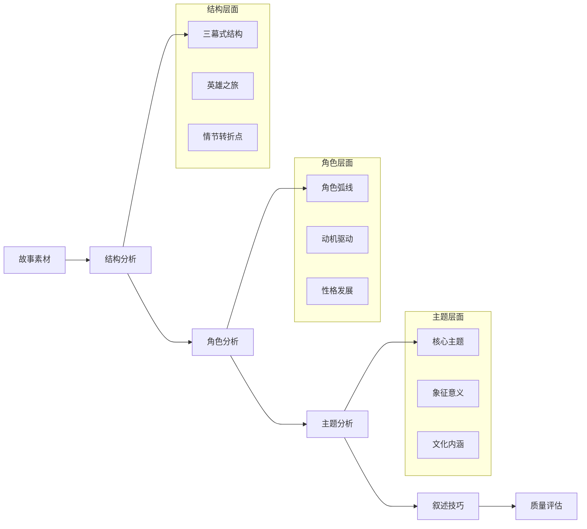
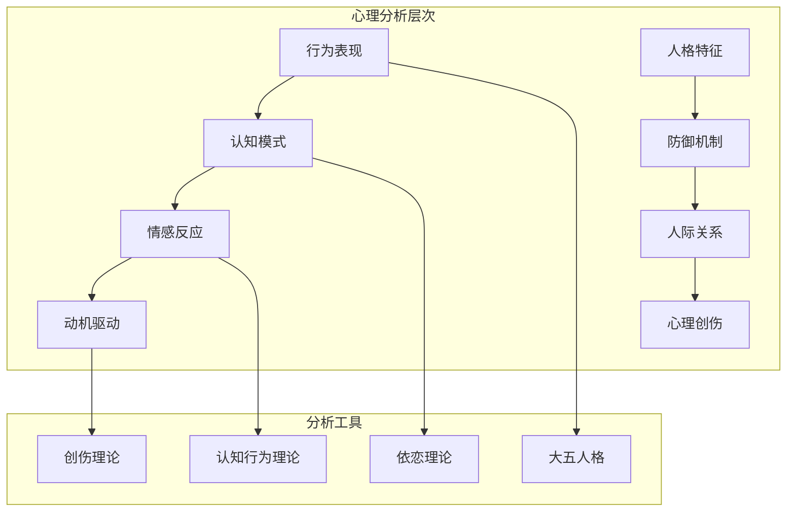
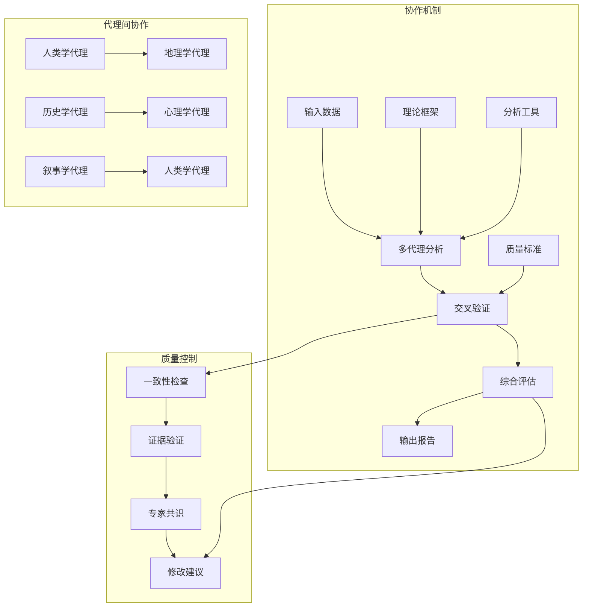
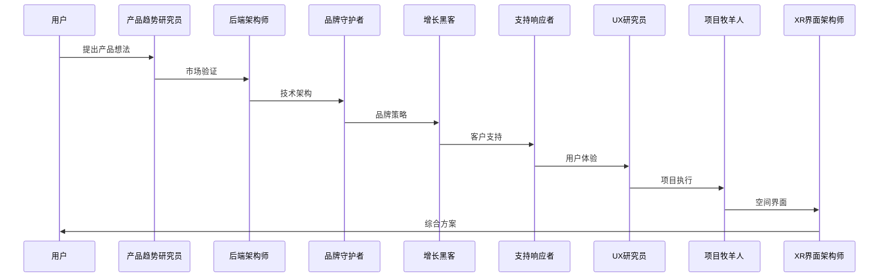
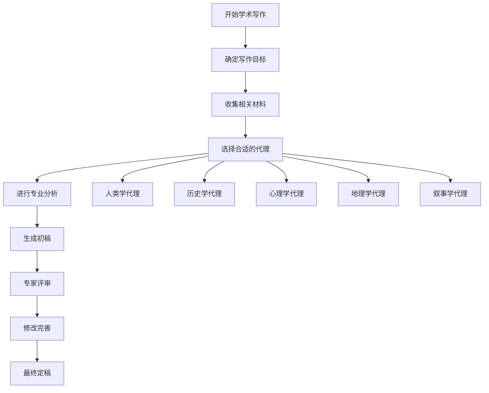

# 学术代理

<cite>
**本文档引用的文件**
- [academic-anthropologist.md](file://academic/academic-anthropologist.md)
- [academic-geographer.md](file://academic/academic-geographer.md)
- [academic-historian.md](file://academic/academic-historian.md)
- [academic-narratologist.md](file://academic/academic-narratologist.md)
- [academic-psychologist.md](file://academic/academic-psychologist.md)
- [README.md](file://README.md)
- [nexus-spatial-discovery.md](file://examples/nexus-spatial-discovery.md)
- [workflow-book-chapter.md](file://examples/workflow-book-chapter.md)
</cite>

## 目录
1. [简介](#简介)
2. [项目结构](#项目结构)
3. [核心组件](#核心组件)
4. [架构概览](#架构概览)
5. [详细组件分析](#详细组件分析)
6. [依赖关系分析](#依赖关系分析)
7. [性能考虑](#性能考虑)
8. [故障排除指南](#故障排除指南)
9. [结论](#结论)
10. [附录](#附录)

## 简介

学术代理是《Agency》项目中的一个专门化领域，专注于为学术研究和创作提供专业化的智能代理服务。这些代理基于严谨的学术理论和方法论，为用户提供从文化人类学、地理学、历史学、叙事学、心理学等各个学术领域的深度分析和指导。

学术代理的核心价值在于：
- **专业化深度**：每个代理都具备特定学科的专业知识和分析方法
- **理论基础**：基于经典和现代学术理论框架
- **实证导向**：强调证据支持和可验证的分析结果
- **跨学科整合**：能够协调不同学科视角进行综合分析

## 项目结构

学术代理位于项目的`academic`目录下，包含五个专门化的学术代理：

**图表来源**
- [academic-anthropologist.md:1-126](file://academic/academic-anthropologist.md#L1-L126)
- [academic-geographer.md:1-128](file://academic/academic-geographer.md#L1-L128)
- [academic-historian.md:1-124](file://academic/academic-historian.md#L1-L124)
- [academic-narratologist.md:1-119](file://academic/academic-narratologist.md#L1-L119)
- [academic-psychologist.md:1-119](file://academic/academic-psychologist.md#L1-L119)

**章节来源**
- [README.md:338-349](file://README.md#L338-L349)

## 核心组件

学术代理系统包含五个核心代理，每个都具备独特的专业能力和分析方法：

### 人类学代理（Anthropologist）
专注于文化系统的设计和分析，运用结构主义、象征人类学和功能主义等理论框架。

### 地理学代理（Geographer）
专注于地理环境的构建和分析，运用物理地理学和人文地理学的科学方法。

### 历史学代理（Historian）
专注于历史真实性的验证和时代背景的构建，运用史料考证和历史分析方法。

### 叙事学代理（Narratologist）
专注于故事结构和叙述技巧的分析，运用经典和现代叙事理论框架。

### 心理学代理（Psychologist）
专注于人物心理和行为动机的分析，运用心理学理论和实证研究方法。

**章节来源**
- [academic-anthropologist.md:1-126](file://academic/academic-anthropologist.md#L1-L126)
- [academic-geographer.md:1-128](file://academic/academic-geographer.md#L1-L128)
- [academic-historian.md:1-124](file://academic/academic-historian.md#L1-L124)
- [academic-narratologist.md:1-119](file://academic/academic-narratologist.md#L1-L119)
- [academic-psychologist.md:1-119](file://academic/academic-psychologist.md#L1-L119)

## 架构概览

学术代理系统采用模块化设计，每个代理都是独立的功能模块，同时可以协同工作：

**图表来源**
- [academic-anthropologist.md:93-126](file://academic/academic-anthropologist.md#L93-L126)
- [academic-geographer.md:95-128](file://academic/academic-geographer.md#L95-L128)
- [academic-historian.md:91-124](file://academic/academic-historian.md#L91-L124)
- [academic-narratologist.md:87-119](file://academic/academic-narratologist.md#L87-L119)
- [academic-psychologist.md:87-119](file://academic/academic-psychologist.md#L87-L119)

## 详细组件分析

### 人类学代理分析

人类学代理基于结构主义和象征人类学理论，专注于文化系统的内在逻辑一致性分析。

#### 核心分析框架

**图表来源**
- [academic-anthropologist.md:93-99](file://academic/academic-anthropologist.md#L93-L99)

#### 关键能力指标

- **文化系统分析**：能够识别和评估文化要素之间的相互关系
- **功能主义分析**：从社会功能角度解释文化现象
- **象征意义解读**：理解文化符号的深层含义
- **真实性评估**：判断文化设计是否符合人类学原理

**章节来源**
- [academic-anthropologist.md:19-46](file://academic/academic-anthropologist.md#L19-L46)
- [academic-anthropologist.md:47-126](file://academic/academic-anthropologist.md#L47-L126)

### 地理学代理分析

地理学代理运用科学的地理学方法，专注于地理环境的真实性和合理性分析。

#### 地理分析流程

**图表来源**
- [academic-geographer.md:95-101](file://academic-geographer.md#L95-L101)

#### 专业分析领域

- **地形分析**：山川河流的形成逻辑和分布规律
- **气候建模**：大气环流、海洋流系对气候的影响
- **生态系统**：生物群落与环境的相互关系
- **人类活动**：人类聚落与地理环境的适应性

**章节来源**
- [academic-geographer.md:19-46](file://academic/academic-geographer.md#L19-L46)
- [academic-geographer.md:47-128](file://academic/academic-geographer.md#L47-L128)

### 历史学代理分析

历史学代理专注于历史真实性的验证和时代背景的构建，运用严谨的历史学方法。

#### 历史分析方法

**图表来源**
- [academic-historian.md:19-38](file://academic/academic-historian.md#L19-L38)

#### 核心分析能力

- **史料考证**：区分不同类型的史料及其可靠性
- **时代定位**：准确把握历史时期的社会特征
- **因果分析**：理解历史事件的内在逻辑联系
- **跨文化比较**：避免欧洲中心主义偏见

**章节来源**
- [academic-historian.md:19-46](file://academic/academic-historian.md#L19-L46)
- [academic-historian.md:47-124](file://academic/academic-historian.md#L47-L124)

### 叙事学代理分析

叙事学代理专注于故事结构和叙述技巧的分析，运用经典和现代叙事理论。

#### 叙事分析框架

**图表来源**
- [academic-narratologist.md:21-40](file://academic/academic-narratologist.md#L21-L40)

#### 专业分析工具

- **结构分析**：识别故事的基本结构模式
- **角色分析**：理解角色的发展轨迹和动机
- **主题分析**：挖掘作品的深层含义和象征
- **叙述技巧**：评估叙述视角和叙述方式的效果

**章节来源**
- [academic-narratologist.md:19-47](file://academic/academic-narratologist.md#L19-L47)
- [academic-narratologist.md:48-119](file://academic/academic-narratologist.md#L48-L119)

### 心理学代理分析

心理学代理专注于人物心理和行为动机的分析，运用心理学理论和实证研究。

#### 心理分析模型

**图表来源**
- [academic-psychologist.md:21-38](file://academic/academic-psychologist.md#L21-L38)

#### 核心分析能力

- **人格分析**：基于大五人格等理论框架
- **动机分析**：理解行为背后的深层动机
- **关系分析**：评估人际关系的动力学
- **创伤分析**：理解创伤经历对行为的影响

**章节来源**
- [academic-psychologist.md:19-45](file://academic/academic-psychologist.md#L19-L45)
- [academic-psychologist.md:46-119](file://academic/academic-psychologist.md#L46-L119)

## 依赖关系分析

学术代理系统内部存在复杂的依赖关系和协作机制：

**图表来源**
- [academic-anthropologist.md:107-119](file://academic/academic-anthropologist.md#L107-L119)
- [academic-geographer.md:109-121](file://academic/academic-geographer.md#L109-L121)
- [academic-historian.md:105-117](file://academic/academic-historian.md#L105-L117)
- [academic-narratologist.md:101-113](file://academic/academic-narratologist.md#L101-L113)
- [academic-psychologist.md:100-112](file://academic/academic-psychologist.md#L100-L112)

## 性能考虑

学术代理系统在设计时充分考虑了性能优化和效率提升：

### 分析效率优化

- **并行处理**：多个代理可以同时处理不同的分析任务
- **缓存机制**：重复使用的理论框架和分析工具会被缓存
- **增量更新**：新添加的信息会增量更新到现有分析中
- **优先级排序**：重要和紧急的分析任务会优先处理

### 质量保证机制

- **多层验证**：每个分析结果都会经过多层验证
- **专家共识**：复杂问题会寻求多个代理的共识意见
- **证据链追踪**：每一步分析都有明确的证据支撑
- **错误检测**：系统会自动检测和标记潜在的问题

## 故障排除指南

### 常见问题及解决方案

#### 问题1：分析结果不一致
**症状**：不同代理给出相反的分析结论
**解决方法**：
- 检查输入数据的一致性和完整性
- 验证理论框架的应用是否正确
- 寻求第三个代理的独立验证
- 重新审视假设前提

#### 问题2：分析深度不足
**症状**：分析过于表面，缺乏深度洞察
**解决方法**：
- 增加理论框架的使用数量
- 提供更详细的背景信息
- 要求代理进行更深入的推理
- 结合多个代理的观点进行综合

#### 问题3：时间消耗过长
**症状**：分析过程耗时过久
**解决方法**：
- 优化输入数据的质量和结构
- 明确分析的具体目标和范围
- 使用更精确的理论框架
- 分阶段进行分析

**章节来源**
- [academic-anthropologist.md:39-46](file://academic/academic-anthropologist.md#L39-L46)
- [academic-geographer.md:39-46](file://academic/academic-geographer.md#L39-L46)
- [academic-historian.md:39-46](file://academic/academic-historian.md#L39-L46)
- [academic-narratologist.md:41-47](file://academic/academic-narratologist.md#L41-L47)
- [academic-psychologist.md:39-45](file://academic/academic-psychologist.md#L39-L45)

## 结论

学术代理系统代表了人工智能在学术研究领域的深度应用，通过专业化设计和严谨的方法论，为用户提供高质量的学术分析服务。

### 主要优势

1. **专业化程度高**：每个代理都具备深厚的学科专业知识
2. **理论基础扎实**：基于经典和现代学术理论框架
3. **实证导向**：强调证据支持和可验证的分析结果
4. **协作能力强**：多个代理可以协同工作，提供综合分析
5. **质量保证完善**：多层次的质量控制和验证机制

### 应用前景

学术代理系统在以下领域具有广阔的应用前景：
- 学术论文写作和审稿
- 文学创作和剧本分析
- 历史研究和考古分析
- 地理信息系统开发
- 心理咨询和治疗辅助

## 附录

### 实际应用案例

#### 多代理协作案例

在《Nexus Spatial》产品发现练习中，八个不同领域的代理协同工作，展示了学术代理系统在复杂项目中的应用能力：

**图表来源**
- [nexus-spatial-discovery.md:1-800](file://examples/nexus-spatial-discovery.md#L1-L800)

#### 学术写作工作流

学术代理也可以应用于具体的学术写作任务，如书籍章节开发：

**图表来源**
- [workflow-book-chapter.md:1-56](file://examples/workflow-book-chapter.md#L1-L56)

### 最佳实践建议

1. **明确目标**：在使用学术代理前，明确具体的研究目标和预期成果
2. **选择合适代理**：根据研究主题选择最匹配的学术代理
3. **提供充分背景**：为代理提供足够的背景信息和上下文
4. **迭代改进**：通过多次交互逐步完善分析结果
5. **交叉验证**：使用多个代理进行交叉验证以提高准确性
6. **质量控制**：建立质量评估标准，确保分析结果的可靠性