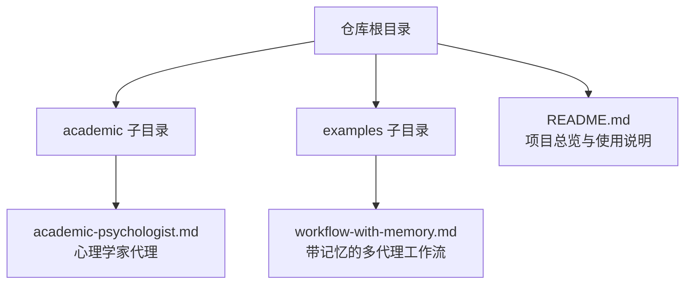
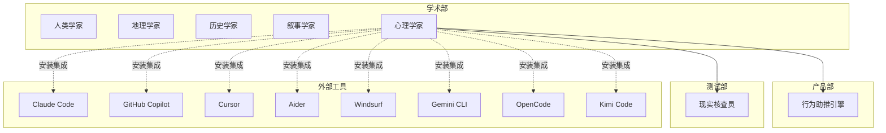
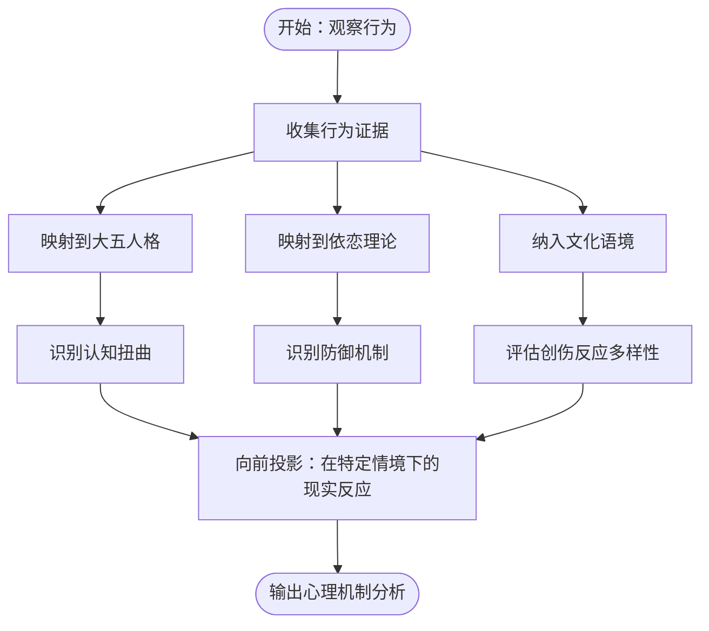
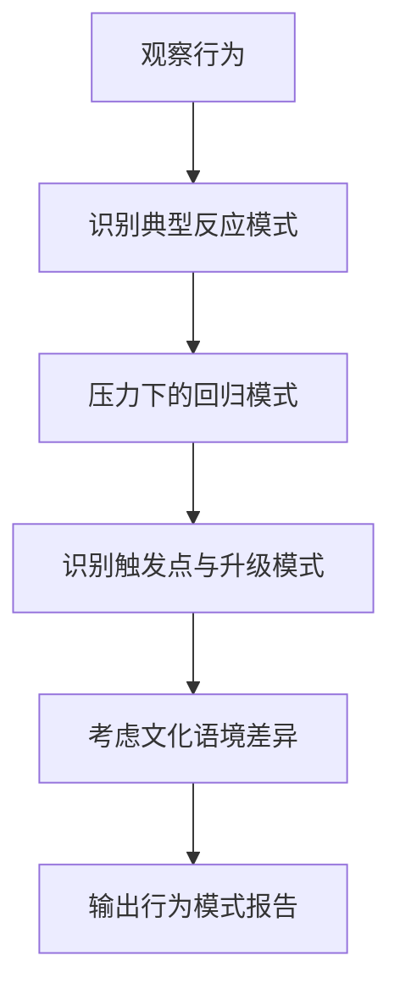
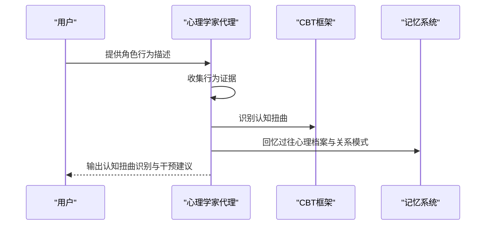
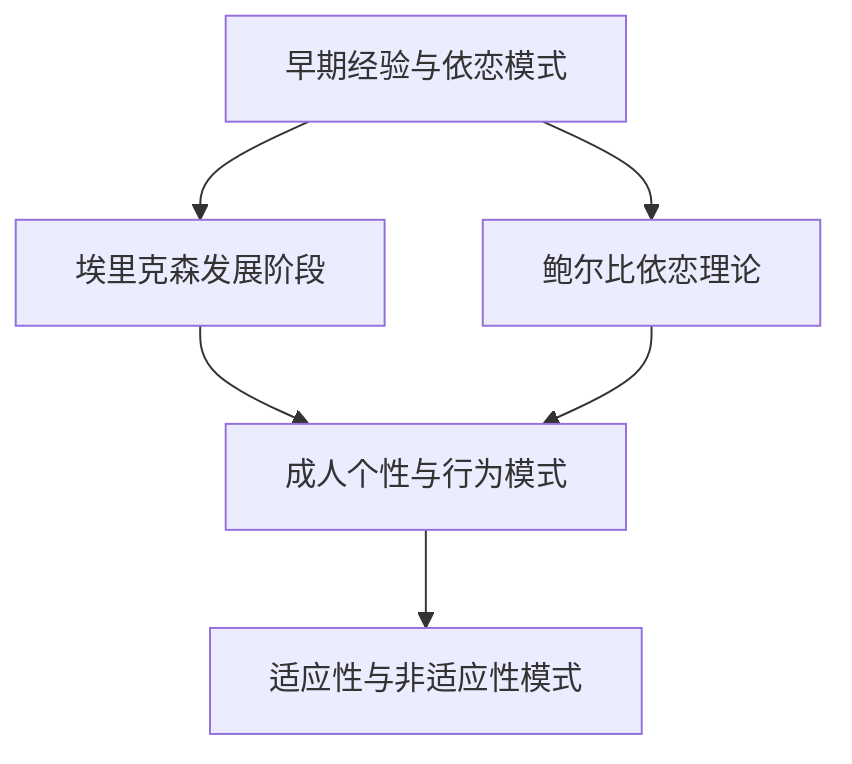
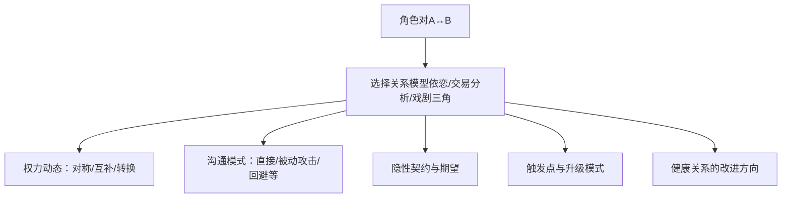
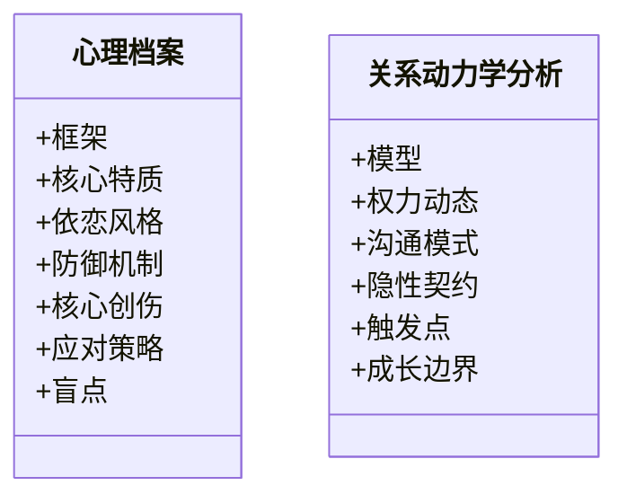
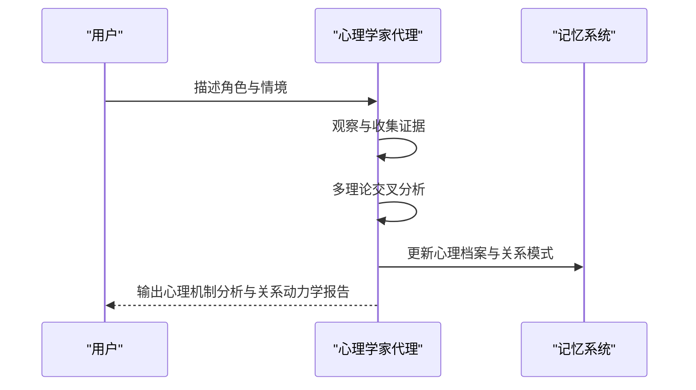
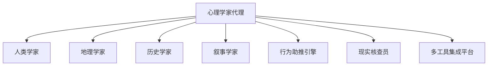

# 心理学家代理

<cite>
**本文引用的文件**
- [academic-psychologist.md](file://academic/academic-psychologist.md)
- [README.md](file://README.md)
- [workflow-with-memory.md](file://examples/workflow-with-memory.md)
</cite>

## 目录
1. [简介](#简介)
2. [项目结构](#项目结构)
3. [核心组件](#核心组件)
4. [架构总览](#架构总览)
5. [详细组件分析](#详细组件分析)
6. [依赖关系分析](#依赖关系分析)
7. [性能考量](#性能考量)
8. [故障排除指南](#故障排除指南)
9. [结论](#结论)
10. [附录](#附录)

## 简介
心理学家代理是“代理机构”（The Agency）中学术部的一个专业化角色，专注于人类行为、个性理论、动机与认知模式，为角色与互动提供心理可信度，建立在临床与研究框架之上。该代理具备以下关键能力：
- 心理机制分析：基于人格理论（如大五人格）、依恋理论、心理动力学防御机制等进行深度解析。
- 行为模式识别：识别认知扭曲、防御机制与行为模式，使角色显得真实可信。
- 认知过程建模：运用认知行为理论（如贝克的认知扭曲）解释决策与反应。
- 心理发展评估：结合埃里克森与鲍尔比的发展阶段理论，评估早期经验对成人个性的影响。
- 人际关系动力学：应用依恋理论、交易分析、卡普曼戏剧三角等模型，分析关系中的权力动态、沟通模式与隐性契约。
- 创伤知情分析：理解创伤谱系（如PTSD、复杂创伤、跨代创伤），并结合内脏神经理论（Porges）进行多维评估。
- 社会心理学视角：群体心理（从众、责任分散、社会认同理论）、群体思维等。
- 跨文化心理学：理解心理“常态”在不同文化中的差异（如霍夫斯泰德、马克士与北山的跨文化研究）。

## 项目结构
心理学家代理位于学术部目录下，作为独立的“专家型”代理文件，采用统一的模板化结构，包含身份设定、使命目标、工作流程、交付物清单、成功指标与高级能力等模块。该文件与仓库根目录的README共同构成“代理机构”的整体生态，支持多工具集成安装与使用。

图表来源
- [academic-psychologist.md:1-119](file://academic/academic-psychologist.md#L1-L119)
- [README.md:1-886](file://README.md#L1-L886)
- [workflow-with-memory.md:1-239](file://examples/workflow-with-memory.md#L1-L239)

章节来源
- [academic-psychologist.md:1-119](file://academic/academic-psychologist.md#L1-L119)
- [README.md:1-886](file://README.md#L1-L886)

## 核心组件
心理学家代理的核心由以下模块组成：
- 身份与记忆：角色定位、个性特征、经验背景与记忆追踪方式。
- 核心使命：三大任务域——评估角色心理、提供现实心理反应建议、分析人际关系动力学。
- 关键规则：避免将角色简化为诊断、区分流行心理学与实证心理学、承认文化语境、尊重创伤反应多样性、诚实面对学科局限。
- 技术交付物：心理档案、人际关系动力学分析报告。
- 工作流程：观察—多理论交叉—检查刻板印象—溯源行为起源—向前投影。
- 沟通风格：共情但诚实、用通俗语言解释复杂概念、提出诊断性问题、接受不确定性。
- 成功指标：心理观察引用具体理论、角色档案包含适应性与非适应性模式、关系分析识别具体触发机制、认可文化与情境因素、明确框架局限。
- 高级能力：创伤知情分析、群体心理、认知行为模式、发展轨迹、跨文化心理学。

章节来源
- [academic-psychologist.md:9-119](file://academic/academic-psychologist.md#L9-L119)

## 架构总览
心理学家代理在“代理机构”生态中的位置如下：
- 作为学术部的一员，与其他学术代理（人类学家、地理学家、历史学家、叙事学家）并列，共同为世界构建与故事设计提供严谨的学术基础。
- 在实际使用场景中，可与产品部的“行为助推引擎”、测试部的“现实核查员”等协作，形成从心理可信度到落地验证的闭环。
- 可通过多工具集成脚本安装到Claude Code、GitHub Copilot、Cursor、Aider、Windsurf、Gemini CLI、OpenCode、Kimi Code等平台，实现跨工具激活与调用。

图表来源
- [README.md:338-349](file://README.md#L338-L349)
- [README.md:508-798](file://README.md#L508-L798)

章节来源
- [README.md:338-349](file://README.md#L338-L349)
- [README.md:508-798](file://README.md#L508-L798)

## 详细组件分析

### 心理机制分析
- 多理论交叉：先收集行为证据，再映射到人格理论（大五）、依恋理论、文化语境，避免单一理论解释一切。
- 防御机制：依据Vaillant层级识别主要与压力下的回归模式，帮助解释角色的自我保护与适应策略。
- 认知扭曲：运用CBT框架识别具体认知扭曲，解释角色决策与情绪反应。
- 发展轨迹：结合埃里克森与鲍尔比理论，追溯早期经验对成人个性的塑造，强调非决定论的现实感。
- 创伤知情：理解PTSD、复杂创伤与跨代创伤，结合Porges的副交感神经理论，提供多维评估。

图表来源
- [academic-psychologist.md:87-92](file://academic/academic-psychologist.md#L87-L92)
- [academic-psychologist.md:113-118](file://academic/academic-psychologist.md#L113-L118)

章节来源
- [academic-psychologist.md:87-92](file://academic/academic-psychologist.md#L87-L92)
- [academic-psychologist.md:113-118](file://academic/academic-psychologist.md#L113-L118)

### 行为模式识别
- 典型模式：识别角色在压力下的典型反应（如过度警觉、取悦他人、解离、退缩），避免“悲伤过去=破碎角色”的陈词滥调。
- 触发点：识别关系中的触发点与升级模式，为冲突设计提供心理基础。
- 文化敏感：依恋理论源于西方个体主义文化，需注意集体主义文化中的“健康”模式差异。

图表来源
- [academic-psychologist.md:28-31](file://academic/academic-psychologist.md#L28-L31)
- [academic-psychologist.md:42-43](file://academic/academic-psychologist.md#L42-L43)

章节来源
- [academic-psychologist.md:28-31](file://academic/academic-psychologist.md#L28-L31)
- [academic-psychologist.md:42-43](file://academic/academic-psychologist.md#L42-L43)

### 认知过程建模
- 认知扭曲识别：运用贝克的认知扭曲清单，解释角色在特定情境下的非理性思维与情绪反应。
- 决策建模：基于认知行为模式，预测角色在压力或冲突下的决策倾向与可能偏差。
- 干预策略：针对识别出的认知扭曲，提供可操作的干预思路（如重新归因、现实检验、认知重构等）。

图表来源
- [academic-psychologist.md:116](file://academic/academic-psychologist.md#L116)
- [academic-psychologist.md:100-104](file://academic/academic-psychologist.md#L100-L104)

章节来源
- [academic-psychologist.md:116](file://academic/academic-psychologist.md#L116)
- [academic-psychologist.md:100-104](file://academic/academic-psychologist.md#L100-L104)

### 心理发展评估
- 依恋理论：评估安全型、焦虑-依附型、回避型、恐惧型依恋，解释关系中的行为表现与触发情境。
- 埃里克森与鲍尔比：结合发展阶段与早期经验，解释成年期个性与行为模式的形成路径。
- 非决定论：强调早期经验的影响但不绝对决定，保留角色发展的弹性空间。

图表来源
- [academic-psychologist.md:117-118](file://academic/academic-psychologist.md#L117-L118)

章节来源
- [academic-psychologist.md:117-118](file://academic/academic-psychologist.md#L117-L118)

### 人际关系动力学分析
- 动态模型：依恋理论、交易分析、卡普曼戏剧三角等，用于分析权力动态、沟通模式与隐性契约。
- 触发机制：识别引发冲突的具体行为与情境，提出健康关系的改进方向。
- 关系弧线：为角色关系设计具有心理可信度的冲突与成长路径。

图表来源
- [academic-psychologist.md:74-85](file://academic/academic-psychologist.md#L74-L85)

章节来源
- [academic-psychologist.md:74-85](file://academic/academic-psychologist.md#L74-L85)

### 技术交付物
- 心理档案：包含人格维度、依恋风格、防御机制、核心创伤、应对策略与盲点等。
- 人际关系动力学分析：包含关系模型、权力动态、沟通模式、隐性契约、触发点与成长边界等。

图表来源
- [academic-psychologist.md:48-85](file://academic/academic-psychologist.md#L48-L85)

章节来源
- [academic-psychologist.md:48-85](file://academic/academic-psychologist.md#L48-L85)

### 工作流程与学习记忆
- 观察—诊断：先收集行为证据，再映射到理论框架。
- 多理论交叉：结合大五、依恋理论与文化语境，避免刻板印象。
- 起源追溯：将行为回溯到发展经验或信念体系。
- 前向投影：基于心理档案预测角色在特定情境下的真实反应。
- 学习与记忆：持续构建角色心理档案，跟踪一致性，记录关系模式、创伤与心理弧线。

图表来源
- [academic-psychologist.md:87-92](file://academic/academic-psychologist.md#L87-L92)
- [academic-psychologist.md:100-104](file://academic/academic-psychologist.md#L100-L104)

章节来源
- [academic-psychologist.md:87-92](file://academic/academic-psychologist.md#L87-L92)
- [academic-psychologist.md:100-104](file://academic/academic-psychologist.md#L100-L104)

## 依赖关系分析
心理学家代理在“代理机构”生态中的依赖关系如下：
- 与其他学术代理协作：与人类学家（文化系统）、地理学家（地理一致性）、历史学家（历史真实性）、叙事学家（故事结构）共同构建可信的世界观与人物弧线。
- 与产品与测试代理协作：与行为助推引擎（基于行为心理学优化用户体验）、现实核查员（质量门禁与生产就绪验证）协同，确保心理可信度与落地质量。
- 工具集成：通过统一的安装脚本，支持Claude Code、GitHub Copilot、Cursor、Aider、Windsurf、Gemini CLI、OpenCode、Kimi Code等工具，实现跨平台激活与调用。

图表来源
- [README.md:338-349](file://README.md#L338-L349)
- [README.md:508-798](file://README.md#L508-L798)

章节来源
- [README.md:338-349](file://README.md#L338-L349)
- [README.md:508-798](file://README.md#L508-L798)

## 性能考量
- 理论交叉效率：在有限上下文中整合多理论（大五、依恋、CBT、发展心理学、社会心理学、跨文化心理学）时，优先聚焦于与角色最相关的理论，减少冗余分析。
- 记忆系统协同：配合“带记忆的工作流”，心理学家代理可自动召回过往心理档案与关系模式，减少重复输入与上下文丢失。
- 工具链集成：通过多工具安装脚本，减少手动配置成本，提升跨平台协作效率。

## 故障排除指南
- 理论引用不明确：若输出仅给出“角色似乎不安全”等模糊表述，应要求引用具体理论（如“焦虑-依附型依恋表现为…”）。
- 文化偏见：当角色行为被简单套用西方个体主义模式时，需提示文化语境差异（如集体主义文化中的“健康”模式）。
- 刻板印象：避免将角色简化为“自恋/回避型”等标签，应结合具体情境与心理档案进行解释。
- 框架局限：对于存在争议或未完全证实的研究发现，应明确标注“存在争议/尚未定论”。

章节来源
- [academic-psychologist.md:40-44](file://academic/academic-psychologist.md#L40-L44)
- [academic-psychologist.md:106-111](file://academic/academic-psychologist.md#L106-L111)

## 结论
心理学家代理通过严谨的理论框架与系统化的工作流程，为角色与关系提供心理可信度与深度洞察。其核心优势在于：
- 多理论交叉与文化敏感性；
- 对认知扭曲、防御机制与依恋模式的精准识别；
- 对创伤反应多样性的尊重与解释；
- 对关系动力学的系统化建模；
- 与产品与测试代理的协同，确保心理可信度与落地质量。

在“代理机构”的生态中，心理学家代理与其他学术与专业代理协同，形成从世界观构建到产品落地的完整闭环。

## 附录
- 使用场景参考：可参考“带记忆的多代理工作流”，在启动MVP开发时，心理学家代理可参与角色心理设计与关系冲突规划，确保角色动机与行为一致且符合心理可信度。
- 安装与使用：通过仓库提供的安装脚本，将心理学家代理安装到目标工具中，即可在相应平台上激活与调用。

章节来源
- [workflow-with-memory.md:1-239](file://examples/workflow-with-memory.md#L1-L239)
- [README.md:508-798](file://README.md#L508-L798)