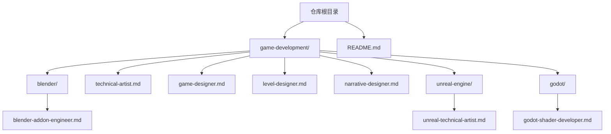
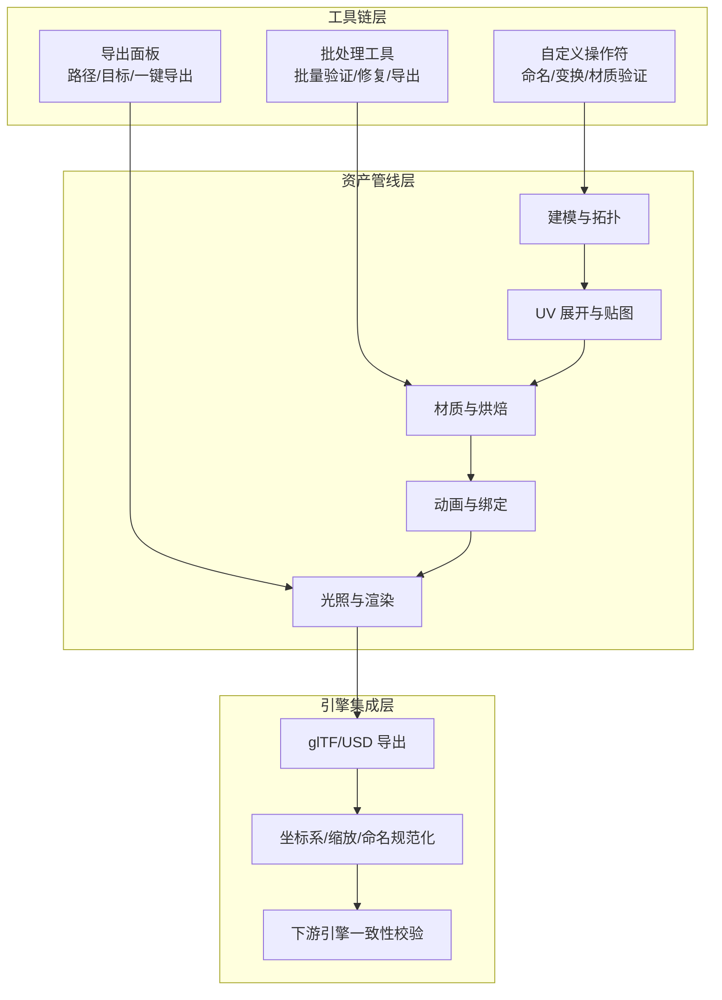
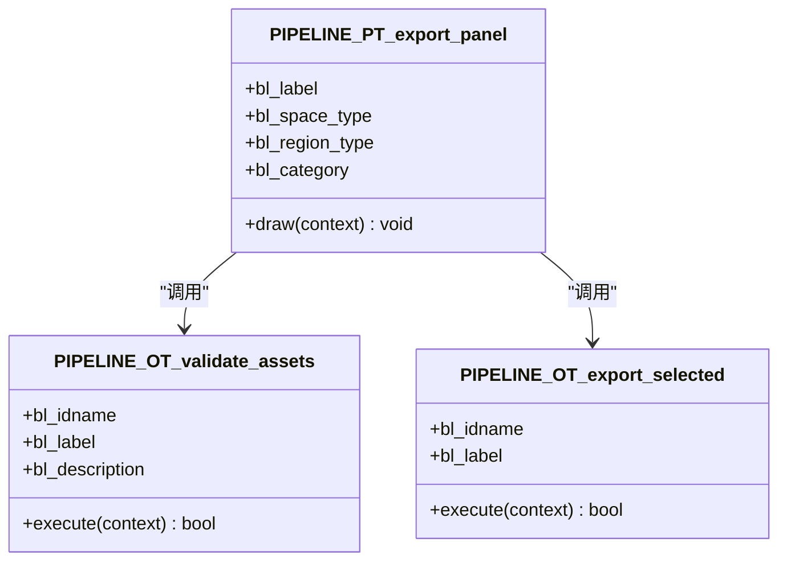
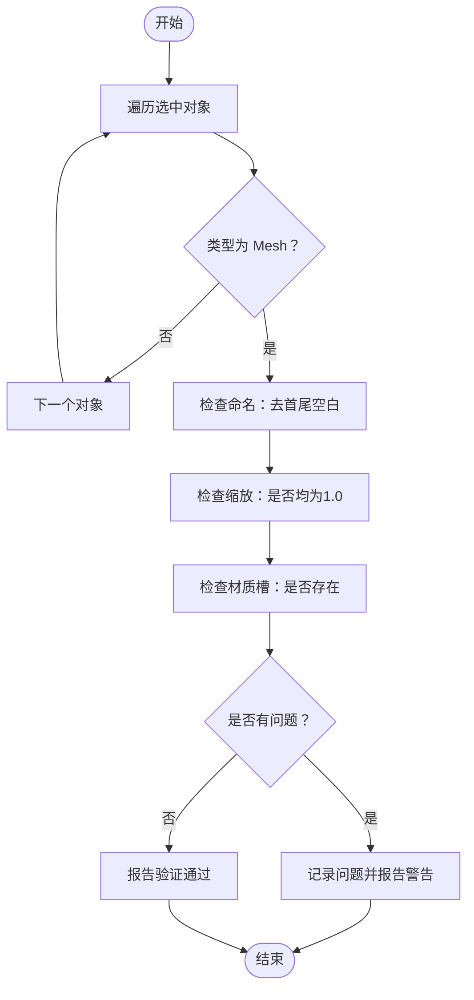
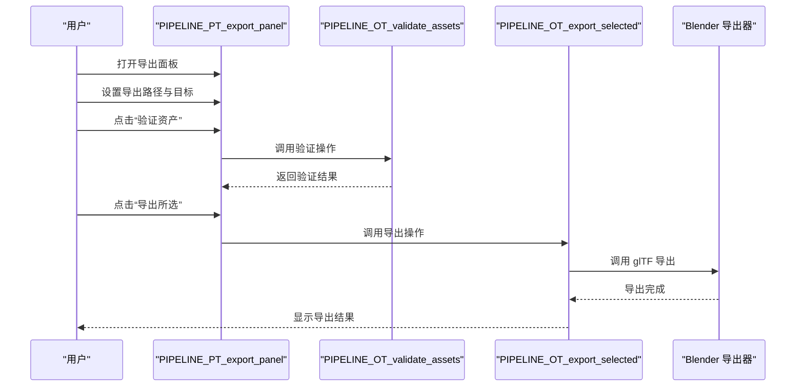
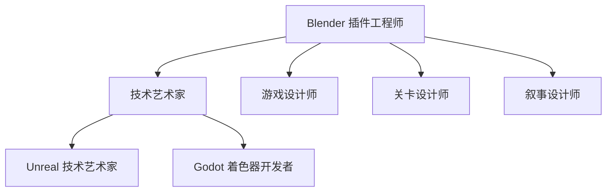

# Blender 3D 开发代理

<cite>
**本文档引用的文件**
- [blender-addon-engineer.md](file://game-development/blender/blender-addon-engineer.md)
- [README.md](file://README.md)
- [technical-artist.md](file://game-development/technical-artist.md)
- [game-designer.md](file://game-development/game-designer.md)
- [level-designer.md](file://game-development/level-designer.md)
- [narrative-designer.md](file://game-development/narrative-designer.md)
- [unreal-technical-artist.md](file://game-development/unreal-engine/unreal-technical-artist.md)
- [godot-shader-developer.md](file://game-development/godot/godot-shader-developer.md)
</cite>

## 目录
1. [简介](#简介)
2. [项目结构](#项目结构)
3. [核心组件](#核心组件)
4. [架构总览](#架构总览)
5. [详细组件分析](#详细组件分析)
6. [依赖关系分析](#依赖关系分析)
7. [性能考量](#性能考量)
8. [故障排除指南](#故障排除指南)
9. [结论](#结论)
10. [附录](#附录)

## 简介
本文件面向 Blender 3D 开发代理，系统化梳理 Blender 插件工程师的专业能力与工作流，覆盖 Python 插件开发、3D 资源制作、动画绑定、材质烘焙、UI 自定义、渲染系统、雕刻工具、粒子系统等关键领域，并结合游戏资产制作的完整流程（建模、UV 展开、材质制作、动画绑定、光照设置）进行深入说明。同时，结合仓库中技术艺术家、游戏设计师、叙事设计师等角色的工程化方法论，形成从创意到交付的一体化工作流，帮助在现代游戏开发中高效落地 Blender 工具链与管线。

## 项目结构
该仓库以“代理”为核心组织方式，每个代理文件包含身份设定、使命目标、规则约束、技术交付物、工作流程与成功度量标准。Blender 相关内容集中在 game-development/blender 目录下，技术艺术家、游戏设计师、叙事设计师等角色提供了跨引擎的通用方法论，可直接映射到 Blender 的 DCC 流程中。

图表来源
- [README.md:324-328](file://README.md#L324-L328)
- [blender-addon-engineer.md:1-235](file://game-development/blender/blender-addon-engineer.md#L1-L235)

章节来源
- [README.md:324-328](file://README.md#L324-L328)
- [blender-addon-engineer.md:1-235](file://game-development/blender/blender-addon-engineer.md#L1-L235)

## 核心组件
- Blender 插件工程师：专注于构建 Python 插件、资产验证器、导出器与管线自动化，将重复性 DCC 工作转化为可靠的“一键式”工作流。
- 技术艺术家：负责艺术与引擎之间的桥梁，制定着色器、VFX、LOD 管线与性能预算，确保视觉质量在运行时预算内稳定交付。
- 游戏设计师：系统与机制架构师，设计可实现、可平衡的游戏玩法循环与经济系统。
- 关卡设计师：空间叙事与节奏专家，通过布局理论、节奏架构、遭遇设计与环境叙事打造沉浸体验。
- 叙事设计师：故事系统与对话架构师，将叙事与玩法无缝融合，设计分支、世界架构与环境叙事。

章节来源
- [blender-addon-engineer.md:9-27](file://game-development/blender/blender-addon-engineer.md#L9-L27)
- [technical-artist.md:9-27](file://game-development/technical-artist.md#L9-L27)
- [game-designer.md:9-27](file://game-development/game-designer.md#L9-L27)
- [level-designer.md:9-27](file://game-development/level-designer.md#L9-L27)
- [narrative-designer.md:9-27](file://game-development/narrative-designer.md#L9-L27)

## 架构总览
Blender 开发代理的架构围绕“工具链 + 资产管线 + 引擎集成”的三层体系展开：
- 工具链层：基于 bpy 的 Python 插件，提供自定义操作符、面板、验证器与导出器，标准化命名、变换、材质槽等规范。
- 资产管线层：结合技术艺术家的预算与标准，完成建模、UV、材质、动画、光照等环节的质量控制与性能优化。
- 引擎集成层：通过统一的导出预设与跨工具手递手协议，保证资产在 Unity、Unreal、glTF/USD 等下游工具链中的稳定性。

图表来源
- [blender-addon-engineer.md:56-124](file://game-development/blender/blender-addon-engineer.md#L56-L124)
- [technical-artist.md:52-85](file://game-development/technical-artist.md#L52-L85)

## 详细组件分析

### 组件一：Blender 插件工程师（Python + bpy）
职责与能力边界
- 建立 Blender 原生工具：自定义操作符、面板、验证器、导入/导出自动化与资产管线助手。
- 遵循 API 规范：优先使用数据 API 访问，避免脆弱的上下文依赖；失败需给出可操作错误信息；支持开发期重载。
- 非破坏性工作流：在未明确确认或 Dry-run 模式下不进行破坏性重命名、删除、应用变换或合并数据。
- 管线可靠性：命名约定确定且可文档化；变换验证分别检查位置、旋转、缩放；材料槽顺序在下游依赖索引时必须验证。
- 可维护性：清晰的属性组、操作边界与注册结构；持久化设置通过 AddonPreferences、场景属性或显式配置保存。

技术交付物
- 资产验证器操作符：检查命名、变换、材质槽，输出问题清单并在控制台打印。
- 导出预设面板：暴露导出路径、目标平台、一键验证与导出按钮。
- 命名审计报告模板：结构化报告，包含统计摘要、错误与警告条目及建议修复。

图表来源
- [blender-addon-engineer.md:60-124](file://game-development/blender/blender-addon-engineer.md#L60-L124)

章节来源
- [blender-addon-engineer.md:28-53](file://game-development/blender/blender-addon-engineer.md#L28-L53)
- [blender-addon-engineer.md:56-124](file://game-development/blender/blender-addon-engineer.md#L56-L124)
- [blender-addon-engineer.md:126-167](file://game-development/blender/blender-addon-engineer.md#L126-L167)

### 组件二：资产验证与命名审计（流程）
验证流程要点
- 输入：选中对象集合（仅 Mesh 类型）。
- 检查项：去除首尾空白的命名、未应用缩放、缺少材质槽。
- 输出：问题列表与系统控制台日志；通过后返回成功状态。

命名审计报告
- 结构化输出：分为“通过”与“问题”两类，便于生成报告与后续修复。

图表来源
- [blender-addon-engineer.md:65-87](file://game-development/blender/blender-addon-engineer.md#L65-L87)
- [blender-addon-engineer.md:128-137](file://game-development/blender/blender-addon-engineer.md#L128-L137)

章节来源
- [blender-addon-engineer.md:65-87](file://game-development/blender/blender-addon-engineer.md#L65-L87)
- [blender-addon-engineer.md:128-137](file://game-development/blender/blender-addon-engineer.md#L128-L137)

### 组件三：导出面板与一键导出（流程）
导出流程要点
- 面板：在 3D View UI 中添加“Pipeline Export”面板，暴露导出路径与目标平台。
- 操作：一键执行验证与导出，使用 glTF 导出器并开启应用变换、纹理坐标与法线导出。

图表来源
- [blender-addon-engineer.md:92-124](file://game-development/blender/blender-addon-engineer.md#L92-L124)

章节来源
- [blender-addon-engineer.md:92-124](file://game-development/blender/blender-addon-engineer.md#L92-L124)

### 组件四：技术艺术家方法论（跨引擎映射到 Blender）
技术艺术家的核心职责与标准
- 性能预算：每类资产有明确预算（多边形、贴图分辨率、绘制调用），在生产前告知而非事后修正。
- 着色器标准：所有自定义着色器必须包含移动端安全变体或明确标注平台限制；复杂度需经可视化分析器验证。
- 纹理管线：按源分辨率导入，平台特定覆盖降采样；UI 小图采用图集减少绘制调用。
- 资产交接协议：艺术家收到资产规格表；在目标光照下审查；导入即拦截错误（UV、枢轴、非流形）。

章节来源
- [technical-artist.md:28-51](file://game-development/technical-artist.md#L28-L51)
- [technical-artist.md:52-85](file://game-development/technical-artist.md#L52-L85)

### 组件五：游戏设计师方法论（流程与文档）
游戏设计师的设计文档与平衡流程
- 设计文档：明确机制目的、玩家体验目标、输入/输出、边缘情况与失败状态；经济变量需有理由。
- 玩家优先：从玩家动机出发设计，避免无意义复杂度。
- 平衡过程：数值从假设开始，标记占位符；构建调优表格，定义“崩坏”标准。

章节来源
- [game-designer.md:28-44](file://game-development/game-designer.md#L28-L44)
- [game-designer.md:47-101](file://game-development/game-designer.md#L47-L101)

### 组件六：关卡设计师方法论（空间叙事与节奏）
关卡设计师的空间架构与可读性标准
- 流与可读性：关键路径必须视觉清晰；使用光照、色彩与几何引导注意力；每个交叉口提供明确主路径与可选奖励路径。
- 遭遇设计：每场战斗必须有入口读取时间、多种战术选择与后备位置；难度优先由空间决定。
- 环境叙事：每个区域通过道具放置、光照与几何讲述故事；破坏、磨损与环境细节需与世界历史一致。

章节来源
- [level-designer.md:28-50](file://game-development/level-designer.md#L28-L50)
- [level-designer.md:51-137](file://game-development/level-designer.md#L51-L137)

### 组件七：叙事设计师方法论（分支与世界架构）
叙事设计师的故事系统与分支设计
- 对话写作：每句必须通过“真实人物会这么说”测试；避免“如你所知”式解释；每个节点有明确戏剧功能。
- 分支设计：选择必须在种类上不同；所有分支必须收敛；后果设计让玩家能感受到结果。
- 世界架构：层级化隐藏信息；保持世界圣经一致性；环境叙事与对话/过场不矛盾。

章节来源
- [narrative-designer.md:28-52](file://game-development/narrative-designer.md#L28-L52)
- [narrative-designer.md:53-174](file://game-development/narrative-designer.md#L53-L174)

### 组件八：跨引擎着色器与 VFX 实践（参考）
- Unreal 技术艺术家：材料函数（三平面投影）、Niagara 地面冲击爆发系统、PCG 高级模式。
- Godot 着色器开发者：CanvasItem/3D 着色器、VisualShader 图、CompositorEffect 全屏后处理、RenderingDevice 计算着色器。

章节来源
- [unreal-technical-artist.md:55-106](file://game-development/unreal-engine/unreal-technical-artist.md#L55-L106)
- [unreal-technical-artist.md:252-257](file://game-development/unreal-engine/unreal-technical-artist.md#L252-L257)
- [godot-shader-developer.md:83-144](file://game-development/godot/godot-shader-developer.md#L83-L144)

## 依赖关系分析
Blender 开发代理与其他角色的协作关系如下：
- Blender 插件工程师依赖技术艺术家的预算与标准，确保导出资产满足引擎要求。
- 关卡/叙事设计师的文档与流程为 Blender 资产的创意与结构提供依据。
- 跨引擎实践（Unreal、Godot）的方法论为 Blender 的材质、VFX、后处理提供参考与迁移策略。

图表来源
- [blender-addon-engineer.md:13-17](file://game-development/blender/blender-addon-engineer.md#L13-L17)
- [technical-artist.md:13-17](file://game-development/technical-artist.md#L13-L17)
- [unreal-technical-artist.md:13-17](file://game-development/unreal-engine/unreal-technical-artist.md#L13-L17)
- [godot-shader-developer.md:13-17](file://game-development/godot/godot-shader-developer.md#L13-L17)

章节来源
- [blender-addon-engineer.md:13-17](file://game-development/blender/blender-addon-engineer.md#L13-L17)
- [technical-artist.md:13-17](file://game-development/technical-artist.md#L13-L17)
- [unreal-technical-artist.md:13-17](file://game-development/unreal-engine/unreal-technical-artist.md#L13-L17)
- [godot-shader-developer.md:13-17](file://game-development/godot/godot-shader-developer.md#L13-L17)

## 性能考量
- 在 Blender 中遵循非破坏性工作流：验证工具先报告再自动修复；批处理工具记录变更；导出器保留源场景状态。
- 材质与纹理：按源分辨率导入，平台特定降采样；UI 小图采用图集；移动端优先使用 ASTC/BC 压缩。
- 着色器复杂度：在目标硬件上进行性能分析，避免过度像素运算；参数化暴露给艺术家时提供提示与范围。
- LOD 与剔除：手动 LOD 链与可见距离体积配置，确保开放世界场景的可扩展性。

章节来源
- [blender-addon-engineer.md:36-41](file://game-development/blender/blender-addon-engineer.md#L36-L41)
- [technical-artist.md:30-46](file://game-development/technical-artist.md#L30-L46)
- [unreal-technical-artist.md:48-52](file://game-development/unreal-engine/unreal-technical-artist.md#L48-L52)

## 故障排除指南
常见问题与处理建议
- 导出失败或引擎侧报错：优先检查命名（空格、重复后缀）、未应用缩放、材质槽缺失；使用验证器先行扫描。
- 坐标系/缩放不一致：在导出前统一命名约定与坐标系假设，必要时在导出预设中规范化。
- 材质槽顺序问题：当下游工具依赖槽索引时，必须在导出前验证顺序一致性。
- 批处理工具未生效：确认日志输出与可取消进度反馈；避免“静默成功”。

章节来源
- [blender-addon-engineer.md:42-53](file://game-development/blender/blender-addon-engineer.md#L42-L53)
- [blender-addon-engineer.md:145-167](file://game-development/blender/blender-addon-engineer.md#L145-L167)

## 结论
Blender 3D 开发代理通过 Python 插件与标准化管线，将重复性 DCC 工作转化为可靠的一键式工具，配合技术艺术家的预算与标准、游戏设计师的系统设计、关卡与叙事设计师的空间与故事架构，形成从创意到交付的闭环。在现代游戏开发中，Blender 不仅是创意工具，更是跨引擎资产交付的关键枢纽。

## 附录

### 游戏资产制作流程（Blender → 引擎）
- 建模与拓扑：遵循技术艺术家预算，控制多边形与绘制调用。
- UV 展开与贴图：按源分辨率导入，平台特定降采样；小图采用图集。
- 材质与烘焙：使用三平面投影等材料函数，确保移动端兼容；参数化暴露给艺术家。
- 动画与绑定：在 Blender 中完成绑定与动画，导出时应用变换并保留骨骼层级。
- 光照与渲染：在目标光照下审查资产，导出时启用法线与纹理坐标。
- 导出与手递手：统一 glTF/USD 导出预设，规范化命名与坐标系，生成下游导入说明。

章节来源
- [technical-artist.md:52-85](file://game-development/technical-artist.md#L52-L85)
- [unreal-technical-artist.md:55-73](file://game-development/unreal-engine/unreal-technical-artist.md#L55-L73)
- [blender-addon-engineer.md:92-124](file://game-development/blender/blender-addon-engineer.md#L92-L124)