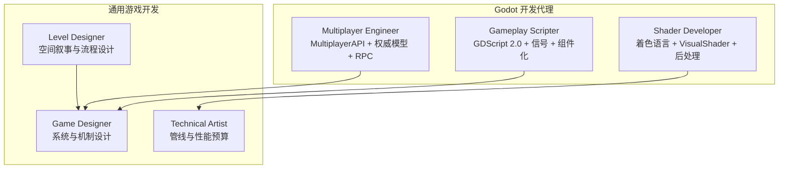
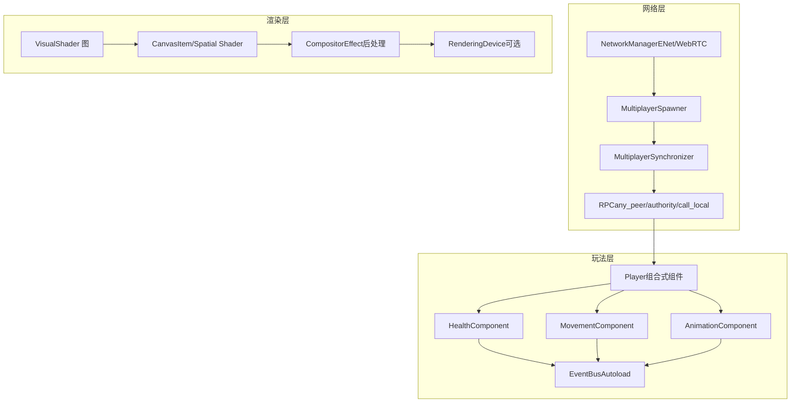
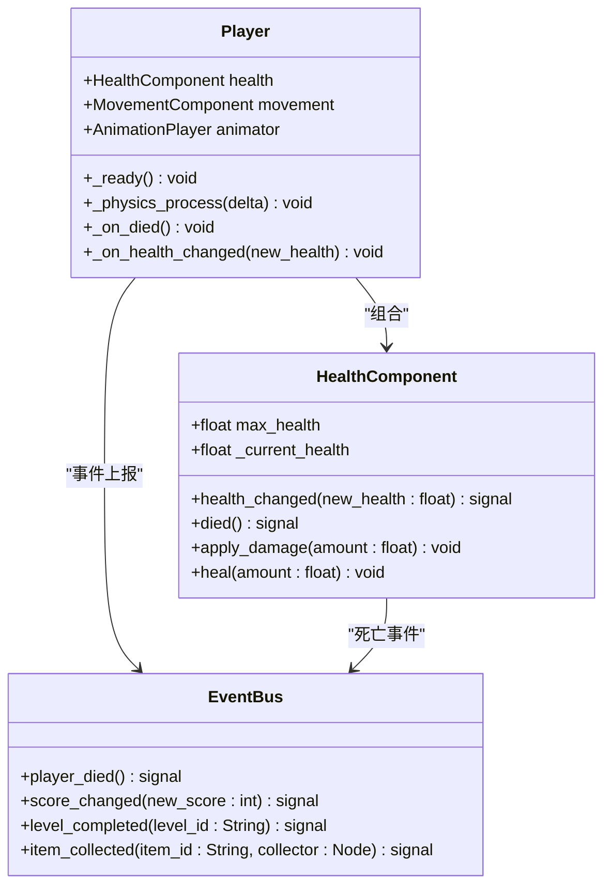
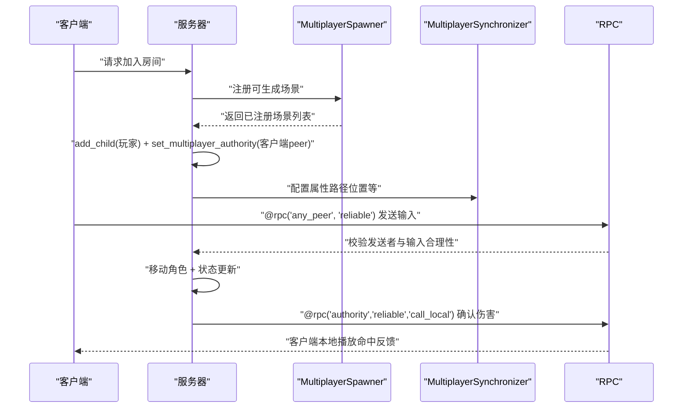
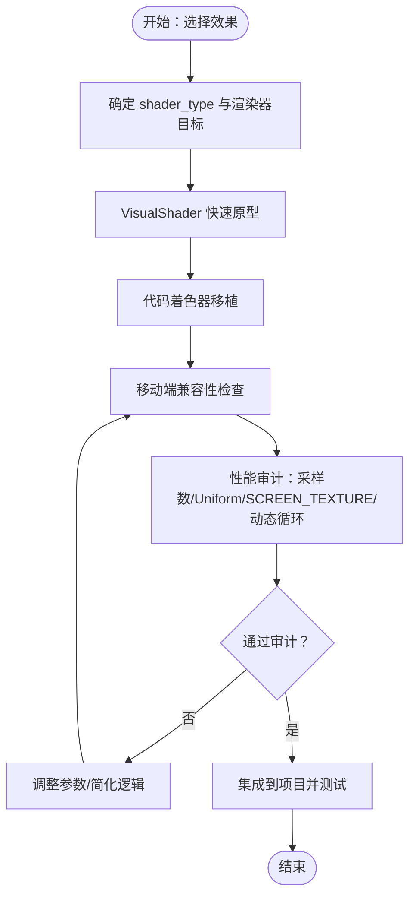
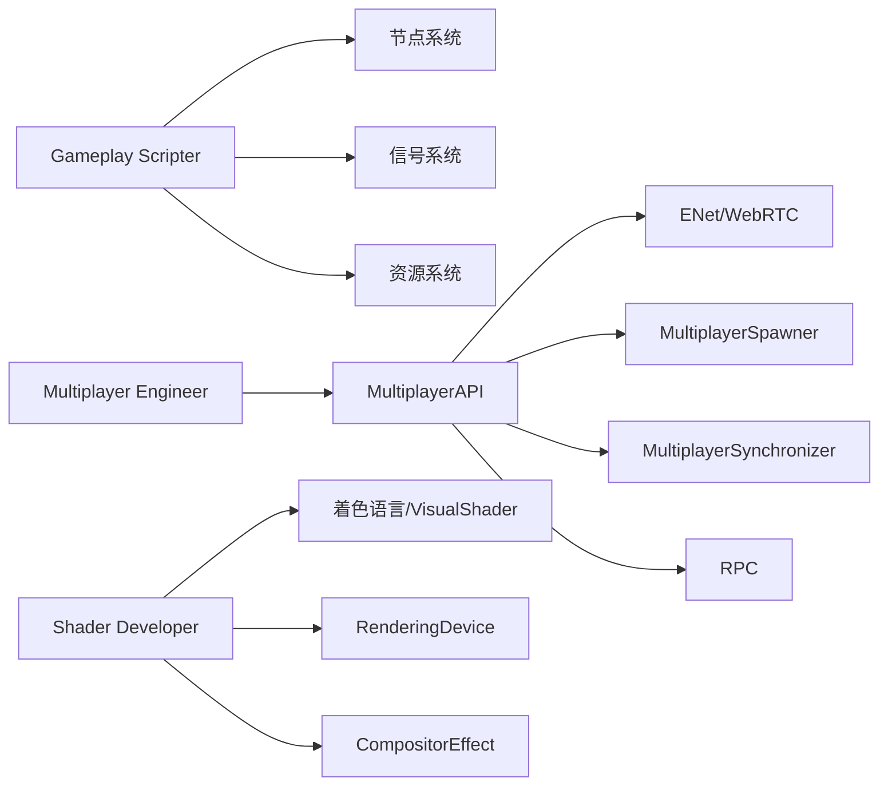

# Godot 游戏开发代理

<cite>
**本文档引用的文件**
- [godot-gameplay-scripter.md](file://game-development/godot/godot-gameplay-scripter.md)
- [godot-multiplayer-engineer.md](file://game-development/godot/godot-multiplayer-engineer.md)
- [godot-shader-developer.md](file://game-development/godot/godot-shader-developer.md)
- [README.md](file://README.md)
- [game-designer.md](file://game-development/game-designer.md)
- [technical-artist.md](file://game-development/technical-artist.md)
- [level-designer.md](file://game-development/level-designer.md)
</cite>

## 目录
1. [简介](#简介)
2. [项目结构](#项目结构)
3. [核心组件](#核心组件)
4. [架构总览](#架构总览)
5. [详细组件分析](#详细组件分析)
6. [依赖关系分析](#依赖关系分析)
7. [性能考量](#性能考量)
8. [故障排查指南](#故障排查指南)
9. [结论](#结论)
10. [附录](#附录)

## 简介
本文件面向 Godot 游戏开发代理，系统化梳理 2D/3D 游戏玩法脚手架、多人游戏网络编程、着色器效果实现三大能力域，并深入说明 Godot 引擎的节点系统、信号系统、GDScript 语言特性、内置物理引擎、TileMap 系统等核心功能。同时提供轻量级游戏开发的最佳实践、内存管理优化、导出配置与跨平台发布流程，以及 Godot 4.x 的新特性与性能改进要点。文档以可执行的代理工作流为线索，辅以可视化图示，帮助非技术读者也能理解关键设计决策与工程实践。

## 项目结构
The Agency 提供多引擎、多职能的 AI 专家代理集合，其中 Godot 分部包含三类专业代理：
- Gameplay Scripter：专注 GDScript 2.0、信号驱动、组件化场景架构与静态类型安全
- Multiplayer Engineer：专注 MultiplayerAPI、场景复制、权威模型与 RPC 安全
- Shader Developer：专注 Godot 着色语言、VisualShader、后处理与渲染性能

图表来源
- [README.md:316-323](file://README.md#L316-L323)

章节来源
- [README.md:316-323](file://README.md#L316-L323)

## 核心组件
本节从三个维度概述 Godot 代理的核心职责与交付物。

- Gameplay Scripter（玩法脚手架）
  - 以“一切皆节点”的哲学进行场景组合，强调信号完整性与静态类型安全
  - 使用 Autoload 构建全局事件总线，避免全局状态滥用
  - 支持 GDScript 与 C# 的互操作，按需引入 .NET 性能与库能力
  - 关键交付：Typed Signal 声明、EventBus Autoload、Composition-Based Player、资源型数据对象、Typed Array 与安全节点访问模式、GDScript/C# 信号连接

- Multiplayer Engineer（多人网络）
  - 基于 MultiplayerAPI 的权威模型，正确设置 set_multiplayer_authority
  - 使用 MultiplayerSpawner 与 MultiplayerSynchronizer 实现高效场景复制
  - 设计安全的 RPC 架构，区分 any_peer、authority、call_local 等调用模式
  - 关键交付：NetworkManager（ENet/WebRTC）、服务器权威控制器、Synchronizer 配置、Spawner 设置、RPC 安全模式

- Shader Developer（着色器效果）
  - 掌握 Godot 着色语言（GLSL-like）与 VisualShader 编辑器
  - 在 CanvasItem/3D Spatial 中实现 2D/3D 效果，使用 CompositorEffect 进行全屏后处理
  - 遵循渲染器兼容性与性能标准，针对 Forward+、Mobile、Compatibility 三档渲染器分别优化
  - 关键交付：2D CanvasItem 外轮廓、3D Dissolve、3D 水面、CompositorEffect 后处理、Shader 性能审计清单

章节来源
- [godot-gameplay-scripter.md:13-335](file://game-development/godot/godot-gameplay-scripter.md#L13-L335)
- [godot-multiplayer-engineer.md:9-298](file://game-development/godot/godot-multiplayer-engineer.md#L9-L298)
- [godot-shader-developer.md:9-267](file://game-development/godot/godot-shader-developer.md#L9-L267)

## 架构总览
下图展示 Godot 代理在实际项目中的协作关系与数据流。Gameplay Scripter 负责场景与组件的类型安全与信号解耦；Multiplayer Engineer 提供权威模型与网络同步；Shader Developer 负责视觉表现与渲染性能；Game Designer、Technical Artist、Level Designer 则从系统、美术管线与空间叙事层面提供上游输入。

图表来源
- [godot-gameplay-scripter.md:148-174](file://game-development/godot/godot-gameplay-scripter.md#L148-L174)
- [godot-multiplayer-engineer.md:54-142](file://game-development/godot/godot-multiplayer-engineer.md#L54-L142)
- [godot-shader-developer.md:55-168](file://game-development/godot/godot-shader-developer.md#L55-L168)

## 详细组件分析

### Gameplay Scripter：信号驱动的类型安全玩法系统
- 场景架构与节点组合
  - 严格遵循“一切皆节点”，通过子节点组合行为而非继承金字塔
  - 使用 @onready 获取运行时节点引用，明确类型标注
  - 通过导出 NodePath 访问兄弟/父节点，避免硬编码路径
- 信号体系与事件总线
  - 信号命名遵循语言约定：GDScript snake_case，C# PascalCase + EventHandler
  - 所有信号参数显式类型化，避免 Variant 泛滥
  - EventBus Autoload 仅承载跨场景真实需要的事件，避免成为全局状态地狱
- 组件化玩家与资源型数据
  - Player 由 Health/Movement/Animation 等组件组成，向上通过信号通信
  - 资源型数据（如 EnemyData）用于静态配置，避免节点状态污染
- 类型安全与生命周期
  - 严格启用静态类型，禁用 untyped var；使用 Array[T] 明确数组元素类型
  - _ready 用于依赖节点树的初始化；_exit_tree 断开信号或一次性连接
  - queue_free 安全删除节点，避免 mid-frame 删除导致崩溃

图表来源
- [godot-gameplay-scripter.md:148-174](file://game-development/godot/godot-gameplay-scripter.md#L148-L174)
- [godot-gameplay-scripter.md:102-112](file://game-development/godot/godot-gameplay-scripter.md#L102-L112)
- [godot-gameplay-scripter.md:176-190](file://game-development/godot/godot-gameplay-scripter.md#L176-L190)

章节来源
- [godot-gameplay-scripter.md:13-335](file://game-development/godot/godot-gameplay-scripter.md#L13-L335)

### Multiplayer Engineer：权威模型与安全 RPC
- 权威模型与状态守卫
  - 服务器（peer 1）拥有所有游戏关键状态；set_multiplayer_authority 明确授权
  - is_multiplayer_authority() 保护所有状态变更，客户端仅通过 RPC 请求
- RPC 规范与安全审计
  - @rpc("any_peer","reliable")：客户端请求，服务器验证发送者与输入合理性
  - @rpc("authority","reliable","call_local")：服务器确认，仅在客户端执行
  - 对每条 any_peer RPC 进行 sender 校验与范围/合理性检查
- 场景复制与同步
  - MultiplayerSpawner 注册可生成场景列表，服务器端 spawn 并设置 authority
  - MultiplayerSynchronizer 配置属性路径，使用 ON_CHANGE 模式减少带宽
- 测试与鲁棒性
  - 模拟 100–200ms 延迟，验证关键事件可靠传输
  - 断线重连测试：断线后重新加入是否产生孤儿节点

图表来源
- [godot-multiplayer-engineer.md:99-142](file://game-development/godot/godot-multiplayer-engineer.md#L99-L142)
- [godot-multiplayer-engineer.md:164-192](file://game-development/godot/godot-multiplayer-engineer.md#L164-L192)
- [godot-multiplayer-engineer.md:194-225](file://game-development/godot/godot-multiplayer-engineer.md#L194-L225)

章节来源
- [godot-multiplayer-engineer.md:9-298](file://game-development/godot/godot-multiplayer-engineer.md#L9-L298)

### Shader Developer：2D/3D 效果与后处理
- 语言与渲染器规范
  - 使用 Godot 着色语言（非原生 GLSL），注意 Built-in 名称与语义差异
  - 正确声明 shader_type（canvas_item/spatial/particles/sky），render_mode 与 renderer 兼容性
  - Forward+ 可用 SCREEN_TEXTURE/DEPTH_TEXTURE，Mobile/Compatibility 有限制
- 效果实现与性能
  - CanvasItem：外轮廓描边，采样邻域判断边缘，叠加 outline
  - Spatial：溶解（Dissolve）基于噪声阈值裁剪，边缘发光增强
  - 水面：双纹理法线合成，深度混合，透明度与金属粗糙度设置
  - 后处理：CompositorEffect + RenderingDevice 实现全屏特效
- 性能审计清单
  - 每像素纹理采样次数、uniform 提示、discard/Alpha Clip 使用、动态循环、兼容性渲染器支持

图表来源
- [godot-shader-developer.md:200-226](file://game-development/godot/godot-shader-developer.md#L200-L226)
- [godot-shader-developer.md:170-198](file://game-development/godot/godot-shader-developer.md#L170-L198)

章节来源
- [godot-shader-developer.md:9-267](file://game-development/godot/godot-shader-developer.md#L9-L267)

## 依赖关系分析
- Gameplay Scripter 依赖
  - 节点系统：Node/SceneTree 生命周期、@onready、信号连接
  - Autoload：EventBus 作为跨场景通信枢纽
  - 资源系统：Resource 子类用于静态数据
- Multiplayer Engineer 依赖
  - MultiplayerAPI：ENet/WebRTC、Spawner、Synchronizer、RPC
  - 权威模型：set_multiplayer_authority/is_multiplayer_authority
- Shader Developer 依赖
  - Godot 着色语言与 VisualShader
  - RenderingDevice（可选）与 CompositorEffect
  - 渲染器兼容性（Forward+/Mobile/Compatibility）

图表来源
- [godot-gameplay-scripter.md:44-70](file://game-development/godot/godot-gameplay-scripter.md#L44-L70)
- [godot-multiplayer-engineer.md:28-51](file://game-development/godot/godot-multiplayer-engineer.md#L28-L51)
- [godot-shader-developer.md:28-52](file://game-development/godot/godot-shader-developer.md#L28-L52)

章节来源
- [godot-gameplay-scripter.md:13-335](file://game-development/godot/godot-gameplay-scripter.md#L13-L335)
- [godot-multiplayer-engineer.md:9-298](file://game-development/godot/godot-multiplayer-engineer.md#L9-L298)
- [godot-shader-developer.md:9-267](file://game-development/godot/godot-shader-developer.md#L9-L267)

## 性能考量
- Gameplay 层
  - 避免在 _process 中轮询状态，改用信号驱动
  - 使用 Typed Array 与 @onready 减少运行时查找与类型推断成本
  - queue_free 替代 free，避免 mid-frame 删除
- Multiplayer 层
  - 优先使用 ON_CHANGE 模式的 MultiplayerSynchronizer，降低带宽
  - any_peer RPC 内部进行 sender 校验与输入合理性检查，避免作弊与无效负载
  - 模拟延迟测试，确保在高延迟下不出现不可接受的错步
- Shader 层
  - 控制每像素纹理采样次数，避免 SCREEN_TEXTURE 造成帧缓冲拷贝
  - 移动端避免在不透明 pass 使用 discard，优先 Alpha Scissor
  - 使用 uniform 提示与常量参数，便于艺术家调整且保持性能预算

[本节为通用指导，无需特定文件来源]

## 故障排查指南
- Gameplay
  - 信号未触发：检查命名约定（snake_case/PascalCase）、参数类型、连接时机（has_method/静态类型）
  - Autoload 滥用：移除包含玩法逻辑的 Autoload，改为实例化场景
  - 场景孤立失败：确保每个场景可独立运行（F6），无父上下文假设
- Multiplayer
  - 权威不一致：打印 get_multiplayer_authority 校验；所有状态修改前 guard
  - RPC 被滥用：any_peer RPC 必须校验发送者与输入；authority RPC 仅在服务端执行
  - 断线重连：清理孤儿节点，重建玩家实例并重新设置 authority
- Shader
  - Compatibility 渲染器报错：确认所需 built-in/纹理/采样是否受限制
  - 性能退化：减少采样次数、移除动态循环、避免不必要的 SCREEN_TEXTURE

章节来源
- [godot-gameplay-scripter.md:286-309](file://game-development/godot/godot-gameplay-scripter.md#L286-L309)
- [godot-multiplayer-engineer.md:264-271](file://game-development/godot/godot-multiplayer-engineer.md#L264-L271)
- [godot-shader-developer.md:233-240](file://game-development/godot/godot-shader-developer.md#L233-L240)

## 结论
Godot 游戏开发代理以“类型安全 + 信号驱动 + 组件化”为核心，结合权威模型与 RPC 安全、着色语言与后处理优化，形成从玩法到网络再到视觉表现的完整交付闭环。通过 Autoload 事件总线、MultiplayerAPI 场景复制与 Synchronizer、VisualShader/着色语言与 CompositorEffect，代理能够在保证质量的同时控制性能与复杂度。建议在项目早期即建立严格的类型与信号规范、权威模型与 RPC 审核流程、以及 Shader 性能审计清单，以支撑长期迭代与跨平台发布。

[本节为总结性内容，无需特定文件来源]

## 附录

### 轻量级游戏开发最佳实践
- 场景即模块：每个场景可独立实例化与运行，减少对父上下文的依赖
- 组件优先：将行为拆分为独立节点，通过信号向上通信
- 类型安全：禁用 untyped var，使用 Array[T] 与 @export 显式类型
- Autoload 仅限全局：仅存放真正的跨场景全局状态（如设置、保存、事件总线）

章节来源
- [godot-gameplay-scripter.md:44-70](file://game-development/godot/godot-gameplay-scripter.md#L44-L70)
- [godot-gameplay-scripter.md:102-112](file://game-development/godot/godot-gameplay-scripter.md#L102-L112)

### 内存管理与导出配置
- 内存管理
  - 使用 queue_free 安全释放节点，避免 mid-frame 删除
  - Typed Array 与 @onready 减少 GC 压力与运行时查找
  - Autoload 生命周期明确，退出场景时及时断开信号
- 导出与跨平台发布
  - 在项目设置中启用严格模式与类型警告
  - 针对不同平台（PC/Mobile/Console）分别配置渲染器与后处理
  - 使用工具链导出并签名，确保应用商店与平台要求满足

章节来源
- [godot-gameplay-scripter.md:65-70](file://game-development/godot/godot-gameplay-scripter.md#L65-L70)
- [godot-shader-developer.md:36-46](file://game-development/godot/godot-shader-developer.md#L36-L46)

### Godot 4.x 新特性与性能改进
- 节点系统与信号
  - 更严格的类型系统与静态类型检查，减少运行时错误
  - Autoload 与信号连接更稳定，支持更清晰的跨场景通信
- 物理与 TileMap
  - 物理系统在 4.x 中进一步稳定，TileMap 支持更丰富的图块属性与批量编辑
- 渲染与着色器
  - Forward+ 渲染器性能提升，CompositorEffect 与 RenderingDevice 提供更强的后处理能力
- 网络
  - MultiplayerAPI 在 4.x 中更加成熟，Spawner/Synchronizer 的稳定性与易用性提升

章节来源
- [godot-gameplay-scripter.md:310-335](file://game-development/godot/godot-gameplay-scripter.md#L310-L335)
- [godot-multiplayer-engineer.md:273-298](file://game-development/godot/godot-multiplayer-engineer.md#L273-L298)
- [godot-shader-developer.md:242-267](file://game-development/godot/godot-shader-developer.md#L242-L267)