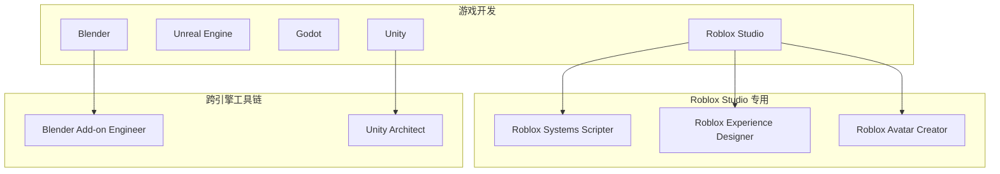
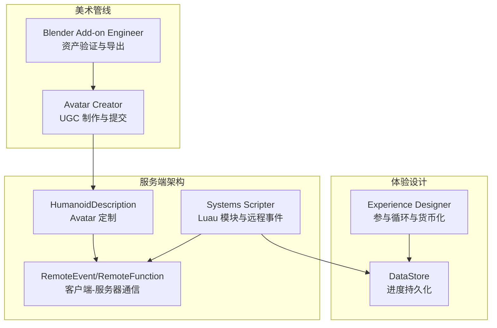
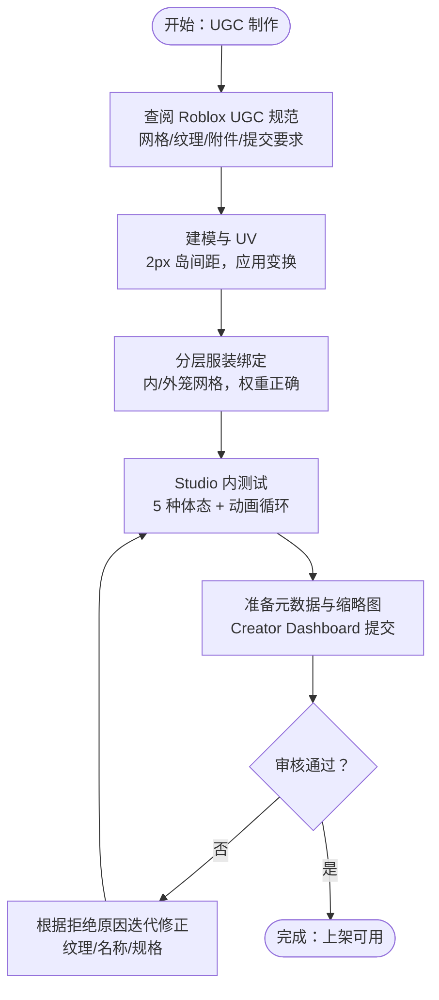
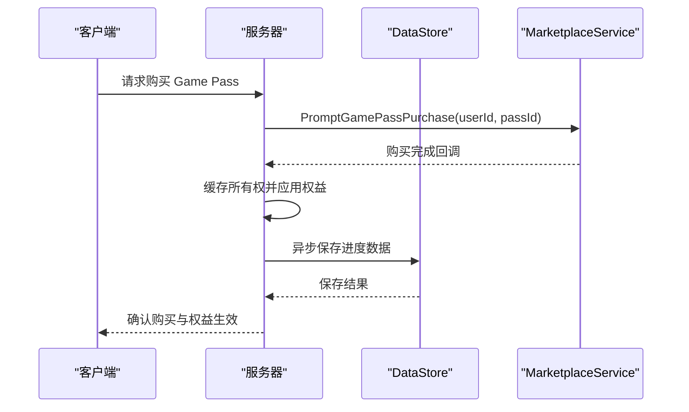
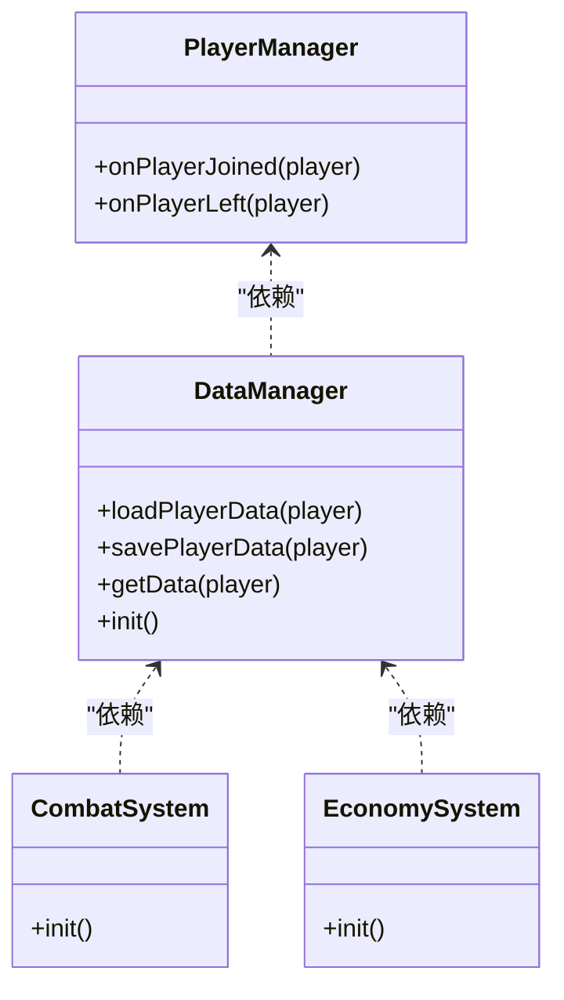
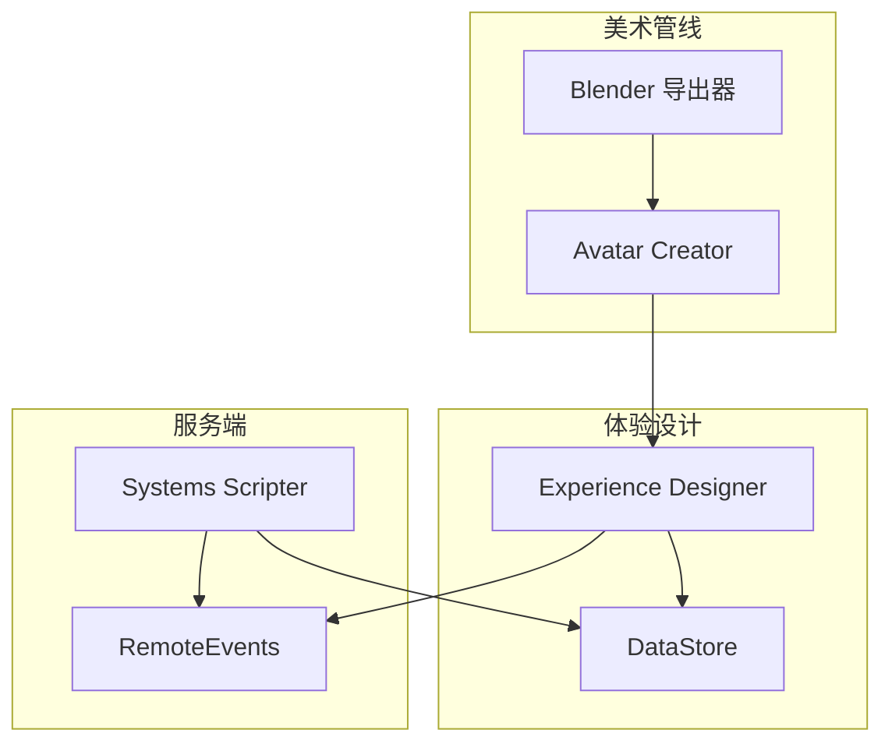
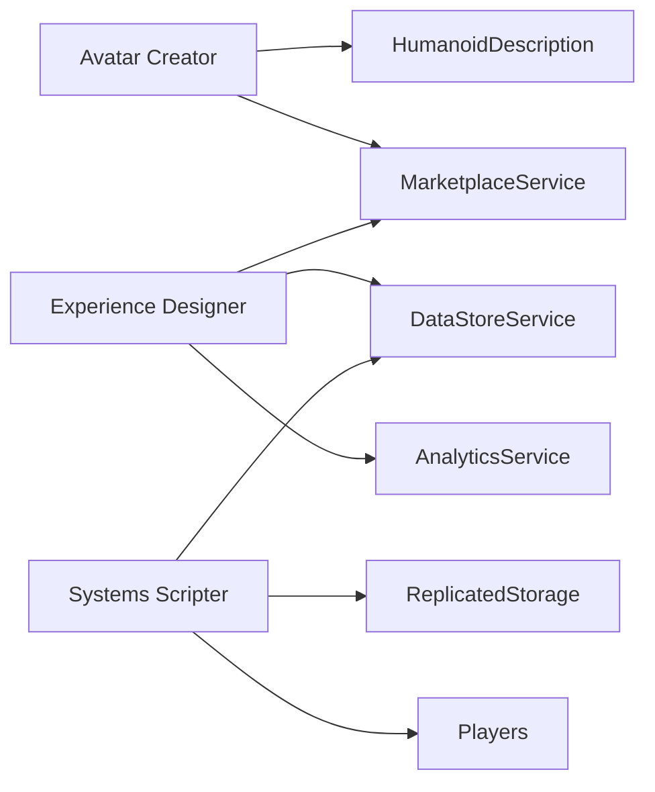

# Roblox Studio 开发代理

<cite>
**本文档引用的文件**
- [roblox-avatar-creator.md](file://game-development/roblox-studio/roblox-avatar-creator.md)
- [roblox-experience-designer.md](file://game-development/roblox-studio/roblox-experience-designer.md)
- [roblox-systems-scripter.md](file://game-development/roblox-studio/roblox-systems-scripter.md)
- [README.md](file://README.md)
- [blender-addon-engineer.md](file://game-development/blender/blender-addon-engineer.md)
- [unity-architect.md](file://game-development/unity/unity-architect.md)
</cite>

## 目录
1. [简介](#简介)
2. [项目结构](#项目结构)
3. [核心组件](#核心组件)
4. [架构总览](#架构总览)
5. [详细组件分析](#详细组件分析)
6. [依赖关系分析](#依赖关系分析)
7. [性能考虑](#性能考虑)
8. [故障排除指南](#故障排除指南)
9. [结论](#结论)
10. [附录](#附录)

## 简介
本文件面向 Roblox Studio 开发代理的专业化文档，系统梳理了三类关键角色：头像创建者（UGC 与 Avatar 定制）、体验设计师（游戏机制与留存设计）、系统脚手架工程师（Luau 脚本与服务架构）。文档基于仓库中的 Agent 定义，结合 Roblox 平台特性，提供从开发环境、Lua/Luau 脚本语言、Place 文件结构、DataStore 系统、Avatar 系统到游戏服务架构的完整说明，并覆盖社交游戏开发的用户体验设计、服务器架构、反作弊系统、社区管理以及平台审核政策与发布流程。

## 项目结构
该仓库采用按职能划分的模块化组织方式，Roblox Studio 相关 Agent 位于 `game-development/roblox-studio/` 目录下，同时包含跨引擎的工具链 Agent（如 Blender 插件工程师、Unity 架构师）以支撑完整的美术与工程管线。

图表来源
- [README.md:330-336](file://README.md#L330-L336)
- [README.md:284-336](file://README.md#L284-L336)

章节来源
- [README.md:330-336](file://README.md#L330-L336)
- [README.md:284-336](file://README.md#L284-L336)

## 核心组件
本节概述三个核心代理及其职责边界与协作关系：
- Roblox Avatar Creator：负责 UGC 与 Avatar 管线，精通 Roblox Avatar 系统、UGC 物品创建、附件绑定、纹理规范与 Creator Marketplace 提交流程。
- Roblox Experience Designer：负责平台 UX 与货币化，精通参与循环设计、DataStore 驱动的进度、Roblox 货币化系统（Passes、开发者产品、UGC），以及玩家留存。
- Roblox Systems Scripter：负责 Luau 脚本与服务架构，精通客户端-服务器安全模型、RemoteEvents/RemoteFunctions、DataStore、模块化架构。

章节来源
- [roblox-avatar-creator.md:1-298](file://game-development/roblox-studio/roblox-avatar-creator.md#L1-L298)
- [roblox-experience-designer.md:1-306](file://game-development/roblox-studio/roblox-experience-designer.md#L1-L306)
- [roblox-systems-scripter.md:1-326](file://game-development/roblox-studio/roblox-systems-scripter.md#L1-L326)

## 架构总览
Roblox Studio 的开发工作流由“美术管线 + 体验设计 + 服务端架构”三层协同构成：
- 美术管线层：Blender 导出器与验证器确保网格、UV、权重符合 Roblox 规范；Avatar Creator 将物品导入 Studio 并进行多体态测试与提交。
- 体验设计层：Experience Designer 设计参与循环与货币化系统，使用 DataStore 保障进度持久化与可恢复性。
- 服务端架构层：Systems Scripter 实现安全的客户端-服务器通信、数据持久化与模块化系统，确保可扩展与可维护性。

图表来源
- [blender-addon-engineer.md:1-235](file://game-development/blender/blender-addon-engineer.md#L1-L235)
- [roblox-avatar-creator.md:1-298](file://game-development/roblox-studio/roblox-avatar-creator.md#L1-L298)
- [roblox-experience-designer.md:1-306](file://game-development/roblox-studio/roblox-experience-designer.md#L1-L306)
- [roblox-systems-scripter.md:1-326](file://game-development/roblox-studio/roblox-systems-scripter.md#L1-L326)

## 详细组件分析

### Roblox Avatar Creator 组件分析
职责与交付物：
- UGC 规范与提交：严格遵循网格三角面数限制、单 UV 通道、无重叠 UV、应用变换、FBX/OBJ 导出格式等。
- 纹理标准：分辨率范围、PNG 透明支持、版权合规、UV 岛间距要求。
- Avatar 附件规则：标准附件点命名、R15/Rthro 兼容性测试、分层服装内/外笼网格要求。
- In-Experience Avatar 自定义：通过 HumanoidDescription 应用外观、保存与加载玩家外观、UGC 商店购买流程。
- Creator Marketplace 合规：名称准确性、描述清晰度、图标清晰度、预提交校验清单与风险标志。

图表来源
- [roblox-avatar-creator.md:232-256](file://game-development/roblox-studio/roblox-avatar-creator.md#L232-L256)

章节来源
- [roblox-avatar-creator.md:1-298](file://game-development/roblox-studio/roblox-avatar-creator.md#L1-L298)

### Roblox Experience Designer 组件分析
职责与交付物：
- 参与循环设计：针对 Roblox 用户心理与算法信号（并发玩家、收藏、访问量）设计 D1/D7/D30 留存目标。
- 货币化伦理：禁止 Pay-to-Win、人工稀缺、强制快买等暗模式；明确区分付费与免费内容。
- DataStore 进度安全：统一数据结构、版本迁移、重试逻辑、保存时机（PlayerRemoving 与 BindToClose）。
- 日常奖励系统：基于 DataStore 的连续登录阶梯奖励，含断连重置策略。
- Retention 指标追踪：使用 AnalyticsService 记录关键事件，构建漏斗分析与 A/B 测试基础设施。

图表来源
- [roblox-experience-designer.md:54-120](file://game-development/roblox-studio/roblox-experience-designer.md#L54-L120)
- [roblox-experience-designer.md:122-175](file://game-development/roblox-studio/roblox-experience-designer.md#L122-L175)

章节来源
- [roblox-experience-designer.md:1-306](file://game-development/roblox-studio/roblox-experience-designer.md#L1-L306)

### Roblox Systems Scripter 组件分析
职责与交付物：
- 客户端-服务器安全模型：服务器为真相源，客户端仅接收确认；所有影响游戏状态的操作必须在服务器执行。
- RemoteEvent/RemoteFunction 规则：禁止使用 RemoteFunction:InvokeClient；对输入进行类型与范围校验；合理使用 FireServer/FireClient。
- DataStore 标准：使用 pcall 包裹调用、指数回退重试、避免过度写入频率、在 PlayerRemoving 与 BindToClose 保存数据。
- 模块化架构：ServerStorage 中的模块化系统，通过共享常量与远程事件引用实现清晰职责分离。

图表来源
- [roblox-systems-scripter.md:93-169](file://game-development/roblox-studio/roblox-systems-scripter.md#L93-L169)
- [roblox-systems-scripter.md:171-229](file://game-development/roblox-studio/roblox-systems-scripter.md#L171-L229)

章节来源
- [roblox-systems-scripter.md:1-326](file://game-development/roblox-studio/roblox-systems-scripter.md#L1-L326)

### 概念性总览
以下概念图展示 Roblox Studio 开发代理如何协同工作：美术管线产出符合规范的 UGC 资产，Experience Designer 设计可留存与可货币化的体验，Systems Scripter 提供安全可靠的后端服务与数据持久化。

[此图为概念性示意，不直接映射具体源码文件]

## 依赖关系分析
- Avatar Creator 依赖 Roblox Avatar 系统与 Marketplace 服务，通过 HumanoidDescription 实现外观定制与保存。
- Experience Designer 依赖 DataStore 与 MarketplaceService，结合 AnalyticsService 进行指标追踪与 A/B 测试。
- Systems Scripter 依赖 Roblox 服务（Players、DataStoreService、ReplicatedStorage 等），通过模块化与远程事件实现可扩展架构。

图表来源
- [roblox-avatar-creator.md:85-136](file://game-development/roblox-studio/roblox-avatar-creator.md#L85-L136)
- [roblox-experience-designer.md:215-237](file://game-development/roblox-studio/roblox-experience-designer.md#L215-L237)
- [roblox-systems-scripter.md:56-91](file://game-development/roblox-studio/roblox-systems-scripter.md#L56-L91)

章节来源
- [roblox-avatar-creator.md:85-136](file://game-development/roblox-studio/roblox-avatar-creator.md#L85-L136)
- [roblox-experience-designer.md:215-237](file://game-development/roblox-studio/roblox-experience-designer.md#L215-L237)
- [roblox-systems-scripter.md:56-91](file://game-development/roblox-studio/roblox-systems-scripter.md#L56-L91)

## 性能考虑
- 数据持久化：使用指数回退重试与 pcall 包裹 DataStore 调用，避免失败导致的数据丢失与性能抖动。
- 客户端-服务器通信：优先使用 RemoteEvent，避免 RemoteFunction 阻塞；对输入进行严格的类型与范围校验。
- 模块化与解耦：通过 ModuleScript 与共享常量实现职责分离，降低耦合度，提升可维护性与可测试性。
- 资产管线：在 Blender 端进行严格的命名、变换与材质槽验证，减少下游引擎侧的错误与返工。

[本节提供通用指导，不直接分析具体文件]

## 故障排除指南
常见问题与处理建议：
- DataStore 写入失败：检查 pcall 包裹与重试逻辑，确认写入频率未超过平台限制；在 PlayerRemoving 与 BindToClose 均保存数据。
- RemoteEvent 输入异常：对所有客户端请求进行类型与范围校验，避免信任客户端数据；必要时引入缓存与权限校验。
- Avatar 适配问题：在 Studio 内对五种体态进行动画循环测试，确保无穿透与卡顿；分层服装需提供内/外笼网格。
- Marketplace 审核拒绝：关注纹理内容、网格规格、名称误导等问题；准备清晰的缩略图与准确的描述。

章节来源
- [roblox-systems-scripter.md:43-47](file://game-development/roblox-studio/roblox-systems-scripter.md#L43-L47)
- [roblox-avatar-creator.md:247-256](file://game-development/roblox-studio/roblox-avatar-creator.md#L247-L256)
- [roblox-experience-designer.md:36-45](file://game-development/roblox-studio/roblox-experience-designer.md#L36-L45)

## 结论
Roblox Studio 开发代理通过“美术管线—体验设计—服务端架构”的协同，能够高效构建高质量、可留存、可货币化的社交游戏体验。Avatar Creator 确保 UGC 资产质量与合规，Experience Designer 保障参与循环与伦理货币化，Systems Scripter 提供安全可靠的后端支撑。配合 Blender 与 Unity 等跨引擎工具链，形成从美术到上线的完整流水线。

[本节为总结性内容，不直接分析具体文件]

## 附录

### Roblox 开发环境与 Place 文件结构
- 开发环境：Roblox Studio 作为主要 IDE，支持 Place 文件（.rbxl/.rbxm）与脚本（Lua/Luau）编辑。
- Place 文件：包含场景层级、实例属性、脚本与资源集合，支持多人协作与版本控制。
- 服务架构：ServerStorage（服务器脚本）、ReplicatedStorage（共享模块与远程事件）、StarterPlayerScripts（客户端引导）。

[本节为通用背景知识，不直接分析具体文件]

### 社交游戏开发流程（用户旅程）
- 用户发现：标题、描述、缩略图优化，利用算法信号提升曝光。
- 新手引导：首 60 秒成功体验、首 5 分钟完成闭环、首 15 分钟建立投资感。
- 留存与货币化：日常奖励、Game Pass、开发者产品与限时活动。
- 社区与运营：好友邀请、群组权限、实时在线人数与成就展示。

章节来源
- [roblox-experience-designer.md:177-213](file://game-development/roblox-studio/roblox-experience-designer.md#L177-L213)
- [roblox-experience-designer.md:283-305](file://game-development/roblox-studio/roblox-experience-designer.md#L283-L305)

### 反作弊与安全实践
- 客户端-服务器信任边界：服务器为真相源，客户端仅显示确认；所有状态变更在服务器执行。
- 输入验证：对 RemoteEvent 参数进行类型与范围校验，防止注入与越界。
- 数据持久化：使用 pcall 与重试，避免数据丢失；在关键生命周期事件保存数据。
- 权限与缓存：集中式权限注册表与缓存，减少 API 调用开销并提高一致性。

章节来源
- [roblox-systems-scripter.md:28-47](file://game-development/roblox-studio/roblox-systems-scripter.md#L28-L47)
- [roblox-systems-scripter.md:171-229](file://game-development/roblox-studio/roblox-systems-scripter.md#L171-L229)

### 社区管理与审核政策
- Marketplace 审核：名称准确性、内容合规、图标清晰度、纹理版权与品牌元素。
- 伦理货币化：禁止 Pay-to-Win、人工稀缺与强制快买；付费与免费内容清晰区分。
- 发布流程：预提交校验清单、Studio 内测试、Creator Dashboard 提交与审核队列。

章节来源
- [roblox-avatar-creator.md:47-51](file://game-development/roblox-studio/roblox-avatar-creator.md#L47-L51)
- [roblox-experience-designer.md:28-45](file://game-development/roblox-studio/roblox-experience-designer.md#L28-L45)