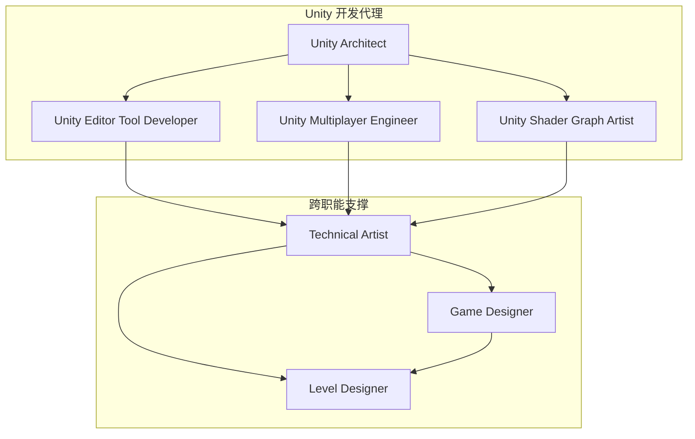
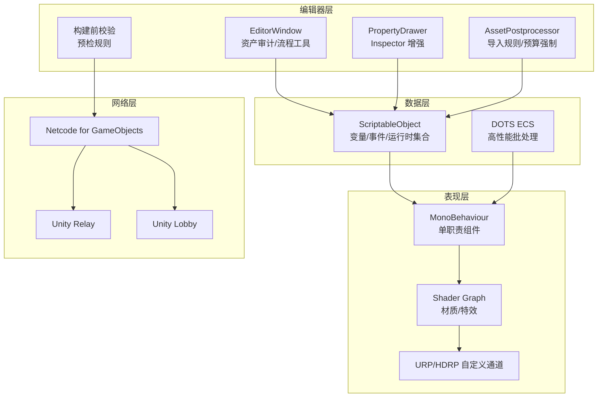
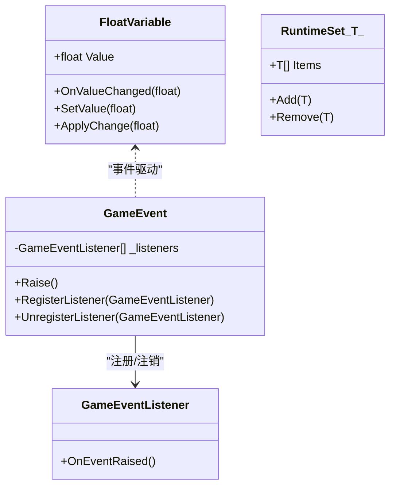
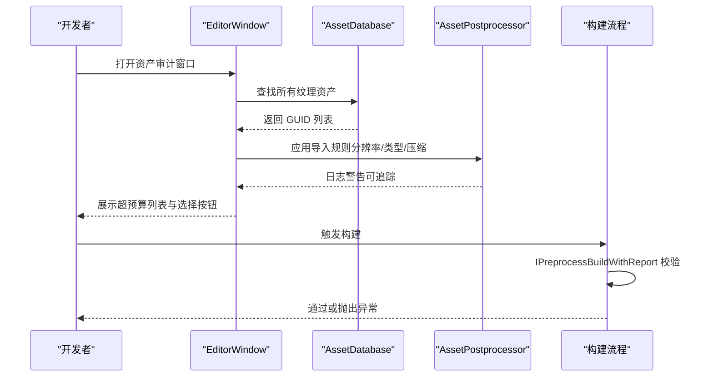
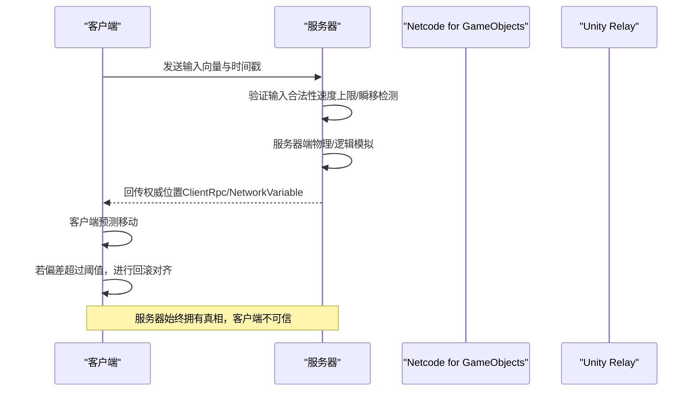
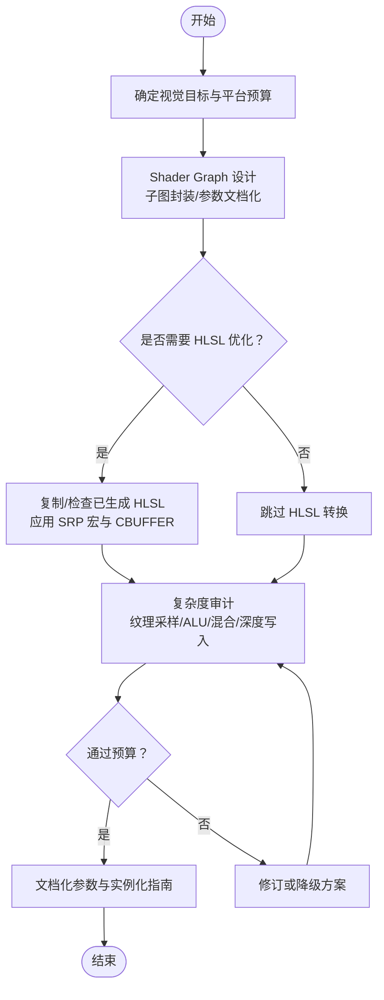
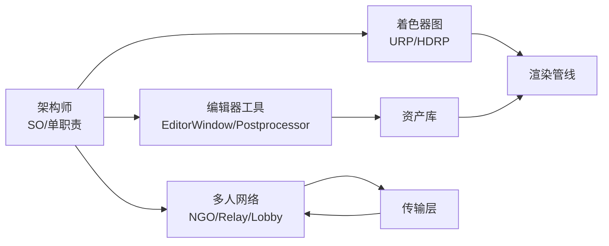

# Unity 游戏开发代理

<cite>
**本文档引用的文件**
- [unity-architect.md](file://game-development/unity/unity-architect.md)
- [unity-editor-tool-developer.md](file://game-development/unity/unity-editor-tool-developer.md)
- [unity-multiplayer-engineer.md](file://game-development/unity/unity-multiplayer-engineer.md)
- [unity-shader-graph-artist.md](file://game-development/unity/unity-shader-graph-artist.md)
- [README.md](file://README.md)
- [technical-artist.md](file://game-development/technical-artist.md)
- [game-designer.md](file://game-development/game-designer.md)
- [level-designer.md](file://game-development/level-designer.md)
</cite>

## 目录
1. [简介](#简介)
2. [项目结构](#项目结构)
3. [核心组件](#核心组件)
4. [架构总览](#架构总览)
5. [详细组件分析](#详细组件分析)
6. [依赖关系分析](#依赖关系分析)
7. [性能考量](#性能考量)
8. [故障排查指南](#故障排查指南)
9. [结论](#结论)
10. [附录](#附录)

## 简介
本文件面向 Unity 游戏开发代理，系统化梳理 Unity 架构师、编辑器工具开发者、多人游戏工程师与着色器图艺术家在 Unity 2020+ 环境下的职责边界、工作流与技术要点。围绕数据驱动模块化、编辑器自动化、多人网络权威模型与预测、以及 URP/HDRP 下的 Shader Graph 与自定义渲染通道，提供可落地的最佳实践、性能优化建议与常见问题排查路径。同时结合技术美术、关卡设计与游戏设计视角，形成跨职能协同的完整交付闭环。

## 项目结构
Unity 开发代理位于游戏开发（game-development）子目录下，包含四个核心角色：
- Unity Architect：数据驱动架构、ScriptableObject 模式、单职责组件、DOTS 集成
- Unity Editor Tool Developer：EditorWindow、PropertyDrawer、AssetPostprocessor、构建前校验
- Unity Multiplayer Engineer：Netcode for GameObjects、Unity Relay/Lobby、权威模型与抗作弊
- Unity Shader Graph Artist：Shader Graph、HLSL、URP/HDRP 自定义渲染通道

此外，技术美术、关卡设计与游戏设计为跨职能支撑角色，共同保障从设计到实现再到性能与体验的全链路质量。

图表来源
- [README.md](file://README.md)
- [unity-architect.md](file://game-development/unity/unity-architect.md)
- [unity-editor-tool-developer.md](file://game-development/unity/unity-editor-tool-developer.md)
- [unity-multiplayer-engineer.md](file://game-development/unity/unity-multiplayer-engineer.md)
- [unity-shader-graph-artist.md](file://game-development/unity/unity-shader-graph-artist.md)
- [technical-artist.md](file://game-development/technical-artist.md)
- [game-designer.md](file://game-development/game-designer.md)
- [level-designer.md](file://game-development/level-designer.md)

章节来源
- [README.md](file://README.md)
- [unity-architect.md](file://game-development/unity/unity-architect.md)
- [unity-editor-tool-developer.md](file://game-development/unity/unity-editor-tool-developer.md)
- [unity-multiplayer-engineer.md](file://game-development/unity/unity-multiplayer-engineer.md)
- [unity-shader-graph-artist.md](file://game-development/unity/unity-shader-graph-artist.md)
- [technical-artist.md](file://game-development/technical-artist.md)
- [game-designer.md](file://game-development/game-designer.md)
- [level-designer.md](file://game-development/level-designer.md)

## 核心组件
- 数据驱动架构与单职责组件
  - 使用 ScriptableObject 承载共享状态与事件通道，避免硬引用与单例滥用
  - 组件单一职责，Prefab 可在空场景中独立运行
  - 提供 FloatVariable、RuntimeSet、GameEvent 等可复用模式
- 编辑器自动化与资产管线
  - EditorWindow、PropertyDrawer、AssetPostprocessor、构建前校验
  - 命名规范、导入设置、预算审计与自动修复
- 多人网络权威模型与预测
  - 服务器权威、输入同步、客户端预测与回滚
  - Netcode for GameObjects、Unity Relay/Lobby、带宽管理与反作弊
- Shader Graph 与自定义渲染通道
  - URP/HDRP 兼容、Sub-Graph 复用、复杂度审计、自定义 Renderer Feature
  - HLSL 优化与调试、计算着色器与后处理

章节来源
- [unity-architect.md](file://game-development/unity/unity-architect.md)
- [unity-editor-tool-developer.md](file://game-development/unity/unity-editor-tool-developer.md)
- [unity-multiplayer-engineer.md](file://game-development/unity/unity-multiplayer-engineer.md)
- [unity-shader-graph-artist.md](file://game-development/unity/unity-shader-graph-artist.md)

## 架构总览
下图展示 Unity 开发代理在项目中的协作关系与关键交互点，强调“数据驱动 + 编辑器自动化 + 权威网络 + 视觉管线”的整体架构。

图表来源
- [unity-architect.md](file://game-development/unity/unity-architect.md)
- [unity-editor-tool-developer.md](file://game-development/unity/unity-editor-tool-developer.md)
- [unity-multiplayer-engineer.md](file://game-development/unity/unity-multiplayer-engineer.md)
- [unity-shader-graph-artist.md](file://game-development/unity/unity-shader-graph-artist.md)

## 详细组件分析

### Unity 架构师：数据驱动与单职责组件
- 设计原则
  - ScriptableObject 优先：共享数据、事件与运行时集合
  - 单一职责：每个 MonoBehaviour 解决一个明确问题
  - 场景无假设：Prefab 不依赖场景层级或外部状态
- 关键模式
  - FloatVariable：值变更事件驱动 UI 更新
  - RuntimeSet：全局实体跟踪，替代单例
  - GameEvent：跨系统解耦通信
- 工作流
  - 架构审计 → SO 资产设计 → 组件拆分 → 编辑器工具 → 场景架构
- 成功指标
  - 无 GameObject.Find/OfType；组件小于 150 行；Prefab 可在空场景实例化；共享状态在 SO 中

图表来源
- [unity-architect.md](file://game-development/unity/unity-architect.md)

章节来源
- [unity-architect.md](file://game-development/unity/unity-architect.md)

### Unity 编辑器工具开发者：EditorWindow/PropertyDrawer/AssetPostprocessor
- 设计原则
  - 编辑器脚本仅在 Editor 目录或使用条件编译
  - EditorWindow 状态持久化、Undo 支持、进度条
  - AssetPostprocessor 幂等、日志可追踪
- 关键工具
  - 资产审计 EditorWindow：扫描超预算纹理并高亮
  - 贴图导入强制器：按命名与路径强制类型、分辨率、压缩
  - 自定义 PropertyDrawer：MinMax 滑块范围输入
  - 构建前校验：资源区未压缩贴图检测
- 工作流
  - 规划 → 原型 → 生产化 → 文档 → 构建集成
- 成功指标
  - 100% 的属性绘制支持预制覆盖；导入规则自动执行；构建前校验拦截违规

图表来源
- [unity-editor-tool-developer.md](file://game-development/unity/unity-editor-tool-developer.md)

章节来源
- [unity-editor-tool-developer.md](file://game-development/unity/unity-editor-tool-developer.md)

### Unity 多人游戏工程师：权威模型与预测
- 设计原则
  - 服务器权威：位置、血量、分数、物品归属由服务器决定
  - 输入即请求：客户端只发送输入，服务器验证与模拟
  - 客户端预测与回滚：低延迟响应 + 服务器纠正
- 关键实现
  - Netcode 项目配置：传输设置、主机/客户端启动
  - 服务器权威控制器：输入队列、预测移动、回滚阈值
  - Lobby 匹配：公开元数据、心跳维护
  - 变量与 RPC 分类：持久状态用 NetworkVariable，一次性事件用 Client/ServerRpc
- 工作流
  - 架构设计 → UGS 设置 → 核心网络实现 → 延迟与可靠性测试 → 反作弊加固
- 成功指标
  - 200ms 模拟延迟下无状态漂移；带宽每玩家低于阈值；Relay 连接成功率高

图表来源
- [unity-multiplayer-engineer.md](file://game-development/unity/unity-multiplayer-engineer.md)

章节来源
- [unity-multiplayer-engineer.md](file://game-development/unity/unity-multiplayer-engineer.md)

### Unity Shader Graph 艺术家：可视化与性能平衡
- 设计原则
  - Shader Graph 子图复用、参数文档化、URP/HDRP 正确管线
  - 移动端预算：纹理采样、ALU 指令、透明与深度写入
  - 自定义渲染通道：OutlineRendererFeature 示例
- 关键实现
  - Dissolve Shader Graph 布局与参数
  - URP 自定义渲染通道：OutlineRendererFeature + OutlineRenderPass
  - HLSL 优化：SRP Macro、CBUFFER、PBR 输入输出
- 工作流
  - 设计 → 图形作者 → HLSL 转换 → 性能分析 → 艺术交接
- 成功指标
  - 所有 Shader 通过平台预算；100% 参数文档化；移动端回退变体存在

图表来源
- [unity-shader-graph-artist.md](file://game-development/unity/unity-shader-graph-artist.md)

章节来源
- [unity-shader-graph-artist.md](file://game-development/unity/unity-shader-graph-artist.md)

### 技术美术：跨引擎管线与性能预算
- 设计原则
  - 明确资产预算（多 LOD、纹理分辨率、粒子数、Overdraw）
  - Shader 复杂度可视化与移动端安全变体
  - 贴图压缩策略与 UV/拓扑质量
- 关键工具
  - 资产预算表、VFX 性能审计清单、LOD 链验证脚本
- 成功指标
  - 无 LOD 预算超支；移动端帧时长在预算内；VFX Overdraw 符合平台限制

章节来源
- [technical-artist.md](file://game-development/technical-artist.md)

### 关卡设计师：空间叙事与节奏控制
- 设计原则
  - 关键路径可视清晰、战斗可读性、环境叙事无文本
  - 空间心理学：前景-避难所、图底对比、强制透视
  - 程序化与手工锚点结合
- 关键文档
  - 关卡设计文档、节奏表、Blockout 规范、导航可读性检查
- 成功指标
  - 新玩家无需地图即可导航；节奏与实测时间误差在阈值内；环境叙事可被正确解读

章节来源
- [level-designer.md](file://game-development/level-designer.md)

### 游戏设计师：系统与经济设计
- 设计原则
  - 以玩家动机为中心，机制文档化，数值从假设出发
  - 经济系统建模、玩家原型与通胀检测
- 关键文档
  - 核心循环、经济平衡表、新手引导清单、机制规格
- 成功指标
  - 每个机制有 GDD 条目；经济稳定；首周留存与引导完成率达标

章节来源
- [game-designer.md](file://game-development/game-designer.md)

## 依赖关系分析
- 组件耦合与内聚
  - 架构师通过 ScriptableObject 将系统解耦，降低组件间直接引用
  - 编辑器工具与资产管线强绑定，确保导入阶段即捕获错误
  - 多人网络严格区分“输入”与“状态”，避免客户端污染权威状态
  - Shader Graph 与自定义渲染通道依赖 URP/HDRP API，需版本兼容
- 外部依赖与集成点
  - Unity Gaming Services：Relay 与 Lobby
  - Unity DOTS：ECS + JobSystem + Burst
  - Unity Addressables：异步加载与内存控制
- 循环依赖风险
  - 避免在 SO 中持有场景实例引用；避免在编辑器脚本中调用运行时 API

图表来源
- [unity-architect.md](file://game-development/unity/unity-architect.md)
- [unity-editor-tool-developer.md](file://game-development/unity/unity-editor-tool-developer.md)
- [unity-multiplayer-engineer.md](file://game-development/unity/unity-multiplayer-engineer.md)
- [unity-shader-graph-artist.md](file://game-development/unity/unity-shader-graph-artist.md)

章节来源
- [unity-architect.md](file://game-development/unity/unity-architect.md)
- [unity-editor-tool-developer.md](file://game-development/unity/unity-editor-tool-developer.md)
- [unity-multiplayer-engineer.md](file://game-development/unity/unity-multiplayer-engineer.md)
- [unity-shader-graph-artist.md](file://game-development/unity/unity-shader-graph-artist.md)

## 性能考量
- 架构与内存
  - 事件驱动替代轮询，减少 GC 压力；使用 RuntimeSet 替代单例跟踪
  - DOTS + JobSystem + Burst 用于 CPU 密集型批处理
- 网络
  - NetworkVariable 变更触发；序列化差异；位置同步采用 NetworkTransform 或自定义预测
  - 带宽节流：非关键状态降低更新频率
- 渲染
  - Shader Graph 子图复用、参数文档化；移动端限制纹理采样与 ALU
  - 自定义渲染通道最小化额外 Pass，使用 RTHandle 管理中间缓冲
- 编辑器
  - EditorWindow 使用进度条与 Undo；AssetPostprocessor 幂等与日志可追踪

[本节为通用指导，不直接分析具体文件]

## 故障排查指南
- 架构问题
  - 症状：场景切换后状态残留、God Class 组件臃肿
  - 排查：确认无 GameObject.Find/OfType；组件是否单职责；Prefab 是否可独立实例化
- 编辑器工具
  - 症状：导入后设置未生效、Inspector 无法撤销修改
  - 排查：AssetPostprocessor 是否幂等；PropertyDrawer 是否 BeginProperty/EndProperty；EditorWindow 是否使用 Undo.RecordObject
- 多人网络
  - 症状：状态漂移、延迟高时抖动
  - 排查：输入验证与速度上限；客户端预测与回滚阈值；带宽统计与节流
- Shader/渲染
  - 症状：移动端掉帧、透明过度叠加
  - 排查：复杂度审计、纹理采样与 ALU；透明优先使用 Alpha Clipping；自定义通道 Pass 数与中间缓冲

章节来源
- [unity-architect.md](file://game-development/unity/unity-architect.md)
- [unity-editor-tool-developer.md](file://game-development/unity/unity-editor-tool-developer.md)
- [unity-multiplayer-engineer.md](file://game-development/unity/unity-multiplayer-engineer.md)
- [unity-shader-graph-artist.md](file://game-development/unity/unity-shader-graph-artist.md)

## 结论
Unity 开发代理通过“数据驱动架构 + 编辑器自动化 + 权威网络 + 视觉管线”的协同，形成可扩展、可维护且具备高质量交付能力的开发体系。架构师负责系统解耦与可维护性，编辑器工具开发者负责流程标准化与早期纠错，多人工程师保证网络体验与安全性，着色器艺术家在 URP/HDRP 下平衡视觉与性能。技术美术、关卡与游戏设计则从工程与体验维度提供约束与反馈，确保最终产品在功能、性能与玩家体验上达成一致。

[本节为总结性内容，不直接分析具体文件]

## 附录
- 最佳实践速览
  - 架构：SO 优先、单职责、场景无假设
  - 编辑器：幂等导入规则、Undo 支持、构建前校验
  - 网络：服务器权威、输入即请求、带宽管理、反作弊
  - 渲染：子图复用、预算审计、自定义通道最小化
- 常用工具与 API
  - Unity DOTS：Entities、JobSystem、Burst
  - Unity Addressables：异步加载与内存控制
  - Unity Editor：EditorWindow、PropertyDrawer、AssetPostprocessor、IPreprocessBuildWithReport
  - Unity Multiplayer：Netcode for GameObjects、Unity Transport、Relay、Lobby
  - Unity Rendering：URP/HDRP、ScriptableRendererFeature、Compute Shader

[本节为概览性内容，不直接分析具体文件]