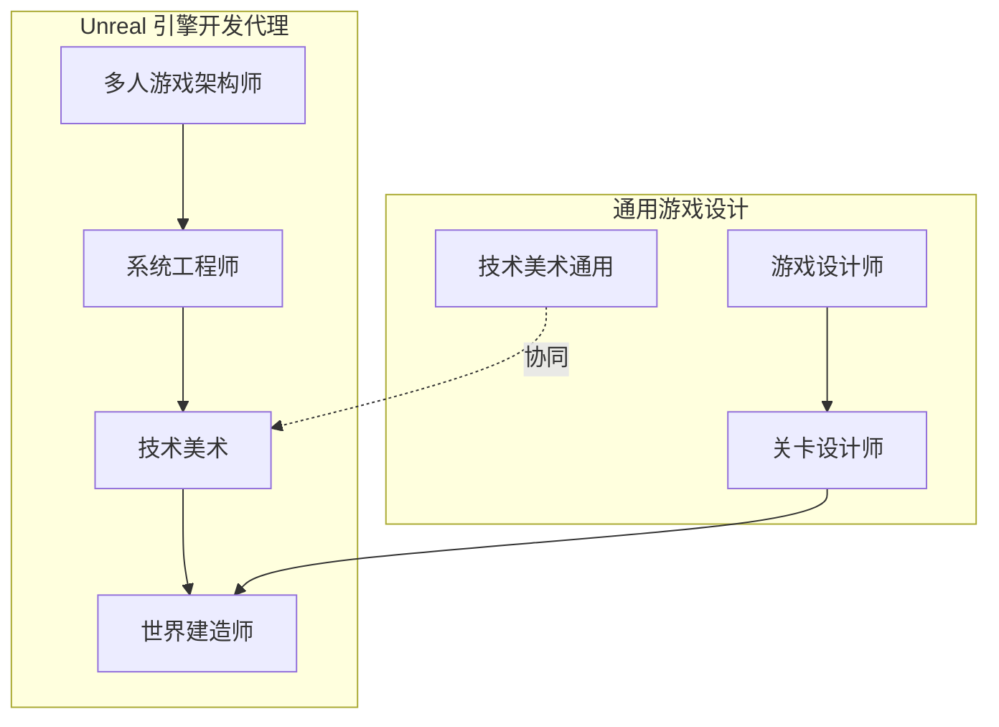
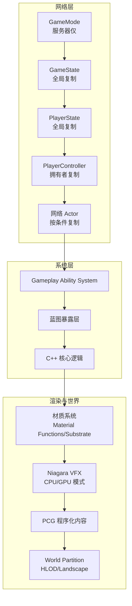
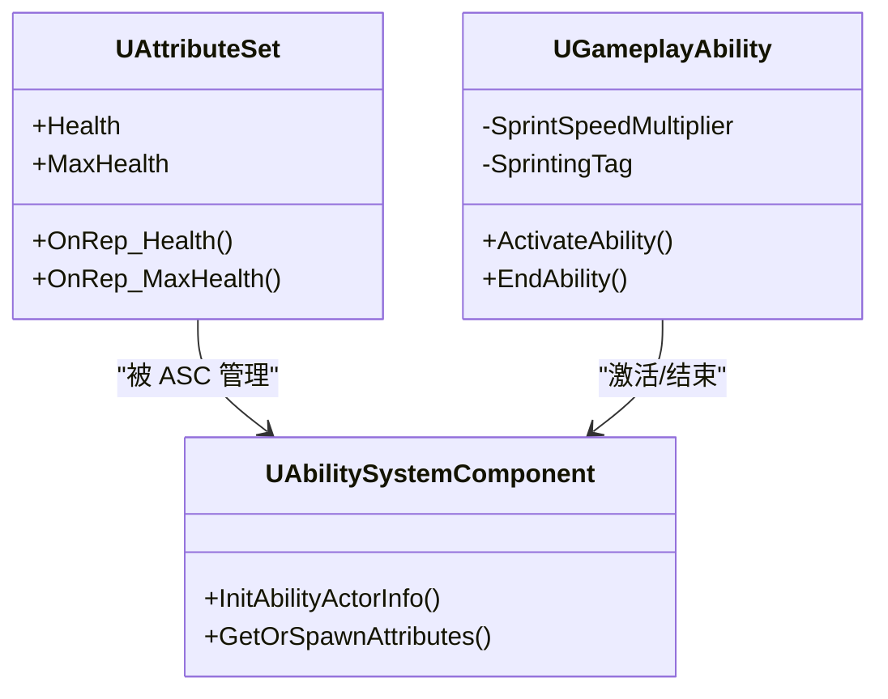
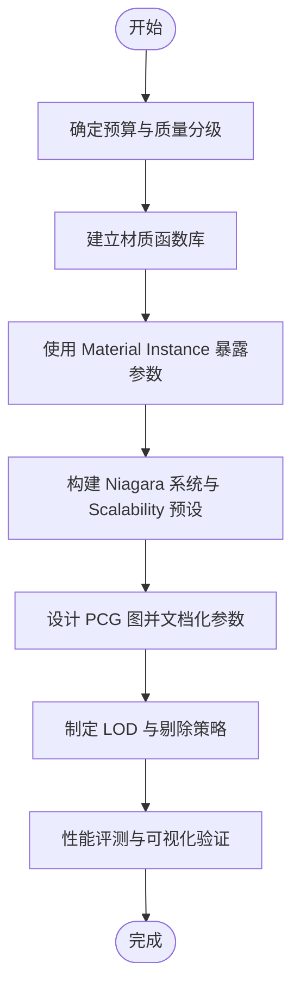
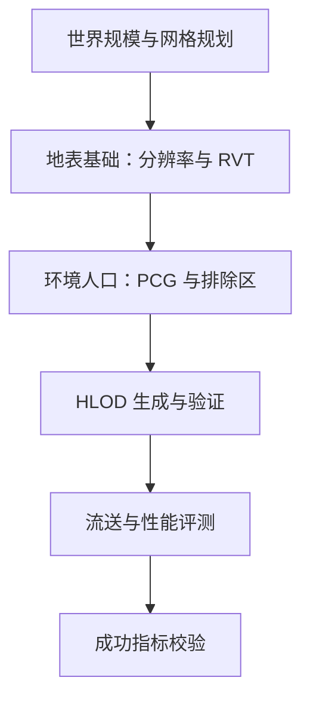
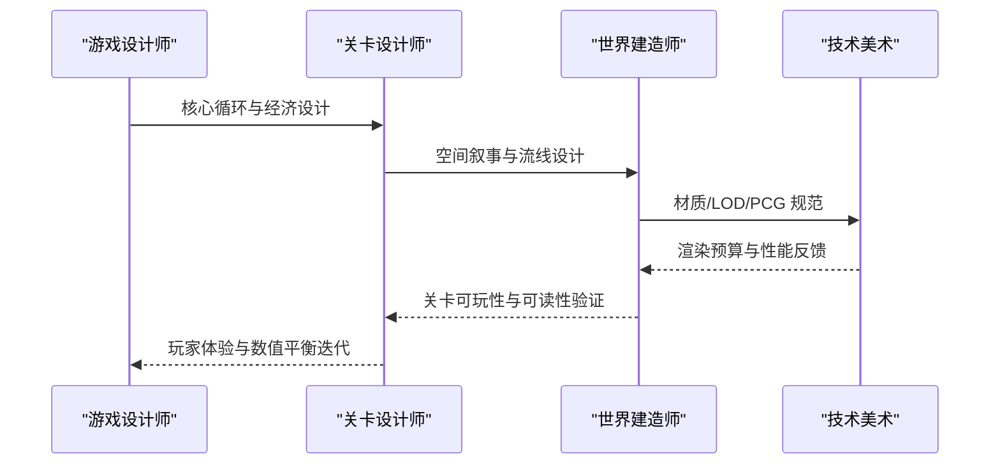
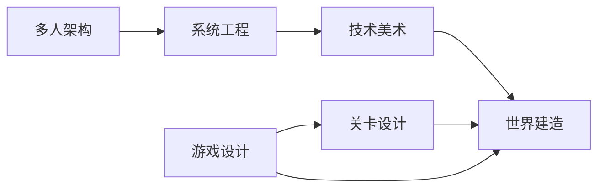

# Unreal 引擎开发代理

<cite>
**本文档引用的文件**
- [unreal-multiplayer-architect.md](file://game-development/unreal-engine/unreal-multiplayer-architect.md)
- [unreal-systems-engineer.md](file://game-development/unreal-engine/unreal-systems-engineer.md)
- [unreal-technical-artist.md](file://game-development/unreal-engine/unreal-technical-artist.md)
- [unreal-world-builder.md](file://game-development/unreal-engine/unreal-world-builder.md)
- [README.md](file://README.md)
- [game-designer.md](file://game-development/game-designer.md)
- [level-designer.md](file://game-development/level-designer.md)
- [technical-artist.md](file://game-development/technical-artist.md)
</cite>

## 目录
1. [简介](#简介)
2. [项目结构](#项目结构)
3. [核心组件](#核心组件)
4. [架构总览](#架构总览)
5. [详细组件分析](#详细组件分析)
6. [依赖关系分析](#依赖关系分析)
7. [性能考量](#性能考量)
8. [故障排查指南](#故障排查指南)
9. [结论](#结论)
10. [附录](#附录)

## 简介
本文件面向使用 Unreal Engine 的大型项目团队，系统化梳理“Unreal 引擎开发代理”的角色与职责边界，覆盖多人游戏架构师（网络同步与服务器权威）、系统工程师（引擎扩展与工具开发）、技术美术（材质与动画管线）、世界建造师（地图与关卡设计）四大核心角色，并结合蓝图可视化脚本系统、C++ 扩展开发、UMG 用户界面系统、Anim Graph 动画蓝图、Niagara 粒子系统等关键功能模块，给出可落地的架构设计模式、性能优化策略与跨平台发布流程指导。同时，文档也纳入游戏设计师与关卡设计师的协作视角，确保从玩法到空间叙事的一致性与可实现性。

## 项目结构
该仓库采用“多代理”组织方式，每个代理以独立 Markdown 文件定义其身份、使命、规则、交付物与工作流。Unreal 引擎相关代理位于 game-development/unreal-engine 目录下，围绕以下四个专业角色展开：
- 多人游戏架构师：负责 Actor 复制、GameMode/GameState 架构、服务器权威、预测与回滚、专用服务器配置与反作弊审计
- 系统工程师：负责 C++/蓝图混合架构、Gameplay Ability System（GAS）、Nanite/Lumen 渲染管线、内存管理与构建系统
- 技术美术：负责材质编辑器、Niagara VFX、程序化内容生成（PCG）、LOD 与剔除标准、Substrate 材质系统
- 世界建造师：负责 World Partition、地形（Landscape）、HLOD、大规模关卡流送与性能评测

此外，仓库还包含通用游戏设计与关卡设计代理，用于在玩法与空间叙事层面提供协同支撑。



**图表来源**
- [unreal-multiplayer-architect.md:1-314](file://game-development/unreal-engine/unreal-multiplayer-architect.md#L1-L314)
- [unreal-systems-engineer.md:1-311](file://game-development/unreal-engine/unreal-systems-engineer.md#L1-L311)
- [unreal-technical-artist.md:1-257](file://game-development/unreal-engine/unreal-technical-artist.md#L1-L257)
- [unreal-world-builder.md:1-274](file://game-development/unreal-engine/unreal-world-builder.md#L1-L274)
- [game-designer.md:1-168](file://game-development/game-designer.md#L1-L168)
- [level-designer.md:1-209](file://game-development/level-designer.md#L1-L209)
- [technical-artist.md:1-230](file://game-development/technical-artist.md#L1-L230)

**章节来源**
- [README.md:307-314](file://README.md#L307-L314)

## 核心组件
- 多人游戏架构师：聚焦服务器权威模型、Actor 复制与网络效率、GameMode/GameState 层级、GAS 复制、RPC 可靠性与顺序、专用服务器配置与反作弊审计
- 系统工程师：聚焦 C++/蓝图边界、Nanite/Lumen 使用约束、GAS 项目配置、智能指针与垃圾回收安全、Mass 实体系统、Chaos 物理与破坏、自定义引擎模块开发
- 技术美术：聚焦材质函数库、Niagara 性能预算、PCG 图形管线、LOD 与剔除、Substrate 材质系统、路径追踪与虚拟制作
- 世界建造师：聚焦 World Partition 网格与数据层、Landscape 材质与运行时虚拟纹理、HLOD 层配置、PCG 森林图、开放世界性能评测清单

**章节来源**
- [unreal-multiplayer-architect.md:11-314](file://game-development/unreal-engine/unreal-multiplayer-architect.md#L11-L314)
- [unreal-systems-engineer.md:9-311](file://game-development/unreal-engine/unreal-systems-engineer.md#L9-L311)
- [unreal-technical-artist.md:9-257](file://game-development/unreal-engine/unreal-technical-artist.md#L9-L257)
- [unreal-world-builder.md:9-274](file://game-development/unreal-engine/unreal-world-builder.md#L9-L274)

## 架构总览
Unreal 引擎开发代理的协作架构以“服务端权威 + 客户端预测与回滚”为核心，配合 C++/蓝图混合架构、渲染管线与大规模关卡流送，形成从玩法到空间叙事的完整交付闭环。



**图表来源**
- [unreal-multiplayer-architect.md:114-198](file://game-development/unreal-engine/unreal-multiplayer-architect.md#L114-L198)
- [unreal-systems-engineer.md:115-143](file://game-development/unreal-engine/unreal-systems-engineer.md#L115-L143)
- [unreal-technical-artist.md:55-139](file://game-development/unreal-engine/unreal-technical-artist.md#L55-L139)
- [unreal-world-builder.md:56-174](file://game-development/unreal-engine/unreal-world-builder.md#L56-L174)

## 详细组件分析

### 多人游戏架构师（网络同步与服务器权威）
- 服务器权威模型与 RPC 规范
  - 所有游戏状态变更必须在服务器执行；客户端通过可靠/不可靠 RPC 发起请求，服务器进行验证后复制
  - 对于影响游戏性的 Server RPC 必须实现 _Validate 并启用 WithValidation
  - HasAuthority() 检查在每次状态变更前必须存在
  - 美观效果使用 NetMulticast，避免阻塞游戏逻辑
- 复制效率与优先级
  - 使用 Replicated/ReplicatedUsing 控制复制字段与通知回调
  - 通过 GetNetPriority 与 SetNetUpdateFrequency 针对不同 Actor 类型设置复制频率
  - 使用 DOREPLIFETIME_CONDITION 降低带宽：COND_OwnerOnly 私有状态、COND_SimulatedOnly 美观更新
- 网络层级与职责
  - GameMode：服务器仅，负责出生逻辑、规则仲裁、胜负判定
  - GameState：全局复制，共享世界状态（轮次计时、队伍分数）
  - PlayerState：全局复制，玩家公开数据（名称、延迟、击杀数）
  - PlayerController：仅拥有者复制，处理输入、摄像机、HUD
- RPC 顺序与可靠性
  - 可靠 RPC 保证顺序但增加带宽，仅用于关键事件
  - 不可靠 RPC 适用于高频视觉效果、语音数据
  - 避免每帧批量可靠 RPC，单独设计不可靠更新路径
- 复制 Actor 示例与 GameMode/GameState/GAS 集成
  - 提供 Actor 复制与 OnRep 回调、Server RPC 验证、NetMulticast 美观效果的代码片段路径
  - GameMode/GameState 的复制字段与生命周期管理
  - GAS 组件初始化的双路径（PossessedBy/OnRep_PlayerState）确保客户端/服务器一致
- 网络频率优化与专用服务器配置
  - 针对 Projectile/NPC/环境 Actor 设置不同的 NetUpdateFrequency 与最小频率
  - 专用服务器配置（DefaultGame.ini）与打包脚本（Package.bat）
- 工作流与成功指标
  - 设计阶段：明确权威模型、分层复制、RPC 预算
  - 实现阶段：GetLifetimeReplicatedProps、DOREPLIFETIME_CONDITION、Validate
  - 集成阶段：GAS 双路径初始化、属性复制校验
  - 分析阶段：stat net、Network Profiler、p.NetShowCorrections
  - 安全阶段：RPC 审计、权限检查、会话迁移与日志记录
  - 成功指标：无缺失 _Validate、每玩家带宽 < 15KB/s、每玩家每 30s 冲突 < 1 次、服务器 CPU < 30%

```mermaid
sequenceDiagram
participant Client as "客户端"
participant Controller as "PlayerController"
participant Server as "服务器"
participant Actor as "网络 Actor"
participant GAS as "GAS 组件"
Client->>Controller : 输入/请求
Controller->>Server : Server RPC(可靠/不可靠)
Server->>Server : _Validate 校验
Server->>Actor : 修改状态/触发效果
Server->>Client : 属性/事件复制
Actor->>GAS : 属性变更/能力激活
Client->>Actor : 客户端预测
Server-->>Client : 权威回滚/纠正
```

**图表来源**
- [unreal-multiplayer-architect.md:56-112](file://game-development/unreal-engine/unreal-multiplayer-architect.md#L56-L112)
- [unreal-multiplayer-architect.md:114-198](file://game-development/unreal-engine/unreal-multiplayer-architect.md#L114-L198)

**章节来源**
- [unreal-multiplayer-architect.md:28-287](file://game-development/unreal-engine/unreal-multiplayer-architect.md#L28-L287)

### 系统工程师（C++/蓝图混合与渲染管线）
- C++/蓝图边界与性能
  - 每帧 Tick 逻辑必须在 C++ 实现；蓝图 VM 开销与缓存未命中在高负载下代价巨大
  - 蓝图适合高层流程、UI 逻辑、原型与编曲事件
  - 暴露给蓝图的接口使用 BlueprintCallable/BlueprintImplementableEvent/BlueprintNativeEvent
- Nanite 使用约束与 Lumen 配置
  - Nanite 最大实例限制：单场景 1600 万；不兼容骨骼网格、复杂遮罩材质、样条网格、程序化网格
  - 启用 RVT（Runtime Virtual Texture）减少像素着色器层混合成本
- 内存管理与垃圾回收
  - 所有 UObject 指针必须声明为 UPROPERTY；弱引用使用 TWeakObjectPtr
  - 始终使用 IsValid() 检查对象有效性
- Gameplay Ability System（GAS）要求
  - 在 .Build.cs 中添加 GameplayAbilities/GameplayTags/GameplayTasks 依赖
  - Attribute Set 使用 GAMEPLAYATTRIBUTE_REPNOTIFY 宏；能力派生自 UGameplayAbility
  - 使用 FGameplayTag 替代字符串标识符
- Unreal 构建系统与模块依赖
  - 修改 .Build.cs 或 .uproject 后运行 GenerateProjectFiles
  - 明确模块依赖，避免循环依赖导致链接失败
- 工作流与成功指标
  - 架构规划：C++/蓝图拆分、GAS 范围、Nanite 预算、模块结构
  - 核心系统：在 C++ 实现 Attribute Set/Ability/ASC 子类，蓝图暴露层
  - 渲染管线：启用 Nanite/Lumen，profiling 前后对比
  - 多人验证：属性复制、能力激活、标签复制
  - 成功指标：零蓝图 Tick、Nanite 预算、GC 安全、帧预算达标



**图表来源**
- [unreal-systems-engineer.md:88-143](file://game-development/unreal-engine/unreal-systems-engineer.md#L88-L143)

**章节来源**
- [unreal-systems-engineer.md:28-284](file://game-development/unreal-engine/unreal-systems-engineer.md#L28-L284)

### 技术美术（材质与动画管线）
- 材质编辑器标准
  - 可复用逻辑放入 Material Functions；所有艺术家可变参数通过 Material Instance
  - 限制 Static Switch 数量，使用 Quality Switch 制定移动端/主机/PC 三档质量
- Niagara 性能规则
  - CPU 模拟适用于 < 1000 粒子；GPU 模拟适用于 > 1000 粒子
  - 所有粒子系统设置 Max Particle Count；使用 Scalability 预设（高/中/低）
  - GPU 模拟避免每粒子碰撞，使用深度缓冲碰撞
- PCG 标准
  - 确保确定性输出；密度参数驱动分布；所有资产在合适场景启用 Nanite
  - 文档化参数接口：密度、缩放变化、排除区域
- LOD 与剔除
  - 非 Nanite 合法网格需手动 LOD 链并验证过渡距离
  - 开放世界使用 HLOD，结合 World Partition
- 工作流与成功指标
  - 技术简报：目标、质量分级、LOD/Nanite 策略
  - 材质管线：Master Material + Material Instance + 函数库
  - Niagara 生产：预算先行、可扩展预设、入戏测试
  - PCG 开发：先原地测试再真实资产、目标硬件验证
  - 成功指标：材质指令数达标、Niagara Scalability 通过、PCG 生成时间 < 3s、Nanite 合规



**图表来源**
- [unreal-technical-artist.md:190-216](file://game-development/unreal-engine/unreal-technical-artist.md#L190-L216)

**章节来源**
- [unreal-technical-artist.md:28-231](file://game-development/unreal-engine/unreal-technical-artist.md#L28-L231)

### 世界建造师（地图与关卡设计）
- World Partition 配置
  - 单元格尺寸依据流送预算：密集城市 64m，开放地形 128m，稀疏沙漠/海洋 256m+
  - 关键内容不得放置在单元格边界；Always Loaded 数据层集中管理常驻资源
- Landscape 标准
  - 分辨率遵循 (n×ComponentSize)+1；单区域最多 4 层可见
  - 启用 RVT 以消除层混合成本；洞口使用 Visibility Layer
- HLOD 规则
  - > 500m 距离可见区域必须生成；使用 MeshMerge 方法，屏幕阈值 ≤ 0.01
  - 材质烘焙开启，重建触发条件明确
- PCG 与植被
  - Foliage Tool 仅用于英雄资产；大规模人口使用 PCG 或 Procedural Foliage Tool
  - 所有资产启用 Nanite（如适用），定义排除区域
- 工作流与成功指标
  - 规划：网格与数据层、Always Loaded 内容锁定
  - 地表：正确分辨率、RVT、生物群落绘制
  - 环境：PCG 图与排除区、Nanite 合规
  - HLOD：生成与视觉验证
  - 成功指标：无 > 16ms 流送抖动、PCG 区域预烘焙、HLOD 覆盖、层数量 ≤ 4、Nanite 实例 < 16M



**图表来源**
- [unreal-world-builder.md:207-233](file://game-development/unreal-engine/unreal-world-builder.md#L207-L233)

**章节来源**
- [unreal-world-builder.md:28-248](file://game-development/unreal-engine/unreal-world-builder.md#L28-L248)

### 游戏设计与关卡设计（玩法到空间叙事）
- 游戏设计师
  - 以玩家动机为中心，设计核心循环、经济平衡与新手引导
  - GDD 文档化机制的输入/输出/边缘情况与失败状态
  - 用表格与流程图表达数值曲线与可调参数
- 关卡设计师
  - 将空间视为“作者化体验”，通过几何语言讲述故事
  - 明确关键路径可视性、战斗可读性、探索奖励与叙事节奏
  - 以灰盒（blockout）为最终设计决策基线，再进入美术与润色阶段



**图表来源**
- [game-designer.md:46-101](file://game-development/game-designer.md#L46-L101)
- [level-designer.md:52-137](file://game-development/level-designer.md#L52-L137)

**章节来源**
- [game-designer.md:19-142](file://game-development/game-designer.md#L19-L142)
- [level-designer.md:19-183](file://game-development/level-designer.md#L19-L183)

## 依赖关系分析
- 多人架构依赖于服务器权威与复制图（Replication Graph）优化，以降低带宽与冲突
- 系统工程师通过 C++/蓝图边界划分与智能指针模式，保障运行时稳定性与性能
- 技术美术的材质与 VFX 预算直接影响渲染管线与帧时间
- 世界建造师的 World Partition/HLOD/PCG 与技术美术的材质管线相互耦合，共同决定大规模场景的流送与渲染表现
- 游戏设计师与关卡设计师的协作确保玩法与空间叙事一致，避免美术与设计脱节



**图表来源**
- [unreal-multiplayer-architect.md:247-273](file://game-development/unreal-engine/unreal-multiplayer-architect.md#L247-L273)
- [unreal-systems-engineer.md:219-249](file://game-development/unreal-engine/unreal-systems-engineer.md#L219-L249)
- [unreal-technical-artist.md:190-216](file://game-development/unreal-engine/unreal-technical-artist.md#L190-L216)
- [unreal-world-builder.md:207-233](file://game-development/unreal-engine/unreal-world-builder.md#L207-L233)
- [game-designer.md:103-127](file://game-development/game-designer.md#L103-L127)
- [level-designer.md:139-168](file://game-development/level-designer.md#L139-L168)

**章节来源**
- [README.md:307-314](file://README.md#L307-L314)

## 性能考量
- 网络层
  - 通过复制频率与条件复制控制带宽；stat net 与 Network Profiler 量化每类 Actor 的带宽消耗
  - p.NetShowCorrections 可视化回滚事件，定位同步问题
- 渲染层
  - Nanite 实例上限与 RVT 使用；材质指令数与纹理采样预算；Niagara Scalability 预设
  - HLOD 屏幕阈值与材质烘焙；PCG 生成时间与流送开销
- 运行时稳定性
  - GC 安全弱引用与 IsValid 检查；蓝图 Tick 禁用；模块依赖清晰

[本节为通用指导，无需特定文件来源]

## 故障排查指南
- 多人同步
  - 缺失 _Validate：逐一审计 Server RPC，确保 WithValidation 与 _Validate 实现
  - Authority 检查缺失：在状态变更前强制 HasAuthority() 校验
  - 复制顺序错乱：区分可靠/不可靠 RPC，避免每帧批量可靠调用
- 渲染与材质
  - 材质函数重复：统一到 Material Functions，减少排列组合爆炸
  - Ni 辐射过量：限制 Overdraw 层数，使用 Scalability 预设
  - Nanite 不合规：确认 Mesh 兼容性与实例上限
- 世界与流送
  - 单元格边界穿越：避免关键内容放置在边界；Always Loaded 层集中管理
  - HLOD 艺术问题：视觉验证从最大绘制距离开始，确保无接缝
- 设计与实现
  - GDD 与关卡设计：以灰盒为最终基线，避免美术阶段返工
  - 数值平衡：用表格与曲线表达，定义“失效”标准后再测试

**章节来源**
- [unreal-multiplayer-architect.md:269-287](file://game-development/unreal-engine/unreal-multiplayer-architect.md#L269-L287)
- [unreal-technical-artist.md:141-188](file://game-development/unreal-engine/unreal-technical-artist.md#L141-L188)
- [unreal-world-builder.md:176-205](file://game-development/unreal-engine/unreal-world-builder.md#L176-L205)
- [game-designer.md:134-142](file://game-development/game-designer.md#L134-L142)
- [level-designer.md:175-183](file://game-development/level-designer.md#L175-L183)

## 结论
通过将“多人游戏架构师、系统工程师、技术美术、世界建造师”四类角色的职责与最佳实践系统化，结合蓝图与 C++ 的混合架构、Niagara 与 Substrate 的渲染管线、World Partition 与 HLOD 的大规模流送方案，以及游戏设计师与关卡设计师的空间叙事方法，可以构建出在性能、可维护性与创意表达之间取得平衡的 Unreal 引擎项目交付体系。建议在项目早期即确立复制频率与条件、Nanite/Lumen 使用策略、World Partition 网格与数据层、材质与 VFX 预算，并持续以性能评测与可视化验证作为质量门禁。

[本节为总结性内容，无需特定文件来源]

## 附录
- 跨平台发布流程建议
  - 专用服务器打包：Linux 平台、Shipping 配置、带宽与动态带宽参数调优
  - 质量分级：根据平台差异设置 Quality Tier 与 Scalability 预设
  - 流送压力测试：使用 World Partition Replay 与 I/O Latency 评测
- 工具与自动化
  - 通过 Editor 工具与脚本提升导入、LOD、材质与 VFX 的一致性与可验证性
  - 以版本化脚本库与团队共享工具提升迭代效率

[本节为通用指导，无需特定文件来源]