# 游戏开发代理

<cite>
**本文档引用的文件**
- [unity-architect.md](file://game-development/unity/unity-architect.md)
- [unreal-technical-artist.md](file://game-development/unreal-engine/unreal-technical-artist.md)
- [godot-gameplay-scripter.md](file://game-development/godot/godot-gameplay-scripter.md)
- [blender-addon-engineer.md](file://game-development/blender/blender-addon-engineer.md)
- [roblox-experience-designer.md](file://game-development/roblox-studio/roblox-experience-designer.md)
- [level-designer.md](file://game-development/level-designer.md)
- [narrative-designer.md](file://game-development/narrative-designer.md)
- [game-audio-engineer.md](file://game-development/game-audio-engineer.md)
- [technical-artist.md](file://game-development/technical-artist.md)
- [unity-multiplayer-engineer.md](file://game-development/unity/unity-multiplayer-engineer.md)
- [unreal-world-builder.md](file://game-development/unreal-engine/unreal-world-builder.md)
- [godot-shader-developer.md](file://game-development/godot/godot-shader-developer.md)
- [roblox-avatar-creator.md](file://game-development/roblox-studio/roblox-avatar-creator.md)
- [unity-shader-graph-artist.md](file://game-development/unity/unity-shader-graph-artist.md)
- [unreal-systems-engineer.md](file://game-development/unreal-engine/unreal-systems-engineer.md)
</cite>

## 目录
1. [简介](#简介)
2. [项目结构](#项目结构)
3. [核心组件](#核心组件)
4. [架构总览](#架构总览)
5. [详细组件分析](#详细组件分析)
6. [依赖关系分析](#依赖关系分析)
7. [性能考量](#性能考量)
8. [故障排查指南](#故障排查指南)
9. [结论](#结论)
10. [附录](#附录)

## 简介
本文件为“游戏开发代理”的综合文档，面向游戏开发生态系统中的专业代理角色，覆盖 Unity 架构师（C# 数据驱动与性能优化）、Unreal 引擎专家（蓝图系统与材质开发）、Godot 专家（轻量级游戏开发）、Blender 专家（3D 资源制作）、Roblox Studio 专家（社交游戏开发）、关卡设计师（关卡设计与玩家体验优化）、叙事设计师（故事线构建）、游戏音频工程师（声音设计与音效制作）、技术美术（美术管线优化）等。文档提供完整开发流程指导与实际项目案例，帮助团队在多引擎协作中实现高质量交付。

## 项目结构
该仓库以“代理”为核心组织方式，按引擎与职能划分目录。游戏开发代理主要分布在 game-development 目录下，包含 Unity、Unreal Engine、Godot、Blender、Roblox Studio 以及通用设计与技术岗位。

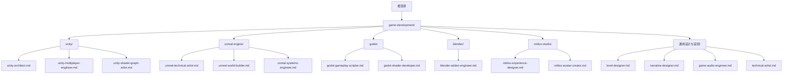

图表来源
- [unity-architect.md](file://game-development/unity/unity-architect.md)
- [unreal-technical-artist.md](file://game-development/unreal-engine/unreal-technical-artist.md)
- [godot-gameplay-scripter.md](file://game-development/godot/godot-gameplay-scripter.md)
- [blender-addon-engineer.md](file://game-development/blender/blender-addon-engineer.md)
- [roblox-experience-designer.md](file://game-development/roblox-studio/roblox-experience-designer.md)
- [level-designer.md](file://game-development/level-designer.md)
- [narrative-designer.md](file://game-development/narrative-designer.md)
- [game-audio-engineer.md](file://game-development/game-audio-engineer.md)
- [technical-artist.md](file://game-development/technical-artist.md)

章节来源
- [unity-architect.md](file://game-development/unity/unity-architect.md)
- [unreal-technical-artist.md](file://game-development/unreal-engine/unreal-technical-artist.md)
- [godot-gameplay-scripter.md](file://game-development/godot/godot-gameplay-scripter.md)
- [blender-addon-engineer.md](file://game-development/blender/blender-addon-engineer.md)
- [roblox-experience-designer.md](file://game-development/roblox-studio/roblox-experience-designer.md)
- [level-designer.md](file://game-development/level-designer.md)
- [narrative-designer.md](file://game-development/narrative-designer.md)
- [game-audio-engineer.md](file://game-development/game-audio-engineer.md)
- [technical-artist.md](file://game-development/technical-artist.md)

## 核心组件
本节概述各代理的核心职责、关键规则与交付物，帮助读者快速定位所需能力与最佳实践。

- Unity 架构师：数据驱动模块化、ScriptableObject 首选、单一起责、场景与序列化规范、反模式警示、DOTS/Addressables/高级 SO 模式、性能剖析与优化。
- Unreal 技术美术：材质函数、Niagara 性能预算、PCG 规范、LOD 与剔除、渲染性能审查、Substrate 材质系统、高级 Niagara 与路径追踪。
- Godot 游戏玩法脚本：信号完整性、静态类型、节点组合、autoload 规则、Typed Array、GDScript/C# 互操作、低层渲染服务器。
- Blender 插件工程师：工具化、资产验证、导出器、命名与变换校验、批处理与可维护性。
- Roblox 经验设计师：平台 UX 与货币化、DataStore 进度、Game Pass/Developer Product、上新流程、留存指标与伦理。
- 关卡设计师：空间叙事、节奏架构、遭遇设计、环境叙事、blockout 文档与可读性检查。
- 叙事设计师：对话写作、分支设计、传说架构、环境叙事简报、故事-玩法对齐矩阵。
- 游戏音频工程师：交互音频、FMOD/Wwise 集成、自适应音乐、空间音频、CPU/内存预算、参数架构。
- 技术美术：着色器、VFX、LOD、纹理管线、资产预算、性能剖析与工具开发。
- Unity 多人工程师：NGO 权威模型、网络变量与 RPC、带宽管理、UGS 集成、抗作弊与回滚。
- Unreal 世界建造：World Partition、景观、HLOD、PCG、大规模流送与性能审查。
- Godot 着色器开发者：CanvasItem/Spatial Shader、VisualShader、CompositorEffect、性能审计。
- Roblox 头像创作者：UGC 规范、附件绑定、纹理标准、Creator Marketplace 提交、头像商店 UI。
- Unity Shader Graph 艺术家：Shader Graph 架构、URP/HDRP 自定义通道、HLSL 优化、复杂度审计。
- Unreal 系统工程师：蓝图/C++ 边界、Nanite 使用约束、GAS 网络就绪、内存管理、Mass 实体。

章节来源
- [unity-architect.md](file://game-development/unity/unity-architect.md)
- [unreal-technical-artist.md](file://game-development/unreal-engine/unreal-technical-artist.md)
- [godot-gameplay-scripter.md](file://game-development/godot/godot-gameplay-scripter.md)
- [blender-addon-engineer.md](file://game-development/blender/blender-addon-engineer.md)
- [roblox-experience-designer.md](file://game-development/roblox-studio/roblox-experience-designer.md)
- [level-designer.md](file://game-development/level-designer.md)
- [narrative-designer.md](file://game-development/narrative-designer.md)
- [game-audio-engineer.md](file://game-development/game-audio-engineer.md)
- [technical-artist.md](file://game-development/technical-artist.md)
- [unity-multiplayer-engineer.md](file://game-development/unity/unity-multiplayer-engineer.md)
- [unreal-world-builder.md](file://game-development/unreal-engine/unreal-world-builder.md)
- [godot-shader-developer.md](file://game-development/godot/godot-shader-developer.md)
- [roblox-avatar-creator.md](file://game-development/roblox-studio/roblox-avatar-creator.md)
- [unity-shader-graph-artist.md](file://game-development/unity/unity-shader-graph-artist.md)
- [unreal-systems-engineer.md](file://game-development/unreal-engine/unreal-systems-engineer.md)

## 架构总览
以下图展示多引擎协作下的典型工作流：从关卡与叙事设计出发，到美术与音频管线，再到引擎实现与多人/平台集成。

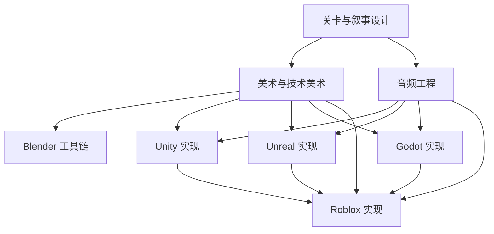

图表来源
- [level-designer.md](file://game-development/level-designer.md)
- [narrative-designer.md](file://game-development/narrative-designer.md)
- [technical-artist.md](file://game-development/technical-artist.md)
- [game-audio-engineer.md](file://game-development/game-audio-engineer.md)
- [blender-addon-engineer.md](file://game-development/blender/blender-addon-engineer.md)
- [unity-architect.md](file://game-development/unity/unity-architect.md)
- [unreal-technical-artist.md](file://game-development/unreal-engine/unreal-technical-artist.md)
- [godot-gameplay-scripter.md](file://game-development/godot/godot-gameplay-scripter.md)
- [roblox-experience-designer.md](file://game-development/roblox-studio/roblox-experience-designer.md)

## 详细组件分析

### Unity 架构师（数据驱动与模块化）
- 能力要点
  - ScriptableObject 首选：事件通道、运行时集合、变量封装
  - 单一起责：每个 MonoBehaviour 解决单一问题
  - 场景与序列化卫生：场景加载视为“干净状态”
  - 反模式警示：God 类、单例滥用、魔法字符串、Update 中逻辑
  - 高级能力：DOTS 数据导向设计、Addressables、高级 SO 模式、性能剖析
- 关键交付
  - FloatVariable、RuntimeSet、GameEvent 通道、自定义 PropertyDrawer
  - 工作流：架构审计 → SO 设计 → 组件分解 → 编辑器工具 → 场景架构
- 成功指标
  - 零 GameObject.Find、MonoBehaviour 小于阈值、Prefab 可独立实例化、共享状态位于 SO
  - 设计师可直接编辑变量、Inspector 显示实时值、无“未保存更改”提示

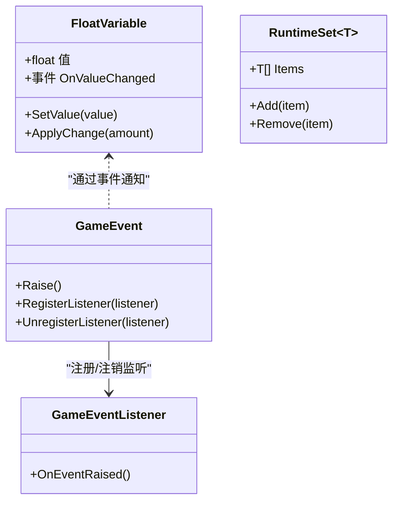

图表来源
- [unity-architect.md](file://game-development/unity/unity-architect.md)

章节来源
- [unity-architect.md](file://game-development/unity/unity-architect.md)

### Unreal 技术美术（材质、Niagara、PCG）
- 能力要点
  - 材质函数复用、材质实例、质量切换
  - Niagara GPU/CPU 模拟、可扩展性配置、碰撞策略
  - PCG 确定性、密度与排除区、Nanite 使用
  - LOD 与剔除、性能审查、Substrate 材质系统
- 关键交付
  - Triplanar 材质函数、地面冲击尘爆、森林生成图、材质复杂度审计、Niagara 可扩展性
- 成功指标
  - 材质指令数达标、Niagara 在最低硬件达标、PCG 生成时间可控、零未 Nanite 合法网格

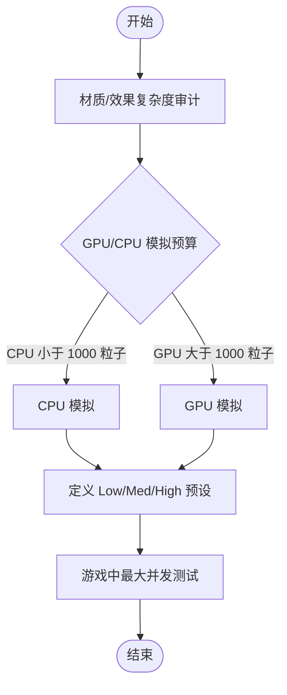

图表来源
- [unreal-technical-artist.md](file://game-development/unreal-engine/unreal-technical-artist.md)

章节来源
- [unreal-technical-artist.md](file://game-development/unreal-engine/unreal-technical-artist.md)

### Godot 游戏玩法脚本（信号与组合）
- 能力要点
  - 信号命名与类型约定、静态类型、节点组合、autoload 规则、Typed Array、跨语言连接
  - 场景树生命周期纪律、隔离测试、资源型数据
- 关键交付
  - Typed 信号声明、EventBus Autoload、组合式玩家、资源数据、GDScript/C# 互连
- 成功指标
  - 无未类型变量、信号参数全类型化、无断开信号、组件小于阈值、场景可独立运行

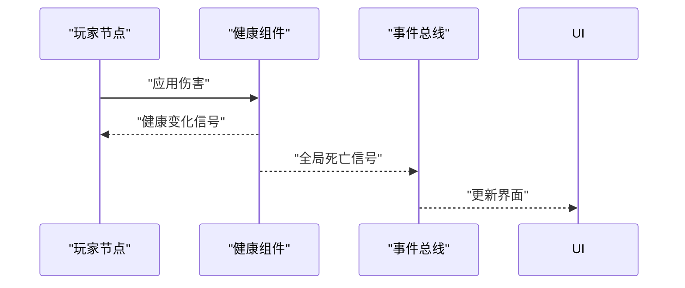

图表来源
- [godot-gameplay-scripter.md](file://game-development/godot/godot-gameplay-scripter.md)

章节来源
- [godot-gameplay-scripter.md](file://game-development/godot/godot-gameplay-scripter.md)

### Blender 插件工程师（工具链自动化）
- 能力要点
  - 数据 API 优先、非破坏性工作流、命名与变换校验、管道可靠性、可维护性
- 关键交付
  - 资产验证器、导出面板、命名审计报告、发布工作流
- 成功指标
  - 重复任务耗时下降、验证捕获错误、批量导出一致性、工具被艺术家自发使用

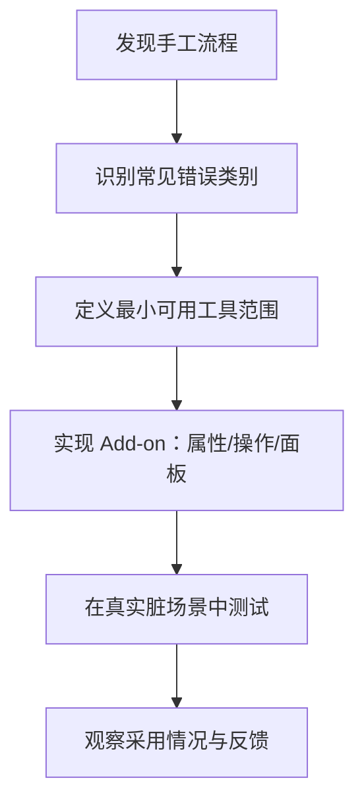

图表来源
- [blender-addon-engineer.md](file://game-development/blender/blender-addon-engineer.md)

章节来源
- [blender-addon-engineer.md](file://game-development/blender/blender-addon-engineer.md)

### Roblox 经验设计师（社交与留存）
- 能力要点
  - 平台设计规则、DataStore 安全、伦理货币化、算法考虑、体验简报、留存指标
- 关键交付
  - Game Pass 购买流程、每日奖励系统、上新流程文档、留存分析
- 成功指标
  - D1/D7 留存达标、转化率达标、零政策违规

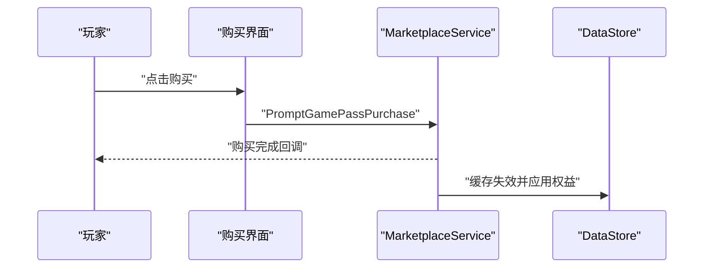

图表来源
- [roblox-experience-designer.md](file://game-development/roblox-studio/roblox-experience-designer.md)

章节来源
- [roblox-experience-designer.md](file://game-development/roblox-studio/roblox-experience-designer.md)

### 关卡设计师（空间叙事与节奏）
- 能力要点
  - 流程与可读性、遭遇设计、环境叙事、blockout 文档
- 关键交付
  - 关卡设计文档、节奏表、blockout 规格、导航可读性检查
- 成功指标
  - 新玩家无需地图即可导航、节奏与测试一致、环境叙事可推断

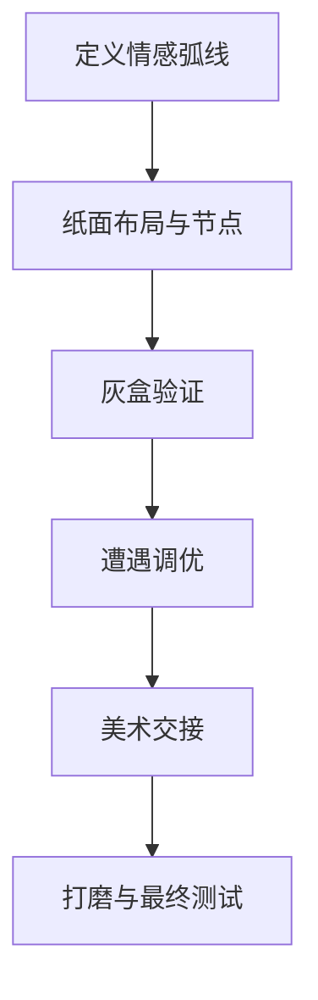

图表来源
- [level-designer.md](file://game-development/level-designer.md)

章节来源
- [level-designer.md](file://game-development/level-designer.md)

### 叙事设计师（故事系统与分支）
- 能力要点
  - 对话写作标准、分支设计、传说架构、环境叙事简报、故事-玩法对齐
- 关键交付
  - 对话语料格式、角色声线模板、传说层级、对齐矩阵、环境叙事简报
- 成功指标
  - 字符辨识度高、选择有可观测后果、表面内容可理解、环境叙事可推断

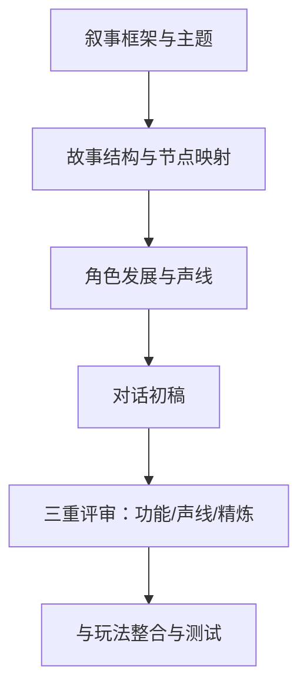

图表来源
- [narrative-designer.md](file://game-development/narrative-designer.md)

章节来源
- [narrative-designer.md](file://game-development/narrative-designer.md)

### 游戏音频工程师（交互音频与预算）
- 能力要点
  - 中间件集成、自适应音乐、空间音频、CPU/内存预算、参数架构
- 关键交付
  - 事件命名规范、Unity/FMOD 集成、参数架构、预算规格、空间音频配置
- 成功指标
  - 无音频导致掉帧、事件均有语音限制与抢占、音乐过渡无缝、空间音频启用

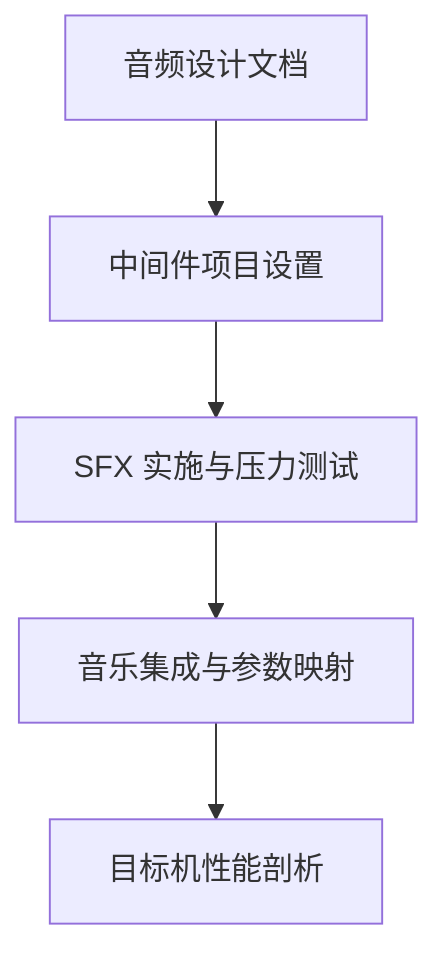

图表来源
- [game-audio-engineer.md](file://game-development/game-audio-engineer.md)

章节来源
- [game-audio-engineer.md](file://game-development/game-audio-engineer.md)

### 技术美术（着色器与管线）
- 能力要点
  - 资产预算、着色器标准、纹理管线、LOD、VFX 审核、工具开发
- 关键交付
  - 资产预算表、自定义着色器、VFX 审核清单、LOD 校验脚本
- 成功指标
  - 无超预算资产、GPU 时间在预算内、移动端着色器有安全变体、VFX 过绘达标

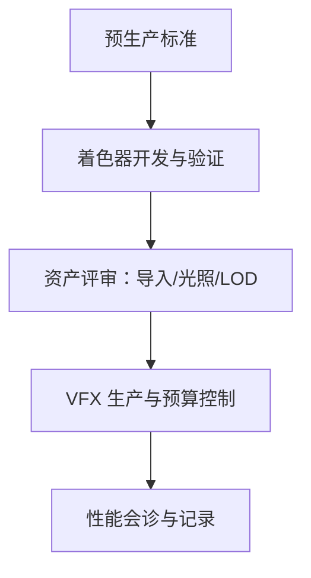

图表来源
- [technical-artist.md](file://game-development/technical-artist.md)

章节来源
- [technical-artist.md](file://game-development/technical-artist.md)

### Unity 多人工程师（权威模型与带宽）
- 能力要点
  - NGO 权威模型、RPC/NetworkVariable、带宽管理、UGS 集成、抗作弊
- 关键交付
  - NGO 设置、权威控制器、大厅匹配、网络变量参考
- 成功指标
  - 无状态漂移、输入经服务端验证、带宽合理、Relay 稳定

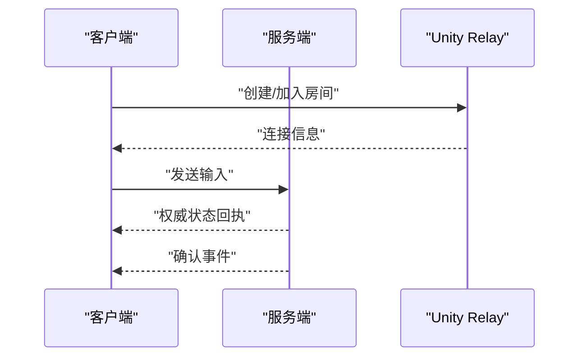

图表来源
- [unity-multiplayer-engineer.md](file://game-development/unity/unity-multiplayer-engineer.md)

章节来源
- [unity-multiplayer-engineer.md](file://game-development/unity/unity-multiplayer-engineer.md)

### Unreal 世界建造（开放世界流送）
- 能力要点
  - World Partition、景观、HLOD、PCG、流送与性能审查
- 关键交付
  - 分区配置、景观材质、HLOD 层、PCG 图、性能审查清单
- 成功指标
  - 无流送抖动、PCG 预烘焙、HLOD 覆盖远距离、景观层不超限

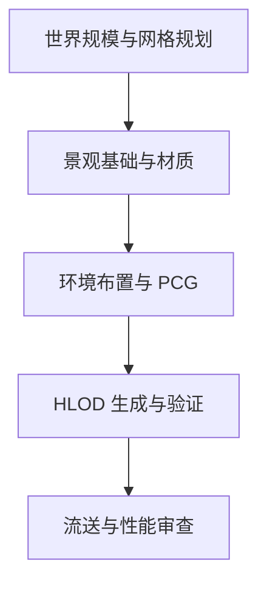

图表来源
- [unreal-world-builder.md](file://game-development/unreal-engine/unreal-world-builder.md)

章节来源
- [unreal-world-builder.md](file://game-development/unreal-engine/unreal-world-builder.md)

### Godot 着色器开发者（GLSL 与 VisualShader）
- 能力要点
  - Shader 类型与渲染器兼容、性能标准、VisualShader 规范、CompositorEffect
- 关键交付
  - 2D/3D 着色器示例、后处理效果、性能审计
- 成功指标
  - 声明 shader_type、统一变量带提示、移动端兼容、效果符合参考

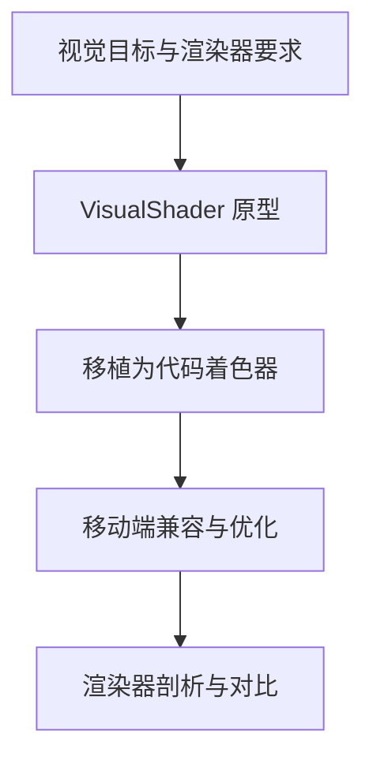

图表来源
- [godot-shader-developer.md](file://game-development/godot/godot-shader-developer.md)

章节来源
- [godot-shader-developer.md](file://game-development/godot/godot-shader-developer.md)

### Roblox 头像创作者（UGC 与合规）
- 能力要点
  - Mesh 规范、纹理标准、附件绑定、UGC 提交、头像商店 UI
- 关键交付
  - 导出检查清单、HumanoidDescription 应用、分层服装笼子、提交准备包
- 成功指标
  - 无技术拒绝、多体型无夹穿、价格符合市场、可叠加分层服装

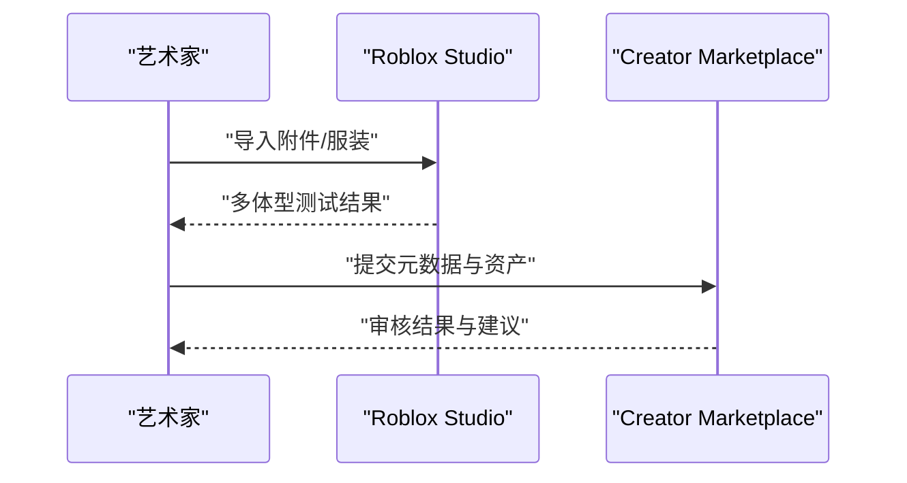

图表来源
- [roblox-avatar-creator.md](file://game-development/roblox-studio/roblox-avatar-creator.md)

章节来源
- [roblox-avatar-creator.md](file://game-development/roblox-studio/roblox-avatar-creator.md)

### Unity Shader Graph 艺术家（可视化与自定义通道）
- 能力要点
  - Shader Graph 架构、URP/HDRP、自定义渲染通道、HLSL 优化、复杂度审计
- 关键交付
  - 溶解 Shader Graph、URP 轮廓通道、优化 HLSL、复杂度审计
- 成功指标
  - 无重复节点、参数有说明、移动端回退存在、源文件版本化

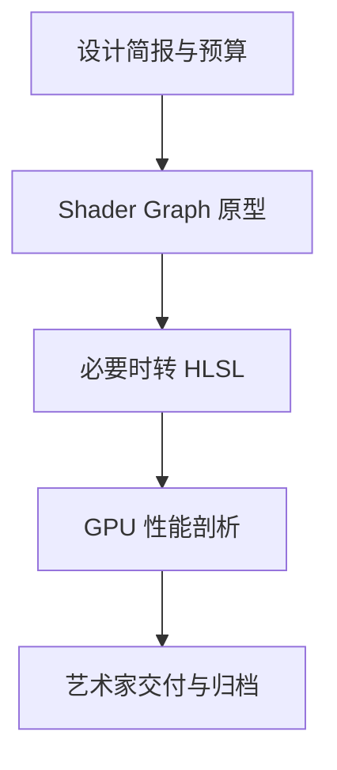

图表来源
- [unity-shader-graph-artist.md](file://game-development/unity/unity-shader-graph-artist.md)

章节来源
- [unity-shader-graph-artist.md](file://game-development/unity/unity-shader-graph-artist.md)

### Unreal 系统工程师（蓝图/C++ 边界与 GAS）
- 能力要点
  - 蓝图/C++ 边界、Nanite 使用约束、GAS 网络就绪、内存管理、Mass 实体
- 关键交付
  - GAS 项目配置、属性集、能力类、Tick 架构、Nanite 校验、智能指针模式
- 成功指标
  - 无蓝图 Tick、Nanite 预算明确、IsValid 检查、帧预算达标

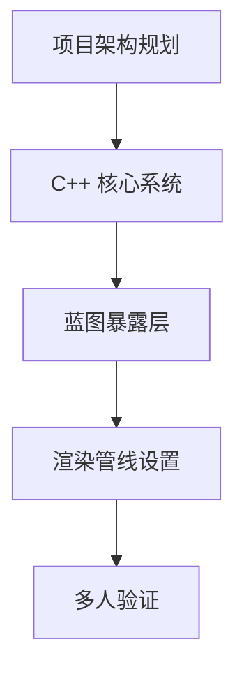

图表来源
- [unreal-systems-engineer.md](file://game-development/unreal-engine/unreal-systems-engineer.md)

章节来源
- [unreal-systems-engineer.md](file://game-development/unreal-engine/unreal-systems-engineer.md)

## 依赖关系分析
多代理协同的关键在于：设计与叙事为上游，美术与音频为中游，引擎实现为下游；不同引擎之间通过工具链与平台特性互补。

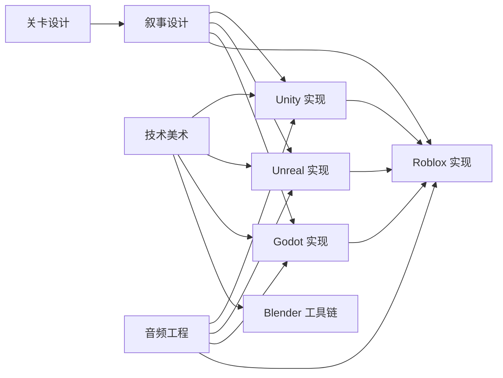

图表来源
- [level-designer.md](file://game-development/level-designer.md)
- [narrative-designer.md](file://game-development/narrative-designer.md)
- [technical-artist.md](file://game-development/technical-artist.md)
- [game-audio-engineer.md](file://game-development/game-audio-engineer.md)
- [blender-addon-engineer.md](file://game-development/blender/blender-addon-engineer.md)
- [unity-architect.md](file://game-development/unity/unity-architect.md)
- [unreal-technical-artist.md](file://game-development/unreal-engine/unreal-technical-artist.md)
- [godot-gameplay-scripter.md](file://game-development/godot/godot-gameplay-scripter.md)
- [roblox-experience-designer.md](file://game-development/roblox-studio/roblox-experience-designer.md)

章节来源
- [level-designer.md](file://game-development/level-designer.md)
- [narrative-designer.md](file://game-development/narrative-designer.md)
- [technical-artist.md](file://game-development/technical-artist.md)
- [game-audio-engineer.md](file://game-development/game-audio-engineer.md)
- [blender-addon-engineer.md](file://game-development/blender/blender-addon-engineer.md)
- [unity-architect.md](file://game-development/unity/unity-architect.md)
- [unreal-technical-artist.md](file://game-development/unreal-engine/unreal-technical-artist.md)
- [godot-gameplay-scripter.md](file://game-development/godot/godot-gameplay-scripter.md)
- [roblox-experience-designer.md](file://game-development/roblox-studio/roblox-experience-designer.md)

## 性能考量
- 统一性能基线：每引擎设定 CPU/内存/过绘预算，定期进行目标机剖析，形成“预算—实现—验证”的闭环。
- 跨引擎一致性：在多引擎项目中，统一命名与参数体系（如音频参数、材质参数），减少沟通成本与回归风险。
- 工具化降本增效：通过 Blender 插件、Unity Shader Graph、Unreal/UE5 工具链自动化，降低重复劳动与手误。
- 平台差异化：移动端优先考虑采样次数、指令数与内存占用；主机/PC 注重细节与特效数量平衡。

## 故障排查指南
- Unity 架构
  - 症状：场景切换后状态异常、MonoBehaviour 过大、Inspector 有未保存更改
  - 排查：检查是否使用 SO 存储状态、是否拆分组件、是否调用 SetDirty
- Unreal 技术美术
  - 症状：Niagara 过载、材质 permutation 爆炸、PCG 生成卡顿
  - 排查：核对 GPU/CPU 预算、质量开关、PCG 参数与排除区
- Godot 游戏玩法
  - 症状：信号断开、未类型变量、场景依赖父节点
  - 排查：统一命名与类型、使用 @onready、避免 get_node
- Blender 工具链
  - 症状：导出失败、命名冲突、材质槽缺失
  - 排查：应用变换、命名审计、材料槽顺序
- Roblox 经验
  - 症状：购买流程中断、进度丢失、留存低
  - 排查：DataStore 写入、购买回调、A/B 测试与漏斗分析
- 关卡与叙事
  - 症状：玩家迷路、分支无后果、环境叙事不清
  - 排查：可读性检查、分支收敛、环境叙事简报
- 音频
  - 症状：掉帧、语音抢占不当、空间音频无效
  - 排查：事件预算、参数映射、空间音频启用
- 技术美术
  - 症状：过绘超标、LOD 不平滑、着色器复杂度高
  - 排查：预算表、LOD 验证、移动端回退
- Unity 多人
  - 症状：状态漂移、带宽过高、Relay 失败
  - 排查：权威模型、带宽节流、输入验证
- Unreal 世界建造
  - 症状：流送抖动、HLOD 可视化异常、PCG 运行时生成卡顿
  - 排查：分区网格、HLOD 重建、PCG 预烘焙
- Godot 着色器
  - 症状：移动端掉帧、兼容性错误、SCREEN_TEXTURE 触发拷贝
  - 排查：采样次数、渲染器要求、替代方案
- Roblox 头像
  - 症状：附件夹穿、纹理版权问题、提交被拒
  - 排查：多体型测试、纹理合规、Mesh 规范
- Unity Shader Graph
  - 症状：节点重复、参数未说明、移动端回退缺失
  - 排查：子图封装、参数提示、回退变体
- Unreal 系统
  - 症状：蓝图 Tick 影响帧率、Nanite 超限、GC 泄漏
  - 排查：C++ Tick、Nanite 预算、智能指针与 IsValid

章节来源
- [unity-architect.md](file://game-development/unity/unity-architect.md)
- [unreal-technical-artist.md](file://game-development/unreal-engine/unreal-technical-artist.md)
- [godot-gameplay-scripter.md](file://game-development/godot/godot-gameplay-scripter.md)
- [blender-addon-engineer.md](file://game-development/blender/blender-addon-engineer.md)
- [roblox-experience-designer.md](file://game-development/roblox-studio/roblox-experience-designer.md)
- [level-designer.md](file://game-development/level-designer.md)
- [narrative-designer.md](file://game-development/narrative-designer.md)
- [game-audio-engineer.md](file://game-development/game-audio-engineer.md)
- [technical-artist.md](file://game-development/technical-artist.md)
- [unity-multiplayer-engineer.md](file://game-development/unity/unity-multiplayer-engineer.md)
- [unreal-world-builder.md](file://game-development/unreal-engine/unreal-world-builder.md)
- [godot-shader-developer.md](file://game-development/godot/godot-shader-developer.md)
- [roblox-avatar-creator.md](file://game-development/roblox-studio/roblox-avatar-creator.md)
- [unity-shader-graph-artist.md](file://game-development/unity/unity-shader-graph-artist.md)
- [unreal-systems-engineer.md](file://game-development/unreal-engine/unreal-systems-engineer.md)

## 结论
通过将各引擎与职能代理标准化、工具化与流程化，团队可在多引擎协作中实现高质量、可维护且可扩展的交付。关键在于：以设计与叙事为纲，以工具与预算为目，以引擎实现为实，持续进行性能剖析与跨引擎一致性治理。上述代理能力与最佳实践可作为项目启动、迭代与上线的参考蓝本。

## 附录
- 开发流程建议
  - 设计阶段：产出关卡与叙事文档，明确节奏与分支
  - 美术阶段：建立预算与规范，工具链自动化
  - 音频阶段：参数化与预算控制，中间件集成
  - 引擎阶段：模块化实现、权威模型、性能剖析
  - 平台阶段：合规与提交、留存与货币化
- 实际项目案例
  - Unity：数据驱动架构 + DOTS + Addressables 的大型项目
  - Unreal：UE5 世界建造 + Nanite + Lumen 的开放世界
  - Godot：2D/3D 轻量项目，信号驱动与 Shader Graph
  - Roblox：UGC 头像管线 + 经验留存与货币化
  - Blender：资产验证与导出器，批量处理与命名审计