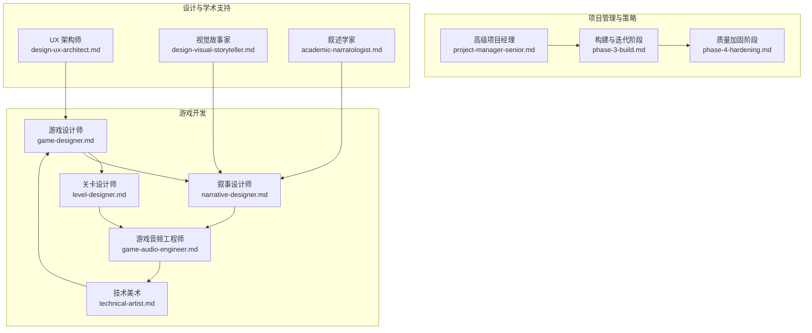
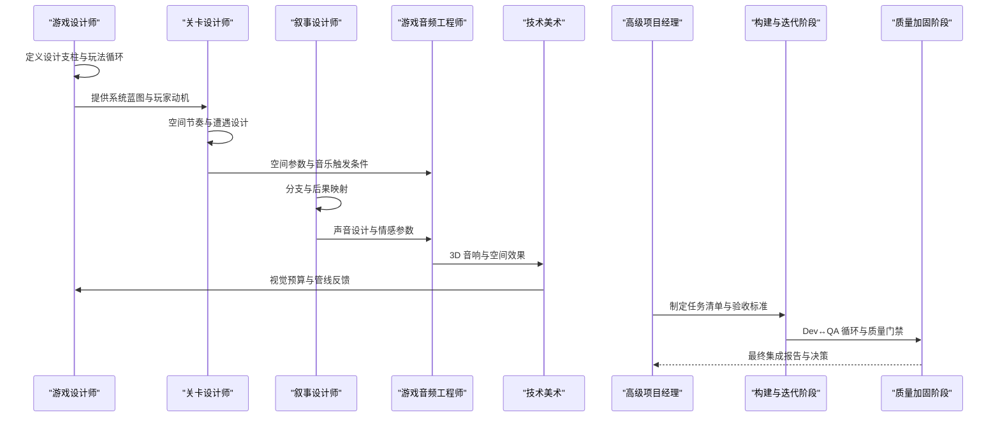
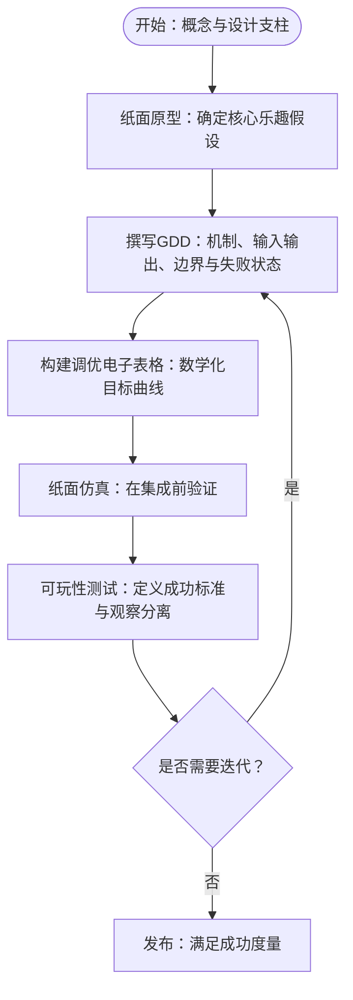
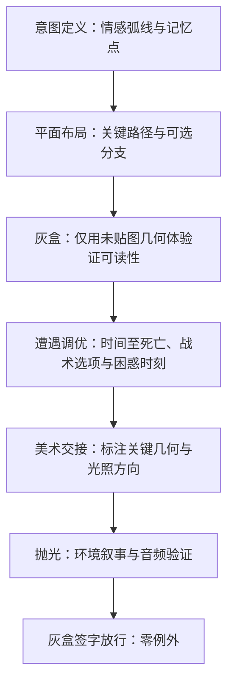
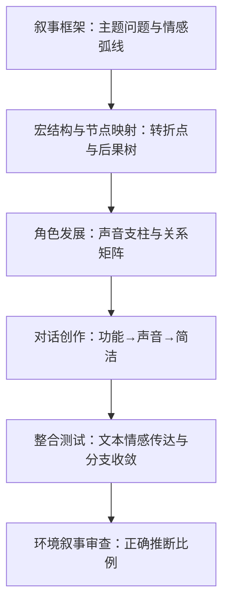
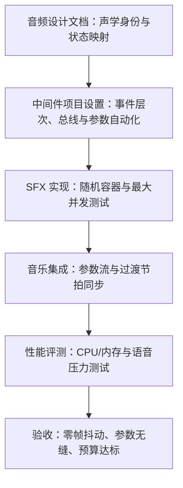
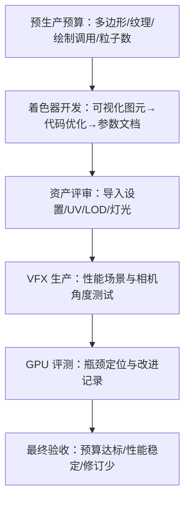
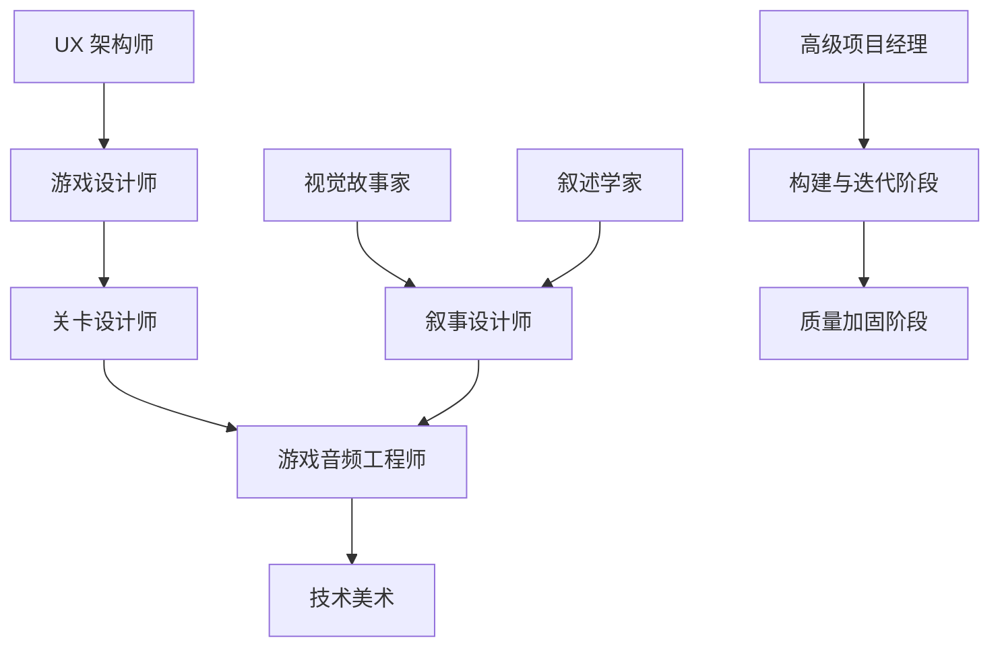
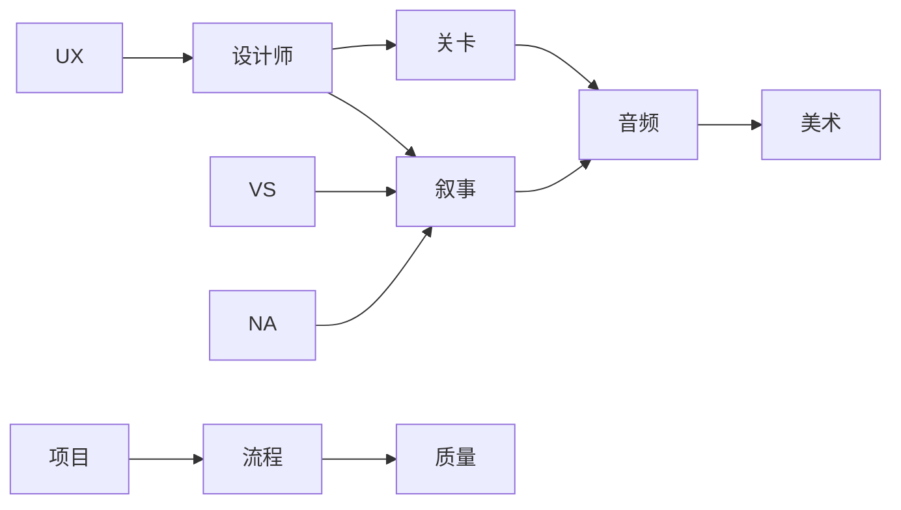

# 游戏设计专业代理

<cite>
**本文档引用的文件**
- [game-designer.md](file://game-development/game-designer.md)
- [level-designer.md](file://game-development/level-designer.md)
- [narrative-designer.md](file://game-development/narrative-designer.md)
- [game-audio-engineer.md](file://game-development/game-audio-engineer.md)
- [technical-artist.md](file://game-development/technical-artist.md)
- [project-manager-senior.md](file://project-management/project-manager-senior.md)
- [phase-3-build.md](file://strategy/playbooks/phase-3-build.md)
- [phase-4-hardening.md](file://strategy/playbooks/phase-4-hardening.md)
- [workflow-book-chapter.md](file://examples/workflow-book-chapter.md)
- [academic-narratologist.md](file://academic/academic-narratologist.md)
- [design-ux-architect.md](file://design/design-ux-architect.md)
- [design-visual-storyteller.md](file://design/design-visual-storyteller.md)
</cite>

## 目录
1. [引言](#引言)
2. [项目结构](#项目结构)
3. [核心组件](#核心组件)
4. [架构总览](#架构总览)
5. [详细组件分析](#详细组件分析)
6. [依赖关系分析](#依赖关系分析)
7. [性能考量](#性能考量)
8. [故障排除指南](#故障排除指南)
9. [结论](#结论)
10. [附录](#附录)

## 引言
本文件面向游戏设计专业代理，系统梳理游戏设计师、关卡设计师、叙事设计师、游戏音频工程师、技术美术等专业角色的职责边界、工作流规范与交付物标准，并结合项目管理与跨学科协作策略，形成可执行的设计—工程—测试闭环。文档既强调理论深度（游戏设计理论、关卡设计原则、叙事结构、音频设计元素、技术美术流程），也注重实践落地（工具链、预算约束、质量门禁、迭代节奏）。

## 项目结构
该仓库采用“按职能域划分”的组织方式，游戏开发相关代理集中在 game-development 目录下，配套有项目管理、策略流程、设计与学术支持等模块，便于跨职能协作与标准化交付。

图表来源
- [game-designer.md:1-168](file://game-development/game-designer.md#L1-L168)
- [level-designer.md:1-209](file://game-development/level-designer.md#L1-L209)
- [narrative-designer.md:1-244](file://game-development/narrative-designer.md#L1-L244)
- [game-audio-engineer.md:1-265](file://game-development/game-audio-engineer.md#L1-L265)
- [technical-artist.md:1-230](file://game-development/technical-artist.md#L1-L230)
- [project-manager-senior.md:1-136](file://project-management/project-manager-senior.md#L1-L136)
- [phase-3-build.md:1-287](file://strategy/playbooks/phase-3-build.md#L1-L287)
- [phase-4-hardening.md:1-333](file://strategy/playbooks/phase-4-hardening.md#L1-L333)
- [design-ux-architect.md:1-469](file://design/design-ux-architect.md#L1-L469)
- [design-visual-storyteller.md:1-149](file://design/design-visual-storyteller.md#L1-L149)
- [academic-narratologist.md:1-119](file://academic/academic-narratologist.md#L1-L119)

章节来源
- [game-designer.md:1-168](file://game-development/game-designer.md#L1-L168)
- [level-designer.md:1-209](file://game-development/level-designer.md#L1-L209)
- [narrative-designer.md:1-244](file://game-development/narrative-designer.md#L1-L244)
- [game-audio-engineer.md:1-265](file://game-development/game-audio-engineer.md#L1-L265)
- [technical-artist.md:1-230](file://game-development/technical-artist.md#L1-L230)
- [project-manager-senior.md:1-136](file://project-management/project-manager-senior.md#L1-L136)
- [phase-3-build.md:1-287](file://strategy/playbooks/phase-3-build.md#L1-L287)
- [phase-4-hardening.md:1-333](file://strategy/playbooks/phase-4-hardening.md#L1-L333)
- [design-ux-architect.md:1-469](file://design/design-ux-architect.md#L1-L469)
- [design-visual-storyteller.md:1-149](file://design/design-visual-storyteller.md#L1-L149)
- [academic-narratologist.md:1-119](file://academic/academic-narratologist.md#L1-L119)

## 核心组件
本节概述各专业代理的核心职责、关键交付物与成功度量指标，帮助团队在跨学科协作中明确角色边界与协作路径。

- 游戏设计师：系统与机制架构师，负责 GDD 编写、玩家动机驱动的设计、经济平衡与玩法循环设计。
- 关卡设计师：空间叙事与节奏专家，负责布局理论、节奏架构、遭遇设计与环境叙事。
- 叙事设计师：故事系统与对话架构师，负责 GDD 对齐的叙事设计、分支对话、 lore 架构与环境叙事。
- 游戏音频工程师：交互音频专家，负责 FMOD/Wwise 集成、自适应音乐系统、空间音频与性能预算。
- 技术美术：艺术到引擎管线专家，负责着色器、VFX 系统、LOD 管线、性能预算与跨引擎资产优化。

章节来源
- [game-designer.md:13-168](file://game-development/game-designer.md#L13-L168)
- [level-designer.md:13-209](file://game-development/level-designer.md#L13-L209)
- [narrative-designer.md:13-244](file://game-development/narrative-designer.md#L13-L244)
- [game-audio-engineer.md:13-265](file://game-development/game-audio-engineer.md#L13-L265)
- [technical-artist.md:13-230](file://game-development/technical-artist.md#L13-L230)

## 架构总览
从“创意—设计—实现—验证”的角度，建立跨职能协作的系统化流程。游戏设计师产出系统蓝图与经济模型；关卡设计师将其转化为可体验的空间叙事；叙事设计师确保故事与玩法无缝衔接；音频工程师与技术美术分别负责听觉沉浸与视觉表现力的实现与优化；项目管理与策略流程保障迭代节奏与质量门禁。

图表来源
- [game-designer.md:103-168](file://game-development/game-designer.md#L103-L168)
- [level-designer.md:139-209](file://game-development/level-designer.md#L139-L209)
- [narrative-designer.md:176-244](file://game-development/narrative-designer.md#L176-L244)
- [game-audio-engineer.md:198-265](file://game-development/game-audio-engineer.md#L198-L265)
- [technical-artist.md:162-230](file://game-development/technical-artist.md#L162-L230)
- [project-manager-senior.md:19-136](file://project-management/project-manager-senior.md#L19-L136)
- [phase-3-build.md:19-287](file://strategy/playbooks/phase-3-build.md#L19-L287)
- [phase-4-hardening.md:30-333](file://strategy/playbooks/phase-4-hardening.md#L30-L333)

## 详细组件分析

### 游戏设计师分析
- 设计理念与玩家动机：以“循环、杠杆、动机”思考系统，从玩家感受出发定义系统目标。
- 设计文档标准：每个机制需包含目的、玩家体验目标、输入输出、边界情况与失败状态；经济变量必须有理由，避免魔法数字。
- 平衡流程：数值以假设标注，配合调优电子表格；定义“崩盘”标准以便识别问题。
- 核心交付物：核心循环文档、经济平衡表、新手引导清单、机制规格书。
- 工作流：概念→设计支柱→纸面原型→GDD→平衡迭代→可玩性测试。
- 成功度量：每项已发布机制均有无歧义的 GDD；可操作的调优建议；经济健康；首测新玩家通关率>90%；核心循环独立可玩。

图表来源
- [game-designer.md:103-168](file://game-development/game-designer.md#L103-L168)

章节来源
- [game-designer.md:13-168](file://game-development/game-designer.md#L13-L168)

### 关卡设计师分析
- 空间叙事与节奏：将走廊视为句子、房间为段落、关卡为完整论点；通过空间传达玩家应感受到的情绪。
- 可读性与可导航性：关键路径必须视觉清晰；光照、色彩与几何引导注意力；每个交叉口提供明确主路径与可选奖励路径。
- 遭遇设计：每次战斗需具备可读进入时间、多种战术选择与后备位置；难度优先由空间决定。
- 环境叙事：每个区域通过道具布置、光照与几何讲述故事；破坏与磨损需与世界历史一致。
- 三阶段交付：灰盒（blockout）→布景（dress）→抛光（polish）；所有布局变更需记录前后截图与测试观察。
- 核心交付物：关卡设计文档、节奏图、灰盒规范、导航可读性检查清单。
- 工作流：意图定义→平面布局→灰盒→遭遇调优→美术交接→抛光验证。
- 成功度量：100% 的测试者无需求助即可导航关键路径；节奏图与实际测试时间偏差≤20%；每处遭遇至少两种可行战术；环境叙事被>70%的测试者正确推断。

图表来源
- [level-designer.md:139-209](file://game-development/level-designer.md#L139-L209)

章节来源
- [level-designer.md:13-209](file://game-development/level-designer.md#L13-L209)

### 叙事设计师分析
- 故事系统与对话架构：将叙事视为与玩法不可分割的系统；对话需像真人所说，分支需有意义且收敛。
- 世界架构：层级化 lore（表面/探索者/深度），确保关键路径无需收集品即可理解；维护世界圣经一致性。
- 系统整合：重大剧情必须有玩法后果或机制变化；教程与新手引导需有叙事动机；玩家在故事中的自由度应与玩法中的自由度匹配。
- 核心交付物：对话节点格式（Ink/Yarn）、角色声音支柱模板、lore 架构地图、叙事-玩法对齐矩阵、环境叙事简报。
- 工作流：叙事框架→故事结构与节点映射→角色发展→对话创作→整合与测试。
- 成功度量：90%+ 的测试者能从对话中正确识别角色个性；所有分支在2场内产生可观测后果；关键路径故事无需 Tier 2/3 lore 即可理解；零“如你所知”式对话；环境叙事被>70%的测试者正确推断。

图表来源
- [narrative-designer.md:176-244](file://game-development/narrative-designer.md#L176-L244)

章节来源
- [narrative-designer.md:13-244](file://game-development/narrative-designer.md#L13-L244)

### 游戏音频工程师分析
- 交互音频架构：所有游戏音频通过中间件事件系统（FMOD/Wwise）；SFX 通过命名事件触发；参数由游戏系统经参数 API 设置。
- 性能预算：定义语音数限制、优先级与抢占模式；压缩格式按类型分配；流式策略与内存策略明确。
- 自适应音乐：定义紧张度参数（0–1），随玩法状态平滑过渡；中性层持续播放；基于茎的水平重编排优于垂直叠加。
- 空间音频：世界空间 SFX 必须使用 3D 定位；遮挡与阻塞通过射线驱动参数；混响区与视觉环境匹配。
- 核心交付物：FMOD 事件命名约定、Unity/FMOD 集成示例、自适应音乐参数架构、音频预算规范、空间音频配置。
- 工作流：音频设计文档→中间件项目设置→SFX 实现→音乐集成→性能评测。
- 成功度量：零音频导致帧抖动；所有事件配置语音限制与抢占模式；音乐过渡无缝；音频内存预算达标；遮挡与混响激活于所有世界空间声源。

图表来源
- [game-audio-engineer.md:198-265](file://game-development/game-audio-engineer.md#L198-L265)

章节来源
- [game-audio-engineer.md:13-265](file://game-development/game-audio-engineer.md#L13-L265)

### 技术美术分析
- 视觉保真与性能平衡：在硬性性能预算内维持视觉质量；编写与优化着色器；构建实时 VFX；定义资产管线标准。
- 性能预算强制：每类资产有明确预算（多边形、纹理、绘制调用、粒子数）；透明/加成粒子需审计与上限控制；所有英雄网格至少四阶 LOD。
- 着色器标准：自定义着色器需提供移动端安全变体或明确平台限制；参数需在材质检查器中带提示文档。
- 纹理管线：按源分辨率导入，平台特定覆盖降采样；UI 使用纹理图集；法线图生成规则明确；默认压缩格式按平台设定。
- 核心交付物：资产预算规格表、自定义着色器示例、VFX 性能审核清单、LOD 验证脚本。
- 工作流：预生产标准→着色器开发→资产评审→VFX 生产→性能分流诊断。
- 成功度量：无资产超出 LOD 预算；最低目标硬件上渲染帧时长在预算内；所有自定义着色器具备移动端安全变体或平台限制；VFX 过度绘制不超过平台预算；管线修订周期<1 次/资产。

图表来源
- [technical-artist.md:162-230](file://game-development/technical-artist.md#L162-L230)

章节来源
- [technical-artist.md:13-230](file://game-development/technical-artist.md#L13-L230)

### 概念总览
- 跨学科协作：游戏设计师提供系统蓝图；关卡设计师将其转化为可体验的空间；叙事设计师确保故事与玩法一致；音频与美术分别负责听觉与视觉沉浸；项目管理与策略流程保障迭代与质量门禁。
- 项目管理方法：将规格转化为具体任务；明确验收标准；学习过往经验；避免范围蔓延；以开发者视角思考任务可执行性。
- 策略流程：构建与迭代阶段采用 Dev↔QA 循环，质量加固阶段进行最终集成验证与门禁决策。

图表来源
- [project-manager-senior.md:19-136](file://project-management/project-manager-senior.md#L19-L136)
- [phase-3-build.md:19-287](file://strategy/playbooks/phase-3-build.md#L19-L287)
- [phase-4-hardening.md:30-333](file://strategy/playbooks/phase-4-hardening.md#L30-L333)
- [design-ux-architect.md:19-469](file://design/design-ux-architect.md#L19-L469)
- [design-visual-storyteller.md:19-149](file://design/design-visual-storyteller.md#L19-L149)
- [academic-narratologist.md:19-119](file://academic/academic-narratologist.md#L19-L119)

## 依赖关系分析
- 设计到实现的依赖：游戏设计师→关卡设计师→音频工程师→技术美术；叙事设计师贯穿所有环节，确保故事与玩法一致。
- 项目管理与流程依赖：高级项目经理→构建与迭代阶段→质量加固阶段；QA 团队与证据收集贯穿每个阶段。
- 支持性依赖：UX 架构师与视觉故事家为设计提供基础与传播支持；叙述学家为叙事提供理论框架。

图表来源
- [game-designer.md:103-168](file://game-development/game-designer.md#L103-L168)
- [level-designer.md:139-209](file://game-development/level-designer.md#L139-L209)
- [narrative-designer.md:176-244](file://game-development/narrative-designer.md#L176-L244)
- [game-audio-engineer.md:198-265](file://game-development/game-audio-engineer.md#L198-L265)
- [technical-artist.md:162-230](file://game-development/technical-artist.md#L162-L230)
- [project-manager-senior.md:19-136](file://project-management/project-manager-senior.md#L19-L136)
- [phase-3-build.md:19-287](file://strategy/playbooks/phase-3-build.md#L19-L287)
- [phase-4-hardening.md:30-333](file://strategy/playbooks/phase-4-hardening.md#L30-L333)
- [design-ux-architect.md:19-469](file://design/design-ux-architect.md#L19-L469)
- [design-visual-storyteller.md:19-149](file://design/design-visual-storyteller.md#L19-L149)
- [academic-narratologist.md:19-119](file://academic/academic-narratologist.md#L19-L119)

## 性能考量
- 游戏音频：严格语音数与优先级配置，压缩格式按类型与平台设定，过渡节拍同步，空间音频射线数量与更新频率受限。
- 技术美术：透明/加成粒子过度绘制审计，LOD 链验证，着色器复杂度可视化，纹理压缩与 mipmap 规则，GPU 性能评测与瓶颈定位。
- 关卡设计：灰盒阶段即验证可读性，避免美术阶段补救；环境叙事与导航一致性测试。
- 叙事设计：分支收敛与后果可见性测试，避免“如你所知”式对话，世界架构一致性审查。
- 项目管理：Dev↔QA 循环与质量门禁，避免范围蔓延，以开发者视角制定任务。

## 故障排除指南
- 音频问题：若出现帧抖动，检查语音数与抢占模式配置；确认事件命名与参数 API 使用；验证过渡节拍同步与流式策略。
- 美术问题：若帧时长超预算，检查过度绘制层数与粒子数；验证 LOD 链与过渡距离；核对纹理压缩与 mipmap 设置。
- 关卡问题：若测试者迷路，检查光照对比度与关键路径标识；确保每个交叉口提供清晰主路径与可选奖励路径。
- 叙事问题：若分支无意义，重新映射后果树；确保每个选择在功能上不同；避免强制收敛但缺乏设计说明。
- 项目问题：若任务反复返工，检查验收标准与任务拆分粒度；确保任务列表来自精确规格；避免奢侈品需求。

章节来源
- [game-audio-engineer.md:28-265](file://game-development/game-audio-engineer.md#L28-L265)
- [technical-artist.md:28-230](file://game-development/technical-artist.md#L28-L230)
- [level-designer.md:28-209](file://game-development/level-designer.md#L28-L209)
- [narrative-designer.md:28-244](file://game-development/narrative-designer.md#L28-L244)
- [project-manager-senior.md:39-136](file://project-management/project-manager-senior.md#L39-L136)

## 结论
通过将游戏设计专业代理的职责、交付物与工作流标准化，并结合项目管理与策略流程的质量门禁，可以有效提升跨学科协作效率与产品整体质量。建议在实践中坚持“玩家动机驱动设计、空间可读性优先、故事与玩法一致、音频与美术性能平衡”的原则，持续迭代并以数据驱动决策。

## 附录
- 项目管理与协作参考：高级项目经理的任务分解模板、构建与迭代阶段的 Dev↔QA 循环、质量加固阶段的最终集成验证。
- 学术与设计支持：叙述学家的结构分析框架、UX 架构师的 CSS 设计系统与布局框架、视觉故事家的跨平台视觉叙事策略。

章节来源
- [project-manager-senior.md:53-136](file://project-management/project-manager-senior.md#L53-L136)
- [phase-3-build.md:19-287](file://strategy/playbooks/phase-3-build.md#L19-L287)
- [phase-4-hardening.md:257-333](file://strategy/playbooks/phase-4-hardening.md#L257-L333)
- [academic-narratologist.md:48-119](file://academic/academic-narratologist.md#L48-L119)
- [design-ux-architect.md:62-469](file://design/design-ux-architect.md#L62-L469)
- [design-visual-storyteller.md:47-149](file://design/design-visual-storyteller.md#L47-L149)
- [workflow-book-chapter.md:1-56](file://examples/workflow-book-chapter.md#L1-L56)